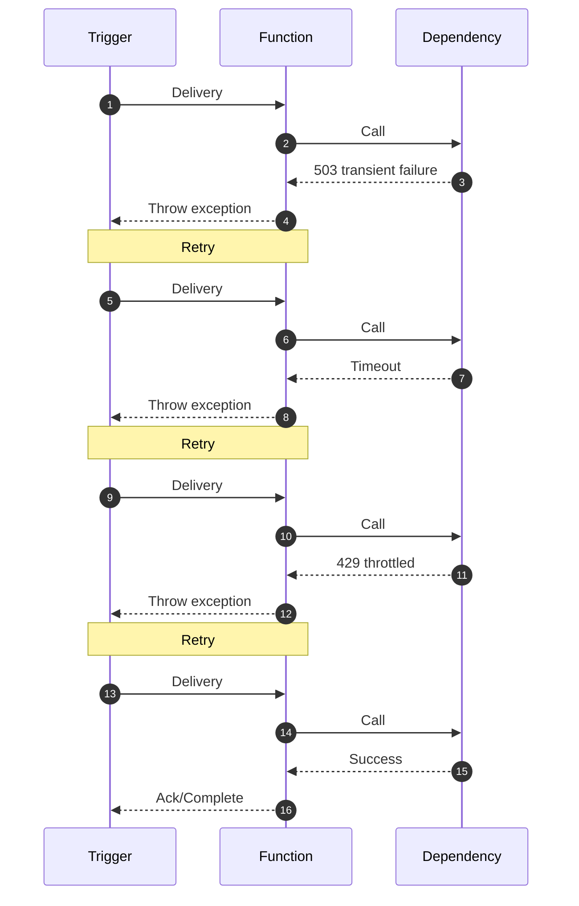
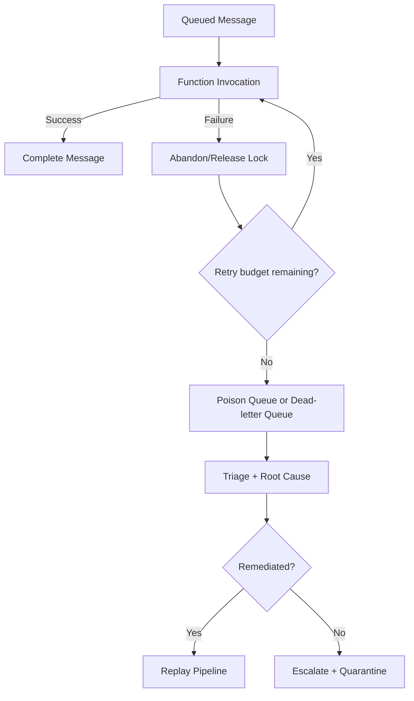
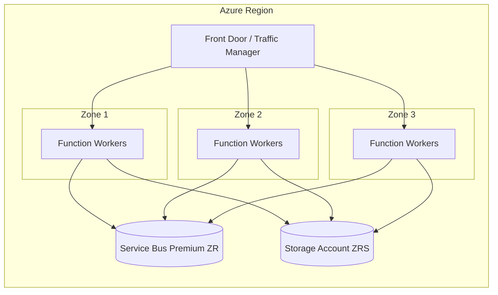
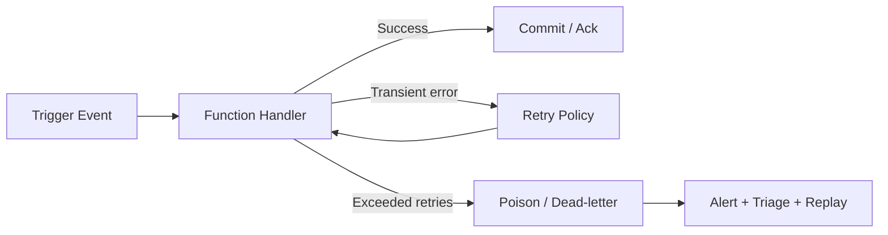

# Reliability
Reliability in Azure Functions is a design concern, not only an operations concern. Your trigger model, hosting plan, retry policy, and network topology jointly determine failure behavior.
## Prerequisites
Before you finalize reliability design decisions, verify these prerequisites:
- You know the trigger semantics for each workload (at-most-once, at-least-once, checkpoint-driven).
- You have a defined business SLO/SLA for latency, recovery time, and acceptable data loss.
- You can map each critical dependency (storage, messaging, identity, database, DNS, network).
- You have access to Azure CLI (`az`) and monitoring telemetry (Application Insights, Metrics, Log Analytics).
- You have ownership for poison/dead-letter triage and replay procedures.

## Main Content
### Reliability layers
Design for reliability across four layers:
1. **Trigger semantics** (delivery guarantees, retries, checkpointing)
2. **Function behavior** (idempotency, timeout, exception handling)
3. **Platform behavior** (scale transitions, zone support, host restarts)
4. **Dependency behavior** (throttling, transient failure, private network reachability)

### Retry strategy
Azure Functions supports built-in retry behavior for supported triggers.
Common retry models:
- Fixed delay retry
- Exponential backoff retry
Use retries for transient failures only. Non-transient failures should route to dead-letter/poison handling paths.

#### Cross-language retry annotation patterns
=== "Python"
    ```python
    import azure.functions as func
    app = func.FunctionApp()

    @app.function_name(name="ProcessQueue")
    @app.queue_trigger(arg_name="msg", queue_name="orders", connection="AzureWebJobsStorage")
    def process_queue(msg: func.QueueMessage) -> None:
        # Handle message idempotently; raise on transient failures
        pass
    ```
=== "Node.js"
    ```javascript
    const { app } = require('@azure/functions');

    app.storageQueue('processQueue', {
      queueName: 'orders',
      connection: 'AzureWebJobsStorage',
      handler: async (message, context) => {
        // Handle idempotently
      }
    });
    ```
=== ".NET (Isolated)"
    ```csharp
    using Microsoft.Azure.Functions.Worker;

    public class ProcessQueue
    {
        [Function("ProcessQueue")]
        public void Run([QueueTrigger("orders", Connection = "AzureWebJobsStorage")] string message)
        {
            // Handle idempotently
        }
    }
    ```

#### Retry flow with exponential backoff timing


#### host.json retry configuration examples
Use these examples as host-level reliability templates. Trigger-level retry declarations still apply where supported by language/runtime bindings.

**Fixed delay retry config**
```json
{
  "version": "2.0",
  "extensions": {
    "serviceBus": {
      "clientRetryOptions": {
        "mode": "fixed",
        "tryTimeout": "00:01:00",
        "delay": "00:00:05",
        "maxDelay": "00:00:05",
        "maxRetries": 5
      }
    }
  }
}
```

**Exponential backoff retry config**
```json
{
  "version": "2.0",
  "extensions": {
    "serviceBus": {
      "clientRetryOptions": {
        "mode": "exponential",
        "tryTimeout": "00:01:00",
        "delay": "00:00:02",
        "maxDelay": "00:01:00",
        "maxRetries": 8
      }
    }
  }
}
```

**Max retry count settings**
```json
{
  "version": "2.0",
  "extensions": {
    "queues": {
      "maxDequeueCount": 8,
      "visibilityTimeout": "00:00:30",
      "batchSize": 16,
      "newBatchThreshold": 8
    }
  }
}
```

!!! note "Retry scope matters"
    `clientRetryOptions` affects communication between the Functions host and the messaging service client.
    Trigger execution retries are configured by trigger/runtime support.

### Poison message handling
For queue-based triggers, repeated failure eventually moves messages to poison/dead-letter paths (service-specific behavior).
Design requirements:
- preserve original payload and correlation metadata,
- alert on poison queue growth,
- provide replay workflow after remediation,
- prevent infinite retry loops.

!!! warning "Do not drop poison messages"
    Poison events are high-signal reliability data. Route them to explicit triage and replay pipelines.

#### Queue-specific poison behaviors
**Storage Queue trigger**
- Every failed processing attempt increments `dequeueCount`.
- When `dequeueCount` exceeds `maxDequeueCount`, the runtime moves the message to `<queue-name>-poison`.
- Preserve these fields for replay and forensics:
    - `id`
    - `dequeueCount`
    - `insertionTime`
    - `nextVisibleTime`
    - custom `correlationId` (if present)

**Service Bus trigger**
- Messages are dead-lettered after max delivery count or explicit dead-letter action.
- Capture `deadLetterReason` and `deadLetterErrorDescription` before replay.
- Typical reasons include lock lost, deserialization failure, or business validation failure.



### Timeout design
Timeout boundaries are part of reliability behavior.

| Plan | Default | Maximum |
|---|---:|---:|
| Consumption (classic) | 5 min | 10 min |
| Flex Consumption | 30 min | Unbounded |
| Premium | 30 min (common default) | Unbounded |
| Dedicated | 30 min (common default) | Unbounded |

If your business process exceeds timeout bounds, redesign to asynchronous orchestration.

### Availability zones and high availability
Zone-aware architecture options are strongest on Premium and Dedicated plans.
- Premium and Dedicated can be designed for zone-resilient deployments (region permitting).
- Zone-resilient design should include zone-redundant dependencies (storage, messaging, data stores).
- Flex and Consumption designs should emphasize retry/idempotency and multi-region recovery patterns where needed.



### Idempotency is mandatory
Because retries and duplicate deliveries are normal in distributed systems, handlers must be idempotent.
Idempotency patterns:
- deterministic operation keys,
- upsert instead of blind insert,
- de-duplication table/cache,
- exactly-once effects at domain boundary where feasible.

#### Python idempotency example
```python
import json
from datetime import datetime, timezone
import azure.functions as func
from azure.data.tables import TableServiceClient

app = func.FunctionApp()

@app.function_name(name="ProcessOrder")
@app.queue_trigger(arg_name="msg", queue_name="orders", connection="AzureWebJobsStorage")
def process_order(msg: func.QueueMessage) -> None:
    payload = json.loads(msg.get_body().decode("utf-8"))
    operation_id = payload["operationId"]

    table_service = TableServiceClient.from_connection_string("UseDevelopmentStorage=true")
    table_client = table_service.get_table_client("processedoperations")
    table_client.create_table_if_not_exists()

    try:
        table_client.create_entity({
            "PartitionKey": "order-processing",
            "RowKey": operation_id,
            "processedAt": datetime.now(timezone.utc).isoformat()
        })
    except Exception:
        # Duplicate delivery: idempotent no-op
        return

    # Side effect executes once per operation_id
```

### Dependency resilience
Protect downstream dependencies using:
- timeout budgets per call,
- transient retry with jitter,
- circuit breaking,
- and bulkheading (separate processing lanes for critical/non-critical work).

### Reliability architecture pattern


### CLI validation examples (PII masked)
Use CLI checks during reviews and incidents to confirm reliability-related configuration and telemetry.

**Inspect function app reliability settings**
```bash
az functionapp config show   --resource-group "rg-functions-prod"   --name "func-reliability-prod"   --query "{alwaysOn:alwaysOn,http20Enabled:http20Enabled,ftpsState:ftpsState,minTlsVersion:minTlsVersion}"   --output json
```

**Query failure and retry metrics**
```bash
az monitor metrics list   --resource "/subscriptions/<subscription-id>/resourceGroups/rg-functions-prod/providers/Microsoft.Web/sites/func-reliability-prod"   --metric "FunctionExecutionCount,FunctionExecutionUnits,FunctionExecutionFailureCount"   --interval "PT5M"   --aggregation "Total"   --output table
```

```bash
az monitor metrics list   --resource "/subscriptions/<subscription-id>/resourceGroups/rg-functions-prod/providers/Microsoft.ServiceBus/namespaces/sb-functions-prod"   --metric "DeadletteredMessages,IncomingMessages,SuccessfulRequests,ServerErrors"   --interval "PT5M"   --aggregation "Total"   --output table
```

### Troubleshooting matrix
| Symptom | Likely Cause | Validation Path |
|---|---|---|
| Sudden spike in retries with eventual success | Downstream transient throttling | Check dependency 429/503 in traces and compare with retry timing |
| Messages accumulate in poison queue | Non-transient exception or schema mismatch | Inspect poison payload and verify handler version + contract changes |
| Duplicate business records | Missing idempotency key or non-atomic side effects | Correlate duplicate entities by operation key and retry attempts |
| Frequent timeout failures | Function timeout too low or dependency latency regression | Review timeout settings and dependency latency percentile |
| Dead-letter growth in Service Bus | Lock lost, max delivery exceeded, or explicit dead-letter | Query `deadLetterReason` and check lock duration |
| Regional incident causes prolonged outage | Single-region architecture with no failover path | Validate multi-region topology and failover runbook |

### Reliability checklist
- Define retry policy per trigger type.
- Enforce idempotency in every async handler.
- Define poison queue alert + replay process.
- Align timeout with business SLA.
- Validate zone strategy on Premium/Dedicated where required.

!!! tip "Operations Guide"
    For runbook details, see [Operations: Retries and Poison Handling](../operations/retries-and-poison-handling.md).

## Advanced Topics
### Durable Functions reliability patterns
Durable Functions improves reliability for long-running orchestration, but reliability still depends on deterministic orchestrator logic and safe activity retries.
- Keep orchestrator functions deterministic.
- Put side effects in activity functions, not orchestrators.
- Configure activity retry policies with bounded max attempts and backoff.
- Use compensation activities for partially completed workflows.

### Exactly-once processing patterns
Exactly-once transport is rarely available end-to-end; achieve exactly-once effects by combining idempotency and atomic state transitions.
1. **Inbox table pattern**
    - Record processed event key before side effect.
    - Skip side effect when key already exists.
2. **Outbox pattern**
    - Persist state change and outbound event atomically.
    - Publish from outbox worker with retry and dedupe.
3. **Upsert + version check**
    - Require expected version/etag for updates.
    - Reject stale duplicates safely.

### Multi-region failover
Choose strategy based on workload criticality and recovery objectives:
- **Active-passive**: lower cost, simpler operations, longer failover time.
- **Active-active**: higher complexity, better regional fault tolerance.

### Health check probes
Health endpoints and synthetic probes improve early detection of reliability regressions.
- Provide a lightweight `/api/healthz` endpoint for liveness checks.
- Add readiness checks for critical dependencies.

## Language-Specific Details
Use language-specific guidance for runtime nuances, extension bundles, and host configuration details:
- Python: [Python Guide](../language-guides/python/index.md), [host.json for Python](../language-guides/python/host-json.md), [Python troubleshooting](../language-guides/python/troubleshooting.md)
- Node.js: [Node.js Guide](../language-guides/nodejs/index.md)
- .NET: [.NET Guide](../language-guides/dotnet/index.md)
- Java: [Java Guide](../language-guides/java/index.md)

## See Also
- [Triggers and bindings](triggers-and-bindings.md)
- [Scaling](scaling.md)
- [Security](security.md)
- [Operations: Retries and Poison Handling](../operations/retries-and-poison-handling.md)
- [Troubleshooting methodology](../troubleshooting/methodology.md)

## Sources
- [Microsoft Learn: Design reliable Azure Functions applications](https://learn.microsoft.com/azure/azure-functions/performance-reliability)
- [Microsoft Learn: Azure Functions reliability in Azure Well-Architected Framework](https://learn.microsoft.com/azure/reliability/reliability-functions)
- [Microsoft Learn: Azure Functions host.json reference](https://learn.microsoft.com/azure/azure-functions/functions-host-json)
- [Microsoft Learn: Azure Queue Storage trigger and bindings](https://learn.microsoft.com/azure/azure-functions/functions-bindings-storage-queue)
- [Microsoft Learn: Azure Service Bus trigger and bindings](https://learn.microsoft.com/azure/azure-functions/functions-bindings-service-bus)
