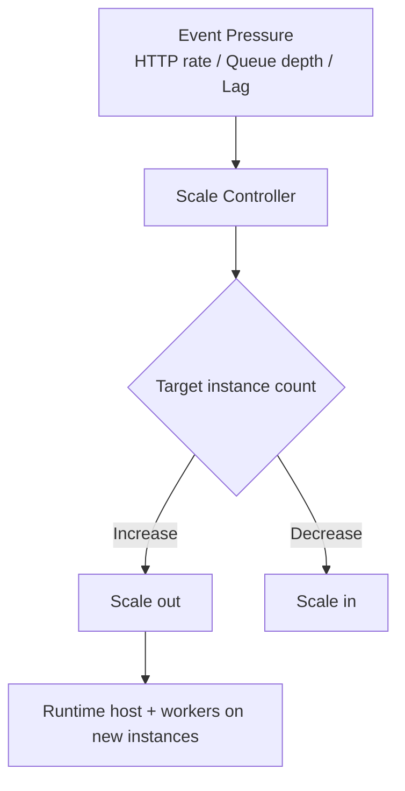
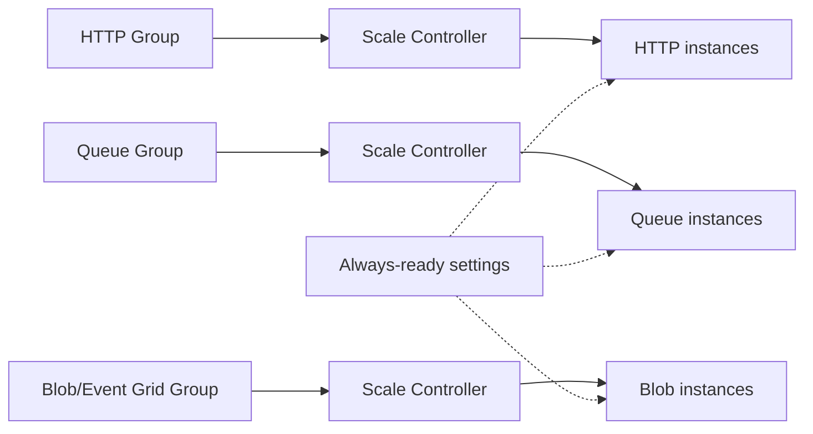
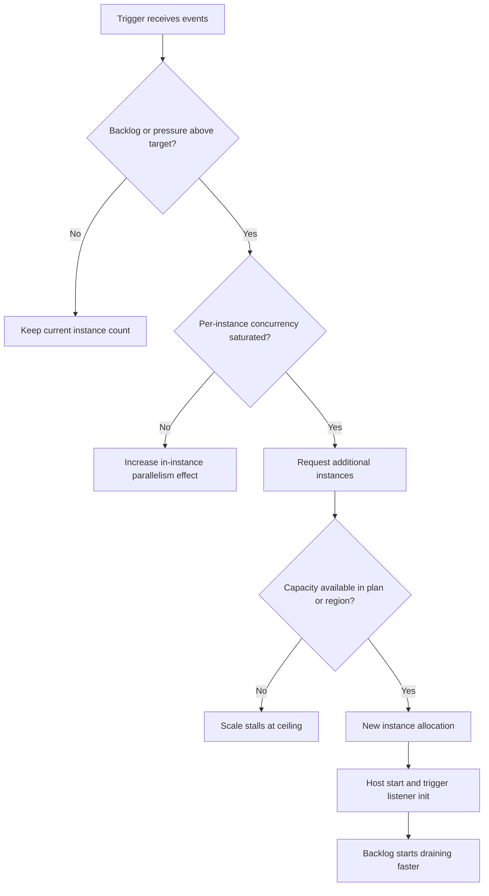
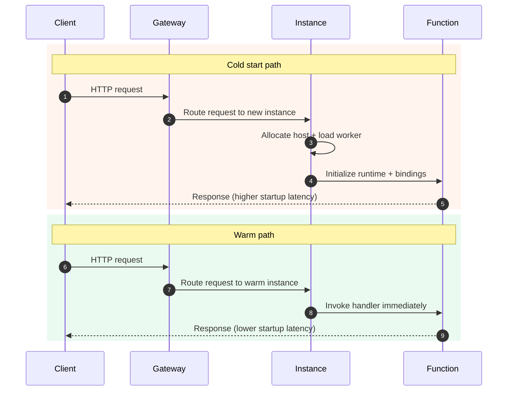

# Scaling Behavior
Azure Functions scaling is plan-dependent and trigger-dependent. You do not configure a single universal autoscaler; instead, the platform applies trigger-specific heuristics within plan limits.
## Prerequisites
Before tuning scale behavior, make sure the following prerequisites are in place:
- You know the selected hosting plan (`Consumption`, `Flex Consumption`, `Premium`, or `Dedicated`) and its operational limits.
- You have access to Azure CLI, and your environment is authenticated with `az login`.
- You have Reader or Contributor access to the Function App, plan, storage account, and Application Insights.
- You collect trigger-specific telemetry (HTTP latency, queue depth, event lag, failures) in Application Insights.
- You understand downstream service limits (database connections, API rate limits, NAT port limits).

Optional but recommended:
- A repeatable load test path to validate scale decisions before production rollout.
- A rollback plan for host-level concurrency and timeout changes.
- Baseline metrics from a known healthy period for comparison.
## Main Content
### Scale controller fundamentals
For serverless plans, Azure Functions scale controller evaluates event pressure and target throughput, then adds or removes instances.
Primary signals include:
- HTTP concurrency and request backlog,
- queue/topic/event backlog,
- partition lag (streaming sources),
- and observed processing rate.

Notes:
- Scale-out is not instant; host startup and binding initialization introduce delay.
- The controller optimizes for throughput and reliability, not one-request-per-instance behavior.
### Plan-level scaling model
| Plan | Baseline | Scale style | Common max profile |
|---|---|---|---|
| Consumption | 0 | App-level serverless scaling | Lower than Flex; classic dynamic ceiling |
| Flex Consumption | 0 (or always-ready) | Per-function/group scaling | Up to high serverless ceiling |
| Premium | Warm minimum instances | Elastic above warm floor | Bounded by Premium plan settings |
| Dedicated | Fixed/Autoscale rules | App Service autoscale | Plan VM and rule dependent |
Practical implications by plan:
- **Consumption**: cost-first workloads where occasional cold start is acceptable.
- **Flex/Premium**: stronger low-latency and burst handling with warm strategies.
- **Dedicated**: deterministic capacity and App Service-aligned operations.
### Consumption scaling
#### Behavior
- Scales to zero when idle.
- Scales out on demand from trigger signals.
- Cold starts occur after idle or during sudden scale-out.

#### Timeout and impact
- Default function timeout: **5 minutes**.
- Maximum function timeout: **10 minutes**.
Long-running work should be modeled with asynchronous triggers and durable patterns.
Common usage pattern: keep HTTP handlers thin, offload heavy work to queue-driven functions, and return early with correlation IDs.

### Flex Consumption scaling
Flex introduces the most significant scaling architecture changes.

#### Key scaling behaviors
- **Per-function or function-group scaling** rather than one shared app-scale behavior.
- Optional **always-ready** instances to reduce startup latency.
- High scale ceiling suitable for bursty event streams.

#### Critical timeout values
- Default timeout: **30 minutes**.
- Maximum timeout: **unbounded**.

#### Flex-specific operational constraints affecting scale
- No Kudu/SCM endpoint.
- Identity-based storage required for host storage.
- Blob trigger requires Event Grid source on Flex.

Operational guidance:
- Assign always-ready instances to latency-sensitive paths first (usually HTTP).
- Validate cost delta between always-ready floor and observed latency gain.
- Keep trigger groups isolated if one workload has highly variable burst behavior.
### Premium scaling
Premium is designed for low-latency scale with warm capacity.

#### Behavior
- Configured minimum warm instances are always running.
- Additional instances are added elastically under load.
- VNet integration is supported.
#### Architectural implication
Premium reduces startup latency by maintaining permanently warm capacity, suitable for strict response-time requirements.

Typical fit:
- Low-latency APIs with enterprise network controls.
- Dependency chains sensitive to cold initialization.
- Workloads prioritizing latency predictability over minimum idle cost.
### Dedicated scaling
Dedicated follows App Service scaling rules:
- manual instance count,
- or autoscale based on CPU/memory/schedules,
- no scale-to-zero behavior.
This model trades serverless elasticity for deterministic capacity planning.

When to consider Dedicated: existing App Service governance, stable baseline demand, and explicit instance control requirements.

### Trigger-specific scaling patterns
#### HTTP triggers
- Scale based on concurrency, queueing, and response pressure.
- Latency-sensitive; warm capacity strategies matter.

#### Queue and messaging triggers
- Scale based on backlog and processing throughput.
- Better for burst absorption and deferred processing.

#### Timer triggers
- Schedule-driven; generally not throughput-scaled like backlog triggers.

Design reminder:
- Prefer queue decoupling when dependency latency can cascade into HTTP saturation.

### Concurrency and throughput design
Throughput is a function of both instance count and per-instance concurrency.

Design guidance:
- keep handlers idempotent,
- avoid long blocking calls on HTTP paths,
- isolate heavy async processing from public API functions,
- validate downstream service quotas before increasing scale limits.

Concurrency tuning checklist:
1. Baseline queue drain rate at current settings.
2. Increase concurrency gradually and measure error or timeout impact.
3. Confirm downstream services stay below throttling thresholds.
4. Keep retry strategy aligned with increased fan-out.

### Scale and networking dependency
Scaling faster than your network or backend quotas can increase failures.
Check before raising scale ceilings:
- subnet address capacity,
- NAT or firewall throughput,
- service throttling limits,
- database connection limits.

!!! tip "Networking Guide"
    Pair scaling design with [Networking](networking.md) to avoid backend bottlenecks from successful scale-out.

### Autoscale decision flow
Use this model to reason about why scale-out did or did not happen in a short time window.



Interpretation: if pressure remains high without scale-out, inspect ceilings and concurrency caps before blaming the trigger source.

### Cold start versus warm path comparison
The path difference explains why warm floors or always-ready instances can materially improve p95 and p99 latencies.



### CLI inspection examples for scaling configuration
Use CLI inspection to confirm expected scaling settings before and after load tests.

Inspect Function App `siteConfig`:
```bash
az functionapp show \
    --resource-group $RG \
    --name $APP_NAME \
    --query siteConfig
```

Example output (PII masked):
```json
{
  "alwaysOn": false,
  "linuxFxVersion": "Python|3.11",
  "minimumElasticInstanceCount": 0,
  "numberOfWorkers": 1,
  "preWarmedInstanceCount": 0
}
```

Inspect scale profile details:
```bash
az functionapp scale show \
    --resource-group $RG \
    --name $APP_NAME
```

Example output (PII masked):
```json
{
  "alwaysReadyInstanceCount": 1,
  "functionAppName": "func-prod-xxxx",
  "maximumInstanceCount": 100,
  "minimumInstanceCount": 0,
  "subscriptionId": "<subscription-id>"
}
```

Query scaling-related metrics:
```bash
az monitor metrics list \
    --resource "/subscriptions/<subscription-id>/resourceGroups/$RG/providers/Microsoft.Web/sites/$APP_NAME" \
    --metric "Requests" "Http5xx" "AverageResponseTime" \
    --interval PT1M \
    --aggregation Average Total \
    --start-time 2026-01-10T09:00:00Z \
    --end-time 2026-01-10T10:00:00Z
```

Example output (PII masked):
```json
{
  "interval": "PT1M",
  "namespace": "Microsoft.Web/sites",
  "resourceregion": "koreacentral",
  "value": [
    {
      "name": { "value": "Requests" },
      "timeseries": [
        {
          "data": [
            {
              "timeStamp": "2026-01-10T09:12:00Z",
              "total": 842,
              "average": 14.03
            }
          ]
        }
      ]
    }
  ]
}
```

### Troubleshooting matrix
Use this matrix for fast triage when observed scaling does not match expectation.

| Symptom | Likely Cause | Validation Path |
|---|---|---|
| Functions not scaling out | Scale controller backlog signal not detected | Check trigger metrics and execution traces in Application Insights; verify backlog source has new messages or events |
| Instances scale out but latency remains high | Downstream service saturation | Compare dependency duration, throttling, and error rates against instance growth window |
| Sudden 5xx increase during burst | Cold start plus dependency timeout coupling | Correlate startup latency, timeout logs, and first-request failures by timestamp |
| Queue backlog drains slowly despite high instance count | Per-instance concurrency too low or message processing too heavy | Review host concurrency settings and processing-duration distribution |
| Flex Blob trigger not processing | Event Grid integration path missing or misconfigured | Validate Blob trigger source configuration and Event Grid subscription health |

### Scale decision matrix
| Requirement | Recommended plan |
|---|---|
| Lowest idle cost, simple public endpoints | Consumption |
| Serverless + private networking + high burst scale | Flex Consumption |
| Low latency with warm floor + enterprise networking | Premium |
| Fixed predictable capacity or existing App Service estate | Dedicated |

### Validation checklist
- Define expected peak events/second.
- Choose sync vs async trigger split.
- Set plan and timeout boundaries.
- Validate downstream limits at target scale.
- Run load tests and observe cold or warm behavior.

!!! tip "Operations Guide"
    For runtime tuning and monitoring KQL, see [Operations: Monitoring](../operations/monitoring.md).

## Advanced Topics

### Warm instance strategy for Flex Consumption
Always-ready instances reduce cold-path impact for latency-critical entry points, but they also establish a cost floor.

Recommended approach:
1. Start with one always-ready instance on the most latency-sensitive function group.
2. Measure p95 and p99 improvement over at least one full traffic cycle.
3. Increase only when SLO gain justifies added baseline cost.

Signals to watch:
- First-request latency after idle periods.
- Burst ramp-up duration before steady-state throughput.
- Cost per successful request under mixed idle and burst traffic.

### Target-based scaling
Target-based scaling means the platform aims to keep each instance near a processing target derived from trigger type and workload shape.

Practical consequences:
- If per-message processing time rises, instance demand rises for the same arrival rate.
- If concurrency increases safely, fewer additional instances may be required.
- If target signals are noisy, short-term oscillation can occur during sudden traffic changes.

Operational practice: use stable test windows (10 to 30 minutes) and compare before/after with the same payload profile.

### Concurrency tuning in host.json
Host-level concurrency settings can improve throughput, but aggressive values can amplify retries and downstream throttling.

Tuning guidance:
- Increase one dimension at a time (batch size, concurrency, or downstream connection pool).
- Keep idempotency and poison-message handling robust before increasing throughput targets.
- Revalidate alert thresholds after concurrency changes because baseline metric ranges shift.

### Scaling with Durable Functions
Durable Functions adds orchestrator and activity behavior that changes scaling characteristics.

Key points:
- Orchestrators replay state and should remain deterministic.
- Activity functions carry heavy work and are primary throughput drivers.
- Storage and task-hub throughput become part of scale constraints.

Design recommendations:
- Keep orchestrator logic lightweight and deterministic.
- Move external calls and CPU-heavy work into activity functions.
- Validate storage account and task-hub throughput under projected fan-out patterns.

## Language-Specific Details
Scaling principles are platform-level, but runtime behavior and tuning levers differ by language worker and ecosystem.

- Python guide: [Python language guides](../language-guides/python/index.md)
- Node.js guide: [Node.js language guides](../language-guides/nodejs/index.md)
- Java guide: [Java language guides](../language-guides/java/index.md)
- .NET guide: [.NET language guides](../language-guides/dotnet/index.md)

Cross-reference for implementation decisions:
- Trigger model and binding behavior: [Triggers and bindings](triggers-and-bindings.md)
- Hosting trade-offs and limits: [Hosting](hosting.md)
- Reliability and resiliency patterns: [Reliability](reliability.md)

## See Also
- [Hosting](hosting.md)
- [Triggers and bindings](triggers-and-bindings.md)
- [Networking](networking.md)
- [Reliability](reliability.md)
- [Operations: Monitoring](../operations/monitoring.md)
- [Troubleshooting: Playbooks](../troubleshooting/playbooks.md)

## Sources
- [Microsoft Learn: Azure Functions hosting options](https://learn.microsoft.com/azure/azure-functions/functions-scale)
- [Microsoft Learn: Event-driven scaling in Azure Functions](https://learn.microsoft.com/azure/azure-functions/event-driven-scaling)
- [Microsoft Learn: Azure Functions Flex Consumption plan](https://learn.microsoft.com/azure/azure-functions/flex-consumption-plan)
- [Microsoft Learn: Azure Functions Premium plan](https://learn.microsoft.com/azure/azure-functions/functions-premium-plan)
- [Microsoft Learn: Concurrency in Azure Functions](https://learn.microsoft.com/azure/azure-functions/functions-concurrency)
- [Microsoft Learn: Durable Functions performance and scale](https://learn.microsoft.com/azure/azure-functions/durable/durable-functions-perf-and-scale)
