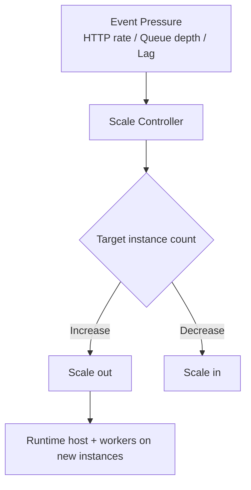
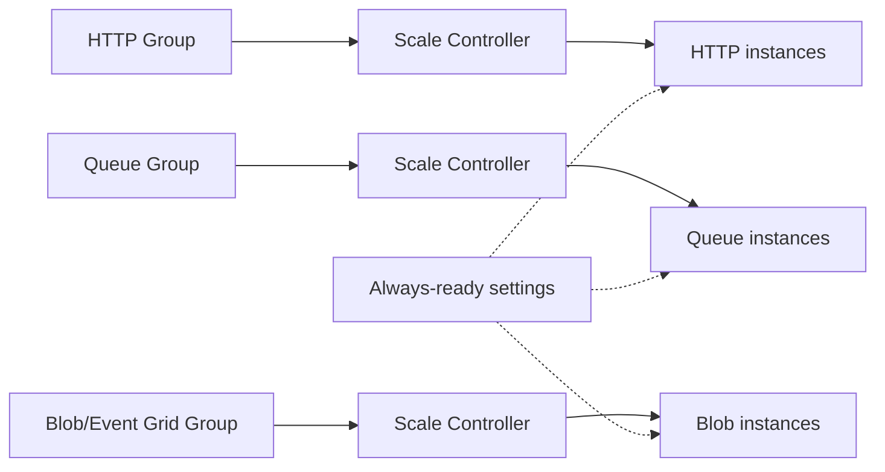

# Scaling Behavior

Azure Functions scaling is plan-dependent and trigger-dependent. You do not configure a single universal autoscaler; instead, the platform applies trigger-specific heuristics within plan limits.

## Scale controller fundamentals

For serverless plans, Azure Functions scale controller evaluates event pressure and target throughput, then adds or removes instances.

Primary signals include:

- HTTP concurrency and request backlog,
- queue/topic/event backlog,
- partition lag (streaming sources),
- and observed processing rate.

## Plan-level scaling model

| Plan | Baseline | Scale style | Common max profile |
|---|---|---|---|
| Consumption | 0 | App-level serverless scaling | Lower than Flex; classic dynamic ceiling |
| Flex Consumption | 0 (or always-ready) | Per-function/group scaling | Up to high serverless ceiling |
| Premium | Warm minimum instances | Elastic above warm floor | Bounded by Premium plan settings |
| Dedicated | Fixed/Autoscale rules | App Service autoscale | Plan VM and rule dependent |

## Consumption scaling

### Behavior

- Scales to zero when idle.
- Scales out on demand from trigger signals.
- Cold starts occur after idle or during sudden scale-out.

### Timeout and impact

- Default function timeout: **5 minutes**.
- Maximum function timeout: **10 minutes**.

Long-running work should be modeled with asynchronous triggers and durable patterns.

## Flex Consumption scaling

Flex introduces the most significant scaling architecture changes.

### Key scaling behaviors

- **Per-function or function-group scaling** rather than one shared app-scale behavior.
- Optional **always-ready** instances to reduce startup latency.
- High scale ceiling suitable for bursty event streams.

### Critical timeout values

- Default timeout: **30 minutes**.
- Maximum timeout: **unbounded**.

### Flex-specific operational constraints affecting scale

- No Kudu/SCM endpoint.
- Identity-based storage required for host storage.
- Blob trigger requires Event Grid source on Flex.

## Premium scaling

Premium is designed for low-latency scale with warm capacity.

### Behavior

- Configured minimum warm instances are always running.
- Additional instances are added elastically under load.
- VNet integration is supported.

### Architectural implication

Premium reduces startup latency by maintaining permanently warm capacity, making it suitable for strict response-time requirements.

## Dedicated scaling

Dedicated follows App Service scaling rules:

- manual instance count,
- or autoscale based on CPU/memory/schedules,
- no scale-to-zero behavior.

This model trades serverless elasticity for deterministic capacity planning.

## Trigger-specific scaling patterns

### HTTP triggers

- Scale based on concurrency, queueing, and response pressure.
- Latency-sensitive; warm capacity strategies matter.

### Queue and messaging triggers

- Scale based on backlog and processing throughput.
- Better for burst absorption and deferred processing.

### Timer triggers

- Schedule-driven; generally not throughput-scaled in the same way as backlog triggers.

## Concurrency and throughput design

Throughput is a function of both instance count and per-instance concurrency.

Design guidance:

- keep handlers idempotent,
- avoid long blocking calls on HTTP paths,
- isolate heavy async processing from public API functions,
- validate downstream service quotas before increasing scale limits.

## Scale and networking dependency

Scaling faster than your network/backend quotas can increase failures.

Check before raising scale ceilings:

- subnet address capacity,
- NAT/firewall throughput,
- service throttling limits,
- database connection limits.

!!! tip "Networking Guide"
    Pair scaling design with [Networking](networking.md) to avoid backend bottlenecks from successful scale-out.

## Scale decision matrix

| Requirement | Recommended plan |
|---|---|
| Lowest idle cost, simple public endpoints | Consumption |
| Serverless + private networking + high burst scale | Flex Consumption |
| Low latency with warm floor + enterprise networking | Premium |
| Fixed predictable capacity or existing App Service estate | Dedicated |

## Validation checklist

- Define expected peak events/second.
- Choose sync vs async trigger split.
- Set plan and timeout boundaries.
- Validate downstream limits at target scale.
- Run load tests and observe cold/warm behavior.

!!! tip "Operations Guide"
    For runtime tuning and monitoring KQL, see [Operations: Monitoring](../operations/monitoring.md).

## See also

- [Hosting](hosting.md)
- [Triggers and bindings](triggers-and-bindings.md)
- [Networking](networking.md)
- [Reliability](reliability.md)
- [Microsoft Learn: Scale and hosting](https://learn.microsoft.com/azure/azure-functions/functions-scale)
