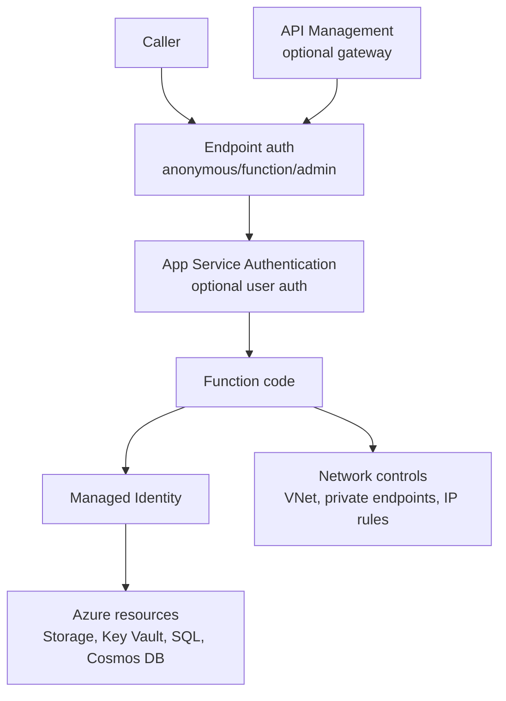
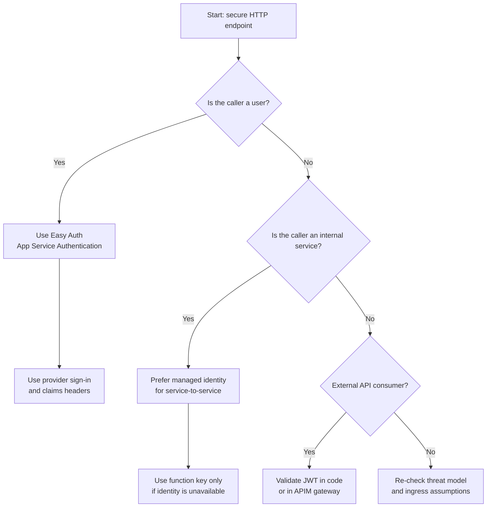
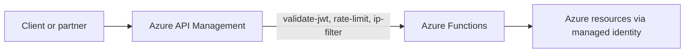

# Security
Security in Azure Functions is layered: endpoint authorization, user authentication, workload identity, API gateway policy, secret governance, and network isolation. This page focuses on **design decisions** so teams can choose the right security architecture before implementation.

## Main Content

### Security model overview

Most production systems combine multiple controls rather than relying on one.

### Authentication architecture decision tree

!!! note "Design principle"
    Function keys are shared secrets, not user identities. If you need per-user claims, conditional access, or delegated permissions, use Easy Auth or OAuth/JWT.

### HTTP authorization levels
Azure Functions supports three key-based authorization levels for HTTP triggers.
| Level | Access model | Typical use |
|---|---|---|
| `anonymous` | No key required | Public webhook endpoints with external auth controls |
| `function` | Function key or host key required | Internal service APIs |
| `admin` | Master key required | Runtime/admin operations only |

Design guidance:
- Use `anonymous` only with compensating controls (Easy Auth, APIM JWT policy, private network).
- Use `function` for low-friction internal integrations.
- Do not expose `admin` operations on untrusted networks.

### App Service Authentication (Easy Auth) deep-dive
Easy Auth is built-in authentication/authorization from App Service, available to Function Apps.

### How it works
Easy Auth is platform middleware that runs **before your code**. It can:
1. Challenge unauthenticated requests.
2. Validate tokens from configured identity providers.
3. Forward identity claims to your function via headers.

### Supported identity providers
| Provider | Typical fit |
|---|---|
| Microsoft Entra ID | Enterprise workforce and internal apps |
| GitHub | Developer portals/tools |
| Google | Consumer apps |
| Facebook | Consumer apps |
| Twitter/X | Social sign-in scenarios |
| Custom OpenID Connect | External IdP or federation requirements |

### Authentication vs authorization
- **Authentication** verifies caller identity.
- **Authorization** decides what that identity can do.

Easy Auth mainly solves authentication and token validation. You still enforce authorization (roles, scopes, resource ownership) in code or gateway policy.

### Token store and session management
Easy Auth can maintain sign-in sessions and provider token context for web flows. For API architectures:
- Prefer bearer-token patterns.
- Design for token expiration and refresh policy.
- Avoid browser-session assumptions for machine clients.

### Built-in endpoints
- `/.auth/login/<provider>`: starts login flow
- `/.auth/me`: returns current identity context
- `/.auth/logout`: signs out current session

### X-MS-CLIENT-PRINCIPAL headers
When authenticated, identity data is forwarded as `X-MS-CLIENT-PRINCIPAL*` headers.

=== "Python"
    ```python
    import base64
    import json
    import azure.functions as func

    def main(req: func.HttpRequest) -> func.HttpResponse:
        principal = req.headers.get("X-MS-CLIENT-PRINCIPAL")
        if not principal:
            return func.HttpResponse("Unauthorized", status_code=401)

        payload = json.loads(base64.b64decode(principal))
        return func.HttpResponse(json.dumps(payload), mimetype="application/json")
    ```

=== "Node.js"
    ```javascript
    module.exports = async function (context, req) {
      const principal = req.headers['x-ms-client-principal'];
      if (!principal) {
        context.res = { status: 401, body: 'Unauthorized' };
        return;
      }

      const payload = JSON.parse(Buffer.from(principal, 'base64').toString('utf-8'));
      context.res = { status: 200, body: payload };
    };
    ```

### Easy Auth vs custom JWT validation
Use Easy Auth when you want platform-managed auth with mainstream providers.
Use custom JWT validation (or APIM `validate-jwt`) when you need custom issuer rules, route-specific policies, or advanced multi-tenant logic.

### JWT and OAuth 2.0 patterns
### When to validate JWTs manually
Manual validation is common when:
- Issuer is custom or tenant-dependent.
- API-to-API contracts require explicit token policy.
- Validation is centralized in APIM or custom middleware.

Minimum validation checks:
1. Signature verification with trusted signing keys.
2. Issuer (`iss`) allow-list check.
3. Audience (`aud`) check for your API.
4. Lifetime checks (`exp`, `nbf`) with controlled clock skew.

### OAuth 2.0 client credentials flow
For service-to-service access:
1. Service acquires token from Microsoft Entra ID.
2. Service calls Function App or APIM with bearer token.
3. Gateway/platform/function validates token.

Prefer managed identity for Azure-to-Azure workloads to avoid client secret sprawl.

### JWKS endpoint usage
JWKS endpoints provide public keys for JWT signature verification. Design for key caching, key rollover, and fail-closed behavior when signatures cannot be validated.

### API Management (APIM) integration
Place Functions behind APIM when you need centralized API security and governance.
### APIM as a security gateway

### When APIM is recommended
- OAuth/JWT validation at gateway
- Rate limiting and quotas
- IP filtering and centralized policy
- API products and consumer onboarding

### Subscription key vs OAuth token
| Mechanism | Provides | Does not provide |
|---|---|---|
| APIM subscription key | Consumer/app identification and product access | User identity claims |
| OAuth bearer token | Identity and claims for authorization | Product subscription governance by itself |

### CORS configuration
CORS primarily affects browser clients. A backend can return HTTP 200 while browsers still block the response if origin policy fails.

```bash
az functionapp cors add \
  --name "$APP_NAME" \
  --resource-group "$RG" \
  --allowed-origins "https://app.contoso.example"
```

Wildcard origin risks:
- `*` allows any origin.
- Increases browser-side data exposure risk.
- Avoid in production unless endpoint is intentionally public.

### Function key management
Function keys are useful for shared-secret access, but they are not full authentication.
### Key types and scope
| Key type | Scope | Typical use | Risk if leaked |
|---|---|---|---|
| Function key | One function | Single integration caller | Limited endpoint exposure |
| Host key | All functions in app | Internal multi-endpoint callers | Broad invocation access |
| Master key (`_master`) | Admin/runtime + all functions | Admin automation only | Full runtime control |

### Rotation strategy
- Maintain overlapping keys during cutover.
- Rotate regularly and after incidents.
- Move consumers first, then revoke old keys.
- Monitor auth failures during rotation.

```bash
az functionapp function keys list \
  --name "$APP_NAME" \
  --resource-group "$RG" \
  --function-name "HttpExample"
```

### Storing keys in Key Vault
- Store shared keys in Key Vault.
- Distribute through secure channels only.
- Never commit keys or log full values.

### When keys are not enough
Use Easy Auth, APIM OAuth, or JWT validation when you need per-user identity, claims-based authorization, conditional access, or delegated consent.

### Managed identity for service-to-service access
Managed identity removes embedded credentials from code and app settings.

Recommended pattern:
1. Enable system-assigned or user-assigned identity.
2. Grant least-privilege RBAC on target resources.
3. Use identity-based connection settings where supported.

```bash
az functionapp identity assign \
  --name "$APP_NAME" \
  --resource-group "$RG"
```

```bash
az role assignment create \
  --assignee "xxxxxxxx-xxxx-xxxx-xxxx-xxxxxxxxxxxx" \
  --role "Storage Blob Data Contributor" \
  --scope "/subscriptions/<subscription-id>/resourceGroups/$RG/providers/Microsoft.Storage/storageAccounts/$STORAGE_NAME"
```

Flex Consumption requires identity-based host storage configuration. Plan identity and RBAC early.

### Key and secret handling
Preferred order:
1. Managed identity (no secret)
2. Key Vault references in app settings
3. Direct secret values only when unavoidable

### Network security controls
Combine identity with network boundaries:
- IP access restrictions
- Private endpoints
- VNet integration for private outbound
- Optional route-all egress through firewall or NAT

### Threat model for serverless
Common attack vectors in Functions workloads:
- Injection through HTTP body/query/header input
- Over-permissive triggers or exposed admin endpoints
- Credential leakage in logs and telemetry
- Cold-start timing side-channel considerations for sensitive paths

Defense-in-depth baseline:
1. Explicit HTTP `authLevel`
2. Easy Auth and/or JWT validation
3. APIM and network isolation
4. Managed identity for downstream resources
5. Logging/monitoring with token and PII redaction

### Expanded security checklist
### Identity and authentication
- [ ] Set explicit HTTP auth level on every endpoint.
- [ ] Use Easy Auth for user-facing APIs unless custom JWT is required.
- [ ] Validate `iss`, `aud`, signature, and expiration for JWT APIs.
- [ ] Use OAuth client credentials or managed identity for service callers.

### Keys and secrets
- [ ] Treat function keys as shared secrets, not identity.
- [ ] Rotate function/host keys on schedule and incident.
- [ ] Store keys and secrets in Key Vault.
- [ ] Ensure logs never contain raw keys or tokens.

### Network and gateway
- [ ] Put internet-facing APIs behind APIM when policy centralization is needed.
- [ ] Apply private endpoints or IP restrictions for sensitive workloads.
- [ ] Restrict CORS origins to known domains.
- [ ] Enforce HTTPS-only and minimum TLS version.

### Authorization and least privilege
- [ ] Apply least-privilege RBAC to managed identities.
- [ ] Separate authentication from authorization decisions.
- [ ] Use claims/roles/scopes for resource-level access control.

### Validation and operations
- [ ] Review threat model before production release.
- [ ] Monitor auth failures, key usage anomalies, and suspicious origin patterns.
- [ ] Re-validate controls after IaC or gateway policy changes.

!!! tip "Operations Guide"
    For key rotation procedures and security monitoring, see [Security Operations](../operations/security.md).

!!! tip "Language Guide"
    For Python JWT validation and Easy Auth code examples, see [HTTP Authentication](../language-guides/python/recipes/http-auth.md).

## See Also
- [Reliability](reliability.md)
- [Networking](networking.md)
- [Architecture](architecture.md)

## Sources
- [Microsoft Learn: Security concepts](https://learn.microsoft.com/azure/azure-functions/security-concepts)
- [Microsoft Learn: App Service authentication and authorization](https://learn.microsoft.com/azure/app-service/overview-authentication-authorization)
- [Microsoft Learn: Identity-based connections tutorial](https://learn.microsoft.com/azure/azure-functions/functions-identity-based-connections-tutorial)
- [Microsoft Learn: Protect API backend with OAuth in API Management](https://learn.microsoft.com/azure/api-management/api-management-howto-protect-backend-with-aad)
