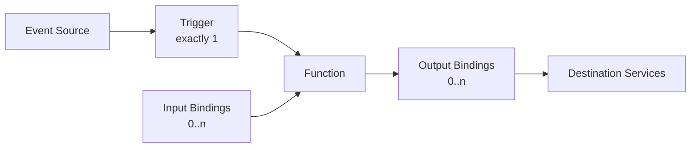
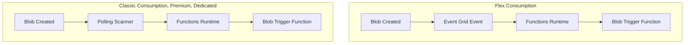
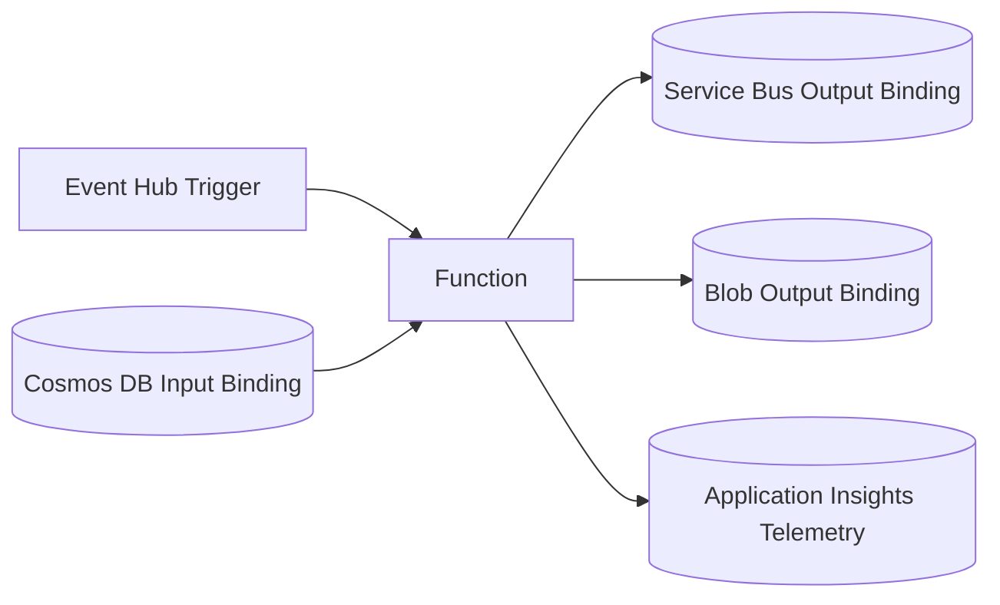
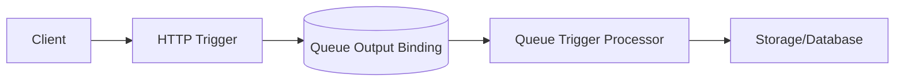
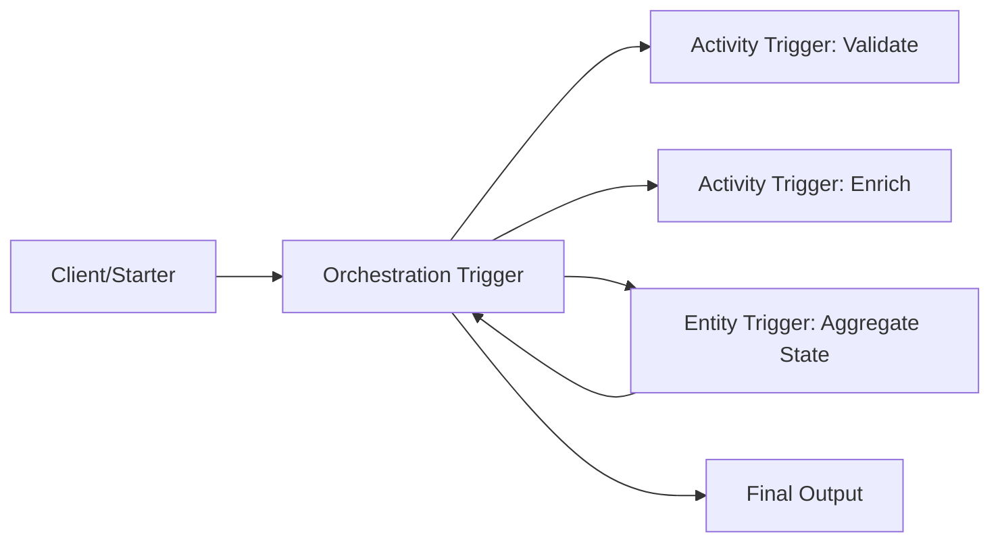

---
content_sources:
  - type: mslearn-adapted
    url: https://learn.microsoft.com/azure/azure-functions/functions-triggers-bindings
  - type: mslearn-adapted
    url: https://learn.microsoft.com/azure/azure-functions/functions-bindings-storage-blob-trigger
  - type: mslearn-adapted
    url: https://learn.microsoft.com/azure/azure-functions/functions-event-grid-blob-trigger
  - type: mslearn-adapted
    url: https://learn.microsoft.com/azure/azure-functions/functions-host-json
  - type: mslearn-adapted
    url: https://learn.microsoft.com/azure/azure-functions/functions-reference#configure-an-identity-based-connection
  - type: mslearn-adapted
    url: https://learn.microsoft.com/azure/azure-functions/event-driven-scaling
content_validation:
  status: verified
  last_reviewed: 2026-04-12
  reviewer: agent
  core_claims:
    - claim: "Each Azure Function has exactly one trigger and can also use input and output bindings"
      source: https://learn.microsoft.com/azure/azure-functions/functions-triggers-bindings
      verified: true
    - claim: "Flex Consumption uses the Event Grid-based blob trigger model instead of polling"
      source: https://learn.microsoft.com/azure/azure-functions/functions-event-grid-blob-trigger
      verified: true
    - claim: "Bindings can use identity-based connections configured with service URIs and managed identity settings"
      source: https://learn.microsoft.com/azure/azure-functions/functions-reference#configure-an-identity-based-connection
      verified: true
    - claim: "Azure Functions scaling is driven by the trigger type and workload signal"
      source: https://learn.microsoft.com/azure/azure-functions/event-driven-scaling
      verified: true
---

# Triggers and Bindings
Triggers and bindings are the core integration abstraction in Azure Functions. A trigger starts execution. Bindings connect your function to external data/services with declarative contracts.

## Prerequisites
Before designing trigger and binding architecture, align these baseline decisions:
- Choose the hosting plan first (Consumption, Flex Consumption, Premium, or Dedicated).
- Confirm trigger compatibility for the selected plan, especially Blob and Event Grid behavior.
- Decide connection strategy per binding:
    - identity-based authentication (recommended for production), or
    - connection-string/key-based authentication (legacy or constrained scenarios).
- Define operational constraints:
    - expected throughput,
    - acceptable end-to-end latency,
    - retry tolerance,
    - ordering requirements.
- Prepare app settings with masked placeholders only.
Example placeholder app settings:
```text
AzureWebJobsStorage=<connection-or-identity-reference>
ServiceBusConnection=<connection-string>
Storage__blobServiceUri=https://<storage-account>.blob.core.windows.net
```
If you validate configuration with Azure CLI, keep long flags for readability:
```bash
az functionapp config appsettings list --resource-group $RG --name $APP_NAME
az functionapp config show --resource-group $RG --name $APP_NAME
```
## Main Content
### Core model
Every function has:
- exactly **one trigger**,
- zero or more **input bindings**,
- zero or more **output bindings**.
<!-- diagram-id: core-model -->

### Trigger categories
#### Synchronous triggers
The caller waits for a response.
- HTTP
- Webhook-style integrations
#### Asynchronous triggers
The source posts work and runtime handles completion semantics.
- Storage Queue
- Service Bus
- Event Hubs
- Event Grid
- Blob
- Timer
- Cosmos DB change feed
### Common trigger types
| Trigger | Typical use case | Scaling signal |
|---|---|---|
| HTTP | APIs, webhooks | Concurrent requests and latency |
| Timer | Scheduled jobs | Schedule only (singleton behavior patterns) |
| Queue/Service Bus | Background processing | Backlog length and processing rate |
| Event Hub | Stream ingestion | Partition/event lag |
| Event Grid | Reactive eventing | Event delivery rate |
| Blob | File ingestion | Blob event/polling model by plan |
### Plan-specific trigger considerations
- Flex Consumption supports broad trigger coverage, but **blob trigger uses Event Grid source** instead of polling.
- Classic Consumption supports polling-based blob trigger models.
- Trigger extensions are governed by runtime extension bundle/version support.
!!! warning "Flex Consumption blob trigger"
    Standard polling blob trigger mode is not supported on Flex Consumption. Use the Event Grid-based blob trigger source.
### Event Grid vs polling blob trigger model
Use this comparison when selecting hosting plans for blob-driven workflows.
<!-- diagram-id: event-grid-vs-polling-blob-trigger-model -->

### Binding behavior
Bindings reduce plumbing code but still require you to model:
- idempotency,
- retries and duplicate delivery,
- payload schema evolution,
- destination latency and throttling.
Bindings are not a replacement for domain-level error handling.
Recommended behavior guardrails:
- **Message contract**: include `schemaVersion` and enforce required fields.
- **Idempotency key**: upsert by deterministic business key.
- **Poison strategy**: route repeated failures to dead-letter destination.
- **Timeout boundary**: align function timeout with downstream SLA.
### Binding connection configuration
Bindings resolve connection values from app settings. You can use identity-based configuration or connection-string configuration.
| Approach | When to use | Configuration shape | Security posture |
|---|---|---|---|
| Identity-based | Default for production | URI-based settings + managed identity + RBAC | No shared secret in app settings |
| Connection-string based | Legacy migration or unsupported identity path | Single secret setting | Secret rotation and leakage risk |
#### Identity-based example (Storage Queue output)
Binding metadata:
```json
{
  "bindings": [
    {
      "name": "outputQueue",
      "type": "queue",
      "direction": "out",
      "queueName": "orders",
      "connection": "OrdersStorage"
    }
  ]
}
```
App settings:
```text
OrdersStorage__queueServiceUri=https://<storage-account>.queue.core.windows.net
OrdersStorage__credential=managedidentity
```
#### Connection-string example (Storage Queue output)
Binding metadata stays the same:
```json
{
  "bindings": [
    {
      "name": "outputQueue",
      "type": "queue",
      "direction": "out",
      "queueName": "orders",
      "connection": "OrdersStorage"
    }
  ]
}
```
App settings store a secret:
```text
OrdersStorage=DefaultEndpointsProtocol=https;AccountName=<storage-account>;AccountKey=<masked-key>;EndpointSuffix=core.windows.net
```
Decision guidance:
- Prefer identity-based config when supported by the binding extension.
- Use connection strings only when identity is blocked or unavailable.
- Avoid mixing identity and key-based access for the same service unless you are in controlled migration.
### Input/output binding data flow (multi-service)
One trigger can coordinate multiple bindings in one function boundary.
<!-- diagram-id: input-output-binding-data-flow-multi-service -->

Design notes:
- Keep one business responsibility per function.
- If partial fan-out failure is unacceptable, use an outbox pattern.
- Validate downstream idempotency before increasing parallelism.
### Cross-language HTTP trigger examples
=== "Python"
    ```python
    import azure.functions as func

    app = func.FunctionApp(http_auth_level=func.AuthLevel.FUNCTION)

    @app.route(route="health", methods=["GET"])
    def health(req: func.HttpRequest) -> func.HttpResponse:
        return func.HttpResponse('{"status":"ok"}', mimetype="application/json")
    ```
=== "Node.js"
    ```javascript
    const { app } = require('@azure/functions');

    app.http('health', {
      methods: ['GET'],
      authLevel: 'function',
      handler: async (request, context) => {
        return { jsonBody: { status: 'ok' } };
      }
    });
    ```
=== ".NET (Isolated)"
    ```csharp
    using Microsoft.Azure.Functions.Worker;
    using Microsoft.Azure.Functions.Worker.Http;
    using System.Net;

    public class HealthFunction
    {
        [Function("Health")]
        public HttpResponseData Run(
            [HttpTrigger(AuthorizationLevel.Function, "get", Route = "health")] HttpRequestData req)
        {
            var response = req.CreateResponse(HttpStatusCode.OK);
            response.WriteString("{\"status\":\"ok\"}");
            return response;
        }
    }
    ```
=== "Java"
    ```java
    @FunctionName("health")
    public HttpResponseMessage execute(
        @HttpTrigger(
            name = "req",
            methods = {HttpMethod.GET},
            authLevel = AuthorizationLevel.FUNCTION,
            route = "health")
        HttpRequestMessage<Optional<String>> request,
        final ExecutionContext context) {
        return request.createResponseBuilder(HttpStatus.OK)
            .body("{\"status\":\"ok\"}")
            .build();
    }
    ```
### Queue-trigger + output pattern (architectural)
A common pattern is HTTP ingest + queue output + queue-trigger processor.
<!-- diagram-id: queue-trigger-output-pattern-architectural -->

This decouples response latency from backend processing.
### Configuration at host level
Bindings and trigger extensions are controlled in `host.json`.
#### Extension bundle version range example
```json
{
  "version": "2.0",
  "extensionBundle": {
    "id": "Microsoft.Azure.Functions.ExtensionBundle",
    "version": "[4.*, 5.0.0)"
  }
}
```
#### Alternate bundle range for controlled validation
```json
{
  "version": "2.0",
  "extensionBundle": {
    "id": "Microsoft.Azure.Functions.ExtensionBundle",
    "version": "[3.15.0, 4.0.0)"
  }
}
```
#### Per-trigger concurrency settings example
```json
{
  "version": "2.0",
  "extensions": {
    "queues": {
      "batchSize": 32,
      "newBatchThreshold": 16,
      "maxDequeueCount": 5,
      "visibilityTimeout": "00:00:30"
    },
    "eventHubs": {
      "maxEventBatchSize": 256,
      "prefetchCount": 512,
      "batchCheckpointFrequency": 1
    }
  }
}
```
Tuning guidance:
- Increase `queues.batchSize` only after confirming downstream write capacity.
- Tune `eventHubs.maxEventBatchSize` with partition count and memory limits.
- Change one concurrency lever at a time and compare telemetry windows.
### Authentication levels for HTTP triggers
| Level | Meaning |
|---|---|
| anonymous | No function key required |
| function | Function or host key required |
| admin | Master key required |
Use platform auth (App Service Authentication/Authorization) for user identity scenarios, and keep function keys for service-to-service endpoint control.
### Trigger design checklist
- Use HTTP only when immediate response is required.
- Use async triggers for throughput and resiliency.
- Model retries and poison behavior from day one.
- Validate trigger support against selected hosting plan.
- Keep function boundaries small and idempotent.
### Troubleshooting matrix
| Symptom | Likely Cause | Validation Path |
|---|---|---|
| Trigger not firing | Missing or incorrect connection setting | Verify app setting key, binding `connection` value, and slot-scoped settings |
| Blob trigger delay is high | Polling model used when event-based behavior expected | Confirm plan type and blob trigger source mode |
| Queue backlog keeps growing | Low batch/concurrency or downstream saturation | Compare enqueue/dequeue rates and inspect poison queue |
| Event Hub trigger stalls intermittently | Checkpointing or partition hot-spot issue | Check partition lag and consumer-group ownership |
| HTTP trigger returns 401/403 | Authorization level mismatch or platform auth policy conflict | Validate trigger auth level and App Service auth settings |
| Output binding write fails | Missing RBAC assignment or stale secret | Validate identity role assignment or rotated connection string |
Suggested validation command set:
```bash
az functionapp config appsettings list --resource-group $RG --name $APP_NAME
az functionapp function show --resource-group $RG --name $APP_NAME --function-name $FUNCTION_NAME
az monitor app-insights query --app <application-insights-name> --analytics-query "traces | take 20"
```
!!! tip "Reliability Guide"
    For retry and poison-message design, see [Reliability](reliability.md).
!!! tip "Language Guide"
    For Python decorator syntax and advanced trigger examples, see [v2 Programming Model](../language-guides/python/v2-programming-model.md).
## Advanced Topics
### Custom bindings
Custom bindings are useful when no first-class extension exists and repeated SDK plumbing creates operational inconsistency.
- Start with native SDK integration first.
- Introduce custom bindings only for stable, repeated integration contracts.
- Version custom binding contracts and publish migration notes.
### Durable Functions triggers
Durable Functions adds orchestration-centric triggers:
- **Orchestration trigger**: coordinates deterministic workflows.
- **Activity trigger**: executes side-effecting units of work.
- **Entity trigger**: provides serialized stateful operations.
<!-- diagram-id: durable-functions-triggers -->

Keep orchestrator code deterministic and move all I/O into activities.
### Extension bundle versioning strategy
Treat extension bundle upgrades like dependency upgrades with staged rollout:
1. Validate bundle range changes in lower environments with representative load.
2. Compare failure rates, cold start behavior, and throughput.
3. Promote gradually with rollback criteria.
Recommended pattern:
- Pin a compatible major range (for example, `[4.*, 5.0.0)`).
- Avoid unbounded version ranges.
- Revalidate trigger defaults when changing bundle ranges.
### Trigger-specific scaling signals deep dive
Each trigger family scales from different pressure signals:
- **Queue/Service Bus**: backlog, lock renewal pressure, dequeue latency.
- **Event Hubs**: partition lag and ingest velocity.
- **HTTP**: concurrent request pressure and latency percentiles.
- **Timer**: schedule-driven execution, not demand-driven scale.
Design implication:
- Keep trigger-to-workload mapping explicit to preserve useful scale signals.
- Avoid mixing unrelated high-variance workloads behind one trigger unless isolation is not required.
## Language-Specific Details
Use language guides for runtime-specific syntax, decorators/attributes, and package setup:
- [Python v2 Programming Model](../language-guides/python/v2-programming-model.md)
- [Python Recipes: Queue](../language-guides/python/recipes/queue.md)
- [Python Recipes: Blob Storage](../language-guides/python/recipes/blob-storage.md)
- [Python Recipes: Event Grid](../language-guides/python/recipes/event-grid.md)
- [Node.js Guide](../language-guides/nodejs/index.md)
- [Java Guide](../language-guides/java/index.md)
- [.NET Guide](../language-guides/dotnet/index.md)
## See Also
- [Architecture](architecture.md)
- [Scaling](scaling.md)
- [Reliability](reliability.md)
- [Hosting Plans](hosting.md)
- [Networking](networking.md)
## Sources
- [Microsoft Learn: Azure Functions triggers and bindings concepts](https://learn.microsoft.com/azure/azure-functions/functions-triggers-bindings)
- [Microsoft Learn: Azure Functions Blob storage trigger](https://learn.microsoft.com/azure/azure-functions/functions-bindings-storage-blob-trigger)
- [Microsoft Learn: Azure Functions Event Grid Blob trigger](https://learn.microsoft.com/azure/azure-functions/functions-event-grid-blob-trigger)
- [Microsoft Learn: host.json reference for Azure Functions](https://learn.microsoft.com/azure/azure-functions/functions-host-json)
- [Microsoft Learn: Azure Functions identity-based connections](https://learn.microsoft.com/azure/azure-functions/functions-reference#configure-an-identity-based-connection)
- [Microsoft Learn: Azure Functions scale and hosting behavior](https://learn.microsoft.com/azure/azure-functions/event-driven-scaling)
