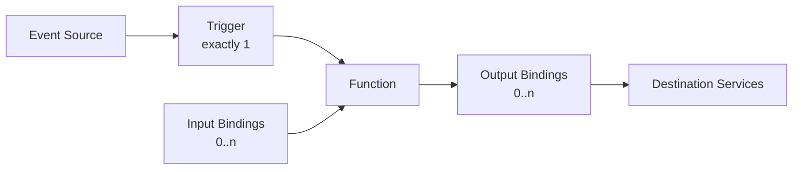
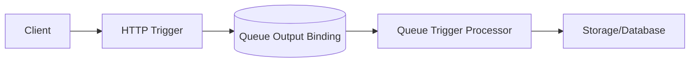

# Triggers and Bindings

Triggers and bindings are the core integration abstraction in Azure Functions. A trigger starts execution. Bindings connect your function to external data/services with declarative contracts.

## Core model

Every function has:

- exactly **one trigger**,
- zero or more **input bindings**,
- zero or more **output bindings**.



## Trigger categories

### Synchronous triggers

The caller waits for a response.

- HTTP
- Webhook-style integrations

### Asynchronous triggers

The source posts work and runtime handles completion semantics.

- Storage Queue
- Service Bus
- Event Hubs
- Event Grid
- Blob
- Timer
- Cosmos DB change feed

## Common trigger types

| Trigger | Typical use case | Scaling signal |
|---|---|---|
| HTTP | APIs, webhooks | Concurrent requests and latency |
| Timer | Scheduled jobs | Schedule only (singleton behavior patterns) |
| Queue/Service Bus | Background processing | Backlog length and processing rate |
| Event Hub | Stream ingestion | Partition/event lag |
| Event Grid | Reactive eventing | Event delivery rate |
| Blob | File ingestion | Blob event/polling model by plan |

## Plan-specific trigger considerations

- Flex Consumption supports broad trigger coverage, but **blob trigger uses Event Grid source** instead of polling.
- Classic Consumption supports polling-based blob trigger models.
- Trigger extensions are governed by runtime extension bundle/version support.

!!! warning "Flex Consumption blob trigger"
    Standard polling blob trigger mode is not supported on Flex Consumption. Use the Event Grid-based blob trigger source.

## Binding behavior

Bindings reduce plumbing code but still require you to model:

- idempotency,
- retries and duplicate delivery,
- payload schema evolution,
- destination latency and throttling.

Bindings are not a replacement for domain-level error handling.

## Cross-language HTTP trigger examples

=== "Python"
    ```python
    import azure.functions as func

    app = func.FunctionApp(http_auth_level=func.AuthLevel.FUNCTION)

    @app.route(route="health", methods=["GET"])
    def health(req: func.HttpRequest) -> func.HttpResponse:
        return func.HttpResponse('{"status":"ok"}', mimetype="application/json")
    ```

=== "Node.js"
    ```javascript
    const { app } = require('@azure/functions');

    app.http('health', {
      methods: ['GET'],
      authLevel: 'function',
      handler: async (request, context) => {
        return { jsonBody: { status: 'ok' } };
      }
    });
    ```

=== ".NET (Isolated)"
    ```csharp
    using Microsoft.Azure.Functions.Worker;
    using Microsoft.Azure.Functions.Worker.Http;
    using System.Net;

    public class HealthFunction
    {
        [Function("Health")]
        public HttpResponseData Run(
            [HttpTrigger(AuthorizationLevel.Function, "get", Route = "health")] HttpRequestData req)
        {
            var response = req.CreateResponse(HttpStatusCode.OK);
            response.WriteString("{\"status\":\"ok\"}");
            return response;
        }
    }
    ```

=== "Java"
    ```java
    @FunctionName("health")
    public HttpResponseMessage execute(
        @HttpTrigger(
            name = "req",
            methods = {HttpMethod.GET},
            authLevel = AuthorizationLevel.FUNCTION,
            route = "health")
        HttpRequestMessage<Optional<String>> request,
        final ExecutionContext context) {
        return request.createResponseBuilder(HttpStatus.OK)
            .body("{\"status\":\"ok\"}")
            .build();
    }
    ```

## Queue-trigger + output pattern (architectural)

A common pattern is HTTP ingest + queue output + queue-trigger processor.



This decouples response latency from backend processing.

## Configuration at host level

Bindings and trigger extensions are typically controlled in `host.json`.

```json
{
  "version": "2.0",
  "extensionBundle": {
    "id": "Microsoft.Azure.Functions.ExtensionBundle",
    "version": "[4.*, 5.0.0)"
  }
}
```

## Authentication levels for HTTP triggers

| Level | Meaning |
|---|---|
| anonymous | No function key required |
| function | Function or host key required |
| admin | Master key required |

Use platform auth (App Service Authentication/Authorization) for user identity scenarios, and keep function keys for service-to-service endpoint control.

## Trigger design checklist

- Use HTTP only when immediate response is required.
- Use async triggers for throughput and resiliency.
- Model retries and poison behavior from day one.
- Validate trigger support against selected hosting plan.
- Keep function boundaries small and idempotent.

!!! tip "Reliability Guide"
    For retry and poison-message design, see [Reliability](reliability.md).

!!! tip "Language Guide"
    For Python decorator syntax and advanced trigger examples, see [v2 Programming Model](../language-guides/python/v2-programming-model.md).

## See also

- [Architecture](architecture.md)
- [Scaling](scaling.md)
- [Reliability](reliability.md)
- [Microsoft Learn: Triggers and bindings](https://learn.microsoft.com/azure/azure-functions/functions-triggers-bindings)
- [Microsoft Learn: Event Grid blob trigger](https://learn.microsoft.com/azure/azure-functions/functions-event-grid-blob-trigger)
