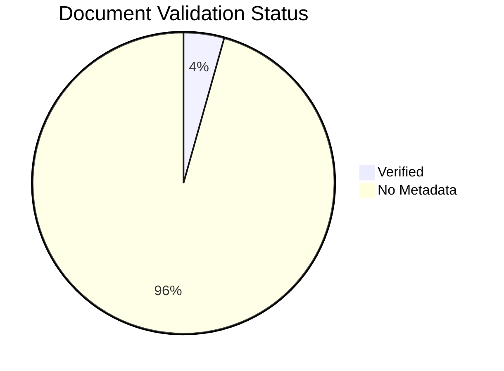

---
content_sources:
  - type: self-generated
    justification: Auto-generated dashboard tracking content validation status
---

# Content Validation Status

This page tracks the source validation status of all documentation content. All content must be traceable to official Microsoft Learn documentation.

## Summary

*Generated: 2026-04-12*

| Content Type | Total | Verified | Pending | Unverified | No Metadata |
|---|---:|---:|---:|---:|---:|
| Mermaid Diagrams | 475 | 475 | 0 | 0 | 0 |
| Text Documents | 69 | 3 | 0 | 0 | 66 |

!!! warning "Validation In Progress"
    66 documents need `content_validation` metadata added.



## By Section

### Platform

| Document | Has Sources | Status | Claims | Last Reviewed |
|---|---|---|---|---|
| [Architecture](../platform/architecture.md) | ✅ | ❓ No Metadata | — | — |
| [Deployment Scenarios](../platform/deployment-scenarios.md) | ✅ | ❓ No Metadata | — | — |
| [Fixed Outbound Nat](../platform/networking-scenarios/fixed-outbound-nat.md) | ❌ | ❓ No Metadata | — | — |
| [Functions Vs App Service](../platform/functions-vs-app-service.md) | ✅ | ❓ No Metadata | — | — |
| [Hosting](../platform/hosting.md) | ✅ | ✅ Verified | 4/4 | 2026-04-12 |
| [Networking](../platform/networking.md) | ✅ | ✅ Verified | 3/3 | 2026-04-12 |
| [Private Egress](../platform/networking-scenarios/private-egress.md) | ❌ | ❓ No Metadata | — | — |
| [Private Ingress](../platform/networking-scenarios/private-ingress.md) | ❌ | ❓ No Metadata | — | — |
| [Public Only](../platform/networking-scenarios/public-only.md) | ❌ | ❓ No Metadata | — | — |
| [Reliability](../platform/reliability.md) | ✅ | ❓ No Metadata | — | — |
| [Scaling](../platform/scaling.md) | ✅ | ✅ Verified | 3/3 | 2026-04-12 |
| [Security](../platform/security.md) | ✅ | ❓ No Metadata | — | — |
| [Triggers And Bindings](../platform/triggers-and-bindings.md) | ✅ | ❓ No Metadata | — | — |

### Best Practices

| Document | Has Sources | Status | Claims | Last Reviewed |
|---|---|---|---|---|
| [Common Anti Patterns](../best-practices/common-anti-patterns.md) | ✅ | ❓ No Metadata | — | — |
| [Cost Optimization](../best-practices/cost-optimization.md) | ✅ | ❓ No Metadata | — | — |
| [Deployment](../best-practices/deployment.md) | ✅ | ❓ No Metadata | — | — |
| [Hosting Plan Selection](../best-practices/hosting-plan-selection.md) | ✅ | ❓ No Metadata | — | — |
| [Networking](../best-practices/networking.md) | ✅ | ❓ No Metadata | — | — |
| [Reliability](../best-practices/reliability.md) | ✅ | ❓ No Metadata | — | — |
| [Scaling](../best-practices/scaling.md) | ✅ | ❓ No Metadata | — | — |
| [Security](../best-practices/security.md) | ✅ | ❓ No Metadata | — | — |
| [Trigger And Binding](../best-practices/trigger-and-binding.md) | ✅ | ❓ No Metadata | — | — |

### Operations

| Document | Has Sources | Status | Claims | Last Reviewed |
|---|---|---|---|---|
| [Alerts](../operations/alerts.md) | ✅ | ❓ No Metadata | — | — |
| [Cold Start](../operations/cold-start.md) | ✅ | ❓ No Metadata | — | — |
| [Configuration](../operations/configuration.md) | ✅ | ❓ No Metadata | — | — |
| [Cost Optimization](../operations/cost-optimization.md) | ✅ | ❓ No Metadata | — | — |
| [Deployment](../operations/deployment.md) | ✅ | ❓ No Metadata | — | — |
| [Monitoring](../operations/monitoring.md) | ✅ | ❓ No Metadata | — | — |
| [Recovery](../operations/recovery.md) | ✅ | ❓ No Metadata | — | — |
| [Retries And Poison Handling](../operations/retries-and-poison-handling.md) | ✅ | ❓ No Metadata | — | — |
| [Security](../operations/security.md) | ✅ | ❓ No Metadata | — | — |

### Troubleshooting

| Document | Has Sources | Status | Claims | Last Reviewed |
|---|---|---|---|---|
| [App Settings Misconfiguration](../troubleshooting/playbooks/auth-config/app-settings-misconfiguration.md) | ✅ | ❓ No Metadata | — | — |
| [Architecture](../troubleshooting/architecture.md) | ✅ | ❓ No Metadata | — | — |
| [Architecture Overview](../troubleshooting/architecture-overview.md) | ✅ | ❓ No Metadata | — | — |
| [Blob Trigger Not Firing](../troubleshooting/playbooks/blob-trigger-not-firing.md) | ✅ | ❓ No Metadata | — | — |
| [Code Storage Verification](../troubleshooting/lab-guides/code-storage-verification.md) | ✅ | ❓ No Metadata | — | — |
| [Cold Start](../troubleshooting/lab-guides/cold-start.md) | ✅ | ❓ No Metadata | — | — |
| [Decision Tree](../troubleshooting/decision-tree.md) | ✅ | ❓ No Metadata | — | — |
| [Deployment Failures](../troubleshooting/playbooks/deployment-failures.md) | ✅ | ❓ No Metadata | — | — |
| [Deployment Not Running](../troubleshooting/lab-guides/deployment-not-running.md) | ✅ | ❓ No Metadata | — | — |
| [Detector Map](../troubleshooting/methodology/detector-map.md) | ✅ | ❓ No Metadata | — | — |
| [Dns Vnet Resolution](../troubleshooting/lab-guides/dns-vnet-resolution.md) | ✅ | ❓ No Metadata | — | — |
| [Durable Orchestration Stuck](../troubleshooting/playbooks/scaling/durable-orchestration-stuck.md) | ✅ | ❓ No Metadata | — | — |
| [Durable Replay Storm](../troubleshooting/lab-guides/durable-replay-storm.md) | ✅ | ❓ No Metadata | — | — |
| [Event Hub Checkpoint Lag](../troubleshooting/lab-guides/event-hub-checkpoint-lag.md) | ✅ | ❓ No Metadata | — | — |
| [Event Hub Service Bus Lag](../troubleshooting/playbooks/triggers/event-hub-service-bus-lag.md) | ✅ | ❓ No Metadata | — | — |
| [Evidence Map](../troubleshooting/evidence-map.md) | ✅ | ❓ No Metadata | — | — |
| [Flex Consumption Deployment](../troubleshooting/playbooks/flex-consumption-deployment.md) | ✅ | ❓ No Metadata | — | — |
| [Functions Failing](../troubleshooting/playbooks/functions-failing.md) | ✅ | ❓ No Metadata | — | — |
| [Functions Not Executing](../troubleshooting/playbooks/functions-not-executing.md) | ✅ | ❓ No Metadata | — | — |
| [High Latency](../troubleshooting/playbooks/high-latency.md) | ✅ | ❓ No Metadata | — | — |
| [High Latency](../troubleshooting/first-10-minutes/high-latency.md) | ✅ | ❓ No Metadata | — | — |
| [Hosting Plan Comparison Matrix](../troubleshooting/lab-guides/hosting-plan-comparison-matrix.md) | ✅ | ❓ No Metadata | — | — |
| [Hosting Plan Security Matrix](../troubleshooting/lab-guides/hosting-plan-security-matrix.md) | ✅ | ❓ No Metadata | — | — |
| [Managed Identity Auth](../troubleshooting/lab-guides/managed-identity-auth.md) | ✅ | ❓ No Metadata | — | — |
| [Managed Identity Rbac Failure](../troubleshooting/playbooks/auth-config/managed-identity-rbac-failure.md) | ✅ | ❓ No Metadata | — | — |
| [Mental Model](../troubleshooting/mental-model.md) | ✅ | ❓ No Metadata | — | — |
| [Methodology](../troubleshooting/methodology.md) | ✅ | ❓ No Metadata | — | — |
| [Out Of Memory Crash](../troubleshooting/lab-guides/out-of-memory-crash.md) | ✅ | ❓ No Metadata | — | — |
| [Out Of Memory Worker Crash](../troubleshooting/playbooks/scaling/out-of-memory-worker-crash.md) | ✅ | ❓ No Metadata | — | — |
| [Queue Backlog Scaling](../troubleshooting/lab-guides/queue-backlog-scaling.md) | ✅ | ❓ No Metadata | — | — |
| [Queue Piling Up](../troubleshooting/playbooks/queue-piling-up.md) | ✅ | ❓ No Metadata | — | — |
| [Quick Diagnosis Cards](../troubleshooting/quick-diagnosis-cards.md) | ✅ | ❓ No Metadata | — | — |
| [Scaling Issues](../troubleshooting/first-10-minutes/scaling-issues.md) | ✅ | ❓ No Metadata | — | — |
| [Storage Access Failure](../troubleshooting/lab-guides/storage-access-failure.md) | ✅ | ❓ No Metadata | — | — |
| [Timeout Execution Limit](../troubleshooting/playbooks/triggers/timeout-execution-limit.md) | ✅ | ❓ No Metadata | — | — |
| [Timer Missed Schedules](../troubleshooting/lab-guides/timer-missed-schedules.md) | ✅ | ❓ No Metadata | — | — |
| [Triggers Not Firing](../troubleshooting/first-10-minutes/triggers-not-firing.md) | ✅ | ❓ No Metadata | — | — |
| [Troubleshooting Method](../troubleshooting/methodology/troubleshooting-method.md) | ✅ | ❓ No Metadata | — | — |

## Validation Categories

### Source Types

| Type | Description | Allowed? |
|---|---|---|
| `mslearn` | Content directly from or based on Microsoft Learn | Yes |
| `mslearn-adapted` | Microsoft Learn content adapted for this guide | Yes, with source URL |
| `self-generated` | Original content created for this guide | Requires justification |
| `community` | From community sources | Not for core content |
| `unknown` | Source not documented | Must be validated |

### Validation Status

| Status | Description |
|---|---|
| `verified` | All core claims traced to Microsoft Learn sources |
| `pending_review` | Document exists but claims need source verification |
| `unverified` | New document, no validation performed |

## How to Add Validation

Add a `content_validation` block to your document's frontmatter:

```yaml
---
content_sources:
  - type: mslearn-adapted
    url: https://learn.microsoft.com/azure/azure-functions/...
content_validation:
  status: verified
  last_reviewed: 2026-04-12
  reviewer: agent
  core_claims:
    - claim: "Flex Consumption supports VNet integration"
      source: https://learn.microsoft.com/azure/azure-functions/flex-consumption-plan
      verified: true
---
```

Then regenerate this page:

```bash
python3 scripts/generate_content_validation_status.py
```

## See Also

- [Tutorial Validation Status](validation-status.md)
- [CLI Cheatsheet](cli-cheatsheet.md)

