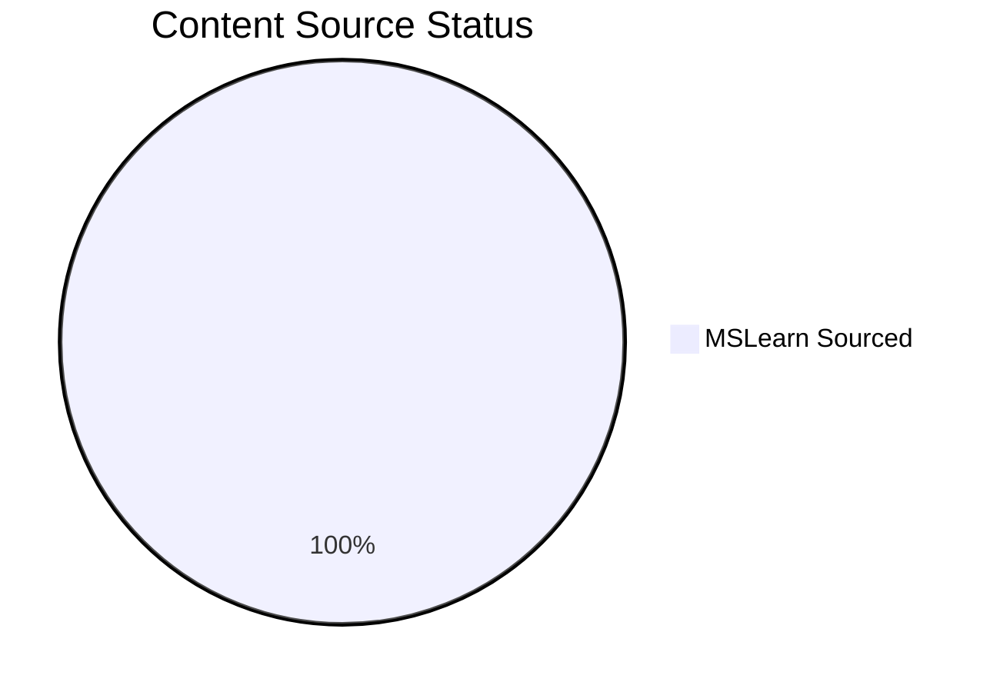

---
content_sources:
  - type: mslearn-adapted
    url: https://learn.microsoft.com/en-us/azure/azure-functions/functions-overview
  - type: mslearn-adapted
    url: https://learn.microsoft.com/en-us/azure/azure-functions/functions-triggers-bindings
---

# Content Validation Status

This page tracks the source validation status of all documentation content, including diagrams and text content. All content must be traceable to official Microsoft Learn documentation.

## Summary

*Generated: 2026-04-10*

| Content Type | Total | MSLearn Sourced | Self-Generated | No Source |
|---|---:|---:|---:|---:|
| Mermaid Diagrams | 475 | 475 | 0 | 0 |
| Text Sections | — | — | — | — |

!!! success "Validation Complete"
    All Mermaid diagrams in this repository now include Microsoft Learn-backed `content_sources` metadata and explicit `diagram-id` comments.

<!-- diagram-id: summary -->


## Validation Categories

### Source Types

| Type | Description | Allowed? |
|---|---|---|
| `mslearn` | Content directly from or based on Microsoft Learn | Yes |
| `mslearn-adapted` | Microsoft Learn content adapted for this guide | Yes, with source URL |
| `self-generated` | Original content created for this guide | Requires justification |
| `community` | From community sources | Not for core content |
| `unknown` | Source not documented | Must be validated |

## How to Validate Content

### Step 1: Add Source Metadata to Frontmatter

Add `content_sources` to the document's YAML frontmatter.

### Step 2: Mark Diagram Blocks with IDs

Add an HTML comment before each mermaid block to identify it.

### Step 3: Run Validation Script

```bash
python3 scripts/validate_content_sources.py
```

### Step 4: Update This Page

```bash
python3 scripts/generate_content_validation_status.py
```

## Validation Rules

1. Platform diagrams and architecture diagrams must have Microsoft Learn sources.
2. Troubleshooting flowcharts may be self-generated if they synthesize Microsoft Learn content.
3. Self-generated content must include a justification field explaining the source basis.
4. Unknown sources must be resolved before content is considered complete.

## See Also

- [Tutorial Validation Status](validation-status.md)
- [CLI Cheatsheet](cli-cheatsheet.md)
