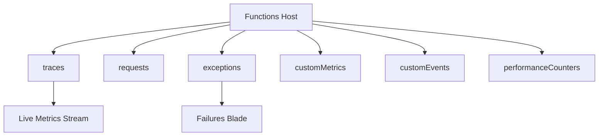

---
content_sources:

  references:
    - type: mslearn-adapted
      url: https://learn.microsoft.com/en-us/azure/azure-functions/analyze-telemetry-data
    - type: mslearn-adapted
      url: https://learn.microsoft.com/en-us/azure/azure-functions/functions-monitoring
  diagrams:
    - id: application-insights-telemetry
      type: flowchart
      source: self-generated
      justification: Flow view of Application Insights telemetry tables emitted by the Functions host, synthesized from Microsoft Learn documentation cited on this page.
      based_on:
        - https://learn.microsoft.com/en-us/azure/azure-functions/analyze-telemetry-data
        - https://learn.microsoft.com/en-us/azure/azure-functions/functions-monitoring
---
# Application Insights Telemetry

Platform metrics count executions and instances, but they cannot tell you *why* a function failed or *what* a specific invocation did. That detail lives in **Application Insights**, which the Functions host populates with structured tables for every invocation. This page catalogs those tables and the queries that turn them into answers.

<!-- diagram-id: application-insights-telemetry -->


## Telemetry Tables

| Table | What the host writes |
|-------|----------------------|
| `traces` | Logs from the runtime, the scale controller, and your function code. For Flex Consumption, also includes code deployment logs. |
| `requests` | One entry per function invocation, with success flag and duration |
| `exceptions` | Any exception thrown by the runtime or surfaced from function code |
| `customMetrics` | Counts of successful and failing invocations, success rate, and duration |
| `customEvents` | Events tracked by the runtime, such as HTTP requests that trigger a function |
| `performanceCounters` | Performance data for the servers the functions run on |

### Useful customDimensions Fields

Every telemetry row carries a `customDimensions` property bag. The most useful keys for Functions are:

| Key | Purpose |
|-----|---------|
| `LogLevel` | Severity emitted by the logger (`Information`, `Warning`, `Error`) |
| `Category` | Log source (for example `Function.MyFunction`, `Host.Results`, `ScaleControllerLogs`) |
| `InvocationId` | Correlates all telemetry for a single function invocation |

The top-level `operation_Id` field correlates telemetry **across** functions in a single end-to-end operation.

## Where Failures Surface

There is **no platform error metric** for Functions. To investigate failures:

- **Failures blade**: in Application Insights, set the Operation Name filter to the function name to see failed requests and their exceptions.
- **`exceptions` table**: query directly for the exception type, message, and stack.

```kusto
exceptions
| where cloud_RoleName == "<function-app-name>"
| summarize count() by type, problemId
| order by count_ desc
```

## Counting Invocation Outcomes

```kusto
requests
| where cloud_RoleName == "<function-app-name>"
| summarize total = count(), failed = countif(success == false) by name
| extend failureRate = round(100.0 * failed / total, 2)
| order by failed desc
```

!!! tip "How to read this"
    `name` is the function name, `failureRate` is the percentage of invocations that failed. A rising failure rate for one function while others stay healthy points to a code or downstream-dependency problem in that specific function.

## Live Metrics Stream

Live Metrics Stream connects directly to the Functions host and shows counters in **near real time with no batching delay** — unlike the tables above, which incur a short ingestion latency. Use it while reproducing an issue or during a deployment to watch request rate, failures, and server health as they happen. Live Metrics data is not retained; it exists only while you are watching.

## Observing Memory and Duration

Because Consumption-plan memory is not a standalone platform metric, use Application Insights instead:

```kusto
performanceCounters
| where cloud_RoleName == "<function-app-name>"
| where name == "Private Bytes"
| summarize avg(value), max(value) by bin(timestamp, 5m)
```

Duration data is available from `customMetrics` (entries whose name contains `Duration`) and from the `requests` table's `duration` field.

## Permissions

To read this telemetry you need **Monitoring Reader** on the Application Insights resource, and typically **Contributor** on the function app to configure the integration. Application Insights integration is usually enabled when the function app is created.

## See Also

- [Metrics Reference](index.md)
- [Function Execution Metrics](function-execution-metrics.md)
- [Scaling and Instances](scaling-and-instances.md)
- [Troubleshooting](../../troubleshooting/index.md)

## Sources

- [Analyze Azure Functions telemetry data (Microsoft Learn)](https://learn.microsoft.com/en-us/azure/azure-functions/analyze-telemetry-data)
- [Monitor executions in Azure Functions (Microsoft Learn)](https://learn.microsoft.com/en-us/azure/azure-functions/functions-monitoring)
