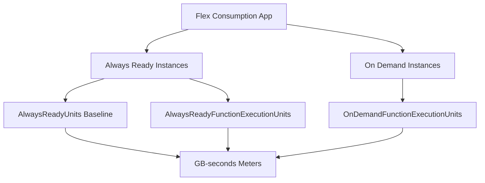

---
content_sources:

  references:
    - type: mslearn-adapted
      url: https://learn.microsoft.com/en-us/azure/azure-functions/monitor-functions-reference
    - type: mslearn-adapted
      url: https://learn.microsoft.com/en-us/azure/azure-functions/flex-consumption-plan
  diagrams:
    - id: flex-consumption-metrics
      type: flowchart
      source: self-generated
      justification: Flow view of Flex Consumption execution metrics and their billing meters, synthesized from Microsoft Learn documentation cited on this page.
      based_on:
        - https://learn.microsoft.com/en-us/azure/azure-functions/monitor-functions-reference
        - https://learn.microsoft.com/en-us/azure/azure-functions/flex-consumption-plan
---
# Flex Consumption Metrics

The Flex Consumption plan bills separately for **always-ready** instances (kept warm to avoid cold starts) and **on-demand** instances (allocated per demand and scaled to zero). Each category has its own execution count and execution-unit metric, plus a baseline metric for the always-ready reservation. This page maps those metrics to their billing meters.

<!-- diagram-id: flex-consumption-metrics -->

## Execution Metrics

All Flex Consumption execution metrics use **Count** unit, **Total (Sum)** aggregation, and the PT1M time grain.

| Metric | REST name | Meaning |
|--------|-----------|---------|
| On Demand Function Execution Count | `OnDemandFunctionExecutionCount` | Executions that ran on on-demand instances |
| Always Ready Function Execution Count | `AlwaysReadyFunctionExecutionCount` | Executions that ran on always-ready instances |
| On Demand Function Execution Units | `OnDemandFunctionExecutionUnits` | MB-milliseconds consumed by on-demand executions |
| Always Ready Function Execution Units | `AlwaysReadyFunctionExecutionUnits` | MB-milliseconds consumed by always-ready executions |
| Always Ready Units | `AlwaysReadyUnits` | MB-milliseconds of always-ready capacity held, whether or not executing |

!!! info "AlwaysReadyUnits is a reservation, not execution"
    `AlwaysReadyUnits` measures the capacity you reserve to keep instances warm. It accrues even when no function is running, which is why the always-ready baseline appears on your bill during idle periods.

## Mapping Metrics to Billing Meters

Execution units are reported in **MB-milliseconds**; divide by `1,024,000` to convert to **GB-seconds**. Execution units equal the fixed instance memory size (for example 512, 2048, or 4096 MB) multiplied by total execution time in milliseconds.

| Metric | Billing meter | Conversion |
|--------|---------------|------------|
| `OnDemandFunctionExecutionCount` | On Demand Total Executions | Direct count |
| `AlwaysReadyFunctionExecutionCount` | Always Ready Total Executions | Direct count |
| `OnDemandFunctionExecutionUnits` | On Demand Execution Time (GB-s) | `/ 1,024,000` |
| `AlwaysReadyFunctionExecutionUnits` | Always Ready Execution Time (GB-s) | `/ 1,024,000` |
| `AlwaysReadyUnits` | Always Ready Baseline (GB-s) | `/ 1,024,000` |

## Performance Metrics

| Metric | REST name | Unit | Aggregation | Notes |
|--------|-----------|------|-------------|-------|
| Automatic Scaling Instance Count | `InstanceCount` | Count | Average | Emitted every 30 seconds; see [Scaling and Instances](scaling-and-instances.md) |
| Memory Working Set | `MemoryWorkingSet` | Bytes | Average | Current memory, per instance |
| Average Memory Working Set | `AverageMemoryWorkingSet` | Bytes | Average | Average memory, per instance |
| CPU Percentage | `CpuPercentage` | Percent | Average | Per instance |

!!! warning "CpuPercentage availability"
    `CpuPercentage` for Flex Consumption is being rolled out gradually and **might not be available for apps in all regions yet**. Confirm the metric appears in the metrics explorer before building alerts on it.

## Aggregation Guidance

- **Instance count**: because `InstanceCount` is emitted every 30 seconds and Flex scales quickly, use a **short time grain** with **Minimum** to catch scale-to-zero and **Maximum** to catch bursts. An average smooths over the exact behavior you usually care about.
- **Execution units**: always use **Sum**. Charting on-demand versus always-ready execution units side by side shows how much traffic your always-ready reservation is actually absorbing — a key input for right-sizing the reservation.
- **Cost attribution**: compare `AlwaysReadyUnits` (baseline held) against `AlwaysReadyFunctionExecutionUnits` (baseline actually used). A large gap means the reservation is oversized for the workload.

## See Also

- [Metrics Reference](index.md)
- [Function Execution Metrics](function-execution-metrics.md)
- [Scaling and Instances](scaling-and-instances.md)
- [Platform Limits](../platform-limits.md)

## Sources

- [Monitoring Azure Functions data reference (Microsoft Learn)](https://learn.microsoft.com/en-us/azure/azure-functions/monitor-functions-reference)
- [Azure Functions Flex Consumption plan (Microsoft Learn)](https://learn.microsoft.com/en-us/azure/azure-functions/flex-consumption-plan)
