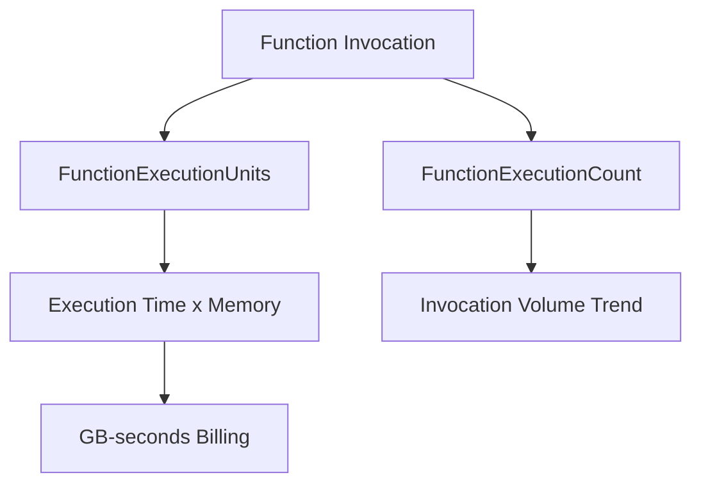

---
content_sources:

  references:
    - type: mslearn-adapted
      url: https://learn.microsoft.com/en-us/azure/azure-functions/monitor-functions-reference
    - type: mslearn-adapted
      url: https://learn.microsoft.com/en-us/azure/azure-functions/functions-consumption-costs
  diagrams:
    - id: function-execution-metrics
      type: flowchart
      source: self-generated
      justification: Flow view of function execution metrics and their billing relationship, synthesized from Microsoft Learn documentation cited on this page.
      based_on:
        - https://learn.microsoft.com/en-us/azure/azure-functions/monitor-functions-reference
        - https://learn.microsoft.com/en-us/azure/azure-functions/functions-consumption-costs
---
# Function Execution Metrics

Azure Functions publishes two execution-focused platform metrics for Consumption-plan apps: `FunctionExecutionCount` (how often functions ran) and `FunctionExecutionUnits` (a combined measure of execution time and memory). Together they explain both throughput and cost on the Consumption plan.

<!-- diagram-id: function-execution-metrics -->


## FunctionExecutionCount

The number of times functions in the app executed within the aggregation window.

| Property | Value |
|----------|-------|
| REST name | `FunctionExecutionCount` |
| Unit | Count |
| Aggregation | Total (Sum) |
| Time grain | PT1M (1 minute) |
| Scope | Function apps only |

Use the **Sum** aggregation to count invocations. This metric answers "how much work did the app do?" and is the primary signal for throughput trends and traffic anomalies.

## FunctionExecutionUnits

A combination of execution time and memory consumption, expressed in **MB-milliseconds**. This is the metric that underpins Consumption-plan billing.

| Property | Value |
|----------|-------|
| REST name | `FunctionExecutionUnits` |
| Unit | Count (MB-milliseconds) |
| Aggregation | Total (Sum) |
| Time grain | PT1M (1 minute) |
| Scope | Function apps only |

!!! note "Memory is not a separate metric"
    On the Consumption plan, memory consumption is **not** exposed as its own Azure Monitor metric. It is folded into `FunctionExecutionUnits`. To observe memory directly, query the Application Insights `performanceCounters` table (`Private Bytes`) — see [Application Insights Telemetry](application-insights-telemetry.md).

### Converting Execution Units to GB-seconds

Consumption billing is expressed in **GB-seconds**. `FunctionExecutionUnits` is reported in MB-milliseconds, so:

```text
GB-seconds = FunctionExecutionUnits / 1,024,000
```

The divisor combines the MB-to-GB conversion (1,024) and the millisecond-to-second conversion (1,000). Averaged memory is rounded up to the nearest 128 MB for billing, so the metric is an observability signal rather than an exact invoice figure.

## Plan Support Caveats

| Plan | `FunctionExecutionCount` | `FunctionExecutionUnits` |
|------|--------------------------|--------------------------|
| Consumption (Windows) | Supported | Supported |
| Consumption (Linux) | Not available | Not available |
| Flex Consumption | Use `OnDemand*`/`AlwaysReady*` metrics instead | Use `OnDemand*`/`AlwaysReady*` metrics instead |
| Premium / Dedicated (Linux) | Not supported | Not supported |

For Flex Consumption apps, the equivalent signals are split across always-ready and on-demand instances — see [Flex Consumption Metrics](flex-consumption-metrics.md).

## Alerting Guidance

- **Throughput drop**: alert when `FunctionExecutionCount` (Sum, PT5M) falls to zero during expected traffic hours — a common signal of a broken trigger or misconfigured binding.
- **Cost spike**: chart `FunctionExecutionUnits` (Sum) daily; a sustained increase without a matching `FunctionExecutionCount` increase indicates functions are running longer or using more memory per call.

## See Also

- [Metrics Reference](index.md)
- [Flex Consumption Metrics](flex-consumption-metrics.md)
- [Application Insights Telemetry](application-insights-telemetry.md)
- [Platform Limits](../platform-limits.md)

## Sources

- [Monitoring Azure Functions data reference (Microsoft Learn)](https://learn.microsoft.com/en-us/azure/azure-functions/monitor-functions-reference)
- [Estimating Consumption plan costs (Microsoft Learn)](https://learn.microsoft.com/en-us/azure/azure-functions/functions-consumption-costs)
