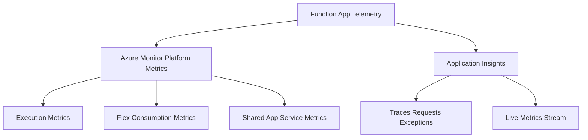

---
content_sources:

  references:
    - type: mslearn-adapted
      url: https://learn.microsoft.com/en-us/azure/azure-functions/monitor-functions-reference
    - type: mslearn-adapted
      url: https://learn.microsoft.com/en-us/azure/azure-functions/monitor-functions
    - type: mslearn-adapted
      url: https://learn.microsoft.com/en-us/azure/azure-monitor/reference/supported-metrics/microsoft-web-sites-metrics
  diagrams:
    - id: metrics-sources
      type: flowchart
      source: self-generated
      justification: Flow view of Azure Functions metric sources, synthesized from Microsoft Learn documentation cited on this page.
      based_on:
        - https://learn.microsoft.com/en-us/azure/azure-functions/monitor-functions-reference
        - https://learn.microsoft.com/en-us/azure/azure-functions/monitor-functions
---
# Metrics Reference

Azure Functions emits telemetry through two independent channels: **Azure Monitor platform metrics** (published automatically for the `Microsoft.Web/sites` resource) and **Application Insights** (execution-level traces, requests, and exceptions). This reference catalogs the platform metrics that matter for Functions and points to the deeper topic pages for billing, scaling, and telemetry analysis.

<!-- diagram-id: metrics-sources -->

## Metric Sources

| Source | What it provides | Latency | Retention |
|--------|------------------|---------|-----------|
| Azure Monitor platform metrics | Numeric counters and gauges for the `Microsoft.Web/sites` resource | ~1 minute (PT1M grain) | 93 days (platform metrics) |
| Application Insights | Per-invocation traces, requests, exceptions, custom metrics | Seconds to a few minutes | Configurable (default 90 days) |
| Live Metrics Stream | Near real-time host counters with no batching delay | Sub-second | Not retained (live only) |

!!! info "Linux Consumption caveat"
    Platform execution metrics are **not available when a function app runs on Linux in a Consumption plan**. Use Application Insights telemetry instead for those apps.

## Topic Pages

| Page | Focus |
|------|-------|
| [Function Execution Metrics](function-execution-metrics.md) | `FunctionExecutionCount`, `FunctionExecutionUnits`, and Consumption billing |
| [Flex Consumption Metrics](flex-consumption-metrics.md) | Always-ready vs on-demand execution metrics and GB-second meters |
| [Scaling and Instances](scaling-and-instances.md) | `InstanceCount` and scale controller log analysis |
| [Application Insights Telemetry](application-insights-telemetry.md) | Traces, requests, exceptions, custom metrics, and Live Metrics |

## Functions-Relevant Platform Metrics

The following `Microsoft.Web/sites` metrics are the most useful for Azure Functions. Aggregation types and dimensions come from the Azure Monitor metrics reference.

| Metric | REST name | Unit | Aggregation | Plan scope |
|--------|-----------|------|-------------|------------|
| Function Execution Count | `FunctionExecutionCount` | Count | Total (Sum) | Function apps (not Premium/Dedicated on Linux) |
| Function Execution Units | `FunctionExecutionUnits` | Count | Total (Sum) | Function apps (not Premium/Dedicated on Linux) |
| Always Ready Function Execution Count | `AlwaysReadyFunctionExecutionCount` | Count | Total (Sum) | Flex Consumption |
| Always Ready Function Execution Units | `AlwaysReadyFunctionExecutionUnits` | Count | Total (Sum) | Flex Consumption |
| Always Ready Units | `AlwaysReadyUnits` | Count | Total (Sum) | Flex Consumption |
| On Demand Function Execution Count | `OnDemandFunctionExecutionCount` | Count | Total (Sum) | Flex Consumption |
| On Demand Function Execution Units | `OnDemandFunctionExecutionUnits` | Count | Total (Sum) | Flex Consumption |
| Automatic Scaling Instance Count | `InstanceCount` | Count | Average | Flex Consumption |
| CPU Percentage | `CpuPercentage` | Percent | Average | Flex Consumption |
| Memory Working Set | `MemoryWorkingSet` | Bytes | Average | All |
| Average Memory Working Set | `AverageMemoryWorkingSet` | Bytes | Average | All |

## Shared App Service Metrics

Because a function app is a `Microsoft.Web/sites` resource, it also publishes the standard App Service metrics. These are useful for HTTP-triggered apps.

| Metric | REST name | Unit | Aggregation |
|--------|-----------|------|-------------|
| Requests | `Requests` | Count | Total (Sum) |
| Http Server Errors | `Http5xx` | Count | Total (Sum) |
| Http 4xx | `Http4xx` | Count | Total (Sum) |
| Http 2xx | `Http2xx` | Count | Total (Sum) |
| Response Time | `HttpResponseTime` | Seconds | Average |
| Connections | `AppConnections` | Count | Average |
| Data In | `BytesReceived` | Bytes | Total (Sum) |
| Data Out | `BytesSent` | Bytes | Total (Sum) |
| Health Check Status | `HealthCheckStatus` | Count | Average |

## How to Read These Metrics

- **Aggregation matters.** Count-style metrics such as `FunctionExecutionCount` are meaningful only with the **Sum** aggregation. Gauge metrics such as `MemoryWorkingSet` use **Average**. `InstanceCount` is emitted every 30 seconds, so a short time grain plus **Minimum**/**Maximum** reveals scale-to-zero and burst behavior that an average would hide.
- **Dimensions.** Although the metric catalog lists an `Instance` column for many rows, the Functions service documentation states that these metrics **do not carry splittable dimensions**. Treat per-instance splitting as unavailable and use Application Insights `cloud_RoleInstance` when you need per-instance breakdowns.
- **No error metric.** There is no `FunctionErrors` platform metric. Function failures surface through the Application Insights `exceptions` table and the **Failures** blade — see [Application Insights Telemetry](application-insights-telemetry.md).

## See Also

- [Function Execution Metrics](function-execution-metrics.md)
- [Flex Consumption Metrics](flex-consumption-metrics.md)
- [Scaling and Instances](scaling-and-instances.md)
- [Application Insights Telemetry](application-insights-telemetry.md)
- [Platform Limits](../platform-limits.md)
- [Operations](../../operations/index.md)

## Sources

- [Monitoring Azure Functions data reference (Microsoft Learn)](https://learn.microsoft.com/en-us/azure/azure-functions/monitor-functions-reference)
- [Monitor Azure Functions (Microsoft Learn)](https://learn.microsoft.com/en-us/azure/azure-functions/monitor-functions)
- [Supported metrics for Microsoft.Web/sites (Microsoft Learn)](https://learn.microsoft.com/en-us/azure/azure-monitor/reference/supported-metrics/microsoft-web-sites-metrics)
