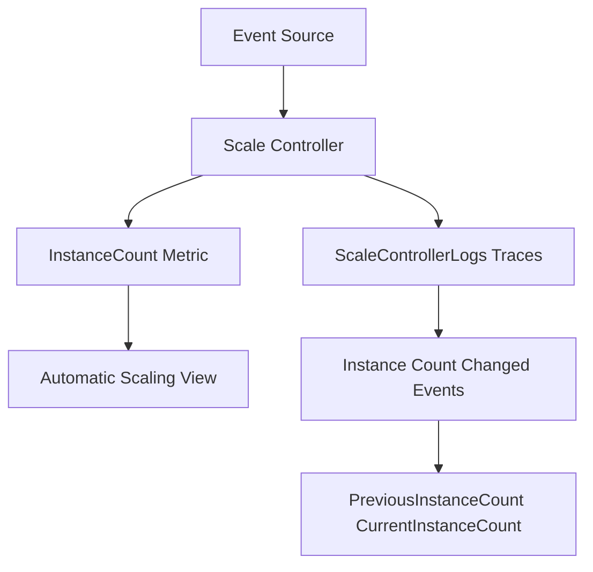

---
content_sources:

  references:
    - type: mslearn-adapted
      url: https://learn.microsoft.com/en-us/azure/azure-functions/monitor-functions-reference
    - type: mslearn-adapted
      url: https://learn.microsoft.com/en-us/azure/azure-functions/analyze-telemetry-data
    - type: mslearn-adapted
      url: https://learn.microsoft.com/en-us/azure/azure-functions/event-driven-scaling
  diagrams:
    - id: scaling-and-instances
      type: flowchart
      source: self-generated
      justification: Flow view of scaling signals from the scale controller to metrics and logs, synthesized from Microsoft Learn documentation cited on this page.
      based_on:
        - https://learn.microsoft.com/en-us/azure/azure-functions/monitor-functions-reference
        - https://learn.microsoft.com/en-us/azure/azure-functions/analyze-telemetry-data
        - https://learn.microsoft.com/en-us/azure/azure-functions/event-driven-scaling
---
# Scaling and Instances

Azure Functions scales by adding and removing instances in response to event load. Two signals expose that behavior: the `InstanceCount` platform metric (a numeric gauge) and **scale controller logs** (detailed decision traces in Application Insights). This page covers both and how to correlate them.

<!-- diagram-id: scaling-and-instances -->


## InstanceCount Metric

| Property | Value |
|----------|-------|
| REST name | `InstanceCount` |
| Display name | Automatic Scaling Instance Count |
| Unit | Count |
| Aggregation | Average |
| Emission interval | Every 30 seconds |
| Scope | Flex Consumption |

Because the metric is emitted every 30 seconds and scaling can be rapid, choose aggregation deliberately:

- **Minimum** over a short grain reveals scale-to-zero (idle) periods.
- **Maximum** reveals peak fan-out during bursts.
- **Average** is useful only for long-horizon capacity trends.

## Scale Controller Logs

The scale controller makes the scale-out and scale-in decisions. Its reasoning can be captured in Application Insights (a **preview** capability) by enabling scale controller logging and Application Insights integration. Once enabled, entries land in the `traces` table under the `ScaleControllerLogs` category.

### Enabling Scale Controller Logging

Set the `SCALE_CONTROLLER_LOGGING_ENABLED` application setting to route scale controller logs to Application Insights. The value controls verbosity (`AppInsights:Verbose` for full detail). The function app must already have Application Insights integration configured.

### Querying All Scale Controller Activity

```kusto
traces
| extend CustomDimensions = todynamic(tostring(customDimensions))
| where CustomDimensions.Category == "ScaleControllerLogs"
| project timestamp, message, logLevel = CustomDimensions.LogLevel
| order by timestamp desc
```

!!! tip "How to read this"
    Each row is a scale controller decision or observation. A high volume of these logs during a load event confirms the scale controller is actively evaluating your app; their absence during load can indicate that scaling is constrained (for example by a plan instance limit).

### Detecting Instance Count Changes

```kusto
traces
| extend CustomDimensions = todynamic(tostring(customDimensions))
| where CustomDimensions.Category == "ScaleControllerLogs"
| where message == "Instance count changed"
| extend previous = CustomDimensions.PreviousInstanceCount, current = CustomDimensions.CurrentInstanceCount
| project timestamp, previous, current
| order by timestamp asc
```

Pair this query with the `InstanceCount` metric chart: the metric shows *how many* instances existed, while the logs show *when and why* the count changed.

## Event-Driven Scaling Context

On Consumption and Flex Consumption plans, the scale controller monitors the event source (queue depth, event hub lag, HTTP demand) and adds instances accordingly. Key behaviors to keep in mind when interpreting the metrics:

- New instances are added at a bounded rate; the metric will ramp rather than jump instantly to peak.
- Scale-in is gradual and lags the drop in load, so `InstanceCount` stays elevated briefly after a burst ends.
- The maximum reachable value is capped by the plan's scale-out limit — see [Platform Limits](../platform-limits.md).

## See Also

- [Metrics Reference](index.md)
- [Flex Consumption Metrics](flex-consumption-metrics.md)
- [Application Insights Telemetry](application-insights-telemetry.md)
- [Platform Limits](../platform-limits.md)

## Sources

- [Monitoring Azure Functions data reference (Microsoft Learn)](https://learn.microsoft.com/en-us/azure/azure-functions/monitor-functions-reference)
- [Analyze Azure Functions telemetry data (Microsoft Learn)](https://learn.microsoft.com/en-us/azure/azure-functions/analyze-telemetry-data)
- [Event-driven scaling in Azure Functions (Microsoft Learn)](https://learn.microsoft.com/en-us/azure/azure-functions/event-driven-scaling)
