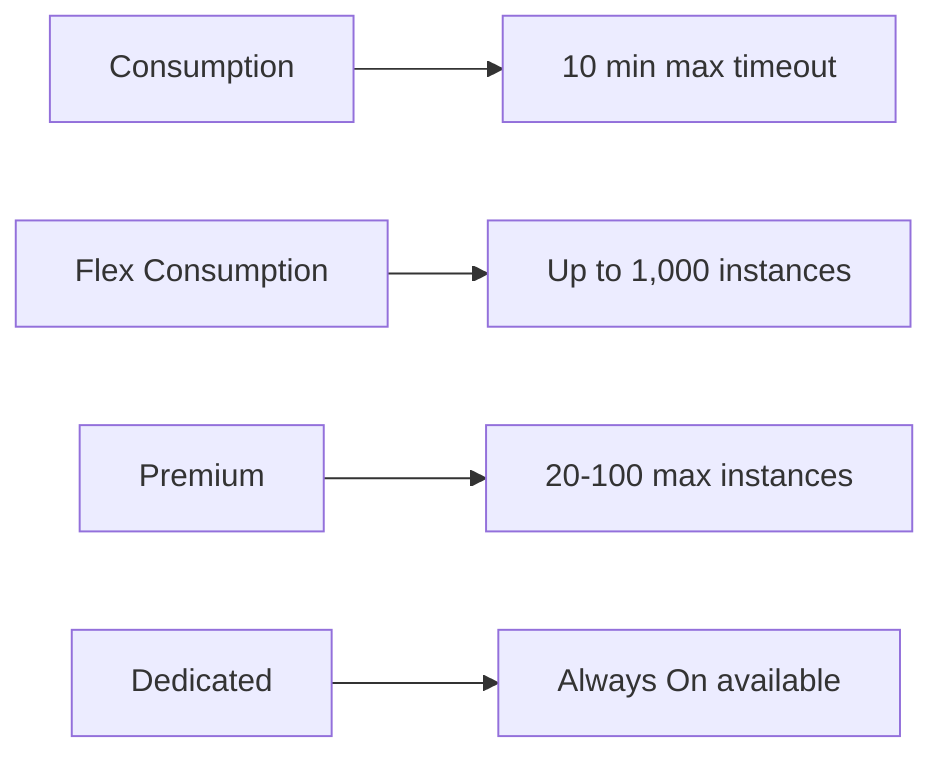

---
content_sources:
  - type: mslearn-adapted
    url: https://learn.microsoft.com/azure/azure-functions/functions-scale#service-limits
---

# Platform Limits

Azure Functions has platform-imposed limits that vary by hosting plan. Understanding these limits is essential for capacity planning, architecture decisions, and avoiding unexpected failures. This reference documents the most impactful limits for Python function apps.

<!-- diagram-id: platform-limits -->


## Hosting Plan Comparison

| Limit | Consumption (Y1) | Flex Consumption (FC1) | Premium (EP1-EP3) | Dedicated (B1-P3v3) |
|-------|------------------|------------------------|-------------------|---------------------|
| **Max execution timeout** | 10 min | Unbounded | Unlimited | Unlimited (`Always On` required) |
| **Default execution timeout** | 5 min | 30 min | 30 min | 30 min |
| **Max instances (scale-out)** | 200 | 1,000 | 20-100 (region/subscription constraints) | 10-30 (varies by tier) |
| **Max request size** | 210 MB | 210 MB | 210 MB | 210 MB |
| **Max response size** | 100 MB | 100 MB | 100 MB | 100 MB |
| **Max connections per instance** | 600 active, 1200 total | Unbounded | Unbounded | See App Service limits |
| **Memory per instance** | 1.5 GB (fixed) | 512 / 2048 / 4096 MB | 3.5-14 GB (varies by tier) | 1.75-14 GB (varies by tier) |
| **Storage per app** | 1 GB (Consumption share) | Deployment package in blob container | 250 GB | 50-1000 GB |
| **Function apps per plan** | 100 | **1** | 100 | Resource-based / unbounded |
| **VNet integration** | ❌ | ✅ | ✅ | ✅ |
| **Deployment slots** | 2 (including production) | 0 | 3 (including production) | 1-20 (varies by tier) |
| **Always On** | ❌ (scales to zero) | Optional always-ready | ✅ (always-ready instances) | ✅ |

## Execution Timeout

The maximum time a single function invocation can run before being terminated:

### Consumption Plan

| Setting | Value |
|---------|-------|
| Default timeout | 5 minutes |
| Maximum configurable timeout | **10 minutes** |

Configure in `host.json`:

```json
{
  "functionTimeout": "00:10:00"
}
```

When a function exceeds the timeout, the host terminates the worker process. For HTTP triggers, upstream clients can time out before function completion due to the Azure Load Balancer idle timeout.

### Premium Plan

| Setting | Value |
|---------|-------|
| Default timeout | 30 minutes |
| Maximum configurable timeout | Unlimited |
| Unlimited timeout | Set `"functionTimeout": "-1"` (removing `functionTimeout` reverts to the 30-minute default) |

```json
{
  "functionTimeout": "-1"
}
```

> **Tip:** For operations that might exceed the timeout, use [Durable Functions](../language-guides/python/recipes/durable-orchestration.md) to break the work into smaller activity functions that each complete within the timeout.

## Instance Limits

### Consumption Plan: 200 Instances

The Consumption plan can scale to a maximum of 200 instances. Scale is event-driven and there isn't a per-app instance cap command for this plan.

### Premium Plan: 20-100 Instances

The Premium plan scale-out cap is typically in the 20-100 range depending on region, subscription, and capacity constraints. Configure always-ready and pre-warmed behavior in the Azure portal or with ARM/Bicep templates.

```bash
# Premium pre-warmed and always-ready settings are managed in
# the Azure portal or in ARM/Bicep resource configuration.
```

### Flex Consumption Plan: 1,000 Instances

Flex Consumption supports up to 1,000 instances with per-function scaling behavior and optional always-ready instances.

```bash
# Set Flex maximum instance count
az functionapp scale config set \
  --resource-group $RG \
  --name $APP_NAME \
  --maximum-instance-count <count>

# Configure always-ready instances for HTTP triggers
az functionapp scale config always-ready set \
  --resource-group $RG \
  --name $APP_NAME \
  --settings http=<count>
```

Capacity planning should account for subnet sizing and outbound networking capacity when VNet integration is enabled.

## HTTP Request and Response Limits

| Limit | Value | Notes |
|-------|-------|-------|
| Max request body size | 210 MB | Applies to all hosting plans |
| Max response body size | 100 MB | Applies to all hosting plans |
| Max URL length | 8,192 bytes | Standard HTTP limit |
| Max header size | 32 KB | Total across all headers |
| Request timeout (external) | 230 seconds | Azure load balancer timeout; function may run longer but client disconnects |

> **Important:** The Azure load balancer has a **230-second** idle timeout. For HTTP triggers, even if your function timeout is set higher, the client will receive a timeout error after 230 seconds. For long-running operations, return a 202 Accepted immediately and use a polling pattern.

## Concurrent Connections

Outbound connection limits differ by hosting plan:

| Limit | Value |
|-------|-------|
| Consumption (active/total) | 600 active / 1,200 total per instance |
| Flex Consumption | Unbounded |
| Premium | Unbounded |
| Dedicated | See App Service limits |

### Avoiding Connection Exhaustion

Reuse HTTP clients across function invocations:

```python
import httpx

# Module-level client — reused across invocations
_http_client = httpx.Client(timeout=30.0)

@bp.route(route="api/data", methods=["GET"])
def get_data(req: func.HttpRequest) -> func.HttpResponse:
    # Reuses the same client and connection pool
    resp = _http_client.get("https://api.example.com/data")
    return func.HttpResponse(resp.text, mimetype="application/json")
```

Creating a new client per invocation is a common cause of connection exhaustion under load.

## Memory Limits

| Plan | Memory Per Instance |
|------|-------------------|
| Consumption | 1.5 GB |
| Premium EP1 | 3.5 GB |
| Premium EP2 | 7 GB |
| Premium EP3 | 14 GB |
| Dedicated B1 | 1.75 GB |
| Dedicated P3v3 | 14 GB |

On the Consumption plan, exceeding 1.5 GB causes the instance to be recycled. Monitor memory usage with Application Insights:

```kql
performanceCounters
| where cloud_RoleName == "$APP_NAME"
| where name == "Private Bytes"
| summarize avg(value) by bin(timestamp, 5m)
| render timechart
```

### Python Memory Considerations

Each Python worker process typically uses 50-150 MB at idle, plus memory for loaded packages. With `FUNCTIONS_WORKER_PROCESS_COUNT=4`, idle memory usage is approximately 200-600 MB, leaving limited headroom on the Consumption plan.

> **Note:** These Python worker memory values are practical estimates from observed runtime behavior, not official Microsoft service limits.

| Configuration | Approximate Idle Memory | Headroom (Consumption) |
|--------------|------------------------|----------------------|
| 1 worker, small deps | ~100 MB | ~1.4 GB |
| 1 worker, large deps (pandas, numpy) | ~300 MB | ~1.2 GB |
| 4 workers, small deps | ~400 MB | ~1.1 GB |
| 4 workers, large deps | ~1.2 GB | ~0.3 GB ⚠️ |

## Storage Account Limits

Azure Functions relies on an Azure Storage account for internal operations. The storage account's limits can impact function app behaviour:

| Storage Limit | Value |
|--------------|-------|
| Max requests per storage account | 20,000 per second |
| Max blob throughput | 60 MiB/s per blob |
| Max queue messages per second | 2,000 per queue (per storage account) |
| Max table operations per second | 20,000 per storage account |

For high-throughput scenarios, consider using a dedicated storage account for `AzureWebJobsStorage` separate from application data storage.

## Function App Limits

| Limit | Value |
|-------|-------|
| Functions per app | No hard limit (recommended: < 100) |
| Deployment package size | 1 GB (run-from-package) |
| App settings | 4,096 bytes per setting; no limit on number |
| Custom domains | 500 per function app |

## See Also
- [Scaling](../platform/scaling.md)
- [Cost Optimization](../start-here/hosting-options.md)
- [Python Runtime](../language-guides/python/python-runtime.md)
- [host.json Reference](host-json.md)

## Sources
- [Azure Functions Scale and Service Limits (Microsoft Learn)](https://learn.microsoft.com/azure/azure-functions/functions-scale#service-limits)
