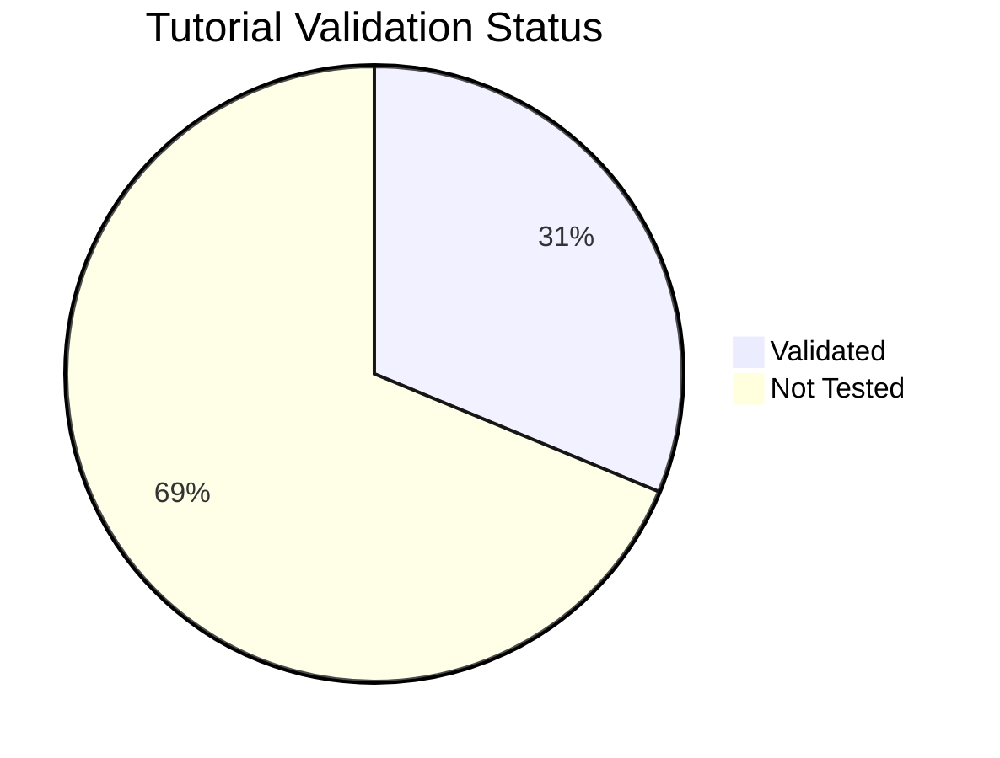

# Tutorial Validation Status

This page tracks which tutorials have been validated against real Azure deployments. Each tutorial can be tested via **az-cli** (manual CLI commands) or **Bicep** (infrastructure as code). Tutorials not tested within 90 days are marked as stale.

## Summary

*Generated: 2026-04-10*

| Metric | Count |
|---|---:|
| Total tutorials | 112 |
| ✅ Validated | 35 |
| ⚠️ Stale (>90 days) | 0 |
| ❌ Failed | 0 |
| ➖ Not tested | 77 |



## Validation Matrix

### .NET

| Tutorial | Hosting Plan | az-cli | Bicep | Last Tested | Status |
|---|---|---|---|---|---|
| [01 Local Run](../language-guides/dotnet/tutorial/consumption/01-local-run.md) | Consumption (Y1) | ➖ No Data | ➖ No Data | — | ➖ Not Tested |
| [02 First Deploy](../language-guides/dotnet/tutorial/consumption/02-first-deploy.md) | Consumption (Y1) | ➖ No Data | ➖ No Data | — | ➖ Not Tested |
| [03 Configuration](../language-guides/dotnet/tutorial/consumption/03-configuration.md) | Consumption (Y1) | ➖ No Data | ➖ No Data | — | ➖ Not Tested |
| [04 Logging Monitoring](../language-guides/dotnet/tutorial/consumption/04-logging-monitoring.md) | Consumption (Y1) | ➖ No Data | ➖ No Data | — | ➖ Not Tested |
| [05 Infrastructure As Code](../language-guides/dotnet/tutorial/consumption/05-infrastructure-as-code.md) | Consumption (Y1) | ➖ No Data | ➖ No Data | — | ➖ Not Tested |
| [06 Ci Cd](../language-guides/dotnet/tutorial/consumption/06-ci-cd.md) | Consumption (Y1) | ➖ No Data | ➖ No Data | — | ➖ Not Tested |
| [07 Extending Triggers](../language-guides/dotnet/tutorial/consumption/07-extending-triggers.md) | Consumption (Y1) | ➖ No Data | ➖ No Data | — | ➖ Not Tested |
| [01 Local Run](../language-guides/dotnet/tutorial/flex-consumption/01-local-run.md) | Flex Consumption (FC1) | ➖ No Data | ➖ No Data | — | ➖ Not Tested |
| [02 First Deploy](../language-guides/dotnet/tutorial/flex-consumption/02-first-deploy.md) | Flex Consumption (FC1) | ➖ No Data | ➖ No Data | — | ➖ Not Tested |
| [03 Configuration](../language-guides/dotnet/tutorial/flex-consumption/03-configuration.md) | Flex Consumption (FC1) | ➖ No Data | ➖ No Data | — | ➖ Not Tested |
| [04 Logging Monitoring](../language-guides/dotnet/tutorial/flex-consumption/04-logging-monitoring.md) | Flex Consumption (FC1) | ➖ No Data | ➖ No Data | — | ➖ Not Tested |
| [05 Infrastructure As Code](../language-guides/dotnet/tutorial/flex-consumption/05-infrastructure-as-code.md) | Flex Consumption (FC1) | ➖ No Data | ➖ No Data | — | ➖ Not Tested |
| [06 Ci Cd](../language-guides/dotnet/tutorial/flex-consumption/06-ci-cd.md) | Flex Consumption (FC1) | ➖ No Data | ➖ No Data | — | ➖ Not Tested |
| [07 Extending Triggers](../language-guides/dotnet/tutorial/flex-consumption/07-extending-triggers.md) | Flex Consumption (FC1) | ➖ No Data | ➖ No Data | — | ➖ Not Tested |
| [01 Local Run](../language-guides/dotnet/tutorial/premium/01-local-run.md) | Premium (EP) | ➖ No Data | ➖ No Data | — | ➖ Not Tested |
| [02 First Deploy](../language-guides/dotnet/tutorial/premium/02-first-deploy.md) | Premium (EP) | ➖ No Data | ➖ No Data | — | ➖ Not Tested |
| [03 Configuration](../language-guides/dotnet/tutorial/premium/03-configuration.md) | Premium (EP) | ➖ No Data | ➖ No Data | — | ➖ Not Tested |
| [04 Logging Monitoring](../language-guides/dotnet/tutorial/premium/04-logging-monitoring.md) | Premium (EP) | ➖ No Data | ➖ No Data | — | ➖ Not Tested |
| [05 Infrastructure As Code](../language-guides/dotnet/tutorial/premium/05-infrastructure-as-code.md) | Premium (EP) | ➖ No Data | ➖ No Data | — | ➖ Not Tested |
| [06 Ci Cd](../language-guides/dotnet/tutorial/premium/06-ci-cd.md) | Premium (EP) | ➖ No Data | ➖ No Data | — | ➖ Not Tested |
| [07 Extending Triggers](../language-guides/dotnet/tutorial/premium/07-extending-triggers.md) | Premium (EP) | ➖ No Data | ➖ No Data | — | ➖ Not Tested |
| [01 Local Run](../language-guides/dotnet/tutorial/dedicated/01-local-run.md) | Dedicated (App Service) | ➖ No Data | ➖ No Data | — | ➖ Not Tested |
| [02 First Deploy](../language-guides/dotnet/tutorial/dedicated/02-first-deploy.md) | Dedicated (App Service) | ➖ No Data | ➖ No Data | — | ➖ Not Tested |
| [03 Configuration](../language-guides/dotnet/tutorial/dedicated/03-configuration.md) | Dedicated (App Service) | ➖ No Data | ➖ No Data | — | ➖ Not Tested |
| [04 Logging Monitoring](../language-guides/dotnet/tutorial/dedicated/04-logging-monitoring.md) | Dedicated (App Service) | ➖ No Data | ➖ No Data | — | ➖ Not Tested |
| [05 Infrastructure As Code](../language-guides/dotnet/tutorial/dedicated/05-infrastructure-as-code.md) | Dedicated (App Service) | ➖ No Data | ➖ No Data | — | ➖ Not Tested |
| [06 Ci Cd](../language-guides/dotnet/tutorial/dedicated/06-ci-cd.md) | Dedicated (App Service) | ➖ No Data | ➖ No Data | — | ➖ Not Tested |
| [07 Extending Triggers](../language-guides/dotnet/tutorial/dedicated/07-extending-triggers.md) | Dedicated (App Service) | ➖ No Data | ➖ No Data | — | ➖ Not Tested |

### Java

| Tutorial | Hosting Plan | az-cli | Bicep | Last Tested | Status |
|---|---|---|---|---|---|
| [01 Local Run](../language-guides/java/tutorial/consumption/01-local-run.md) | Consumption (Y1) | ➖ No Data | ➖ No Data | — | ➖ Not Tested |
| [02 First Deploy](../language-guides/java/tutorial/consumption/02-first-deploy.md) | Consumption (Y1) | ➖ No Data | ➖ No Data | — | ➖ Not Tested |
| [03 Configuration](../language-guides/java/tutorial/consumption/03-configuration.md) | Consumption (Y1) | ➖ No Data | ➖ No Data | — | ➖ Not Tested |
| [04 Logging Monitoring](../language-guides/java/tutorial/consumption/04-logging-monitoring.md) | Consumption (Y1) | ➖ No Data | ➖ No Data | — | ➖ Not Tested |
| [05 Infrastructure As Code](../language-guides/java/tutorial/consumption/05-infrastructure-as-code.md) | Consumption (Y1) | ➖ No Data | ➖ No Data | — | ➖ Not Tested |
| [06 Ci Cd](../language-guides/java/tutorial/consumption/06-ci-cd.md) | Consumption (Y1) | ➖ No Data | ➖ No Data | — | ➖ Not Tested |
| [07 Extending Triggers](../language-guides/java/tutorial/consumption/07-extending-triggers.md) | Consumption (Y1) | ➖ No Data | ➖ No Data | — | ➖ Not Tested |
| [01 Local Run](../language-guides/java/tutorial/flex-consumption/01-local-run.md) | Flex Consumption (FC1) | ➖ No Data | ➖ No Data | — | ➖ Not Tested |
| [02 First Deploy](../language-guides/java/tutorial/flex-consumption/02-first-deploy.md) | Flex Consumption (FC1) | ➖ No Data | ➖ No Data | — | ➖ Not Tested |
| [03 Configuration](../language-guides/java/tutorial/flex-consumption/03-configuration.md) | Flex Consumption (FC1) | ➖ No Data | ➖ No Data | — | ➖ Not Tested |
| [04 Logging Monitoring](../language-guides/java/tutorial/flex-consumption/04-logging-monitoring.md) | Flex Consumption (FC1) | ➖ No Data | ➖ No Data | — | ➖ Not Tested |
| [05 Infrastructure As Code](../language-guides/java/tutorial/flex-consumption/05-infrastructure-as-code.md) | Flex Consumption (FC1) | ➖ No Data | ➖ No Data | — | ➖ Not Tested |
| [06 Ci Cd](../language-guides/java/tutorial/flex-consumption/06-ci-cd.md) | Flex Consumption (FC1) | ➖ No Data | ➖ No Data | — | ➖ Not Tested |
| [07 Extending Triggers](../language-guides/java/tutorial/flex-consumption/07-extending-triggers.md) | Flex Consumption (FC1) | ➖ No Data | ➖ No Data | — | ➖ Not Tested |
| [01 Local Run](../language-guides/java/tutorial/premium/01-local-run.md) | Premium (EP) | ➖ No Data | ➖ No Data | — | ➖ Not Tested |
| [02 First Deploy](../language-guides/java/tutorial/premium/02-first-deploy.md) | Premium (EP) | ➖ No Data | ➖ No Data | — | ➖ Not Tested |
| [03 Configuration](../language-guides/java/tutorial/premium/03-configuration.md) | Premium (EP) | ➖ No Data | ➖ No Data | — | ➖ Not Tested |
| [04 Logging Monitoring](../language-guides/java/tutorial/premium/04-logging-monitoring.md) | Premium (EP) | ➖ No Data | ➖ No Data | — | ➖ Not Tested |
| [05 Infrastructure As Code](../language-guides/java/tutorial/premium/05-infrastructure-as-code.md) | Premium (EP) | ➖ No Data | ➖ No Data | — | ➖ Not Tested |
| [06 Ci Cd](../language-guides/java/tutorial/premium/06-ci-cd.md) | Premium (EP) | ➖ No Data | ➖ No Data | — | ➖ Not Tested |
| [07 Extending Triggers](../language-guides/java/tutorial/premium/07-extending-triggers.md) | Premium (EP) | ➖ No Data | ➖ No Data | — | ➖ Not Tested |
| [01 Local Run](../language-guides/java/tutorial/dedicated/01-local-run.md) | Dedicated (App Service) | ➖ No Data | ➖ No Data | — | ➖ Not Tested |
| [02 First Deploy](../language-guides/java/tutorial/dedicated/02-first-deploy.md) | Dedicated (App Service) | ➖ No Data | ➖ No Data | — | ➖ Not Tested |
| [03 Configuration](../language-guides/java/tutorial/dedicated/03-configuration.md) | Dedicated (App Service) | ➖ No Data | ➖ No Data | — | ➖ Not Tested |
| [04 Logging Monitoring](../language-guides/java/tutorial/dedicated/04-logging-monitoring.md) | Dedicated (App Service) | ➖ No Data | ➖ No Data | — | ➖ Not Tested |
| [05 Infrastructure As Code](../language-guides/java/tutorial/dedicated/05-infrastructure-as-code.md) | Dedicated (App Service) | ➖ No Data | ➖ No Data | — | ➖ Not Tested |
| [06 Ci Cd](../language-guides/java/tutorial/dedicated/06-ci-cd.md) | Dedicated (App Service) | ➖ No Data | ➖ No Data | — | ➖ Not Tested |
| [07 Extending Triggers](../language-guides/java/tutorial/dedicated/07-extending-triggers.md) | Dedicated (App Service) | ➖ No Data | ➖ No Data | — | ➖ Not Tested |

### Node.js

| Tutorial | Hosting Plan | az-cli | Bicep | Last Tested | Status |
|---|---|---|---|---|---|
| [01 Local Run](../language-guides/nodejs/tutorial/consumption/01-local-run.md) | Consumption (Y1) | ✅ Pass | ➖ Not Tested | 2026-04-10 | ✅ Pass |
| [02 First Deploy](../language-guides/nodejs/tutorial/consumption/02-first-deploy.md) | Consumption (Y1) | ✅ Pass | ➖ Not Tested | 2026-04-10 | ✅ Pass |
| [03 Configuration](../language-guides/nodejs/tutorial/consumption/03-configuration.md) | Consumption (Y1) | ✅ Pass | ➖ Not Tested | 2026-04-10 | ✅ Pass |
| [04 Logging Monitoring](../language-guides/nodejs/tutorial/consumption/04-logging-monitoring.md) | Consumption (Y1) | ✅ Pass | ➖ Not Tested | 2026-04-10 | ✅ Pass |
| [05 Infrastructure As Code](../language-guides/nodejs/tutorial/consumption/05-infrastructure-as-code.md) | Consumption (Y1) | ✅ Pass | ➖ Not Tested | 2026-04-10 | ✅ Pass |
| [06 Ci Cd](../language-guides/nodejs/tutorial/consumption/06-ci-cd.md) | Consumption (Y1) | ✅ Pass | ➖ Not Tested | 2026-04-10 | ✅ Pass |
| [07 Extending Triggers](../language-guides/nodejs/tutorial/consumption/07-extending-triggers.md) | Consumption (Y1) | ✅ Pass | ➖ Not Tested | 2026-04-10 | ✅ Pass |
| [01 Local Run](../language-guides/nodejs/tutorial/flex-consumption/01-local-run.md) | Flex Consumption (FC1) | ➖ No Data | ➖ No Data | — | ➖ Not Tested |
| [02 First Deploy](../language-guides/nodejs/tutorial/flex-consumption/02-first-deploy.md) | Flex Consumption (FC1) | ➖ No Data | ➖ No Data | — | ➖ Not Tested |
| [03 Configuration](../language-guides/nodejs/tutorial/flex-consumption/03-configuration.md) | Flex Consumption (FC1) | ➖ No Data | ➖ No Data | — | ➖ Not Tested |
| [04 Logging Monitoring](../language-guides/nodejs/tutorial/flex-consumption/04-logging-monitoring.md) | Flex Consumption (FC1) | ➖ No Data | ➖ No Data | — | ➖ Not Tested |
| [05 Infrastructure As Code](../language-guides/nodejs/tutorial/flex-consumption/05-infrastructure-as-code.md) | Flex Consumption (FC1) | ➖ No Data | ➖ No Data | — | ➖ Not Tested |
| [06 Ci Cd](../language-guides/nodejs/tutorial/flex-consumption/06-ci-cd.md) | Flex Consumption (FC1) | ➖ No Data | ➖ No Data | — | ➖ Not Tested |
| [07 Extending Triggers](../language-guides/nodejs/tutorial/flex-consumption/07-extending-triggers.md) | Flex Consumption (FC1) | ➖ No Data | ➖ No Data | — | ➖ Not Tested |
| [01 Local Run](../language-guides/nodejs/tutorial/premium/01-local-run.md) | Premium (EP) | ➖ No Data | ➖ No Data | — | ➖ Not Tested |
| [02 First Deploy](../language-guides/nodejs/tutorial/premium/02-first-deploy.md) | Premium (EP) | ➖ No Data | ➖ No Data | — | ➖ Not Tested |
| [03 Configuration](../language-guides/nodejs/tutorial/premium/03-configuration.md) | Premium (EP) | ➖ No Data | ➖ No Data | — | ➖ Not Tested |
| [04 Logging Monitoring](../language-guides/nodejs/tutorial/premium/04-logging-monitoring.md) | Premium (EP) | ➖ No Data | ➖ No Data | — | ➖ Not Tested |
| [05 Infrastructure As Code](../language-guides/nodejs/tutorial/premium/05-infrastructure-as-code.md) | Premium (EP) | ➖ No Data | ➖ No Data | — | ➖ Not Tested |
| [06 Ci Cd](../language-guides/nodejs/tutorial/premium/06-ci-cd.md) | Premium (EP) | ➖ No Data | ➖ No Data | — | ➖ Not Tested |
| [07 Extending Triggers](../language-guides/nodejs/tutorial/premium/07-extending-triggers.md) | Premium (EP) | ➖ No Data | ➖ No Data | — | ➖ Not Tested |
| [01 Local Run](../language-guides/nodejs/tutorial/dedicated/01-local-run.md) | Dedicated (App Service) | ➖ No Data | ➖ No Data | — | ➖ Not Tested |
| [02 First Deploy](../language-guides/nodejs/tutorial/dedicated/02-first-deploy.md) | Dedicated (App Service) | ➖ No Data | ➖ No Data | — | ➖ Not Tested |
| [03 Configuration](../language-guides/nodejs/tutorial/dedicated/03-configuration.md) | Dedicated (App Service) | ➖ No Data | ➖ No Data | — | ➖ Not Tested |
| [04 Logging Monitoring](../language-guides/nodejs/tutorial/dedicated/04-logging-monitoring.md) | Dedicated (App Service) | ➖ No Data | ➖ No Data | — | ➖ Not Tested |
| [05 Infrastructure As Code](../language-guides/nodejs/tutorial/dedicated/05-infrastructure-as-code.md) | Dedicated (App Service) | ➖ No Data | ➖ No Data | — | ➖ Not Tested |
| [06 Ci Cd](../language-guides/nodejs/tutorial/dedicated/06-ci-cd.md) | Dedicated (App Service) | ➖ No Data | ➖ No Data | — | ➖ Not Tested |
| [07 Extending Triggers](../language-guides/nodejs/tutorial/dedicated/07-extending-triggers.md) | Dedicated (App Service) | ➖ No Data | ➖ No Data | — | ➖ Not Tested |

### Python

| Tutorial | Hosting Plan | az-cli | Bicep | Last Tested | Status |
|---|---|---|---|---|---|
| [01 Local Run](../language-guides/python/tutorial/consumption/01-local-run.md) | Consumption (Y1) | ✅ Pass | ➖ Not Tested | 2026-04-09 | ✅ Pass |
| [02 First Deploy](../language-guides/python/tutorial/consumption/02-first-deploy.md) | Consumption (Y1) | ✅ Pass | ➖ Not Tested | 2026-04-09 | ✅ Pass |
| [03 Configuration](../language-guides/python/tutorial/consumption/03-configuration.md) | Consumption (Y1) | ✅ Pass | ➖ Not Tested | 2026-04-09 | ✅ Pass |
| [04 Logging Monitoring](../language-guides/python/tutorial/consumption/04-logging-monitoring.md) | Consumption (Y1) | ✅ Pass | ➖ Not Tested | 2026-04-09 | ✅ Pass |
| [05 Infrastructure As Code](../language-guides/python/tutorial/consumption/05-infrastructure-as-code.md) | Consumption (Y1) | ✅ Pass | ➖ Not Tested | 2026-04-09 | ✅ Pass |
| [06 Ci Cd](../language-guides/python/tutorial/consumption/06-ci-cd.md) | Consumption (Y1) | ✅ Pass | ➖ Not Tested | 2026-04-09 | ✅ Pass |
| [07 Extending Triggers](../language-guides/python/tutorial/consumption/07-extending-triggers.md) | Consumption (Y1) | ✅ Pass | ➖ Not Tested | 2026-04-09 | ✅ Pass |
| [01 Local Run](../language-guides/python/tutorial/flex-consumption/01-local-run.md) | Flex Consumption (FC1) | ✅ Pass | ➖ Not Tested | 2026-04-09 | ✅ Pass |
| [02 First Deploy](../language-guides/python/tutorial/flex-consumption/02-first-deploy.md) | Flex Consumption (FC1) | ✅ Pass | ➖ Not Tested | 2026-04-09 | ✅ Pass |
| [03 Configuration](../language-guides/python/tutorial/flex-consumption/03-configuration.md) | Flex Consumption (FC1) | ✅ Pass | ➖ Not Tested | 2026-04-09 | ✅ Pass |
| [04 Logging Monitoring](../language-guides/python/tutorial/flex-consumption/04-logging-monitoring.md) | Flex Consumption (FC1) | ✅ Pass | ➖ Not Tested | 2026-04-09 | ✅ Pass |
| [05 Infrastructure As Code](../language-guides/python/tutorial/flex-consumption/05-infrastructure-as-code.md) | Flex Consumption (FC1) | ✅ Pass | ➖ Not Tested | 2026-04-09 | ✅ Pass |
| [06 Ci Cd](../language-guides/python/tutorial/flex-consumption/06-ci-cd.md) | Flex Consumption (FC1) | ✅ Pass | ➖ Not Tested | 2026-04-09 | ✅ Pass |
| [07 Extending Triggers](../language-guides/python/tutorial/flex-consumption/07-extending-triggers.md) | Flex Consumption (FC1) | ✅ Pass | ➖ Not Tested | 2026-04-09 | ✅ Pass |
| [01 Local Run](../language-guides/python/tutorial/premium/01-local-run.md) | Premium (EP) | ✅ Pass | ➖ Not Tested | 2026-04-09 | ✅ Pass |
| [02 First Deploy](../language-guides/python/tutorial/premium/02-first-deploy.md) | Premium (EP) | ✅ Pass | ➖ Not Tested | 2026-04-09 | ✅ Pass |
| [03 Configuration](../language-guides/python/tutorial/premium/03-configuration.md) | Premium (EP) | ✅ Pass | ➖ Not Tested | 2026-04-09 | ✅ Pass |
| [04 Logging Monitoring](../language-guides/python/tutorial/premium/04-logging-monitoring.md) | Premium (EP) | ✅ Pass | ➖ Not Tested | 2026-04-09 | ✅ Pass |
| [05 Infrastructure As Code](../language-guides/python/tutorial/premium/05-infrastructure-as-code.md) | Premium (EP) | ✅ Pass | ➖ Not Tested | 2026-04-09 | ✅ Pass |
| [06 Ci Cd](../language-guides/python/tutorial/premium/06-ci-cd.md) | Premium (EP) | ✅ Pass | ➖ Not Tested | 2026-04-09 | ✅ Pass |
| [07 Extending Triggers](../language-guides/python/tutorial/premium/07-extending-triggers.md) | Premium (EP) | ✅ Pass | ➖ Not Tested | 2026-04-09 | ✅ Pass |
| [01 Local Run](../language-guides/python/tutorial/dedicated/01-local-run.md) | Dedicated (App Service) | ✅ Pass | ➖ Not Tested | 2026-04-09 | ✅ Pass |
| [02 First Deploy](../language-guides/python/tutorial/dedicated/02-first-deploy.md) | Dedicated (App Service) | ✅ Pass | ➖ Not Tested | 2026-04-09 | ✅ Pass |
| [03 Configuration](../language-guides/python/tutorial/dedicated/03-configuration.md) | Dedicated (App Service) | ✅ Pass | ➖ Not Tested | 2026-04-09 | ✅ Pass |
| [04 Logging Monitoring](../language-guides/python/tutorial/dedicated/04-logging-monitoring.md) | Dedicated (App Service) | ✅ Pass | ➖ Not Tested | 2026-04-09 | ✅ Pass |
| [05 Infrastructure As Code](../language-guides/python/tutorial/dedicated/05-infrastructure-as-code.md) | Dedicated (App Service) | ✅ Pass | ➖ Not Tested | 2026-04-09 | ✅ Pass |
| [06 Ci Cd](../language-guides/python/tutorial/dedicated/06-ci-cd.md) | Dedicated (App Service) | ✅ Pass | ➖ Not Tested | 2026-04-09 | ✅ Pass |
| [07 Extending Triggers](../language-guides/python/tutorial/dedicated/07-extending-triggers.md) | Dedicated (App Service) | ✅ Pass | ➖ Not Tested | 2026-04-09 | ✅ Pass |

## How to Update

To mark a tutorial as validated, add a `validation` block to its YAML frontmatter:

```yaml
---
hide:
  - toc
validation:
  az_cli:
    last_tested: 2026-04-09
    cli_version: "2.83.0"
    core_tools_version: "4.8.0"
    result: pass
  bicep:
    last_tested: null
    result: not_tested
---
```

Then regenerate this page:

```bash
python3 scripts/generate_validation_status.py
```

!!! info "Validation fields"
    - `result`: `pass`, `fail`, or `not_tested`
    - `last_tested`: ISO date (YYYY-MM-DD) or `null`
    - `cli_version`: Azure CLI version used
    - `core_tools_version`: Azure Functions Core Tools version used
    - Tutorials older than 90 days are flagged as **stale**

## See Also

- [Tutorial Overview & Plan Chooser](../language-guides/python/tutorial/index.md)
- [CLI Cheatsheet](cli-cheatsheet.md)
- [Platform Limits](platform-limits.md)

