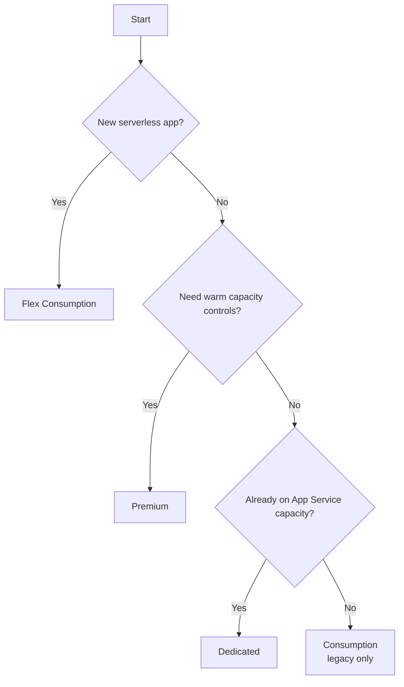

---
content_sources:
  - type: mslearn-adapted
    url: https://learn.microsoft.com/azure/azure-functions/functions-scale
  - type: mslearn-adapted
    url: https://learn.microsoft.com/azure/azure-functions/consumption-plan
  - type: mslearn-adapted
    url: https://learn.microsoft.com/azure/azure-functions/flex-consumption-plan
  - type: mslearn-adapted
    url: https://learn.microsoft.com/azure/azure-functions/functions-premium-plan
  - type: mslearn-adapted
    url: https://learn.microsoft.com/azure/azure-functions/dedicated-plan
---

# Hosting Options

Choosing the right hosting plan is the highest-impact early decision for an Azure Functions workload.

This page compares the four plans covered in this guide: **Consumption (Y1)**, **Flex Consumption (FC1)**, **Premium (EP)**, and **Dedicated (App Service Plan)**.

All comparisons are based on Microsoft Learn documentation.

<!-- diagram-id: hosting-options -->


## Quick guidance

- Start with **Flex Consumption** for most new serverless apps.
- Use **Premium** when you need stronger cold-start control and advanced enterprise patterns.
- Use **Dedicated** when you already operate App Service capacity or need fixed, predictable capacity behavior.
- Use **Consumption (Y1)** only when legacy constraints require it (especially Windows-only dependencies).

Reference:

- [Azure Functions scale and hosting options](https://learn.microsoft.com/azure/azure-functions/functions-scale)

## Decision matrix

| Dimension | Consumption (Y1) | Flex Consumption (FC1) | Premium (EP) | Dedicated (App Service Plan) |
|---|---|---|---|---|
| Positioning | Legacy serverless plan | Recommended serverless plan for new apps | Elastic premium serverless | Fixed-capacity App Service hosting |
| Scaling model | Event-driven scale | Fast event-driven scale with per-function scaling behavior | Event-driven elastic scale with warm capacity controls | Manual or autoscale via App Service autoscale |
| Cold-start profile | Can scale to zero; startup latency possible | Improved cold-start behavior; optional always-ready instances | Always-ready + prewarmed instance options for minimal cold-start impact | Host can run continuously; cold start less relevant with Always On |
| VNet integration | Not supported in the same way as FC1/EP for serverless patterns | Supported | Supported | Supported |
| Pricing model | Execution-based billing | Execution-based + memory + optional always-ready baseline billing | Core and memory allocation billing with minimum active capacity | App Service plan billing regardless of function executions |
| Timeout defaults and limits | Default 5 minutes, max 10 minutes | Default 30 minutes, max unbounded (with platform caveats) | Default 30 minutes, max unbounded (with platform caveats) | Default 30 minutes, max unbounded when Always On is configured |
| Deployment model highlights | Standard Functions deployment flows | Package-based deployment flow; no traditional Kudu/SCM path | Standard App Service/Functions deployment ecosystem | Full App Service deployment ecosystem |
| Key features | Pay-per-execution simplicity, Windows support | Serverless + VNet + per-function scaling + memory size choice | Warm instances, long-running workloads, VNet, higher control | Consolidate with existing App Service apps and capacity |
| Notable constraints | Legacy status; Linux retirement milestones published | Linux-only, one app per FC1 plan, no deployment slots | Minimum billed warm capacity | Requires capacity planning and Always On considerations |

## Detailed plan notes

### Consumption (Y1)

Use when you have a legacy dependency that still requires this plan, especially Windows-specific scenarios.

Important Microsoft Learn notes:

- Classified as a legacy hosting option
- New serverless apps should generally use Flex Consumption
- Linux Consumption has retirement milestones and reduced future language/version evolution

Reference:

- [Consumption plan (legacy)](https://learn.microsoft.com/azure/azure-functions/consumption-plan)

### Flex Consumption (FC1)

Use for most new serverless workloads.

Strengths:

- Event-driven serverless economics
- VNet integration support
- Configurable instance memory sizes
- Per-function scaling behavior and concurrency tuning
- Optional always-ready instances for lower startup latency

Reference:

- [Flex Consumption plan](https://learn.microsoft.com/azure/azure-functions/flex-consumption-plan)

### Premium (EP)

Use when you need serverless elasticity with stronger warm-capacity control and broader enterprise knobs.

Strengths:

- Always-ready and prewarmed instances
- VNet integration
- Longer execution support with unbounded timeout configuration path
- Multiple apps per plan and richer App Service integration model

Reference:

- [Premium plan](https://learn.microsoft.com/azure/azure-functions/functions-premium-plan)

### Dedicated (App Service Plan)

Use when you already run App Service capacity and want to colocate functions with predictable resource allocation.

Strengths:

- Fixed capacity model with standard App Service economics
- Works well for always-on style workloads
- Useful when consolidation with existing web apps is intentional

Reference:

- [Dedicated plan](https://learn.microsoft.com/azure/azure-functions/dedicated-plan)

## Decision flow

Use this sequence to pick a plan with minimal rework:

1. **Need new serverless app?** Start with FC1.
2. **Need strict warm capacity behavior or multi-app premium hosting?** Evaluate EP.
3. **Already paying for underutilized App Service capacity?** Evaluate Dedicated.
4. **Blocked by legacy Windows-only requirements?** Use Y1 with migration plan toward FC1 where feasible.

## Operational implications to confirm early

Before finalizing a plan, confirm:

- Expected idle/burst traffic pattern
- Required private networking model
- HTTP latency expectations during scale events
- Long-running execution requirements and timeout policy
- Deployment strategy (including rollback behavior)

!!! tip "Platform Guide"
    For architecture rationale behind plan behavior, see [Hosting Plans](../platform/hosting.md) and [Scaling](../platform/scaling.md).

!!! tip "Operations Guide"
    For deployment and monitoring runbooks after plan selection, see [Deployment](../operations/deployment.md) and [Monitoring](../operations/monitoring.md).

## CLI examples (long flags only)

Use these examples as pattern references only. Validate exact command combinations with current Microsoft Learn CLI pages before production use.

```bash
az functionapp create \
    --resource-group "$RG" \
    --name "$APP_NAME" \
    --storage-account "$STORAGE_NAME" \
    --consumption-plan-location "$LOCATION" \
    --runtime python \
    --functions-version 4
```

```bash
az functionapp plan create \
    --resource-group "$RG" \
    --name "$PLAN_NAME" \
    --location "$LOCATION" \
    --sku EP1 \
    --is-linux
```

If sharing output snippets in runbooks, mask identifiers:

```json
{
    "id": "/subscriptions/<subscription-id>/resourceGroups/rg-example/providers/Microsoft.Web/sites/func-example",
    "principalId": "xxxxxxxx-xxxx-xxxx-xxxx-xxxxxxxxxxxx",
    "tenantId": "<tenant-id>"
}
```

## Cost guidance

Do not hardcode plan pricing into internal docs because regional and meter-specific pricing changes.

Use official pricing tools:

- [Azure Functions pricing](https://azure.microsoft.com/pricing/details/functions/)
- [Azure pricing calculator](https://azure.microsoft.com/pricing/calculator/)

## See Also

- [Overview](overview.md)
- [Learning Paths](learning-paths.md)
- [Repository Map](repository-map.md)
- [Platform Hosting](../platform/hosting.md)
- [Deployment Scenarios](../platform/deployment-scenarios.md) — Cross-plan comparison of VNet, PE, identity, and deployment patterns

## Sources

- [Azure Functions scale and hosting options](https://learn.microsoft.com/azure/azure-functions/functions-scale)
- [Consumption plan (legacy)](https://learn.microsoft.com/azure/azure-functions/consumption-plan)
- [Flex Consumption plan](https://learn.microsoft.com/azure/azure-functions/flex-consumption-plan)
- [Premium plan](https://learn.microsoft.com/azure/azure-functions/functions-premium-plan)
- [Dedicated plan](https://learn.microsoft.com/azure/azure-functions/dedicated-plan)
