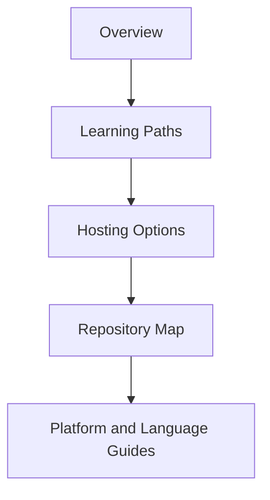

---
content_sources:

- type: mslearn-adapted
  url: https://learn.microsoft.com/en-us/azure/azure-functions/functions-overview
- type: mslearn-adapted
  url: https://learn.microsoft.com/en-us/azure/azure-functions/functions-scale
content_validation:
  status: verified
  last_reviewed: '2026-05-23'
  reviewer: agent
  core_claims:
  - claim: This page uses Microsoft Learn as the primary source basis for its Azure-specific
      guidance.
    source: https://learn.microsoft.com/en-us/azure/azure-functions/functions-overview
    verified: true
---
# Start Here

Start Here is the fastest path to understand Azure Functions fundamentals and navigate this guide with purpose.

Use this section to answer three questions quickly:

1. What Azure Functions is and when to use it
2. Which hosting plan fits your workload
3. Which learning path matches your current role and timeline

<!-- diagram-id: start-here -->

## Pages in this section

- [Overview](overview.md) — serverless model, event-driven execution, triggers and bindings, and compute comparisons
- [Learning Paths](learning-paths.md) — guided tracks from 30-minute quick start to production readiness
- [Hosting Options](hosting-options.md) — decision matrix for Consumption, Flex Consumption, Premium, and Dedicated
- [Repository Map](repository-map.md) — complete guide navigation plus DX toolkit links

!!! tip "Recommended sequence"
    Read [Overview](overview.md) first, then pick a track from [Learning Paths](learning-paths.md), and finally confirm your hosting choice in [Hosting Options](hosting-options.md).

## Who this is for

- Engineers onboarding to Azure Functions
- Architects choosing a hosting strategy
- Operators preparing monitoring and incident workflows
- Teams migrating from legacy Consumption to Flex Consumption

## Continue to deeper sections

!!! tip "Platform Guide"
    For architecture and internals, see [Platform](../platform/index.md).

!!! tip "Language Guide"
    For implementation details, see [Language Guides](../language-guides/index.md).

!!! tip "Operations Guide"
    For deployment and day-2 operations, see [Operations](../operations/index.md).

## Review Matrix

| Review area | Page-specific check |
|---|---|
| Scope | Confirm the guidance applies to Start Here. |
| Source basis | Validate the recommendation against the Microsoft Learn sources in this page. |
| Evidence | Capture command output, portal state, metrics, logs, or screenshots before treating the result as proven. |

## See Also

- [Home](../index.md)
- [Platform](../platform/index.md)
- [Language Guides](../language-guides/index.md)
- [Operations](../operations/index.md)

## Sources

- [Microsoft Learn source 1](https://learn.microsoft.com/en-us/azure/azure-functions/functions-overview)
- [Microsoft Learn source 2](https://learn.microsoft.com/en-us/azure/azure-functions/functions-scale)
