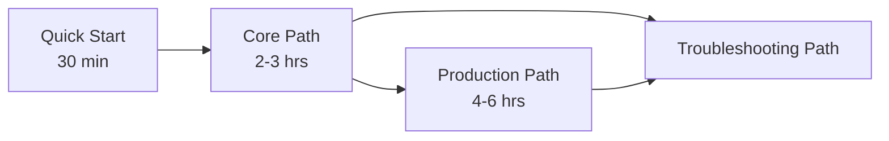

# Learning Paths

This page provides guided learning tracks for Azure Functions Practical Guide users.

Each track is built around Microsoft Learn concepts and organized for different time budgets and responsibilities.

## How to use this page

Choose the track that matches your immediate goal:

- **Quick Start (30 min)** for first contact
- **Core Path (2-3 hrs)** for implementation fundamentals
- **Production Path (4-6 hrs)** for architecture and operations readiness
- **Troubleshooting Path** for incident responders and on-call teams

!!! tip "If you are unsure"
    Start with Quick Start, then continue directly into the Core Path.

## Track 1: Quick Start (30 min)

**Goal:** understand what Functions is, how it runs, and where to go next.

### Sequence

1. [Overview](overview.md) (10 min)
2. [Hosting Options](hosting-options.md) skim (10 min)
3. [Repository Map](repository-map.md) (10 min)

### Outcomes

- You can explain triggers and bindings at a high level.
- You understand the four hosting plans used in this guide.
- You know where platform, language, and operations content lives.

### Microsoft Learn references

- [Azure Functions overview](https://learn.microsoft.com/azure/azure-functions/functions-overview)
- [Triggers and bindings](https://learn.microsoft.com/azure/azure-functions/functions-triggers-bindings)
- [Functions scale and hosting](https://learn.microsoft.com/azure/azure-functions/functions-scale)

## Track 2: Core Path (2-3 hrs)

**Goal:** build a correct mental model and complete your first end-to-end implementation path.

### Sequence

1. [Overview](overview.md)
2. [Hosting Options](hosting-options.md)
3. [Platform: Architecture](../platform/architecture.md)
4. [Platform: Triggers and Bindings](../platform/triggers-and-bindings.md)
5. [Language Guides](../language-guides/index.md) and your target language index

### Recommended checkpoints

- Confirm your plan choice with concrete workload criteria.
- Identify your primary triggers and any output bindings.
- Confirm language runtime and programming model.

### Outcomes

- You can choose an initial hosting plan with clear trade-offs.
- You can map a business event flow to triggers, functions, and outputs.
- You can start implementation in Python, Node.js, .NET, or Java docs.

### Microsoft Learn references

- [Azure Functions developer guides](https://learn.microsoft.com/azure/azure-functions/)
- [Supported languages](https://learn.microsoft.com/azure/azure-functions/supported-languages)
- [Performance and reliability guidance](https://learn.microsoft.com/azure/azure-functions/performance-reliability)

## Track 3: Production Path (4-6 hrs)

**Goal:** move from prototype assumptions to production-ready architecture and runbook posture.

### Sequence

1. Complete the Core Path
2. Platform deep dives:
    - [Hosting](../platform/hosting.md)
    - [Scaling](../platform/scaling.md)
    - Networking guidance in [Platform Index](../platform/index.md)
    - Reliability guidance in [Platform Index](../platform/index.md)
    - Security guidance in [Platform Index](../platform/index.md)
3. Operations runbook prep:
    - [Deployment](../operations/deployment.md)
    - [Configuration](../operations/configuration.md)
    - [Monitoring](../operations/monitoring.md)
    - [Alerts](../operations/alerts.md)
    - Recovery planning in [Operations Index](../operations/index.md)

### Production checkpoints

- Cold-start and latency strategy documented
- Timeout and retry behavior validated
- Monitoring baseline and alert thresholds defined
- Deployment and rollback approach selected
- Incident escalation path documented

### Outcomes

- Your team has explicit architecture decisions and operational guardrails.
- Your app has basic observability and incident response readiness.
- You can explain plan-specific scale and networking behaviors.

!!! tip "Troubleshooting tie-in"
    Pair this track with [Troubleshooting Methodology](../troubleshooting/methodology.md) for pre-incident rehearsal.

## Track 4: Troubleshooting Path

**Goal:** diagnose and mitigate incidents quickly using a repeatable process.

### Sequence

1. [First 10 Minutes](../troubleshooting/first-10-minutes.md)
2. [Troubleshooting Methodology](../troubleshooting/methodology.md)
3. [Playbooks](../troubleshooting/playbooks.md)
4. KQL workflow guidance in [Troubleshooting Index](../troubleshooting/index.md)
5. Lab workflow guidance in [Troubleshooting Index](../troubleshooting/index.md)

### Incident checkpoints

- Classify issue type (trigger ingestion, host health, dependency, deployment)
- Confirm blast radius and time window
- Correlate platform metrics with application telemetry
- Apply plan-specific mitigation and rollback options

### Outcomes

- Faster triage with less guesswork
- Reusable playbooks for common failure patterns
- Better post-incident evidence and follow-up actions

## Track selection matrix

| Situation | Start with | Then continue to |
|---|---|---|
| New engineer onboarding | Quick Start | Core Path |
| Designing a new app | Core Path | Production Path |
| Preparing for launch | Production Path | Troubleshooting Path |
| Active incidents | Troubleshooting Path | Production Path hardening |

## See Also

- [Start Here Index](index.md)
- [Overview](overview.md)
- [Hosting Options](hosting-options.md)
- [Repository Map](repository-map.md)

## Sources

- [Azure Functions overview](https://learn.microsoft.com/azure/azure-functions/functions-overview)
- [Triggers and bindings](https://learn.microsoft.com/azure/azure-functions/functions-triggers-bindings)
- [Functions scale and hosting](https://learn.microsoft.com/azure/azure-functions/functions-scale)
- [Azure Functions developer guides](https://learn.microsoft.com/azure/azure-functions/)
- [Supported languages](https://learn.microsoft.com/azure/azure-functions/supported-languages)
- [Performance and reliability guidance](https://learn.microsoft.com/azure/azure-functions/performance-reliability)
