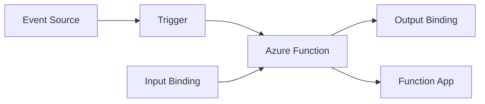

# Overview: What is Azure Functions

Azure Functions is a serverless compute service for running event-driven code in Azure.

Instead of managing servers, you define functions that are executed by triggers (such as HTTP requests, queue messages, timers, or events), and Azure manages runtime hosting and scale behavior.

This page summarizes the fundamentals from Microsoft Learn and maps them to decisions you will make in this guide.

## Core model: serverless + event-driven

Azure Functions is designed for workloads where execution is initiated by events.

At a high level:

- A **trigger** starts a function execution.
- **Input bindings** provide data to your function.
- **Output bindings** send data to target services.
- A **function app** is the deployment and management unit.

Microsoft Learn references:

- [Azure Functions overview](https://learn.microsoft.com/azure/azure-functions/functions-overview)
- [Triggers and bindings](https://learn.microsoft.com/azure/azure-functions/functions-triggers-bindings)

## Triggers and bindings in practice

Functions requires exactly one trigger per function. Bindings are optional and reduce glue code for common integrations.

Common trigger categories include:

- HTTP and webhooks
- Timer schedules
- Storage (queue/blob)
- Event stream services (Event Hubs, Service Bus, Event Grid)
- Data change triggers (for supported services)

Bindings are declarative integration points for reading/writing data with less plumbing code.

!!! tip "Platform Guide"
    For trigger architecture and deeper design constraints, see [Triggers and Bindings](../platform/triggers-and-bindings.md).

## Hosting options (what exists)

Azure Functions supports multiple hosting options. In this guide, the core plans are:

1. **Consumption (Y1)** — legacy serverless plan
2. **Flex Consumption (FC1)** — recommended serverless plan for new apps
3. **Premium (EP)** — event-driven scale with always-warm options
4. **Dedicated (App Service Plan)** — fixed-capacity model with manual/autoscale patterns

Microsoft Learn also documents **Container Apps** hosting for containerized function apps.

Primary comparison:

- [Azure Functions scale and hosting options](https://learn.microsoft.com/azure/azure-functions/functions-scale)

Important lifecycle note from Learn:

- Consumption is a legacy plan.
- Linux Consumption has retirement milestones.
- New serverless workloads should typically start with Flex Consumption.

Reference:

- [Consumption plan (legacy)](https://learn.microsoft.com/azure/azure-functions/consumption-plan)

## What Azure Functions is best at

From Microsoft Learn scenarios, Functions is a strong fit for:

- Event ingestion and transformation
- HTTP APIs with bursty traffic
- Queue/event-driven integration pipelines
- Scheduled automation jobs
- Durable orchestrations and long-running workflows (with Durable Functions)

Scenario reference:

- [Azure Functions scenarios](https://learn.microsoft.com/azure/azure-functions/functions-scenarios)

## When to choose Functions vs other Azure options

Use Azure Functions when:

- You want a code-first, event-driven execution model.
- You want serverless scale behavior or elastic scaling.
- Your workload is composed of discrete handlers rather than a single always-on monolith.

Consider **Azure Logic Apps** when:

- You need designer-first, connector-heavy workflow orchestration.
- You want low-code process automation with many SaaS connectors.

Consider **App Service WebJobs** only in narrower cases where existing App Service/WebJobs constraints already fit and you need that control surface.

Comparison reference:

- [Integration and automation platform options](https://learn.microsoft.com/azure/azure-functions/functions-compare-logic-apps-ms-flow-webjobs)

For broader compute trade-offs:

- [Choose an Azure compute service](https://learn.microsoft.com/azure/architecture/guide/technology-choices/compute-comparison)

## Language and development model

The guide supports these primary languages:

- Python
- Node.js
- .NET
- Java

Each language has a programming model and runtime-specific guidance on Microsoft Learn.

Start here:

- [Python developer guide](https://learn.microsoft.com/azure/azure-functions/functions-reference-python)
- [Node.js developer guide](https://learn.microsoft.com/azure/azure-functions/functions-reference-node)
- [.NET developer guide](https://learn.microsoft.com/azure/azure-functions/functions-dotnet-class-library)
- [Java developer guide](https://learn.microsoft.com/azure/azure-functions/functions-reference-java)

!!! tip "Language Guide"
    For guide-specific implementation flow, see [Language Guides](../language-guides/index.md).

## First decisions to make

Before writing production code, decide:

1. Hosting plan (Y1, FC1, EP, Dedicated)
2. Trigger model and throughput expectations
3. Networking requirements (public only, VNet integration, private access)
4. Timeout and execution characteristics
5. Deployment path and rollback strategy

Those decisions influence architecture, cost profile, cold-start behavior, and operations complexity.

## Recommended next steps

1. Choose a guided track in [Learning Paths](learning-paths.md)
2. Compare plans in [Hosting Options](hosting-options.md)
3. Use [Repository Map](repository-map.md) to navigate platform, language, operations, and troubleshooting docs

## See Also

- [Start Here Index](index.md)
- [Learning Paths](learning-paths.md)
- [Hosting Options](hosting-options.md)
- [Repository Map](repository-map.md)
- [Platform Overview](../platform/index.md)

## Sources

- [Azure Functions overview](https://learn.microsoft.com/azure/azure-functions/functions-overview)
- [Triggers and bindings](https://learn.microsoft.com/azure/azure-functions/functions-triggers-bindings)
- [Azure Functions scale and hosting options](https://learn.microsoft.com/azure/azure-functions/functions-scale)
- [Consumption plan (legacy)](https://learn.microsoft.com/azure/azure-functions/consumption-plan)
- [Azure Functions scenarios](https://learn.microsoft.com/azure/azure-functions/functions-scenarios)
- [Integration and automation platform options](https://learn.microsoft.com/azure/azure-functions/functions-compare-logic-apps-ms-flow-webjobs)
- [Choose an Azure compute service](https://learn.microsoft.com/azure/architecture/guide/technology-choices/compute-comparison)
- [Python developer guide](https://learn.microsoft.com/azure/azure-functions/functions-reference-python)
- [Node.js developer guide](https://learn.microsoft.com/azure/azure-functions/functions-reference-node)
- [.NET developer guide](https://learn.microsoft.com/azure/azure-functions/functions-dotnet-class-library)
- [Java developer guide](https://learn.microsoft.com/azure/azure-functions/functions-reference-java)
