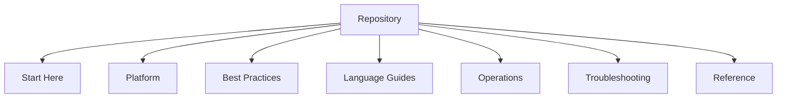

---
content_sources:
  - type: mslearn-adapted
    url: https://learn.microsoft.com/azure/azure-functions/
---

# Repository Map

This page maps the Azure Functions Practical Guide structure so you can navigate quickly from onboarding to production operations.

It also links the external DX toolkit repositories used with this guide.

## Top-level navigation model

The documentation follows seven intent-based areas:

1. **Start Here** — onboarding and plan selection
2. **Platform** — architecture and hosting decisions
3. **Best Practices** — production patterns and anti-patterns
4. **Language Guides** — implementation details by language
5. **Operations** — day-2 operational runbooks
6. **Troubleshooting** — incident response and diagnostics
7. **Reference** — quick lookup for commands, limits, and configuration

This structure aligns with the top-level sections in `mkdocs.yml`; some topics (such as networking, reliability, and security) are grouped under section index pages instead of appearing as separate top-level tabs.

<!-- diagram-id: top-level-navigation-model -->

## Section map

| Area | What you do there | Primary entry |
|---|---|---|
| Start Here | Learn fundamentals, choose track, choose plan | [Start Here](index.md) |
| Platform | Understand host/worker model, scaling, networking, reliability, security | [Platform Index](../platform/index.md) |
| Best Practices | Apply production-ready patterns and avoid anti-patterns | [Best Practices Index](../best-practices/index.md) |
| Language Guides | Build function apps using language-specific programming models | [Language Guides Index](../language-guides/index.md) |
| Operations | Deploy safely, configure correctly, monitor, alert, recover | [Operations Index](../operations/index.md) |
| Troubleshooting | Triage and resolve incidents with repeatable methodology | [Troubleshooting Index](../troubleshooting/index.md) |
| Reference | Quickly look up CLI commands, limits, and host/runtime settings | [Reference Index](../reference/index.md) |

## Start Here pages

- [Overview](overview.md)
- [Learning Paths](learning-paths.md)
- [Hosting Options](hosting-options.md)
- [Repository Map](repository-map.md)

## Platform pages (design decisions)

- [Architecture](../platform/architecture.md)
- [Hosting Plans](../platform/hosting.md)
- [Triggers and Bindings](../platform/triggers-and-bindings.md)
- [Scaling](../platform/scaling.md)
- Networking (see [Platform Index](../platform/index.md))
- Reliability (see [Platform Index](../platform/index.md))
- Security (see [Platform Index](../platform/index.md))

!!! tip "Read order for architects"
    Start with Architecture, then Hosting, Scaling, and Networking before implementation kickoff.

## Language guides

Current primary language scope:

- Python
- Node.js
- .NET
- Java

Python currently contains the most complete tutorial and recipe depth in this guide.

Entry points:

- [Language Guides Index](../language-guides/index.md)
- [Python Index](../language-guides/python/index.md)

## Operations and troubleshooting

Operations content covers deployment through recovery. Troubleshooting content is optimized for incident timelines.

Start with:

- [Deployment](../operations/deployment.md)
- [Monitoring](../operations/monitoring.md)
- [First 10 Minutes](../troubleshooting/first-10-minutes.md)
- [Playbooks](../troubleshooting/playbooks.md)

!!! tip "Incident response"
    Pair [Monitoring](../operations/monitoring.md) with the query workflow in [Troubleshooting Index](../troubleshooting/index.md) to reduce mean time to diagnosis.

## DX toolkit repositories

These repositories are linked resources, not vendored into this guide.

| Repository | Purpose |
|---|---|
| [azure-functions-openapi](https://github.com/yeongseon/azure-functions-openapi) | OpenAPI integration patterns |
| [azure-functions-validation](https://github.com/yeongseon/azure-functions-validation) | Input and contract validation utilities |
| [azure-functions-doctor](https://github.com/yeongseon/azure-functions-doctor) | Diagnostics and health-check tooling |
| [azure-functions-scaffold](https://github.com/yeongseon/azure-functions-scaffold) | Project bootstrap and scaffolding |
| [azure-functions-logging](https://github.com/yeongseon/azure-functions-logging) | Structured logging conventions |
| [azure-functions-python-cookbook](https://github.com/yeongseon/azure-functions-python-cookbook) | Python recipes and practical patterns |

## Suggested navigation patterns

### New team onboarding

1. [Overview](overview.md)
2. [Learning Paths](learning-paths.md)
3. [Hosting Options](hosting-options.md)
4. [Language Guides](../language-guides/index.md)

### Architecture first

1. [Platform Index](../platform/index.md)
2. [Hosting Plans](../platform/hosting.md)
3. [Scaling](../platform/scaling.md)
4. Networking guidance in [Platform Index](../platform/index.md)

### Operations first

1. [Operations Index](../operations/index.md)
2. [Monitoring](../operations/monitoring.md)
3. [Alerts](../operations/alerts.md)
4. Recovery guidance in [Operations Index](../operations/index.md)

## See Also

- [Start Here Index](index.md)
- [Overview](overview.md)
- [Learning Paths](learning-paths.md)
- [Hosting Options](hosting-options.md)

## Sources

- [Microsoft Learn: Azure Functions documentation](https://learn.microsoft.com/azure/azure-functions/)
