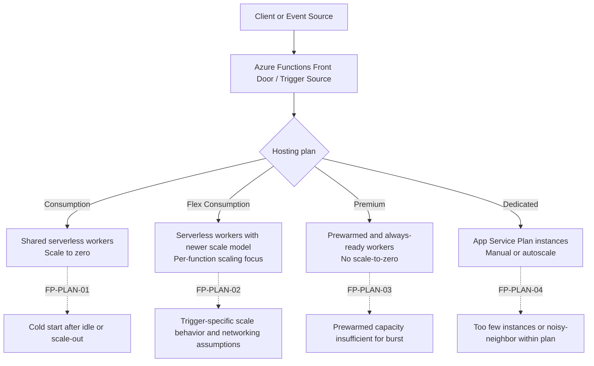
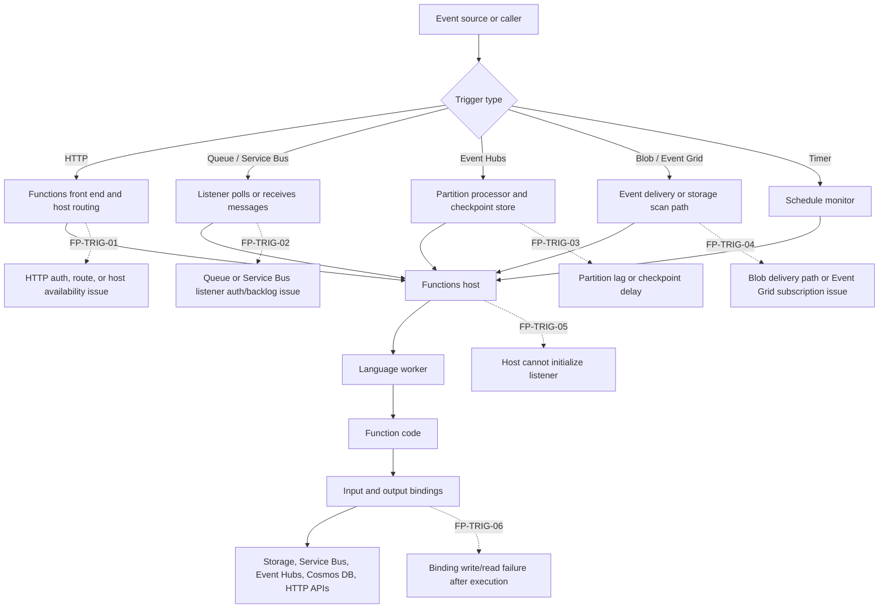
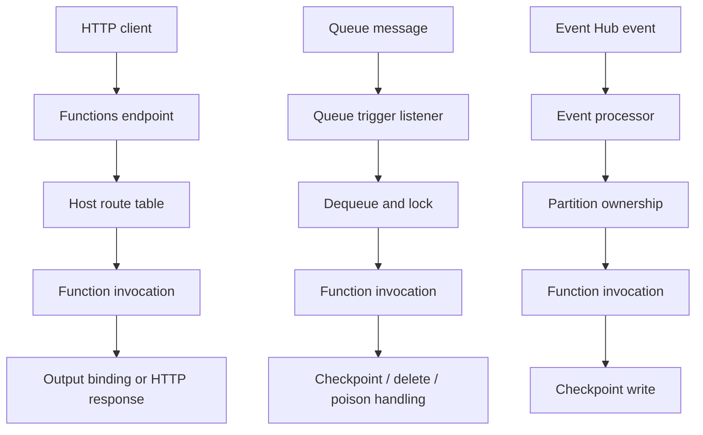
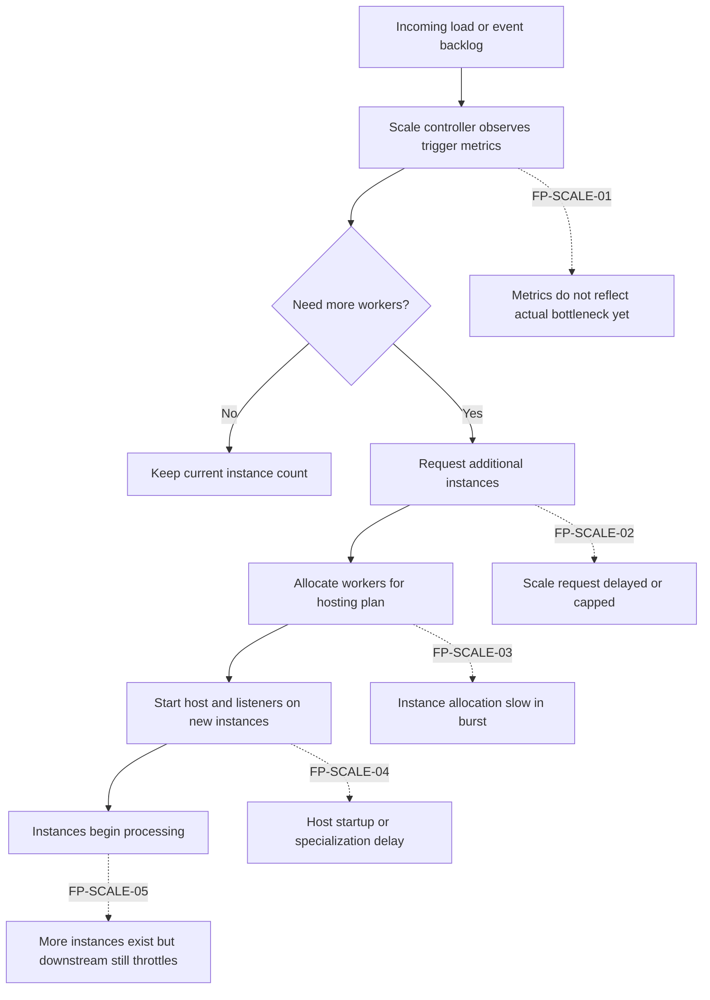
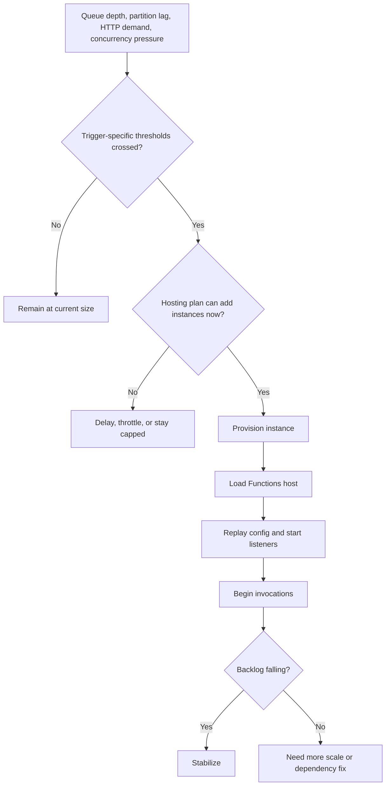
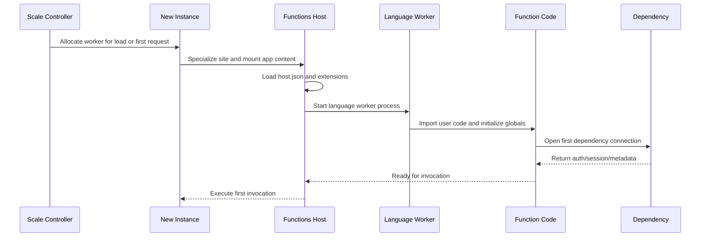
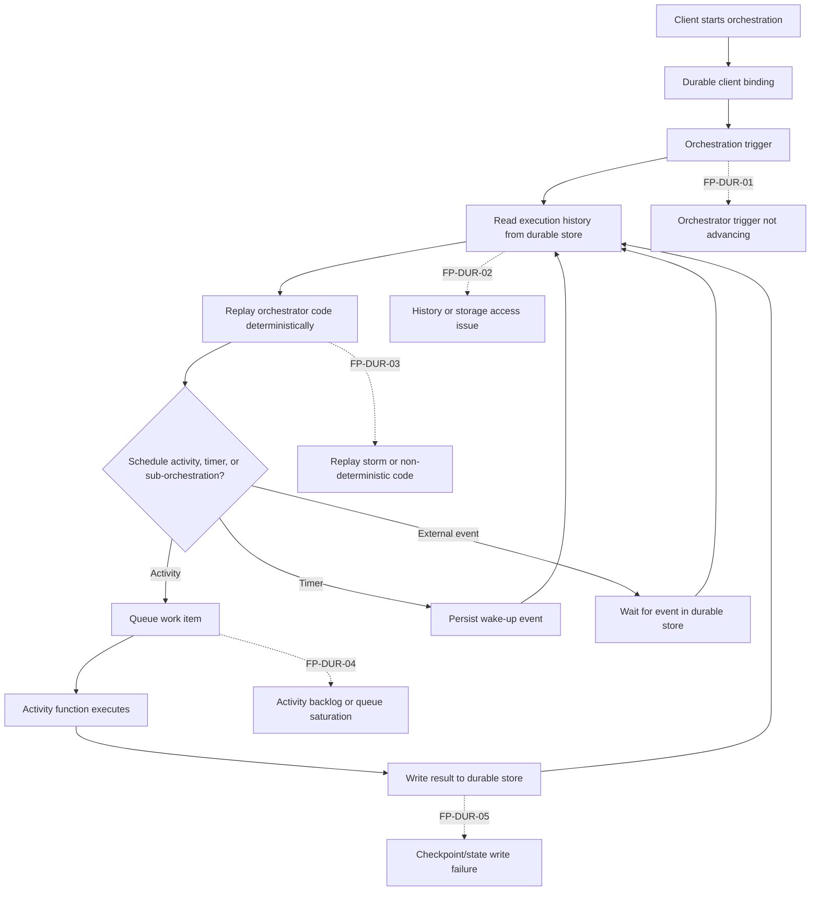
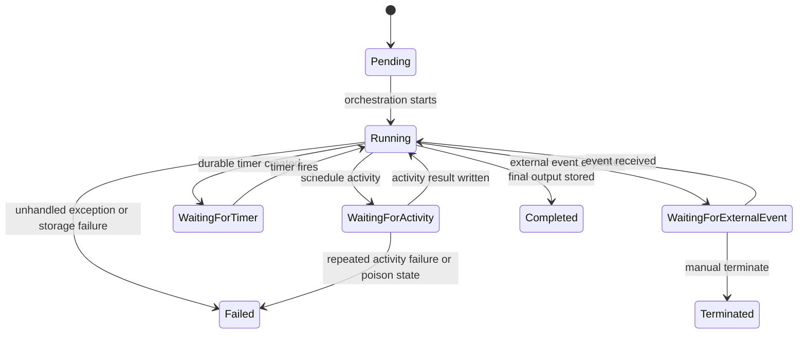
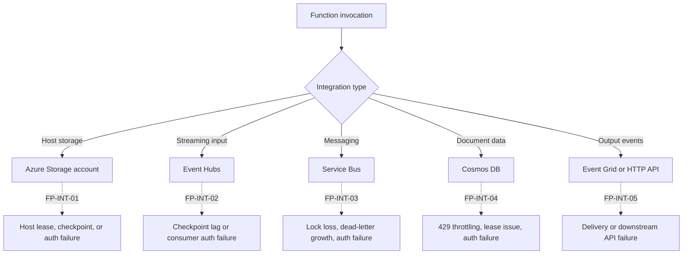
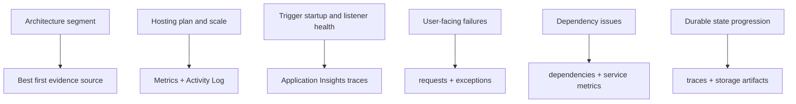

---
content_sources:
  - type: mslearn-adapted
    url: https://learn.microsoft.com/en-us/azure/azure-functions/functions-scale
  - type: mslearn-adapted
    url: https://learn.microsoft.com/en-us/azure/azure-functions/event-driven-scaling
  - type: mslearn-adapted
    url: https://learn.microsoft.com/en-us/azure/azure-functions/functions-triggers-bindings
  - type: mslearn-adapted
    url: https://learn.microsoft.com/en-us/azure/azure-functions/functions-best-practices
  - type: mslearn-adapted
    url: https://learn.microsoft.com/en-us/azure/azure-functions/functions-monitoring
  - type: mslearn-adapted
    url: https://learn.microsoft.com/en-us/azure/azure-functions/functions-networking-options
  - type: mslearn-adapted
    url: https://learn.microsoft.com/en-us/azure/azure-functions/durable/durable-functions-overview
  - type: mslearn-adapted
    url: https://learn.microsoft.com/en-us/azure/azure-functions/durable/durable-functions-diagnostics
  - type: mslearn-adapted
    url: https://learn.microsoft.com/en-us/azure/azure-functions/functions-bindings-storage-blob-trigger
  - type: mslearn-adapted
    url: https://learn.microsoft.com/en-us/azure/azure-functions/functions-bindings-cosmosdb-v2-trigger
  - type: mslearn-adapted
    url: https://learn.microsoft.com/en-us/azure/azure-functions/functions-bindings-event-hubs-trigger
  - type: mslearn-adapted
    url: https://learn.microsoft.com/en-us/azure/azure-functions/functions-bindings-service-bus
content_validation:
  status: verified
  last_reviewed: 2026-04-12
  reviewer: agent
  core_claims:
    - claim: "진단 방법론 기반 접근"
      source: self-generated
      verified: true
---

# Troubleshooting Architecture Overview

This page answers the first practical question during an Azure Functions incident: **which platform segment is failing?**

Before opening a deep playbook, map the symptom to the correct layer: hosting plan behavior, trigger delivery, scale controller decisions, worker startup, Durable Functions state coordination, or downstream service integration. That classification tells you which telemetry to query first and which mitigation is realistic.

## Why this page exists

Playbooks explain specific scenarios. During active incidents, engineers usually need one faster artifact:

1. A hosting and execution map that explains where invocations actually run
2. A trigger and binding flow that shows where events can be delayed, dropped, or rejected
3. A scale model that explains backlog growth, burst behavior, and instance creation timing
4. A cold start path that explains why the first execution is slow even when application code is healthy
5. A Durable Functions model that explains why orchestrations can appear stuck while storage state is still changing

Use this page to route quickly to the right evidence and the right troubleshooting document.

## 1) Hosting Plan Architecture (where startup and scale behavior change)

Azure Functions does not have one runtime shape. The failure domain changes materially by hosting plan.

<!-- diagram-id: 1-hosting-plan-architecture-where-startup-and-scale-behavior-change -->


### Hosting plan troubleshooting differences

| Plan | Core behavior | Common incident pattern | First evidence to check | Diagnostic implication |
|---|---|---|---|---|
| Consumption | Event-driven instances, can scale to zero | Slow first execution, backlog during burst, timeout near cold scale-out | `traces`, `requests`, execution count metrics | Always consider cold start and scale latency before blaming app code |
| Flex Consumption | Newer serverless model with better networking and scaling controls | Trigger-specific delivery confusion, cold start reduced but still possible, storage or Event Grid assumptions for some triggers | `traces`, trigger configuration, platform settings | Check trigger transport design, deployment region, and plan-specific trigger support |
| Premium | Prewarmed/always-ready instances, VNet support, no scale-to-zero | Burst exceeds ready capacity, worker recycle, long-running workloads under pressure | instance count metrics, `requests`, `dependencies` | Cold start is less dominant; concurrency and downstream bottlenecks rise in priority |
| Dedicated | Runs on App Service Plan instances | App appears stable but under-provisioned, restarts due to shared plan pressure, scaling requires explicit plan action | App Service metrics, Activity Log, instance health | Treat as fixed-capacity web workload first, serverless elasticity second |

### Failure points and playbooks

| Failure Point | Symptom | First evidence | Playbook |
|---|---|---|---|
| FP-PLAN-01 Consumption cold scale | first request after idle is slow, queue trigger starts late | host startup traces, request duration percentiles | [High Latency](playbooks/high-latency.md) |
| FP-PLAN-02 Flex trigger mismatch | blob or event-driven execution pattern differs from assumption | listener traces, trigger source configuration | [Functions Not Executing](playbooks/functions-not-executing.md) |
| FP-PLAN-03 Premium ready-capacity gap | p95 worsens during bursts even without scale-to-zero | instance count, request volume, dependency latency | [High Latency](playbooks/high-latency.md) |
| FP-PLAN-04 Dedicated capacity ceiling | throughput flattens, queue backlog grows, CPU or memory pressure rises | plan metrics, worker restart correlation | [Queue Piling Up](playbooks/queue-piling-up.md) and [Out of Memory / Worker Crash](playbooks/scaling/out-of-memory-worker-crash.md) |

## 2) Trigger and Binding Architecture (where invocations begin or stall)

Most Azure Functions incidents begin before user code runs. The event must first reach the trigger listener, be accepted by the host, and then complete any binding reads and writes.

<!-- diagram-id: 2-trigger-and-binding-architecture-where-invocations-begin-or-stall -->


### Request flow examples by trigger type

<!-- diagram-id: request-flow-examples-by-trigger-type -->


### Trigger and binding diagnostic routing

| Failure Point | Typical symptom | Why it fails | First evidence | Primary next step |
|---|---|---|---|---|
| FP-TRIG-01 HTTP path | `404`, `401`, `403`, or `5xx` before expected handler path | route mismatch, auth policy, host unavailable | `requests` + `traces` | verify route config, auth settings, and host startup |
| FP-TRIG-02 Queue / Service Bus listener | backlog rises while executions stay flat | listener start failed, connection broken, RBAC mismatch | `traces`, queue metrics, dead-letter growth | validate connection settings and listener startup |
| FP-TRIG-03 Event Hubs lag | partitions fall behind, checkpoint delay grows | slow handler, checkpoint failure, too few instances | consumer lag metrics, `traces`, dependencies | correlate backlog with execution time and checkpoint success |
| FP-TRIG-04 Blob / Event Grid path | blob created but no invocation | Event Grid subscription missing, storage events delayed, trigger configuration mismatch | Event Grid subscription state, `traces` | validate storage event path and listener configuration |
| FP-TRIG-05 Host listener init | app is running but trigger never becomes active | storage auth, extension init, host startup failure | startup traces and exceptions | open trigger-focused playbook |
| FP-TRIG-06 Binding output | function logs success but downstream artifact missing | output binding auth/config failure, retries exhausted | `dependencies`, traces, target service metrics | validate binding identity and downstream permissions |

### Integration map for common Azure services

| Service | Typical role in Functions architecture | Common failure mode | First evidence source |
|---|---|---|---|
| Azure Storage | required host storage, queue/blob triggers, Durable state | auth failure, lease/checkpoint problems, trigger silence | `traces`, storage metrics, Activity Log |
| Event Hubs | high-volume event ingestion | checkpoint lag, partition imbalance, consumer auth | Event Hubs metrics, `traces`, dependency errors |
| Service Bus | queue/topic processing and dead-letter patterns | listener auth failure, lock loss, backlog growth | queue depth metrics, `traces`, exceptions |
| Cosmos DB | trigger source, output binding target, app dependency | lease container issues, throttling, auth failure | `dependencies`, traces, Cosmos metrics |
| Event Grid | delivery path for blob and event-based workflows | subscription misconfiguration or delivery failure | Event Grid subscription health, traces |

## 3) Scale Controller and Instance Management (where backlog and burst failures originate)

Azure Functions scaling is a control loop, not instant elasticity. Backlog, target-based heuristics, and instance readiness all matter.

<!-- diagram-id: 3-scale-controller-and-instance-management-where-backlog-and-burst-failures-originate -->


### Scale-out decision flow

<!-- diagram-id: scale-out-decision-flow -->


### Scale troubleshooting matrix

| Failure Point | Symptom pattern | First evidence | Interpretation |
|---|---|---|---|
| FP-SCALE-01 Observation gap | backlog grows before instance count rises | trigger-specific metrics, queue depth, partition lag | scale loop has not reacted yet or trigger metrics are delayed |
| FP-SCALE-02 Scale cap | load rises but instance count plateaus | plan limits, app settings, autoscale config | not all scale problems are runtime bugs |
| FP-SCALE-03 Allocation delay | new instances appear too slowly during spike | platform metrics and burst timeline | provisioning latency can dominate burst recovery |
| FP-SCALE-04 Startup delay on new worker | instance count rises but executions lag | startup traces on new instances | this is scale success followed by cold initialization cost |
| FP-SCALE-05 Downstream bottleneck | more workers increase dependency failures instead of throughput | `dependencies` failure rate, target throttling metrics | scale-out can amplify pressure on Service Bus, Cosmos DB, SQL, or APIs |

### Diagnostic commands for scale and instance state

```bash
az functionapp show --resource-group "<resource-group>" --name "<app-name>" --output json
az functionapp plan show --resource-group "<resource-group>" --name "<plan-name>" --output json
az monitor metrics list --resource "/subscriptions/<subscription-id>/resourceGroups/<resource-group>/providers/Microsoft.Web/sites/<app-name>" --metric "FunctionExecutionCount,FunctionExecutionUnits,Http5xx,Requests" --interval PT1M --aggregation "Total,Average,Maximum" --offset 1h --output table
az monitor metrics list --resource "/subscriptions/<subscription-id>/resourceGroups/<resource-group>/providers/Microsoft.Storage/storageAccounts/<storage-name>" --metric "QueueMessageCount" --interval PT1M --aggregation "Average,Maximum" --offset 1h --output table
az monitor activity-log list --resource-group "<resource-group>" --offset 2h --max-events 100 --output table
```

## 4) Cold Start Flow (where first-execution latency appears)

Cold start is not one step. It is a chain: instance allocation, host specialization, runtime loading, extension startup, application import, and first dependency initialization.

<!-- diagram-id: 4-cold-start-flow-where-first-execution-latency-appears -->


### Cold start interpretation

- Slow first invocation can come from platform work before your handler begins.
- A healthy steady-state p95 does not disprove cold start.
- Cold-start impact is workload-dependent and should be treated as a range (often sub-second to several seconds), not a fixed single value.
- Premium reduces but does not eliminate initialization cost; tune always-ready and prewarmed instance capacity for burst scenarios.
- Queue or Event Hub workloads can show cold-start symptoms as delayed event pickup instead of slow HTTP response.

### Cold-start failure points

| Failure Point | Symptom | What it usually means | First evidence |
|---|---|---|---|
| FP-COLD-01 allocation delay | no worker available immediately | scale-to-zero or burst allocation latency | request timeline, instance count trend |
| FP-COLD-02 specialization delay | app files or site config take time to load | worker still preparing environment | startup traces |
| FP-COLD-03 extension startup | trigger listeners load slowly or fail | binding extension init problem | `traces` around host initialization |
| FP-COLD-04 language worker init | Python/Node/.NET isolated process starts slowly | package size, imports, runtime mismatch | worker startup traces |
| FP-COLD-05 dependency warm-up | first call to Key Vault, Cosmos DB, Storage, SQL is slow | network/auth/token/cache initialization | `dependencies` first-call duration |

### Cold-start diagnostic commands

```bash
az monitor log-analytics query --workspace "$WORKSPACE_ID" --analytics-query "AppTraces | where TimeGenerated > ago(2h) | where Message has_any ('Initializing Host','Host started','Generating 0 job function','Starting JobHost') | project TimeGenerated, AppRoleInstance, Message | order by TimeGenerated desc" --output table
az monitor log-analytics query --workspace "$WORKSPACE_ID" --analytics-query "AppRequests | where TimeGenerated > ago(2h) | summarize p50=percentile(DurationMs,50), p95=percentile(DurationMs,95), maxDuration=max(DurationMs) by bin(TimeGenerated, 5m) | order by TimeGenerated desc" --output table
az functionapp config appsettings list --resource-group "<resource-group>" --name "<app-name>" --output table
```

## 5) Durable Functions Orchestration Architecture (where replay and state coordination confuse diagnosis)

Durable Functions is not a single long-running process. It is a state-driven workflow pattern backed by storage. The orchestrator replays history, the runtime persists checkpoints, and activity functions run as separate executions.

<!-- diagram-id: 5-durable-functions-orchestration-architecture-where-replay-and-state-coordination-confuse-diagnosis -->


### Durable state-machine view

<!-- diagram-id: durable-state-machine-view -->


### Durable troubleshooting matrix

| Failure Point | Typical symptom | First evidence | Why it is misleading |
|---|---|---|---|
| FP-DUR-01 trigger not advancing | orchestration remains `Running` with no visible progress | orchestration status, traces, queue activity | app may be healthy while durable control queue is stuck |
| FP-DUR-02 history/store issue | replay cannot reconstruct state cleanly | storage auth failures, table/queue access traces | looks like code bug but may be storage availability or RBAC |
| FP-DUR-03 replay storm | high CPU/log volume with little forward progress | repeated replay traces, same history events | replays are expected, but excessive replays indicate design or storage pressure |
| FP-DUR-04 activity backlog | orchestration scheduled work but activities lag | queue depth, execution counts, activity failures | orchestrator status alone hides downstream queue saturation |
| FP-DUR-05 state write failure | orchestration appears to retry or stall after activity success | storage exceptions, durable backend errors | activity succeeded but checkpoint did not persist |

### Durable diagnostic commands

```bash
az functionapp function list --resource-group "<resource-group>" --name "<app-name>" --output table
az monitor log-analytics query --workspace "$WORKSPACE_ID" --analytics-query "AppTraces | where TimeGenerated > ago(2h) | where Message has_any ('DurableTask','orchestration','replay','activity') | project TimeGenerated, SeverityLevel, Message | order by TimeGenerated desc" --output table
az storage queue list --account-name "<storage-name>" --auth-mode login --output table
az storage table list --account-name "<storage-name>" --auth-mode login --output table
```

## 6) Azure Service Integration Path (where dependencies amplify failure)

Azure Functions usually sits in the middle of other services rather than at the edge alone. That means incidents often reflect integration failure, not runtime failure.

<!-- diagram-id: 6-azure-service-integration-path-where-dependencies-amplify-failure -->


### Integration failure mapping

| Integration | What breaks first | Fastest evidence | Common misread |
|---|---|---|---|
| Azure Storage | host startup, trigger checkpoints, Durable state | storage auth exceptions, queue/table/blob metrics | assuming storage is just an app dependency rather than a platform dependency |
| Event Hubs | lag and uneven partition progress | consumer group lag, checkpoint traces | blaming Functions scale before checking partition ownership |
| Service Bus | backlog, retries, dead-letter growth | queue depth, lock-lost exceptions, trace warnings | treating poison messages as scaling problem only |
| Cosmos DB | throttling or trigger lease contention | `dependencies`, 429 trend, lease container health | blaming handler latency without checking RU limits |
| Event Grid / APIs | delivery failures after successful execution | dependency failures, delivery metrics | concluding the function failed when only the output path failed |

## 7) Observability Coverage and Fast Evidence Commands

<!-- diagram-id: 7-observability-coverage-and-fast-evidence-commands -->


### Quick evidence commands by component

```bash
az functionapp show --resource-group "<resource-group>" --name "<app-name>" --output json
az functionapp config appsettings list --resource-group "<resource-group>" --name "<app-name>" --output table
az functionapp function list --resource-group "<resource-group>" --name "<app-name>" --output table
az monitor activity-log list --resource-group "<resource-group>" --offset 24h --max-events 100 --output table
az monitor metrics list --resource "/subscriptions/<subscription-id>/resourceGroups/<resource-group>/providers/Microsoft.Web/sites/<app-name>" --metric "Requests,Http5xx,FunctionExecutionCount,FunctionExecutionUnits" --interval PT1M --aggregation "Total,Average,Maximum" --offset 2h --output table
az monitor log-analytics query --workspace "$WORKSPACE_ID" --analytics-query "AppRequests | where TimeGenerated > ago(2h) | summarize total=count(), failed=countif(Success == false), p95=percentile(DurationMs,95) by bin(TimeGenerated, 5m) | order by TimeGenerated asc" --output table
az monitor log-analytics query --workspace "$WORKSPACE_ID" --analytics-query "AppDependencies | where TimeGenerated > ago(2h) | summarize failed=countif(Success == false), p95=percentile(DurationMs,95) by Target | order by failed desc" --output table
```

## 8) Fast routing examples

- **Example A**: HTTP requests fail only after idle periods.
    - Start with hosting plan architecture and cold start flow.
- Open: [High Latency](playbooks/high-latency.md), [Quick Diagnosis Cards](quick-diagnosis-cards.md), and [First 10 Minutes](first-10-minutes/index.md).
- **Example B**: Queue depth rises while the app shows healthy in the portal.
    - Start with trigger and binding architecture, then scale controller behavior.
    - Open: [Functions Not Executing](playbooks/functions-not-executing.md) and [Queue Piling Up](playbooks/queue-piling-up.md).
- **Example C**: Durable orchestration stays `Running` for a long time with repeated logs.
    - Start with Durable Functions orchestration architecture.
    - Open: [Durable Orchestration Stuck](playbooks/scaling/durable-orchestration-stuck.md) and [Methodology](methodology.md).
- **Example D**: More instances appear during load, but errors shift to Service Bus or Cosmos DB.
    - Start with scale controller and integration path.
    - Open: [High Latency](playbooks/high-latency.md) and [Evidence Map](evidence-map.md).

!!! note "How to use this page during incidents"
    Do not treat scale-out, cold start, or replay behavior as proof of root cause by themselves.
    Use this page to identify the most likely failure layer, then confirm with time-correlated telemetry from Application Insights, Activity Log, and the integrated Azure service.

## See Also

- [Troubleshooting](index.md)
- [Troubleshooting Architecture](architecture.md)
- [Evidence Map](evidence-map.md)
- [Decision Tree](decision-tree.md)
- [Troubleshooting Mental Model](mental-model.md)
- [Quick Diagnosis Cards](quick-diagnosis-cards.md)
- [First 10 Minutes](first-10-minutes/index.md)
- [Troubleshooting Method](methodology/troubleshooting-method.md)
- [Detector Map](methodology/detector-map.md)
- [Playbooks Index](playbooks/index.md)
- [KQL Query Library](kql/index.md)

## Sources

- [Azure Functions hosting options](https://learn.microsoft.com/en-us/azure/azure-functions/functions-scale)
- [Azure Functions scale and hosting concepts](https://learn.microsoft.com/en-us/azure/azure-functions/event-driven-scaling)
- [Azure Functions triggers and bindings concepts](https://learn.microsoft.com/en-us/azure/azure-functions/functions-triggers-bindings)
- [Azure Functions best practices for performance and reliability](https://learn.microsoft.com/en-us/azure/azure-functions/functions-best-practices)
- [Monitor Azure Functions](https://learn.microsoft.com/en-us/azure/azure-functions/functions-monitoring)
- [Azure Functions networking options](https://learn.microsoft.com/en-us/azure/azure-functions/functions-networking-options)
- [Durable Functions application patterns](https://learn.microsoft.com/en-us/azure/azure-functions/durable/durable-functions-overview)
- [Durable Functions diagnostics](https://learn.microsoft.com/en-us/azure/azure-functions/durable/durable-functions-diagnostics)
- [Azure Blob storage trigger for Azure Functions](https://learn.microsoft.com/en-us/azure/azure-functions/functions-bindings-storage-blob-trigger)
- [Azure Cosmos DB trigger for Azure Functions](https://learn.microsoft.com/en-us/azure/azure-functions/functions-bindings-cosmosdb-v2-trigger)
- [Azure Event Hubs trigger for Azure Functions](https://learn.microsoft.com/en-us/azure/azure-functions/functions-bindings-event-hubs-trigger)
- [Azure Service Bus bindings for Azure Functions](https://learn.microsoft.com/en-us/azure/azure-functions/functions-bindings-service-bus)
