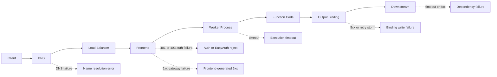
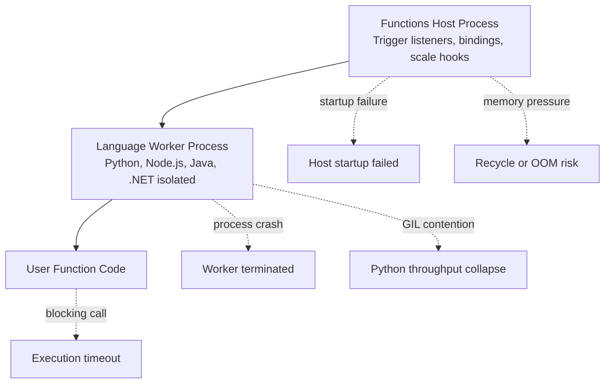
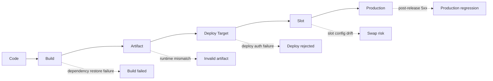
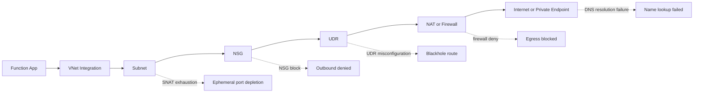
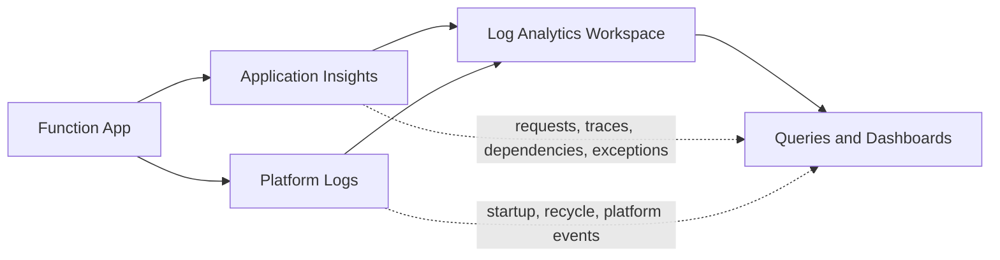
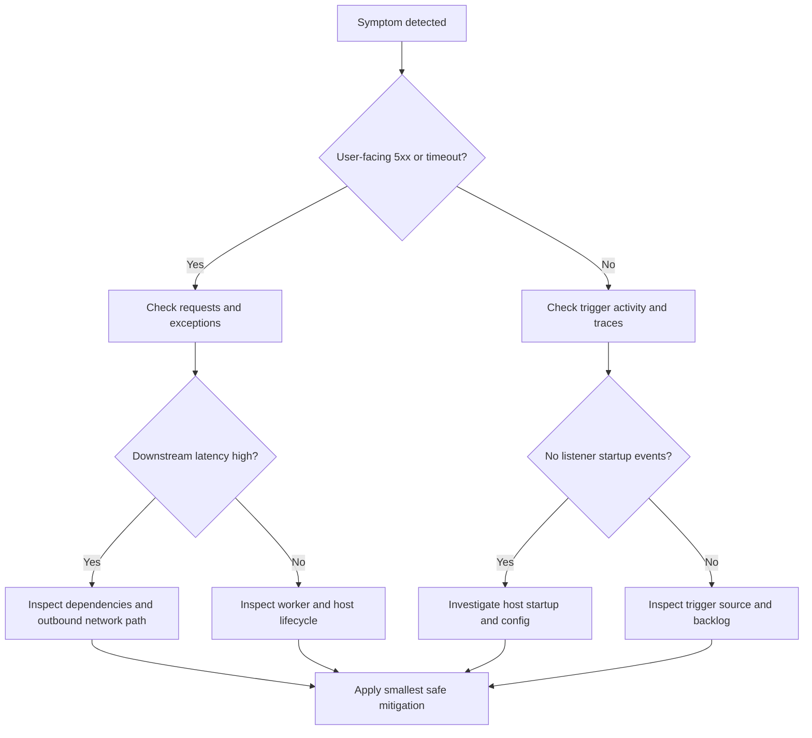

---
content_sources:
  - type: mslearn-adapted
    url: https://learn.microsoft.com/azure/azure-functions/functions-monitoring
  - type: mslearn-adapted
    url: https://learn.microsoft.com/azure/azure-functions/functions-networking-options
  - type: mslearn-adapted
    url: https://learn.microsoft.com/azure/azure-functions/functions-scale
  - type: mslearn-adapted
    url: https://learn.microsoft.com/azure/azure-monitor/app/data-model
  - type: mslearn-adapted
    url: https://learn.microsoft.com/azure/azure-monitor/essentials/activity-log
content_validation:
  status: verified
  last_reviewed: 2026-04-12
  reviewer: agent
  core_claims:
    - claim: "진단 방법론 기반 접근"
      source: self-generated
      verified: true
---

# Troubleshooting Architecture Map for Azure Functions

This guide is a diagnostic architecture reference for incident response.
It is intentionally failure-oriented so you can locate where symptoms originate and what evidence source to check first.
Use it as a fast index from symptom category to architecture layer ownership.

!!! warning "How to use this document"
    This is not a design poster.
    Read each diagram left-to-right as an evidence path: symptom → likely layer → telemetry/CLI confirmation.

!!! tip "Troubleshooting workflow"
Start with [First 10 Minutes](first-10-minutes/index.md), apply [Methodology](methodology.md), run focused queries from [KQL Query Library](kql/index.md), and then execute scenario fixes from [Functions not executing](playbooks/functions-not-executing.md), [High latency / slow responses](playbooks/high-latency.md), [Functions failing with errors](playbooks/functions-failing.md), or [Deployment failures](playbooks/deployment-failures.md).

## Request path architecture (where user-facing failures surface)

The request path is where availability and latency symptoms first appear.
Most `5xx`, timeout, DNS, and auth issues can be mapped to one of these nodes.

<!-- diagram-id: request-path-architecture-where-user-facing-failures-surface -->


### Request-path failure map

| Hop | Typical Symptom | Common Failure | Primary Evidence | First Action |
|---|---|---|---|---|
| Client → DNS | Immediate failure before app code runs | DNS record mismatch, private DNS zone missing | Client logs, Azure Front Door/Application Gateway logs, Azure DNS analytics | Validate DNS resolution path and private zone link |
| DNS → Load Balancer | Intermittent connect failures | Edge routing issue or transient platform fault | `requests` + Azure status | Check Azure Service Health and region incidents |
| Load Balancer → Frontend | `502`/`503` spikes | Frontend cannot route to healthy worker | `requests` resultCode + platform logs | Correlate failure spike with restarts |
| Frontend → Worker Process | Long tail latency, timed-out requests | Worker warm-up delay, instance recycle | `traces` host lifecycle, request duration | Check host start and recycle timeline |
| Worker Process → Function Code | `500` with exception | Runtime crash, unhandled exception | `exceptions`, `traces` | Identify dominant exception family |
| Function Code → Output Binding | Retry storms, partial success | Binding auth/config mismatch | `traces` binding errors, dependency failures | Validate binding connection settings |
| Output Binding → Downstream | High p95 and downstream `5xx` | API/database slowness or throttling | `dependencies` p95/failure rate | Isolate failing target and apply backoff |

### High-signal KQL for request-path triage

```kusto
requests
| where timestamp > ago(30m)
| summarize
    Total=count(),
    Failed=countif(success == false),
    P95=percentile(duration, 95)
  by resultCode, bin(timestamp, 5m)
| order by timestamp desc
```

## Runtime and worker model (where execution failures originate)

Azure Functions execution is split across host and language worker boundaries.
Symptoms often appear in requests, but root causes are frequently in process lifecycle and resource pressure.

<!-- diagram-id: runtime-and-worker-model-where-execution-failures-originate -->


### Runtime diagnostic table

| Layer | Component | Common Failure | Evidence Source |
|---|---|---|---|
| Host | JobHost startup | Host cannot initialize listeners or storage lock | `traces` messages containing `Initializing Host`, `Host lock`, `Host started` |
| Host | Trigger listener | Listener disabled, misconfigured, or auth denied | `traces` listener warnings + trigger silence in `requests`/metrics |
| Worker | Language worker process | Crash loop, startup timeout, incompatible runtime | platform logs + `traces` worker startup lines |
| Worker | Python execution runtime | GIL contention under CPU-bound concurrency | high duration variance, low CPU parallelism, `dependencies` idle while requests queue |
| Runtime | Memory management | Memory pressure and instance recycle | Activity Log events, `traces` host shutdown/startup cycle |
| Code | Function entrypoint | Unhandled exceptions and blocking operations | `exceptions`, slow request traces, timeout messages |

### Runtime evidence shortcuts

| Signal | Why it matters | Quick check |
|---|---|---|
| `Host started` missing | App state may be Running but host not healthy | Query `traces` over last 15 minutes |
| Repeated host start/shutdown | Crash loop or platform recycle | Compare `traces` timeline with Activity Log |
| Fast failure with no dependency call | Fails before downstream access | Inspect startup/config/identity exceptions first |
| Latency rises while dependency latency stable | Worker-side bottleneck | Check CPU/memory pressure and concurrency model |

## Deployment path (where release regressions appear)

Many incidents begin at deployment transitions.
Map failures by stage so rollback and forward-fix decisions are evidence-based.

<!-- diagram-id: deployment-path-where-release-regressions-appear -->


### Deployment stage troubleshooting table

| Stage | Failure Mode | Detection Method | Recovery Action |
|---|---|---|---|
| Code | Missing config contract, breaking change | PR checks, config schema validation | Revert change or patch config compatibility |
| Build | Dependency resolution or compile failure | CI logs and build summary | Pin package versions, fix pipeline cache and restore |
| Artifact | Runtime/version mismatch with app settings | Compare artifact metadata to function runtime | Rebuild artifact with aligned runtime |
| Deploy Target | Access denied or failed deployment operation | Activity Log and deployment task output | Fix RBAC/service principal scope and redeploy |
| Slot | Slot-specific app settings missing | Slot config diff and smoke tests | Sync required settings and mark sticky config |
| Production | Immediate `5xx`/timeouts after release | `requests` and `exceptions` spike post-deploy | Swap back or roll back to last known good artifact |

### Minimal CLI checks for deployment path

```bash
az monitor activity-log list \
  --subscription "<subscription-id>" \
  --resource-group "rg-myapp-prod" \
  --offset 2h \
  --max-events 50 \
  --output table

az functionapp deployment slot list \
  --resource-group "rg-myapp-prod" \
  --name "func-myapp-prod" \
  --output table
```

## Network and outbound path (where external connectivity fails)

Outbound failures often look like app bugs but originate in network controls.
Use this path to separate DNS, routing, NSG, and SNAT issues.

<!-- diagram-id: network-and-outbound-path-where-external-connectivity-fails -->


### Outbound failure evidence table

| Failure Point | Symptom | CLI Check | KQL Query |
|---|---|---|---|
| SNAT exhaustion | Intermittent connect timeout to many external targets | Diagnose and Solve Problems → SNAT Port Exhaustion; `az monitor metrics list --resource "/subscriptions/<subscription-id>/resourceGroups/rg-myapp-prod/providers/Microsoft.Web/sites/func-myapp-prod" --metric "TcpSynSent" --interval PT1M --aggregation Total --offset 30m --output table` | `dependencies | where timestamp > ago(30m) | where success == false | summarize failures=count() by type, target` |
| DNS resolution (outbound) | `ENOTFOUND`, `Name or service not known` | `az network private-dns zone list --resource-group "rg-network" --output table` | `exceptions | where timestamp > ago(30m) | where type has "SocketException" or outerMessage has "DNS" or outerMessage has "NameResolution"` |
| NSG block | Hard timeout after SYN attempts | `az network nsg rule list --resource-group "rg-network" --nsg-name "nsg-functions" --output table` | `dependencies | where timestamp > ago(30m) | summarize timeoutCount=countif(tostring(resultCode) in ("", "0")) by target` |
| UDR misconfiguration | All traffic to one range fails after route change | `az network route-table route list --resource-group "rg-network" --route-table-name "rt-functions" --output table` | `dependencies | where timestamp > ago(30m) | where success == false | summarize count() by target` |
| Firewall or NAT | Region-wide external egress failures | `az network firewall show --resource-group "rg-network" --name "fw-hub" --output table` | `dependencies | where timestamp > ago(30m) | summarize failed=countif(success == false), p95=percentile(duration,95) by target` |

## Observability map (where evidence is collected)

This map shows the primary data paths for troubleshooting.
During incidents, choose evidence source by hypothesis rather than querying everything.

<!-- diagram-id: observability-map-where-evidence-is-collected -->


### Observability source matrix

| Data Source | What It Captures | Best For | Latency |
|---|---|---|---|
| Application Insights `requests` | Invocation success/failure, latency, result codes | User-facing `5xx`, timeout trends, p95 analysis | Near real-time |
| Application Insights `traces` | Host lifecycle, listener state, runtime diagnostics | Startup failures, trigger initialization issues | Near real-time |
| Application Insights `exceptions` | Exception type, message, stack traces | Root-cause clustering by error family | Near real-time |
| Application Insights `dependencies` | Outbound call target, duration, success | Downstream slowness, DNS/network symptoms | Near real-time |
| Platform logs | Host/container/platform lifecycle events | Recycle loops and platform-generated restarts | Minutes |
| Activity Log | Configuration, deployment, RBAC change history | Change correlation and blast-window audit | Near real-time |

## Where problems happen (summary)

Use this as the first routing table when symptom ownership is unclear.

| Symptom Category | Architecture Layer | Evidence Source | First Check |
|---|---|---|---|
| 5xx responses | Frontend / Worker | `requests` table, `Http5xx` metric | KQL: failed requests by resultCode |
| Startup failure | Host process | `traces` table, platform logs | KQL: host startup events |
| DNS or SNAT failure | Network / outbound | `dependencies` + `exceptions`, app logs | Run [High latency / slow responses](playbooks/high-latency.md) checks and SNAT detector + `TcpSynSent` metric |
| Trigger silence | Listener / storage | `traces` table, queue metrics | CLI: function list + storage peek |
| Slow responses | Worker / dependency | `dependencies` table | KQL: dependency p95 |
| Recycle or restart | Platform events | Activity Log, `traces` | KQL: host shutdown/startup timeline |

## Suggested incident flow through architecture layers

<!-- diagram-id: suggested-incident-flow-through-architecture-layers -->


## See Also

- [First 10 Minutes](first-10-minutes/index.md)
- [Systematic Troubleshooting Methodology](methodology.md)
- [KQL Query Library](kql/index.md)
- [Functions not executing playbook](playbooks/functions-not-executing.md)
- [High latency / slow responses playbook](playbooks/high-latency.md)
- [Functions failing with errors playbook](playbooks/functions-failing.md)
- [Deployment failures playbook](playbooks/deployment-failures.md)
- [Monitoring](../operations/monitoring.md)

## Sources

- [Azure Functions monitoring](https://learn.microsoft.com/azure/azure-functions/functions-monitoring)
- [Azure Functions networking options](https://learn.microsoft.com/azure/azure-functions/functions-networking-options)
- [Azure Functions scale and hosting](https://learn.microsoft.com/azure/azure-functions/functions-scale)
- [Application Insights data model](https://learn.microsoft.com/azure/azure-monitor/app/data-model)
- [Azure Monitor Activity Log](https://learn.microsoft.com/azure/azure-monitor/essentials/activity-log)
