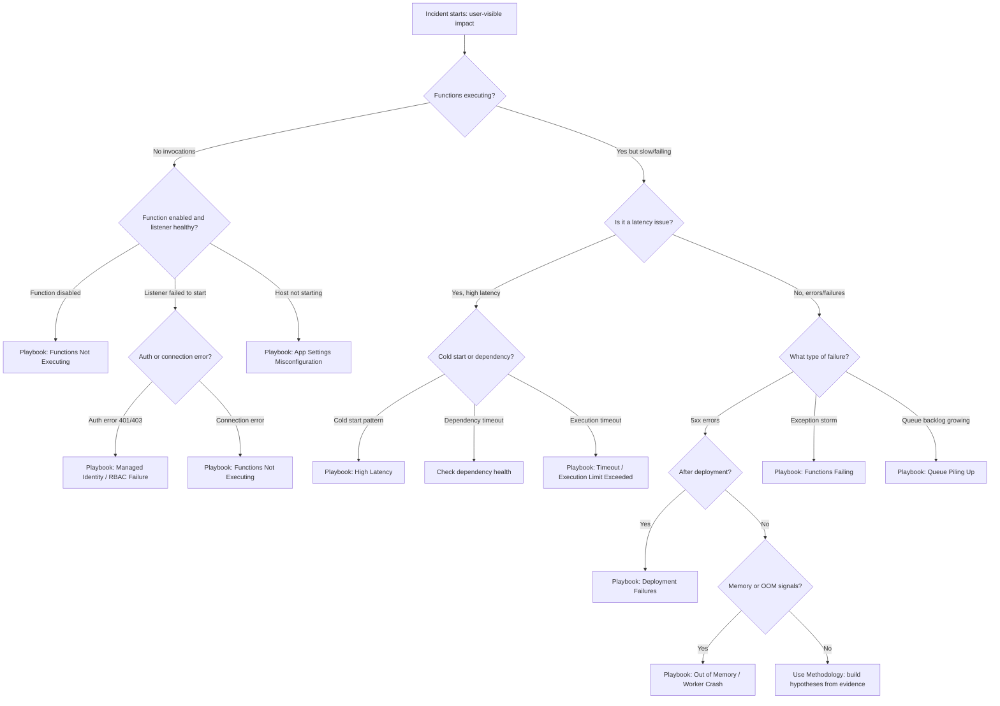
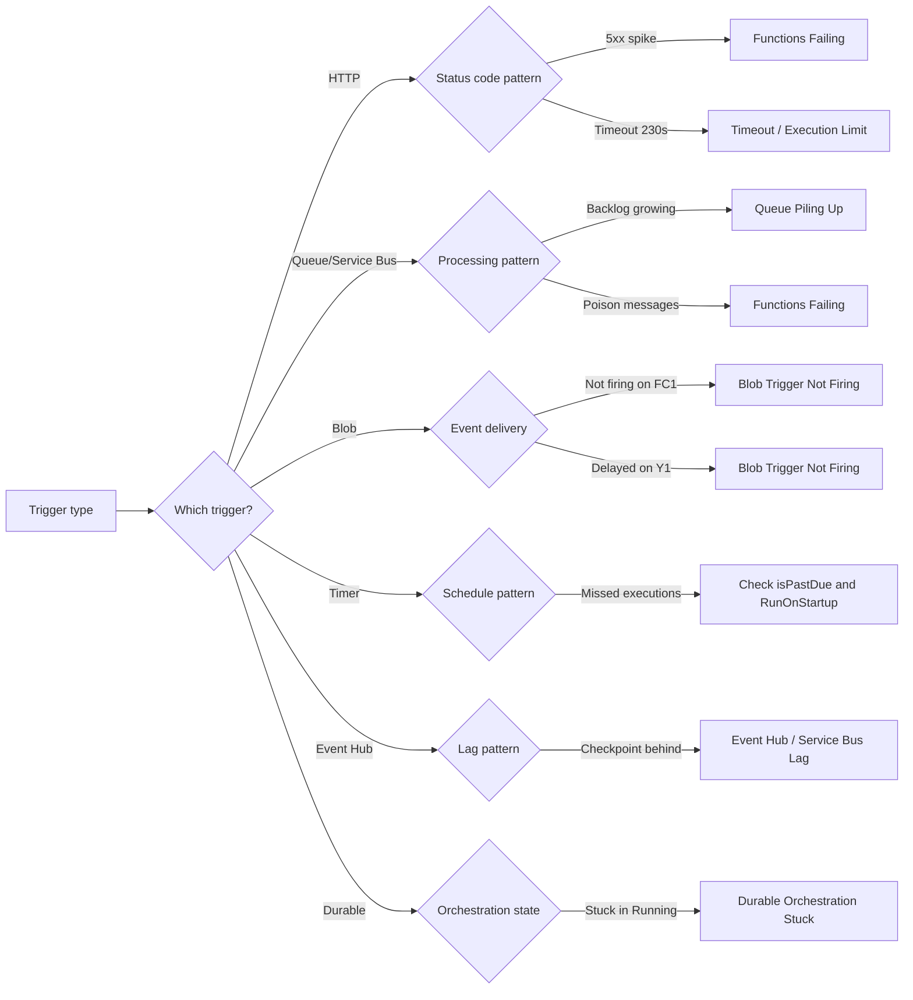

# Troubleshooting Decision Tree

Use this page when you need to triage quickly from symptom to likely failure category and then open the right playbook.

The tree is intentionally symptom-first and optimized for the first 10–15 minutes of incident response.

## Main triage decision tree



## Trigger-specific decision tree



## Playbook leaves (direct links)

### Triggers
- [Timeout / Execution Limit Exceeded](playbooks/triggers/timeout-execution-limit.md)
- [Event Hub / Service Bus Lag](playbooks/triggers/event-hub-service-bus-lag.md)

### Scaling
- [Out of Memory / Worker Crash](playbooks/scaling/out-of-memory-worker-crash.md)
- [Durable Orchestration Stuck](playbooks/scaling/durable-orchestration-stuck.md)

### Auth / Config
- [Managed Identity / RBAC Failure](playbooks/auth-config/managed-identity-rbac-failure.md)
- [App Settings Misconfiguration](playbooks/auth-config/app-settings-misconfiguration.md)

### General
- [Functions Not Executing](playbooks/functions-not-executing.md)
- [High Latency](playbooks/high-latency.md)
- [Functions Failing](playbooks/functions-failing.md)
- [Queue Piling Up](playbooks/queue-piling-up.md)
- [Blob Trigger Not Firing](playbooks/blob-trigger-not-firing.md)
- [Deployment Failures](playbooks/deployment-failures.md)

## Quick reference matrix

| Symptom Pattern | Most Likely Cause Category | Playbook Link |
|---|---|---|
| Zero invocations despite active source | Disabled function, listener failure, or host not starting | [Functions Not Executing](playbooks/functions-not-executing.md) |
| 5xx errors after deployment | Deployment artifact or config regression | [Deployment Failures](playbooks/deployment-failures.md) |
| High P95 latency, normal P50 | Cold start or intermittent dependency | [High Latency](playbooks/high-latency.md) |
| Execution timeout errors | Function exceeds plan timeout limit | [Timeout / Execution Limit](playbooks/triggers/timeout-execution-limit.md) |
| Queue depth rising, executions flat | Trigger stall or scaling bottleneck | [Queue Piling Up](playbooks/queue-piling-up.md) |
| Blob trigger not firing on FC1 | Missing Event Grid subscription | [Blob Trigger Not Firing](playbooks/blob-trigger-not-firing.md) |
| 401/403 on dependency calls | Managed identity or RBAC misconfiguration | [Managed Identity / RBAC Failure](playbooks/auth-config/managed-identity-rbac-failure.md) |
| Host fails to start, no functions found | Missing or wrong app settings | [App Settings Misconfiguration](playbooks/auth-config/app-settings-misconfiguration.md) |
| Worker crashes under load | Memory exhaustion | [Out of Memory / Worker Crash](playbooks/scaling/out-of-memory-worker-crash.md) |
| Durable orchestration stuck in Running | Replay storm or non-deterministic code | [Durable Orchestration Stuck](playbooks/scaling/durable-orchestration-stuck.md) |
| Event Hub/Service Bus processing falling behind | Checkpoint lag or slow processing | [Event Hub / Service Bus Lag](playbooks/triggers/event-hub-service-bus-lag.md) |
| Repeated exceptions dominating failures | Application code error | [Functions Failing](playbooks/functions-failing.md) |

## Triage prompts to ask in order

1. Are functions executing at all? If no, is the function enabled and listener healthy?
2. Was there a recent deployment or configuration change in the incident window?
3. Is it a latency issue (slow) or a failure issue (errors)?
4. Is the issue specific to one trigger type or affecting all functions?
5. Are there memory pressure or OOM signals in the logs?

## Minimal evidence before choosing a branch

- 15-minute function execution trend (`requests` table)
- Host lifecycle events for restarts/startups (`traces` table)
- Recent Activity Log operations

```kusto
let appName = "func-myapp-prod";
requests
| where timestamp > ago(2h)
| where cloud_RoleName =~ appName
| where operation_Name startswith "Functions."
| summarize total=count(), err=countif(success == false), p95=percentile(duration, 95) by bin(timestamp, 5m)
| order by timestamp asc
```

```kusto
let appName = "func-myapp-prod";
traces
| where timestamp > ago(24h)
| where cloud_RoleName =~ appName
| where message has_any ("Host started", "Host shutdown", "restart", "listener", "unable to start", "timeout")
| project timestamp, message
| order by timestamp desc
```

```bash
az monitor activity-log list \
  --resource-group "$RG" \
  --offset 24h \
  --max-events 20 \
  --output table
```

!!! warning "Avoid branch bias"
    Do not choose a branch only because it matches a familiar past issue.
    If the first branch is disproven by timestamps, return to the top and re-classify.
    Decision trees accelerate triage, but evidence still decides root cause.

## Decision Tree Limits

- This tree is optimized for Azure Functions serverless workloads.
- Multi-cause incidents can map to more than one branch.
- If no branch matches cleanly, use [Troubleshooting Method](methodology/troubleshooting-method.md) and build explicit competing hypotheses.

## Branch-specific first checks

### If you choose the trigger branch

- Confirm function is enabled and listener started.
- Check trigger-specific connection strings and auth.
- For blob triggers on FC1, verify Event Grid subscription exists.

### If you choose the latency branch

- Compare cold start frequency against latency pattern.
- Check dependency P95 for single-target bottleneck.
- Verify `functionTimeout` in host.json matches plan limits.

### If you choose the failure branch

- Correlate error onset with deployment timestamps.
- Check for dominant exception type in `exceptions` table.
- Verify app settings (especially `FUNCTIONS_WORKER_RUNTIME`, `AzureWebJobsStorage`).

## Practical triage examples

1. **Zero invocations + listener unable to start + 403 error**
    - Decision tree branch: not executing → listener failed → auth error.
    - Start with [Managed Identity / RBAC Failure](playbooks/auth-config/managed-identity-rbac-failure.md).

2. **Deployment succeeded + immediate 500 errors + no functions found**
    - Decision tree branch: errors → after deployment → config issue.
    - Start with [App Settings Misconfiguration](playbooks/auth-config/app-settings-misconfiguration.md).

3. **Queue depth growing over hours + worker restarts + OOM exceptions**
    - Decision tree branch: queue backlog → memory signals.
    - Start with [Out of Memory / Worker Crash](playbooks/scaling/out-of-memory-worker-crash.md).

## See Also

- [Troubleshooting Method](methodology/troubleshooting-method.md)
- [Detector Map](methodology/detector-map.md)
- [Architecture](architecture.md)
- [Evidence Map](evidence-map.md)
- [Mental Model](mental-model.md)
- [First 10 Minutes: Triggers Not Firing](first-10-minutes/triggers-not-firing.md)
- [First 10 Minutes: High Latency](first-10-minutes/high-latency.md)
- [First 10 Minutes: Scaling Issues](first-10-minutes/scaling-issues.md)

## Sources

- [Azure Functions diagnostics overview](https://learn.microsoft.com/azure/azure-functions/functions-diagnostics)
- [Monitor Azure Functions](https://learn.microsoft.com/azure/azure-functions/functions-monitoring)
- [Troubleshoot Azure Functions](https://learn.microsoft.com/azure/azure-functions/functions-recover-from-failed-host)
- [Azure Functions host.json reference](https://learn.microsoft.com/azure/azure-functions/functions-host-json)
