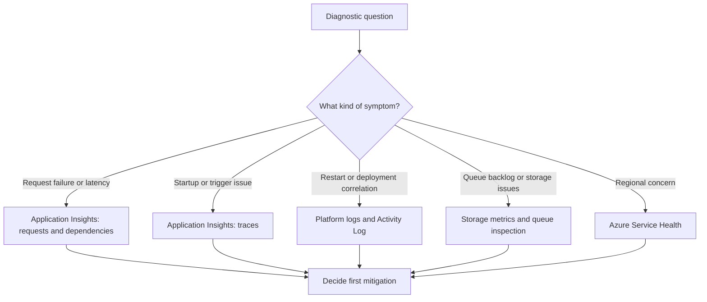

---
content_sources:
  - type: mslearn-adapted
    url: https://learn.microsoft.com/azure/azure-functions/functions-monitoring
  - type: mslearn-adapted
    url: https://learn.microsoft.com/azure/azure-functions/analyze-telemetry-data
  - type: mslearn-adapted
    url: https://learn.microsoft.com/azure/azure-monitor/logs/log-query-overview
  - type: mslearn-adapted
    url: https://learn.microsoft.com/azure/service-health/overview
  - type: mslearn-adapted
    url: https://learn.microsoft.com/azure/azure-functions/functions-networking-options
content_validation:
  status: verified
  last_reviewed: 2026-04-12
  reviewer: agent
  core_claims:
    - claim: "진단 방법론 기반 접근"
      source: self-generated
      verified: true
---

# Azure Functions Troubleshooting Evidence Map

Use this page when you need to answer: "I need to know X, where do I look first?"
It maps diagnostic questions to the fastest evidence source, then shows what healthy and unhealthy log patterns look like.

!!! tip "Use with incident workflow"
    Pair this quick map with [First 10 Minutes](first-10-minutes/index.md) for triage order,
    [Methodology](methodology.md) for hypothesis-driven validation,
    [KQL Query Library](kql/index.md) for reusable queries,
    and [Playbooks](playbooks/index.md) for scenario-specific recovery actions.

## Evidence path overview

<!-- diagram-id: evidence-path-overview -->


## Evidence source inventory

| Source | Type | Access Method | Best For | Latency |
|---|---|---|---|---|
| Application Insights (requests) | Telemetry | KQL / Portal | Request success/failure, latency | Near real-time |
| Application Insights (traces) | Logs | KQL / Portal | Host lifecycle, trigger status | Near real-time |
| Application Insights (exceptions) | Telemetry | KQL / Portal | Error types, stack traces | Near real-time |
| Application Insights (dependencies) | Telemetry | KQL / Portal | Outbound call health | Near real-time |
| Platform logs | Diagnostic | Log Analytics / Portal | Host startup, recycle events | Minutes |
| Activity Log | Audit | CLI / Portal | Deploy, config, RBAC changes | Near real-time |
| Storage metrics | Metrics | CLI / Portal | Queue depth, throttling | Minutes |
| Azure Service Health | Status | Portal | Regional outages | Real-time |

## Question-to-evidence mapping (primary routing table)

Use this as your first lookup table during active incident triage.

| Question | Best Source | CLI Query | KQL Query | Portal Path |
|---|---|---|---|---|
| Was the app restarting? | Platform logs / Activity Log | `az monitor activity-log list --subscription "<subscription-id>" --resource-group "rg-myapp-prod" --offset 2h --max-events 50 --output table` | `traces \| where timestamp > ago(2h) \| where message has "Host started"` | Diagnose and Solve Problems → App Restarts |
| Were requests failing? | `requests` table | `az monitor metrics list --resource "/subscriptions/<subscription-id>/resourceGroups/rg-myapp-prod/providers/Microsoft.Web/sites/func-myapp-prod" --metric "Http5xx" --interval PT1M --aggregation Total --offset 1h --output table` | `requests \| where timestamp > ago(1h) \| where success == false` | Application Insights → Failures |
| Was startup failing? | `traces` + `exceptions` tables | `az functionapp show --name "func-myapp-prod" --resource-group "rg-myapp-prod" --query "state" --output tsv` | `traces \| where timestamp > ago(1h) \| where message has "Host initialization" or message has "A host error has occurred" \| where severityLevel >= 3` | Log stream / Console logs |
| Was dependency slow? | `dependencies` table | `N/A` | `dependencies \| where timestamp > ago(1h) \| summarize p95=percentile(duration,95) by target` | Application Insights → Performance |
| Was DNS failing? | `exceptions`/`traces` + app logs | `az network vnet show --resource-group "rg-network" --name "vnet-prod" --output table` | `exceptions \| where timestamp > ago(1h) \| where type has "SocketException" or outerMessage has "DNS" or outerMessage has "NameResolution"` | Diagnose and Solve Problems → Networking |
| Was scale involved? | Metrics / platform signals | `az monitor metrics list --resource "/subscriptions/<subscription-id>/resourceGroups/rg-myapp-prod/providers/Microsoft.Web/sites/func-myapp-prod" --metric "FunctionExecutionCount" --interval PT1M --aggregation Total --offset 1h --output table` | `traces \| where timestamp > ago(1h) \| where message has "scale"` | Metrics → Instance Count |
| Were messages piling up? | Storage metrics | `az monitor metrics list --resource "/subscriptions/<subscription-id>/resourceGroups/rg-myapp-prod/providers/Microsoft.Storage/storageAccounts/stmyapp" --metric "QueueMessageCount" --interval PT1M --aggregation Average --offset 1h --output table` | `N/A (QueueMessageCount is a Storage metric, not an Application Insights custom metric)` | Storage account → Queue metrics |
| Was identity broken? | `exceptions` + Activity Log | `az role assignment list --scope "/subscriptions/<subscription-id>/resourceGroups/rg-myapp-prod" --output table` | `exceptions \| where timestamp > ago(1h) \| where type has "Authorization"` | Activity Log → RBAC changes |

## Symptom category to first evidence source

| Symptom | First Evidence Source | Why first | Secondary Source |
|---|---|---|---|
| Sudden `5xx` increase | `requests` | Direct failure-rate and result-code signal | `exceptions` for error family |
| Trigger stopped firing | `traces` | Listener initialization/shutdown appears here first | Storage metrics and queue depth |
| Slow response tail | `dependencies` | Quickly separates internal vs downstream slowness | `requests` percentile trend |
| Repeated recycle | Platform logs / Activity Log | Confirms whether restart is platform- or change-driven | `traces` host lifecycle |
| Outbound timeout | `dependencies` | Captures target-level timeout distribution | VNet/NSG/UDR CLI checks |
| Auth failures after change | Activity Log | Change timeline for RBAC/app settings | `exceptions` authorization traces |

## Representative log patterns

Recognizing these signatures in raw logs reduces time-to-hypothesis.
For each pattern: what it looks like → what it means → normal vs abnormal → next step.

### 1) Healthy host startup

What it looks like:

```text
Host lock lease acquired by instance ID 'xxxxxxxx-xxxx-xxxx-xxxx-xxxxxxxxxxxx'.
Initializing Host. OperationId: 'xxxxxxxx-xxxx-xxxx-xxxx-xxxxxxxxxxxx'.
Host started (Xms)
Host initialized (Xms)
```

What it means:
- Host acquired storage lease and completed startup sequence.
- Trigger listeners can initialize normally.

Normal vs abnormal:
- Normal: sequence appears once on cold start or planned recycle.
- Abnormal: repeated startup cycles in short intervals with no stable execution window.

Next step:
- If healthy, move focus to function code or dependencies.
- If startup loops, correlate with Activity Log changes and container health events.

### 2) Worker timeout

What it looks like:

```text
Worker was unable to load function: 'FunctionName'
Timeout value of 00:00:30 exceeded by host
The operation was canceled.
```

What it means:
- Worker failed to initialize or function execution exceeded configured timeout.
- Can indicate runtime mismatch, blocking startup code, or downstream stall.

Normal vs abnormal:
- Normal: occasional timeout under rare dependency spikes.
- Abnormal: repeated timeout messages across many invocations or immediately after deploy.

Next step:
- Check deployment/runtime compatibility and recent config changes.
- Query `dependencies` for latency spike and validate timeout policy.

### 3) Connection refused or storage failure

What it looks like:

```text
An error occurred while processing the request. Connection refused (127.0.0.1:XXXXX)
Storage operation failed: The remote server returned an error: (403) Forbidden.
Unable to connect to the remote server
```

What it means:
- Connection target is unreachable, blocked, or not listening.
- Storage auth or network path is broken for trigger/binding operations.

Normal vs abnormal:
- Normal: brief transient bursts with automatic retry recovery.
- Abnormal: sustained failures causing trigger silence, retry storms, or poison growth.

Next step:
- Validate storage identity/RBAC and firewall/network rules.
- Confirm connection strings or identity-based settings are present and correct.

### 4) Health check failed

What it looks like:

```text
Container func-myapp_X didn't respond to HTTP pings on port XXXX
Health check failure: StatusCode=503
Sending SIGTERM to container
```

What it means:
- Platform health probe marked instance unhealthy and initiated recycle.
- Usually associated with startup deadlock, severe resource pressure, or port binding failure.

Normal vs abnormal:
- Normal: isolated occurrence during planned restart.
- Abnormal: repeated probe failures with short-lived containers and rising `503`.

Next step:
- Review host startup sequence and memory/CPU pressure.
- Correlate with deployment changes and warm-up behavior.

### 5) 503 spike after restart

What it looks like:

```text
Host is shutting down
Stopping JobHost
Host started (Xms)  ← new instance
Request timed out after 230000ms
```

What it means:
- Requests hit transition window between old and new host states.
- Can indicate cold-start amplification or unhealthy rollout.

Normal vs abnormal:
- Normal: brief `503` blip during controlled swap/restart.
- Abnormal: prolonged timeout window and repeated shutdown/start loops.

Next step:
- Check if restart reason is platform, deployment, or configuration.
- Validate slot health before swap and ensure dependency readiness.

### 6) DNS resolution failure

What it looks like:

```text
Name or service not known
getaddrinfo ENOTFOUND myservice.privatelink.database.windows.net
A connection attempt failed because the connected party did not properly respond
```

What it means:
- Name resolution failed or resolved endpoint is unreachable from current network route.
- Common with private endpoint DNS zone linkage or route misconfiguration.

Normal vs abnormal:
- Normal: short-lived resolver transient with fast retry recovery.
- Abnormal: persistent `ENOTFOUND` against private endpoints across instances.

Next step:
- Verify VNet integration, private DNS zone link, and route table intent.
- Cross-check dependency failures by target in `dependencies`.

## Query snippets for fast evidence confirmation

```kusto
// Failed requests by code
requests
| where timestamp > ago(30m)
| where success == false
| summarize failures=count() by resultCode
| order by failures desc

// Host startup and shutdown timeline
traces
| where timestamp > ago(2h)
| where message has_any ("Host started", "Host is shutting down", "Stopping JobHost")
| project timestamp, message
| order by timestamp desc

// Dependency tail latency by target
dependencies
| where timestamp > ago(1h)
| summarize p95=percentile(duration,95), failed=countif(success == false) by target
| order by failed desc, p95 desc
```

## See Also

- [First 10 Minutes](first-10-minutes/index.md)
- [Systematic Troubleshooting Methodology](methodology.md)
- [KQL Query Library](kql/index.md)
- [Azure Functions Incident Playbooks](playbooks/index.md)
- [Monitoring](../operations/monitoring.md)

## Sources

- [Azure Functions monitoring](https://learn.microsoft.com/azure/azure-functions/functions-monitoring)
- [Monitor Azure Functions with Application Insights](https://learn.microsoft.com/azure/azure-functions/analyze-telemetry-data)
- [Azure Monitor Logs query overview](https://learn.microsoft.com/azure/azure-monitor/logs/log-query-overview)
- [Azure Service Health overview](https://learn.microsoft.com/azure/service-health/overview)
- [Azure Functions networking options](https://learn.microsoft.com/azure/azure-functions/functions-networking-options)
