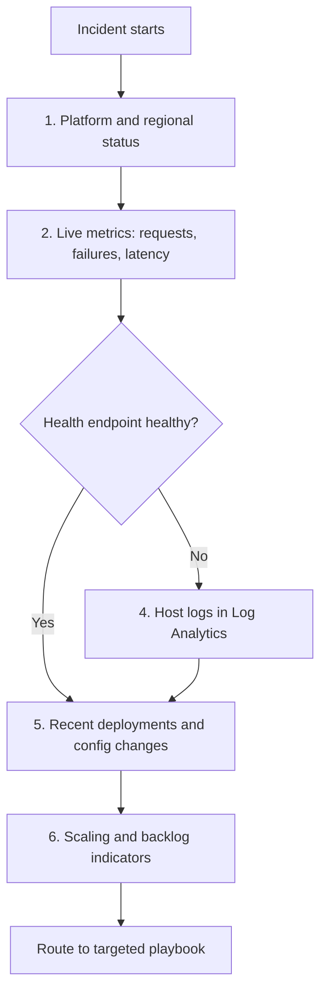

---
content_sources:
  - type: mslearn-adapted
    url: https://learn.microsoft.com/azure/service-health/overview
  - type: mslearn-adapted
    url: https://learn.microsoft.com/azure/azure-functions/functions-monitoring
  - type: mslearn-adapted
    url: https://learn.microsoft.com/azure/azure-functions/functions-diagnostics
  - type: mslearn-adapted
    url: https://learn.microsoft.com/azure/azure-functions/configure-monitoring
---

# First 10 Minutes of an Azure Functions Incident

When an incident starts, focus on three outcomes: **confirm platform status, assess app health, and identify recent change signals**.
This checklist is designed for fast triage before deeper root-cause analysis.

## Prerequisites

- Azure CLI access to the production subscription.
- Access to Application Insights and Log Analytics.
- Health endpoint implemented at `GET /api/health`.

Set shared variables:

```bash
RG="rg-myapp-prod"
APP_NAME="func-myapp-prod"
SUBSCRIPTION_ID="<subscription-id>"
APP_INSIGHTS_NAME="appi-myapp-prod"
WORKSPACE_ID="xxxxxxxx-xxxx-xxxx-xxxx-xxxxxxxxxxxx"
```

!!! tip "Operations Guide"
    For monitoring setup and alert configuration, see [Monitoring](../operations/monitoring.md) and [Alerts](../operations/alerts.md).

## Triage steps

<!-- diagram-id: triage-steps -->


## 1) Check Azure status and regional incidents

Rule out platform-wide issues first.
If a regional outage exists, your app-level actions are secondary.

### Check in Portal

Azure portal → **Service Health** → **Health advisories**.

Filter for the production region and services used by this app:

- App Service
- Storage
- Azure Monitor

### Check with Azure CLI (resource-level operations)

Use Activity Log to confirm recent operations on your resources (deployments, restarts, config writes). This does **not** show regional outages or Azure-wide service incidents.

```bash
az account set --subscription "$SUBSCRIPTION_ID"
az account show --output table
az monitor activity-log list \
  --subscription "$SUBSCRIPTION_ID" \
  --resource-group "$RG" \
  --offset 1h \
  --max-events 20 \
  --output table

# Check Azure Service Health for active incidents (regional/platform)
az rest --method get \
  --url "https://management.azure.com/subscriptions/$SUBSCRIPTION_ID/providers/Microsoft.ResourceHealth/events?api-version=2022-10-01&\$filter=eventType eq 'ServiceIssue' and status eq 'Active'"
```

!!! note "Portal vs CLI scope"
    **Portal**: Azure Service Health → Service issues is the reliable source for regional/platform incidents.
    **CLI Activity Log**: shows resource-level operations, not regional outages. For regional status, use Azure Service Health in the portal or the [Azure Status page](https://status.azure.com/).

### Example Output

```text
# Normal (no platform-caused restart in scope)
EventName                          ResourceGroup    ResourceType                Status
---------------------------------  ---------------  --------------------------  ---------
MICROSOFT.WEB/SITES/WRITE          rg-myapp-prod    microsoft.web/sites         Succeeded
MICROSOFT.INSIGHTS/COMPONENTS/WRITE rg-myapp-prod   microsoft.insights/components Succeeded
MICROSOFT.WEB/SITES/CONFIG/WRITE   rg-myapp-prod    microsoft.web/sites/config  Succeeded

# Platform event (investigate platform advisory)
EventName                          ResourceGroup    ResourceType         Status
---------------------------------  ---------------  -------------------  ---------
MICROSOFT.WEB/SITES/RESTARTED      rg-myapp-prod    microsoft.web/sites  Succeeded
Properties: Cause=Platform
```

### How to Read This

| Signal | Interpretation | Action |
|---|---|---|
| No platform-originated events | Likely app/dependency/local change | Continue to Step 2 |
| `Microsoft.Web/sites/Restarted` + `Cause=Platform` | Platform event, not app deploy | Track Service Health advisory and shift to mitigation |
| Multiple infrastructure operations in same window | Possible platform turbulence | Correlate with regional advisories before rollback |

### Next Query to Run

Continue to [2) Check Application Insights Live Metrics](#2-check-application-insights-live-metrics).

## 2) Check Application Insights Live Metrics

Live Metrics quickly shows whether failures are active, rising, or already stabilized.

### Check in Portal

Azure portal → **Application Insights** → **Live Metrics Stream**.

Watch request rate, failure rate, and server response time in the same 5-minute slice.

### Check with Azure CLI

```bash
az monitor app-insights component show \
  --app "$APP_INSIGHTS_NAME" \
  --resource-group "$RG" \
  --output table

az monitor metrics list \
  --resource "/subscriptions/$SUBSCRIPTION_ID/resourceGroups/$RG/providers/Microsoft.Web/sites/$APP_NAME" \
  --metric "Requests" "Http5xx" "AverageResponseTime" \
  --interval PT1M \
  --aggregation Total Average \
  --offset 30m \
  --output table
```

### Example Output

```text
# Traditional (Y1/EP/Dedicated) - Normal
MetricName            TimeGrain  Total    Average
--------------------  ---------  -------  ---------
Requests              PT1M       1240
Http5xx               PT1M       0
AverageResponseTime   PT1M                112.7

# Traditional (Y1/EP/Dedicated) - Abnormal (failure spike)
MetricName            TimeGrain  Total    Average
--------------------  ---------  -------  ---------
Requests              PT1M       1315
Http5xx               PT1M       187
AverageResponseTime   PT1M                1842.3

# FC1 Flex Consumption
MetricName                        TimeGrain  Total
--------------------------------  ---------  -------
OnDemandFunctionExecutionCount    PT1M       156
OnDemandFunctionExecutionUnits    PT1M       214
```

!!! tip "FC1 Flex Consumption Metrics"
    Flex Consumption plans expose `OnDemandFunctionExecutionCount` and `OnDemandFunctionExecutionUnits` for execution tracking. `Requests` is still valid for HTTP traffic. If execution metrics are empty, use the FC1-specific execution metric names.

### How to Read This

| Metric | Normal Range | Warning | Critical |
|---|---|---|---|
| Requests | Matches expected traffic profile | Sudden drop without known traffic change | Near-zero during business hours |
| Http5xx | 0 or low single-digit blips | Sustained non-zero for >3 minutes | Sharp spike with user-visible failure |
| AverageResponseTime (ms) | Stable baseline (for example <500ms) | 2x baseline | >1000ms plus rising 5xx |

### Next Query to Run

Continue to [3) Check function app health endpoint](#3-check-function-app-health-endpoint).

- Rising requests + rising failures usually indicate app/dependency failure.
- Flat requests during expected traffic suggests trigger, routing, or ingress issues.

## 3) Check function app health endpoint

Verify if the app can serve a lightweight health probe.

### Check in Portal

Azure portal → **Function App** → **Overview** (state + URL) and **Diagnose and solve problems** (availability).

### Check with Azure CLI

```bash
az functionapp show \
  --name "$APP_NAME" \
  --resource-group "$RG" \
  --query "state" \
  --output tsv

curl --silent --show-error --location \
  "https://$APP_NAME.azurewebsites.net/api/health"
```

### Example Output

```text
# az functionapp show --query "state"
# Traditional plans (Y1, EP, Dedicated)
Running

# FC1 Flex Consumption
null

# Health endpoint - healthy
{"status":"healthy","timestamp":"2026-04-04T11:41:00Z","version":"1.0.0"}

# Health endpoint - host reachable but unhealthy
{"status":"unhealthy","reason":"storage-auth-failed"}
# HTTP status: 503

# Host non-responsive
curl: (28) Operation timed out after 10001 milliseconds with 0 bytes received
```

### How to Read This

| Result | Interpretation | Next Action |
|---|---|---|
| `200` + healthy payload | Host is up; failure likely function-level or dependency-level | Move to Step 4 for function-specific evidence |
| `503` | Host is running but critical dependency/function check failing | Inspect startup and dependency errors in Step 4 |
| `null` state on FC1 | Can occur on Flex Consumption depending on API surface/version; do not use this value alone for health judgment | Verify with health endpoint, function list, and host logs |
| Timeout/no response | Host not responding (startup failure, networking, or platform path issue) | Prioritize host lifecycle and restart evidence in Step 4/5 |

### Next Query to Run

Continue to [4) Check host logs in Log Analytics](#4-check-host-logs-in-log-analytics).

- `200 OK` with failing business endpoints points to function-level or dependency issues.
- Health failure indicates host startup/configuration/dependency-critical problems.

## 4) Check host logs in Log Analytics

Look for startup, listener, and runtime errors in the incident window.

### Check in Portal

Azure portal → **Log Analytics workspace** → **Logs**.

Run `AppTraces` and `AppExceptions` queries in the same time window used in prior steps.

### Check with Azure CLI

```bash
az monitor log-analytics query \
  --workspace "$WORKSPACE_ID" \
  --analytics-query "AppTraces | where TimeGenerated > ago(30m) | where AppRoleName =~ '$APP_NAME' | order by TimeGenerated desc | take 100" \
  --output table

az monitor log-analytics query \
  --workspace "$WORKSPACE_ID" \
  --analytics-query "AppExceptions | where TimeGenerated > ago(30m) | where AppRoleName =~ '$APP_NAME' | summarize count() by ExceptionType, OuterMessage" \
  --output table
```

### Example Output

```text
# AppTraces (startup succeeded)
TimeGenerated                Message
---------------------------  ----------------------------------------------
2026-04-04T11:32:26.390000Z  Starting Host (HostId=func-myapp-prod-xxxx, Version=4.1047.100.26071)
2026-04-04T11:32:26.455000Z  Host started (64ms)
2026-04-04T11:32:26.455000Z  Job host started
2026-04-04T11:36:21.414000Z  Host lock lease acquired by instance ID 'xxxxxxxx-xxxx-xxxx-xxxx-xxxxxxxxxxxx'

# AppTraces (problematic)
TimeGenerated                Message
---------------------------  ----------------------------------------------
2026-04-04T11:32:26.390000Z  Starting Host (HostId=func-myapp-prod-xxxx, Version=4.1047.100.26071)
2026-04-04T11:32:46.000000Z  Host lock lease acquired by instance ID 'xxxxxxxx-xxxx-xxxx-xxxx-xxxxxxxxxxxx'
2026-04-04T11:32:46.781000Z  Worker process failed to initialize in time
2026-04-04T11:32:46.900000Z  Timeout value of 00:00:20 exceeded by startup operation
```

### How to Read This

| Pattern | What it means | Priority |
|---|---|---|
| `Host started` appears quickly | Startup path is healthy | Continue to function/dependency checks |
| Long gap before `Host lock` or startup completion | Storage/coordination delay affecting startup | Verify storage auth, latency, and lock contention |
| `Worker timeout` / startup timeout | Language worker or startup dependency blocking host readiness | Check deployment changes and outbound dependency initialization |

### Next Query to Run

Continue to [5) Check recent deployments and configuration changes](#5-check-recent-deployments-and-configuration-changes).

- `Host started` missing or delayed.
- Trigger listener initialization failures.
- Timeout, DNS, storage auth, or Managed Identity errors.

## 5) Check recent deployments and configuration changes

Most incidents are linked to recent changes.
Confirm code, settings, or identity updates in the blast window.

### Check in Portal

Azure portal → **Function App** → **Deployment Center** and **Activity log**.

Compare deployment timestamps and app setting modifications against failure start time.

### Check with Azure CLI

```bash
az monitor activity-log list \
  --resource-group "$RG" \
  --offset 2h \
  --status Succeeded \
  --output table

az functionapp config appsettings list \
  --name "$APP_NAME" \
  --resource-group "$RG" \
  --output table
```

### Example Output

```text
# Recent activity
EventTimestamp                OperationName                      Status
---------------------------  ---------------------------------  ---------
2026-04-04T11:36:00.000000Z  MICROSOFT.WEB/SITES/WRITE         Succeeded
2026-04-04T11:39:00.000000Z  MICROSOFT.INSIGHTS/COMPONENTS/WRITE  Succeeded

# App settings snapshot (masked)
Name                                   Value
-------------------------------------  --------------------------------
AzureWebJobsStorage__accountName       stmyappprod
AzureWebJobsStorage__credential        managedidentity
AzureWebJobsStorage__clientId          xxxxxxxx-xxxx-xxxx-xxxx-xxxxxxxxxxxx
APPLICATIONINSIGHTS_CONNECTION_STRING  InstrumentationKey=xxxxxxxx-xxxx-xxxx-xxxx-xxxxxxxxxxxx;...
AZURE_FUNCTIONS_ENVIRONMENT            production
```

### How to Read This

| Signal | Interpretation | Action |
|---|---|---|
| Deploy/config change immediately before failure | High-confidence regression candidate | Prepare rollback/revert smallest change |
| No change events in incident window | Cause likely runtime/dependency/platform | Proceed to scaling/dependency validation |
| Multiple config writes in short interval | Drift risk | Diff settings against known-good baseline |

Correlate timestamps with failure onset before changing anything.

### Next Query to Run

Continue to [6) Check scaling and backlog indicators](#6-check-scaling-and-backlog-indicators).

## 6) Check scaling and backlog indicators

For event-driven failures, verify whether scale behavior matches incoming demand.

### Check in Portal

Azure portal → **Function App** → **Metrics** (execution counters) and Storage Account → **Metrics** (queue depth).

Plot both on the same time axis.

### Check with Azure CLI

```bash
az monitor metrics list \
  --resource "/subscriptions/$SUBSCRIPTION_ID/resourceGroups/$RG/providers/Microsoft.Web/sites/$APP_NAME" \
  --metric "FunctionExecutionCount" "FunctionExecutionUnits" \
  --interval PT1M \
  --aggregation Total \
  --offset 30m \
  --output table

# Flex Consumption (FC1) execution metrics
az monitor metrics list \
  --resource "/subscriptions/$SUBSCRIPTION_ID/resourceGroups/$RG/providers/Microsoft.Web/sites/$APP_NAME" \
  --metric "OnDemandFunctionExecutionCount" "OnDemandFunctionExecutionUnits" \
  --interval PT1M \
  --aggregation Total \
  --offset 30m \
  --output table

az monitor metrics list \
  --resource "/subscriptions/$SUBSCRIPTION_ID/resourceGroups/$RG/providers/Microsoft.Storage/storageAccounts/<storage-account-name>" \
  --metric "QueueMessageCount" \
  --interval PT1M \
  --aggregation Average \
  --offset 30m \
  --output table
```

### Example Output

```text
# Function execution metrics
MetricName                        TimeGrain  Total
--------------------------------  ---------  -------
OnDemandFunctionExecutionCount    PT1M       156
OnDemandFunctionExecutionUnits    PT1M       214

# Queue depth metrics (abnormal backlog growth)
MetricName         TimeGrain  Average
-----------------  ---------  ---------
QueueMessageCount  PT1M       120
QueueMessageCount  PT1M       860
QueueMessageCount  PT1M       2140
```

> **Execution metric scope:** `OnDemandFunctionExecutionCount` / `OnDemandFunctionExecutionUnits` apply to Flex Consumption (FC1). For Y1, EP, and Dedicated, use `FunctionExecutionCount` / `FunctionExecutionUnits`. `Requests` remains valid for HTTP traffic across plans.

### How to Read This

| Pattern | Interpretation | Action |
|---|---|---|
| Queue depth stable + executions track demand | Normal drain behavior | Continue targeted checks only if user errors persist |
| Queue depth up + executions flat | Scaling bottleneck or trigger stall | Inspect trigger listener health and scale-controller evidence |
| Queue depth up + executions up but latency worsens | Downstream dependency bottleneck | Prioritize dependency timeout/error evidence |

QueueMessageCount up + FunctionExecutionCount (traditional) or OnDemandFunctionExecutionCount (FC1) flat is a high-confidence scaling bottleneck indicator.

### Next Query to Run

Route to [Playbooks](playbooks.md) for trigger-specific mitigations and [Methodology](methodology.md) for deeper hypothesis testing.

- Backlog up + executions flat = trigger/scaling bottleneck.
- Enqueue rate stable + errors rising = likely processing or dependency regression.

## Fast routing after triage

| What you see | Likely area | Next action |
|---|---|---|
| Regional advisory active | Platform dependency | Communicate impact, apply mitigation |
| Health endpoint failing | Host/config/dependency | Use [Playbooks](playbooks.md) error scenarios |
| Queue depth rising rapidly | Scale/poison path | Use queue backlog playbook |
| Failures started after deploy | Release regression | Roll back, then follow [Methodology](methodology.md) |

## Escalate immediately when

- SLA breach is in progress with no safe quick mitigation.
- Data loss risk appears (message drop, poison saturation).
- Security-impacting symptoms are observed.

## See Also

- [Playbooks](playbooks.md)
- [Methodology](methodology.md)
- [KQL Query Library](kql.md)

## Sources

- [Azure Service Health overview](https://learn.microsoft.com/azure/service-health/overview)
- [Monitor Azure Functions](https://learn.microsoft.com/azure/azure-functions/functions-monitoring)
- [Azure Functions diagnostics](https://learn.microsoft.com/azure/azure-functions/functions-diagnostics)
- [Application Insights for Azure Functions](https://learn.microsoft.com/azure/azure-functions/configure-monitoring)
