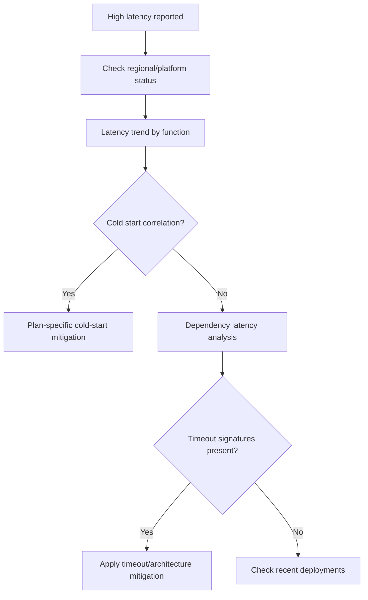

# First 10 Minutes: High Latency

When function execution latency is elevated or users report slow responses, use this checklist to narrow down the cause within the first 10 minutes.

## Prerequisites

- Azure CLI access to the production subscription.
- Access to Application Insights and Log Analytics.
- Health endpoint implemented at `GET /api/health`.

Set shared variables:

```bash
RG="rg-myapp-prod"
APP_NAME="func-myapp-prod"
SUBSCRIPTION_ID="<subscription-id>"
APP_INSIGHTS_NAME="appi-myapp-prod"
WORKSPACE_ID="xxxxxxxx-xxxx-xxxx-xxxx-xxxxxxxxxxxx"
```



## 1) Check Azure status and regional incidents

Rule out platform-wide latency degradation.

### Check in Portal

Azure portal → **Service Health** → **Health advisories**.

Filter for the production region and services: Azure Functions, Storage, Azure Monitor.

### Check with Azure CLI

```bash
az account set --subscription "$SUBSCRIPTION_ID"
az rest --method get \
  --url "https://management.azure.com/subscriptions/$SUBSCRIPTION_ID/providers/Microsoft.ResourceHealth/events?api-version=2022-10-01&\$filter=eventType eq 'ServiceIssue' and status eq 'Active'"
```

### How to Read This

| Signal | Interpretation | Action |
|---|---|---|
| No active service issues | Latency is app or dependency-level | Continue to Step 2 |
| Active incident on Storage or Networking | Platform dependency degraded | Monitor advisory, apply mitigations |

## 2) Check function execution latency trend

Determine whether latency is broad or isolated to specific functions.

### Check with KQL

```kusto
let appName = "func-myapp-prod";
requests
| where timestamp > ago(1h)
| where cloud_RoleName =~ appName
| where operation_Name startswith "Functions."
| summarize
    P50Ms = percentile(duration, 50),
    P95Ms = percentile(duration, 95),
    P99Ms = percentile(duration, 99),
    Invocations = count()
  by FunctionName = operation_Name, bin(timestamp, 5m)
| order by timestamp desc
```

### Example Output

```text
FunctionName              timestamp               P50Ms    P95Ms    P99Ms    Invocations
------------------------  ----------------------  -------  -------  -------  -----------
Functions.HttpTrigger     2026-04-04T11:30:00Z    120      450      890      85
Functions.HttpTrigger     2026-04-04T11:25:00Z    115      420      850      92
Functions.QueueProcessor  2026-04-04T11:30:00Z    45       180      350      210
Functions.ExternalDep     2026-04-04T11:30:00Z    2100     8500     12000    30
```

### How to Read This

| Pattern | Interpretation | Action |
|---|---|---|
| One function slow, others normal | Function-specific issue (dependency or code) | Focus on that function's dependencies |
| All functions slow | Platform or shared dependency issue | Check cold starts and storage health |
| P95 >> P50 | Tail latency — likely cold starts or intermittent dependency | Check cold start frequency |
| Latency rising over time bins | Progressive degradation | Check memory and dependency trends |

## 3) Check cold start impact

Cold starts are the most common cause of tail latency in Azure Functions.

### Check with KQL

```kusto
let appName = "func-myapp-prod";
traces
| where timestamp > ago(1h)
| where cloud_RoleName =~ appName
| where message has "Host started"
| summarize StartupCount = count() by bin(timestamp, 5m)
| join kind=leftouter (
    requests
    | where timestamp > ago(1h)
    | where cloud_RoleName =~ appName
    | summarize P95Ms = percentile(duration, 95) by bin(timestamp, 5m)
) on timestamp
| order by timestamp desc
```

### How to Read This

| Pattern | Interpretation | Action |
|---|---|---|
| Startup count high + P95 elevated | Cold starts driving tail latency | Pre-warm instances or upgrade plan |
| Startup count normal + P95 elevated | Not cold start related | Check dependencies |
| FC1 with many startups + low latency | Normal Flex Consumption scaling | No action needed |

!!! tip "Plan-specific cold start behavior"
    - **Consumption (Y1)**: Cold starts after idle periods are expected, and first-hit latency is commonly in the seconds range.
    - **Flex Consumption (FC1)**: Cold-start impact is generally reduced versus Y1, but startup-related tail latency can still appear under bursts.
    - **Premium (EP)**: Always-ready/prewarmed capacity reduces cold-start risk. If cold starts appear, review always-ready and prewarmed instance configuration.
    - **Dedicated**: No cold starts unless app restarts.

## 4) Check dependency latency

Dependency bottlenecks are the second most common cause of function latency.

### Check with KQL

```kusto
let appName = "func-myapp-prod";
dependencies
| where timestamp > ago(1h)
| where cloud_RoleName =~ appName
| summarize
    P95Ms = percentile(duration, 95),
    FailureRate = round(100.0 * countif(success == false) / count(), 2),
    Calls = count()
  by target, type
| order by P95Ms desc
```

### Example Output

```text
target                  type     P95Ms    FailureRate  Calls
----------------------  -------  -------  -----------  -----
api.partner.internal    HTTP     8500     2.40         120
stmyappprod.blob.core   Azure    45       0.00         890
stmyappprod.queue.core  Azure    12       0.00         1240
```

### How to Read This

| Pattern | Interpretation | Action |
|---|---|---|
| One dependency P95 >> others | That dependency is the bottleneck | Investigate downstream service |
| Storage dependency slow | Storage account may be throttled | Check storage metrics and region |
| All dependencies slow | Network-level issue | Check VNet, DNS, private endpoint |

## 5) Check for timeout errors

Azure Functions have hard execution timeouts that vary by plan.

### Timeout limits by plan

| Plan | Default Timeout | Maximum Timeout |
|---|---|---|
| Consumption (Y1) | 5 minutes | 10 minutes |
| Flex Consumption (FC1) | 30 minutes | Up to 4 hours |
| Premium (EP) | 30 minutes | Unlimited |
| Dedicated | 30 minutes | Unlimited |

### Check with KQL

```kusto
let appName = "func-myapp-prod";
traces
| where timestamp > ago(1h)
| where cloud_RoleName =~ appName
| where message has_any ("timeout", "exceeded", "Timeout value of", "cancellation", "Task was cancelled")
| project timestamp, severityLevel, message
| order by timestamp desc
```

### How to Read This

| Signal | Interpretation | Action |
|---|---|---|
| `Timeout value of 00:05:00 exceeded` | Consumption plan timeout hit | Reduce execution time or upgrade plan |
| `Task was cancelled` | CancellationToken triggered | Check if function handles graceful shutdown |
| No timeout messages | Latency is not from timeouts | Focus on dependency and cold start causes |

!!! warning "HTTP trigger 230-second limit"
    HTTP-triggered functions have an additional 230-second timeout imposed by the Azure load balancer, regardless of the `functionTimeout` setting in `host.json`. For long-running HTTP work, use the Durable Functions async HTTP pattern.

## 6) Check recent deployments

```bash
az monitor activity-log list \
  --resource-group "$RG" \
  --offset 2h \
  --status Succeeded \
  --output table
```

Correlate deployment timestamps with latency onset.

## Fast routing after triage

| What you see | Likely area | Next action |
|---|---|---|
| Cold starts driving P95 | Scaling/plan | Use [Cold Start](../lab-guides/cold-start.md) lab guide |
| Single dependency bottleneck | Downstream service | Investigate target service health |
| Timeout errors in logs | Execution limits | Use [Timeout / Execution Limit](../playbooks/triggers/timeout-execution-limit.md) playbook |
| All functions slow after deploy | Regression | Roll back, then follow [Methodology](../methodology/troubleshooting-method.md) |
| Memory pressure signals | Resource exhaustion | Use [Out of Memory](../playbooks/scaling/out-of-memory-worker-crash.md) playbook |

## See Also

- [Triggers Not Firing Checklist](triggers-not-firing.md)
- [Scaling Issues Checklist](scaling-issues.md)
- [Playbooks](../playbooks/index.md)
- [KQL Query Library](../kql/index.md)

## Sources

- [Azure Functions scale and hosting](https://learn.microsoft.com/azure/azure-functions/functions-scale)
- [Monitor Azure Functions](https://learn.microsoft.com/azure/azure-functions/functions-monitoring)
- [Azure Functions host.json reference](https://learn.microsoft.com/azure/azure-functions/functions-host-json)
