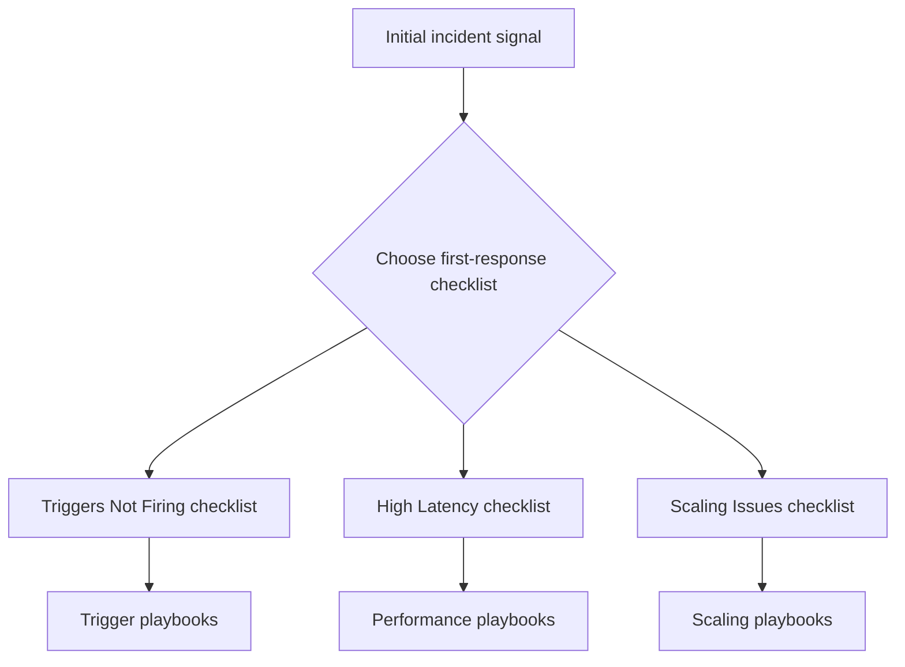

---
content_sources:
  - type: mslearn-adapted
    url: https://learn.microsoft.com/azure/azure-functions/functions-monitoring
  - type: mslearn-adapted
    url: https://learn.microsoft.com/azure/service-health/overview
---

# Checklists

Fast triage guides for the first 10 minutes of an Azure Functions investigation.

These checklists help you quickly narrow down the problem category and identify which playbook to follow for deeper analysis.

<!-- diagram-id: checklists -->

| Checklist | When to Use |
|---|---|
| [Triggers Not Firing](triggers-not-firing.md) | Functions not executing, zero invocations, trigger listener failures |
| [High Latency](high-latency.md) | Slow responses, elevated P95, timeout errors |
| [Scaling Issues](scaling-issues.md) | Queue backlog growing, executions flat, cold start spikes |

## Common first actions

Regardless of which checklist you follow, always start with these three checks:

1. **Azure Service Health** — Rule out regional platform issues
2. **Application Insights Live Metrics** — Confirm whether failures are active
3. **Recent deployments** — Check if anything changed in the incident window

## See Also

- [Playbooks](../playbooks/index.md)
- [KQL Query Library](../kql/index.md)
- [Methodology](../methodology/troubleshooting-method.md)

## Sources

- [Monitor Azure Functions](https://learn.microsoft.com/azure/azure-functions/functions-monitoring)
- [Azure Service Health overview](https://learn.microsoft.com/azure/service-health/overview)
