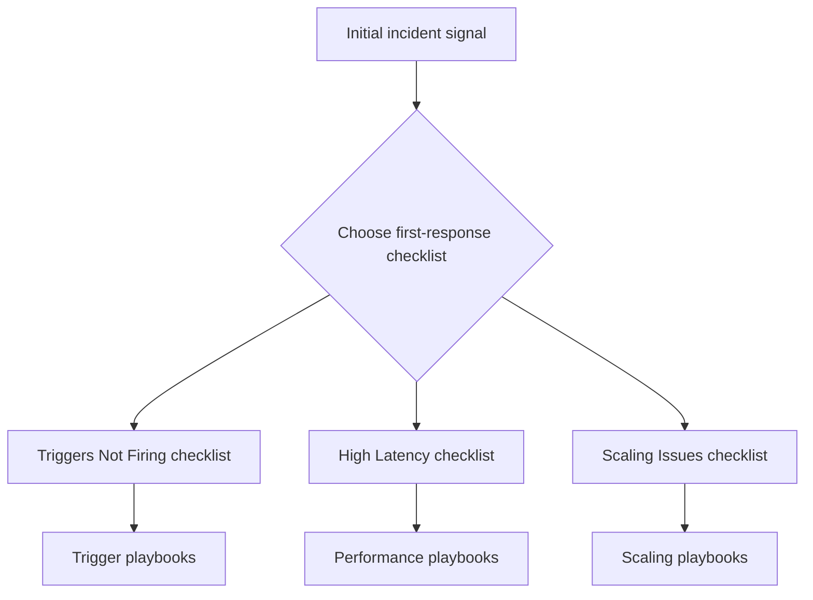
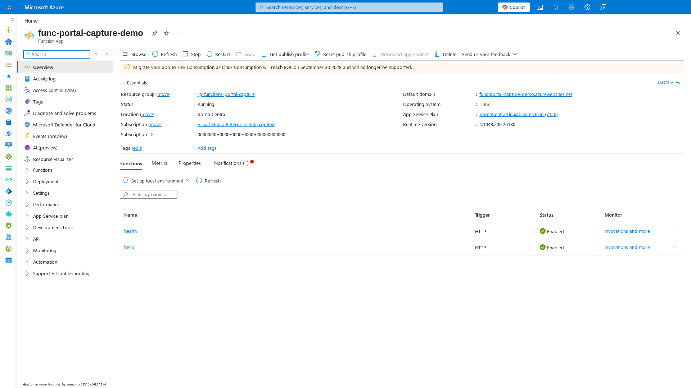
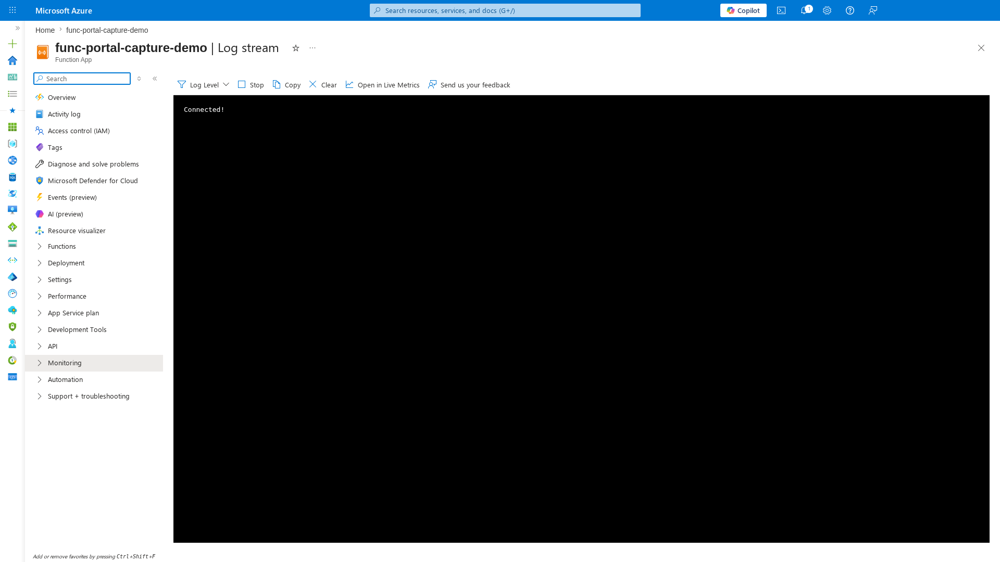
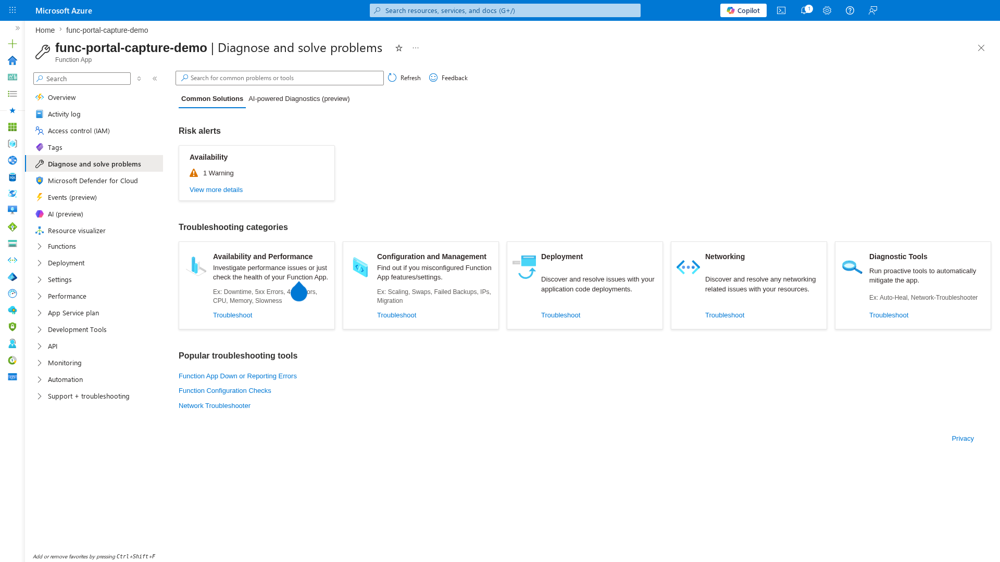

---
content_sources:

  references:
    - type: mslearn-adapted
      url: https://learn.microsoft.com/en-us/azure/azure-functions/functions-monitoring
    - type: mslearn-adapted
      url: https://learn.microsoft.com/en-us/azure/service-health/overview
  diagrams:
    - id: checklists
      type: graph
      source: self-generated
      justification: Flow view of checklists, synthesized from Microsoft Learn documentation cited on this page.
      based_on:
        - https://learn.microsoft.com/en-us/azure/azure-functions/functions-monitoring
        - https://learn.microsoft.com/en-us/azure/service-health/overview
---
# Checklists

Fast triage guides for the first 10 minutes of an Azure Functions investigation.

These checklists help you quickly narrow down the problem category and identify which playbook to follow for deeper analysis.

<!-- diagram-id: checklists -->

| Checklist | When to Use |
|---|---|
| [Triggers Not Firing](triggers-not-firing.md) | Functions not executing, zero invocations, trigger listener failures |
| [High Latency](high-latency.md) | Slow responses, elevated P95, timeout errors |
| [Scaling Issues](scaling-issues.md) | Queue backlog growing, executions flat, cold start spikes |

## Portal Walkthrough

Before diving into CLI and KQL, use these Portal blades to get a quick visual overview of the Function App state.

### Function App Overview

[Observed] The **Overview** blade shows the app status (**Running**), hosting plan (**KoreaCentralLinuxDynamicPlan (Y1: 0)**), runtime version (**4.1048.200.26180**), and the list of deployed functions with their trigger types and enabled status:

[Inferred] If the **Status** field shows anything other than `Running`, or if functions show `Disabled`, that is the first signal to investigate. The "Migrate your app to Flex Consumption" banner indicates this is a Linux Consumption plan approaching EOL.

### Log Stream

[Observed] The **Log stream** blade connects to the live output of the Function App host. The status **Connected!** confirms the host is running and reachable:

[Inferred] If Log stream fails to connect or shows no output for more than 30 seconds, the app may be scaled to zero (Consumption) or the host may be in a crash loop. Proceed to the [Triggers Not Firing](triggers-not-firing.md) checklist.

### Diagnose and Solve Problems

[Observed] The **Diagnose and solve problems** blade shows active risk alerts and categorized troubleshooting tools:

[Inferred] The **Availability: 1 Warning** alert is a quick indicator that the platform has detected an issue. Click **View more details** to see the specific detector findings before running manual KQL queries.

## Common first actions

Regardless of which checklist you follow, always start with these three checks:

1. **Azure Service Health** — Rule out regional platform issues
2. **Application Insights Live Metrics** — Confirm whether failures are active
3. **Recent deployments** — Check if anything changed in the incident window

## See Also

- [Playbooks](../playbooks/index.md)
- [KQL Query Library](../kql/index.md)
- [Methodology](../methodology/troubleshooting-method.md)

## Sources

- [Monitor Azure Functions](https://learn.microsoft.com/en-us/azure/azure-functions/functions-monitoring)
- [Azure Service Health overview](https://learn.microsoft.com/en-us/azure/service-health/overview)
