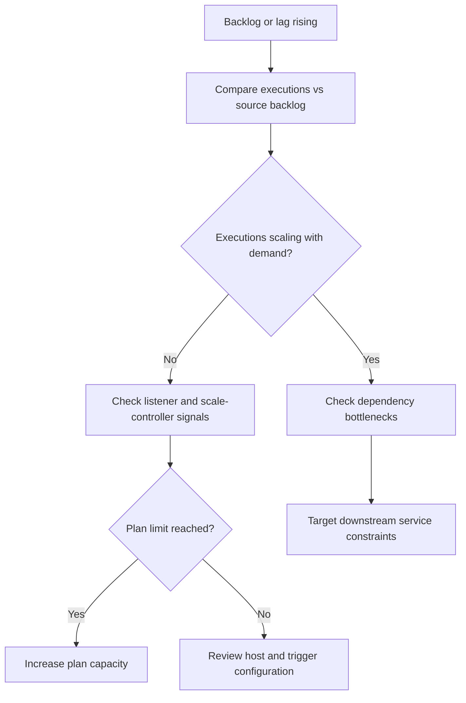

---
content_sources:
  - type: mslearn-adapted
    url: https://learn.microsoft.com/azure/azure-functions/functions-scale
  - type: mslearn-adapted
    url: https://learn.microsoft.com/azure/azure-functions/functions-host-json
  - type: mslearn-adapted
    url: https://learn.microsoft.com/azure/azure-functions/functions-monitoring
---

# First 10 Minutes: Scaling Issues

When queue backlogs grow, executions remain flat despite demand, or cold start spikes degrade throughput, use this checklist to narrow down the cause within the first 10 minutes.

## Prerequisites

- Azure CLI access to the production subscription.
- Access to Application Insights and Log Analytics.
- Health endpoint implemented at `GET /api/health`.

Set shared variables:

```bash
RG="rg-myapp-prod"
APP_NAME="func-myapp-prod"
PLAN_NAME="plan-myapp-prod"
SUBSCRIPTION_ID="<subscription-id>"
APP_INSIGHTS_NAME="appi-myapp-prod"
WORKSPACE_ID="xxxxxxxx-xxxx-xxxx-xxxx-xxxxxxxxxxxx"
STORAGE_NAME="stmyappprod"
```

<!-- diagram-id: prerequisites -->


## 1) Check Azure status and regional incidents

Rule out platform-wide scaling limitations.

### Check in Portal

Azure portal → **Service Health** → **Health advisories**.

Filter for the production region and services: Azure Functions, Storage, Azure Monitor.

### Check with Azure CLI

```bash
az account set --subscription "$SUBSCRIPTION_ID"
az rest --method get \
  --url "https://management.azure.com/subscriptions/$SUBSCRIPTION_ID/providers/Microsoft.ResourceHealth/events?api-version=2022-10-01&\$filter=eventType eq 'ServiceIssue' and status eq 'Active'"
```

### How to Read This

| Signal | Interpretation | Action |
|---|---|---|
| No active service issues | Scaling issue is app or config-level | Continue to Step 2 |
| Active incident on Functions or Storage | Platform constraint | Monitor advisory, document for post-mortem |

## 2) Check execution rate vs backlog

Determine whether scale-out is keeping pace with incoming demand.

### Check with Azure CLI

```bash
# Function execution metrics
az monitor metrics list \
  --resource "/subscriptions/$SUBSCRIPTION_ID/resourceGroups/$RG/providers/Microsoft.Web/sites/$APP_NAME" \
  --metric "FunctionExecutionCount" \
  --interval PT1M \
  --aggregation Total \
  --offset 30m \
  --output table

# Queue depth (if queue-triggered)
az monitor metrics list \
  --resource "/subscriptions/$SUBSCRIPTION_ID/resourceGroups/$RG/providers/Microsoft.Storage/storageAccounts/$STORAGE_NAME" \
  --metric "QueueMessageCount" \
  --interval PT1M \
  --aggregation Average \
  --offset 30m \
  --output table
```

### Example Output

```text
# Execution metrics - normal
MetricName               TimeGrain  Total
-----------------------  ---------  -------
FunctionExecutionCount   PT1M       156
FunctionExecutionCount   PT1M       162
FunctionExecutionCount   PT1M       148

# Execution metrics - scaling issue
MetricName               TimeGrain  Total
-----------------------  ---------  -------
FunctionExecutionCount   PT1M       12
FunctionExecutionCount   PT1M       8
FunctionExecutionCount   PT1M       5

# Queue depth - growing backlog
MetricName         TimeGrain  Average
-----------------  ---------  ---------
QueueMessageCount  PT1M       120
QueueMessageCount  PT1M       860
QueueMessageCount  PT1M       2140
```

!!! tip "FC1 Flex Consumption Metrics"
    Flex Consumption plans use `OnDemandFunctionExecutionCount` and `OnDemandFunctionExecutionUnits` instead of `FunctionExecutionCount`. If standard metrics return empty, use the FC1-specific metric names.

### How to Read This

| Pattern | Interpretation | Action |
|---|---|---|
| Queue depth stable + executions track demand | Normal drain behavior | No scaling issue |
| Queue depth up + executions flat | Scaling bottleneck or trigger stall | Check trigger listener and scale controller |
| Queue depth up + executions up but slow | Downstream dependency bottleneck | Check dependency health |
| Executions dropping to zero | Host or trigger failure | Check host logs immediately |

## 3) Check scale controller activity

The scale controller decides when to add or remove instances.

### Check with KQL

```kusto
let appName = "func-myapp-prod";
traces
| where timestamp > ago(1h)
| where cloud_RoleName =~ appName
| where message has_any ("scale", "instance", "worker", "concurrency", "drain", "Scaling out", "New instance")
| project timestamp, severityLevel, message
| order by timestamp desc
```

### Example Output

```text
# Normal scaling
timestamp                    message
---------------------------  ----------------------------------------------
2026-04-04T11:32:20Z         Worker process started and initialized.
2026-04-04T11:31:50Z         Worker process started and initialized.
2026-04-04T11:31:20Z         Scaling out to 4 instances.

# Problematic - drain loop
timestamp                    message
---------------------------  ----------------------------------------------
2026-04-04T11:32:20Z         Drain mode enabled.
2026-04-04T11:31:50Z         Worker process started and initialized.
2026-04-04T11:31:20Z         Drain mode enabled.
2026-04-04T11:30:50Z         Worker process started and initialized.
```

### How to Read This

| Pattern | Interpretation | Action |
|---|---|---|
| `Scaling out` followed by stable workers | Normal scale behavior | No action |
| Repeated `Drain mode` + restarts | Unstable workers, crash loop | Check application errors and memory |
| No scale messages despite backlog | Scale controller not triggering | Check trigger connection and host.json |
| Scale events present but latency high | Not enough instances for demand | Check plan limits |

## 4) Check plan limits

Each hosting plan has maximum instance limits that cap scale-out.

### Plan instance limits

| Plan | Max Instances (Default) | Max Instances (Configurable) |
|---|---|---|
| Consumption (Y1) | 200 | — |
| Flex Consumption (FC1) | 100 | Up to 1000 |
| Premium EP1 | 20 | Up to 100 |
| Premium EP2 | 20 | Up to 100 |
| Premium EP3 | 20 | Up to 100 |
| Dedicated | Depends on plan SKU | Manual scaling |

### Check with Azure CLI

```bash
# Check current plan and configuration
az functionapp show \
  --name "$APP_NAME" \
  --resource-group "$RG" \
  --query "{plan:appServicePlanId, state:state, maxWorkers:siteConfig.numberOfWorkers}" \
  --output table

# Check Premium plan scale limits
az functionapp plan show \
  --name "$PLAN_NAME" \
  --resource-group "$RG" \
  --query "{sku:sku.name, maximumElasticWorkerCount:maximumElasticWorkerCount, numberOfWorkers:numberOfWorkers}" \
  --output table
```

### How to Read This

| Signal | Interpretation | Action |
|---|---|---|
| Current instances at max limit | Plan ceiling reached | Increase `maximumElasticWorkerCount` or upgrade plan |
| Current instances well below max | Scale controller not requesting more | Check trigger config and host.json batching |
| `maximumElasticWorkerCount` = 1 | Scale-out effectively disabled | Set appropriate max worker count |

## 5) Check host.json concurrency settings

Misconfigured concurrency can bottleneck throughput even with many instances.

### Key host.json settings

```json
{
  "extensions": {
    "queues": {
      "batchSize": 16,
      "newBatchThreshold": 8,
      "maxDequeueCount": 5,
      "visibilityTimeout": "00:00:30"
    },
    "serviceBus": {
      "maxConcurrentCalls": 16,
      "maxConcurrentSessions": 8
    },
    "eventHubs": {
      "maxEventBatchSize": 100,
      "prefetchCount": 300
    }
  }
}
```

### Check with Azure CLI

```bash
# Inspect general app and runtime site configuration
az functionapp config show \
  --name "$APP_NAME" \
  --resource-group "$RG" \
  --output json

# host.json is not exposed by az functionapp config show.
# Inspect host.json in the deployed package or via Kudu/SCM (site/wwwroot/host.json).
```

### How to Read This

| Setting | Too Low | Recommended | Too High |
|---|---|---|---|
| `queues.batchSize` | 1 (serial processing) | 16 (default) | 32+ (may cause OOM) |
| `serviceBus.maxConcurrentCalls` | 1 | 16 | 64+ (check dependencies) |
| `eventHubs.maxEventBatchSize` | 1 | 100 | 1000+ (check processing time) |

## 6) Check recent deployments and configuration changes

```bash
az monitor activity-log list \
  --resource-group "$RG" \
  --offset 2h \
  --status Succeeded \
  --output table
```

Correlate configuration changes (especially host.json, concurrency settings) with scaling behavior changes.

## Fast routing after triage

| What you see | Likely area | Next action |
|---|---|---|
| Backlog growing, executions flat | Trigger/listener failure | Use [Functions Not Executing](../playbooks/functions-not-executing.md) playbook |
| At plan instance limit | Capacity ceiling | Increase limit or upgrade plan |
| Host.json concurrency too low | Configuration | Tune batch size and concurrency settings |
| Workers crashing and restarting | Stability | Use [Out of Memory](../playbooks/scaling/out-of-memory-worker-crash.md) playbook |
| Queue depth rising with slow processing | Downstream bottleneck | Use [High Latency](high-latency.md) checklist |

## See Also

- [Triggers Not Firing Checklist](triggers-not-firing.md)
- [High Latency Checklist](high-latency.md)
- [Playbooks](../playbooks/index.md)
- [KQL Query Library](../kql/index.md)

## Sources

- [Azure Functions scale and hosting](https://learn.microsoft.com/azure/azure-functions/functions-scale)
- [Azure Functions host.json reference](https://learn.microsoft.com/azure/azure-functions/functions-host-json)
- [Monitor Azure Functions](https://learn.microsoft.com/azure/azure-functions/functions-monitoring)
