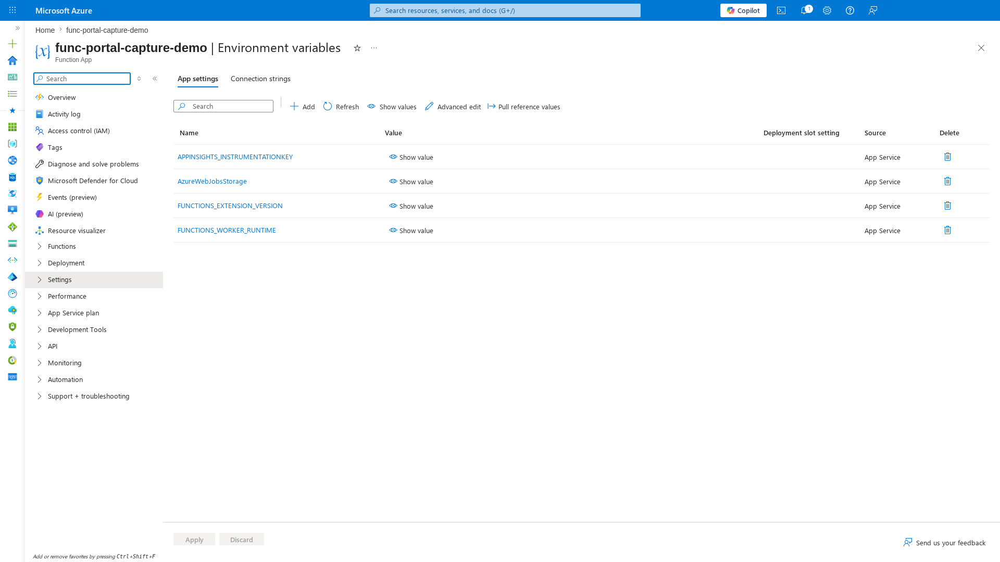
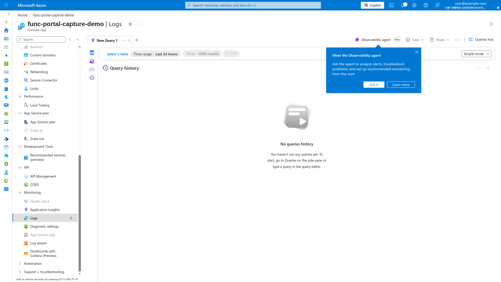
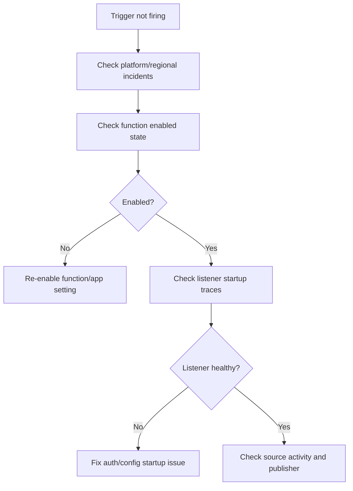

---
content_sources:
  references:
    - type: mslearn-adapted
      url: https://learn.microsoft.com/en-us/azure/azure-functions/functions-monitoring
    - type: mslearn-adapted
      url: https://learn.microsoft.com/en-us/azure/azure-functions/functions-triggers-bindings
    - type: mslearn-adapted
      url: https://learn.microsoft.com/en-us/azure/azure-functions/functions-diagnostics
content_validation:
  status: verified
  last_reviewed: 2026-04-12
  reviewer: agent
  core_claims:
    - claim: "First 10 Minutes: Triggers Not Firing 관련 핵심 진단 절차와 운영 판단 기준"
      source: https://learn.microsoft.com/en-us/azure/azure-functions/functions-monitoring
      verified: true
---

# First 10 Minutes: Triggers Not Firing

When functions are not executing despite active trigger sources, use this checklist to narrow down the cause within the first 10 minutes.

## Portal Walkthrough

These portal blades help diagnose triggers not firing. All captures from a Consumption (Y1) Function App with PII masked.

### Log Stream

[Observed] The **Log stream** blade shows real-time host startup and trigger listener initialization. Look for binding errors or missing connection warnings:


### Diagnose and Solve Problems

[Observed] The **Diagnose and solve problems** blade provides automated detection of trigger and execution issues:


### Environment Variables

[Observed] The **Environment variables** blade shows connection strings and trigger configuration. Missing or incorrect values here are the most common cause of triggers not firing:



### Logs (KQL Query Editor)

[Observed] The **Logs** blade provides direct KQL access to `FunctionAppLogs` and `traces` tables for diagnosing trigger listener failures:



## Prerequisites

- Azure CLI access to the production subscription.
- Access to Application Insights and Log Analytics.
- Health endpoint implemented at `GET /api/health`.

Set shared variables:

```bash
RG="rg-myapp-prod"
APP_NAME="func-myapp-prod"
SUBSCRIPTION_ID="<subscription-id>"
APP_INSIGHTS_NAME="appi-myapp-prod"
WORKSPACE_ID="xxxxxxxx-xxxx-xxxx-xxxx-xxxxxxxxxxxx"
STORAGE_NAME="stmyappprod"
EH_NAMESPACE="evh-myapp-prod"
```

<!-- diagram-id: prerequisites -->


## 1) Check Azure status and regional incidents

Rule out platform-wide issues first.

### Check in Portal

Azure portal → **Service Health** → **Health advisories**.

Filter for the production region and services: Azure Functions, Storage, Azure Monitor.

### Check with Azure CLI

```bash
az account set --subscription "$SUBSCRIPTION_ID"
az monitor activity-log list \
  --subscription "$SUBSCRIPTION_ID" \
  --resource-group "$RG" \
  --offset 1h \
  --max-events 20 \
  --output table

az rest --method get \
  --url "https://management.azure.com/subscriptions/$SUBSCRIPTION_ID/providers/Microsoft.ResourceHealth/events?api-version=2022-10-01&\$filter=eventType eq 'ServiceIssue' and status eq 'Active'"
```

| CLI element | Explanation |
|---|---|
| Command(s) | `az account set`, `az monitor activity-log list`, `az rest` |
| Key flags | `--subscription`, `--resource-group`, `--offset`, `--max-events`, `--output`, `--method`, `--url` |
| Variables | `$SUBSCRIPTION_ID`, `$RG`, `$filter` |
| Expected result | Azure CLI applies the configuration change; confirm the returned JSON or follow-up query shows the expected value. |


### How to Read This

| Signal | Interpretation | Action |
|---|---|---|
| No platform-originated events | Likely app/dependency/local change | Continue to Step 2 |
| `Microsoft.Web/sites/Restarted` + `Cause=Platform` | Platform event, not app deploy | Track Service Health advisory |
| Multiple infrastructure operations in same window | Possible platform turbulence | Correlate with regional advisories |

## 2) Check function enabled state

The most common (and most overlooked) cause of zero invocations is a disabled function.

### Check with Azure CLI

```bash
az functionapp function list \
  --name "$APP_NAME" \
  --resource-group "$RG" \
  --output table

az functionapp config appsettings list \
  --name "$APP_NAME" \
  --resource-group "$RG" \
  --query "[?contains(name, 'AzureWebJobs') || contains(name, 'DISABLE')]" \
  --output table
```

| CLI element | Explanation |
|---|---|
| Command(s) | `az functionapp function list`, `az functionapp config appsettings list` |
| Key flags | `--name`, `--resource-group`, `--output`, `--query` |
| Variables | `$APP_NAME`, `$RG` |
| Expected result | Azure CLI applies the configuration change; confirm the returned JSON or follow-up query shows the expected value. |


### Example Output

```text
Name             Trigger    IsDisabled
---------------  ---------  ----------
QueueProcessor   queue      true
health           http       false

Name                                 Value
-----------------------------------  ----------
AzureWebJobs.QueueProcessor.Disabled true
```

### How to Read This

| Signal | Interpretation | Action |
|---|---|---|
| `IsDisabled = true` | Function explicitly disabled | Remove disable setting and restart |
| `AzureWebJobs.<FunctionName>.Disabled = true` | App setting disabling function | Delete the app setting |
| All functions enabled | Cause is not disable state | Continue to Step 3 |

## 3) Check trigger listener health

Verify that trigger listeners started successfully after the most recent host startup.

### Check with KQL

```kusto
let appName = "func-myapp-prod";
traces
| where timestamp > ago(30m)
| where cloud_RoleName =~ appName
| where message has_any ("listener", "Host started", "unable to start", "trigger", "Starting Host")
| project timestamp, severityLevel, message
| order by timestamp desc
```

### Example Output

```text
# Healthy
timestamp                    message
---------------------------  ----------------------------------------------
2026-04-04T11:32:26Z         Host started (64ms)
2026-04-04T11:32:26Z         Job host started
2026-04-04T11:32:26Z         Listener started for function 'QueueProcessor'

# Unhealthy
timestamp                    message
---------------------------  ----------------------------------------------
2026-04-04T11:32:26Z         Starting Host (HostId=func-myapp-prod)
2026-04-04T11:32:46Z         Listener for function 'QueueProcessor' was unable to start
2026-04-04T11:32:46Z         The listener for function 'QueueProcessor' was unable to start. Azure.Storage: 403
```

### How to Read This

| Signal | Interpretation | Action |
|---|---|---|
| `Listener started` present | Trigger listener healthy | Check source-side activity |
| `unable to start` with 403 | Storage auth failure | Check managed identity and RBAC |
| No listener messages at all | Host may not have completed startup | Check host lifecycle logs |

## 4) Check trigger source activity

Confirm events are actually arriving at the trigger source.

### Check with Azure CLI

```bash
# Queue trigger: check queue message count
az monitor metrics list \
  --resource "/subscriptions/$SUBSCRIPTION_ID/resourceGroups/$RG/providers/Microsoft.Storage/storageAccounts/$STORAGE_NAME" \
  --metric "QueueMessageCount" \
  --interval PT1M \
  --aggregation Average \
  --offset 30m \
  --output table

# Event Hub trigger: check incoming messages
az monitor metrics list \
  --resource "/subscriptions/$SUBSCRIPTION_ID/resourceGroups/$RG/providers/Microsoft.EventHub/namespaces/$EH_NAMESPACE" \
  --metric "IncomingMessages" \
  --interval PT1M \
  --aggregation Total \
  --offset 30m \
  --output table
```

| CLI element | Explanation |
|---|---|
| Command(s) | `az monitor metrics list` |
| Key flags | `--resource`, `--metric`, `--interval`, `--aggregation`, `--offset`, `--output` |
| Variables | `$SUBSCRIPTION_ID`, `$RG`, `$STORAGE_NAME`, `$EH_NAMESPACE` |
| Expected result | Azure CLI returns the requested resource data; verify names, IDs, status fields, or metric values match the scenario. |


### How to Read This

| Signal | Interpretation | Action |
|---|---|---|
| Messages present in source | Source is active, function should be processing | Listener or host issue |
| Zero messages in source | No work to process | Investigate upstream publisher |
| Blob trigger with no Event Grid subscription | FC1 blob trigger requires Event Grid | Create Event Grid subscription |

## 5) Check recent deployments and configuration changes

```bash
az monitor activity-log list \
  --resource-group "$RG" \
  --offset 2h \
  --status Succeeded \
  --output table

az functionapp config appsettings list \
  --name "$APP_NAME" \
  --resource-group "$RG" \
  --output table
```

| CLI element | Explanation |
|---|---|
| Command(s) | `az monitor activity-log list`, `az functionapp config appsettings list` |
| Key flags | `--resource-group`, `--offset`, `--status`, `--output`, `--name` |
| Variables | `$RG`, `$APP_NAME` |
| Expected result | Azure CLI applies the configuration change; confirm the returned JSON or follow-up query shows the expected value. |


### How to Read This

| Signal | Interpretation | Action |
|---|---|---|
| Deploy/config change immediately before failure | High-confidence regression candidate | Prepare rollback |
| No change events in incident window | Runtime/dependency/platform cause | Continue deeper investigation |
| `FUNCTIONS_WORKER_RUNTIME` changed or missing | Function discovery will fail | Restore correct runtime value |

## Fast routing after triage

| What you see | Likely area | Next action |
|---|---|---|
| Function disabled | Configuration | Re-enable and verify |
| Listener failed to start | Auth/connection | Use [Managed Identity / RBAC Failure](../playbooks/auth-config/managed-identity-rbac-failure.md) playbook |
| Source has no events | Upstream publisher | Investigate publisher and subscription |
| Host not starting | Startup/config | Use [App Settings Misconfiguration](../playbooks/auth-config/app-settings-misconfiguration.md) playbook |
| Recent deploy correlates | Regression | Roll back, then follow [Methodology](../methodology/troubleshooting-method.md) |

## See Also

- [High Latency Checklist](high-latency.md)
- [Scaling Issues Checklist](scaling-issues.md)
- [Playbooks](../playbooks/index.md)
- [KQL Query Library](../kql/index.md)

## Sources

- [Monitor Azure Functions](https://learn.microsoft.com/en-us/azure/azure-functions/functions-monitoring)
- [Azure Functions triggers and bindings](https://learn.microsoft.com/en-us/azure/azure-functions/functions-triggers-bindings)
- [Azure Functions diagnostics](https://learn.microsoft.com/en-us/azure/azure-functions/functions-diagnostics)
