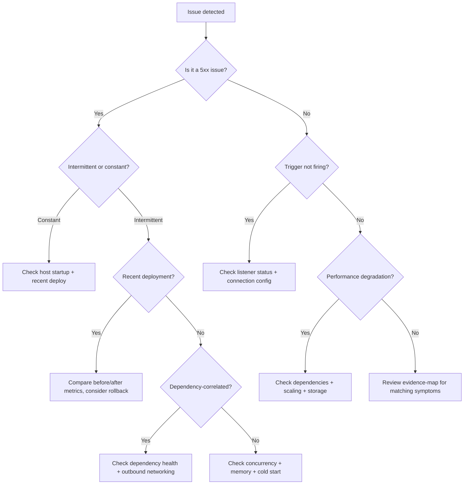

---
content_sources:
  - type: mslearn-adapted
    url: https://learn.microsoft.com/azure/azure-functions/
  - type: mslearn-adapted
    url: https://learn.microsoft.com/azure/azure-functions/functions-monitoring
  - type: mslearn-adapted
    url: https://learn.microsoft.com/azure/azure-functions/functions-monitoring#application-insights
  - type: mslearn-adapted
    url: https://learn.microsoft.com/azure/azure-functions/functions-scale
  - type: mslearn-adapted
    url: https://learn.microsoft.com/azure/azure-functions/functions-recover-from-failed-host
  - type: mslearn-adapted
    url: https://learn.microsoft.com/azure/azure-functions/configure-monitoring
---

# Troubleshooting

Use this section when Azure Functions workloads are degraded, failing, or behaving unexpectedly.
It is designed for incident response first, then root-cause analysis and prevention.

!!! tip "Operations Guide"
    For monitoring setup and alert configuration, see [Monitoring](../operations/monitoring.md) and [Alerts](../operations/alerts.md).

## What this section covers

- [First 10 Minutes](first-10-minutes.md): incident triage checklist for rapid stabilization.
- [Decision Tree](decision-tree.md): visual routing from symptom to investigation path.
- [Mental Model](mental-model.md): conceptual framework for Azure Functions troubleshooting.
- [Playbooks](playbooks.md): scenario runbooks with symptoms, diagnosis, and fixes.
- [Methodology](methodology.md): repeatable troubleshooting workflow for complex incidents.
- [KQL Query Library](kql.md): ready-to-use Application Insights and Log Analytics queries.
- [Lab Guides](lab-guides.md): hands-on failure simulations to practice response.

## Suggested incident flow

1. Start with [First 10 Minutes](first-10-minutes.md) to verify platform health and blast radius.
2. Move to [Playbooks](playbooks.md) for scenario-specific diagnosis paths.
3. Use [KQL Query Library](kql.md) to validate hypotheses with telemetry.
4. Apply [Methodology](methodology.md) to avoid guesswork and reduce MTTR.
5. Rehearse with [Lab Guides](lab-guides.md) to improve operational readiness.

## Troubleshooting mental model

Use this classification first to narrow where to collect evidence.

| Category | Examples | First Check | Typical Evidence |
|---|---|---|---|
| Request path issue | 5xx, timeout, 403, connection refused | `requests` + `exceptions` tables | HTTP status codes, error types |
| App startup issue | Host not starting, container ping failure, health check timeout | `traces` table (host lifecycle) | `Host started` missing, startup duration |
| Runtime degradation | Memory pressure, GIL contention, thread pool starvation | `customMetrics`, process metrics | CPU/memory trends, cold start frequency |
| Dependency / outbound issue | DNS failure, SNAT exhaustion, private endpoint unreachable | `dependencies` table | Failed dependency calls, target resolution |
| Deployment / recycle event | Post-deploy failures, slot swap issues, config drift | Activity Log, `traces` | Deploy events, host restart events |

!!! note "About customMetrics"
    The `customMetrics` table contains metrics explicitly emitted by your application or SDK. Only a few metrics (for example, `FunctionExecutionCount`, `FunctionExecutionUnits`) are emitted automatically by the Azure Functions runtime. Queue-related metrics and custom business metrics require explicit instrumentation.

## Decision tree

<!-- diagram-id: decision-tree -->

## Representative log patterns (quick reference)

| Pattern | Indicates | Severity | Next Action |
|---|---|---|---|
| `Container didn't respond to HTTP pings` | Host startup failure | Critical | Check host logs and recent deploy activity |
| `Storage operation failed: (403) Forbidden` | Storage auth broken | Critical | Check managed identity assignments and RBAC scope |
| `Host started (>10000ms)` | Severe cold start | Warning | Check dependency initialization path and hosting plan |
| `Message has been dequeued 'N' time(s)` | Poison message loop | Warning | Check handler idempotency and `maxDequeueCount` |
| `getaddrinfo ENOTFOUND` | DNS resolution failure | Critical | Check VNet integration and private DNS zones |

## Quick investigation flow

- For architecture context, see [Troubleshooting Architecture](architecture.md).
- For "where do I look first?", see [Evidence Map](evidence-map.md).
- For fast triage sequence, start at [First 10 Minutes](first-10-minutes.md).

## Updated section map

| Document | Coverage |
|---|---|
| [First 10 Minutes](first-10-minutes.md) | Time-boxed triage checks for active incidents |
| [Decision Tree](decision-tree.md) | Visual routing from symptom to investigation path |
| [Mental Model](mental-model.md) | Conceptual framework for Azure Functions troubleshooting |
| [Playbooks](playbooks.md) | Scenario-based diagnostics and mitigations |
| [Methodology](methodology.md) | Reproducible Observe → Hypothesize → Test → Fix → Verify workflow |
| [KQL Query Library](kql.md) | Reusable telemetry and evidence queries |
| [Troubleshooting Architecture](architecture.md) | Component boundaries and failure-domain context |
| [Evidence Map](evidence-map.md) | Symptom-to-evidence lookup for first-query selection |
| [Lab Guides](lab-guides.md) | Failure drills for response readiness |

## Scope and source policy

- Guidance in this section follows Microsoft Learn documentation for Azure Functions, App Service, Application Insights, and Azure Monitor.
- Product behavior, limits, and trigger specifics should always be validated against the linked Learn references.
- Examples use masked identifiers (`<subscription-id>`, `xxxxxxxx-xxxx-xxxx-xxxx-xxxxxxxxxxxx`) to avoid exposing PII.

## See Also

- [First 10 Minutes](first-10-minutes.md)
- [Playbooks](playbooks.md)
- [Methodology](methodology.md)
- [KQL Query Library](kql.md)

## Sources

- [Azure Functions documentation](https://learn.microsoft.com/azure/azure-functions/)
- [Azure Functions diagnostics](https://learn.microsoft.com/azure/azure-functions/functions-monitoring)
- [Application Insights for Azure Functions](https://learn.microsoft.com/azure/azure-functions/functions-monitoring#application-insights)
- [Scale and hosting options](https://learn.microsoft.com/azure/azure-functions/functions-scale)
- [Monitor Azure Functions](https://learn.microsoft.com/azure/azure-functions/functions-monitoring)
- [Troubleshoot Azure Functions](https://learn.microsoft.com/azure/azure-functions/functions-recover-from-failed-host)
- [Application Insights for Azure Functions](https://learn.microsoft.com/azure/azure-functions/configure-monitoring)
