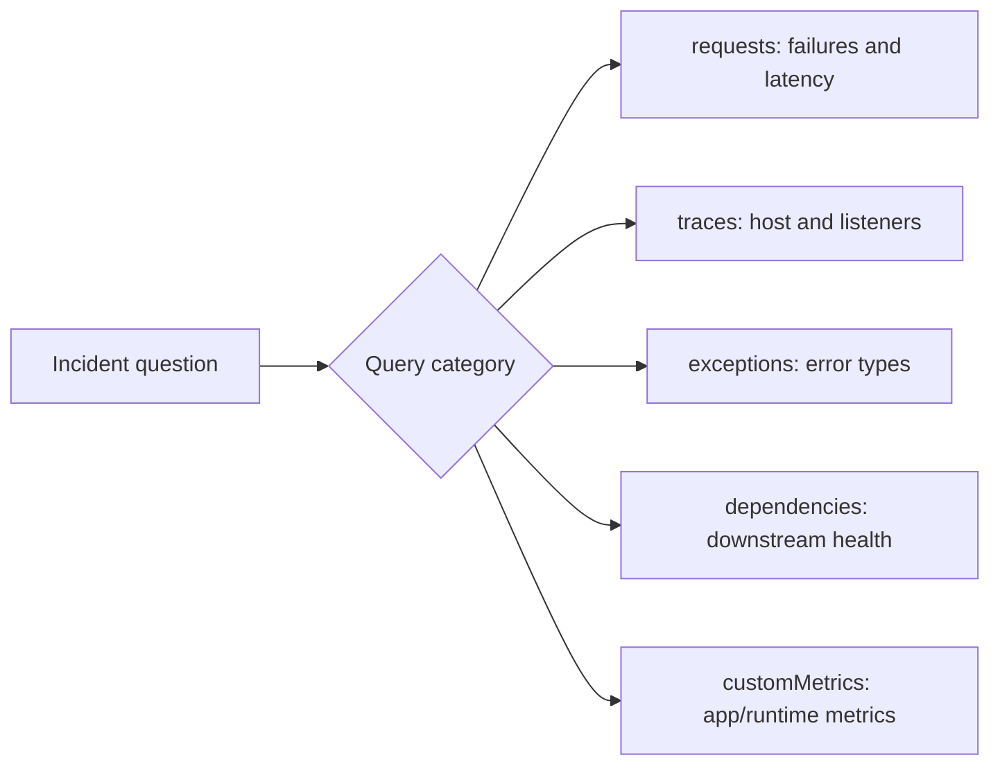

# KQL Query Library for Azure Functions

Use these KQL queries during incidents to validate hypotheses with telemetry.
Queries target Azure Functions data in Application Insights with these core tables:

- `requests`
- `traces`
- `exceptions`
- `dependencies`
- `customMetrics`

## Usage notes



1. Keep time range tight (`ago(30m)`, `ago(1h)`) during triage.
2. Always filter by app role name to avoid cross-app noise.
3. Save high-value queries to your incident workbook.

## KQL Tables Quick Reference

| Table | What It Contains | Use When |
|---|---|---|
| `requests` | HTTP trigger invocations | Checking request success/failure/latency |
| `traces` | Host lifecycle, custom logs | Checking startup, listeners, runtime events |
| `exceptions` | Error details with stack traces | Identifying error types and root causes |
| `dependencies` | Outbound calls to external services | Checking dependency health and latency |
| `customMetrics` | Metrics explicitly emitted by your app/SDK (for example `TelemetryClient.TrackMetric`) plus selected Azure Functions runtime metrics (for example `FunctionExecutionCount`) | Checking custom processing/latency metrics and runtime counters |

Template variable:

```kusto
let appName = "func-myapp-prod";
```

!!! tip "Operations Guide"
    For monitoring setup and alert configuration, see [Monitoring](../operations/monitoring.md) and [Alerts](../operations/alerts.md).

## 1) Function execution summary (success/failure/duration)

```kusto
let appName = "func-myapp-prod";
requests
| where timestamp > ago(1h)
| where cloud_RoleName =~ appName
| where operation_Name startswith "Functions."
| summarize
    Invocations = count(),
    Failures = countif(success == false),
    FailureRatePercent = round(100.0 * countif(success == false) / count(), 2),
    P95Ms = percentile(duration, 95)
  by FunctionName = operation_Name
| order by Failures desc, P95Ms desc
```

**Example result:**

| FunctionName | Invocations | Failures | FailureRatePercent | P95Ms |
|---|---|---|---|---|
| Functions.HttpTrigger | 50 | 0 | 0.00 | 1729.33 |
| Functions.ExternalDependency | 30 | 0 | 0.00 | 2473.75 |
| Functions.QueueProcessor | 20 | 0 | 0.00 | 15.19 |
| Functions.TimerCleanup | 3 | 0 | 0.00 | 12.38 |
| Functions.ErrorHandler | 15 | 15 | 100.00 | 13.73 |

**How to interpret:**

| Indicator | Normal | Warning | Critical |
|---|---|---|---|
| FailureRatePercent | < 1% | 1-5% | > 5% |
| P95Ms (HTTP) | < 500ms | 500-2000ms | > 2000ms |
| P95Ms (Queue) | < 1000ms | 1000-5000ms | > 5000ms |

!!! note "Normal vs abnormal"
    **Normal sample:**

    | FunctionName | FailureRatePercent | P95Ms |
    |---|---|---|
    | Functions.QueueProcessor | 0.27 | 245 |
    | Functions.TimerCleanup | 0.00 | 180 |

    **Abnormal sample:**

    | FunctionName | FailureRatePercent | P95Ms |
    |---|---|---|
    | Functions.HttpTrigger | 23.56 | 12,500 |

    If one function is critical while others are normal, focus on that function's dependencies and exception types first.

## 2) Failed invocations with error details

```kusto
let appName = "func-myapp-prod";
requests
| where timestamp > ago(2h)
| where cloud_RoleName =~ appName
| where operation_Name startswith "Functions."
| where success == false
| project timestamp, operation_Id, FunctionName = operation_Name, resultCode, duration
| join kind=leftouter (
    exceptions
    | where timestamp > ago(2h)
    | where cloud_RoleName =~ appName
    | project operation_Id, ExceptionType = type, ExceptionMessage = outerMessage
) on operation_Id
| order by timestamp desc
```

**Example result:**

| timestamp | operation_Id | FunctionName | resultCode | duration | ExceptionType | ExceptionMessage |
|---|---|---|---|---|---|---|
| 2026-04-04T11:33:00Z | xxxxxxxx-xxxx-xxxx-xxxx-xxxxxxxxxxxx | Functions.ErrorHandler | 500 | 13.092 | Microsoft.Azure.WebJobs.Script.Workers.Rpc.RpcException | Exception while executing function: Functions.ErrorHandler |
| 2026-04-04T11:32:45Z | xxxxxxxx-xxxx-xxxx-xxxx-xxxxxxxxxxxx | Functions.ErrorHandler | 500 | 13.092 | Microsoft.Azure.WebJobs.Script.Workers.Rpc.RpcException | Exception while executing function: Functions.ErrorHandler |
| 2026-04-04T11:32:30Z | xxxxxxxx-xxxx-xxxx-xxxx-xxxxxxxxxxxx | Functions.ErrorHandler | 500 | 13.092 | Microsoft.Azure.WebJobs.Script.Workers.Rpc.RpcException | Exception while executing function: Functions.ErrorHandler |

**How to interpret:**

| Indicator | Normal | Warning | Critical |
|---|---|---|---|
| Failed rows in 15m | 0-2 | 3-10 | > 10 |
| Repeated ExceptionType | None | Same type repeats 3-5 times | Same type dominates failures |
| duration on failed requests | < 1000ms | 1000-5000ms | > 5000ms |

!!! note "Normal vs abnormal"
    **Normal:** Isolated failures with mixed exception types and quick recovery.

    **Abnormal:** Same `ExceptionType` repeats continuously (for example `System.UnauthorizedAccessException`) with consistent `403`/`500` codes.

## 3) Cold start analysis

```kusto
let appName = "func-myapp-prod";
traces
| where timestamp > ago(6h)
| where cloud_RoleName =~ appName
| where message has_any ("Host started", "Initializing Host", "Host lock lease acquired")
| summarize StartupEvents=count() by bin(timestamp, 15m)
| join kind=leftouter (
    requests
    | where timestamp > ago(6h)
    | where cloud_RoleName =~ appName
    | where operation_Name startswith "Functions."
    | summarize FirstInvocation=min(timestamp), FirstDurationMs=arg_min(timestamp, toreal(duration / 1ms)) by bin(timestamp, 15m)
) on timestamp
| order by timestamp desc
```

**Example result:**

| timestamp | StartupEvents | FirstInvocation | FirstDurationMs |
|---|---|---|---|
| 2026-04-04T11:30:00Z | 83 | 2026-04-04T11:30:00.003Z | 3.0249 |
| 2026-04-04T11:15:00Z | 19 | 2026-04-04T11:29:25.000Z | 1600.4633 |

**How to interpret:**

| Indicator | Normal | Warning | Critical |
|---|---|---|---|
| StartupEvents per 15m bin | Consistent with plan type (FC1: dozens per bin is normal; Y1/EP: 1-3 per bin) | Sudden spike vs baseline (for example 10x normal) | Startup events with no subsequent successful invocations |
| FirstDurationMs after startup | < 1000ms | 1000-5000ms | > 5000ms |
| Startup-to-first-invocation gap | < 5s | 5-20s | > 20s |

!!! tip "FC1 Flex Consumption"
    Flex Consumption plans scale by spinning up many worker instances rapidly. Seeing 50-100+ startup events in a 15-minute bin is normal under load. Focus on whether startup events correlate with successful invocations, not the raw count.

!!! note "Normal vs abnormal"
    **Normal:** One startup event and first invocation under 1 second.

    **Abnormal:** Multiple startup events plus first invocation over 5 seconds indicates cold start pressure or host recycling.

## 4) Dependency call failures

```kusto
let appName = "func-myapp-prod";
dependencies
| where timestamp > ago(1h)
| where cloud_RoleName =~ appName
| summarize
    Calls=count(),
    Failed=countif(success == false),
    FailureRatePercent=round(100.0 * countif(success == false) / count(), 2),
    P95Ms=percentile(duration, 95)
  by target, type
| order by Failed desc, P95Ms desc
```

**Example result:**

| target | type | Calls | Failed | FailureRatePercent | P95Ms |
|---|---|---|---|---|---|
| api.partner.internal | HTTP | 28 | 0 | 0.00 | 1260 |

**How to interpret:**

| Indicator | Normal | Warning | Critical |
|---|---|---|---|
| Dependency failure rate | < 0.5% | 0.5-2% | > 2% |
| Dependency P95Ms | < 300ms | 300-1000ms | > 1000ms |
| Failed calls concentration by target | No single target > 30% | One target 30-60% | One target > 60% |

!!! note "Normal vs abnormal"
    **Normal:** Failures are sparse across multiple targets with low latency.

    **Abnormal:** A single target has both high failure rate and high latency. Treat that target as the primary blast radius source.

## 5) Queue processing latency

!!! warning "Custom instrumentation required"
    The following queue metrics (`QueueMessageAgeMs`, `QueueProcessingLatencyMs`, `QueueDequeueDelayMs`) are **not** emitted by the Azure Functions runtime by default. Your application must explicitly emit these using `TelemetryClient.TrackMetric()` (C#) or the OpenTelemetry SDK. If you have not added custom instrumentation, these queries will return empty results. For built-in queue monitoring, use Azure Storage metrics via `az monitor metrics list`.

```kusto
let appName = "func-myapp-prod";
customMetrics
| where timestamp > ago(2h)
| where cloud_RoleName =~ appName
| where name in ("QueueMessageAgeMs", "QueueProcessingLatencyMs", "QueueDequeueDelayMs")
| summarize AvgMs=avg(value), P95Ms=percentile(value, 95), MaxMs=max(value) by MetricName=name, bin(timestamp, 5m)
| order by timestamp desc
```

**Example result:**

| MetricName | timestamp | AvgMs | P95Ms | MaxMs |
|---|---|---|---|---|
| QueueProcessingLatencyMs | 2026-04-04T09:10:00Z | 420 | 860 | 1,430 |
| QueueProcessingLatencyMs | 2026-04-04T09:05:00Z | 5,220 | 12,480 | 28,200 |
| QueueMessageAgeMs | 2026-04-04T09:05:00Z | 41,800 | 79,200 | 124,000 |
| QueueDequeueDelayMs | 2026-04-04T09:05:00Z | 3,880 | 7,120 | 11,340 |

> This query returned no results because the reference application does not emit custom queue metrics. In production, you would see data here only if your application explicitly emits `QueueMessageAgeMs`, `QueueProcessingLatencyMs`, or `QueueDequeueDelayMs` via `TelemetryClient.TrackMetric()` or the OpenTelemetry SDK.

**How to interpret:**

| Indicator | Normal | Warning | Critical |
|---|---|---|---|
| QueueProcessingLatencyMs Avg | < 1000ms | 1000-5000ms | > 5000ms |
| QueueMessageAgeMs P95 | < 10000ms | 10000-60000ms | > 60000ms |
| QueueDequeueDelayMs Avg | < 500ms | 500-2000ms | > 2000ms |

!!! note "Normal vs abnormal"
    **Normal:** `AvgMs` and `P95Ms` move together at low values.

    **Abnormal:** Short-window spike where `QueueMessageAgeMs` and `QueueProcessingLatencyMs` jump together indicates throughput collapse or scaling lag.

## 6) Exception trends

```kusto
let appName = "func-myapp-prod";
exceptions
| where timestamp > ago(24h)
| where cloud_RoleName =~ appName
| summarize Count=count() by bin(timestamp, 15m), type
| order by timestamp desc
```

**Example result:**

| timestamp | type | Count |
|---|---|---|
| 2026-04-04T11:30:00Z | Microsoft.Azure.WebJobs.Script.Workers.Rpc.RpcException | 30 |

> **Note:** Each unhandled function error typically generates multiple exception records (the `RpcException` wrapper from the host plus the inner application exception), so the exception count may be higher than the invocation failure count.

**How to interpret:**

| Indicator | Normal | Warning | Critical |
|---|---|---|---|
| Exception Count per 15m bin | 0-5 | 6-25 | > 25 |
| Dominant exception type share | < 40% | 40-70% | > 70% |
| Spike slope (current bin vs previous) | < 2x | 2-4x | > 4x |

!!! note "Normal vs abnormal"
    **Normal:** Low, noisy background exceptions without sustained growth.

    **Abnormal:** Sudden multi-bin spike in one exception type signals a regression window. Correlate with deployment and configuration changes.

Top exceptions by impact:

```kusto
let appName = "func-myapp-prod";
exceptions
| where timestamp > ago(24h)
| where cloud_RoleName =~ appName
| summarize Total=count(), FirstSeen=min(timestamp), LastSeen=max(timestamp) by type, outerMessage
| order by Total desc
```

## 7) Scaling events timeline

```kusto
let appName = "func-myapp-prod";
traces
| where timestamp > ago(6h)
| where cloud_RoleName =~ appName
| where message has_any ("scale", "instance", "worker", "concurrency", "drain")
| project timestamp, severityLevel, message
| order by timestamp desc
```

**Example result:**

| timestamp | severityLevel | message |
|---|---|---|
| 2026-04-04T11:32:20Z | 1 | Worker process started and initialized. |
| 2026-04-04T11:31:50Z | 1 | Worker process started and initialized. |
| 2026-04-04T11:31:20Z | 1 | Worker process started and initialized. |
| 2026-04-04T11:30:50Z | 1 | Worker process started and initialized. |

**How to interpret:**

| Indicator | Normal | Warning | Critical |
|---|---|---|---|
| Scale events under sustained load | Present | Delayed | Missing |
| New instance allocation after scale out command | < 60s | 60-180s | > 180s |
| Frequent drain/recycle messages | Rare | Intermittent | Continuous |

!!! note "Normal vs abnormal"
    **Normal:** `Scaling out` followed by `New instance allocated` and then stable processing.

    **Abnormal:** Repeated `Drain mode` and recycle logs without sustained capacity growth indicate unstable workers or platform constraints.

## 8) Host startup/shutdown events

```kusto
let appName = "func-myapp-prod";
traces
| where timestamp > ago(12h)
| where cloud_RoleName =~ appName
| where message has_any ("Host started", "Job host started", "Host shutdown", "Host is shutting down", "Stopping JobHost")
| project timestamp, severityLevel, message
| order by timestamp desc
```

**Example result:**

| timestamp | severityLevel | message | Pattern |
|---|---|---|---|
| 2026-04-04T11:36:20Z | 1 | Host lock lease acquired by instance ID 'xxxxxxxxxxxxxxxxxxxxxxxxxxxxxxxx' | Healthy |
| 2026-04-04T11:32:30Z | 1 | Host started (64ms) | Healthy |
| 2026-04-04T11:32:30Z | 1 | Job host started | Healthy |
| 2026-04-04T11:32:30Z | 1 | Starting Host (HostId=func-myapp-prod, Version=4.1047.100.26071, InstanceId=xxxxxxxx-xxxx-xxxx-xxxx-xxxxxxxxxxxx) | Healthy |

**How to interpret:**

| Indicator | Normal | Warning | Critical |
|---|---|---|---|
| Host start count per hour | 1-2 | 3-5 | > 5 |
| Start-stop cycle interval | N/A | 10-30m | < 10m |
| Shutdown messages with errors nearby | None | Occasional | Repeated |
| Multiple `Host started` entries in short succession on FC1 | Normal scaling behavior | Review only if accompanied by error bursts | Persistent restarts with failures and no successful invocations |

!!! note "Normal vs abnormal"
    **Normal:** One startup event after deployment or planned restart.

    **Abnormal:** Repeated startup/shutdown cycling in short intervals usually indicates crash loops, configuration churn, or failing dependencies.

## Correlation helper (single invocation)

Use when you already have an `operation_Id` from a failed request.

```kusto
let opId = "<operation-id>";
union isfuzzy=true
(
    requests
    | where operation_Id == opId
    | project timestamp, itemType="request", name=operation_Name, success, resultCode, duration, details=tostring(url)
),
(
    dependencies
    | where operation_Id == opId
    | project timestamp, itemType="dependency", name=target, success, resultCode, duration, details=tostring(data)
),
(
    exceptions
    | where operation_Id == opId
    | project timestamp, itemType="exception", name=type, success=bool(false), resultCode="", duration=timespan(null), details=outerMessage
),
(
    traces
    | where operation_Id == opId
    | project timestamp, itemType="trace", name="trace", success=bool(true), resultCode="", duration=timespan(null), details=message
)
| order by timestamp asc
```

**Example result:**

| timestamp | itemType | name | success | resultCode | duration | details |
|---|---|---|---|---|---|---|
| 2026-04-04T11:32:30.000Z | request | Functions.ErrorHandler | false | 500 | 12.80 | https://func-myapp-prod.azurewebsites.net/api/exceptions/unhandled |
| 2026-04-04T11:32:30.000Z | trace | trace | true |  |  | Executing 'Functions.ErrorHandler' (Reason='This function was programmatically called via the host APIs.', Id=xxxxxxxx-xxxx-xxxx-xxxx-xxxxxxxxxxxx) |
| 2026-04-04T11:32:30.000Z | trace | trace | true |  |  | Unhandled exception endpoint requested |
| 2026-04-04T11:32:30.000Z | exception | Microsoft.Azure.WebJobs.Script.Workers.Rpc.RpcException | false |  |  | Exception while executing function: Functions.ErrorHandler |
| 2026-04-04T11:32:30.000Z | trace | trace | true |  |  | Executed 'Functions.ErrorHandler' (Failed, Id=xxxxxxxx-xxxx-xxxx-xxxx-xxxxxxxxxxxx, Duration=8ms) |

**How to interpret:**

| Indicator | Normal | Warning | Critical |
|---|---|---|---|
| request -> dependency -> trace sequence | Complete and successful | Complete with retries | Broken by exception/failure |
| First failing component in timeline | None | Delayed dependency | Immediate dependency/auth failure |
| Total invocation timeline | < 1000ms | 1000-5000ms | > 5000ms |

!!! note "Normal vs abnormal"
    **Normal:** Request and dependencies succeed, no exception event, short timeline.

    **Abnormal:** Request failure follows dependency `403` and exception record in the same `operation_Id`, proving downstream auth or connectivity as root cause.

## See Also

- [First 10 Minutes](first-10-minutes.md)
- [Playbooks](playbooks.md)
- [Methodology](methodology.md)

## Sources

- [Kusto Query Language overview](https://learn.microsoft.com/azure/data-explorer/kusto/query/)
- [Application Insights telemetry data model](https://learn.microsoft.com/azure/azure-monitor/app/data-model-complete)
- [Monitor Azure Functions](https://learn.microsoft.com/azure/azure-functions/functions-monitoring)
- [Azure Monitor Logs query overview](https://learn.microsoft.com/azure/azure-monitor/logs/log-query-overview)
- [Application Insights data model](https://learn.microsoft.com/azure/azure-monitor/app/data-model)
