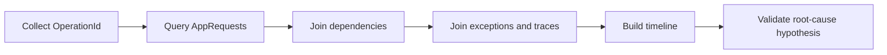

---
content_sources:
  - type: mslearn-adapted
    url: https://learn.microsoft.com/azure/azure-monitor/app/correlation
  - type: mslearn-adapted
    url: https://learn.microsoft.com/azure/azure-functions/functions-monitoring
---

# Correlation Queries

KQL queries for correlating signals across telemetry sources to connect symptoms to root causes.

<!-- diagram-id: correlation-queries -->


## Single invocation correlation

Use when you already have an `OperationId` from a failed request.

```kusto
let opId = "<operation-id>";
union isfuzzy=true
(
    AppRequests
    | where OperationId == opId
    | project TimeGenerated, itemType="request", name=OperationName, success, ResultCode, duration, details=tostring(url)
),
(
    AppDependencies
    | where OperationId == opId
    | project TimeGenerated, itemType="dependency", name=target, success, ResultCode, duration, details=tostring(data)
),
(
    AppExceptions
    | where OperationId == opId
    | project TimeGenerated, itemType="exception", name=type, success=bool(false), ResultCode="", duration=real(null), details=outerMessage
),
(
    AppTraces
    | where OperationId == opId
    | project TimeGenerated, itemType="trace", name="trace", success=bool(true), ResultCode="", duration=real(null), details=Message
)
| order by TimeGenerated asc
```

**Example result:**

| TimeGenerated | itemType | name | success | ResultCode | duration | details |
|---|---|---|---|---|---|---|
| 2026-04-04T11:32:30.000Z | request | Functions.ErrorHandler | false | 500 | 12.80 | https://func-myapp-prod.azurewebsites.net/api/exceptions/unhandled |
| 2026-04-04T11:32:30.000Z | trace | trace | true |  |  | Executing 'Functions.ErrorHandler' (Reason='This function was programmatically called via the host APIs.', Id=xxxxxxxx-xxxx-xxxx-xxxx-xxxxxxxxxxxx) |
| 2026-04-04T11:32:30.000Z | trace | trace | true |  |  | Unhandled exception endpoint requested |
| 2026-04-04T11:32:30.000Z | exception | Microsoft.Azure.WebJobs.Script.Workers.Rpc.RpcException | false |  |  | Exception while executing function: Functions.ErrorHandler |
| 2026-04-04T11:32:30.000Z | trace | trace | true |  |  | Executed 'Functions.ErrorHandler' (Failed, Id=xxxxxxxx-xxxx-xxxx-xxxx-xxxxxxxxxxxx, Duration=8ms) |

**How to interpret:**

| Indicator | Normal | Warning | Critical |
|---|---|---|---|
| request -> dependency -> trace sequence | Complete and successful | Complete with retries | Broken by exception/failure |
| First failing component in timeline | None | Delayed dependency | Immediate dependency/auth failure |
| Total invocation timeline | < 1000ms | 1000-5000ms | > 5000ms |

!!! note "Normal vs abnormal"
    **Normal:** Request and dependencies succeed, no exception event, short timeline.

    **Abnormal:** Request failure follows dependency `403` and exception record in the same `OperationId`, proving downstream auth or connectivity as root cause.

## Latency vs error correlation

Correlate rising latency with rising error rates to identify whether latency precedes errors (dependency bottleneck) or errors precede latency (retry storms).

```kusto
let appName = "func-myapp-prod";
AppRequests
| where TimeGenerated > ago(2h)
| where AppRoleName =~ appName
| where OperationName startswith "Functions."
| summarize
    P95Ms = round(percentile(duration, 95), 2),
    ErrorRate = round(100.0 * countif(success == false) / count(), 2),
    Invocations = count()
  by bin(TimeGenerated, 5m)
| order by TimeGenerated asc
```

**Example result:**

| TimeGenerated | P95Ms | ErrorRate | Invocations |
|---|---|---|---|
| 2026-04-04T10:00:00Z | 245 | 0.00 | 120 |
| 2026-04-04T10:05:00Z | 280 | 0.00 | 135 |
| 2026-04-04T10:10:00Z | 1250 | 0.50 | 142 |
| 2026-04-04T10:15:00Z | 3800 | 8.20 | 98 |
| 2026-04-04T10:20:00Z | 6200 | 22.40 | 64 |

**How to interpret:**

| Pattern | Meaning | Root Cause Direction |
|---|---|---|
| Latency rises before errors | Dependency slowdown causing timeouts | Investigate downstream dependencies |
| Errors rise before latency | Application failures causing retry storms | Investigate application exceptions |
| Both rise simultaneously | Capacity saturation | Investigate scaling and resource limits |
| Latency stable but errors spike | Application logic error (fast failures) | Investigate code changes and config |

!!! tip "How to Read This"
    Plot `P95Ms` and `ErrorRate` on the same timeline. If latency climbs 2-3 bins before errors appear, the root cause is almost always a dependency bottleneck. If errors appear first, look at application code or configuration changes.

## Restarts vs latency correlation

Correlate host restart events with latency spikes to identify whether restarts cause cold start latency or are caused by unhealthy state.

```kusto
let appName = "func-myapp-prod";
let restarts = AppTraces
| where TimeGenerated > ago(6h)
| where AppRoleName =~ appName
| where Message has "Host started"
| summarize RestartCount = count() by bin(TimeGenerated, 5m);
let latency = AppRequests
| where TimeGenerated > ago(6h)
| where AppRoleName =~ appName
| where OperationName startswith "Functions."
| summarize P95Ms = round(percentile(duration, 95), 2), Invocations = count() by bin(TimeGenerated, 5m);
restarts
| join kind=fullouter latency on TimeGenerated
| project TimeGenerated = coalesce(TimeGenerated, TimeGenerated1), RestartCount = coalesce(RestartCount, 0), P95Ms = coalesce(P95Ms, 0.0), Invocations = coalesce(Invocations, 0)
| order by TimeGenerated asc
```

**How to interpret:**

| Pattern | Meaning |
|---|---|
| Restart → latency spike → recovery | Normal cold start behavior |
| Latency spike → restart | Unhealthy state caused restart (OOM, timeout) |
| Repeated restart + sustained high latency | Crash loop — investigate host logs |
| Restart with no latency change | Graceful restart or scale event |

## See Also

- [Execution Queries](../execution/index.md)
- [Scaling Queries](../scaling/index.md)
- [Dependency Queries](../dependencies/index.md)
- [KQL Query Library](../index.md)

## Sources

- [Application Insights telemetry correlation](https://learn.microsoft.com/azure/azure-monitor/app/correlation)
- [Monitor Azure Functions](https://learn.microsoft.com/azure/azure-functions/functions-monitoring)
