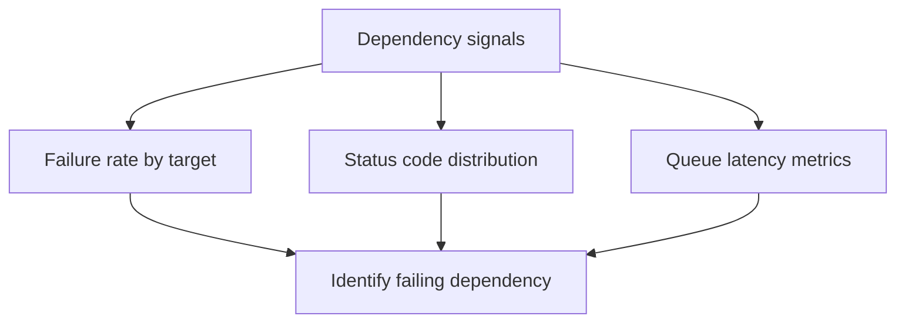

# Dependency Queries

KQL queries for analyzing outbound dependency failures and queue processing latency.



## Dependency call failures

```kusto
let appName = "func-myapp-prod";
AppDependencies
| where TimeGenerated > ago(1h)
| where AppRoleName =~ appName
| summarize
    Calls=count(),
    Failed=countif(success == false),
    FailureRatePercent=round(100.0 * countif(success == false) / count(), 2),
    P95Ms=round(percentile(duration, 95), 2)
  by target, type
| order by Failed desc, P95Ms desc
```

**Example result:**

| target | type | Calls | Failed | FailureRatePercent | P95Ms |
|---|---|---|---|---|---|
| api.partner.internal | HTTP | 28 | 0 | 0.00 | 1260 |

**How to interpret:**

| Indicator | Normal | Warning | Critical |
|---|---|---|---|
| Dependency failure rate | < 0.5% | 0.5-2% | > 2% |
| Dependency P95Ms | < 300ms | 300-1000ms | > 1000ms |
| Failed calls concentration by target | No single target > 30% | One target 30-60% | One target > 60% |

!!! note "Normal vs abnormal"
    **Normal:** Failures are sparse across multiple targets with low latency.

    **Abnormal:** A single target has both high failure rate and high latency. Treat that target as the primary blast radius source.

## Dependency failures by status code

```kusto
let appName = "func-myapp-prod";
AppDependencies
| where TimeGenerated > ago(2h)
| where AppRoleName =~ appName
| where success == false
| summarize Count=count() by target, ResultCode, type
| order by Count desc
```

**How to interpret:**

| Status Code | Meaning | Typical Cause |
|---|---|---|
| 401 | Unauthorized | Managed identity token expired or role not assigned |
| 403 | Forbidden | RBAC role missing or firewall blocking |
| 404 | Not found | Wrong endpoint URL or resource deleted |
| 408/504 | Timeout | Dependency overloaded or network latency |
| 429 | Throttled | Rate limit exceeded on downstream service |
| 500 | Server error | Downstream service failure |

## Queue processing latency

!!! warning "Custom instrumentation required"
    The following queue metrics (`QueueMessageAgeMs`, `QueueProcessingLatencyMs`, `QueueDequeueDelayMs`) are **not** emitted by the Azure Functions runtime by default. Your application must explicitly emit these using `TelemetryClient.TrackMetric()` (C#) or the OpenTelemetry SDK. If you have not added custom instrumentation, these queries will return empty results. For built-in queue monitoring, use Azure Storage metrics via `az monitor metrics list`.

```kusto
let appName = "func-myapp-prod";
AppMetrics
| where TimeGenerated > ago(2h)
| where AppRoleName =~ appName
| where name in ("QueueMessageAgeMs", "QueueProcessingLatencyMs", "QueueDequeueDelayMs")
| summarize AvgMs=avg(value), P95Ms=percentile(value, 95), MaxMs=max(value) by MetricName=name, bin(TimeGenerated, 5m)
| order by TimeGenerated desc
```

**Example result:**

| MetricName | TimeGenerated | AvgMs | P95Ms | MaxMs |
|---|---|---|---|---|
| QueueProcessingLatencyMs | 2026-04-04T09:10:00Z | 420 | 860 | 1,430 |
| QueueProcessingLatencyMs | 2026-04-04T09:05:00Z | 5,220 | 12,480 | 28,200 |
| QueueMessageAgeMs | 2026-04-04T09:05:00Z | 41,800 | 79,200 | 124,000 |
| QueueDequeueDelayMs | 2026-04-04T09:05:00Z | 3,880 | 7,120 | 11,340 |

> This query returned no results because the reference application does not emit custom queue metrics. In production, you would see data here only if your application explicitly emits `QueueMessageAgeMs`, `QueueProcessingLatencyMs`, or `QueueDequeueDelayMs` via `TelemetryClient.TrackMetric()` or the OpenTelemetry SDK.

**How to interpret:**

| Indicator | Normal | Warning | Critical |
|---|---|---|---|
| QueueProcessingLatencyMs Avg | < 1000ms | 1000-5000ms | > 5000ms |
| QueueMessageAgeMs P95 | < 10000ms | 10000-60000ms | > 60000ms |
| QueueDequeueDelayMs Avg | < 500ms | 500-2000ms | > 2000ms |

!!! note "Normal vs abnormal"
    **Normal:** `AvgMs` and `P95Ms` move together at low values.

    **Abnormal:** Short-window spike where `QueueMessageAgeMs` and `QueueProcessingLatencyMs` jump together indicates throughput collapse or scaling lag.

## Storage dependency health

```kusto
let appName = "func-myapp-prod";
AppDependencies
| where TimeGenerated > ago(1h)
| where AppRoleName =~ appName
| where type == "Azure blob" or type == "Azure queue" or type == "Azure table"
| summarize
    Calls=count(),
    Failed=countif(success == false),
    P95Ms=round(percentile(duration, 95), 2)
  by target, type
| order by Failed desc
```

**How to interpret:**

Storage is critical infrastructure for Azure Functions (leases, triggers, Durable Functions state). Any storage failure pattern should be treated as high priority.

## See Also

- [Execution Queries](../execution/index.md)
- [Scaling Queries](../scaling/index.md)
- [Correlation Queries](../correlation/index.md)
- [KQL Query Library](../index.md)

## Sources

- [Azure Functions storage considerations](https://learn.microsoft.com/azure/azure-functions/storage-considerations)
- [Monitor Azure Functions](https://learn.microsoft.com/azure/azure-functions/functions-monitoring)
