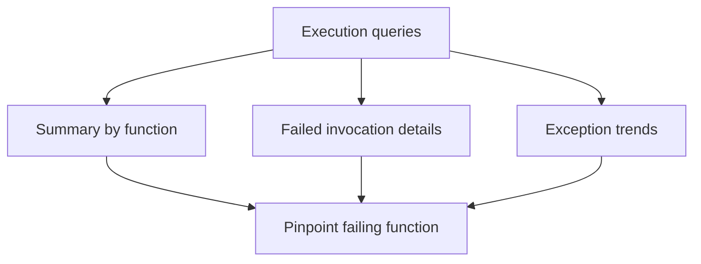

# Execution Queries

KQL queries for analyzing function execution patterns, failures, and exception trends.



## Function execution summary (success/failure/duration)

```kusto
let appName = "func-myapp-prod";
AppRequests
| where TimeGenerated > ago(1h)
| where AppRoleName =~ appName
| where OperationName startswith "Functions."
| summarize
    Invocations = count(),
    Failures = countif(success == false),
    FailureRatePercent = round(100.0 * countif(success == false) / count(), 2),
    P95Ms = round(percentile(duration, 95), 2)
  by FunctionName = OperationName
| order by Failures desc, P95Ms desc
```

**Example result:**

| FunctionName | Invocations | Failures | FailureRatePercent | P95Ms |
|---|---|---|---|---|
| Functions.HttpTrigger | 50 | 0 | 0.00 | 1729.33 |
| Functions.ExternalDependency | 30 | 0 | 0.00 | 2473.75 |
| Functions.QueueProcessor | 20 | 0 | 0.00 | 15.19 |
| Functions.TimerCleanup | 3 | 0 | 0.00 | 12.38 |
| Functions.ErrorHandler | 15 | 15 | 100.00 | 13.73 |

**How to interpret:**

| Indicator | Normal | Warning | Critical |
|---|---|---|---|
| FailureRatePercent | < 1% | 1-5% | > 5% |
| P95Ms (HTTP) | < 500ms | 500-2000ms | > 2000ms |
| P95Ms (Queue) | < 1000ms | 1000-5000ms | > 5000ms |

!!! note "Normal vs abnormal"
    **Normal sample:**

    | FunctionName | FailureRatePercent | P95Ms |
    |---|---|---|
    | Functions.QueueProcessor | 0.27 | 245 |
    | Functions.TimerCleanup | 0.00 | 180 |

    **Abnormal sample:**

    | FunctionName | FailureRatePercent | P95Ms |
    |---|---|---|
    | Functions.HttpTrigger | 23.56 | 12,500 |

    If one function is critical while others are normal, focus on that function's dependencies and exception types first.

## Failed invocations with error details

```kusto
let appName = "func-myapp-prod";
AppRequests
| where TimeGenerated > ago(2h)
| where AppRoleName =~ appName
| where OperationName startswith "Functions."
| where success == false
| project TimeGenerated, OperationId, FunctionName = OperationName, ResultCode, duration
| join kind=leftouter (
    AppExceptions
    | where TimeGenerated > ago(2h)
    | where AppRoleName =~ appName
    // Deduplicate exception rows per OperationId.
    | summarize ExceptionCount=count(), ExceptionType=take_any(type), ExceptionMessage=take_any(outerMessage) by OperationId
) on OperationId
| order by TimeGenerated desc
```

**Example result:**

| TimeGenerated | OperationId | FunctionName | ResultCode | duration | ExceptionCount | ExceptionType | ExceptionMessage |
|---|---|---|---|---|---|---|---|
| 2026-04-04T11:33:00Z | xxxxxxxx-xxxx-xxxx-xxxx-xxxxxxxxxxxx | Functions.ErrorHandler | 500 | 13.092 | 2 | Microsoft.Azure.WebJobs.Script.Workers.Rpc.RpcException | Exception while executing function: Functions.ErrorHandler |
| 2026-04-04T11:32:45Z | xxxxxxxx-xxxx-xxxx-xxxx-xxxxxxxxxxxx | Functions.ErrorHandler | 500 | 13.092 | 2 | Microsoft.Azure.WebJobs.Script.Workers.Rpc.RpcException | Exception while executing function: Functions.ErrorHandler |
| 2026-04-04T11:32:30Z | xxxxxxxx-xxxx-xxxx-xxxx-xxxxxxxxxxxx | Functions.ErrorHandler | 500 | 13.092 | 2 | Microsoft.Azure.WebJobs.Script.Workers.Rpc.RpcException | Exception while executing function: Functions.ErrorHandler |

**How to interpret:**

| Indicator | Normal | Warning | Critical |
|---|---|---|---|
| Failed rows in 15m | 0-2 | 3-10 | > 10 |
| Repeated ExceptionType | None | Same type repeats 3-5 times | Same type dominates failures |
| duration on failed requests | < 1000ms | 1000-5000ms | > 5000ms |

!!! note "Normal vs abnormal"
    **Normal:** Isolated failures with mixed exception types and quick recovery.

    **Abnormal:** Same `ExceptionType` repeats continuously (for example `System.UnauthorizedAccessException`) with consistent `403`/`500` codes.

## Exception trends

```kusto
let appName = "func-myapp-prod";
AppExceptions
| where TimeGenerated > ago(24h)
| where AppRoleName =~ appName
| summarize Count=count() by bin(TimeGenerated, 15m), type
| order by TimeGenerated desc
```

**Example result:**

| TimeGenerated | type | Count |
|---|---|---|
| 2026-04-04T11:30:00Z | Microsoft.Azure.WebJobs.Script.Workers.Rpc.RpcException | 30 |

> **Note:** Each unhandled function error typically generates multiple exception records (the `RpcException` wrapper from the host plus the inner application exception), so the exception count may be higher than the invocation failure count.

**How to interpret:**

| Indicator | Normal | Warning | Critical |
|---|---|---|---|
| Exception Count per 15m bin | 0-5 | 6-25 | > 25 |
| Dominant exception type share | < 40% | 40-70% | > 70% |
| Spike slope (current bin vs previous) | < 2x | 2-4x | > 4x |

!!! note "Normal vs abnormal"
    **Normal:** Low, noisy background exceptions without sustained growth.

    **Abnormal:** Sudden multi-bin spike in one exception type signals a regression window. Correlate with deployment and configuration changes.

### Top exceptions by impact

```kusto
let appName = "func-myapp-prod";
AppExceptions
| where TimeGenerated > ago(24h)
| where AppRoleName =~ appName
| summarize Total=count(), FirstSeen=min(TimeGenerated), LastSeen=max(TimeGenerated) by type, outerMessage
| order by Total desc
```

## See Also

- [Scaling Queries](../scaling/index.md)
- [Dependency Queries](../dependencies/index.md)
- [Correlation Queries](../correlation/index.md)
- [KQL Query Library](../index.md)

## Sources

- [Kusto Query Language overview](https://learn.microsoft.com/azure/data-explorer/kusto/query/)
- [Monitor Azure Functions](https://learn.microsoft.com/azure/azure-functions/functions-monitoring)
