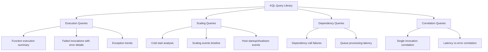

# KQL Query Library for Azure Functions

Use these KQL queries during incidents to validate hypotheses with telemetry.
Queries target Azure Functions data in Application Insights with these core tables:

- `requests`
- `traces`
- `exceptions`
- `dependencies`
- `customMetrics`

## Usage notes

1. Keep time range tight (`ago(30m)`, `ago(1h)`) during triage.
2. Always filter by app role name to avoid cross-app noise.
3. Save high-value queries to your incident workbook.

## KQL Tables Quick Reference

| Table | What It Contains | Use When |
|---|---|---|
| `requests` | HTTP trigger invocations | Checking request success/failure/latency |
| `traces` | Host lifecycle, custom logs | Checking startup, listeners, runtime events |
| `exceptions` | Error details with stack traces | Identifying error types and root causes |
| `dependencies` | Outbound calls to external services | Checking dependency health and latency |
| `customMetrics` | Metrics explicitly emitted by your app/SDK (for example `TelemetryClient.TrackMetric`) plus selected Azure Functions runtime metrics (for example `FunctionExecutionCount`) | Checking custom processing/latency metrics and runtime counters |

Template variable:

```kusto
let appName = "func-myapp-prod";
```

!!! tip "Operations Guide"
    For monitoring setup and alert configuration, see [Monitoring](../../operations/monitoring.md) and [Alerts](../../operations/alerts.md).



## Query Categories

| Category | Queries | Purpose |
|---|---|---|
| [Execution](execution/index.md) | Function summary, failed invocations, exception trends | Identify what is failing and how often |
| [Scaling](scaling/index.md) | Cold start, scaling events, host lifecycle | Understand scale behavior and startup health |
| [Dependencies](dependencies/index.md) | Dependency failures, queue processing latency | Diagnose external service issues |
| [Correlation](correlation/index.md) | Single invocation trace, latency vs errors | Connect symptoms across telemetry sources |

## See Also

- [First 10 Minutes](../first-10-minutes/index.md)
- [Playbooks](../playbooks/index.md)
- [Methodology](../methodology/troubleshooting-method.md)
- [Azure Monitor Logs query overview](https://learn.microsoft.com/azure/azure-monitor/logs/log-query-overview)
- [Application Insights data model](https://learn.microsoft.com/azure/azure-monitor/app/data-model)

## Sources

- [Kusto Query Language overview](https://learn.microsoft.com/azure/data-explorer/kusto/query/)
- [Application Insights telemetry data model](https://learn.microsoft.com/azure/azure-monitor/app/data-model-complete)
- [Monitor Azure Functions](https://learn.microsoft.com/azure/azure-functions/functions-monitoring)
