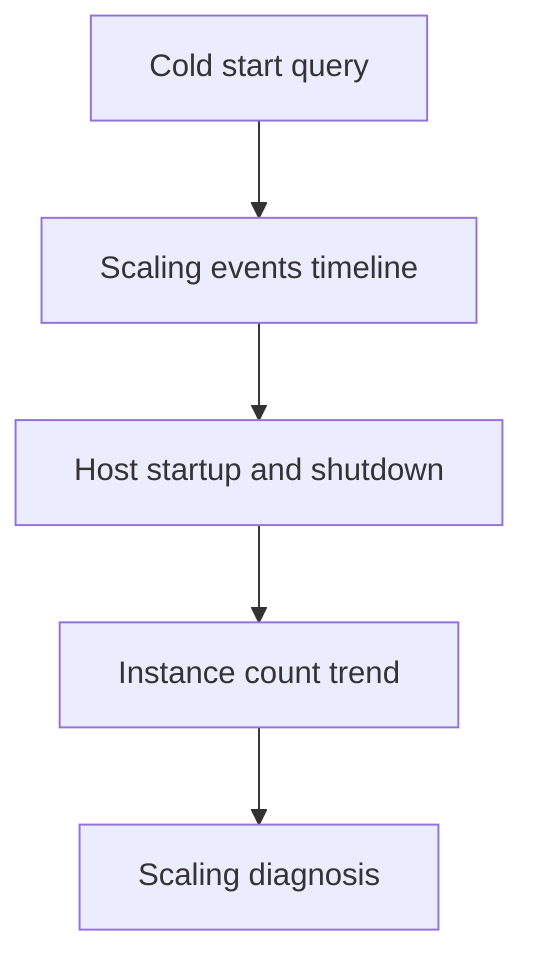

---
content_sources:
  - type: mslearn-adapted
    url: https://learn.microsoft.com/azure/azure-functions/functions-scale
  - type: mslearn-adapted
    url: https://learn.microsoft.com/azure/azure-functions/functions-monitoring
---

# Scaling Queries

KQL queries for analyzing cold starts, scaling behavior, and host lifecycle events.

<!-- diagram-id: scaling-queries -->


## Cold start analysis

```kusto
let appName = "func-myapp-prod";
// Measures earliest request latency per time bin (proxy for cold-start impact).
AppTraces
| where TimeGenerated > ago(6h)
| where AppRoleName =~ appName
| where Message has_any ("Host started", "Initializing Host")
| summarize StartupEvents=count() by bin(TimeGenerated, 15m)
| join kind=leftouter (
    AppRequests
    | where TimeGenerated > ago(6h)
    | where AppRoleName =~ appName
    | where OperationName startswith "Functions."
    | summarize FirstInvocation=min(TimeGenerated), FirstDurationMs=arg_min(TimeGenerated, DurationMs) by bin(TimeGenerated, 15m)
) on TimeGenerated
| order by TimeGenerated desc
```

**Example result:**

| TimeGenerated | StartupEvents | FirstInvocation | FirstDurationMs |
|---|---|---|---|
| 2026-04-04T11:30:00Z | 83 | 2026-04-04T11:30:00.003Z | 3.0249 |
| 2026-04-04T11:15:00Z | 19 | 2026-04-04T11:29:25.000Z | 1600.4633 |

**How to interpret:**

| Indicator | Normal | Warning | Critical |
|---|---|---|---|
| StartupEvents per 15m bin | Consistent with plan type (FC1: dozens per bin is normal; Y1/EP: 1-3 per bin) | Sudden spike vs baseline (for example 10x normal) | Startup events with no subsequent successful invocations |
| FirstDurationMs after startup | < 1000ms | 1000-5000ms | > 5000ms |

!!! tip "FC1 Flex Consumption"
    Flex Consumption plans scale by spinning up many worker instances rapidly. Seeing 50-100+ startup events in a 15-minute bin is normal under load. Focus on whether startup events correlate with successful invocations, not the raw count.

!!! note "Normal vs abnormal"
    **Normal:** One startup event and first invocation under 1 second.

    **Abnormal:** Multiple startup events plus first invocation over 5 seconds indicates cold start pressure or host recycling.

## Scaling events timeline

```kusto
let appName = "func-myapp-prod";
AppTraces
| where TimeGenerated > ago(6h)
| where AppRoleName =~ appName
| where Message has_any ("scale", "instance", "worker", "concurrency", "drain")
| project TimeGenerated, SeverityLevel, Message
| order by TimeGenerated desc
```

**Example result:**

| TimeGenerated | SeverityLevel | Message |
|---|---|---|
| 2026-04-04T11:32:20Z | 1 | Worker process started and initialized. |
| 2026-04-04T11:31:50Z | 1 | Worker process started and initialized. |
| 2026-04-04T11:31:20Z | 1 | Worker process started and initialized. |
| 2026-04-04T11:30:50Z | 1 | Worker process started and initialized. |

**How to interpret:**

| Indicator | Normal | Warning | Critical |
|---|---|---|---|
| Scale events under sustained load | Present | Delayed | Missing |
| New instance allocation after scale out command | < 60s | 60-180s | > 180s |
| Frequent drain/recycle messages | Rare | Intermittent | Continuous |

!!! note "Normal vs abnormal"
    **Normal:** `Scaling out` followed by `New instance allocated` and then stable processing.

    **Abnormal:** Repeated `Drain mode` and recycle logs without sustained capacity growth indicate unstable workers or platform constraints.

## Host startup/shutdown events

```kusto
let appName = "func-myapp-prod";
AppTraces
| where TimeGenerated > ago(12h)
| where AppRoleName =~ appName
| where Message has_any ("Host started", "Job host started", "Host shutdown", "Host is shutting down", "Stopping JobHost")
| project TimeGenerated, SeverityLevel, Message
| order by TimeGenerated desc
```

**Example result:**

| TimeGenerated | SeverityLevel | Message |
|---|---|---|
| 2026-04-04T11:36:20Z | 1 | Host started (64ms) |
| 2026-04-04T11:32:30Z | 1 | Job host started |
| 2026-04-04T11:32:20Z | 1 | Host is shutting down |
| 2026-04-04T11:30:00Z | 1 | Host started (82ms) |

**How to interpret:**

| Indicator | Normal | Warning | Critical |
|---|---|---|---|
| Host start count per hour | 1-2 | 3-5 | > 5 |
| Start-stop cycle interval | N/A | 10-30m | < 10m |
| Shutdown messages with errors nearby | None | Occasional | Repeated |
| Multiple `Host started` entries in short succession on FC1 | Normal scaling behavior | Review only if accompanied by error bursts | Persistent restarts with failures and no successful invocations |

!!! note "Normal vs abnormal"
    **Normal:** One startup event after deployment or planned restart.

    **Abnormal:** Repeated startup/shutdown cycling in short intervals usually indicates crash loops, configuration churn, or failing dependencies.

## Instance count over time

```kusto
let appName = "func-myapp-prod";
AppTraces
| where TimeGenerated > ago(6h)
| where AppRoleName =~ appName
| summarize InstanceCount = dcount(AppRoleInstance) by bin(TimeGenerated, 5m)
| order by TimeGenerated asc
```

**Example result:**

| TimeGenerated | InstanceCount |
|---|---|
| 2026-04-04T11:00:00Z | 1 |
| 2026-04-04T11:05:00Z | 3 |
| 2026-04-04T11:10:00Z | 5 |
| 2026-04-04T11:15:00Z | 5 |
| 2026-04-04T11:20:00Z | 2 |

**How to interpret:**

| Indicator | Normal | Warning | Critical |
|---|---|---|---|
| Instance count under load | Increases as traffic grows | Flat despite rising backlog | Drops to zero unexpectedly |
| Instance count after load subsides | Decreases gradually | Remains over-provisioned for extended periods | Oscillates rapidly up and down |

!!! tip "Reading instance counts"
    This query counts distinct `AppRoleInstance` values that emitted any trace within each 5-minute bin. An instance that processes at least one request or logs one trace during the bin is counted as active. Bins with zero traces produce no row, which is different from an instance count of zero.

## See Also

- [Execution Queries](../execution/index.md)
- [Dependency Queries](../dependencies/index.md)
- [Correlation Queries](../correlation/index.md)
- [KQL Query Library](../index.md)

## Sources

- [Azure Functions scale and hosting](https://learn.microsoft.com/azure/azure-functions/functions-scale)
- [Monitor Azure Functions](https://learn.microsoft.com/azure/azure-functions/functions-monitoring)
