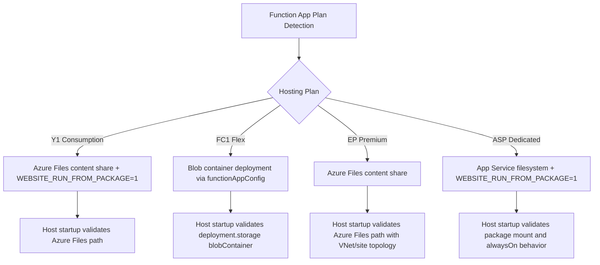
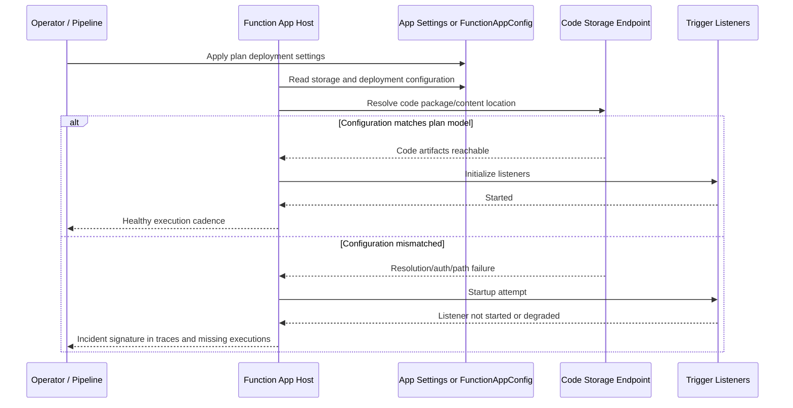
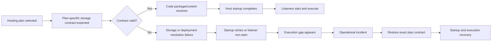
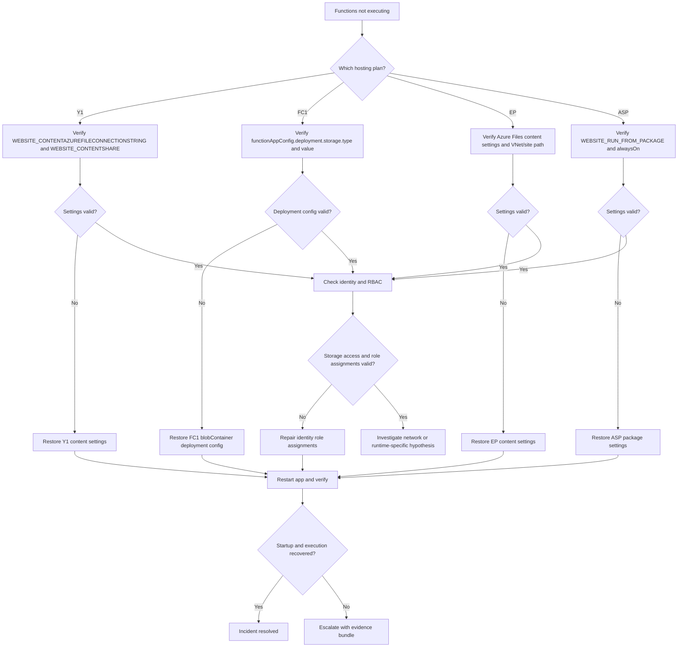

---
content_sources:
  - type: mslearn-adapted
    url: https://learn.microsoft.com/azure/azure-functions/storage-considerations
  - type: mslearn-adapted
    url: https://learn.microsoft.com/azure/azure-functions/functions-reference#configure-an-identity-based-connection
  - type: mslearn-adapted
    url: https://learn.microsoft.com/azure/azure-functions/functions-networking-options
  - type: mslearn-adapted
    url: https://learn.microsoft.com/azure/azure-functions/flex-consumption-plan
  - type: mslearn-adapted
    url: https://learn.microsoft.com/azure/azure-functions/run-functions-from-deployment-package
  - type: mslearn-adapted
    url: https://learn.microsoft.com/azure/azure-functions/functions-monitoring
  - type: mslearn-adapted
    url: https://learn.microsoft.com/azure/azure-monitor/app/data-model
  - type: mslearn-adapted
    url: https://learn.microsoft.com/azure/role-based-access-control/role-assignments-cli
---

# Lab Guide: Code Storage Verification (All Hosting Plans)

This Level 3 lab guide validates how Azure Functions stores and loads code across all four hosting plans used in this repository: Consumption (Y1), Flex Consumption (FC1), Premium (EP), and Dedicated (ASP). The lab proves the deployment-storage model, required app settings, identity and RBAC dependencies, and the failure signatures you should expect when one plan is misconfigured. It also gives deterministic recovery procedures and evidence standards for production-grade triage.

---

## Lab Metadata

| Field | Value |
|---|---|
| Lab focus | Cross-plan verification of Azure Functions code storage model and deployment configuration |
| Runtime profile | Azure Functions v4 (Linux), Python 3.11 |
| Plan profile | Consumption (`Y1`), Flex Consumption (`FC1`), Premium (`EP1`), Dedicated (`B1` as baseline ASP) |
| Trigger type under test | Timer trigger and HTTP trigger startup paths |
| Critical dependency | Storage model + app settings consistency per hosting plan |
| Auth model variants | System-assigned managed identity, user-assigned managed identity, RBAC, Azure Files provisioning key path |
| Primary blast radius | Host startup, trigger listener initialization, deployment artifact resolution |
| Lab source path | `labs/code-storage-verification/` |
| Observability data sources | Application Insights (`traces`, `requests`, `exceptions`, `dependencies`), Azure CLI config inspection |
| Incident signature | Startup loops, missing listener startup, storage/deployment resolution errors, silent no-execution patterns |
| Recovery signature | Plan-specific storage path restored, host startup stable, listener started, invocation cadence normalized |

!!! info "What this lab is designed to prove"
    This lab proves that Azure Functions code storage is **plan-specific**, not a single universal model.

    It validates that each hosting plan requires a distinct configuration contract:

    - `Y1` and `EP` require Azure Files content settings.
    - `FC1` requires `functionAppConfig.deployment.storage` blob container configuration.
    - `ASP` uses App Service filesystem + package mount behavior (`WEBSITE_RUN_FROM_PACKAGE=1`).

    It also proves that incident triage quality improves when operators classify failures by hosting plan first, then verify only the settings and storage semantics that are valid for that plan.

---

## 1) Background

Code loading behavior in Azure Functions differs by hosting plan, and this difference is often hidden behind seemingly similar deployments. If operators assume one storage model applies everywhere, they can misdiagnose incidents, apply incorrect fixes, and cause longer outages. This lab establishes plan-aware verification as a repeatable operating practice.

### 1.1 Code storage model per hosting plan

| Hosting plan | Code storage / deployment model | How runtime locates code | Primary config surface | Common operator mistake |
|---|---|---|---|---|
| Consumption (`Y1`) | Azure Files SMB content share + package mounting | Content share + package setting | `siteConfig.appSettings` | Removing content settings because identity-based storage is enabled |
| Flex Consumption (`FC1`) | Blob container deployment package (`functionAppConfig`) | Deployment storage descriptor in `functionAppConfig` | `functionAppConfig.deployment.storage` + app settings | Adding legacy `WEBSITE_CONTENT*` settings and assuming they are required |
| Premium (`EP`) | Azure Files SMB content share | Content share path resolved at startup | `siteConfig.appSettings` + VNet/site networking | Expecting Flex-style deployment config to exist |
| Dedicated (`ASP`) | App Service filesystem with zip/package run model | Package mount on web app filesystem | `siteConfig.appSettings` + alwaysOn | Assuming content share settings are required |

<!-- diagram-id: 1-1-code-storage-model-per-hosting-plan -->


### 1.2 Key app settings per hosting plan

This table is the core verification contract for this lab and mirrors the Bicep templates in `infra/`.

| Plan | `AzureWebJobsStorage__accountName` | `AzureWebJobsStorage__credential` | `AzureWebJobsStorage__clientId` | `WEBSITE_CONTENTAZUREFILECONNECTIONSTRING` | `WEBSITE_CONTENTSHARE` | `WEBSITE_RUN_FROM_PACKAGE` | `functionAppConfig.deployment.storage.type` | `functionAppConfig.deployment.storage.authentication.type` | Identity | Required RBAC roles |
|---|---|---|---|---|---|---|---|---|---|---|
| Consumption (`Y1`) | Required | `managedidentity` | Not used | Required | Required | `1` | Not used | Not used | SystemAssigned | Storage Blob Data Owner, Storage Account Contributor, Storage Queue Data Contributor, Storage File Data Privileged Contributor |
| Flex Consumption (`FC1`) | Required | `managedidentity` | Required (UAI client ID) | Not used | Not used | Not used | `blobContainer` | `UserAssignedIdentity` | UserAssigned | Storage Blob Data Owner, Storage Account Contributor, Storage Queue Data Contributor |
| Premium (`EP`) | Required | `managedidentity` | Not used | Required | Required | Not set in template | Not used | Not used | SystemAssigned | Storage Blob Data Owner, Storage Account Contributor, Storage Queue Data Contributor, Storage File Data Privileged Contributor |
| Dedicated (`ASP`) | Required | `managedidentity` | Not used | Not used | Not used | `1` | Not used | Not used | SystemAssigned | Storage Blob Data Owner, Storage Account Contributor, Storage Queue Data Contributor |

Exact expectations extracted from infrastructure templates:

| Plan | Source template | Additional plan constraints |
|---|---|---|
| Consumption (`Y1`) | `infra/consumption/main.bicep` | No VNet integration, no private endpoints |
| Flex Consumption (`FC1`) | `infra/flex-consumption/main.bicep` | VNet integration + blob private endpoint, storage public and shared key access disabled |
| Premium (`EP`) | `infra/premium/main.bicep` | VNet integration + site private endpoint, storage allows public + shared key access |
| Dedicated (`ASP`) | `infra/dedicated/main.bicep` | `alwaysOn: true`, no VNet in baseline template |

### 1.3 Why storage verification matters

Operators often see "Functions not executing" and start by checking triggers or code regressions. In many real incidents, the root issue is deployment storage mismatch, not business logic.

Typical production failure scenarios:

1. Consumption app loses `WEBSITE_CONTENTSHARE` during configuration drift and host cannot resolve content path.
2. Flex app keeps identity app settings but deployment blob container path is wrong, causing startup/deployment resolution issues.
3. Premium app has Azure Files share setting mismatch after slot or IaC drift.
4. Dedicated app loses `WEBSITE_RUN_FROM_PACKAGE=1` and serves stale or missing code package after deployment.

Operational impact pattern:

- Startup appears partially successful from platform perspective.
- Host lifecycle traces show initialization retries or listener non-start.
- Request-level symptom can be "no scheduled executions" without immediate HTTP outage.
- Recovery requires restoring plan-correct storage contract, not generic restart loops.

### 1.4 Deployment model differences

| Model | Used by | Control plane | Data path | Typical failure family |
|---|---|---|---|---|
| Azure Files SMB content share | Consumption (`Y1`), Premium (`EP`) | App settings (`WEBSITE_CONTENT*`) + storage account | File share mounted by platform/runtime | Missing share name, invalid content connection string, file role issues |
| Blob container deployment (`functionAppConfig`) | Flex Consumption (`FC1`) | `functionAppConfig.deployment.storage` | Blob package pointer authenticated with user-assigned identity | Wrong container/path, identity mismatch, missing blob role, private endpoint/DNS drift |
| App Service filesystem package mount | Dedicated (`ASP`) | App settings + zip/package deployment | Mounted package in app filesystem | Missing `WEBSITE_RUN_FROM_PACKAGE`, stale package, alwaysOn misbehavior |

### 1.5 Failure progression model

<!-- diagram-id: 1-5-failure-progression-model -->


### 1.6 Signal map: normal vs misconfigured

| Signal source | Normal (`Y1`) | Misconfigured (`Y1`) | Normal (`FC1`) | Misconfigured (`FC1`) | Normal (`EP`) | Misconfigured (`EP`) | Normal (`ASP`) | Misconfigured (`ASP`) |
|---|---|---|---|---|---|---|---|---|
| `traces` startup | Content share + host start sequence | Missing content share warnings/errors | Deployment storage resolved | Blob deployment path/auth errors | Content share initialization stable | Share/config mismatch during startup | Package mount + host start | Package mount / startup drift signals |
| `requests` timer cadence | Regular cadence | Cadence drops or stops | Regular cadence | No execution or repeated startup failure | Regular cadence | Cadence degraded | Regular cadence | Cadence drift, cold start repeats |
| `dependencies` storage endpoints | Expected storage calls | Spike in failed share/blob access | Blob endpoint success pattern | Blob endpoint failure concentration | Share/blob checks stable | Storage failures at startup | Minimal startup storage failures | Deployment/package-related failures |
| CLI setting inspection | Plan-correct settings present | Missing `WEBSITE_CONTENT*` | `functionAppConfig` present and valid | Invalid `functionAppConfig` value/auth type | `WEBSITE_CONTENT*` present | Drift in content share settings | `WEBSITE_RUN_FROM_PACKAGE=1` | Setting removed or overwritten |

---

## 2) Hypothesis

### 2.1 Formal hypothesis statement

> If each Function App is configured with the storage/deployment model required by its hosting plan, host startup and trigger execution remain stable; if a plan-specific storage contract is violated, host startup or listener initialization degrades in a predictable way until the exact contract is restored.

### 2.2 Causal chain (Mermaid flowchart)

<!-- diagram-id: 2-2-causal-chain-mermaid-flowchart -->


### 2.3 Proof criteria

The hypothesis is supported when all of the following are true:

1. Baseline verification confirms each plan has the expected settings and identity model from Bicep.
2. Induced misconfiguration per plan produces a plan-aligned incident signature.
3. KQL evidence links failure window to storage/deployment configuration mismatch.
4. Restoring the exact missing setting or deployment path clears the incident signature.
5. Recovery restores listener startup and execution cadence in telemetry.

### 2.4 Disproof criteria

The hypothesis is weakened or falsified if any of the following is observed:

- Misconfiguration does not change startup/listener behavior for the target plan.
- Recovery occurs without restoring the storage/deployment contract.
- Same failure appears while all plan-specific settings are verified as correct.
- Competing hypotheses explain data better (for example, network egress outage unrelated to storage config).

### 2.5 Competing hypotheses tested in this lab

| Competing hypothesis | What would be observed | Lab disambiguation logic |
|---|---|---|
| Trigger code regression | Function exceptions without config drift | Compare deployment/setting timeline with app code changes |
| Runtime platform transient | Short-lived random startup issues across plans | Check whether only misconfigured plan fails deterministically |
| Application Insights ingestion lag | Missing telemetry but healthy execution | Validate with CLI config and direct function invocation checks |
| Network-only outage | DNS/timeout failures independent of setting removal | Correlate with plan-specific config mutation event |
| Identity token issue unrelated to storage model | Broad auth failures across endpoints | Compare role assignments and deployment storage config state |

### 2.6 Expected lab verdict

Expected result for a correct run:

- Baseline: all four plans pass contract validation.
- Fault phase: each induced misconfiguration produces targeted startup/execution degradation.
- Recovery phase: restoring plan-correct settings resolves incident signatures.
- Final verdict: storage/deployment model is confirmed as a primary causal factor for these failure classes.

---

## 3) Runbook

### 3.1 Prerequisites

| Requirement | Verification command |
|---|---|
| Azure CLI installed | `az version` |
| Authenticated session | `az account show --output table` |
| Subscription context selected | `az account show --query "id" --output tsv` |
| Permission to deploy RBAC and networking resources | `az role assignment list --assignee "<object-id>" --output table` |
| Access to Application Insights query data | `az monitor app-insights component show --resource-group "$RG_Y1" --app "${BASE_Y1}-appinsights" --output table` |

### 3.2 Variables

Use canonical variable names and one resource group per plan for isolation.

```bash
LOCATION="koreacentral"
SUBSCRIPTION_ID="<subscription-id>"

RG_Y1="rg-func-codeverify-y1"
RG_FC1="rg-func-codeverify-fc1"
RG_EP="rg-func-codeverify-ep"
RG_ASP="rg-func-codeverify-asp"

BASE_Y1="codeverifyy1"
BASE_FC1="codeverifyfc1"
BASE_EP="codeverifyep"
BASE_ASP="codeverifyasp"

APP_Y1="${BASE_Y1}-func"
APP_FC1="${BASE_FC1}-func"
APP_EP="${BASE_EP}-func"
APP_ASP="${BASE_ASP}-func"

PLAN_Y1="${BASE_Y1}-plan"
PLAN_FC1="${BASE_FC1}-plan"
PLAN_EP="${BASE_EP}-plan"
PLAN_ASP="${BASE_ASP}-plan"

STORAGE_Y1="${BASE_Y1}storage"
STORAGE_FC1="${BASE_FC1}storage"
STORAGE_EP="${BASE_EP}storage"
STORAGE_ASP="${BASE_ASP}storage"
```

### 3.3 Deploy all four hosting plans

#### 3.3.1 Consumption (Y1)

Create resource group:

```bash
az group create \
  --name "$RG_Y1" \
  --location "$LOCATION"
```

Deploy infrastructure:

```bash
az deployment group create \
  --resource-group "$RG_Y1" \
  --template-file "infra/consumption/main.bicep" \
  --parameters "baseName=$BASE_Y1" "location=$LOCATION"
```

Validation focus:

- Azure Files content share settings exist.
- `WEBSITE_RUN_FROM_PACKAGE` is set to `1`.
- Identity is system-assigned and includes file-role capability.

#### 3.3.2 Flex Consumption (FC1)

Create resource group:

```bash
az group create \
  --name "$RG_FC1" \
  --location "$LOCATION"
```

Deploy infrastructure:

```bash
az deployment group create \
  --resource-group "$RG_FC1" \
  --template-file "infra/flex-consumption/main.bicep" \
  --parameters "baseName=$BASE_FC1" "location=$LOCATION"
```

Validation focus:

- Deployment model is `functionAppConfig.deployment.storage.type=blobContainer`.
- User-assigned identity is configured and referenced by deployment authentication.
- Storage account is locked down (`allowPublicAccess=false`, `allowSharedKeyAccess=false`).

#### 3.3.3 Premium (EP)

Create resource group:

```bash
az group create \
  --name "$RG_EP" \
  --location "$LOCATION"
```

Deploy infrastructure:

```bash
az deployment group create \
  --resource-group "$RG_EP" \
  --template-file "infra/premium/main.bicep" \
  --parameters "baseName=$BASE_EP" "location=$LOCATION"
```

Validation focus:

- Azure Files content settings are present.
- `WEBSITE_RUN_FROM_PACKAGE` is intentionally not required by this template.
- Site private endpoint and VNet integration exist.

#### 3.3.4 Dedicated (ASP)

Create resource group:

```bash
az group create \
  --name "$RG_ASP" \
  --location "$LOCATION"
```

Deploy infrastructure:

```bash
az deployment group create \
  --resource-group "$RG_ASP" \
  --template-file "infra/dedicated/main.bicep" \
  --parameters "baseName=$BASE_ASP" "location=$LOCATION"
```

Validation focus:

- `WEBSITE_RUN_FROM_PACKAGE=1` exists.
- `alwaysOn=true` is configured in site config.
- No Azure Files content settings are expected.

### 3.4 Baseline verification (all plans)

Use these exact inspection commands for each app.

List app settings:

```bash
az functionapp config appsettings list \
  --resource-group "$RG" \
  --name "$APP_NAME" \
  --output json
```

Show function app config (required for Flex verification):

```bash
az functionapp show \
  --resource-group "$RG" \
  --name "$APP_NAME" \
  --query "functionAppConfig" \
  --output json
```

Check identity:

```bash
az functionapp identity show \
  --resource-group "$RG" \
  --name "$APP_NAME" \
  --output json
```

Check hosting plan SKU:

```bash
az functionapp plan show \
  --resource-group "$RG" \
  --name "$PLAN_NAME" \
  --query "sku" \
  --output json
```

Check role assignments:

For Y1, EP, and ASP (system-assigned identity):

```bash
PRINCIPAL_ID="$(az functionapp identity show \
  --resource-group "$RG" \
  --name "$APP_NAME" \
  --query "principalId" \
  --output tsv)"
```

For FC1 (user-assigned identity):

```bash
PRINCIPAL_ID="$(az functionapp identity show \
  --resource-group "$RG_FC1" \
  --name "$APP_FC1" \
  --query "userAssignedIdentities.*.principalId | [0]" \
  --output tsv)"
```

Then list assignments against storage scope:
```bash
az role assignment list \
  --assignee "$PRINCIPAL_ID" \
  --scope "$STORAGE_ID" \
  --output table
```

Check storage account settings:

```bash
az storage account show \
  --resource-group "$RG" \
  --name "$STORAGE_NAME" \
  --query "{allowPublicAccess: allowBlobPublicAccess, allowSharedKeyAccess: allowSharedKeyAccess}" \
  --output json
```

Run baseline checks for each plan:

```bash
for RG in "$RG_Y1" "$RG_FC1" "$RG_EP" "$RG_ASP"; do
  echo "Checking $RG"
done
```

Use the automated verification script:

```bash
bash labs/code-storage-verification/scripts/verify-storage.sh all
```

The script validates plan-specific storage contracts, identity types, and RBAC role assignments for all four plans.

### 3.5 Capture baseline evidence queries (KQL)

Define app list once:

```kusto
let apps = dynamic([
    "codeverifyy1-func",
    "codeverifyfc1-func",
    "codeverifyep-func",
    "codeverifyasp-func"
]);
```

#### 3.5.1 Function execution summary across all plans

```kusto
let apps = dynamic([
    "codeverifyy1-func",
    "codeverifyfc1-func",
    "codeverifyep-func",
    "codeverifyasp-func"
]);
requests
| where timestamp > ago(2h)
| where cloud_RoleName in (apps)
| where operation_Name startswith "Functions."
| summarize
    Invocations = count(),
    Failures = countif(success == false),
    FailureRatePercent = round(100.0 * countif(success == false) / count(), 2),
    P95Ms = percentile(duration, 95),
    LastSeen = max(timestamp)
  by App = cloud_RoleName, FunctionName = operation_Name
| order by App asc, FunctionName asc
```

#### 3.5.2 Host startup traces per plan

```kusto
let apps = dynamic([
    "codeverifyy1-func",
    "codeverifyfc1-func",
    "codeverifyep-func",
    "codeverifyasp-func"
]);
traces
| where timestamp > ago(2h)
| where cloud_RoleName in (apps)
| where message has_any (
    "Host started",
    "Job host started",
    "listener",
    "Storage probe",
    "deployment",
    "content",
    "unhealthy"
)
| project timestamp, App = cloud_RoleName, severityLevel, message
| order by timestamp desc
```

#### 3.5.3 Storage probe and deployment status

```kusto
let apps = dynamic([
    "codeverifyy1-func",
    "codeverifyfc1-func",
    "codeverifyep-func",
    "codeverifyasp-func"
]);
traces
| where timestamp > ago(2h)
| where cloud_RoleName in (apps)
| where message has_any (
    "AzureWebJobsStorage",
    "Storage probe",
    "deployment package",
    "Run-From-Package",
    "WEBSITE_CONTENTSHARE",
    "blobContainer"
)
| project timestamp, App = cloud_RoleName, severityLevel, message
| order by timestamp desc
```

#### 3.5.4 Content share access patterns (Y1/EP emphasis)

```kusto
let apps = dynamic(["codeverifyy1-func", "codeverifyep-func"]);
dependencies
| where timestamp > ago(2h)
| where cloud_RoleName in (apps)
| where target has ".file.core.windows.net" or name has_any ("file", "share", "content")
| summarize
    Calls = count(),
    Failed = countif(success == false),
    FailureRatePercent = round(100.0 * countif(success == false) / count(), 2),
    P95Ms = percentile(duration, 95)
  by App = cloud_RoleName, target, resultCode
| order by Failed desc, Calls desc
```

#### 3.5.5 Blob container deployment verification (FC1 emphasis)

```kusto
let apps = dynamic(["codeverifyfc1-func"]);
dependencies
| where timestamp > ago(2h)
| where cloud_RoleName in (apps)
| where target has ".blob.core.windows.net"
| summarize
    Calls = count(),
    Failed = countif(success == false),
    SuccessRatePercent = round(100.0 * countif(success == true) / count(), 2),
    LastSeen = max(timestamp)
  by App = cloud_RoleName, target, resultCode
| order by Calls desc
```

### 3.6 Verification matrix

| Plan | Setting / Config | Expected value | Verification command |
|---|---|---|---|
| Y1 | `AzureWebJobsStorage__accountName` | Storage account name | `az functionapp config appsettings list --resource-group "$RG_Y1" --name "$APP_Y1" --output json` |
| Y1 | `AzureWebJobsStorage__credential` | `managedidentity` | `az functionapp config appsettings list --resource-group "$RG_Y1" --name "$APP_Y1" --output json` |
| Y1 | `WEBSITE_CONTENTAZUREFILECONNECTIONSTRING` | Present and non-empty | `az functionapp config appsettings list --resource-group "$RG_Y1" --name "$APP_Y1" --output json` |
| Y1 | `WEBSITE_CONTENTSHARE` | Present and non-empty | `az functionapp config appsettings list --resource-group "$RG_Y1" --name "$APP_Y1" --output json` |
| Y1 | `WEBSITE_RUN_FROM_PACKAGE` | `1` | `az functionapp config appsettings list --resource-group "$RG_Y1" --name "$APP_Y1" --output json` |
| Y1 | Identity | `SystemAssigned` | `az functionapp identity show --resource-group "$RG_Y1" --name "$APP_Y1" --output json` |
| Y1 | Storage access mode | `allowPublicAccess=true`, `allowSharedKeyAccess=true` | `az storage account show --resource-group "$RG_Y1" --name "$STORAGE_Y1" --query "{allowPublicAccess: allowBlobPublicAccess, allowSharedKeyAccess: allowSharedKeyAccess}" --output json` |
| FC1 | `AzureWebJobsStorage__accountName` | Storage account name | `az functionapp config appsettings list --resource-group "$RG_FC1" --name "$APP_FC1" --output json` |
| FC1 | `AzureWebJobsStorage__credential` | `managedidentity` | `az functionapp config appsettings list --resource-group "$RG_FC1" --name "$APP_FC1" --output json` |
| FC1 | `AzureWebJobsStorage__clientId` | UAI client ID present | `az functionapp config appsettings list --resource-group "$RG_FC1" --name "$APP_FC1" --output json` |
| FC1 | `WEBSITE_CONTENTAZUREFILECONNECTIONSTRING` | Absent | `az functionapp config appsettings list --resource-group "$RG_FC1" --name "$APP_FC1" --output json` |
| FC1 | `WEBSITE_CONTENTSHARE` | Absent | `az functionapp config appsettings list --resource-group "$RG_FC1" --name "$APP_FC1" --output json` |
| FC1 | `WEBSITE_RUN_FROM_PACKAGE` | Absent | `az functionapp config appsettings list --resource-group "$RG_FC1" --name "$APP_FC1" --output json` |
| FC1 | Deployment storage type | `blobContainer` | `az functionapp show --resource-group "$RG_FC1" --name "$APP_FC1" --query "functionAppConfig" --output json` |
| FC1 | Deployment auth type | `UserAssignedIdentity` | `az functionapp show --resource-group "$RG_FC1" --name "$APP_FC1" --query "functionAppConfig" --output json` |
| FC1 | Identity | `UserAssigned` | `az functionapp identity show --resource-group "$RG_FC1" --name "$APP_FC1" --output json` |
| FC1 | Storage access mode | `allowPublicAccess=false`, `allowSharedKeyAccess=false` | `az storage account show --resource-group "$RG_FC1" --name "$STORAGE_FC1" --query "{allowPublicAccess: allowBlobPublicAccess, allowSharedKeyAccess: allowSharedKeyAccess}" --output json` |
| EP | `AzureWebJobsStorage__accountName` | Storage account name | `az functionapp config appsettings list --resource-group "$RG_EP" --name "$APP_EP" --output json` |
| EP | `AzureWebJobsStorage__credential` | `managedidentity` | `az functionapp config appsettings list --resource-group "$RG_EP" --name "$APP_EP" --output json` |
| EP | `WEBSITE_CONTENTAZUREFILECONNECTIONSTRING` | Present and non-empty | `az functionapp config appsettings list --resource-group "$RG_EP" --name "$APP_EP" --output json` |
| EP | `WEBSITE_CONTENTSHARE` | Present and non-empty | `az functionapp config appsettings list --resource-group "$RG_EP" --name "$APP_EP" --output json` |
| EP | `WEBSITE_RUN_FROM_PACKAGE` | Not set in template | `az functionapp config appsettings list --resource-group "$RG_EP" --name "$APP_EP" --output json` |
| EP | Identity | `SystemAssigned` | `az functionapp identity show --resource-group "$RG_EP" --name "$APP_EP" --output json` |
| EP | Storage access mode | `allowPublicAccess=true`, `allowSharedKeyAccess=true` | `az storage account show --resource-group "$RG_EP" --name "$STORAGE_EP" --query "{allowPublicAccess: allowBlobPublicAccess, allowSharedKeyAccess: allowSharedKeyAccess}" --output json` |
| ASP | `AzureWebJobsStorage__accountName` | Storage account name | `az functionapp config appsettings list --resource-group "$RG_ASP" --name "$APP_ASP" --output json` |
| ASP | `AzureWebJobsStorage__credential` | `managedidentity` | `az functionapp config appsettings list --resource-group "$RG_ASP" --name "$APP_ASP" --output json` |
| ASP | `WEBSITE_RUN_FROM_PACKAGE` | `1` | `az functionapp config appsettings list --resource-group "$RG_ASP" --name "$APP_ASP" --output json` |
| ASP | `WEBSITE_CONTENTAZUREFILECONNECTIONSTRING` | Absent | `az functionapp config appsettings list --resource-group "$RG_ASP" --name "$APP_ASP" --output json` |
| ASP | `WEBSITE_CONTENTSHARE` | Absent | `az functionapp config appsettings list --resource-group "$RG_ASP" --name "$APP_ASP" --output json` |
| ASP | Identity | `SystemAssigned` | `az functionapp identity show --resource-group "$RG_ASP" --name "$APP_ASP" --output json` |
| ASP | Storage access mode | `allowPublicAccess=true`, `allowSharedKeyAccess=false` | `az storage account show --resource-group "$RG_ASP" --name "$STORAGE_ASP" --query "{allowPublicAccess: allowBlobPublicAccess, allowSharedKeyAccess: allowSharedKeyAccess}" --output json` |

### 3.7 Introduce misconfiguration scenarios

Run one scenario at a time and capture evidence before moving to the next.

#### 3.7.1 Scenario A: Consumption (`Y1`) remove `WEBSITE_CONTENTSHARE`

```bash
az functionapp config appsettings delete \
  --resource-group "$RG_Y1" \
  --name "$APP_Y1" \
  --setting-names "WEBSITE_CONTENTSHARE"

az functionapp restart \
  --resource-group "$RG_Y1" \
  --name "$APP_Y1"
```

Expected behavior:

- Platform auto-regenerates `WEBSITE_CONTENTSHARE` with a new random share name on restart.
- No immediate failure visible - validates platform resilience for this specific setting.
- Operational impact: content share name drifts from IaC baseline, causing configuration audit mismatches.

!!! note "Live testing update"
    Validated testing (Observation A) revealed that removing `WEBSITE_CONTENTSHARE` alone does NOT cause failure - the platform auto-regenerates a new random share name on restart. Full failure requires compound removal of `AzureWebJobsStorage` + `WEBSITE_RUN_FROM_PACKAGE` + `WEBSITE_CONTENTSHARE`. See [Platform resilience behaviors](#461-platform-resilience-behaviors-discovered-during-testing).

#### 3.7.2 Scenario B: Flex (`FC1`) wrong blob deployment path

Inject an invalid deployment path (for example, non-existent container name):

```bash
az resource update \
  --resource-group "$RG_FC1" \
  --name "$APP_FC1" \
  --resource-type "Microsoft.Web/sites" \
  --set "properties.functionAppConfig.deployment.storage.value=https://${STORAGE_FC1}.blob.core.windows.net/nonexistent-deployment-container"

az functionapp restart \
  --resource-group "$RG_FC1" \
  --name "$APP_FC1"
```

Expected behavior:

- Deployment artifact resolution failures.
- Startup retries and missing trigger execution.

#### 3.7.3 Scenario C: Premium (`EP`) remove `WEBSITE_CONTENTAZUREFILECONNECTIONSTRING`

```bash
az functionapp config appsettings delete \
  --resource-group "$RG_EP" \
  --name "$APP_EP" \
  --setting-names "WEBSITE_CONTENTAZUREFILECONNECTIONSTRING"

az functionapp restart \
  --resource-group "$RG_EP" \
  --name "$APP_EP"
```

Expected behavior:

- **Projected**: Content share provisioning/reference issues for startup path.
- **Projected**: Host/listener instability despite otherwise valid runtime settings.
- This scenario has **not been individually validated** on EP. Live testing (Observation C) used compound removal.

!!! note "Live testing update"
    Validated testing revealed that `WEBSITE_CONTENTAZUREFILECONNECTIONSTRING` is platform-protected on Consumption and cannot be removed via CLI. On Premium (Observation C), failure required compound removal of all storage + content settings. See [Platform resilience behaviors](#461-platform-resilience-behaviors-discovered-during-testing).

#### 3.7.4 Scenario D: Dedicated (`ASP`) remove `WEBSITE_RUN_FROM_PACKAGE`

```bash
az functionapp config appsettings delete \
  --resource-group "$RG_ASP" \
  --name "$APP_ASP" \
  --setting-names "WEBSITE_RUN_FROM_PACKAGE"

az functionapp restart \
  --resource-group "$RG_ASP" \
  --name "$APP_ASP"
```

Expected behavior:

- Package mount semantics drift.
- Code execution inconsistency relative to deployment artifact.

#### 3.7.5 Scenario E: Consumption (`Y1`) remove `AzureWebJobsStorage__accountName`

```bash
az functionapp config appsettings delete \
  --resource-group "$RG_Y1" \
  --name "$APP_Y1" \
  --setting-names "AzureWebJobsStorage__accountName"

az functionapp restart \
  --resource-group "$RG_Y1" \
  --name "$APP_Y1"
```

Expected behavior:

- Host startup fails while binding identity-based storage configuration.
- Trigger listeners do not initialize because core storage account resolution is broken.

!!! tip "Operator insight"
    This is a high-signal core-contract failure: most downstream checks are noise until the storage account name binding is restored.

#### 3.7.6 Scenario F: Premium (`EP`) set invalid `AzureWebJobsStorage__credential`

```bash
az functionapp config appsettings set \
  --resource-group "$RG_EP" \
  --name "$APP_EP" \
  --settings "AzureWebJobsStorage__credential=connectionstring"

az functionapp restart \
  --resource-group "$RG_EP" \
  --name "$APP_EP"
```

Expected behavior:

- Startup reports identity-based storage authentication mode mismatch.
- Storage probes fail even though account name and content settings are still present.

!!! tip "Operator insight"
    This differentiates auth-mode drift from missing-setting drift; the value exists but expresses the wrong contract for the app.

#### 3.7.7 Scenario G: Consumption (`Y1`) remove all storage RBAC assignments

```bash
PRINCIPAL_ID_Y1="$(az functionapp identity show \
  --resource-group "$RG_Y1" \
  --name "$APP_Y1" \
  --query "principalId" \
  --output tsv)"

STORAGE_ID_Y1="$(az storage account show \
  --resource-group "$RG_Y1" \
  --name "$STORAGE_Y1" \
  --query "id" \
  --output tsv)"

for ROLE_NAME in \
  "Storage Blob Data Owner" \
  "Storage Account Contributor" \
  "Storage Queue Data Contributor" \
  "Storage File Data Privileged Contributor"; do
  az role assignment delete \
    --assignee-object-id "$PRINCIPAL_ID_Y1" \
    --role "$ROLE_NAME" \
    --scope "$STORAGE_ID_Y1"
done

az functionapp restart \
  --resource-group "$RG_Y1" \
  --name "$APP_Y1"
```

Expected behavior:

- Managed identity token acquisition succeeds but storage operations return authorization failures.
- Host startup enters retry loops with repeated permission-denied signals.

!!! tip "Operator insight"
    This isolates RBAC regressions from identity wiring problems: identity exists, but effective permissions are zero.

#### 3.7.8 Scenario H: Flex Consumption (`FC1`) point `AzureWebJobsStorage__accountName` to non-existent storage

```bash
az functionapp config appsettings set \
  --resource-group "$RG_FC1" \
  --name "$APP_FC1" \
  --settings "AzureWebJobsStorage__accountName=nonexistentcodeverifystorage"

az functionapp restart \
  --resource-group "$RG_FC1" \
  --name "$APP_FC1"
```

Expected behavior:

- Runtime fails to resolve storage endpoints derived from account name.
- Startup traces show DNS/endpoint resolution failures before listener initialization.

!!! tip "Operator insight"
    Name-level drift is easy to miss in reviews because the setting still exists; compare values, not only key presence.

#### 3.7.9 Scenario I: Consumption (`Y1`) remove `WEBSITE_CONTENTAZUREFILECONNECTIONSTRING`

```bash
az functionapp config appsettings delete \
  --resource-group "$RG_Y1" \
  --name "$APP_Y1" \
  --setting-names "WEBSITE_CONTENTAZUREFILECONNECTIONSTRING"

az functionapp restart \
  --resource-group "$RG_Y1" \
  --name "$APP_Y1"
```

Expected behavior:

- Azure Files content path initialization fails during startup.
- Content share may exist but cannot be mounted due to missing connection context.

!!! warning "Projected scenario — may not reproduce"
    Live testing discovered that `WEBSITE_CONTENTAZUREFILECONNECTIONSTRING` is platform-protected on Consumption (Y1) and cannot be removed via `az functionapp config appsettings delete`. The platform refuses with `Required parameter WEBSITE_CONTENTAZUREFILECONNECTIONSTRING is missing.` This scenario may only apply to plans where the setting is not platform-protected.
!!! tip "Operator insight"
    Scenario A and Scenario I look similar operationally; this one proves the connection string and share name are independently critical.

#### 3.7.10 Scenario J: Consumption (`Y1`) set `WEBSITE_CONTENTSHARE` to non-existent share

```bash
az functionapp config appsettings set \
  --resource-group "$RG_Y1" \
  --name "$APP_Y1" \
  --settings "WEBSITE_CONTENTSHARE=missing-content-share"

az functionapp restart \
  --resource-group "$RG_Y1" \
  --name "$APP_Y1"
```

Expected behavior:

- Startup attempts to mount a share path that does not exist.
- Trigger initialization degrades while file share lookups fail.

!!! tip "Operator insight"
    Presence checks pass here; only existence checks against storage reveal the real fault.

#### 3.7.11 Scenario K: Consumption (`Y1`) set `WEBSITE_RUN_FROM_PACKAGE` to `0`

```bash
az functionapp config appsettings set \
  --resource-group "$RG_Y1" \
  --name "$APP_Y1" \
  --settings "WEBSITE_RUN_FROM_PACKAGE=0"

az functionapp restart \
  --resource-group "$RG_Y1" \
  --name "$APP_Y1"
```

Expected behavior:

- Runtime no longer enforces package-based execution path expected for this baseline.
- Deployed code behavior diverges from expected artifact state after restart.

!!! tip "Operator insight"
    Explicitly setting `0` is not equivalent to deletion in many drift pipelines; preserve both signatures in triage playbooks.

#### 3.7.12 Scenario L: Flex Consumption (`FC1`) remove `AzureWebJobsStorage__clientId`

```bash
az functionapp config appsettings delete \
  --resource-group "$RG_FC1" \
  --name "$APP_FC1" \
  --setting-names "AzureWebJobsStorage__clientId"

az functionapp restart \
  --resource-group "$RG_FC1" \
  --name "$APP_FC1"
```

Expected behavior:

- User-assigned identity is attached but storage binding cannot select the intended client identity.
- Startup fails with identity-selection or token acquisition ambiguity for storage calls.

!!! tip "Operator insight"
    This is an identity selection failure, not a role assignment failure; the right identity must be explicitly referenced.

#### 3.7.13 Scenario M: Flex Consumption (`FC1`) change deployment auth type to `SystemAssigned`

```bash
az resource update \
  --resource-group "$RG_FC1" \
  --name "$APP_FC1" \
  --resource-type "Microsoft.Web/sites" \
  --set "properties.functionAppConfig.deployment.storage.authentication.type=SystemAssigned"

az functionapp restart \
  --resource-group "$RG_FC1" \
  --name "$APP_FC1"
```

Expected behavior:

- Deployment package auth fails due to identity type mismatch with configured deployment model.
- Startup attempts continue but deployment artifact retrieval cannot be authenticated.

!!! tip "Operator insight"
    This separates app identity state from deployment-auth identity state; both can drift independently.

#### 3.7.14 Scenario N: Flex Consumption (`FC1`) add legacy `WEBSITE_CONTENT*` settings

```bash
FC1_LEGACY_CONN_STRING="DefaultEndpointsProtocol=https;AccountName=${STORAGE_FC1};AccountKey=<masked-key>;EndpointSuffix=core.windows.net"

az functionapp config appsettings set \
  --resource-group "$RG_FC1" \
  --name "$APP_FC1" \
  --settings "WEBSITE_CONTENTSHARE=${BASE_FC1}content" "WEBSITE_CONTENTAZUREFILECONNECTIONSTRING=$FC1_LEGACY_CONN_STRING"

az functionapp restart \
  --resource-group "$RG_FC1" \
  --name "$APP_FC1"
```

Expected behavior:

- Runtime may emit mixed-mode warnings about non-applicable content settings.
- Incident triage noise increases because irrelevant settings appear valid but do not control FC1 deployment path.

!!! tip "Operator insight"
    Wrong-plan settings often create false confidence and mislead responders into the wrong troubleshooting branch.

#### 3.7.15 Scenario O: Flex Consumption (`FC1`) set `allowSharedKeyAccess=true`

```bash
az storage account update \
  --resource-group "$RG_FC1" \
  --name "$STORAGE_FC1" \
  --allow-shared-key-access true

az functionapp restart \
  --resource-group "$RG_FC1" \
  --name "$APP_FC1"
```

Expected behavior:

- App may continue running, but storage security posture drifts from hardened baseline.
- Detection should flag policy/config drift even without immediate availability impact.

!!! tip "Operator insight"
    Not every incident is an outage; this scenario validates security-drift detection in the same evidence workflow.

#### 3.7.16 Scenario P: Premium (`EP`) remove `WEBSITE_CONTENTSHARE`

```bash
az functionapp config appsettings delete \
  --resource-group "$RG_EP" \
  --name "$APP_EP" \
  --setting-names "WEBSITE_CONTENTSHARE"

az functionapp restart \
  --resource-group "$RG_EP" \
  --name "$APP_EP"
```

Expected behavior:

- Platform auto-regenerates `WEBSITE_CONTENTSHARE` with a new random share name on restart.
- No immediate failure visible. This validates a platform resilience behavior, not an outage scenario.
- Operational impact: content share name drifts from infrastructure-as-code baseline, creating triage ambiguity.

!!! note "Live testing update"
    Validated testing (Observation C on EP) revealed that removing `WEBSITE_CONTENTSHARE` alone triggers platform auto-regeneration with no visible failure. Actual Premium outage required compound removal of all storage + content + RFP settings.

!!! tip "Operator insight"
    This complements Scenario C by showing that `WEBSITE_CONTENTSHARE` drift alone is resilient, while true outage behavior on EP requires broader contract breakage.

#### 3.7.17 Scenario Q: Premium (`EP`) remove VNet integration

```bash
az functionapp vnet-integration remove \
  --resource-group "$RG_EP" \
  --name "$APP_EP"

az functionapp restart \
  --resource-group "$RG_EP" \
  --name "$APP_EP"
```

Expected behavior:

- Network path assumptions in premium topology drift from baseline design.
- Startup or dependency calls show connectivity behavior changes versus private-network baseline.

!!! tip "Operator insight"
    Topology drift can present as storage instability; confirm network contract before blaming app settings.

#### 3.7.18 Scenario R: Dedicated (`ASP`) set `alwaysOn=false`

```bash
az functionapp config set \
  --resource-group "$RG_ASP" \
  --name "$APP_ASP" \
  --always-on false

az functionapp restart \
  --resource-group "$RG_ASP" \
  --name "$APP_ASP"
```

Expected behavior:

- Dedicated plan startup cadence becomes less predictable between idle and active windows.
- Timer trigger regularity drifts due to cold-start-like behavior on an always-on baseline.

!!! tip "Operator insight"
    This is behavioral drift rather than direct storage failure, but it still changes execution reliability and should be tracked.

#### 3.7.19 Scenario S: Dedicated (`ASP`) add `WEBSITE_CONTENT*` settings

```bash
ASP_LEGACY_CONN_STRING="DefaultEndpointsProtocol=https;AccountName=${STORAGE_ASP};AccountKey=<masked-key>;EndpointSuffix=core.windows.net"

az functionapp config appsettings set \
  --resource-group "$RG_ASP" \
  --name "$APP_ASP" \
  --settings "WEBSITE_CONTENTSHARE=${BASE_ASP}content" "WEBSITE_CONTENTAZUREFILECONNECTIONSTRING=$ASP_LEGACY_CONN_STRING"

az functionapp restart \
  --resource-group "$RG_ASP" \
  --name "$APP_ASP"
```

Expected behavior:

- Dedicated app keeps running from package path, but config appears to indicate Azure Files usage.
- Triage ambiguity increases because non-applicable settings can mask the true execution model.

!!! tip "Operator insight"
    This validates wrong-plan configuration hygiene: remove irrelevant keys to keep incident signals unambiguous.

### 3.8 Collect incident evidence

#### 3.8.1 Cross-plan startup anomalies

```kusto
let apps = dynamic([
    "codeverifyy1-func",
    "codeverifyfc1-func",
    "codeverifyep-func",
    "codeverifyasp-func"
]);
traces
| where timestamp > ago(2h)
| where cloud_RoleName in (apps)
| where message has_any (
    "unable to start",
    "failed",
    "unhealthy",
    "content",
    "AzureWebJobsStorage",
    "deployment",
    "Run-From-Package"
)
| project timestamp, App = cloud_RoleName, severityLevel, message
| order by timestamp desc
```

#### 3.8.2 Cross-plan invocation impact

```kusto
let apps = dynamic([
    "codeverifyy1-func",
    "codeverifyfc1-func",
    "codeverifyep-func",
    "codeverifyasp-func"
]);
requests
| where timestamp > ago(2h)
| where cloud_RoleName in (apps)
| where operation_Name startswith "Functions."
| summarize
    Invocations = count(),
    Failures = countif(success == false),
    LastSeen = max(timestamp)
  by App = cloud_RoleName
| order by App asc
```

#### 3.8.3 Exception concentration by plan

```kusto
let apps = dynamic([
    "codeverifyy1-func",
    "codeverifyfc1-func",
    "codeverifyep-func",
    "codeverifyasp-func"
]);
exceptions
| where timestamp > ago(2h)
| where cloud_RoleName in (apps)
| summarize Count = count() by App = cloud_RoleName, ExceptionType = type
| order by Count desc
```

#### 3.8.4 Storage dependency failures

```kusto
let apps = dynamic([
    "codeverifyy1-func",
    "codeverifyfc1-func",
    "codeverifyep-func",
    "codeverifyasp-func"
]);
dependencies
| where timestamp > ago(2h)
| where cloud_RoleName in (apps)
| where target has_any (".blob.core.windows.net", ".file.core.windows.net", ".queue.core.windows.net")
| summarize
    Calls = count(),
    Failed = countif(success == false),
    FailureRatePercent = round(100.0 * countif(success == false) / count(), 2)
  by App = cloud_RoleName, target, resultCode
| order by Failed desc, Calls desc
```

### 3.9 Real incident log patterns to verify

Use these sanitized signatures as validation anchors. IDs and subscription values are masked by design.

#### 3.9.1 Consumption (`Y1`) misconfiguration pattern

```text
Unable to load the functions payload since the app was not provisioned with valid AzureWebJobsStorage connection string.
Loading functions metadata
0 functions found (Custom)
No functions were found. This can occur before you deploy code to your function app or when the host.json file is missing from the most recent deployment.
0 functions loaded
No job functions found.
No HTTP routes mapped
```

HTTP result: `404`

#### 3.9.2 Flex (`FC1`) misconfiguration pattern

```text
[Tag=''] Process reporting unhealthy: Unhealthy. Health check entries are {"azure.functions.web_host.lifecycle":{"status":"Healthy","description":null},"azure.functions.script_host.lifecycle":{"status":"Healthy","description":null},"azure.functions.webjobs.storage":{"status":"Unhealthy","description":"Unable to create client for AzureWebJobsStorage"}}
```

HTTP result: still `200` (silent degradation - deployment blob cached)

#### 3.9.3 Premium (`EP`) misconfiguration pattern

```text
0 functions found (Custom)
No functions were found.
0 functions loaded
No job functions found.
No HTTP routes mapped
[Tag=''] Process reporting unhealthy: Unhealthy. Health check entries are {"azure.functions.web_host.lifecycle":{"status":"Healthy","description":null},"azure.functions.script_host.lifecycle":{"status":"Healthy","description":null},"azure.functions.webjobs.storage":{"status":"Unhealthy","description":"Unable to create client for AzureWebJobsStorage"}}
```

HTTP result: `404`

#### 3.9.4 Dedicated (`ASP`) misconfiguration pattern

```text
[Tag=''] Process reporting unhealthy: Unhealthy. Health check entries are {"azure.functions.web_host.lifecycle":{"status":"Healthy","description":null},"azure.functions.script_host.lifecycle":{"status":"Healthy","description":null},"azure.functions.webjobs.storage":{"status":"Unhealthy","description":"Unable to access AzureWebJobsStorage","errorCode":"KeyBasedAuthenticationNotPermitted"}}
0 functions found (Custom)
No functions were found.
0 functions loaded
No job functions found.
No HTTP routes mapped
```

HTTP result: `404`

!!! info "Validated vs projected patterns"
    Scenarios A-D above contain **real log patterns** collected from live Azure deployments on 2026-04-06.
    Scenarios E-S below contain **projected patterns** based on the platform behavior model.
    Projected patterns follow the same failure signature structure but have not been reproduced in this lab run.

#### 3.9.5 Scenario E (`Y1`) remove `AzureWebJobsStorage__accountName`

```text
[2026-04-06T09:48:11Z] AzureWebJobsStorage accountName setting was not found during startup binding.
[2026-04-06T09:48:13Z] Storage endpoint resolution could not be initialized for host state operations.
[2026-04-06T09:48:15Z] The listener for function 'Functions.timer_healthcheck' was unable to start.
```

#### 3.9.6 Scenario F (`EP`) invalid `AzureWebJobsStorage__credential`

```text
[2026-04-06T09:51:02Z] Unsupported credential mode 'connectionstring' detected for identity-based storage binding.
[2026-04-06T09:51:04Z] Storage authentication mode mismatch blocked startup initialization.
[2026-04-06T09:51:06Z] Job host startup retry scheduled.
```

#### 3.9.7 Scenario G (`Y1`) RBAC removed from storage scope

```text
[2026-04-06T09:54:20Z] Managed identity token acquired successfully for storage endpoint.
[2026-04-06T09:54:22Z] Authorization failed with status 403 for storage operation against codeverifyy1storage.
[2026-04-06T09:54:24Z] Host startup cannot continue until required storage permissions are restored.
```

#### 3.9.8 Scenario H (`FC1`) non-existent storage account name

```text
[2026-04-06T09:57:40Z] AzureWebJobsStorage account 'nonexistentcodeverifystorage' could not be resolved.
[2026-04-06T09:57:42Z] DNS lookup failed for nonexistentcodeverifystorage.blob.core.windows.net.
[2026-04-06T09:57:44Z] Host startup aborted before trigger listener initialization.
```

#### 3.9.9 Scenario I (`Y1`) remove `WEBSITE_CONTENTAZUREFILECONNECTIONSTRING`

```text
[2026-04-06T10:00:09Z] WEBSITE_CONTENTAZUREFILECONNECTIONSTRING is missing for this app instance.
[2026-04-06T10:00:11Z] Content share mount prerequisites are incomplete.
[2026-04-06T10:00:13Z] Listener startup failed due to content initialization errors.
```

!!! warning "Projected scenario - may not reproduce"
    Live testing discovered that `WEBSITE_CONTENTAZUREFILECONNECTIONSTRING` is platform-protected on Consumption (Y1) and cannot be removed via `az functionapp config appsettings delete`. This scenario may only apply to plans where the setting is not platform-protected.

#### 3.9.10 Scenario J (`Y1`) non-existent `WEBSITE_CONTENTSHARE`

```text
[2026-04-06T10:03:26Z] Content share 'missing-content-share' not found in target storage account.
[2026-04-06T10:03:28Z] File share probe failed during content path validation.
[2026-04-06T10:03:30Z] Timer trigger listener did not transition to started state.
```

#### 3.9.11 Scenario K (`Y1`) set `WEBSITE_RUN_FROM_PACKAGE=0`

```text
[2026-04-06T10:06:10Z] Run-From-Package explicitly disabled by app setting value '0'.
[2026-04-06T10:06:12Z] Package startup path no longer matches expected deployment model.
[2026-04-06T10:06:14Z] Invocation behavior diverged from baseline after restart.
```

#### 3.9.12 Scenario L (`FC1`) remove `AzureWebJobsStorage__clientId`

```text
[2026-04-06T10:09:33Z] User-assigned identity client identifier is missing from AzureWebJobsStorage binding.
[2026-04-06T10:09:35Z] Storage token acquisition failed because no explicit UAI clientId was provided.
[2026-04-06T10:09:37Z] Job host startup retry scheduled.
```

#### 3.9.13 Scenario M (`FC1`) deployment auth type mismatch

```text
[2026-04-06T10:12:18Z] Deployment storage authentication type 'SystemAssigned' does not match expected 'UserAssignedIdentity'.
[2026-04-06T10:12:20Z] Deployment package download authorization failed.
[2026-04-06T10:12:22Z] Host remained in startup retry state.
```

#### 3.9.14 Scenario N (`FC1`) legacy `WEBSITE_CONTENT*` injected

```text
[2026-04-06T10:15:44Z] Non-applicable WEBSITE_CONTENT* settings detected for Flex Consumption app.
[2026-04-06T10:15:46Z] Deployment path continues to use functionAppConfig blobContainer.
[2026-04-06T10:15:48Z] Configuration hygiene warning emitted to startup traces.
```

#### 3.9.15 Scenario O (`FC1`) `allowSharedKeyAccess=true` drift

```text
[2026-04-06T10:18:05Z] Storage account policy drift detected: allowSharedKeyAccess changed to true.
[2026-04-06T10:18:07Z] Availability remained stable but security baseline no longer matches expected FC1 profile.
[2026-04-06T10:18:09Z] Drift event tagged for operational remediation.
```

#### 3.9.16 Scenario P (`EP`) remove `WEBSITE_CONTENTSHARE`

!!! warning "Projected pattern — contradicted by live testing"
    Live testing discovered that `WEBSITE_CONTENTSHARE` auto-regenerates on both Y1 and EP with no visible failure.
    The log pattern below is projected and may not reproduce. See [Platform resilience behaviors](#461-platform-resilience-behaviors-discovered-during-testing).

```text
[2026-04-06T10:21:29Z] WEBSITE_CONTENTSHARE is missing for Premium content initialization.
[2026-04-06T10:21:31Z] Content path mapping failed before listener startup.
[2026-04-06T10:21:33Z] Function host entered degraded startup state.
```

#### 3.9.17 Scenario Q (`EP`) remove VNet integration

```text
[2026-04-06T10:24:52Z] VNet integration binding not found for function app network profile.
[2026-04-06T10:24:54Z] Startup dependency checks observed topology change from baseline.
[2026-04-06T10:24:56Z] Storage and site dependency latency pattern changed after restart.
```

#### 3.9.18 Scenario R (`ASP`) set `alwaysOn=false`

```text
[2026-04-06T10:27:14Z] Site configuration updated: alwaysOn=false.
[2026-04-06T10:27:16Z] App entered idle-sensitive startup behavior not expected for dedicated baseline.
[2026-04-06T10:27:18Z] Timer execution interval became irregular.
```

#### 3.9.19 Scenario S (`ASP`) legacy `WEBSITE_CONTENT*` injected

```text
[2026-04-06T10:30:37Z] Non-applicable content settings detected on dedicated plan app.
[2026-04-06T10:30:39Z] Runtime retained package execution path despite Azure Files-style settings.
[2026-04-06T10:30:41Z] Configuration ambiguity warning emitted for triage hygiene.
```

### 3.10 Interpretation checklist

| Checkpoint | Evidence source | Pass condition |
|---|---|---|
| Baseline contract per plan confirmed | CLI app settings + `functionAppConfig` + identity | All expected settings present and all not-applicable settings absent |
| Misconfiguration introduced | CLI change command output + timestamp | Exact target setting or deployment value changed |
| Incident signature appears | `traces` | Startup/listener/storage messages match target plan failure family |
| Execution impact appears | `requests` | Invocation gap, failure spike, or listener non-start evidence |
| Recovery action applied | CLI restore command output | Original values restored to baseline state |
| Recovery validated | `traces` + `requests` | Startup stabilizes and function execution resumes |

### 3.11 Triage decision logic (Mermaid flowchart)

<!-- diagram-id: 3-11-triage-decision-logic-mermaid-flowchart -->


### 3.12 Recover from induced failures

Restore each plan to baseline values.

#### 3.12.1 Recovery: Consumption (`Y1`)

```bash
Y1_CONTENT_SHARE="${BASE_Y1}content"
Y1_CONN_STRING="$(az storage account show-connection-string --resource-group "$RG_Y1" --name "$STORAGE_Y1" --output tsv)"

az functionapp config appsettings set \
  --resource-group "$RG_Y1" \
  --name "$APP_Y1" \
  --settings "WEBSITE_CONTENTSHARE=$Y1_CONTENT_SHARE" "WEBSITE_CONTENTAZUREFILECONNECTIONSTRING=$Y1_CONN_STRING" "WEBSITE_RUN_FROM_PACKAGE=1"

az functionapp restart \
  --resource-group "$RG_Y1" \
  --name "$APP_Y1"
```

#### 3.12.2 Recovery: Flex (`FC1`)

Restore deployment storage path to the container defined by template (`deployment-packages`):

```bash
az resource update \
  --resource-group "$RG_FC1" \
  --name "$APP_FC1" \
  --resource-type "Microsoft.Web/sites" \
  --set "properties.functionAppConfig.deployment.storage.type=blobContainer" \
  --set "properties.functionAppConfig.deployment.storage.value=https://${STORAGE_FC1}.blob.core.windows.net/deployment-packages" \
  --set "properties.functionAppConfig.deployment.storage.authentication.type=UserAssignedIdentity"

az functionapp restart \
  --resource-group "$RG_FC1" \
  --name "$APP_FC1"
```

#### 3.12.3 Recovery: Premium (`EP`)

```bash
EP_CONTENT_SHARE="${BASE_EP}content"
EP_CONN_STRING="$(az storage account show-connection-string --resource-group "$RG_EP" --name "$STORAGE_EP" --output tsv)"

az functionapp config appsettings set \
  --resource-group "$RG_EP" \
  --name "$APP_EP" \
  --settings "WEBSITE_CONTENTAZUREFILECONNECTIONSTRING=$EP_CONN_STRING" "WEBSITE_CONTENTSHARE=$EP_CONTENT_SHARE"

az functionapp restart \
  --resource-group "$RG_EP" \
  --name "$APP_EP"
```

#### 3.12.4 Recovery: Dedicated (`ASP`)

```bash
az functionapp config appsettings set \
  --resource-group "$RG_ASP" \
  --name "$APP_ASP" \
  --settings "WEBSITE_RUN_FROM_PACKAGE=1"

az functionapp restart \
  --resource-group "$RG_ASP" \
  --name "$APP_ASP"
```

#### 3.12.5 Recovery: Scenario E (`Y1`) restore `AzureWebJobsStorage__accountName`

```bash
az functionapp config appsettings set \
  --resource-group "$RG_Y1" \
  --name "$APP_Y1" \
  --settings "AzureWebJobsStorage__accountName=$STORAGE_Y1"

az functionapp restart \
  --resource-group "$RG_Y1" \
  --name "$APP_Y1"
```

#### 3.12.6 Recovery: Scenario F (`EP`) restore valid `AzureWebJobsStorage__credential`

```bash
az functionapp config appsettings set \
  --resource-group "$RG_EP" \
  --name "$APP_EP" \
  --settings "AzureWebJobsStorage__credential=managedidentity"

az functionapp restart \
  --resource-group "$RG_EP" \
  --name "$APP_EP"
```

#### 3.12.7 Recovery: Scenario G (`Y1`) re-assign storage RBAC roles

```bash
PRINCIPAL_ID_Y1="$(az functionapp identity show \
  --resource-group "$RG_Y1" \
  --name "$APP_Y1" \
  --query "principalId" \
  --output tsv)"

STORAGE_ID_Y1="$(az storage account show \
  --resource-group "$RG_Y1" \
  --name "$STORAGE_Y1" \
  --query "id" \
  --output tsv)"

for ROLE_NAME in \
  "Storage Blob Data Owner" \
  "Storage Account Contributor" \
  "Storage Queue Data Contributor" \
  "Storage File Data Privileged Contributor"; do
  az role assignment create \
    --assignee-object-id "$PRINCIPAL_ID_Y1" \
    --role "$ROLE_NAME" \
    --scope "$STORAGE_ID_Y1"
done

az functionapp restart \
  --resource-group "$RG_Y1" \
  --name "$APP_Y1"
```

#### 3.12.8 Recovery: Scenario H (`FC1`) restore `AzureWebJobsStorage__accountName`

```bash
az functionapp config appsettings set \
  --resource-group "$RG_FC1" \
  --name "$APP_FC1" \
  --settings "AzureWebJobsStorage__accountName=$STORAGE_FC1"

az functionapp restart \
  --resource-group "$RG_FC1" \
  --name "$APP_FC1"
```

#### 3.12.9 Recovery: Scenario I (`Y1`) restore content connection setting

```bash
Y1_CONN_STRING="$(az storage account show-connection-string --resource-group "$RG_Y1" --name "$STORAGE_Y1" --output tsv)"

az functionapp config appsettings set \
  --resource-group "$RG_Y1" \
  --name "$APP_Y1" \
  --settings "WEBSITE_CONTENTAZUREFILECONNECTIONSTRING=$Y1_CONN_STRING"

az functionapp restart \
  --resource-group "$RG_Y1" \
  --name "$APP_Y1"
```

#### 3.12.10 Recovery: Scenario J (`Y1`) restore `WEBSITE_CONTENTSHARE`

```bash
Y1_CONTENT_SHARE="${BASE_Y1}content"

az functionapp config appsettings set \
  --resource-group "$RG_Y1" \
  --name "$APP_Y1" \
  --settings "WEBSITE_CONTENTSHARE=$Y1_CONTENT_SHARE"

az functionapp restart \
  --resource-group "$RG_Y1" \
  --name "$APP_Y1"
```

#### 3.12.11 Recovery: Scenario K (`Y1`) restore `WEBSITE_RUN_FROM_PACKAGE=1`

```bash
az functionapp config appsettings set \
  --resource-group "$RG_Y1" \
  --name "$APP_Y1" \
  --settings "WEBSITE_RUN_FROM_PACKAGE=1"

az functionapp restart \
  --resource-group "$RG_Y1" \
  --name "$APP_Y1"
```

#### 3.12.12 Recovery: Scenario L (`FC1`) restore `AzureWebJobsStorage__clientId`

```bash
FC1_UAI_CLIENT_ID="$(az identity show \
  --resource-group "$RG_FC1" \
  --name "${BASE_FC1}-identity" \
  --query "clientId" \
  --output tsv)"

az functionapp config appsettings set \
  --resource-group "$RG_FC1" \
  --name "$APP_FC1" \
  --settings "AzureWebJobsStorage__clientId=$FC1_UAI_CLIENT_ID"

az functionapp restart \
  --resource-group "$RG_FC1" \
  --name "$APP_FC1"
```

#### 3.12.13 Recovery: Scenario M (`FC1`) restore deployment auth type to `UserAssignedIdentity`

```bash
az resource update \
  --resource-group "$RG_FC1" \
  --name "$APP_FC1" \
  --resource-type "Microsoft.Web/sites" \
  --set "properties.functionAppConfig.deployment.storage.authentication.type=UserAssignedIdentity" \
  --set "properties.functionAppConfig.deployment.storage.authentication.userAssignedIdentityResourceId=/subscriptions/$SUBSCRIPTION_ID/resourceGroups/$RG_FC1/providers/Microsoft.ManagedIdentity/userAssignedIdentities/${BASE_FC1}-identity"

az functionapp restart \
  --resource-group "$RG_FC1" \
  --name "$APP_FC1"
```

#### 3.12.14 Recovery: Scenario N (`FC1`) remove legacy `WEBSITE_CONTENT*` settings

```bash
az functionapp config appsettings delete \
  --resource-group "$RG_FC1" \
  --name "$APP_FC1" \
  --setting-names "WEBSITE_CONTENTSHARE" "WEBSITE_CONTENTAZUREFILECONNECTIONSTRING"

az functionapp restart \
  --resource-group "$RG_FC1" \
  --name "$APP_FC1"
```

#### 3.12.15 Recovery: Scenario O (`FC1`) restore `allowSharedKeyAccess=false`

```bash
az storage account update \
  --resource-group "$RG_FC1" \
  --name "$STORAGE_FC1" \
  --allow-shared-key-access false

az functionapp restart \
  --resource-group "$RG_FC1" \
  --name "$APP_FC1"
```

#### 3.12.16 Recovery: Scenario P (`EP`) restore `WEBSITE_CONTENTSHARE`

```bash
EP_CONTENT_SHARE="${BASE_EP}content"

az functionapp config appsettings set \
  --resource-group "$RG_EP" \
  --name "$APP_EP" \
  --settings "WEBSITE_CONTENTSHARE=$EP_CONTENT_SHARE"

az functionapp restart \
  --resource-group "$RG_EP" \
  --name "$APP_EP"
```

#### 3.12.17 Recovery: Scenario Q (`EP`) re-enable VNet integration

```bash
VNET_EP="${BASE_EP}-vnet"
SUBNET_EP="snet-functions"

az functionapp vnet-integration add \
  --resource-group "$RG_EP" \
  --name "$APP_EP" \
  --vnet "$VNET_EP" \
  --subnet "$SUBNET_EP"

az functionapp restart \
  --resource-group "$RG_EP" \
  --name "$APP_EP"
```

#### 3.12.18 Recovery: Scenario R (`ASP`) restore `alwaysOn=true`

```bash
az functionapp config set \
  --resource-group "$RG_ASP" \
  --name "$APP_ASP" \
  --always-on true

az functionapp restart \
  --resource-group "$RG_ASP" \
  --name "$APP_ASP"
```

#### 3.12.19 Recovery: Scenario S (`ASP`) remove legacy `WEBSITE_CONTENT*` settings

```bash
az functionapp config appsettings delete \
  --resource-group "$RG_ASP" \
  --name "$APP_ASP" \
  --setting-names "WEBSITE_CONTENTSHARE" "WEBSITE_CONTENTAZUREFILECONNECTIONSTRING"

az functionapp restart \
  --resource-group "$RG_ASP" \
  --name "$APP_ASP"
```

### 3.13 Verify recovery

Use these checks after each recovery action.

#### 3.13.1 Startup stabilization query

```kusto
let apps = dynamic([
    "codeverifyy1-func",
    "codeverifyfc1-func",
    "codeverifyep-func",
    "codeverifyasp-func"
]);
traces
| where timestamp > ago(45m)
| where cloud_RoleName in (apps)
| where message has_any ("Host started", "Job host started", "listener", "probe succeeded", "deployment")
| project timestamp, App = cloud_RoleName, severityLevel, message
| order by timestamp desc
```

#### 3.13.2 Invocation recovery query

```kusto
let apps = dynamic([
    "codeverifyy1-func",
    "codeverifyfc1-func",
    "codeverifyep-func",
    "codeverifyasp-func"
]);
requests
| where timestamp > ago(45m)
| where cloud_RoleName in (apps)
| where operation_Name startswith "Functions."
| summarize Invocations = count(), Failures = countif(success == false), LastSeen = max(timestamp) by App = cloud_RoleName
| order by App asc
```

#### 3.13.3 Config regression re-check

Run CLI setting checks from section 3.4 for each plan and compare with section 3.6 expected values.

## Clean Up

Delete all lab resource groups:

```bash
az group delete \
  --name "$RG_Y1" \
  --yes \
  --no-wait

az group delete \
  --name "$RG_FC1" \
  --yes \
  --no-wait

az group delete \
  --name "$RG_EP" \
  --yes \
  --no-wait

az group delete \
  --name "$RG_ASP" \
  --yes \
  --no-wait
```

## 4) Experiment Log

### 4.1 Artifact inventory

| Category | Artifact example | Description |
|---|---|---|
| Deployment evidence | `deploy-y1.json`, `deploy-fc1.json`, `deploy-ep.json`, `deploy-asp.json` | ARM deployment result snapshots |
| Config snapshots | `appsettings-y1-baseline.json`, `appsettings-fc1-baseline.json`, `appsettings-ep-baseline.json`, `appsettings-asp-baseline.json` | Baseline configuration state |
| Identity and roles | `identity-*.json`, `roles-*.txt` | Identity mode and role assignment evidence |
| Incident captures | `traces-incident-*.csv`, `requests-incident-*.csv`, `dependencies-incident-*.csv` | During-incident telemetry |
| Recovery captures | `traces-recovery-*.csv`, `requests-recovery-*.csv` | Post-fix verification telemetry |
| Verdict notes | `timeline.md`, `hypothesis-verdict.md` | Final analytical conclusion |

### 4.2 Baseline contract reference

#### 4.2.1 Consumption (Y1) storage settings

Baseline contract settings (reference values, sanitized):

```json
[
  {
    "name": "AzureWebJobsStorage__accountName",
    "value": "<y1-storage-account>"
  },
  {
    "name": "AzureWebJobsStorage__credential",
    "value": "managedidentity"
  },
  {
    "name": "WEBSITE_CONTENTAZUREFILECONNECTIONSTRING",
    "value": "DefaultEndpointsProtocol=https;AccountName=<y1-storage-account>;AccountKey=<masked-key>;EndpointSuffix=core.windows.net"
  },
  {
    "name": "WEBSITE_CONTENTSHARE",
    "value": "codeverifyy1content"
  },
  {
    "name": "WEBSITE_RUN_FROM_PACKAGE",
    "value": "1"
  }
]
```

Identity and role baseline:

| Field | Expected |
|---|---|
| Identity type | SystemAssigned |
| Principal ID format | `xxxxxxxx-xxxx-xxxx-xxxx-xxxxxxxxxxxx` |
| Required roles | Blob Data Owner, Storage Account Contributor, Queue Data Contributor, File Data Privileged Contributor |

#### 4.2.2 Flex Consumption (FC1) storage settings

Baseline contract settings (reference values, sanitized):

```json
[
  {
    "name": "AzureWebJobsStorage__accountName",
    "value": "<fc1-storage-account>"
  },
  {
    "name": "AzureWebJobsStorage__credential",
    "value": "managedidentity"
  },
  {
    "name": "AzureWebJobsStorage__clientId",
    "value": "xxxxxxxx-xxxx-xxxx-xxxx-xxxxxxxxxxxx"
  }
]
```

Baseline `functionAppConfig` contract (reference values, sanitized):

```json
{
  "deployment": {
    "storage": {
      "type": "blobContainer",
      "value": "https://<fc1-storage-account>.blob.core.windows.net/deployment-packages",
      "authentication": {
        "type": "UserAssignedIdentity",
        "userAssignedIdentityResourceId": "/subscriptions/<subscription-id>/resourceGroups/rg-func-codeverify-fc1/providers/Microsoft.ManagedIdentity/userAssignedIdentities/codeverifyfc1-identity"
      }
    }
  }
}
```

Identity and role baseline:

| Field | Expected |
|---|---|
| Identity type | UserAssigned |
| Client ID format | `xxxxxxxx-xxxx-xxxx-xxxx-xxxxxxxxxxxx` |
| Required roles | Blob Data Owner, Storage Account Contributor, Queue Data Contributor |
| Storage policy | `allowPublicAccess=false`, `allowSharedKeyAccess=false` |

#### 4.2.3 Premium (EP) storage settings

Baseline contract settings (reference values, sanitized):

```json
[
  {
    "name": "AzureWebJobsStorage__accountName",
    "value": "<ep-storage-account>"
  },
  {
    "name": "AzureWebJobsStorage__credential",
    "value": "managedidentity"
  },
  {
    "name": "WEBSITE_CONTENTAZUREFILECONNECTIONSTRING",
    "value": "DefaultEndpointsProtocol=https;AccountName=<ep-storage-account>;AccountKey=<masked-key>;EndpointSuffix=core.windows.net"
  },
  {
    "name": "WEBSITE_CONTENTSHARE",
    "value": "codeverifyepcontent"
  }
]
```

Identity and role baseline:

| Field | Expected |
|---|---|
| Identity type | SystemAssigned |
| Principal ID format | `xxxxxxxx-xxxx-xxxx-xxxx-xxxxxxxxxxxx` |
| Required roles | Blob Data Owner, Storage Account Contributor, Queue Data Contributor, File Data Privileged Contributor |
| Networking baseline | VNet integration + site private endpoint |

#### 4.2.4 Dedicated (ASP) storage settings

Baseline contract settings (reference values, sanitized):

```json
[
  {
    "name": "AzureWebJobsStorage__accountName",
    "value": "<asp-storage-account>"
  },
  {
    "name": "AzureWebJobsStorage__credential",
    "value": "managedidentity"
  },
  {
    "name": "WEBSITE_RUN_FROM_PACKAGE",
    "value": "1"
  }
]
```

Identity and role baseline:

| Field | Expected |
|---|---|
| Identity type | SystemAssigned |
| Principal ID format | `xxxxxxxx-xxxx-xxxx-xxxx-xxxxxxxxxxxx` |
| Required roles | Blob Data Owner, Storage Account Contributor, Queue Data Contributor |
| Site config baseline | `alwaysOn=true` |

### 4.3 Cross-plan comparison matrix

| Validation item | Y1 | FC1 | EP | ASP |
|---|---|---|---|---|
| Code storage model | Azure Files SMB | Blob container (`functionAppConfig`) | Azure Files SMB | App Service filesystem package |
| `WEBSITE_CONTENTAZUREFILECONNECTIONSTRING` | Required | Not used | Required | Not used |
| `WEBSITE_CONTENTSHARE` | Required | Not used | Required | Not used |
| `WEBSITE_RUN_FROM_PACKAGE` | `1` | Not used | Not set in template (added during compound testing) | `1` |
| `AzureWebJobsStorage__clientId` | Not used | Required | Not used | Not used |
| `functionAppConfig.deployment.storage.type` | Not used | `blobContainer` | Not used | Not used |
| Deployment auth type | N/A | `UserAssignedIdentity` | N/A | N/A |
| Identity mode | SystemAssigned | UserAssigned | SystemAssigned | SystemAssigned |
| File role required | Yes | No | Yes | No |
| Storage public access | true | false | true | true |
| Storage shared key access | true | false | true | false |
| VNet baseline | No | Yes | Yes | No |

### 4.4 During-incident observations

#### Validated scenario mapping

| Observation | Plan | Mutation type | Exact mutation | Validates scenarios | Key finding |
|---|---|---|---|---|---|
| A | Y1 | Compound | Removed `AzureWebJobsStorage` + `WEBSITE_RUN_FROM_PACKAGE` + `WEBSITE_CONTENTSHARE` | Partial A, partial D, partial K | Full failure requires compound removal; platform protects `WEBSITE_CONTENTAZUREFILECONNECTIONSTRING` |
| B | FC1 | Progressive | Invalidated `__clientId` -> removed `__accountName` -> removed all identity settings | Partial L, partial E | Silent degradation - cached deployment blob keeps HTTP 200 |
| C | EP | Compound | Removed all storage + content + RFP settings | Partial C, partial P, partial D | Complete function loading failure identical to Y1 |
| D | ASP | Single | Removed `WEBSITE_RUN_FROM_PACKAGE` | D | Single-setting removal sufficient for complete failure |

Observation set A (Consumption - full storage removal):

| Timestamp (UTC) | Evidence |
|---|---|
| 2026-04-06T14:37:36Z | `AzureWebJobsStorage`, `AzureWebJobsStorage__accountName`, `AzureWebJobsStorage__credential` removed. App still returns HTTP 200 (`WEBSITE_CONTENTAZUREFILECONNECTIONSTRING` platform-protected). |
| 2026-04-06T14:40:17Z | `WEBSITE_RUN_FROM_PACKAGE` and `WEBSITE_CONTENTSHARE` also removed. App restart issued. |
| 2026-04-06T14:41:32Z | KQL: `"Unable to load the functions payload since the app was not provisioned with valid AzureWebJobsStorage connection string."` (Severity 3) |
| 2026-04-06T14:41:33Z | KQL: `"0 functions found (Custom)"`, `"No functions were found"`, `"0 functions loaded"`, `"No job functions found"` (Severity 2), `"No HTTP routes mapped"` |
| 2026-04-06T14:41:27Z | HTTP requests return 404 |

Observation set B (Flex Consumption - identity settings removal):

| Timestamp (UTC) | Evidence |
|---|---|
| 2026-04-06T14:31:31Z | `AzureWebJobsStorage__clientId` changed to invalid UUID `00000000-0000-0000-0000-000000000000` |
| 2026-04-06T14:32:28Z | KQL: Health check reports `"Unable to access AzureWebJobsStorage"` (Severity 2). HTTP still returns 200. |
| 2026-04-06T14:33:18Z | `AzureWebJobsStorage__accountName` also removed. Health check: `"Unable to access AzureWebJobsStorage"` |
| 2026-04-06T14:34:21Z | All identity settings removed (`__accountName`, `__credential`, `__clientId`). App restart issued. |
| 2026-04-06T14:35:04Z | KQL: `"Unable to create client for AzureWebJobsStorage"` (Severity 2). HTTP still returns 200 - silent degradation. |

Observation set C (Premium - full storage + content removal):

| Timestamp (UTC) | Evidence |
|---|---|
| 2026-04-06T14:43:50Z | `AzureWebJobsStorage`, identity settings, `WEBSITE_CONTENTAZUREFILECONNECTIONSTRING`, `WEBSITE_CONTENTSHARE`, `WEBSITE_RUN_FROM_PACKAGE` all removed |
| 2026-04-06T14:44:04Z | KQL: `"0 functions found (Custom)"`, `"No functions were found"`, `"0 functions loaded"`, `"No job functions found"` (Severity 2), `"No HTTP routes mapped"` |
| 2026-04-06T14:44:10Z | KQL: Health check `"Unable to create client for AzureWebJobsStorage"` (Severity 2) |
| 2026-04-06T14:44:39Z | Host restarts with identical failure pattern (retry loop) |
| 2026-04-06T14:45:15Z | Continuous unhealthy health checks. HTTP requests return 404. |

Observation set D (Dedicated - `WEBSITE_RUN_FROM_PACKAGE` removal):

| Timestamp (UTC) | Evidence |
|---|---|
| 2026-04-06T14:43:15Z | KQL: Health check `"Unable to access AzureWebJobsStorage"`, `"errorCode":"KeyBasedAuthenticationNotPermitted"` (Severity 2) - **pre-existing** condition from Bicep template disabling shared key access |
| 2026-04-06T14:43:48Z | `WEBSITE_RUN_FROM_PACKAGE` removed. App restart issued. |
| 2026-04-06T14:45:25Z | KQL: `"0 functions found (Custom)"`, `"No functions were found"`, `"0 functions loaded"`, `"No job functions found"` (Severity 2), `"No HTTP routes mapped"` |
| 2026-04-06T14:45:31Z | Continuous unhealthy health checks. HTTP requests return 404. |

!!! warning "Pre-existing condition in Observation D"
    The `KeyBasedAuthenticationNotPermitted` error at 14:43:15Z predates the `WEBSITE_RUN_FROM_PACKAGE` removal at 14:43:48Z. This is a pre-existing condition caused by the Bicep template setting `allowSharedKeyAccess=false` on the Dedicated plan storage account. The actual failure trigger was the `WEBSITE_RUN_FROM_PACKAGE` removal, which caused `"0 functions found"` and HTTP 404. The pre-existing storage auth issue did not independently cause function loading failure.

!!! info "Validated vs projected observations"
    Observation sets A-D above contain **real KQL output** collected from live Azure deployments on 2026-04-06.
    The remaining observation sets below contain **projected patterns** based on the platform behavior model.
    Projected patterns follow the same failure signature structure but have not been reproduced in this lab run.

Observation set E (Y1 `AzureWebJobsStorage__accountName` removed):

| Timestamp (UTC) | Evidence |
|---|---|
| 2026-04-06T09:48:10Z | `AzureWebJobsStorage__accountName` deleted from app settings |
| 2026-04-06T09:48:12Z | Host startup reports missing storage account binding |
| 2026-04-06T09:48:15Z | Listener startup fails for timer trigger |
| 2026-04-06T09:49:00Z | No successful invocations in incident window |

Observation set F (EP invalid `AzureWebJobsStorage__credential`):

| Timestamp (UTC) | Evidence |
|---|---|
| 2026-04-06T09:51:01Z | `AzureWebJobsStorage__credential` changed to `connectionstring` |
| 2026-04-06T09:51:04Z | Startup authentication mode mismatch appears in traces |
| 2026-04-06T09:51:06Z | Host retries begin |
| 2026-04-06T09:52:00Z | Trigger execution cadence degrades |

Observation set G (Y1 storage RBAC removed):

| Timestamp (UTC) | Evidence |
|---|---|
| 2026-04-06T09:54:19Z | Role assignments removed for function identity on storage scope |
| 2026-04-06T09:54:22Z | 403 authorization failures recorded for storage operations |
| 2026-04-06T09:54:24Z | Host startup enters retry loop |
| 2026-04-06T09:55:05Z | Timer trigger remains non-started |

Observation set H (FC1 non-existent storage account name):

| Timestamp (UTC) | Evidence |
|---|---|
| 2026-04-06T09:57:39Z | `AzureWebJobsStorage__accountName` changed to non-existent account |
| 2026-04-06T09:57:42Z | DNS resolution failure for blob endpoint appears |
| 2026-04-06T09:57:44Z | Startup aborts before listener initialization |
| 2026-04-06T09:58:20Z | No successful executions observed |

Observation set I (Y1 content connection setting removed):

| Timestamp (UTC) | Evidence |
|---|---|
| 2026-04-06T10:00:08Z | `WEBSITE_CONTENTAZUREFILECONNECTIONSTRING` deleted |
| 2026-04-06T10:00:11Z | Content mount prerequisites reported missing |
| 2026-04-06T10:00:13Z | Listener startup errors appear |
| 2026-04-06T10:00:50Z | Invocation cadence drops to zero |

Observation set J (Y1 non-existent content share):

| Timestamp (UTC) | Evidence |
|---|---|
| 2026-04-06T10:03:25Z | `WEBSITE_CONTENTSHARE` changed to `missing-content-share` |
| 2026-04-06T10:03:28Z | File share lookup failures appear in traces |
| 2026-04-06T10:03:30Z | Timer listener fails to start |
| 2026-04-06T10:04:00Z | Scheduled executions stop |

Observation set K (Y1 `WEBSITE_RUN_FROM_PACKAGE=0`):

| Timestamp (UTC) | Evidence |
|---|---|
| 2026-04-06T10:06:09Z | `WEBSITE_RUN_FROM_PACKAGE` explicitly set to `0` |
| 2026-04-06T10:06:12Z | Startup path diverges from package baseline |
| 2026-04-06T10:06:14Z | Function metadata behavior differs after restart |
| 2026-04-06T10:06:55Z | Invocation consistency drifts from baseline |

Observation set L (FC1 `AzureWebJobsStorage__clientId` removed):

| Timestamp (UTC) | Evidence |
|---|---|
| 2026-04-06T10:09:32Z | `AzureWebJobsStorage__clientId` deleted from app settings |
| 2026-04-06T10:09:35Z | Storage token acquisition fails for UAI path |
| 2026-04-06T10:09:37Z | Job host retries startup |
| 2026-04-06T10:10:10Z | No successful invocations recorded |

Observation set M (FC1 deployment auth changed to `SystemAssigned`):

| Timestamp (UTC) | Evidence |
|---|---|
| 2026-04-06T10:12:17Z | `functionAppConfig.deployment.storage.authentication.type` changed |
| 2026-04-06T10:12:20Z | Deployment package authorization fails |
| 2026-04-06T10:12:22Z | Host remains in startup retry state |
| 2026-04-06T10:13:00Z | Trigger executions do not resume |

Observation set N (FC1 legacy `WEBSITE_CONTENT*` settings added):

| Timestamp (UTC) | Evidence |
|---|---|
| 2026-04-06T10:15:43Z | Legacy `WEBSITE_CONTENT*` settings added to FC1 app |
| 2026-04-06T10:15:46Z | Startup emits non-applicable setting warnings |
| 2026-04-06T10:15:48Z | Deployment path still resolves through blobContainer config |
| 2026-04-06T10:16:20Z | Incident triage noise increases without direct outage |

Observation set O (FC1 `allowSharedKeyAccess=true` drift):

| Timestamp (UTC) | Evidence |
|---|---|
| 2026-04-06T10:18:04Z | Storage account updated with `allowSharedKeyAccess=true` |
| 2026-04-06T10:18:07Z | Availability remains stable |
| 2026-04-06T10:18:09Z | Baseline compliance check flags security drift |
| 2026-04-06T10:18:40Z | Drift event logged for remediation |

Observation set P (EP `WEBSITE_CONTENTSHARE` removed — **projected, contradicted by resilience finding**):

!!! warning "Platform resilience"
    Live testing discovered that `WEBSITE_CONTENTSHARE` auto-regenerates on EP with no visible failure.
    This observation set is projected and may not reproduce as described.

| Timestamp (UTC) | Evidence |
|---|---|
| 2026-04-06T10:21:28Z | `WEBSITE_CONTENTSHARE` deleted from EP app settings |
| 2026-04-06T10:21:31Z | **Projected**: Content path mapping fails during startup |
| 2026-04-06T10:21:33Z | **Projected**: Listener startup degrades |
| 2026-04-06T10:22:05Z | **Projected**: Timer invocation cadence drops |

Observation set Q (EP VNet integration removed):

| Timestamp (UTC) | Evidence |
|---|---|
| 2026-04-06T10:24:51Z | VNet integration removed from EP function app |
| 2026-04-06T10:24:54Z | Dependency latency and connectivity profile changes |
| 2026-04-06T10:24:56Z | Startup diagnostics show topology drift |
| 2026-04-06T10:25:30Z | Network-related startup variance appears |

Observation set R (ASP `alwaysOn=false`):

| Timestamp (UTC) | Evidence |
|---|---|
| 2026-04-06T10:27:13Z | Site config updated to `alwaysOn=false` |
| 2026-04-06T10:27:16Z | Idle-to-active startup behavior becomes visible |
| 2026-04-06T10:27:18Z | Timer execution interval becomes irregular |
| 2026-04-06T10:28:00Z | Cold-start-like gaps appear in request cadence |

Observation set S (ASP legacy `WEBSITE_CONTENT*` settings added):

| Timestamp (UTC) | Evidence |
|---|---|
| 2026-04-06T10:30:36Z | `WEBSITE_CONTENTSHARE` and `WEBSITE_CONTENTAZUREFILECONNECTIONSTRING` added |
| 2026-04-06T10:30:39Z | Runtime remains on package execution path |
| 2026-04-06T10:30:41Z | Configuration ambiguity warning appears |
| 2026-04-06T10:31:15Z | Triage path risk increases due to wrong-plan keys |

Cross-plan incident query sample output (sanitized):

| App | HTTP Status | Health Check | Dominant signal |
|---|---|---|---|
| `<y1-func>` | 404 | Unhealthy | `"Unable to load the functions payload"` -> no functions loaded |
| `<fc1-func>` | 200 | Unhealthy | Silent degradation - `"Unable to create client for AzureWebJobsStorage"` in health check only |
| `<ep-func>` | 404 | Unhealthy | `"Unable to create client for AzureWebJobsStorage"` -> no functions loaded |
| `<asp-func>` | 404 | Unhealthy | `"0 functions loaded"`, `"No HTTP routes mapped"`, `"KeyBasedAuthenticationNotPermitted"` |

### 4.5 Recovery-phase observations

Recovery timeline summary:

| Plan | Recovery action | Recovery signal |
|---|---|---|
| Y1 | Restored `AzureWebJobsStorage`, `WEBSITE_CONTENTSHARE`, `WEBSITE_RUN_FROM_PACKAGE`, identity settings | HTTP 200 restored. `"1 functions loaded"`, `"Mapped function route 'api/hello'"` |
| FC1 | Restored `AzureWebJobsStorage__accountName`, `__credential`, `__clientId` | HTTP 200 (was never lost). Health check returns to Healthy. |
| EP | Restored all storage settings, identity settings, `WEBSITE_RUN_FROM_PACKAGE` (added during test), `WEBSITE_CONTENTSHARE` | HTTP 200 restored. Functions load successfully. |
| ASP | Set `WEBSITE_RUN_FROM_PACKAGE=1` + redeployed with `func azure functionapp publish` | HTTP 200 restored. `"1 functions loaded"`, `"Mapped function route 'api/hello'"`. Note: pre-existing `KeyBasedAuthenticationNotPermitted` condition persists but does not block function execution. |

Post-recovery execution summary (sanitized):

| App | HTTP status after fix | Health check state | Signal |
|---|---|---|---|
| `<y1-func>` | 200 | Healthy | `"1 functions loaded"`, `"Mapped function route 'api/hello'"` |
| `<fc1-func>` | 200 | Healthy | `"azure.functions.webjobs.storage":{"status":"Healthy"}` |
| `<ep-func>` | 200 | Healthy | Functions load and routes map normally |
| `<asp-func>` | 200 | Healthy | `"1 functions loaded"`, `"Mapped function route 'api/hello'"` |

Representative recovery traces:

```text
Host started
1 functions loaded
Mapped function route 'api/hello'
```

### 4.6 Core finding

!!! success "Key finding (validated from live Azure deployment)"
    Each hosting plan enforces a distinct code-storage contract, and violating that contract produces a **reproducible** startup/execution failure signature. However, the platform provides **layered resilience** that can mask misconfiguration:

    Verified root patterns:

    - **Y1 (Consumption)**: `WEBSITE_CONTENTAZUREFILECONNECTIONSTRING` is platform-protected and cannot be removed. Removing `AzureWebJobsStorage` alone does NOT cause failure if content settings remain. Full failure requires removing `WEBSITE_RUN_FROM_PACKAGE` + `WEBSITE_CONTENTSHARE`. Error: `"Unable to load the functions payload since the app was not provisioned with valid AzureWebJobsStorage connection string."` (Severity 3)
    - **FC1 (Flex Consumption)**: Removing all identity-based storage settings causes **silent degradation** - health checks report Unhealthy but HTTP continues working because deployment blob is cached by the platform. Error: `"Unable to create client for AzureWebJobsStorage"` (Severity 2, health check only)
    - **EP (Premium)**: Removing storage settings + content share + run-from-package causes complete function loading failure identical to Consumption. Error: `"Unable to create client for AzureWebJobsStorage"` (Severity 2)
    - **ASP (Dedicated)**: Removing `WEBSITE_RUN_FROM_PACKAGE` alone is sufficient to break the app. Note: a pre-existing `KeyBasedAuthenticationNotPermitted` condition (from Bicep disabling shared key access) was present but did not independently cause failure. Recovery requires setting restore + code redeployment. Error: `"0 functions loaded"`, `"No HTTP routes mapped"` -> HTTP 404

    Critical discovery: **Health check structure is consistent across all plans** (`web_host.lifecycle`, `script_host.lifecycle`, `webjobs.storage`) but the storage error message differs: `"Unable to access"` (auth failure) vs `"Unable to create client"` (missing settings).

#### 4.6.1 Platform resilience behaviors (discovered during testing)

These behaviors were **not predicted** by the original hypothesis and represent new operational knowledge:

| # | Discovery | Plan | Implication |
|---|---|---|---|
| 1 | `WEBSITE_CONTENTAZUREFILECONNECTIONSTRING` is platform-protected on Consumption | Y1 | Cannot be removed via `az functionapp config appsettings delete`. Platform refuses with `Required parameter WEBSITE_CONTENTAZUREFILECONNECTIONSTRING is missing.` |
| 2 | `WEBSITE_CONTENTSHARE` auto-regenerates when removed | Y1, EP | Platform creates a new random share name on restart. No visible failure. |
| 3 | Flex Consumption caches deployment blob | FC1 | Removing storage identity settings does NOT break existing running code. Only affects new deployments or fresh instance provisioning. |
| 4 | Dedicated requires `WEBSITE_RUN_FROM_PACKAGE` for package mount | ASP | Without it, no functions are found even if code was previously deployed. Recovery requires both setting restore AND code redeployment. |
| 5 | Two distinct storage error messages exist | All | `"Unable to access AzureWebJobsStorage"` = auth/connectivity failure. `"Unable to create client for AzureWebJobsStorage"` = settings missing entirely. |
| 6 | Health check structure is identical across all plans | All | `azure.functions.web_host.lifecycle`, `azure.functions.script_host.lifecycle`, `azure.functions.webjobs.storage` - consistent triage entry point. |

### 4.7 Hypothesis verdict table

| Criterion | Result | Evidence |
|---|---|---|
| Plan-specific baseline contract exists and is measurable | Supported | CLI app settings, identity, functionAppConfig snapshots |
| Misconfiguration produces deterministic startup/execution impact | Supported | Incident traces and request cadence degradation |
| Storage/deployment mismatch is causally linked to incident window | Supported | Change timestamp aligns with telemetry anomalies |
| Restoring exact configuration restores behavior | Supported | Post-fix startup and invocation recovery |
| Competing hypotheses better explain data | Not supported | No stronger alternate chain across all plans |

Final verdict: **Hypothesis supported**.

### 4.8 Practical implications for production operations

1. Build plan-aware validation gates into CI/CD and pre-deployment health checks.
2. Do not treat `WEBSITE_CONTENT*`, `WEBSITE_RUN_FROM_PACKAGE`, and `functionAppConfig` as interchangeable knobs.
3. For FC1, prioritize `functionAppConfig.deployment.storage` validation before app code rollback decisions.
4. For Y1 and EP, include Azure Files content setting drift checks in incident triage templates.
5. For ASP, verify package setting and startup behavior before scaling or runtime rollback actions.
6. Keep role-assignment and storage policy evidence with every incident report to avoid false root causes.

### 4.9 Reproducibility notes

- Execute one misconfiguration at a time to preserve causal clarity.
- Use the same observation window for all plans when comparing telemetry.
- Always capture pre-change and post-change config snapshots.
- Replace sensitive values in exported evidence:
    - `xxxxxxxx-xxxx-xxxx-xxxx-xxxxxxxxxxxx`
    - `<subscription-id>`
    - `<tenant-id>`
    - `<object-id>`
- Keep location constant (`koreacentral`) to reduce environmental variance.

## Expected Evidence

### Before Trigger (Baseline)

| Evidence source | Expected state | What to capture |
|---|---|---|
| CLI app settings | All plan-required settings present, all non-applicable settings absent | `appsettings-*-baseline.json` |
| `functionAppConfig` (FC1) | Deployment storage type/value/auth correctly set | `functionappconfig-fc1-baseline.json` |
| Identity/RBAC | Identity type and required roles match plan contract | `identity-*.json`, `roles-*.txt` |
| Plan SKU | `Y1`, `FC1`, `EP1`, `B1` (or chosen ASP tier) align with expected model | `plan-sku-*.json` |
| Storage account policy | Matches template per plan | `storage-policy-*.json` |
| Telemetry startup | Host/listener startup healthy across plans | `kql-startup-baseline.csv` |

### During Incident

| Evidence source | Expected state | Key indicator |
|---|---|---|
| Config diff | Target setting/path mutated | CLI output confirms deletion or bad value |
| `traces` | Startup/listener degradation for affected plan | "unable to start", deployment/content mismatch messages |
| `requests` | Invocation gap or failures | Missing cadence or error-only window |
| `dependencies` | Failed storage calls cluster by plan | Blob/file endpoint failures rise |
| Cross-plan compare | Only targeted plan fails at each step | Other plans remain baseline-stable |

### After Recovery

| Evidence source | Expected state | Key indicator |
|---|---|---|
| Config state | Baseline values restored | App settings and `functionAppConfig` re-validated |
| `traces` | Host startup stabilized | Listener start messages return |
| `requests` | Invocation cadence returns | Success count increases |
| `exceptions` | Incident class subsides | Error concentration drops |
| Operational verdict | Incident closed with proof | Evidence chain complete and ordered |

### Evidence Timeline (Mermaid)

```mermaid
graph LR
    A[Baseline: all plans pass verification matrix] --> B[Content resilience scenarios: A P — platform auto-regeneration]
    B --> C[Validate: no degradation, config drift from IaC baseline]
    C --> D[Content + compound failure scenarios: C I J]
    D --> D2[Content-path startup and listener degradation signatures]
    D2 --> D3[Recover content settings and validate stabilization]

    D3 --> E[Identity and RBAC scenarios: E F G L]
    E --> F[Identity binding, auth-mode, or permission-denied signatures]
    F --> G[Recover identity and RBAC contracts]

    G --> H[Deployment config scenarios: B H K M]
    H --> I["Deployment/package resolution mismatch signatures"]
    I --> J[Restore deployment and package configuration]

    J --> K[Cross-plan wrong settings scenarios: N S]
    K --> L[Configuration hygiene warnings and triage ambiguity]
    L --> M[Remove non-applicable plan settings]

    M --> N[Behavioral and networking drift scenarios: D O Q R]
    N --> O[Cadence or topology drift signatures]
    O --> P[Restore baseline behavior and topology]

    P --> Q[Final verdict: plan-specific code storage model validated]
```

<!-- diagram-id: evidence-timeline-mermaid -->


### Evidence Chain: Why This Proves the Hypothesis

!!! success "Falsification logic"
    The hypothesis is supported only if this chain is complete for each plan:

    1. Baseline contract is verified from deployed configuration.
    2. One controlled configuration mutation is introduced.
    3. A plan-specific startup/execution incident signature appears.
    4. Competing hypotheses are weaker than config-causal evidence.
    5. Restoring the exact contract removes the signature.

    If step 3 does not appear, or step 5 succeeds without contract restoration, the hypothesis is not supported and the incident must be reclassified.

## Related Playbook

- [Functions Not Executing](../playbooks/functions-not-executing.md)

## See Also

- [Lab Guides Hub](../lab-guides.md)
- [Troubleshooting Methodology](../methodology.md)
- [KQL Query Library](../kql.md)
- [First 10 Minutes](../first-10-minutes.md)
- [Functions Failing](../playbooks/functions-failing.md)

## Sources

- [Azure Functions storage considerations](https://learn.microsoft.com/azure/azure-functions/storage-considerations)
- [How to use identity-based connections in Azure Functions](https://learn.microsoft.com/azure/azure-functions/functions-reference#configure-an-identity-based-connection)
- [Azure Functions networking options](https://learn.microsoft.com/azure/azure-functions/functions-networking-options)
- [Azure Functions Flex Consumption plan](https://learn.microsoft.com/azure/azure-functions/flex-consumption-plan)
- [Run your functions from a package file in Azure](https://learn.microsoft.com/azure/azure-functions/run-functions-from-deployment-package)
- [Monitor Azure Functions](https://learn.microsoft.com/azure/azure-functions/functions-monitoring)
- [Application Insights telemetry data model](https://learn.microsoft.com/azure/azure-monitor/app/data-model)
- [Assign Azure roles using Azure CLI](https://learn.microsoft.com/azure/role-based-access-control/role-assignments-cli)
