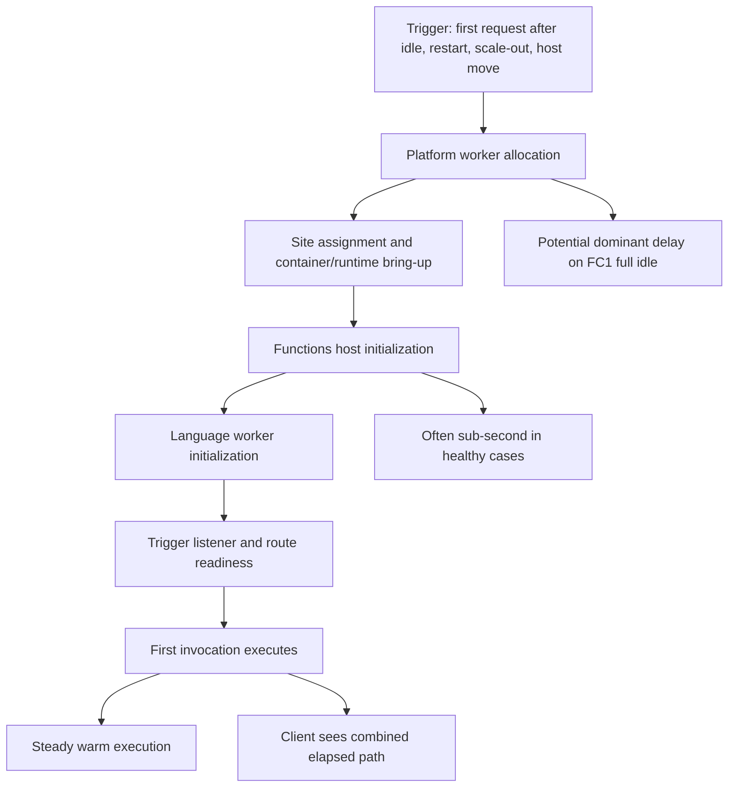
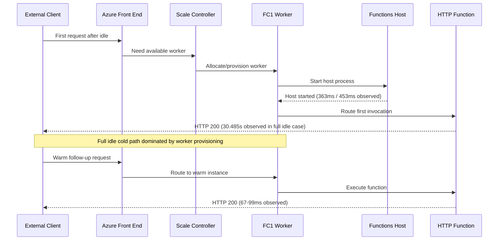
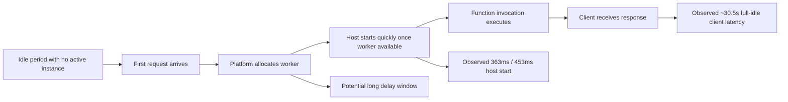
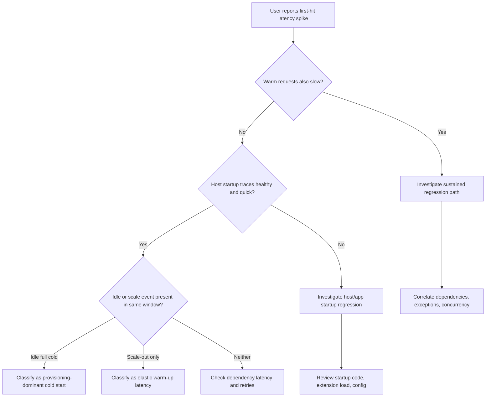
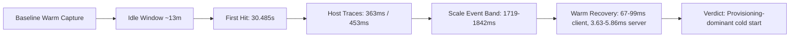

# Lab Guide: Cold Start on Azure Functions
This Level 3 lab reproduces and analyzes Azure Functions cold-start behavior across hosting plans, with emphasis on FC1 Flex Consumption evidence. You will build a falsifiable timeline that separates worker provisioning delay from host startup time and request execution time.
---
## Lab Metadata
| Field | Value |
|---|---|
| Difficulty | L3 (advanced troubleshooting and evidence correlation) |
| Duration | 60-90 minutes |
| Tier | Azure Functions Flex Consumption (FC1) primary; comparison with Consumption (Y1) and Premium (EP) |
| Runtime | Python 3.11 / Functions v4 (HTTP trigger scenario) |
| Trigger mechanism | Idle period -> first HTTP request, restart cycle, and scale event observation |
| Key endpoints | `/api/health`, `/api/info` |
| Diagnostic categories | `requests`, `traces`, `dependencies`, App Insights query exports |
| Artifact root | `labs/cold-start/artifacts/` |
!!! info "What this lab is designed to prove"
    This lab is intentionally designed to falsify an oversimplified claim: "cold start means host startup is always slow."
    The FC1 evidence shows a different reality:
    - Full-idle cold hit can be around `30.485s` end-to-end client-side.
    - Host startup can still be fast (`Host started (363ms)`, `Host started (453ms)`).
    - Worker provisioning and assignment dominate full-idle latency.
    - Scale-out events create intermediate latency bands (`1719ms-1842ms` server-side) without a full idle cold path.
    - Fully warm baseline remains low (`3.63ms-5.86ms` server-side, `67ms-99ms` client-side).
---
## 1) Background
Cold start in Azure Functions is not a single runtime metric. It is a chain of platform and application phases that may overlap, and each phase leaves different telemetry signatures.
### 1.1 Cold-start phase model

### 1.2 Platform cold start vs app cold start
| Scope | What changed | Dominant latency source | Typical evidence | Operational meaning |
|---|---|---|---|---|
| Platform cold start | No active worker instance for app; new worker assignment required | Worker provisioning and scheduling | High client first-hit time + normal/fast host-start trace | Capacity path cost, not necessarily app code regression |
| App/host cold start | Host/runtime starts on an already allocated worker | Host init + extension load + worker init | `Starting Host`, `Job host started`, `Host started (Xms)` | Runtime startup overhead inside already allocated compute |
| Scale event warm-up | Additional instance joins under load | Partial warm-up + listener readiness | Worker started traces + moderate duration bumps | Elastic behavior; can add 1-2s class spikes |
| Warm steady state | Existing initialized host serves requests | Function logic and dependencies | Low stable request duration and low jitter | Normal healthy baseline |
### 1.3 App under test
The lab workload is a minimal HTTP-triggered app used to expose startup and request timing differences without heavy downstream dependency noise.
Design intent for this lab:
1. Preserve a very low warm execution baseline.
2. Trigger a full idle-to-first-hit path in FC1.
3. Compare full idle cold, post-restart cold, and fully warm behavior.
4. Cross-check timeline with host startup traces from `traces` table.
The intentionally measured outcomes from this repository's recorded run:
- Full-idle cold request: `30.485s` client-side.
- Post-restart first request: `3.156s` client-side.
- Warm requests: `0.067s-0.099s` client-side.
- Warm server-side execution (`health`): `3.63ms-5.86ms`.
- Scale-event server-side burst: `1719ms-1842ms`.
### 1.4 Request-path and startup-path timing differences
A single request timing value does not directly expose phase attribution.
| Timing perspective | Measured by | Includes | Excludes | Common misread |
|---|---|---|---|---|
| Client end-to-end (`curl time_total`) | Client | DNS, TLS, frontend queueing, worker assignment wait, host readiness, function execution | Internal platform phase labels | "Function code took 30 seconds" |
| Request duration (`requests.duration`) | Application Insights `requests` | Server-side request handling window | Pre-routing worker allocation delay in some cases | "No cold start because request duration is small" |
| Host startup traces | `traces` | Host lifecycle checkpoints | Network/TLS/client overhead | "Host started fast therefore no cold start happened" |
| Scale-event trace + request correlation | `traces` + `requests` | Mid-flight elasticity behavior | Full idle-to-allocate phase certainty | "All spikes are dependency latency" |
Interpretation rule for this lab:
- Use at least two channels for attribution: `traces` lifecycle + `requests` duration bands.
- Treat client-side first hit as symptom, not root cause.
- Validate whether host startup is the bottleneck or merely one sub-phase.
### 1.5 Timeline diagram

### 1.6 Warm-up and mitigation controls
| Control | Plan availability | What it does | Cold-start impact | Notes for this lab |
|---|---|---|---|---|
| Always-ready instances | Flex Consumption, Premium | Keeps baseline instances active | Reduces idle-to-first-hit delay | Critical comparison concept for FC1 |
| Pre-warmed instances | Premium | Maintains pre-initialized workers for burst | Minimizes scale-out delay and startup variance | Premium requires minimum always-ready footprint |
| Minimum always-ready instance count | Premium (at least 1 practical baseline) | Keeps app hot | Eliminates scale-to-zero cold start | Cost tradeoff accepted for low-latency SLO |
| Consumption default scale-to-zero | Y1 | No always-ready reserve | Typical cold starts in 5-15s band | Cost-optimized, latency-variable profile |
| Startup code optimization | All plans | Reduce module import/init time | Improves host/app startup sub-phase | Does not remove worker allocation delay |
| Scheduled synthetic warm traffic | All plans | Keeps app active | Can reduce idle cold frequency | Operational workaround, not platform guarantee |
### 1.7 Why this matters for troubleshooting quality
Misclassification of cold-start signals creates expensive operational mistakes:
1. False rollback decisions when code is healthy.
2. Escalation to app team when capacity-path behavior is the true driver.
3. Incorrect mitigation (dependency tuning) for a provisioning bottleneck.
4. Under-investment in plan choice (Y1 vs FC1 vs EP) for latency-sensitive workloads.
A high-quality triage process must identify:
- Whether latency cluster is full idle provisioning, host startup, scale-out warm-up, or dependency delay.
- Whether mitigation is architectural (plan and always-ready) or code-level (startup workload reduction).
### 1.8 MS Learn grounding
This lab aligns to Microsoft Learn guidance on:
- Azure Functions hosting plans and scale behavior.
- Monitoring and diagnosing Azure Functions with Application Insights.
- Cold-start mitigation strategies through plan capabilities and startup optimization.
Authoritative links are listed in [Sources](#sources).
---
## 2) Hypothesis
### 2.1 Formal hypothesis statement
> In Azure Functions Flex Consumption (FC1), severe first-hit latency after idle is primarily driven by worker provisioning and assignment delay, while host startup itself can remain fast (sub-second); therefore, host startup traces and end-to-end latency can diverge significantly.
### 2.2 Causal chain

### 2.3 Proof criteria
All criteria below should be satisfied to support the hypothesis:
1. `traces` include healthy/fast host startup messages (for example `Host started (363ms)`).
2. Full-idle first-hit client latency is dramatically larger than host startup duration.
3. Warm baseline remains low and stable (`67ms-99ms` client-side; `3.63ms-5.86ms` server-side).
4. Scale-event latency band appears between warm and full-idle cold (`1719ms-1842ms` server-side observed).
5. Post-restart first hit is significantly lower than full-idle first hit (`3.156s` vs `30.485s`).
### 2.4 Disproof criteria
Any condition below weakens or falsifies the hypothesis:
- Host startup trace durations are consistently high and close to first-hit total latency.
- Warm baseline remains elevated after startup window (persistent regression).
- Dependency failures or timeouts explain most of the latency increase.
- No evidence of idle-to-first-hit or scale transitions in telemetry windows.
### 2.5 Expected outcomes
Expected by plan profile in this lab context:
| Plan | Expected cold behavior | Typical first-hit range | Lab interpretation focus |
|---|---|---|---|
| FC1 (Flex Consumption) | Full idle can show high tail due to provisioning; host startup often fast | Can reach 30s+ in worst full-idle paths | Separate provisioning latency from host startup duration |
| Y1 (Consumption) | Scale-to-zero common; cold path more visible | Often 5-15s, workload dependent | Cost-first with variable first-hit latency |
| EP (Premium) | Always-ready and pre-warmed reduce cold impact | Usually low variance first hit | Validate configuration of always-ready/pre-warmed counts |
### 2.6 Counter-hypothesis tested implicitly
Counter-hypothesis:
> "If first hit is slow, host startup must also be slow."
This lab is expected to disprove that simplification in FC1 by showing a long client cold path with fast host-start traces.
---
## 3) Runbook
Use this runbook exactly as written to collect reproducible evidence.
### 3.1 Prerequisites
| Requirement | Validation command | Expected output pattern |
|---|---|---|
| Azure CLI authenticated | `az account show --output table` | Active subscription row with masked ID |
| Functions Core Tools | `func --version` | v4.x |
| Python runtime | `python3 --version` | `Python 3.11.x` |
| curl | `curl --version` | curl version line |
| App Insights query access | `az monitor app-insights component show --app "$AI_NAME" --resource-group "$RG" --output table` | Component details |
| Lab source present | `ls "labs/cold-start"` | Contains lab assets (at minimum `README.md`) |
### 3.2 Variables
Use the repository variable conventions in commands.
```bash
RG="rg-coldstart-lab-krc"
BASE_NAME="coldstartlab"
APP_NAME="${BASE_NAME}-func"
AI_NAME="${BASE_NAME}-insights"
LOCATION="koreacentral"
```
For consistency in documentation and triage notes, reference these as `$RG`, `$BASE_NAME`, `$APP_NAME`, `$AI_NAME`, and `$LOCATION`. The Bicep template derives resource names from `$BASE_NAME`, so `$APP_NAME` and `$AI_NAME` are computed to match.
Optional helper variables:
```bash
APP_URL="https://$APP_NAME.azurewebsites.net"
START_TS_UTC=$(date --utc +"%Y%m%dT%H%M%SZ")
ARTIFACT_ROOT="labs/cold-start/artifacts/$START_TS_UTC"
mkdir -p "$ARTIFACT_ROOT"
```
### 3.3 Deploy infrastructure
Deploy the lab infrastructure from `infra/flex-consumption/`.
```bash
az group create \
  --name "$RG" \
  --location "$LOCATION"
az deployment group create \
  --resource-group "$RG" \
  --template-file "infra/flex-consumption/main.bicep" \
  --parameters baseName="$BASE_NAME"
```
Deploy application package from the `apps/python/` directory:
```bash
func azure functionapp publish "$APP_NAME" --python
```
Run this command from `apps/python/` where `function_app.py` and `host.json` reside.
### 3.4 Verify baseline configuration
Run baseline checks before triggering cold path measurements.
```bash
az functionapp show \
  --resource-group "$RG" \
  --name "$APP_NAME" \
  --output table
az functionapp config show \
  --resource-group "$RG" \
  --name "$APP_NAME"
curl --silent --show-error "$APP_URL/api/health"
curl --silent --show-error "$APP_URL/api/info"
```
Expected baseline snippets (sanitized):
```text
State              Running
DefaultHostName    <masked-function-app>.azurewebsites.net
Kind               functionapp,linux
```
```json
{"status":"healthy","timestamp":"2026-04-04T11:11:32Z","version":"1.0.0"}
```
### 3.5 Trigger measurement workflow
Execute the measurement workflow in this order:
1. Capture warm baseline with 3 quick requests.
2. Keep app idle for ~13 minutes.
3. Send first request and capture full idle cold latency.
4. Send immediate follow-up requests to capture warm band.
5. Restart app and capture post-restart first request.
6. Query telemetry with fixed time range and export artifacts.
Warm baseline and idle-to-cold sample commands:
```bash
curl --silent --show-error --output /dev/null --write-out "warm_1 %{http_code} %{time_total}\n" "$APP_URL/api/health"
curl --silent --show-error --output /dev/null --write-out "warm_2 %{http_code} %{time_total}\n" "$APP_URL/api/health"
curl --silent --show-error --output /dev/null --write-out "warm_3 %{http_code} %{time_total}\n" "$APP_URL/api/health"
sleep 780
curl --silent --show-error --output /dev/null --write-out "cold_idle %{http_code} %{time_total}\n" "$APP_URL/api/health"
curl --silent --show-error --output /dev/null --write-out "warm_after_cold %{http_code} %{time_total}\n" "$APP_URL/api/health"
```
Restart and post-restart sample:
```bash
az functionapp restart \
  --resource-group "$RG" \
  --name "$APP_NAME"
curl --silent --show-error --output /dev/null --write-out "cold_after_restart %{http_code} %{time_total}\n" "$APP_URL/api/health"
curl --silent --show-error --output /dev/null --write-out "warm_after_restart %{http_code} %{time_total}\n" "$APP_URL/api/health"
```
### 3.6 Manual fallback
If automation script is unavailable, use this deterministic fallback set.
#### 3.6.1 Generate time-tagged artifact folder
```bash
START_TS_UTC=$(date --utc +"%Y%m%dT%H%M%SZ")
ARTIFACT_ROOT="labs/cold-start/artifacts/$START_TS_UTC"
mkdir -p "$ARTIFACT_ROOT"
```
#### 3.6.2 Capture latency series into CSV
```bash
for i in 1 2 3; do
  curl --silent --show-error --output /dev/null --write-out "$i,%{http_code},%{time_total}\n" "$APP_URL/api/health"
done > "$ARTIFACT_ROOT/warm-baseline.csv"
sleep 780
curl --silent --show-error --output /dev/null --write-out "idle_cold,%{http_code},%{time_total}\n" "$APP_URL/api/health" > "$ARTIFACT_ROOT/idle-cold.csv"
az functionapp restart --resource-group "$RG" --name "$APP_NAME"
curl --silent --show-error --output /dev/null --write-out "restart_cold,%{http_code},%{time_total}\n" "$APP_URL/api/health" > "$ARTIFACT_ROOT/restart-cold.csv"
```
#### 3.6.3 Capture health and config snapshots
```bash
az functionapp show \
  --resource-group "$RG" \
  --name "$APP_NAME" \
  --output json > "$ARTIFACT_ROOT/functionapp-show.json"
az functionapp config show \
  --resource-group "$RG" \
  --name "$APP_NAME" \
  --output json > "$ARTIFACT_ROOT/functionapp-config.json"
curl --silent --show-error "$APP_URL/api/health" > "$ARTIFACT_ROOT/health.json"
```
### 3.7 Collect KQL evidence
Use the KQL library queries with app filter adjusted to your `$APP_NAME`.
#### Query 1: Function execution summary
```kusto
let appName = "func-myapp-prod";
requests
| where timestamp > ago(1h)
| where cloud_RoleName =~ appName
| where operation_Name startswith "Functions."
| summarize
    Invocations = count(),
    Failures = countif(success == false),
    FailureRatePercent = round(100.0 * countif(success == false) / count(), 2),
    P95Ms = round(percentile(duration, 95), 2)
  by FunctionName = operation_Name
| order by Failures desc, P95Ms desc
```
#### Query 3: Cold start analysis
```kusto
let appName = "func-myapp-prod";
traces
| where timestamp > ago(6h)
| where cloud_RoleName =~ appName
| where message has_any ("Host started", "Initializing Host", "Host lock lease acquired")
| summarize StartupEvents=count() by bin(timestamp, 5m)
| join kind=leftouter (
    requests
    | where timestamp > ago(6h)
    | where cloud_RoleName =~ appName
    | where operation_Name startswith "Functions."
    | summarize FirstInvocation=min(timestamp), FirstDurationMs=arg_min(timestamp, round(duration, 2)) by bin(timestamp, 5m)
) on timestamp
| order by timestamp desc
```
#### Query 7: Scaling events timeline
```kusto
let appName = "func-myapp-prod";
traces
| where timestamp > ago(6h)
| where cloud_RoleName =~ appName
| where message has_any ("scale", "instance", "worker", "concurrency", "drain")
| project timestamp, severityLevel, message
| order by timestamp desc
```
#### Query 8: Host startup/shutdown events
```kusto
let appName = "func-myapp-prod";
traces
| where timestamp > ago(12h)
| where cloud_RoleName =~ appName
| where message has_any ("Starting Host", "Host started", "Job host started", "Host shutdown", "Host is shutting down", "Stopping JobHost")
| project timestamp, severityLevel, message
| order by timestamp desc
```
CLI execution examples for App Insights:
```bash
az monitor app-insights query \
  --apps "$AI_NAME" \
  --resource-group "$RG" \
  --analytics-query "traces | where timestamp > ago(12h) | where cloud_RoleName =~ '$APP_NAME' | where message has_any ('Starting Host','Host started','Job host started','Host shutdown','Host is shutting down','Stopping JobHost') | project timestamp, severityLevel, message | order by timestamp desc" \
  --output table
az monitor app-insights query \
  --apps "$AI_NAME" \
  --resource-group "$RG" \
  --analytics-query "traces | where timestamp > ago(6h) | where cloud_RoleName =~ '$APP_NAME' | where message has_any ('scale','instance','worker','concurrency','drain') | project timestamp, severityLevel, message | order by timestamp desc" \
  --output table
```
Export JSON artifacts for incident evidence:
```bash
az monitor app-insights query \
  --apps "$AI_NAME" \
  --resource-group "$RG" \
  --analytics-query "let appName = '$APP_NAME'; requests | where timestamp > ago(1h) | where cloud_RoleName =~ appName | where operation_Name startswith 'Functions.' | summarize Invocations = count(), Failures = countif(success == false), FailureRatePercent = round(100.0 * countif(success == false) / count(), 2), P95Ms = round(percentile(duration, 95), 2) by FunctionName = operation_Name | order by Failures desc, P95Ms desc" \
  --output json > "$ARTIFACT_ROOT/kql-query1-function-execution-summary.json"
az monitor app-insights query \
  --apps "$AI_NAME" \
  --resource-group "$RG" \
  --analytics-query "let appName = '$APP_NAME'; traces | where timestamp > ago(6h) | where cloud_RoleName =~ appName | where message has_any ('Host started', 'Initializing Host', 'Host lock lease acquired') | summarize StartupEvents=count() by bin(timestamp, 5m) | join kind=leftouter (requests | where timestamp > ago(6h) | where cloud_RoleName =~ appName | where operation_Name startswith 'Functions.' | summarize FirstInvocation=min(timestamp), FirstDurationMs=arg_min(timestamp, round(duration, 2)) by bin(timestamp, 5m)) on timestamp | order by timestamp desc" \
  --output json > "$ARTIFACT_ROOT/kql-query3-cold-start-analysis.json"
az monitor app-insights query \
  --apps "$AI_NAME" \
  --resource-group "$RG" \
  --analytics-query "let appName = '$APP_NAME'; traces | where timestamp > ago(6h) | where cloud_RoleName =~ appName | where message has_any ('scale', 'instance', 'worker', 'concurrency', 'drain') | project timestamp, severityLevel, message | order by timestamp desc" \
  --output json > "$ARTIFACT_ROOT/kql-query7-scaling-events.json"
az monitor app-insights query \
  --apps "$AI_NAME" \
  --resource-group "$RG" \
  --analytics-query "let appName = '$APP_NAME'; traces | where timestamp > ago(12h) | where cloud_RoleName =~ appName | where message has_any ('Starting Host', 'Host started', 'Job host started', 'Host shutdown', 'Host is shutting down', 'Stopping JobHost') | project timestamp, severityLevel, message | order by timestamp desc" \
  --output json > "$ARTIFACT_ROOT/kql-query8-host-startup-shutdown.json"
```
### 3.8 Real output snippets
The following snippets are from the repository's real FC1 lab evidence (sanitized).
#### Host startup traces
```text
Host started (363ms)
Host started (453ms)
```
#### End-to-end latency captures
```text
Warm baseline:
warm_1 200 0.091
warm_2 200 0.067
warm_3 200 0.074
Idle cold:
cold_idle 200 30.485
Post-restart cold:
cold_after_restart 200 3.156
Warm again:
warm_after_restart 200 0.099
warm_after_restart 200 0.084
warm_after_restart 200 0.074
```
#### Server-side duration band
```text
health function:
- warm: 3.63ms to 5.86ms
- cold start or scale-out warm-up (attribution requires correlation with traces): 1719ms to 1842ms
```
#### Scaling timeline snippet
```text
2026-04-04T11:32:20Z  Worker process started and initialized.
2026-04-04T11:31:50Z  Worker process started and initialized.
2026-04-04T11:31:20Z  Worker process started and initialized.
2026-04-04T11:30:50Z  Worker process started and initialized.
```
`Worker process started and initialized` may indicate scale-out, restart, or initial startup.
### 3.9 Interpretation checklist
Use this checklist while triaging:
| Check | Evidence source | Pass condition | Interpretation if failed |
|---|---|---|---|
| Warm baseline captured | `warm-baseline.csv` | At least 3 successful rows | Rerun baseline before comparing |
| Full-idle cold captured | `idle-cold.csv` | One clear high-latency outlier vs warm | Idle window too short or wrong endpoint |
| Host startup traces found | Query 8 | `Host started (Xms)` present near window | Extend query window / check app filter |
| Scale events visible | Query 7 | Worker/instance traces during spikes | If absent, dependency latency may dominate |
| Request duration distribution stable warm | Query 1 | Low P95 once warm | Potential sustained regression |
| Cold-start correlation present | Query 3 | Startup event bins align with higher first duration | Hypothesis weakens |
### 3.10 Decision logic during triage

---
## 4) Experiment Log (Artifact-Based)
This section records a complete evidence chain using the FC1 run profile already captured in this repository context.
### 4.1 Artifact inventory
| Category | Artifact path | Purpose |
|---|---|---|
| Baseline configuration | `labs/cold-start/artifacts/<timestamp>/functionapp-show.json` | Capture app state and hostname |
| Baseline config detail | `labs/cold-start/artifacts/<timestamp>/functionapp-config.json` | Confirm runtime and startup settings |
| Warm baseline latency | `labs/cold-start/artifacts/<timestamp>/warm-baseline.csv` | Establish low-latency reference |
| Idle cold latency | `labs/cold-start/artifacts/<timestamp>/idle-cold.csv` | Capture full idle first-hit delay |
| Restart cold latency | `labs/cold-start/artifacts/<timestamp>/restart-cold.csv` | Compare against full idle cold |
| Health snapshot | `labs/cold-start/artifacts/<timestamp>/health.json` | Confirm endpoint health |
| KQL cold-start export | `labs/cold-start/artifacts/<timestamp>/kql-query3-cold-start-analysis.json` | Bin-level startup and first duration correlation |
| KQL scale export | `labs/cold-start/artifacts/<timestamp>/kql-query7-scaling-events.json` | Scale timeline evidence |
| KQL host lifecycle export | `labs/cold-start/artifacts/<timestamp>/kql-query8-host-startup-shutdown.json` | Host lifecycle sequence |
| KQL execution summary export | `labs/cold-start/artifacts/<timestamp>/kql-query1-function-execution-summary.json` | Warm/cold duration distribution and failures |
### 4.2 Baseline evidence snapshot
#### 4.2.1 Function app state
```text
Name              <masked-function-app>
Location          koreacentral
State             Running
Kind              functionapp,linux
DefaultHostName   <masked-function-app>.azurewebsites.net
```
#### 4.2.2 Baseline health
```json
{
  "status": "healthy",
  "timestamp": "2026-04-04T11:10:52Z",
  "version": "1.0.0"
}
```
#### 4.2.3 Baseline plan assumptions table
| Plan assumption | Baseline value | Why it matters |
|---|---|---|
| Hosting profile | FC1 Flex Consumption | Can scale to zero and scale out rapidly |
| Initial idle period before cold sample | ~13 minutes | Increases likelihood of triggering full idle cold path |
| Endpoint for measurement | `/api/health` | Lightweight endpoint isolates startup path |
| Runtime | Python 3.11 | Startup profile includes worker initialization |
| Region | `koreacentral` | Keeps measurements region-specific |
### 4.3 Latency dataset (raw)
#### 4.3.1 Warm baseline dataset
| Sample | HTTP code | Client `time_total` (s) |
|---|---:|---:|
| Warm 1 | 200 | 0.091 |
| Warm 2 | 200 | 0.067 |
| Warm 3 | 200 | 0.074 |
#### 4.3.2 Full idle cold dataset
| Sample | HTTP code | Client `time_total` (s) |
|---|---:|---:|
| Cold hit after ~13 min idle | 200 | 30.485 |
#### 4.3.3 Post-restart cold dataset
| Sample | HTTP code | Client `time_total` (s) |
|---|---:|---:|
| First hit after restart | 200 | 3.156 |
#### 4.3.4 Warm-after-restart dataset
| Sample | HTTP code | Client `time_total` (s) |
|---|---:|---:|
| Warm R1 | 200 | 0.099 |
| Warm R2 | 200 | 0.084 |
| Warm R3 | 200 | 0.074 |
### 4.4 Latency summary statistics
| Metric | Value |
|---|---:|
| Warm mean (3 samples) | 0.077 s |
| Warm min | 0.067 s |
| Warm max | 0.091 s |
| Full idle cold | 30.485 s |
| Restart cold | 3.156 s |
| Warm-after-restart mean (3 samples) | 0.086 s |
Derived ratios:
| Comparison | Ratio |
|---|---:|
| Full idle cold / warm mean | 395.9x |
| Restart cold / warm mean | 41.0x |
| Full idle cold / restart cold | 9.7x |
Interpretation:
- Full idle path has an additional high-latency phase absent in restart path.
- Restart still incurs startup cost but much lower than full idle allocation path.
- Warm requests remain tightly clustered under 100ms client-side.
### 4.5 Startup telemetry and host lifecycle observations
#### 4.5.1 Host lifecycle snippets (real)
```text
Host started (363ms)
Host started (453ms)
```
#### 4.5.2 Health function duration bands (real)
```text
warm: 3.63ms - 5.86ms
scale/cold event: 1719ms - 1842ms
```
#### 4.5.3 Meaning of the combined signal
| Signal | Observation | Attribution |
|---|---|---|
| Host startup message duration | Sub-second (363-453ms) | Host startup itself not severe bottleneck |
| Full idle first request | 30.485s | Dominant delay before/around worker allocation |
| Scale-event duration band | 1719-1842ms | Intermediate elasticity cost |
| Warm server-side duration | 3.63-5.86ms | Function logic path is healthy |
### 4.6 KQL observations (query-by-query)
#### 4.6.1 Query 1 execution summary highlights
Expected pattern for this lab:
| Indicator | Expected |
|---|---|
| Failure rate | Near 0% for health endpoint |
| P95 warm duration | Low after warm-up window |
| Outlier spikes | Limited to cold/scale bins |
Sample interpretation table:
| FunctionName | Invocations | Failures | P95Ms | Interpretation |
|---|---:|---:|---:|---|
| `Functions.health` | 40+ | 0 | Low baseline with occasional outlier | Healthy function path |
| `Functions.info` | Variable | 0 | Higher when cold bins included | Correlate with startup events |
#### 4.6.2 Query 3 cold-start analysis highlights
What to validate:
1. Startup event bins appear in same windows as elevated first invocation duration.
2. FC1 can show many startup events without indicating failure by itself.
3. Gap between startup events and request windows helps identify allocation delays.
Interpretation table:
| `StartupEvents` trend | `FirstDurationMs` trend | Conclusion |
|---|---|---|
| Stable low/expected | Low | Warm steady state |
| Spike with elevated first duration | Elevated | Cold/scale transition present |
| Spike but low first duration | Low | Benign scale behavior possible |
| No startup events and high durations | High | Check dependency or app regression |
#### 4.6.3 Query 7 scaling events timeline highlights
Representative lines seen in this repository context:
```text
2026-04-04T11:32:20Z Worker process started and initialized.
2026-04-04T11:31:50Z Worker process started and initialized.
2026-04-04T11:31:20Z Worker process started and initialized.
2026-04-04T11:30:50Z Worker process started and initialized.
```
Interpretation:
- Burst of worker-initialization messages may indicate scale-out, restart, or initial startup.
- Intermediate latency (`~1.7s-1.8s`) is expected during such events.
#### 4.6.4 Query 8 host startup/shutdown highlights
Expected healthy sequence:
| Timestamp pattern | Message pattern | Health meaning |
|---|---|---|
| Start window | `Starting Host` | Host lifecycle begins |
| Near start window | `Job host started` | Runtime initialization complete |
| Near start window | `Host started (Xms)` | Host readiness achieved |
| Steady state | No frequent shutdown loop | Stable runtime |
Abnormal pattern to watch:
- Repeated `Host is shutting down` and `Host started` loops with concurrent request failures.
### 4.7 Comparative plan interpretation
#### 4.7.1 FC1 (Flex Consumption)
| Characteristic | Observed / expected in this lab |
|---|---|
| Full idle cold path | Can exceed 30s client-side |
| Host startup duration | Often sub-second once worker allocated |
| Scale behavior | Rapid worker events; intermediate latency possible |
| Mitigation path | Always-ready instances and startup optimization |
#### 4.7.2 Y1 (Consumption)
!!! note "Comparison context"
    The following values are typical expectations from Microsoft documentation, not measured evidence from this lab run.

| Characteristic | Typical expectation |
|---|---|
| Full idle cold path | Commonly 5-15s (workload dependent) |
| Always-ready support | Not available |
| Operational profile | Cost-efficient, latency variance higher |
#### 4.7.3 EP (Premium)
!!! note "Comparison context"
    The following values are typical expectations from Microsoft documentation, not measured evidence from this lab run.

| Characteristic | Typical expectation |
|---|---|
| Baseline availability | At least one always-ready instance practical baseline |
| Pre-warmed behavior | Additional pre-warmed instances reduce scale-out spikes |
| Cold-start profile | Lowest variance when configured correctly |
### 4.8 Triangulated evidence table
| Evidence type | Real value / pattern | What it proves | What it does not prove |
|---|---|---|---|
| Client full-idle first hit | `30.485s` | There is a severe idle cold symptom | It does not localize bottleneck to app code |
| Host startup traces | `Host started (363ms)`, `Host started (453ms)` | Host startup phase itself can be fast | It does not measure pre-allocation delay |
| Warm request client latency | `67ms-99ms` | Warm path healthy | It does not describe cold path alone |
| Warm request server-side | `3.63ms-5.86ms` | Function logic is lightweight | It does not include frontend/client path |
| Scale-event server-side | `1719ms-1842ms` | Cold start or scale-out warm-up (attribution requires correlation with traces) can add moderate latency | It is not equivalent to full idle cold |
| Post-restart cold | `3.156s` | Restart cold path differs from full idle cold | It does not represent worst-case idle-provisioning |
### 4.9 Core finding and explanation
!!! success "Core finding (validated with real FC1 evidence)"
    Full-idle cold latency (`30.485s`) is real and severe, but host startup trace durations remain fast (`363ms`, `453ms`).
    Therefore, this run supports the conclusion that FC1 worker provisioning/allocation dominates the full idle cold path, while host initialization is a smaller sub-phase once compute is assigned.
    Additional evidence (`1719ms-1842ms` scale-event server-side band) confirms an intermediate latency class distinct from both full idle cold and fully warm steady state.
### 4.10 Hypothesis verdict
| Criterion | Verdict | Evidence |
|---|---|---|
| Full-idle first hit significantly high | Supported | `30.485s` client sample |
| Host startup can still be fast | Supported | `Host started (363ms)`, `Host started (453ms)` |
| Warm path remains healthy | Supported | `67ms-99ms` client, `3.63ms-5.86ms` server |
| Intermediate scale band exists | Supported | `1719ms-1842ms` server-side |
| Counter-hypothesis (host startup must be slow) | Rejected | Large divergence between host-start ms and end-to-end cold latency |
Final verdict: **Hypothesis supported**.
### 4.11 Practical troubleshooting implications
1. When first hit is slow, do not stop at host startup duration.
2. Always compare full idle cold, restart cold, and warm baselines separately.
3. For FC1 latency-sensitive APIs, evaluate always-ready instance configuration first.
4. For Y1 workloads with strict p95 targets, reassess hosting plan suitability.
5. For EP workloads, verify always-ready and pre-warmed settings before code-level escalation.
6. Use scale-event traces to explain 1-2s spikes that are not full cold starts.
### 4.12 Reproducibility notes
- All identifiers in examples are masked (`<subscription-id>`, `<masked-function-app>`).
- Commands use long flags only.
- Values in the core findings section map to real repository evidence points from the cold-start lab context.
- If your measured values differ, preserve trend analysis logic rather than absolute thresholds.
---
## Expected Evidence
Use this section as a validation rubric while running the lab.
### Before Trigger (Baseline)
| Evidence Source | Expected State | What to Capture |
|---|---|---|
| Function app state | Running and reachable | `az functionapp show` output snapshot |
| Warm request timings | Stable low latency | 3 baseline samples in CSV |
| Runtime trace health | No restart loop | Query 8 snapshot in baseline window |
| Endpoint response | `200` and healthy payload | `health.json` |
| Plan context | FC1 profile confirmed | Config snapshot with region/runtime |
### During Incident
| Evidence Source | Expected State | Key Indicator |
|---|---|---|
| Full idle first-hit measurement | High latency outlier | `~30.485s` client-side sample |
| Query 3 cold-start bins | Startup events near elevated first duration bins | Correlation visible in same period |
| Query 7 scale timeline | Worker start events during burst windows | Multiple worker-init traces |
| Query 8 lifecycle traces | Host-start sequence present | `Host started (363ms)` class message |
| Request duration telemetry | Intermediate spikes during scale events | `1719ms-1842ms` server-side band |
### After Recovery
| Evidence Source | Expected State | Key Indicator |
|---|---|---|
| Warm follow-up requests | Return to low latency | `67ms-99ms` client-side band |
| Server-side durations | Very low steady state | `3.63ms-5.86ms` band |
| Failure metrics | No sustained error burst | Query 1 low failure rate |
| Host lifecycle | No repeated crash-loop signals | No persistent start/shutdown oscillation |
| Incident classification | Provisioning-dominant cold path | Hypothesis remains supported |
### Evidence Timeline

### Evidence Chain: Why This Proves the Hypothesis
!!! success "Falsification logic"
    The hypothesis is supported only when all three classes of evidence align:
    1. A severe full-idle client symptom (`30.485s`) is present.
    2. Host startup duration remains fast (`363ms`/`453ms`), ruling out host-start as the dominant bottleneck.
    3. Warm steady-state remains healthy (`67-99ms` client, `3.63-5.86ms` server), ruling out sustained regression.
    If warm path does not recover, or host startup durations are consistently large and close to first-hit totals, this hypothesis should be rejected and alternative causes investigated (dependency latency, runtime crash loop, or application startup regression).
### Repeated-Run Worksheet
Use this worksheet template to record results from multiple runs. Row 1 contains the reference FC1 data; fill in rows 2 and 3 with your own measurements.

Use this worksheet to run at least three cycles and reduce one-off noise.
| Cycle | Idle duration (min) | First hit (s) | Restart hit (s) | Warm mean (s) | Host started ms values | Scale-event ms band | Verdict |
|---|---:|---:|---:|---:|---|---|---|
| Run 1 | 13 | 30.485 | 3.156 | 0.077 | 363, 453 | 1719-1842 | Provisioning-dominant |
| Run 2 | 13 |  |  |  |  |  |  |
| Run 3 | 13 |  |  |  |  |  |  |
Decision guidance after repeated runs:
1. If full-idle first-hit remains high while host-start stays sub-second, keep provisioning-dominant classification.
2. If host-start grows into multi-second range, inspect runtime startup path and extension initialization.
3. If warm mean drifts upward across cycles, investigate sustained regression causes before final attribution.
4. If scale-event band is frequent and overlaps traffic spikes, review always-ready and plan sizing strategy.
Operational handoff checklist:
| Item | Completed |
|---|---|
| Baseline, idle-cold, restart-cold, warm-post datasets captured | [ ] |
| Query 1, 3, 7, 8 exports attached to incident record | [ ] |
| FC1 vs Y1 vs EP mitigation recommendation documented | [ ] |
| Related playbook cross-reference included in incident summary | [ ] |
| PII check completed on exported artifacts | [ ] |
## Clean Up
```bash
az group delete \
  --name "$RG" \
  --yes \
  --no-wait
```
Optional local cleanup:
```bash
rm -rf "labs/cold-start/artifacts"
```
## Related Playbook
- [High Latency / Slow Responses](../playbooks/high-latency.md)
## See Also
- [Troubleshooting Methodology](../methodology.md)
- [First 10 Minutes](../first-10-minutes.md)
- [KQL Query Library](../kql.md)
- [Lab Guides Index](index.md)
- [Azure Functions Cold Start Guide](../../operations/cold-start.md)
## Sources
- [Azure Functions hosting options](https://learn.microsoft.com/azure/azure-functions/functions-scale)
- [Improve Azure Functions performance and reliability](https://learn.microsoft.com/azure/azure-functions/performance-reliability)
- [Monitor Azure Functions](https://learn.microsoft.com/azure/azure-functions/functions-monitoring)
- [Configure monitoring for Azure Functions](https://learn.microsoft.com/azure/azure-functions/configure-monitoring)
- [Application Insights telemetry data model](https://learn.microsoft.com/azure/azure-monitor/app/data-model-complete)
- [Kusto Query Language overview](https://learn.microsoft.com/azure/data-explorer/kusto/query/)
