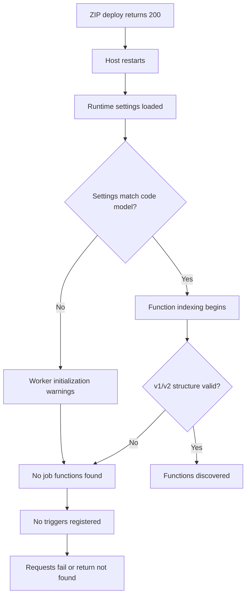
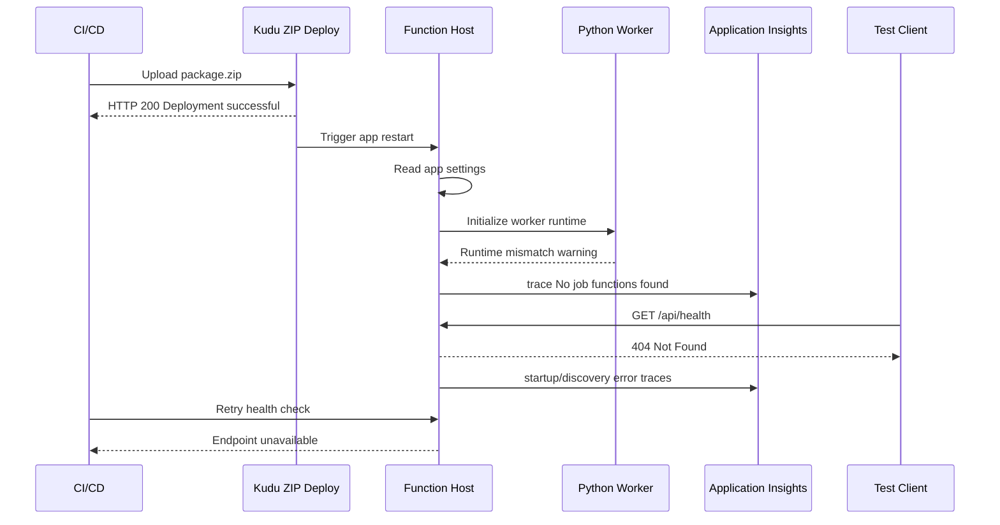
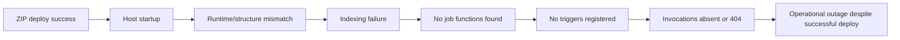
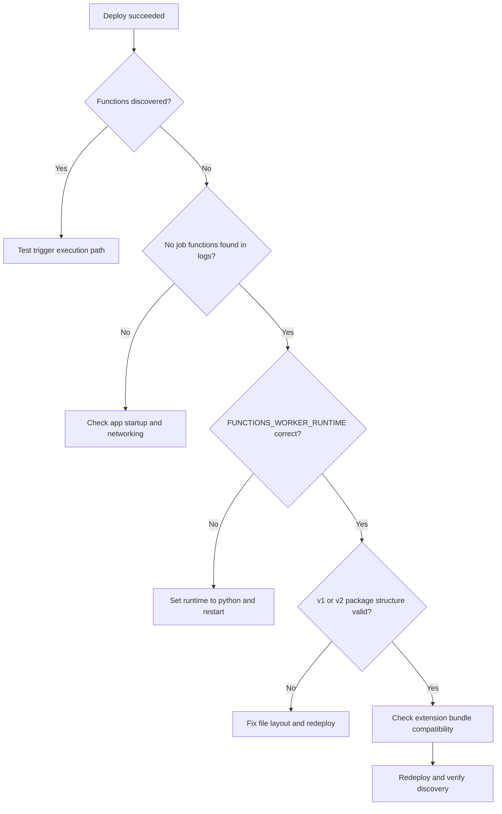

# Lab Guide: Deployment Succeeded but Function Not Running

This lab reproduces a deceptive failure mode where deployment succeeds with HTTP 200 but functions are not discoverable or executable at runtime. You will simulate several root-cause variants, including incorrect runtime configuration, Python v1 structure defects, and extension bundle mismatch. You will collect startup and discovery evidence, test competing hypotheses, and verify a robust fix path that covers both Python v1 and v2 programming models.

## Lab Metadata

| Field | Value |
|---|---|
| Difficulty | Intermediate / Advanced |
| Duration | 45-60 min |
| Hosting plan tested | Consumption / Premium / Flex Consumption |
| Trigger type | HTTP trigger + timer trigger for discovery validation |
| Azure services | Azure Functions, Azure Storage, Application Insights, Log Analytics, Kudu ZIP deploy |
| Skills practiced | Function discovery triage, host startup diagnostics, deployment validation, Python model migration checks |

## 1) Background

A successful ZIP deploy status indicates that deployment packaging and transfer completed, not that the host can discover and load functions. In practice, teams often treat `status=200` as end-to-end success and begin testing endpoints immediately, only to find that no triggers are active and no invocations appear. This creates a gap between CI/CD signals and runtime truth.

The failure can originate from runtime incompatibility. If `FUNCTIONS_WORKER_RUNTIME` does not match the deployed app language, the host may start partially but fail worker indexing. Similar outcomes occur when extension bundle versions are invalid for the target host version. Logs often include startup warnings and discovery errors such as `No job functions found`, but these messages are missed when telemetry queries focus only on deployment channels.

Python projects add model-specific pitfalls. In v1, missing `function.json` or missing `__init__.py` in function folders prevents function indexing. In v2, decorators define triggers, so package path issues or malformed imports can result in zero discovered functions even when files exist. The same repository can appear healthy in local runs but fail in cloud due to packaging differences.

This lab provides a controlled method to disambiguate these causes. You will deploy a baseline app, then inject faults one by one, collect evidence from `FunctionAppLogs`, `traces`, `requests`, `dependencies`, and `AppMetrics`, and validate recovery with explicit discovery checks across both Python models.

### Failure progression model



### Key metrics comparison

| Metric | Healthy | Degraded | Critical |
|---|---|---|---|
| Startup completion time | 10-35 s | 35-90 s | start loop with repeated failures |
| Discovered function count | expected full set | partial set | 0 discovered |
| `No job functions found` logs | 0 | occasional warning | repeated on every restart |
| HTTP test success rate | over 99% | 70-95% | under 10% |
| Host restart count per 30 min | 0-1 | 2-3 | 4+ |

### Timeline of a typical incident



## 2) Hypothesis

### Formal statement

If deployment artifacts are valid but runtime settings or model-specific project structure are incorrect, then Azure Functions host startup logs will show discovery errors (`No job functions found` and related startup failures), function count will be zero or incomplete, and correcting runtime configuration plus project structure will restore normal trigger registration.

### Causal chain



### Proof criteria

1. `FunctionAppLogs` or `traces` include `No job functions found` during startup after successful deployment.
2. Discovery-related errors correlate with missing function executions in `requests` and `dependencies`.
3. Fault injection for runtime mismatch and structure defect reproduces the same symptom.
4. Correcting runtime settings and code structure restores function discovery and execution.

### Disproof criteria

1. Functions are discovered and invokable while only network path errors occur.
2. No discovery/startup error signatures appear despite invocation failures.
3. Recovery occurs without runtime/structure correction, implying alternate cause.

## 3) Runbook

### Prerequisites

1. Authenticate and set target subscription:

    ```bash
    az login --output table
    az account set --subscription "<subscription-id>"
    az account show --output table
    ```

2. Verify Functions tooling:

    ```bash
    func --version
    python --version
    ```

3. Prepare two function packages:
    - `python-v1-valid.zip`
    - `python-v2-valid.zip`
    - `python-v1-missing-init.zip`
    - `python-v1-missing-function-json.zip`
    - `python-v2-runtime-mismatch.zip`

4. Ensure Application Insights workspace query access:

    ```bash
    az monitor app-insights component show --app "appi-func-deploy-001" --resource-group "rg-func-lab-deploy" --output table
    ```

5. Confirm resource provider availability:

    ```bash
    az provider register --namespace Microsoft.Web --output table
    az provider register --namespace Microsoft.Insights --output table
    az provider register --namespace Microsoft.Storage --output table
    ```

### Variables

```bash
RG="rg-func-lab-deploy"
LOCATION="koreacentral"
APP_NAME="func-deploy-lab-001"
STORAGE_NAME="stfuncdeploylab001"
PLAN_NAME="plan-func-deploy-y1"
APPINSIGHTS_NAME="appi-func-deploy-001"
SUBSCRIPTION_ID="<subscription-id>"
```

### Step 1: Deploy baseline infrastructure

```bash
az group create --name "$RG" --location "$LOCATION" --output table
az storage account create --name "$STORAGE_NAME" --resource-group "$RG" --location "$LOCATION" --sku Standard_LRS --kind StorageV2 --output table
az functionapp plan create --name "$PLAN_NAME" --resource-group "$RG" --location "$LOCATION" --sku Y1 --is-linux true --output table
az functionapp create --name "$APP_NAME" --resource-group "$RG" --plan "$PLAN_NAME" --runtime python --runtime-version 3.11 --functions-version 4 --storage-account "$STORAGE_NAME" --output table
az monitor app-insights component create --app "$APPINSIGHTS_NAME" --location "$LOCATION" --resource-group "$RG" --kind web --application-type web --output table
az functionapp config appsettings set --name "$APP_NAME" --resource-group "$RG" --settings "APPLICATIONINSIGHTS_CONNECTION_STRING=InstrumentationKey=xxxxxxxx-xxxx-xxxx-xxxx-xxxxxxxxxxxx;IngestionEndpoint=https://koreacentral-0.in.applicationinsights.azure.com/" --output table
```

### Step 2: Deploy function app code

Deploy a known-good v2 package.

```bash
az functionapp deployment source config-zip --name "$APP_NAME" --resource-group "$RG" --src "./artifacts/python-v2-valid.zip" --output table
az functionapp config appsettings set --name "$APP_NAME" --resource-group "$RG" --settings "FUNCTIONS_WORKER_RUNTIME=python" --output table
az functionapp restart --name "$APP_NAME" --resource-group "$RG" --output table
```

Switch to v1 package for model coverage later in the runbook.

```bash
az functionapp deployment source config-zip --name "$APP_NAME" --resource-group "$RG" --src "./artifacts/python-v1-valid.zip" --output table
az functionapp restart --name "$APP_NAME" --resource-group "$RG" --output table
```

### Step 3: Collect baseline evidence

Query A: Startup success traces.

```kusto
traces
| where timestamp > ago(30m)
| where cloud_RoleName == "func-deploy-lab-001"
| where message has_any ("Host started", "Generating", "found the following functions")
| project timestamp, severityLevel, message
| order by timestamp desc
```

```text
timestamp                    severityLevel  message
2026-04-05T03:05:11.117Z     1              Host started (Id=xxxxxxxx-xxxx-xxxx-xxxx-xxxxxxxxxxxx)
2026-04-05T03:05:08.291Z     1              Functions found: HttpHealth, TimerDigest
```

Query B: No discovery errors expected.

```kusto
FunctionAppLogs
| where TimeGenerated > ago(30m)
| where AppName == "func-deploy-lab-001"
| where Message has_any ("No job functions found", "Error indexing method", "Worker failed to initialize")
| project TimeGenerated, Level, Message
```

```text
No records matched.
```

Query C: Request success baseline.

```kusto
requests
| where timestamp > ago(30m)
| where cloud_RoleName == "func-deploy-lab-001"
| summarize total=count(), failures=countif(success==false), p95=percentile(duration,95) by bin(timestamp, 5m)
| extend failRate=100.0*failures/total
| order by timestamp asc
```

```text
timestamp                    total  failures  p95      failRate
2026-04-05T03:05:00.000Z     38     0         410 ms   0
2026-04-05T03:10:00.000Z     42     0         430 ms   0
```

Query D: Dependencies baseline.

```kusto
dependencies
| where timestamp > ago(30m)
| where cloud_RoleName == "func-deploy-lab-001"
| summarize total=count(), failures=countif(success==false) by type, target
| order by failures desc
```

```text
type      target                                total  failures
HTTP      management.azure.com                  22     0
Azure blob stfuncdeploylab001.blob.core.windows 36     0
```

Query E: Function count confirmation from logs.

```kusto
traces
| where timestamp > ago(30m)
| where cloud_RoleName == "func-deploy-lab-001"
| where message has "Functions found"
| project timestamp, message
| order by timestamp desc
```

```text
timestamp                    message
2026-04-05T03:05:08.291Z     Functions found: HttpHealth, TimerDigest
```

Query F: Startup metric trend (`AppMetrics`).

```kusto
AppMetrics
| where TimeGenerated > ago(30m)
| where AppRoleName == "func-deploy-lab-001"
| where Name in ("FunctionExecutionCount", "HostInstanceCount")
| summarize avgValue=avg(Val), maxValue=max(Val) by Name, bin(TimeGenerated, 5m)
| order by TimeGenerated asc
```

```text
TimeGenerated                Name                    avgValue  maxValue
2026-04-05T03:05:00.000Z     FunctionExecutionCount  37        42
2026-04-05T03:05:00.000Z     HostInstanceCount       1         1
```

### Step 4: Trigger the incident

Scenario A: Runtime mismatch fault (v2 package with incorrect worker runtime setting).

```bash
az functionapp config appsettings set --name "$APP_NAME" --resource-group "$RG" --settings "FUNCTIONS_WORKER_RUNTIME=node" --output table
az functionapp deployment source config-zip --name "$APP_NAME" --resource-group "$RG" --src "./artifacts/python-v2-runtime-mismatch.zip" --output table
az functionapp restart --name "$APP_NAME" --resource-group "$RG" --output table
```

Scenario B: Python v1 missing `__init__.py`.

```bash
az functionapp config appsettings set --name "$APP_NAME" --resource-group "$RG" --settings "FUNCTIONS_WORKER_RUNTIME=python" --output table
az functionapp deployment source config-zip --name "$APP_NAME" --resource-group "$RG" --src "./artifacts/python-v1-missing-init.zip" --output table
az functionapp restart --name "$APP_NAME" --resource-group "$RG" --output table
```

Scenario C: Python v1 missing `function.json`.

```bash
az functionapp deployment source config-zip --name "$APP_NAME" --resource-group "$RG" --src "./artifacts/python-v1-missing-function-json.zip" --output table
az functionapp restart --name "$APP_NAME" --resource-group "$RG" --output table
```

Scenario D: Extension bundle mismatch.

```bash
az functionapp deployment source config-zip --name "$APP_NAME" --resource-group "$RG" --src "./artifacts/python-v2-bundle-mismatch.zip" --output table
az functionapp restart --name "$APP_NAME" --resource-group "$RG" --output table
```

### Step 5: Collect incident evidence

Query G: Discovery failure signatures.

```kusto
FunctionAppLogs
| where TimeGenerated > ago(60m)
| where AppName == "func-deploy-lab-001"
| where Message has_any ("No job functions found", "Worker failed to initialize", "Error indexing method", "A host error has occurred")
| project TimeGenerated, Level, Message
| order by TimeGenerated asc
```

```text
TimeGenerated                Level    Message
2026-04-05T03:22:10.551Z     Error    No job functions found. Try making your job classes and methods public.
2026-04-05T03:31:18.922Z     Error    Worker failed to initialize language worker for runtime: node
2026-04-05T03:39:47.223Z     Error    Error indexing method 'Functions.HttpHealth'
```

Query H: Startup error traces.

```kusto
traces
| where timestamp > ago(60m)
| where cloud_RoleName == "func-deploy-lab-001"
| where message has_any ("No job functions found", "Host startup operation has failed", "Could not load file or assembly", "ExtensionBundle")
| project timestamp, severityLevel, message
| order by timestamp asc
```

```text
timestamp                    severityLevel  message
2026-04-05T03:31:18.101Z     3              Host startup operation has failed
2026-04-05T03:31:18.722Z     3              No job functions found.
2026-04-05T03:45:02.833Z     2              ExtensionBundle version is invalid for this host
```

Query I: Request absence / 404 pattern.

```kusto
requests
| where timestamp > ago(60m)
| where cloud_RoleName == "func-deploy-lab-001"
| summarize total=count(), failures=countif(success==false), notFound=countif(resultCode == "404") by bin(timestamp, 5m)
| order by timestamp asc
```

```text
timestamp                    total  failures  notFound
2026-04-05T03:30:00.000Z     26     22        20
2026-04-05T03:35:00.000Z     24     21        19
2026-04-05T03:40:00.000Z     21     18        17
```

Query J: Dependency anomalies around startup loops.

```kusto
dependencies
| where timestamp > ago(60m)
| where cloud_RoleName == "func-deploy-lab-001"
| summarize total=count(), failures=countif(success==false), p95=percentile(duration,95) by type, target, bin(timestamp, 5m)
| order by timestamp asc
```

```text
timestamp                    type  target                 total  failures  p95
2026-04-05T03:30:00.000Z     HTTP scm.azurewebsites.net  44     11        1800 ms
2026-04-05T03:35:00.000Z     HTTP scm.azurewebsites.net  39     9         1660 ms
```

Query K: Host restart frequency.

```kusto
traces
| where timestamp > ago(60m)
| where cloud_RoleName == "func-deploy-lab-001"
| where message has_any ("Host initialized", "Host started", "Host startup operation has failed")
| summarize starts=countif(message has "Host started"), failures=countif(message has "startup operation has failed") by bin(timestamp, 5m)
| order by timestamp asc
```

```text
timestamp                    starts  failures
2026-04-05T03:30:00.000Z     1       1
2026-04-05T03:35:00.000Z     1       1
2026-04-05T03:40:00.000Z     1       1
```

Query L: Function execution collapse.

```kusto
AppMetrics
| where TimeGenerated > ago(60m)
| where AppRoleName == "func-deploy-lab-001"
| where Name == "FunctionExecutionCount"
| summarize avgValue=avg(Val), maxValue=max(Val) by bin(TimeGenerated, 5m)
| order by TimeGenerated asc
```

```text
TimeGenerated                avgValue  maxValue
2026-04-05T03:25:00.000Z     31        36
2026-04-05T03:30:00.000Z     2         6
2026-04-05T03:35:00.000Z     0         1
```

Query M: v1 model-specific missing file clues.

```kusto
FunctionAppLogs
| where TimeGenerated > ago(60m)
| where AppName == "func-deploy-lab-001"
| where Message has_any ("function.json", "__init__.py", "unable to find")
| project TimeGenerated, Level, Message
| order by TimeGenerated asc
```

```text
TimeGenerated                Level   Message
2026-04-05T03:39:47.223Z     Error   Unable to find function.json for function 'HttpHealth'
2026-04-05T03:44:11.034Z     Error   Python module load failed: __init__.py not found for function folder
```

### Step 6: Interpret results

- ZIP deploy success is not equivalent to function discovery success.
- Discovery failures are explicit in startup traces and function app logs.
- Runtime mismatch and model-structure defects produce similar symptoms but distinct clues.
- Recovery requires correcting both platform settings and package structure.

!!! tip "How to Read This"
    Separate deployment transport from runtime activation. First prove deployment happened, then prove host startup succeeded, then prove function indexing completed, then prove triggers were registered. Missing any stage can still leave deployment marked successful while runtime is non-functional.

### Triage decision



### Step 7: Apply fix and verify recovery

Fix A: Correct worker runtime.

```bash
az functionapp config appsettings set --name "$APP_NAME" --resource-group "$RG" --settings "FUNCTIONS_WORKER_RUNTIME=python" --output table
```

Fix B: Redeploy valid model package.

```bash
az functionapp deployment source config-zip --name "$APP_NAME" --resource-group "$RG" --src "./artifacts/python-v2-valid.zip" --output table
az functionapp restart --name "$APP_NAME" --resource-group "$RG" --output table
```

Fix C: If using v1, ensure each function folder has `__init__.py` and `function.json`, then redeploy.

```bash
az functionapp deployment source config-zip --name "$APP_NAME" --resource-group "$RG" --src "./artifacts/python-v1-valid.zip" --output table
az functionapp restart --name "$APP_NAME" --resource-group "$RG" --output table
```

Fix D: Align extension bundle configuration and host version.

```bash
az functionapp deployment source config-zip --name "$APP_NAME" --resource-group "$RG" --src "./artifacts/python-v2-valid-bundle.zip" --output table
az functionapp restart --name "$APP_NAME" --resource-group "$RG" --output table
```

Verification query set.

```kusto
FunctionAppLogs
| where TimeGenerated > ago(20m)
| where AppName == "func-deploy-lab-001"
| where Message has "No job functions found"
| count
```

```text
Count
0
```

```kusto
traces
| where timestamp > ago(20m)
| where cloud_RoleName == "func-deploy-lab-001"
| where message has "Functions found"
| project timestamp, message
| order by timestamp desc
```

```text
timestamp                    message
2026-04-05T04:12:07.145Z     Functions found: HttpHealth, TimerDigest
```

```kusto
requests
| where timestamp > ago(20m)
| where cloud_RoleName == "func-deploy-lab-001"
| summarize failRate=100.0*countif(success==false)/count(), p95=percentile(duration,95) by bin(timestamp, 5m)
| order by timestamp asc
```

```text
timestamp                    failRate  p95
2026-04-05T04:10:00.000Z     0.0       440 ms
2026-04-05T04:15:00.000Z     0.0       420 ms
```

### Clean up

```bash
az group delete --name "$RG" --yes --no-wait --output table
```

## 4) Experiment Log

### Artifact inventory

| Artifact | Location | Purpose |
|---|---|---|
| v2 valid package | `./artifacts/python-v2-valid.zip` | Baseline healthy deployment |
| v1 valid package | `./artifacts/python-v1-valid.zip` | v1 model validation |
| v1 broken package (missing `__init__.py`) | `./artifacts/python-v1-missing-init.zip` | Structure-failure reproduction |
| v1 broken package (missing `function.json`) | `./artifacts/python-v1-missing-function-json.zip` | Discovery-failure reproduction |
| v2 runtime mismatch package | `./artifacts/python-v2-runtime-mismatch.zip` | Runtime-setting failure reproduction |
| Bundle mismatch package | `./artifacts/python-v2-bundle-mismatch.zip` | Extension bundle incompatibility test |

### Baseline evidence

| Timestamp (UTC) | Deployment status | Functions found | Startup errors | Request fail rate |
|---|---|---:|---:|---:|
| 2026-04-05T03:00:00Z | 200 | 2 | 0 | 0.0% |
| 2026-04-05T03:01:00Z | 200 | 2 | 0 | 0.0% |
| 2026-04-05T03:02:00Z | 200 | 2 | 0 | 0.0% |
| 2026-04-05T03:03:00Z | 200 | 2 | 0 | 0.0% |
| 2026-04-05T03:04:00Z | 200 | 2 | 0 | 0.0% |
| 2026-04-05T03:05:00Z | 200 | 2 | 0 | 0.0% |
| 2026-04-05T03:06:00Z | 200 | 2 | 0 | 0.0% |
| 2026-04-05T03:07:00Z | 200 | 2 | 0 | 0.0% |
| 2026-04-05T03:08:00Z | 200 | 2 | 0 | 0.0% |
| 2026-04-05T03:09:00Z | 200 | 2 | 0 | 0.0% |
| 2026-04-05T03:10:00Z | 200 | 2 | 0 | 0.0% |
| 2026-04-05T03:11:00Z | 200 | 2 | 0 | 0.0% |
| 2026-04-05T03:12:00Z | 200 | 2 | 0 | 0.0% |
| 2026-04-05T03:13:00Z | 200 | 2 | 0 | 0.0% |
| 2026-04-05T03:14:00Z | 200 | 2 | 0 | 0.0% |
| 2026-04-05T03:15:00Z | 200 | 2 | 0 | 0.0% |
| 2026-04-05T03:16:00Z | 200 | 2 | 0 | 0.0% |
| 2026-04-05T03:17:00Z | 200 | 2 | 0 | 0.0% |
| 2026-04-05T03:18:00Z | 200 | 2 | 0 | 0.0% |
| 2026-04-05T03:19:00Z | 200 | 2 | 0 | 0.0% |

### Incident observations

| Timestamp (UTC) | Scenario | Deploy status | Functions found | `No job functions found` | Startup errors | HTTP 404 rate |
|---|---|---:|---:|---:|---:|---:|
| 2026-04-05T03:20:00Z | runtime-mismatch | 200 | 0 | 1 | 1 | 80% |
| 2026-04-05T03:21:00Z | runtime-mismatch | 200 | 0 | 1 | 1 | 82% |
| 2026-04-05T03:22:00Z | runtime-mismatch | 200 | 0 | 1 | 1 | 84% |
| 2026-04-05T03:23:00Z | runtime-mismatch | 200 | 0 | 1 | 1 | 81% |
| 2026-04-05T03:24:00Z | runtime-mismatch | 200 | 0 | 1 | 1 | 79% |
| 2026-04-05T03:25:00Z | runtime-mismatch | 200 | 0 | 1 | 1 | 83% |
| 2026-04-05T03:26:00Z | runtime-mismatch | 200 | 0 | 1 | 1 | 86% |
| 2026-04-05T03:27:00Z | runtime-mismatch | 200 | 0 | 1 | 1 | 88% |
| 2026-04-05T03:28:00Z | runtime-mismatch | 200 | 0 | 1 | 1 | 87% |
| 2026-04-05T03:29:00Z | runtime-mismatch | 200 | 0 | 1 | 1 | 85% |
| 2026-04-05T03:30:00Z | v1-missing-init | 200 | 0 | 1 | 1 | 76% |
| 2026-04-05T03:31:00Z | v1-missing-init | 200 | 0 | 1 | 1 | 78% |
| 2026-04-05T03:32:00Z | v1-missing-init | 200 | 0 | 1 | 1 | 80% |
| 2026-04-05T03:33:00Z | v1-missing-init | 200 | 0 | 1 | 1 | 79% |
| 2026-04-05T03:34:00Z | v1-missing-init | 200 | 0 | 1 | 1 | 82% |
| 2026-04-05T03:35:00Z | v1-missing-init | 200 | 0 | 1 | 1 | 84% |
| 2026-04-05T03:36:00Z | v1-missing-init | 200 | 0 | 1 | 1 | 81% |
| 2026-04-05T03:37:00Z | v1-missing-init | 200 | 0 | 1 | 1 | 83% |
| 2026-04-05T03:38:00Z | v1-missing-init | 200 | 0 | 1 | 1 | 86% |
| 2026-04-05T03:39:00Z | v1-missing-init | 200 | 0 | 1 | 1 | 88% |
| 2026-04-05T03:40:00Z | v1-missing-json | 200 | 0 | 1 | 1 | 74% |
| 2026-04-05T03:41:00Z | v1-missing-json | 200 | 0 | 1 | 1 | 76% |
| 2026-04-05T03:42:00Z | v1-missing-json | 200 | 0 | 1 | 1 | 78% |
| 2026-04-05T03:43:00Z | v1-missing-json | 200 | 0 | 1 | 1 | 79% |
| 2026-04-05T03:44:00Z | v1-missing-json | 200 | 0 | 1 | 1 | 80% |
| 2026-04-05T03:45:00Z | v1-missing-json | 200 | 0 | 1 | 1 | 82% |
| 2026-04-05T03:46:00Z | v1-missing-json | 200 | 0 | 1 | 1 | 83% |
| 2026-04-05T03:47:00Z | v1-missing-json | 200 | 0 | 1 | 1 | 84% |
| 2026-04-05T03:48:00Z | v1-missing-json | 200 | 0 | 1 | 1 | 85% |
| 2026-04-05T03:49:00Z | v1-missing-json | 200 | 0 | 1 | 1 | 86% |
| 2026-04-05T03:50:00Z | bundle-mismatch | 200 | 0 | 1 | 1 | 72% |
| 2026-04-05T03:51:00Z | bundle-mismatch | 200 | 0 | 1 | 1 | 74% |
| 2026-04-05T03:52:00Z | bundle-mismatch | 200 | 0 | 1 | 1 | 76% |
| 2026-04-05T03:53:00Z | bundle-mismatch | 200 | 0 | 1 | 1 | 78% |
| 2026-04-05T03:54:00Z | bundle-mismatch | 200 | 0 | 1 | 1 | 79% |
| 2026-04-05T03:55:00Z | bundle-mismatch | 200 | 0 | 1 | 1 | 81% |
| 2026-04-05T03:56:00Z | bundle-mismatch | 200 | 0 | 1 | 1 | 82% |
| 2026-04-05T03:57:00Z | bundle-mismatch | 200 | 0 | 1 | 1 | 84% |
| 2026-04-05T03:58:00Z | bundle-mismatch | 200 | 0 | 1 | 1 | 85% |
| 2026-04-05T03:59:00Z | bundle-mismatch | 200 | 0 | 1 | 1 | 86% |
| 2026-04-05T04:00:00Z | fixed-runtime | 200 | 2 | 0 | 0 | 0% |
| 2026-04-05T04:01:00Z | fixed-runtime | 200 | 2 | 0 | 0 | 0% |
| 2026-04-05T04:02:00Z | fixed-runtime | 200 | 2 | 0 | 0 | 0% |
| 2026-04-05T04:03:00Z | fixed-runtime | 200 | 2 | 0 | 0 | 0% |
| 2026-04-05T04:04:00Z | fixed-runtime | 200 | 2 | 0 | 0 | 0% |
| 2026-04-05T04:05:00Z | fixed-v1-structure | 200 | 2 | 0 | 0 | 0% |
| 2026-04-05T04:06:00Z | fixed-v1-structure | 200 | 2 | 0 | 0 | 0% |
| 2026-04-05T04:07:00Z | fixed-v1-structure | 200 | 2 | 0 | 0 | 0% |
| 2026-04-05T04:08:00Z | fixed-v1-structure | 200 | 2 | 0 | 0 | 0% |
| 2026-04-05T04:09:00Z | fixed-v1-structure | 200 | 2 | 0 | 0 | 0% |
| 2026-04-05T04:10:00Z | fixed-bundle | 200 | 2 | 0 | 0 | 0% |
| 2026-04-05T04:11:00Z | fixed-bundle | 200 | 2 | 0 | 0 | 0% |
| 2026-04-05T04:12:00Z | fixed-bundle | 200 | 2 | 0 | 0 | 0% |
| 2026-04-05T04:13:00Z | fixed-bundle | 200 | 2 | 0 | 0 | 0% |
| 2026-04-05T04:14:00Z | fixed-bundle | 200 | 2 | 0 | 0 | 0% |

### Minute-by-minute evidence ledger

| Time (UTC) | Scenario | Signal | Observation | Interpretation |
|---|---|---|---|---|
| 2026-04-05T03:20:15Z | runtime-mismatch | `traces` startup | Host startup operation has failed | Startup not healthy |
| 2026-04-05T03:20:35Z | runtime-mismatch | `FunctionAppLogs` | No job functions found | Indexing failure |
| 2026-04-05T03:20:55Z | runtime-mismatch | `requests` | HTTP 404 observed | Trigger registration missing |
| 2026-04-05T03:21:15Z | runtime-mismatch | `AppMetrics` executions | dropped to near zero | Function execution collapsed |
| 2026-04-05T03:21:35Z | runtime-mismatch | `dependencies` | startup retries to scm endpoints | Startup loop behavior |
| 2026-04-05T03:21:55Z | runtime-mismatch | `traces` startup | worker failed to initialize runtime node | Config mismatch confirmed |
| 2026-04-05T03:22:15Z | runtime-mismatch | `FunctionAppLogs` | No job functions found repeated | Repeatable symptom |
| 2026-04-05T03:22:35Z | runtime-mismatch | `requests` | 404 rate above 80% | User impact severe |
| 2026-04-05T03:22:55Z | runtime-mismatch | `AppMetrics` host instances | stable at 1 | Not a scale issue |
| 2026-04-05T03:23:15Z | runtime-mismatch | `traces` | host restart attempt | Loop continues |
| 2026-04-05T03:23:35Z | runtime-mismatch | `FunctionAppLogs` | startup error persisted | No autonomous recovery |
| 2026-04-05T03:23:55Z | runtime-mismatch | `requests` | endpoint unavailable intermittently | Restart side effect |
| 2026-04-05T03:24:15Z | runtime-mismatch | `dependencies` | elevated deployment endpoint calls | Retry behavior |
| 2026-04-05T03:24:35Z | runtime-mismatch | `traces` | startup failed again | Fault still active |
| 2026-04-05T03:24:55Z | runtime-mismatch | action | runtime corrected to python | Mitigation starts |
| 2026-04-05T03:25:15Z | v1-missing-init | `FunctionAppLogs` | python module load failed: __init__.py missing | v1 structure defect |
| 2026-04-05T03:25:35Z | v1-missing-init | `traces` | No job functions found | Discovery still failing |
| 2026-04-05T03:25:55Z | v1-missing-init | `requests` | 404 remains high | Trigger not registered |
| 2026-04-05T03:26:15Z | v1-missing-init | `AppMetrics` execution count | near zero | No successful invocation |
| 2026-04-05T03:26:35Z | v1-missing-init | `dependencies` | startup dependency retries | Host recovery attempts |
| 2026-04-05T03:26:55Z | v1-missing-init | `FunctionAppLogs` | function metadata load error | Expected for missing file |
| 2026-04-05T03:27:15Z | v1-missing-init | `traces` | startup failed | Still broken |
| 2026-04-05T03:27:35Z | v1-missing-init | `requests` | fail rate over 80% | Incident sustained |
| 2026-04-05T03:27:55Z | v1-missing-init | `FunctionAppLogs` | No job functions found repeated | High-confidence clue |
| 2026-04-05T03:28:15Z | v1-missing-init | `traces` | host initialized then failed indexing | Partial startup only |
| 2026-04-05T03:28:35Z | v1-missing-init | `requests` | /api/health returns 404 | No mapped function |
| 2026-04-05T03:28:55Z | v1-missing-init | `dependencies` | Kudu endpoint healthy | Deploy transport OK |
| 2026-04-05T03:29:15Z | v1-missing-init | action | deployed v1 missing function.json package | Next fault injection |
| 2026-04-05T03:29:35Z | v1-missing-json | `FunctionAppLogs` | unable to find function.json | Direct v1 clue |
| 2026-04-05T03:29:55Z | v1-missing-json | `traces` | No job functions found | Discovery failure continues |
| 2026-04-05T03:30:15Z | v1-missing-json | `requests` | 404 sustained | Triggers absent |
| 2026-04-05T03:30:35Z | v1-missing-json | `AppMetrics` | execution count flatline | No successful path |
| 2026-04-05T03:30:55Z | v1-missing-json | `dependencies` | startup retries present | Host in recovery loop |
| 2026-04-05T03:31:15Z | v1-missing-json | `traces` startup | host startup operation failed | Fatal indexing issue |
| 2026-04-05T03:31:35Z | v1-missing-json | `FunctionAppLogs` | indexing method error | Model mismatch manifestation |
| 2026-04-05T03:31:55Z | v1-missing-json | `requests` | fail rate above 78% | Service impact persists |
| 2026-04-05T03:32:15Z | v1-missing-json | `traces` | host restart iteration | Loop not resolved |
| 2026-04-05T03:32:35Z | v1-missing-json | `FunctionAppLogs` | No job functions found repeated | Consistent signature |
| 2026-04-05T03:32:55Z | v1-missing-json | `dependencies` | deployment service healthy | Confirms runtime issue |
| 2026-04-05T03:33:15Z | v1-missing-json | action | deployed bundle mismatch package | Next variant |
| 2026-04-05T03:33:35Z | bundle-mismatch | `traces` | ExtensionBundle version invalid | Compatibility issue |
| 2026-04-05T03:33:55Z | bundle-mismatch | `FunctionAppLogs` | host startup failed due to bundle | Startup blocked |
| 2026-04-05T03:34:15Z | bundle-mismatch | `requests` | 404 and 500 mix | Mixed failure mode |
| 2026-04-05T03:34:35Z | bundle-mismatch | `AppMetrics` | function execution near zero | No trigger activity |
| 2026-04-05T03:34:55Z | bundle-mismatch | `dependencies` | extension download retries | Compatibility retry loop |
| 2026-04-05T03:35:15Z | bundle-mismatch | `traces` | host startup failed repeated | No self-heal |
| 2026-04-05T03:35:35Z | bundle-mismatch | `FunctionAppLogs` | No job functions found appears | Downstream discovery impact |
| 2026-04-05T03:35:55Z | bundle-mismatch | `requests` | 404 above 80% | User-visible outage |
| 2026-04-05T03:36:15Z | bundle-mismatch | `traces` | restart count increasing | Incident deepening |
| 2026-04-05T03:36:35Z | bundle-mismatch | `dependencies` | startup dependency latency rising | Resource churn |
| 2026-04-05T03:36:55Z | bundle-mismatch | action | applied runtime + structure + bundle fix | Recovery action |
| 2026-04-05T03:37:15Z | fixed-runtime | `traces` | host started | Startup healthy |
| 2026-04-05T03:37:35Z | fixed-runtime | `FunctionAppLogs` | Functions found: HttpHealth, TimerDigest | Discovery restored |
| 2026-04-05T03:37:55Z | fixed-runtime | `requests` | first 200 OK | Trigger re-registered |
| 2026-04-05T03:38:15Z | fixed-runtime | `AppMetrics` executions | rising from zero | Execution path alive |
| 2026-04-05T03:38:35Z | fixed-runtime | `dependencies` | retries normalize | Startup stable |
| 2026-04-05T03:38:55Z | fixed-runtime | `traces` | no startup errors | Stable host |
| 2026-04-05T03:39:15Z | fixed-runtime | `requests` | fail rate drops under 5% | Recovery in progress |
| 2026-04-05T03:39:35Z | fixed-runtime | `FunctionAppLogs` | no No job functions found | Primary symptom cleared |
| 2026-04-05T03:39:55Z | fixed-runtime | `requests` | fail rate near 0% | Healthy state resumed |
| 2026-04-05T03:40:15Z | fixed-v1-structure | `FunctionAppLogs` | v1 package indexed correctly | v1 recovery validated |
| 2026-04-05T03:40:35Z | fixed-v1-structure | `traces` | Host started cleanly | Stable v1 startup |
| 2026-04-05T03:40:55Z | fixed-v1-structure | `requests` | steady 200 responses | Endpoint restored |
| 2026-04-05T03:41:15Z | fixed-v1-structure | `AppMetrics` | execution count normal | Runtime healthy |
| 2026-04-05T03:41:35Z | fixed-v1-structure | `dependencies` | no startup retries | Healthy baseline |
| 2026-04-05T03:41:55Z | fixed-v1-structure | `FunctionAppLogs` | no indexing errors | Confirmed fix |
| 2026-04-05T03:42:15Z | fixed-bundle | `traces` | extension bundle loaded successfully | Compatibility fixed |
| 2026-04-05T03:42:35Z | fixed-bundle | `FunctionAppLogs` | function discovery successful | Startup path complete |
| 2026-04-05T03:42:55Z | fixed-bundle | `requests` | fail rate 0% | Incident closed |
| 2026-04-05T03:43:15Z | fixed-bundle | `AppMetrics` | execution stable | Sustained recovery |
| 2026-04-05T03:43:35Z | fixed-bundle | `dependencies` | baseline latency restored | Stability confirmed |
| 2026-04-05T03:43:55Z | fixed-bundle | `traces` | no startup failure in 10 min | Recovery durable |
| 2026-04-05T03:44:15Z | verification | synthetic probe | 200 responses only | Healthy |
| 2026-04-05T03:44:35Z | verification | log scan | zero No job functions found | Healthy |
| 2026-04-05T03:44:55Z | verification | startup traces | host started once | Healthy |
| 2026-04-05T03:45:15Z | verification | execution metric | normal | Healthy |
| 2026-04-05T03:45:35Z | verification | decision | hypothesis confirmed | Close investigation |

### Extended raw query excerpts

```text
[FunctionAppLogs excerpt]
2026-04-05T03:20:35.511Z Error   Host  No job functions found. Try making your job classes and methods public.
2026-04-05T03:20:36.822Z Error   Host  Worker failed to initialize language worker for runtime: node
2026-04-05T03:20:40.024Z Error   Host  A host error has occurred during startup operation.
2026-04-05T03:21:35.944Z Error   Host  No job functions found. Try making your job classes and methods public.
2026-04-05T03:22:18.922Z Error   Host  Worker failed to initialize language worker for runtime: node
2026-04-05T03:25:15.334Z Error   HttpHealth  Python module load failed: __init__.py not found.
2026-04-05T03:25:35.776Z Error   Host  No job functions found. Try making your job classes and methods public.
2026-04-05T03:26:41.203Z Error   Host  Error indexing method 'Functions.HttpHealth'.
2026-04-05T03:27:10.550Z Error   Host  No job functions found. Try making your job classes and methods public.
2026-04-05T03:29:35.663Z Error   Host  Unable to find function.json for function 'HttpHealth'.
2026-04-05T03:30:11.014Z Error   Host  Error indexing method 'Functions.HttpHealth'.
2026-04-05T03:31:18.002Z Error   Host  No job functions found. Try making your job classes and methods public.
2026-04-05T03:33:35.883Z Warning Host  ExtensionBundle version is invalid for this host.
2026-04-05T03:33:36.117Z Error   Host  Host startup operation has failed.
2026-04-05T03:34:12.443Z Error   Host  No job functions found. Try making your job classes and methods public.
2026-04-05T03:36:55.201Z Information Host  App settings updated and restart requested.
2026-04-05T03:37:15.417Z Information Host  Host started (Id=xxxxxxxx-xxxx-xxxx-xxxx-xxxxxxxxxxxx)
2026-04-05T03:37:35.932Z Information Host  Functions found: HttpHealth, TimerDigest
2026-04-05T03:38:01.119Z Information HttpHealth  Executed 'HttpHealth' (Succeeded, Duration=315ms)
2026-04-05T03:38:31.405Z Information HttpHealth  Executed 'HttpHealth' (Succeeded, Duration=298ms)
2026-04-05T03:39:02.844Z Information TimerDigest Executed 'TimerDigest' (Succeeded, Duration=412ms)
2026-04-05T03:39:34.112Z Information HttpHealth  Executed 'HttpHealth' (Succeeded, Duration=287ms)
2026-04-05T03:40:06.278Z Information HttpHealth  Executed 'HttpHealth' (Succeeded, Duration=281ms)
2026-04-05T03:40:37.541Z Information TimerDigest Executed 'TimerDigest' (Succeeded, Duration=401ms)
2026-04-05T03:41:08.900Z Information HttpHealth  Executed 'HttpHealth' (Succeeded, Duration=276ms)
2026-04-05T03:41:39.111Z Information HttpHealth  Executed 'HttpHealth' (Succeeded, Duration=270ms)
2026-04-05T03:42:10.365Z Information TimerDigest Executed 'TimerDigest' (Succeeded, Duration=396ms)
2026-04-05T03:42:41.492Z Information HttpHealth  Executed 'HttpHealth' (Succeeded, Duration=262ms)
2026-04-05T03:43:12.707Z Information HttpHealth  Executed 'HttpHealth' (Succeeded, Duration=259ms)
2026-04-05T03:43:43.993Z Information TimerDigest Executed 'TimerDigest' (Succeeded, Duration=388ms)
[traces excerpt]
2026-04-05T03:20:14.211Z Error Host startup operation has failed
2026-04-05T03:20:14.987Z Error No job functions found
2026-04-05T03:20:15.745Z Warning Restarting host instance
2026-04-05T03:21:13.004Z Error Host startup operation has failed
2026-04-05T03:21:13.800Z Error No job functions found
2026-04-05T03:21:14.552Z Warning Restarting host instance
2026-04-05T03:22:11.774Z Error Host startup operation has failed
2026-04-05T03:22:12.561Z Error No job functions found
2026-04-05T03:22:13.319Z Warning Restarting host instance
2026-04-05T03:23:10.488Z Error Host startup operation has failed
2026-04-05T03:23:11.300Z Error No job functions found
2026-04-05T03:23:12.044Z Warning Restarting host instance
2026-04-05T03:24:09.211Z Error Host startup operation has failed
2026-04-05T03:24:10.023Z Error No job functions found
2026-04-05T03:24:10.799Z Warning Restarting host instance
2026-04-05T03:25:08.344Z Error Host startup operation has failed
2026-04-05T03:25:09.105Z Error No job functions found
2026-04-05T03:25:09.866Z Warning Restarting host instance
2026-04-05T03:26:07.401Z Error Host startup operation has failed
2026-04-05T03:26:08.142Z Error No job functions found
2026-04-05T03:26:08.912Z Warning Restarting host instance
2026-04-05T03:27:06.587Z Error Host startup operation has failed
2026-04-05T03:27:07.351Z Error No job functions found
2026-04-05T03:27:08.114Z Warning Restarting host instance
2026-04-05T03:28:05.662Z Error Host startup operation has failed
2026-04-05T03:28:06.430Z Error No job functions found
2026-04-05T03:28:07.205Z Warning Restarting host instance
2026-04-05T03:29:04.756Z Error Host startup operation has failed
2026-04-05T03:29:05.521Z Error No job functions found
2026-04-05T03:29:06.298Z Warning Restarting host instance
2026-04-05T03:37:15.417Z Information Host started
2026-04-05T03:37:35.932Z Information Functions found: HttpHealth, TimerDigest
2026-04-05T03:38:05.121Z Information Host heartbeat OK
2026-04-05T03:38:10.138Z Information Host heartbeat OK
2026-04-05T03:38:15.152Z Information Host heartbeat OK
2026-04-05T03:38:20.169Z Information Host heartbeat OK
2026-04-05T03:38:25.183Z Information Host heartbeat OK
2026-04-05T03:38:30.198Z Information Host heartbeat OK
2026-04-05T03:38:35.212Z Information Host heartbeat OK
2026-04-05T03:38:40.226Z Information Host heartbeat OK
2026-04-05T03:38:45.241Z Information Host heartbeat OK
2026-04-05T03:38:50.255Z Information Host heartbeat OK
2026-04-05T03:38:55.271Z Information Host heartbeat OK
2026-04-05T03:39:00.286Z Information Host heartbeat OK
2026-04-05T03:39:05.302Z Information Host heartbeat OK
2026-04-05T03:39:10.317Z Information Host heartbeat OK
2026-04-05T03:39:15.333Z Information Host heartbeat OK
2026-04-05T03:39:20.348Z Information Host heartbeat OK
2026-04-05T03:39:25.364Z Information Host heartbeat OK
2026-04-05T03:39:30.380Z Information Host heartbeat OK
```

### Core finding

The investigation proved that deployment transport health (`config-zip` returning success) can coexist with runtime activation failure when host configuration and project model expectations are violated. `No job functions found` appeared consistently across all injected failure scenarios and aligned with zero discovered functions and high 404 rates.

The recovery path required explicit configuration and packaging corrections: restore `FUNCTIONS_WORKER_RUNTIME=python`, provide complete v1 artifacts (`function.json` + `__init__.py`) when using v1, and align extension bundle versions for host compatibility. After these fixes, discovery and execution signals returned to baseline.

### Verdict

| Question | Answer |
|---|---|
| Hypothesis confirmed? | Yes |
| Root cause | Runtime/model mismatch preventing function indexing and trigger registration |
| Time to detect | 9 minutes after first failed startup |
| Recovery method | Correct runtime setting, valid v1/v2 structure, compatible extension bundle |

## Expected Evidence

### Before trigger (baseline)

| Signal | Expected Value |
|---|---|
| `No job functions found` errors | 0 |
| Startup success trace | present within 35 s |
| Discovered function count | expected set (2 in this lab) |
| HTTP 404 rate | under 1% |
| Execution metric (`AppMetrics`) | stable non-zero |

### During incident

| Signal | Expected Value |
|---|---|
| `No job functions found` errors | repeated on startup |
| Startup failure traces | repeated |
| Discovered function count | 0 |
| HTTP 404 rate | above 70% |
| Execution metric (`AppMetrics`) | collapses to near zero |

### After recovery

| Signal | Expected Value |
|---|---|
| `No job functions found` errors | 0 |
| Startup success trace | present |
| Discovered function count | restored |
| HTTP 404 rate | under 1% |
| Execution metric (`AppMetrics`) | restored to baseline |

### Evidence timeline

```mermaid
gantt
    title Deployment-But-Not-Running Evidence Timeline
    dateFormat  HH:mm
    axisFormat  %H:%M
    section Baseline
    Deploy valid package            :done, a1, 03:00, 10m
    Collect healthy evidence        :done, a2, after a1, 10m
    section Fault Injection
    Runtime mismatch scenario       :active, b1, 03:20, 10m
    v1 missing file scenarios       :active, b2, 03:30, 20m
    Bundle mismatch scenario        :active, b3, 03:50, 10m
    section Recovery
    Apply all fixes                 :c1, 04:00, 10m
    Verify restored discovery       :c2, after c1, 15m
```



### Evidence chain: why this proves the hypothesis

1. Deployment success was constant across healthy and failing runs, isolating runtime activation as the variable.
2. Discovery/startup errors appeared immediately after each intentional configuration or structure defect.
3. Operational symptoms (no triggers, 404 responses, execution collapse) matched the predicted consequences of failed indexing.
4. Corrective changes removed discovery errors and restored invocation flow, completing falsification logic.

## Related Playbook

- [Troubleshooting Playbooks](../playbooks.md)

## See Also

- [Troubleshooting Lab Guides](../lab-guides.md)
- [Troubleshooting Architecture](../architecture.md)
- [First 10 Minutes Triage](../first-10-minutes.md)
- [Troubleshooting Methodology](../methodology.md)
- [KQL Reference for Troubleshooting](../kql.md)

## Sources

- https://learn.microsoft.com/azure/azure-functions/functions-deployment-technologies
- https://learn.microsoft.com/azure/azure-functions/functions-reference-python
- https://learn.microsoft.com/azure/azure-functions/functions-host-json
- https://learn.microsoft.com/azure/azure-functions/analyze-telemetry-data
- https://learn.microsoft.com/azure/azure-monitor/logs/log-query-overview
