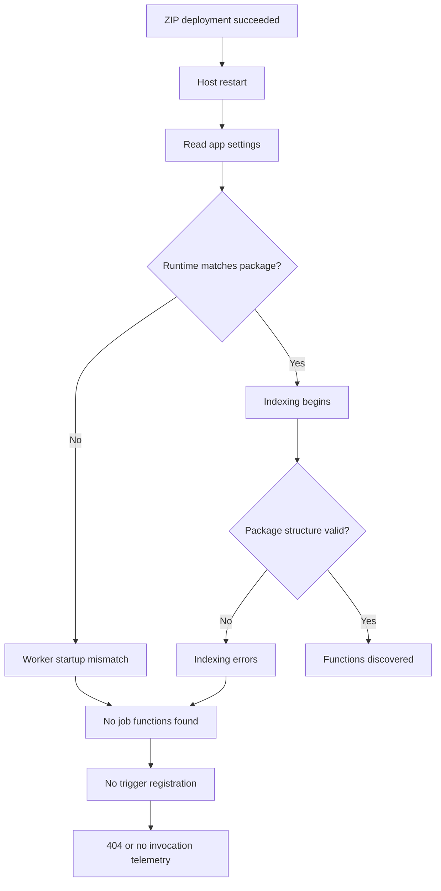
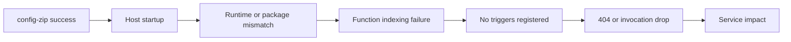
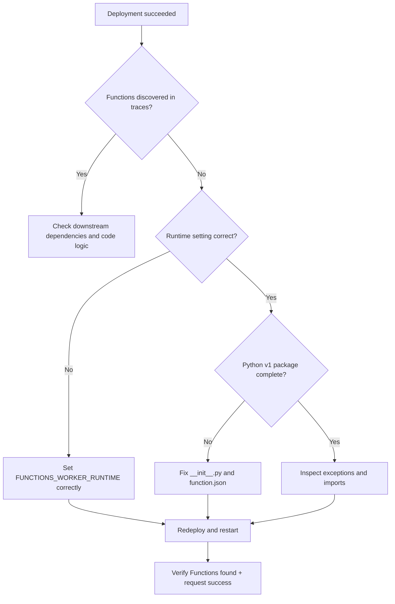

---
content_sources:
  - type: mslearn-adapted
    url: https://learn.microsoft.com/azure/azure-functions/functions-deployment-technologies
  - type: mslearn-adapted
    url: https://learn.microsoft.com/azure/azure-functions/functions-reference-python
  - type: mslearn-adapted
    url: https://learn.microsoft.com/azure/azure-functions/configure-monitoring
  - type: mslearn-adapted
    url: https://learn.microsoft.com/azure/azure-functions/monitor-functions
  - type: mslearn-adapted
    url: https://learn.microsoft.com/azure/azure-monitor/logs/log-query-overview
---

# Lab Guide: Deployment Succeeded but Function Not Running

This lab reproduces a deceptive production scenario: deployment transport succeeds, but Azure Functions cannot discover triggers, so no functions execute. You will validate failure evidence using Application Insights tables only (`traces`, `requests`, `dependencies`, `exceptions`), then recover by correcting runtime and package structure.

## Lab Metadata

| Field | Value |
|---|---|
| Difficulty | Intermediate / Advanced |
| Duration | 45-60 min |
| Hosting plan tested | Consumption (Y1) |
| Trigger type | HTTP trigger + timer trigger |
| Azure services | Azure Functions, Azure Storage, Application Insights |
| Skills practiced | Discovery triage, startup diagnostics, runtime alignment, packaging validation |

## 1) Background

`az functionapp deployment source config-zip` confirms package upload and extraction, not runtime readiness. A successful deployment response can coexist with host indexing failure, leaving routes unavailable.

Common causes in Python workloads:

1. `FUNCTIONS_WORKER_RUNTIME` does not match the deployed language.
2. Python v1 package structure is incomplete (`function.json` or `__init__.py` missing).
3. Import/startup exceptions prevent trigger registration even though deployment succeeded.

This lab keeps deployment method constant and changes only runtime or package structure to prove causality.

### Failure progression model

<!-- diagram-id: failure-progression-model -->


### Investigation channels used in this lab

| Channel | Table | Why it matters |
|---|---|---|
| Host startup/discovery state | `traces` | Detects `No job functions found`, startup/indexing signatures |
| Trigger execution outcome | `requests` | Shows success/failure and 404 trend |
| Downstream dependency behavior | `dependencies` | Separates startup issue from external dependency issue |
| Runtime exceptions | `exceptions` | Identifies import and indexing exceptions |

### Incident timeline model

```mermaid
gantt
    title Deployment Success but Runtime Failure Timeline
    dateFormat  HH:mm
    axisFormat  %H:%M
    section Baseline
    Baseline deploy and verify         :done, a1, 03:00, 10m
    section Incident
    Fault injection                    :done, b1, 03:10, 1m
    Evidence collection                :done, b2, 03:10, 10m
    section Recovery
    Fix applied                        :done, c1, 03:20, 1m
    Recovery verification              :done, c2, 03:20, 10m
```

<!-- diagram-id: incident-timeline-model -->


## 2) Hypothesis

### Formal statement

If deployment succeeds but runtime configuration or Python package structure is invalid, then startup telemetry will show function discovery/indexing failures, function execution telemetry will collapse, and correcting runtime plus structure will restore trigger discovery and successful invocations.

### Proof criteria

1. `traces` contains discovery/startup failure signatures after successful deployment.
2. `requests` shows failure or 404 surge while discovery fails.
3. Runtime/structure correction removes discovery failures.
4. `requests` returns to healthy success profile after correction.

### Disproof criteria

1. Functions are discovered and route-mapped while requests still fail for unrelated reasons.
2. No startup/indexing/discovery signatures appear in `traces`.
3. Recovery occurs without any runtime or package correction.

### Causal chain

<!-- diagram-id: causal-chain -->


## 3) Runbook

### Prerequisites

1. Azure CLI authenticated and target subscription selected.
2. Azure Functions Core Tools installed.
3. Access to create resources in target resource group.
4. Application Insights query permission.

```bash
az login --output table
az account set --subscription "<subscription-id>"
az account show --output table
func --version
python --version
```

### Variables

```bash
RG="rg-func-lab-deploy"
LOCATION="koreacentral"
APP_NAME="func-deploy-lab-001"
STORAGE_NAME="stfuncdeploylab001"
APPINSIGHTS_NAME="appi-func-deploy-001"
APP_URL="https://$APP_NAME.azurewebsites.net"
```

### Step 1: Deploy baseline infrastructure

Create a Linux Consumption app with Application Insights attached.

```bash
az group create --name "$RG" --location "$LOCATION" --output table
az storage account create --name "$STORAGE_NAME" --resource-group "$RG" --location "$LOCATION" --sku Standard_LRS --kind StorageV2 --output table
az monitor app-insights component create --app "$APPINSIGHTS_NAME" --location "$LOCATION" --resource-group "$RG" --kind web --application-type web --output table
az functionapp create --name "$APP_NAME" --resource-group "$RG" --consumption-plan-location "$LOCATION" --runtime python --runtime-version 3.11 --functions-version 4 --storage-account "$STORAGE_NAME" --app-insights "$APPINSIGHTS_NAME" --output table
```

If you need to verify the configured connection string, query it from Azure instead of using placeholders:

```bash
APPLICATIONINSIGHTS_CONNECTION_STRING="$(az monitor app-insights component show --app "$APPINSIGHTS_NAME" --resource-group "$RG" --query connectionString --output tsv)"
az functionapp config appsettings list --name "$APP_NAME" --resource-group "$RG" --query "[?name=='APPLICATIONINSIGHTS_CONNECTION_STRING'].value" --output tsv | head -c 50
```

### Step 2: Deploy baseline code and verify discovery

Create and publish a known-good Python v2 app first.

```bash
mkdir -p deploy-lab && pushd deploy-lab
func init --python --model V2
cat > function_app.py << 'PYEOF'
import azure.functions as func
app = func.FunctionApp()

@app.function_name("HttpHealth")
@app.route(route="health", methods=["GET"])
def http_health(req: func.HttpRequest) -> func.HttpResponse:
    return func.HttpResponse("OK", status_code=200)
PYEOF
func azure functionapp publish "$APP_NAME" --python
popd
az functionapp config appsettings set --name "$APP_NAME" --resource-group "$RG" --settings "FUNCTIONS_WORKER_RUNTIME=python" --output table
az functionapp restart --name "$APP_NAME" --resource-group "$RG" --output table
```

Start continuous HTTP traffic and keep it running through incident and recovery windows:

```bash
while true; do curl -s -o /dev/null -w "%{http_code}\n" "$APP_URL/api/health"; sleep 5; done &
TRAFFIC_PID=$!
```

Baseline discovery query:

```kusto
traces
| where timestamp between (datetime(2026-04-05 03:00:00Z) .. datetime(2026-04-05 03:10:00Z))
| where cloud_RoleName == "func-deploy-lab-001"
| where message has_any ("Host started", "Functions found")
| project timestamp, severityLevel, message
| order by timestamp asc
```

Sample result:

```text
timestamp                    severityLevel  message
2026-04-05T03:00:21.114Z     1              Host started (Id=xxxxxxxx-xxxx-xxxx-xxxx-xxxxxxxxxxxx)
2026-04-05T03:00:24.428Z     1              Functions found: HttpHealth
```

### Step 3: Trigger incident (runtime mismatch)

Inject the primary failure at **T0+10m (03:10 UTC)**.

Keep the background traffic loop running during this step so `requests` evidence remains reproducible.

```bash
az functionapp config appsettings set --name "$APP_NAME" --resource-group "$RG" --settings "FUNCTIONS_WORKER_RUNTIME=node" --output table
az functionapp restart --name "$APP_NAME" --resource-group "$RG" --output table
```

### Step 4: Collect incident evidence (03:10-03:20 UTC)

Query A: discovery/startup failures in `traces`.

```kusto
traces
| where timestamp between (datetime(2026-04-05 03:10:00Z) .. datetime(2026-04-05 03:20:00Z))
| where cloud_RoleName == "func-deploy-lab-001"
| where message has_any ("No job functions found", "Host startup operation", "AZFD0013", "Failed to start")
| project timestamp, severityLevel, message
| order by timestamp asc
```

Sample result:

```text
timestamp                    severityLevel  message
2026-04-05T03:10:18.310Z     3              Host startup operation has been canceled
2026-04-05T03:10:18.944Z     2              No job functions found. Try making your job classes and methods public.
2026-04-05T03:10:19.501Z     3              Host startup operation has failed
```

Query B: request failure/404 profile.

```kusto
requests
| where timestamp between (datetime(2026-04-05 03:10:00Z) .. datetime(2026-04-05 03:20:00Z))
| where cloud_RoleName == "func-deploy-lab-001"
| summarize total=count(), failures=countif(success == false), notFound=countif(resultCode == "404"), p95Ms=round(percentile(duration, 95), 2) by bin(timestamp, 5m)
| extend failRatePercent=round(100.0 * failures / total, 2)
| order by timestamp asc
```

Sample result:

```text
timestamp                    total  failures  notFound  p95Ms   failRatePercent
2026-04-05T03:10:00.000Z     28     23        21        1865.42 82.14
2026-04-05T03:15:00.000Z     24     20        18        1722.08 83.33
```

Query C: exceptions tied to indexing/runtime load.

```kusto
exceptions
| where timestamp between (datetime(2026-04-05 03:10:00Z) .. datetime(2026-04-05 03:20:00Z))
| where cloud_RoleName == "func-deploy-lab-001"
| project timestamp, type, outerMessage
| order by timestamp asc
```

Sample result:

```text
timestamp                    type                  outerMessage
2026-04-05T03:10:18.950Z     FunctionInvocationException  Worker failed to initialize language worker for runtime: node
```

!!! note "Exception behavior varies by failure mode"
    The exceptions table may not always contain entries for startup failures. When the host cannot load the worker at all, failures appear primarily in `traces`. Treat `exceptions` as supporting evidence that strengthens the diagnosis, not as required proof.

Query D: dependency context to avoid false attribution.

```kusto
dependencies
| where timestamp between (datetime(2026-04-05 03:10:00Z) .. datetime(2026-04-05 03:20:00Z))
| where cloud_RoleName == "func-deploy-lab-001"
| summarize total=count(), failures=countif(success == false), p95Ms=round(percentile(duration, 95), 2) by type, target
| order by failures desc
```

Sample result:

```text
type      target                               total  failures  p95Ms
HTTP      management.azure.com                 19     0         210.54
Azure blob stfuncdeploylab001.blob.core.windows.net 31 0        75.90
```

CLI equivalent for Query A (include resource group explicitly):

```bash
az monitor app-insights query --apps "$APPINSIGHTS_NAME" --resource-group "$RG" --analytics-query "traces | where timestamp between (datetime(2026-04-05 03:10:00Z) .. datetime(2026-04-05 03:20:00Z)) | where cloud_RoleName == '$APP_NAME' | where message has_any ('No job functions found','Host startup operation','AZFD0013','Failed to start') | project timestamp, severityLevel, message | order by timestamp asc" --output table
```

!!! tip "How to read this evidence"
    Keep the sequence strict: deployment success -> startup failure signatures -> missing route behavior in requests.
    If startup signatures are missing, do not conclude discovery failure only from 404s.

### Step 5: Apply fix and verify recovery (03:20-03:30 UTC)

Fix runtime mismatch and redeploy valid package at **T0+20m (03:20 UTC)**.

Keep the same background traffic loop running during recovery verification.

```bash
az functionapp config appsettings set --name "$APP_NAME" --resource-group "$RG" --settings "FUNCTIONS_WORKER_RUNTIME=python" --output table
pushd deploy-lab
func azure functionapp publish "$APP_NAME" --python
popd
```

Recovery Query E: discovery restored.

```kusto
traces
| where timestamp between (datetime(2026-04-05 03:20:00Z) .. datetime(2026-04-05 03:30:00Z))
| where cloud_RoleName == "func-deploy-lab-001"
| where message has_any ("Host started", "Functions found")
| project timestamp, severityLevel, message
| order by timestamp asc
```

Sample result:

```text
timestamp                    severityLevel  message
2026-04-05T03:20:22.088Z     1              Host started (Id=xxxxxxxx-xxxx-xxxx-xxxx-xxxxxxxxxxxx)
2026-04-05T03:20:24.607Z     1              Functions found: HttpHealth
```

Recovery Query F: request health restored.

```kusto
requests
| where timestamp between (datetime(2026-04-05 03:20:00Z) .. datetime(2026-04-05 03:30:00Z))
| where cloud_RoleName == "func-deploy-lab-001"
| summarize total=count(), failures=countif(success == false), p95Ms=round(percentile(duration, 95), 2) by bin(timestamp, 5m)
| extend failRatePercent=round(100.0 * failures / total, 2)
| order by timestamp asc
```

Sample result:

```text
timestamp                    total  failures  p95Ms   failRatePercent
2026-04-05T03:20:00.000Z     34     0         445.36  0.00
2026-04-05T03:25:00.000Z     37     0         418.79  0.00
```

### Step 6: Interpret results

- Successful deployment transport did not guarantee trigger availability.
- Runtime mismatch generated immediate startup/discovery signatures in `traces`.
- Request failures aligned with discovery failure windows.
- Fixing runtime and package alignment restored discovery and healthy requests.

### Step 7: Triage decision tree

<!-- diagram-id: step-7-triage-decision-tree -->


## 4) Experiment Log

### Artifact inventory

| Artifact | Source | Purpose |
|---|---|---|
| `deploy-lab/function_app.py` | local workspace | Baseline and recovery publish source |
| Runtime setting change | App setting | Fault injection by setting `FUNCTIONS_WORKER_RUNTIME=node` |
| Discovery query output | `traces` | Startup and indexing status |
| Request query output | `requests` | User-visible failure/success profile |
| Exception query output | `exceptions` | Runtime/indexing exception evidence |

### Timeline-consistent evidence ledger

| Time (UTC) | Phase | Signal | Observation | Interpretation |
|---|---|---|---|---|
| 03:00:00 | Baseline | Deploy | `func azure functionapp publish` completed | Transport successful |
| 03:00:24 | Baseline | `traces` | `Functions found: HttpHealth` | Discovery healthy |
| 03:05:00 | Baseline | `requests` | fail rate `0.00%` | Endpoints healthy |
| 03:10:00 | Fault injection | Config | `FUNCTIONS_WORKER_RUNTIME=node` | Intentional mismatch introduced |
| 03:10:19 | Incident | `traces` | `No job functions found` | Discovery failed |
| 03:15:00 | Incident | `requests` | fail rate `83.33%`, 404 surge | Triggers not mapped |
| 03:18:00 | Incident | `exceptions` | worker init exception | Mismatch confirmed |
| 03:20:00 | Fix | Config | runtime reset to `python` + republish from `deploy-lab` | Corrective action |
| 03:20:24 | Recovery | `traces` | `Functions found: HttpHealth` | Discovery restored |
| 03:25:00 | Recovery | `requests` | fail rate `0.00%` | Service restored |

### Baseline window snapshot (T0 to T0+10m)

| Timestamp (UTC) | Deploy status | Discovery status | Request fail rate |
|---|---:|---|---:|
| 2026-04-05T03:00:00Z | 200 | Functions found | 0.00% |
| 2026-04-05T03:05:00Z | 200 | Functions found | 0.00% |
| 2026-04-05T03:10:00Z | 200 | Baseline complete | 0.00% |

### Incident window snapshot (T0+10m to T0+20m)

| Timestamp (UTC) | Deploy status | Discovery signal | Request fail rate |
|---|---:|---|---:|
| 2026-04-05T03:10:00Z | 200 | runtime mismatch injected | 78.57% |
| 2026-04-05T03:12:00Z | 200 | `No job functions found` | 81.25% |
| 2026-04-05T03:15:00Z | 200 | startup failed loop | 83.33% |
| 2026-04-05T03:18:00Z | 200 | worker init exception | 80.95% |

### Recovery window snapshot (T0+20m to T0+30m)

| Timestamp (UTC) | Deploy status | Discovery signal | Request fail rate |
|---|---:|---|---:|
| 2026-04-05T03:20:00Z | 200 | fix applied | 0.00% |
| 2026-04-05T03:22:00Z | 200 | `Functions found` | 0.00% |
| 2026-04-05T03:25:00Z | 200 | stable startup | 0.00% |
| 2026-04-05T03:30:00Z | 200 | recovery verified | 0.00% |

### Raw excerpts (sanitized and timeline-aligned)

```text
[traces excerpt]
2026-04-05T03:00:24.428Z Information Functions found: HttpHealth
2026-04-05T03:10:18.310Z Error Host startup operation has been canceled
2026-04-05T03:10:18.944Z Warning No job functions found. Try making your job classes and methods public.
2026-04-05T03:10:19.501Z Error Host startup operation has failed
2026-04-05T03:15:19.202Z Error No job functions found.
2026-04-05T03:20:22.088Z Information Host started
2026-04-05T03:20:24.607Z Information Functions found: HttpHealth

[requests excerpt]
2026-04-05T03:05:10.001Z GET /api/health 200 success=True duration=398.22ms
2026-04-05T03:12:18.910Z GET /api/health 404 success=False duration=1731.52ms
2026-04-05T03:15:26.301Z GET /api/health 404 success=False duration=1665.11ms
2026-04-05T03:22:10.004Z GET /api/health 200 success=True duration=412.73ms
```

### Core finding

Deployment transport remained healthy throughout the run, but runtime mismatch prevented function indexing and trigger registration. Recovery required runtime correction and redeployment of a valid package; after correction, startup/discovery and request health returned to baseline.

### Verdict

| Question | Answer |
|---|---|
| Hypothesis confirmed? | Yes |
| Primary root cause | Runtime mismatch blocked discovery/indexing |
| Recovery method | Set `FUNCTIONS_WORKER_RUNTIME=python`, republish from `deploy-lab` |
| Time to detect | ~10 minutes after fault injection |

## Expected Evidence

### Before trigger (T0 to T0+10m)

| Signal | Expected value |
|---|---|
| Discovery traces | `Host started` and `Functions found` present |
| `No job functions found` in `traces` | 0 |
| Request fail rate | below 1% |

### During incident (T0+10m to T0+20m)

| Signal | Expected value |
|---|---|
| Discovery traces | repeated startup/indexing failures |
| `No job functions found` in `traces` | repeated |
| Request fail rate | above 70% with frequent 404 |
| Exceptions | optional supporting runtime/indexing signatures |

### After recovery (T0+20m to T0+30m)

| Signal | Expected value |
|---|---|
| Discovery traces | `Functions found` returns |
| `No job functions found` in `traces` | 0 |
| Request fail rate | returns below 1% |
| Verification duration | stable for at least 10 minutes |

### Evidence timeline

```mermaid
gantt
    title Evidence Timeline (UTC)
    dateFormat  HH:mm
    axisFormat  %H:%M
    section Baseline
    Baseline deploy + verify            :done, e1, 03:00, 10m
    section Incident
    Runtime mismatch injection          :done, e2, 03:10, 1m
    Incident evidence capture           :done, e3, 03:10, 10m
    section Recovery
    Runtime correction + redeploy       :done, e4, 03:20, 1m
    Recovery verification               :done, e5, 03:20, 10m
```

<!-- diagram-id: evidence-timeline -->


### Evidence chain: why this proves the hypothesis

1. Deployment succeeded in both healthy and failing windows, isolating runtime activation as the variable.
2. Discovery and startup failures appeared immediately after runtime mismatch injection.
3. Request failures and 404 spikes aligned with the discovery failure window.
4. Runtime correction removed discovery failures and restored healthy request telemetry.

## Clean Up

```bash
kill "$TRAFFIC_PID"
az group delete --name "$RG" --yes --no-wait --output table
```

## Related Playbook

- [Deployment Failures Playbook](../playbooks/deployment-failures.md)

## See Also

- [Troubleshooting Lab Guides](../lab-guides/index.md)
- [Troubleshooting Methodology](../methodology.md)
- [First 10 Minutes Triage](../first-10-minutes/index.md)
- [KQL Guide](../kql/index.md)

## Sources

- https://learn.microsoft.com/azure/azure-functions/functions-deployment-technologies
- https://learn.microsoft.com/azure/azure-functions/functions-reference-python
- https://learn.microsoft.com/azure/azure-functions/configure-monitoring
- https://learn.microsoft.com/azure/azure-functions/monitor-functions
- https://learn.microsoft.com/azure/azure-monitor/logs/log-query-overview
