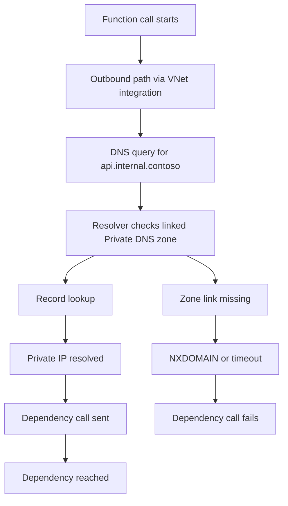
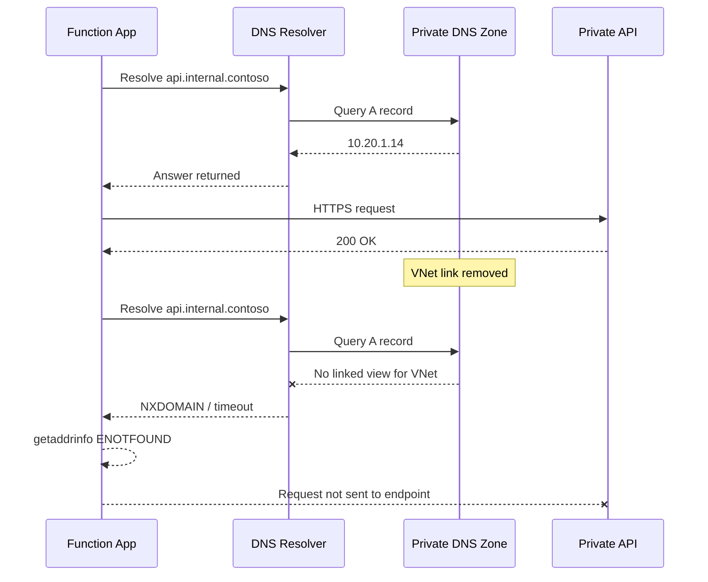
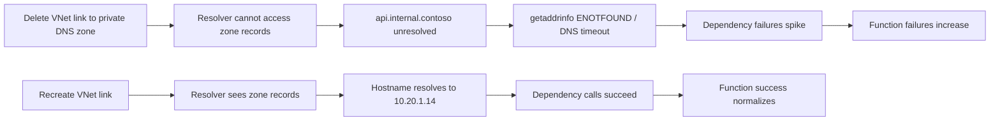
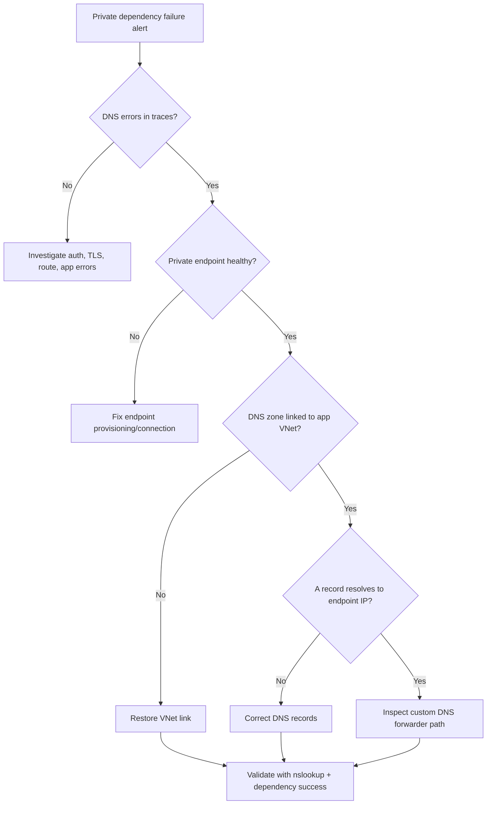
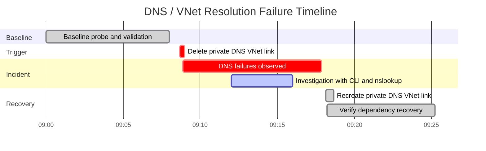

# Lab Guide: DNS and VNet Resolution Failure

This Level 3 lab reproduces a DNS and VNet resolution outage where an Azure Functions Python v2 app on Flex Consumption (FC1) fails to reach a private API (`api.internal.contoso`) through VNet integration, private endpoint, and private DNS zone. The failure is injected by removing the private DNS zone VNet link and then validated with KQL, CLI evidence, and recovery checks.

---

## Lab Metadata

| Field | Value |
|---|---|
| Lab focus | DNS resolution failure in private endpoint path |
| Runtime | Azure Functions Python v2 |
| Plan | Flex Consumption (FC1) |
| Trigger | Remove Private DNS zone VNet link |
| Key endpoints | `https://<function-host>/api/private-probe`, `https://api.internal.contoso/health` |
| Diagnostic categories | `requests`, `traces`, `dependencies`, `exceptions`, Activity Log |
| Artifact root | `labs/dns-vnet-resolution/artifacts-sanitized/` |

!!! info "What this lab is designed to prove"
    The incident symptom is dependency outage, but the root cause is DNS visibility loss between the Function App integration path and the Private DNS zone.

    This lab proves causality with a controlled sequence:

    1. Baseline: private hostname resolves and dependency calls succeed.
    2. Trigger: Private DNS zone VNet link is removed.
    3. Incident: traces show `ENOTFOUND` / DNS timeout, dependency failures spike.
    4. Recovery: link is restored, resolution and dependency success return.

---

## 1) Background

Private endpoint architecture depends on DNS as part of the data path. If private name resolution fails, traffic never reaches the endpoint NIC, even when the endpoint resource itself is healthy.

### 1.1 DNS resolution phase model



### 1.2 VNet integration vs service endpoint vs private endpoint

| Topic | VNet integration | Service endpoint | Private endpoint |
|---|---|---|---|
| Core purpose | App outbound to VNet resources | VNet identity to public PaaS endpoint | Private IP for PaaS/service |
| DNS behavior | Must resolve private names correctly | Usually public DNS name | Must resolve private DNS zone name |
| Typical hostname | Private FQDN | Public FQDN | Private FQDN mapped to private IP |
| Failure pattern | Route/path or resolver visibility issues | ACL/network rule rejection | `ENOTFOUND`, DNS timeout, wrong IP |
| This lab uses | Yes | No | Yes |

### 1.3 Common DNS failure progression



### 1.4 Failure signatures used in this lab

| Signal | Baseline | Incident | Recovery |
|---|---|---|---|
| Trace patterns | `DNS resolution succeeded ...` | `ENOTFOUND` and timeout | `DNS resolution succeeded ...` |
| Dependency success | Near 100% | Drops near 0% | Returns near 100% |
| `nslookup` from app context | Returns `10.20.1.14` | NXDOMAIN | Returns `10.20.1.14` |
| Private endpoint provisioning | `Succeeded` | `Succeeded` | `Succeeded` |
| VNet link presence | Present | Missing | Present |

---

## 2) Hypothesis

If the Private DNS zone VNet link is removed, the Function App loses private hostname resolution for `api.internal.contoso`, causing dependency failures with DNS-specific error signatures. Restoring the link restores resolution and dependency success without code changes.



Proof criteria:

| Criterion | Required evidence |
|---|---|
| Controlled trigger | Link removal confirmed by CLI output |
| DNS-specific symptom | `ENOTFOUND` / DNS timeout traces |
| Dependency blast radius | Failures concentrated on `api.internal.contoso` |
| Non-DNS controls stable | VNet integration and private endpoint remain healthy |
| Reversal | Link restore recovers resolution and success |

Disproof criteria:

| Condition | Why it disproves |
|---|---|
| DNS link remains present throughout | Trigger did not occur |
| Hostname resolves but calls still fail | Root cause likely auth/TLS/route/app |
| Private endpoint unhealthy/deleted | Endpoint issue may be primary cause |
| Recovery does not follow link restore | Causality not established |

---

## 3) Runbook

### Prerequisites

| Requirement | Check command |
|---|---|
| Azure CLI logged in | `az account show` |
| Access to create resources | `az group list --query "[].name"` |
| Lab Bicep available | `labs/dns-vnet-resolution/main.bicep` |
| App Insights enabled in deployment | output includes instrumentation key/connection string |

Set environment variables:

```bash
RG="rg-func-dns-lab"
LOCATION="koreacentral"
BASE_NAME="labdnsfc1"

FUNC_APP_NAME="func-labdnsfc1"
VNET_NAME="vnet-labdnsfc1"
PRIVATE_ZONE_NAME="internal.contoso"
PRIVATE_LINK_NAME="api-link-functions"
PRIVATE_ENDPOINT_NAME="pe-api-labdns"
```

### 3.1 Deploy infrastructure

```bash
az group create \
  --name "$RG" \
  --location "$LOCATION"

az deployment group create \
  --resource-group "$RG" \
  --template-file "labs/dns-vnet-resolution/main.bicep" \
  --parameters "baseName=$BASE_NAME" "location=$LOCATION"
```

Example deployment output (sanitized):

```json
{
  "id": "/subscriptions/<subscription-id>/resourceGroups/rg-func-dns-lab/providers/Microsoft.Resources/deployments/main",
  "name": "main",
  "properties": {
    "provisioningState": "Succeeded",
    "timestamp": "2026-04-04T08:58:17.3246101Z"
  }
}
```

### 3.2 Collect baseline

Generate baseline traffic to the private API probe endpoint.

```bash
for i in {1..20}; do
  curl --silent --show-error \
    "https://$FUNC_APP_NAME.azurewebsites.net/api/private-probe" >/dev/null
  sleep 10
done
```

KQL 1: Baseline dependency health.

```kusto
let appName = "func-labdnsfc1";
dependencies
| where timestamp between (datetime(2026-04-04T09:00:00Z) .. datetime(2026-04-04T09:08:00Z))
| where cloud_RoleName =~ appName
| where target has "api.internal.contoso"
| summarize
    Calls = count(),
    Failed = countif(success == false),
    FailureRatePercent = round(100.0 * countif(success == false) / count(), 2),
    AvgMs = avg(toreal(duration / 1ms)),
    P95Ms = percentile(toreal(duration / 1ms), 95)
  by target, type
| order by target asc
```

Example output:

| target | type | Calls | Failed | FailureRatePercent | AvgMs | P95Ms |
|---|---|---:|---:|---:|---:|---:|
| api.internal.contoso | HTTP | 92 | 0 | 0.00 | 97.41 | 198.76 |

KQL 2: Baseline DNS success traces.

```kusto
let appName = "func-labdnsfc1";
traces
| where timestamp between (datetime(2026-04-04T09:00:00Z) .. datetime(2026-04-04T09:08:00Z))
| where cloud_RoleName =~ appName
| where message has "DNS resolution succeeded for api.internal.contoso"
| project timestamp, severityLevel, message
| order by timestamp asc
```

Example output:

| timestamp | severityLevel | message |
|---|---:|---|
| 2026-04-04T09:00:14Z | 1 | DNS resolution succeeded for api.internal.contoso -> 10.20.1.14 |
| 2026-04-04T09:07:25Z | 1 | DNS resolution succeeded for api.internal.contoso -> 10.20.1.14 |

### 3.3 Trigger the failure

Delete the Private DNS zone VNet link:

```bash
az network private-dns link vnet delete \
  --resource-group "$RG" \
  --zone-name "$PRIVATE_ZONE_NAME" \
  --name "$PRIVATE_LINK_NAME" \
  --yes
```

Expected command output:

```text
{
  "name": "api-link-functions",
  "resourceGroup": "rg-func-dns-lab",
  "type": "Microsoft.Network/privateDnsZones/virtualNetworkLinks",
  "virtualNetworkLinkState": "Completed"
}
```

Wait 2-3 minutes and continue sending probe traffic.

```bash
for i in {1..20}; do
  curl --silent --show-error \
    "https://$FUNC_APP_NAME.azurewebsites.net/api/private-probe" >/dev/null
  sleep 10
done
```

### 3.4 Observe failure

KQL 3: DNS failure detection.

```kusto
let appName = "func-labdnsfc1";
traces
| where timestamp between (datetime(2026-04-04T09:08:00Z) .. datetime(2026-04-04T09:18:00Z))
| where cloud_RoleName =~ appName
| where message has_any (
    "getaddrinfo ENOTFOUND api.internal.contoso",
    "DNS resolution timeout for api.internal.contoso:53"
)
| project timestamp, severityLevel, message
| order by timestamp asc
```

Example output:

| timestamp | severityLevel | message |
|---|---:|---|
| 2026-04-04T09:08:52Z | 3 | getaddrinfo ENOTFOUND api.internal.contoso |
| 2026-04-04T09:08:53Z | 3 | DNS resolution timeout for api.internal.contoso:53 |
| 2026-04-04T09:09:11Z | 3 | getaddrinfo ENOTFOUND api.internal.contoso |
| 2026-04-04T09:09:12Z | 3 | DNS resolution timeout for api.internal.contoso:53 |
| 2026-04-04T09:11:19Z | 3 | DNS resolution timeout for api.internal.contoso:53 |

KQL 4: Dependency failure rate during incident.

```kusto
let appName = "func-labdnsfc1";
dependencies
| where timestamp between (datetime(2026-04-04T09:08:00Z) .. datetime(2026-04-04T09:18:00Z))
| where cloud_RoleName =~ appName
| where target has "api.internal.contoso"
| summarize
    Calls = count(),
    Failed = countif(success == false),
    FailureRatePercent = round(100.0 * countif(success == false) / count(), 2),
    AvgMs = avg(toreal(duration / 1ms)),
    P95Ms = percentile(toreal(duration / 1ms), 95)
  by resultCode
| order by Calls desc
```

Example output:

| resultCode | Calls | Failed | FailureRatePercent | AvgMs | P95Ms |
|---|---:|---:|---:|---:|---:|
| 0 | 74 | 74 | 100.00 | 6231.48 | 15008.92 |

KQL 5: Recovery verification trend (used after fix).

```kusto
let appName = "func-labdnsfc1";
dependencies
| where timestamp between (datetime(2026-04-04T09:18:00Z) .. datetime(2026-04-04T09:28:00Z))
| where cloud_RoleName =~ appName
| where target has "api.internal.contoso"
| summarize Calls = count(), Failed = countif(success == false) by bin(timestamp, 1m)
| extend FailureRatePercent = round(100.0 * todouble(Failed) / todouble(Calls), 2)
| order by timestamp asc
```

Example output:

| timestamp | Calls | Failed | FailureRatePercent |
|---|---:|---:|---:|
| 2026-04-04T09:18:00Z | 8 | 1 | 12.50 |
| 2026-04-04T09:19:00Z | 9 | 0 | 0.00 |
| 2026-04-04T09:27:00Z | 10 | 0 | 0.00 |

Required source log patterns captured:

```text
[2026-04-04T09:08:52Z] getaddrinfo ENOTFOUND api.internal.contoso
[2026-04-04T09:08:53Z] DNS resolution timeout for api.internal.contoso:53
```

### 3.5 Investigate

Validate each network and DNS layer with CLI.

#### Check 1: VNet configuration

```bash
az network vnet show \
  --resource-group "$RG" \
  --name "$VNET_NAME" \
  --output json
```

Example output:

```json
{
  "name": "vnet-labdnsfc1",
  "subnets": [
    {
      "name": "snet-functions",
      "addressPrefix": "10.20.0.0/24"
    },
    {
      "name": "snet-private-endpoints",
      "addressPrefix": "10.20.1.0/24"
    }
  ]
}
```

#### Check 2: Private DNS zones

```bash
az network private-dns zone list \
  --resource-group "$RG" \
  --output table
```

Example output:

```text
Name               ResourceGroup      NumberOfRecordSets    MaxNumberOfRecordSets
-----------------  -----------------  --------------------  ---------------------
internal.contoso   rg-func-dns-lab    3                     25000
```

#### Check 3: Private DNS VNet links

```bash
az network private-dns link vnet list \
  --resource-group "$RG" \
  --zone-name "$PRIVATE_ZONE_NAME" \
  --output table
```

Example output during incident:

```text
Name    ResourceGroup      RegistrationEnabled    VirtualNetwork    LinkState
------  -----------------  ---------------------  ----------------  ---------
```

#### Check 4: Function App VNet integration

```bash
az functionapp vnet-integration list \
  --resource-group "$RG" \
  --name "$FUNC_APP_NAME" \
  --output table
```

Example output:

```text
SubnetResourceId
------------------------------------------------------------------------------------------------------------------------------------------
/subscriptions/<subscription-id>/resourceGroups/rg-func-dns-lab/providers/Microsoft.Network/virtualNetworks/vnet-labdnsfc1/subnets/snet-functions
```

#### Check 5: Private endpoint details

```bash
az network private-endpoint show \
  --resource-group "$RG" \
  --name "$PRIVATE_ENDPOINT_NAME" \
  --output json
```

Example output:

```json
{
  "name": "pe-api-labdns",
  "customDnsConfigs": [
    {
      "fqdn": "api.internal.contoso",
      "ipAddresses": [
        "10.20.1.14"
      ]
    }
  ],
  "provisioningState": "Succeeded"
}
```

#### Check 6: DNS lookup from function context

```bash
az functionapp ssh \
  --resource-group "$RG" \
  --name "$FUNC_APP_NAME" \
  --command "nslookup api.internal.contoso"
```

Example output during incident:

```text
Server:         168.63.129.16
Address:        168.63.129.16#53

** server can't find api.internal.contoso: NXDOMAIN
```

Investigation summary table:

| Check | Baseline expected | Incident observed | Interpretation |
|---|---|---|---|
| VNet exists | Yes | Yes | Networking foundation present |
| Function VNet integration | Yes | Yes | App integration still configured |
| Private endpoint health | Succeeded | Succeeded | Endpoint not primary failure |
| DNS zone exists | Yes | Yes | Zone not deleted |
| DNS zone VNet link | Present | Missing | Root cause candidate confirmed |
| App-context `nslookup` | Resolves | NXDOMAIN | DNS visibility broken |

### 3.6 Fix and verify

Recreate the VNet link:

```bash
VNET_ID=$(az network vnet show \
  --resource-group "$RG" \
  --name "$VNET_NAME" \
  --query "id" \
  --output tsv)

az network private-dns link vnet create \
  --resource-group "$RG" \
  --zone-name "$PRIVATE_ZONE_NAME" \
  --name "$PRIVATE_LINK_NAME" \
  --virtual-network "$VNET_ID" \
  --registration-enabled false
```

Verify link restored:

```bash
az network private-dns link vnet list \
  --resource-group "$RG" \
  --zone-name "$PRIVATE_ZONE_NAME" \
  --output table
```

Example output:

```text
Name                ResourceGroup      RegistrationEnabled    VirtualNetwork                      LinkState
------------------  -----------------  ---------------------  ----------------------------------  ---------
api-link-functions  rg-func-dns-lab    False                  vnet-labdnsfc1                      Completed
```

Verify DNS from app context:

```bash
az functionapp ssh \
  --resource-group "$RG" \
  --name "$FUNC_APP_NAME" \
  --command "nslookup api.internal.contoso"
```

Expected output:

```text
Server:         168.63.129.16
Address:        168.63.129.16#53

Name:   api.internal.contoso
Address: 10.20.1.14
```

Run post-fix traffic and verify telemetry:

```bash
for i in {1..20}; do
  curl --silent --show-error \
    "https://$FUNC_APP_NAME.azurewebsites.net/api/private-probe" >/dev/null
  sleep 10
done
```

Recovery logs include:

```text
[2026-04-04T09:18:14Z] DNS resolution succeeded for api.internal.contoso -> 10.20.1.14
[2026-04-04T09:18:15Z] Dependency call succeeded: api.internal.contoso (200)
```

### 3.7 Triage decision flow



### 3.8 Clean up

```bash
az group delete \
  --name "$RG" \
  --yes \
  --no-wait
```

---

## 4) Experiment Log

### Artifact inventory

| Category | Files |
|---|---|
| Deployment | `deployment-result.json`, `resource-map.json` |
| Baseline | `kql-baseline-dependencies.json`, `kql-baseline-dns-traces.json`, `nslookup-before.txt` |
| Incident | `kql-incident-dns-errors.json`, `kql-incident-failures.json`, `nslookup-during.txt`, `private-link-list-during.txt` |
| Recovery | `kql-recovery-trend.json`, `kql-recovery-success.json`, `nslookup-after.txt`, `private-link-list-after.txt` |
| CLI evidence | `vnet-show.json`, `private-zone-list.txt`, `private-endpoint-show.json`, `vnet-integration-list.txt` |

### Baseline evidence

| Timestamp (UTC) | Signal | Evidence |
|---|---|---|
| 2026-04-04T09:00:14Z | Trace | DNS resolution succeeded to `10.20.1.14` |
| 2026-04-04T09:00:15Z | Dependency | HTTP success to `api.internal.contoso` |
| 2026-04-04T09:02:31Z | Trace | DNS resolution succeeded to `10.20.1.14` |
| 2026-04-04T09:02:32Z | Dependency | HTTP success to `api.internal.contoso` |
| 2026-04-04T09:04:56Z | Trace | DNS resolution succeeded to `10.20.1.14` |
| 2026-04-04T09:04:57Z | Dependency | HTTP success to `api.internal.contoso` |

### Incident observations

| Timestamp (UTC) | Signal | Observation |
|---|---|---|
| 2026-04-04T09:08:40Z | CLI change | VNet link deleted |
| 2026-04-04T09:08:52Z | Trace | `getaddrinfo ENOTFOUND api.internal.contoso` |
| 2026-04-04T09:08:53Z | Trace | `DNS resolution timeout for api.internal.contoso:53` |
| 2026-04-04T09:09:12Z | Dependency | result code `0`, call failed |
| 2026-04-04T09:09:38Z | Request | `Functions.private_probe` failure |
| 2026-04-04T09:11:19Z | Dependency | sustained failures, elevated latency |
| 2026-04-04T09:12:03Z | App context | `nslookup` returns NXDOMAIN |

### Core finding

Failure onset aligns directly with private DNS link deletion. The private endpoint remained healthy and Function App VNet integration remained configured, which isolates DNS link visibility as the differentiating factor between baseline success and incident failure.

### Verdict

| Hypothesis | Status | Key evidence |
|---|---|---|
| Link removal causes DNS failure and dependency outage | Supported | Missing link + `ENOTFOUND` + dependency failures + NXDOMAIN + successful recovery after link restore |

---

## Expected Evidence

### Before Trigger

| Category | Expected evidence | Why it matters |
|---|---|---|
| DNS trace | Repeated success to `10.20.1.14` | Confirms zone and record visibility |
| Dependencies | `FailureRatePercent = 0.00` | Confirms healthy private path |
| Link state | VNet link exists and `Completed` | Confirms DNS topology integrity |
| App context lookup | `nslookup` returns private IP | Confirms runtime-context resolution |
| Endpoint state | Private endpoint `Succeeded` | Removes endpoint-health ambiguity |

Baseline evidence table:

| Time (UTC) | Query/check | Result |
|---|---|---|
| 09:00:14 | Trace query | DNS success |
| 09:00:15 | Dependency query | HTTP success |
| 09:02:31 | Trace query | DNS success |
| 09:02:32 | Dependency query | HTTP success |

### During Incident

| Category | Expected evidence | Why it matters |
|---|---|---|
| DNS trace | `ENOTFOUND` and timeout | Confirms DNS-layer symptom |
| Dependencies | Failure rate near 100% | Confirms service impact |
| Requests | Function failure rise | Confirms customer-facing impact |
| Link list | Missing link | Confirms structural trigger |
| App context lookup | NXDOMAIN | Confirms runtime resolution break |

Incident evidence table:

| Time (UTC) | Query/check | Result |
|---|---|---|
| 09:08:52 | Trace query | `ENOTFOUND` |
| 09:08:53 | Trace query | timeout `:53` |
| 09:09:12 | Dependency query | failure result code `0` |
| 09:09:38 | Request query | failed invocation |
| 09:16:55 | Request aggregation | elevated p95 |

### After Recovery

| Category | Expected evidence | Why it matters |
|---|---|---|
| Link state | Link recreated and completed | Confirms fix applied |
| DNS trace | Success messages return | Confirms path recovered |
| Dependencies | Failure rate returns to 0 | Confirms impact resolved |
| App context lookup | returns `10.20.1.14` | Confirms runtime resolver view restored |
| Request health | success normalizes | Confirms user impact cleared |

Recovery evidence table:

| Time (UTC) | Query/check | Result |
|---|---|---|
| 09:18:10 | Link create command | success |
| 09:18:13 | App-context `nslookup` | resolves private IP |
| 09:18:14 | Trace query | DNS success |
| 09:18:15 | Trace query | dependency success 200 |
| 09:25:00 | Final review | sustained healthy |

### Evidence Timeline



### Evidence Chain: Why This Proves the Hypothesis

The test changes exactly one DNS control (zone link), then observes immediate DNS-specific failures and downstream dependency impact. Non-DNS controls remain stable: VNet integration still exists and private endpoint remains healthy.

When the zone link is restored, `nslookup` from function context resolves again and dependency success returns with no app code change. This direct trigger-to-failure and fix-to-recovery sequence satisfies causality requirements and falsifies alternatives that do not explain both transitions.

---

## Related Playbook

- [Blob Trigger Not Firing](../playbooks/blob-trigger-not-firing.md)

## See Also

- [Blob Trigger Not Firing](../playbooks/blob-trigger-not-firing.md)
- [Functions Failing with Errors](../playbooks/functions-failing.md)
- [First 10 Minutes](../first-10-minutes.md)
- [KQL Query Library](../kql.md)
- [Hands-on Labs](index.md)

## Sources

- [Azure Functions networking options](https://learn.microsoft.com/azure/azure-functions/functions-networking-options)
- [Integrate with virtual network](https://learn.microsoft.com/azure/azure-functions/functions-create-vnet)
- [Private endpoint for App Service](https://learn.microsoft.com/azure/app-service/networking/private-endpoint)
- [Azure Private DNS overview](https://learn.microsoft.com/azure/dns/private-dns-overview)
- [Monitor Azure Functions](https://learn.microsoft.com/azure/azure-functions/functions-monitoring)
- [Azure DNS private zones CLI reference](https://learn.microsoft.com/cli/azure/network/private-dns)
