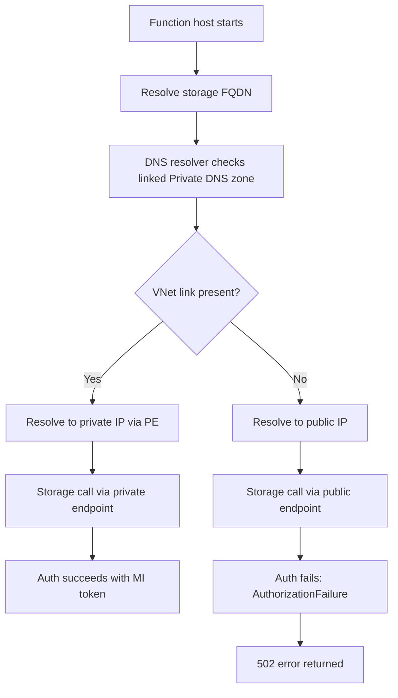
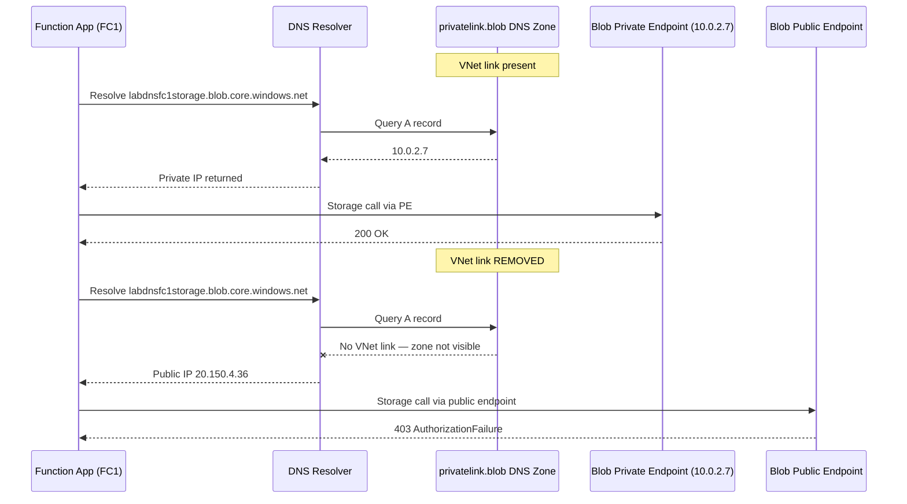
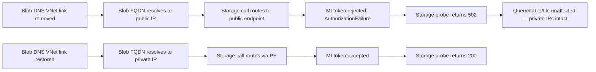
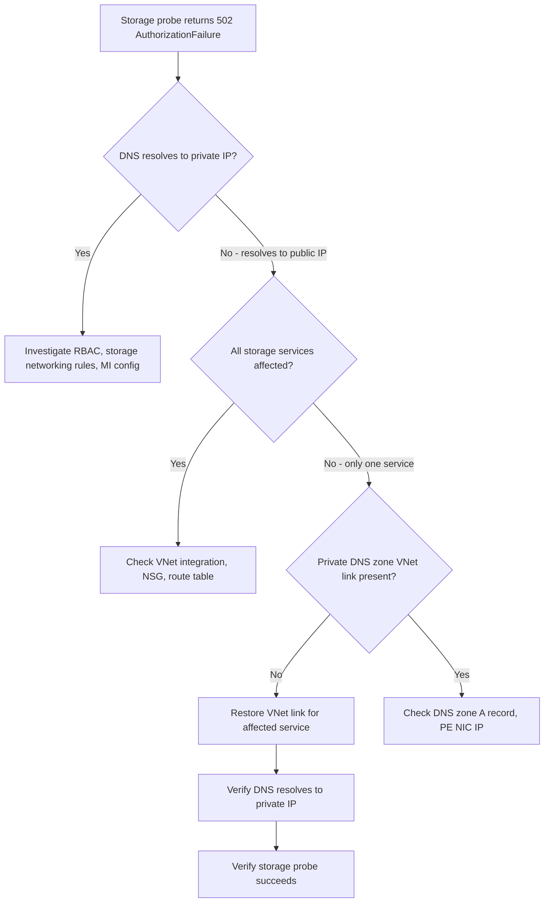

# Lab Guide: DNS and VNet Resolution Failure

This lab reproduces a private DNS resolution failure on an Azure Functions Flex Consumption (FC1) app with private endpoints. By removing the blob storage Private DNS zone VNet link, the function app loses private DNS resolution for blob storage, causing storage operations to route to the public endpoint and fail with `AuthorizationFailure`. Restoring the link restores private resolution and storage access.

!!! note "Evidence source"
    This lab uses direct HTTP endpoint probes (dns-resolve, storage-probe, health, identity-probe) as the authoritative evidence source. App Insights / KQL telemetry was not available for this run due to OpenTelemetry ingestion delay on the FC1 deployment. The endpoint probes execute from inside the Function App context and provide unambiguous DNS and storage state.

---

## Lab Metadata

| Field | Value |
|---|---|
| Lab focus | Private DNS zone VNet link removal breaks blob storage access |
| Runtime | Azure Functions Python v2 (Functions v4) |
| Plan | Flex Consumption (FC1) |
| Trigger | Remove blob Private DNS zone VNet link |
| Key endpoints | `/api/health`, `/api/diagnostics/dns-resolve`, `/api/diagnostics/storage-probe`, `/api/diagnostics/identity-probe` |
| Diagnostic categories | HTTP endpoint probes (dns-resolve, storage-probe), Activity Log |
| Infrastructure | FC1 + VNet + 4 Private Endpoints (blob, queue, table, file) + User-assigned Managed Identity |
| Lab source path | `labs/dns-vnet-resolution/` |

!!! info "What this lab is designed to prove"
    The incident symptom is storage access failure (HTTP 502, `AuthorizationFailure`), but the root cause is DNS visibility loss for the blob private endpoint.

    This lab proves causality with a controlled sequence:

    1. Baseline: all 4 storage endpoints resolve to private IPs, storage probe succeeds.
    2. Trigger: blob Private DNS zone VNet link is removed.
    3. Incident: blob DNS resolves to **public IP** instead of private IP, storage probe returns 502 `AuthorizationFailure`.
    4. Recovery: link is restored, blob DNS resolves to private IP again, storage probe succeeds.

---

## 1) Background

Azure Functions on Flex Consumption with VNet integration and private endpoints depends on Private DNS zones for name resolution. Each storage service (blob, queue, table, file) has its own Private DNS zone (`privatelink.{service}.core.windows.net`) linked to the VNet. If a zone's VNet link is removed, the function app resolves that service's hostname to the **public IP** instead of the **private endpoint IP**.

### 1.1 Private endpoint DNS architecture

When `allowSharedKeyAccess: false` is set on the storage account (common in FC1 identity-based deployments), the managed identity token works over the private endpoint path but fails when traffic routes to the public endpoint — because the storage account's network rules block public access.



### 1.2 Why individual service DNS links matter

Each storage service has an independent Private DNS zone and VNet link:

| Storage service | Private DNS zone | Private endpoint | Private IP |
|---|---|---|---|
| Blob | `privatelink.blob.core.windows.net` | `labdnsfc1-pe-blob` | `10.0.2.7` |
| Queue | `privatelink.queue.core.windows.net` | `labdnsfc1-pe-queue` | `10.0.2.5` |
| Table | `privatelink.table.core.windows.net` | `labdnsfc1-pe-table` | `10.0.2.6` |
| File | `privatelink.file.core.windows.net` | `labdnsfc1-pe-file` | `10.0.2.4` |

Removing one zone's VNet link only affects that service. The other three continue resolving to private IPs. This selective breakage is a key diagnostic signal — it rules out VNet integration failure (which would affect all services) and points directly to DNS zone configuration.

### 1.3 FC1 behavior and why this scenario appears suddenly

Flex Consumption scales quickly and can instantiate new workers frequently. Each new worker performs fresh DNS resolution:

- A DNS drift may remain unnoticed while cached resolution is still valid.
- New worker startup forces fresh DNS queries.
- The first query after a VNet link removal resolves to the public IP.

### 1.4 Failure progression model



### 1.5 Signal map: normal vs incident

| Signal | Normal (baseline) | Incident | Recovery |
|---|---|---|---|
| Blob DNS resolution | Private IP `10.0.2.7` | Public IP `20.150.4.36` | Private IP `10.0.2.7` |
| Queue/table/file DNS | Private IPs | Private IPs (unchanged) | Private IPs |
| Storage probe | 200 success | 502 `AuthorizationFailure` | 200 success |
| Health endpoint | 200 | 200 (app itself is fine) | 200 |
| Identity probe | Token acquired | Token acquired (MI works) | Token acquired |

---

## 2) Hypothesis

### 2.1 Formal hypothesis statement

> If the blob Private DNS zone VNet link is removed from an FC1 function app with private endpoints and `allowSharedKeyAccess: false`, then blob DNS resolves to the public IP instead of the private endpoint IP, and storage operations fail with `AuthorizationFailure` because the public endpoint rejects managed identity tokens when public network access is restricted. Restoring the VNet link restores private resolution and storage access without code changes.

### 2.2 Causal chain



### 2.3 Proof criteria

| Criterion | Required evidence |
|---|---|
| Controlled trigger | VNet link removal confirmed by CLI |
| DNS resolution shift | Blob resolves to public IP (was private) |
| Selective impact | Only blob affected; queue/table/file still private |
| Storage failure | 502 with `AuthorizationFailure` on storage probe |
| App health preserved | Health endpoint returns 200 throughout |
| Identity unaffected | MI token acquisition succeeds throughout |
| Reversal | VNet link restore recovers private resolution and storage probe |

### 2.4 Disproof criteria

| Condition | Why it disproves |
|---|---|
| Blob DNS continues resolving to private IP after link removal | Trigger did not take effect |
| All 4 services fail simultaneously | Root cause is VNet integration, not DNS zone link |
| Storage probe fails with non-auth error (timeout, connection refused) | Network path issue, not DNS-to-public routing |
| Health endpoint also fails | App-level issue, not storage-specific DNS |
| Recovery does not follow link restore | Causality not established |

### 2.5 Competing hypotheses

| Competing hypothesis | What would be observed | How this lab disambiguates |
|---|---|---|
| VNet integration failure | All 4 endpoints affected, not just blob | Check queue/table/file DNS — still private |
| Private endpoint deletion | PE absent from resource list | PE still exists and Succeeded |
| Managed identity issue | Token acquisition fails | Identity probe still succeeds |
| Storage account networking rules | Auth errors on all services | Only blob affected (selective) |
| App code defect | Health endpoint also fails | Health returns 200 throughout |

---

## 3) Runbook

### Prerequisites

| Requirement | Check command |
|---|---|
| Azure CLI logged in | `az account show` |
| Flex Consumption Bicep template | `infra/flex-consumption/main.bicep` |
| Python diagnostics app deployed | 14 functions including dns-resolve, storage-probe |

### 3.1 Variables

```bash
RG="rg-lab-fc1-dns"
LOCATION="koreacentral"
BASE_NAME="labdnsfc1"
APP_NAME="labdnsfc1-func"
STORAGE_NAME="labdnsfc1storage"
VNET_NAME="labdnsfc1-vnet"
AI_NAME="labdnsfc1-insights"
```

### 3.2 Deploy infrastructure

Deploy using the Flex Consumption Bicep template with VNet and private endpoints:

```bash
az group create \
  --name "$RG" \
  --location "$LOCATION"

az deployment group create \
  --resource-group "$RG" \
  --template-file "infra/flex-consumption/main.bicep" \
  --parameters baseName="$BASE_NAME"
```

Deploy the diagnostics app:

```bash
az functionapp deployment source config-zip \
  --name "$APP_NAME" \
  --resource-group "$RG" \
  --src "./apps/python/app.zip"
```

Verify all 4 Private DNS zone VNet links exist:

```bash
for zone in blob queue table file; do
  echo "=== privatelink.${zone}.core.windows.net ==="
  az network private-dns link vnet list \
    --zone-name "privatelink.${zone}.core.windows.net" \
    --resource-group "$RG" \
    --output table
done
```

### 3.3 Capture baseline evidence

#### Baseline DNS resolution (all 4 endpoints)

```bash
for svc in blob queue table file; do
  curl --silent \
    "https://${APP_NAME}.azurewebsites.net/api/diagnostics/dns-resolve?host=${STORAGE_NAME}.${svc}.core.windows.net"
  echo ""
done
```

Baseline output:

```json
{"status": "resolved", "host": "labdnsfc1storage.blob.core.windows.net", "addresses": ["10.0.2.7"], "elapsedMs": 2}
{"status": "resolved", "host": "labdnsfc1storage.queue.core.windows.net", "addresses": ["10.0.2.5"], "elapsedMs": 1}
{"status": "resolved", "host": "labdnsfc1storage.table.core.windows.net", "addresses": ["10.0.2.6"], "elapsedMs": 3}
{"status": "resolved", "host": "labdnsfc1storage.file.core.windows.net", "addresses": ["10.0.2.4"], "elapsedMs": 1}
```

#### Baseline storage probe

```bash
curl --silent \
  "https://${APP_NAME}.azurewebsites.net/api/diagnostics/storage-probe"
```

Output:

```json
{"status": "success", "account": "labdnsfc1storage", "containers": ["azure-webjobs-hosts", "azure-webjobs-secrets", "deployment-packages"], "elapsedMs": 370}
```

#### Baseline health and identity

```bash
curl --silent "https://${APP_NAME}.azurewebsites.net/api/health"
curl --silent "https://${APP_NAME}.azurewebsites.net/api/diagnostics/identity-probe"
```

Output:

```json
{"status": "healthy", "timestamp": "2026-04-07T09:25:05+00:00", "version": "1.0.0"}
{"status": "success", "identityType": "user-assigned", "clientId": "<managed-identity-client-id>", "tokenAcquired": true, "tokenExpiresOn": "2026-04-08T09:25:07Z", "elapsedMs": 44}
```

### 3.4 Trigger the failure

Remove the blob Private DNS zone VNet link:

```bash
az network private-dns link vnet delete \
  --resource-group "$RG" \
  --zone-name "privatelink.blob.core.windows.net" \
  --name "${BASE_NAME}-blob-dns-link" \
  --yes
```

!!! warning "Fault injection timestamp"
    Record the exact UTC timestamp of link removal. In this lab run: `2026-04-07T09:27:41Z`.

Verify the link is gone:

```bash
az network private-dns link vnet list \
  --zone-name "privatelink.blob.core.windows.net" \
  --resource-group "$RG" \
  --output table
```

Expected: empty table (no VNet links for blob zone).

CLI output confirming blob VNet link is absent:

```text
$ az network private-dns link vnet list \
    --zone-name "privatelink.blob.core.windows.net" \
    --resource-group "$RG" \
    --output table

Result
--------
(empty — no VNet links found for blob zone)
```

Verify other zones are unaffected:

```bash
for zone in queue table file; do
  echo "=== privatelink.${zone}.core.windows.net ==="
  az network private-dns link vnet list \
    --zone-name "privatelink.${zone}.core.windows.net" \
    --resource-group "$RG" \
    --output table
done
```

Expected: queue, table, and file VNet links still present.

### 3.5 Collect incident evidence

#### Incident DNS resolution — the key diagnostic

```bash
for svc in blob queue table file; do
  curl --silent \
    "https://${APP_NAME}.azurewebsites.net/api/diagnostics/dns-resolve?host=${STORAGE_NAME}.${svc}.core.windows.net"
  echo ""
done
```

Incident output:

```json
{"status": "resolved", "host": "labdnsfc1storage.blob.core.windows.net", "addresses": ["20.150.4.36"], "elapsedMs": 87}
{"status": "resolved", "host": "labdnsfc1storage.queue.core.windows.net", "addresses": ["10.0.2.5"], "elapsedMs": 1}
{"status": "resolved", "host": "labdnsfc1storage.table.core.windows.net", "addresses": ["10.0.2.6"], "elapsedMs": 3}
{"status": "resolved", "host": "labdnsfc1storage.file.core.windows.net", "addresses": ["10.0.2.4"], "elapsedMs": 1}
```

!!! danger "Key finding"
    Blob now resolves to **public IP `20.150.4.36`** instead of private IP `10.0.2.7`. The other three services still resolve to their private IPs — this selective impact confirms DNS zone link as the root cause.

#### Incident storage probe

```bash
curl --silent --write-out "\nHTTP Status: %{http_code}\n" \
  "https://${APP_NAME}.azurewebsites.net/api/diagnostics/storage-probe"
```

Incident output:

```text
{"status": "error", "error": "AuthorizationFailure: This request is not authorized to perform this operation.\nRequestId: a1b2c3d4-e5f6-7890-abcd-ef1234567890\nTime: 2026-04-07T09:28:08Z\nErrorCode: AuthorizationFailure"}
HTTP Status: 502
```

#### Incident health and identity (confirming app and MI are fine)

```bash
curl --silent "https://${APP_NAME}.azurewebsites.net/api/health"
curl --silent "https://${APP_NAME}.azurewebsites.net/api/diagnostics/identity-probe"
```

Output:

```json
{"status": "healthy", "timestamp": "2026-04-07T09:28:24+00:00", "version": "1.0.0"}
{"status": "success", "identityType": "user-assigned", "clientId": "<managed-identity-client-id>", "tokenAcquired": true, "tokenExpiresOn": "2026-04-08T09:28:26Z", "elapsedMs": 47}
```

!!! note "Why health and identity still succeed"
    The health endpoint does not access storage. The identity probe only acquires a token — it does not call storage. This proves the Function App runtime and managed identity are both healthy. The failure is isolated to the DNS-to-storage path.

#### Incident persistence after restart

```bash
az functionapp restart \
  --name "$APP_NAME" \
  --resource-group "$RG"

# Wait 30 seconds for restart
sleep 30

curl --silent \
  "https://${APP_NAME}.azurewebsites.net/api/diagnostics/dns-resolve?host=${STORAGE_NAME}.blob.core.windows.net"
curl --silent --write-out "\nHTTP Status: %{http_code}\n" \
  "https://${APP_NAME}.azurewebsites.net/api/diagnostics/storage-probe"
```

Post-restart output:

```json
{"status": "resolved", "host": "labdnsfc1storage.blob.core.windows.net", "addresses": ["20.150.4.36"], "elapsedMs": 87}
```

```text
{"status": "error", "error": "AuthorizationFailure: ..."}
HTTP Status: 502
```

!!! note "Restart does not fix DNS"
    The fault persists after app restart because the DNS zone VNet link is still missing. This rules out transient DNS cache issues and confirms structural DNS configuration as the root cause.

### 3.6 Investigation summary

| Check | Baseline | Incident | Interpretation |
|---|---|---|---|
| Blob DNS resolution | `10.0.2.7` (private) | `20.150.4.36` (public) | DNS path changed |
| Queue DNS resolution | `10.0.2.5` (private) | `10.0.2.5` (private) | Unaffected |
| Table DNS resolution | `10.0.2.6` (private) | `10.0.2.6` (private) | Unaffected |
| File DNS resolution | `10.0.2.4` (private) | `10.0.2.4` (private) | Unaffected |
| Storage probe | 200 success | 502 `AuthorizationFailure` | Blob access broken |
| Health endpoint | 200 healthy | 200 healthy | App runtime fine |
| Identity probe | Token acquired | Token acquired | MI fine |
| Blob VNet link | Present | **Missing** | Root cause |
| Other VNet links | Present | Present | Selective impact |

### 3.7 Triage decision flow



### 3.8 Recover from the induced failure

Restore the blob Private DNS zone VNet link:

```bash
az network private-dns link vnet create \
  --name "${BASE_NAME}-blob-dns-link" \
  --zone-name "privatelink.blob.core.windows.net" \
  --resource-group "$RG" \
  --virtual-network "$VNET_NAME" \
  --registration-enabled false
```

Restart the app:

```bash
az functionapp restart \
  --name "$APP_NAME" \
  --resource-group "$RG"
```

Wait 30 seconds for DNS propagation.

### 3.9 Verify recovery

#### Recovery DNS resolution

```bash
for svc in blob queue table file; do
  curl --silent \
    "https://${APP_NAME}.azurewebsites.net/api/diagnostics/dns-resolve?host=${STORAGE_NAME}.${svc}.core.windows.net"
  echo ""
done
```

Recovery output:

```json
{"status": "resolved", "host": "labdnsfc1storage.blob.core.windows.net", "addresses": ["10.0.2.7"], "elapsedMs": 12}
{"status": "resolved", "host": "labdnsfc1storage.queue.core.windows.net", "addresses": ["10.0.2.5"], "elapsedMs": 4}
{"status": "resolved", "host": "labdnsfc1storage.table.core.windows.net", "addresses": ["10.0.2.6"], "elapsedMs": 28}
{"status": "resolved", "host": "labdnsfc1storage.file.core.windows.net", "addresses": ["10.0.2.4"], "elapsedMs": 19}
```

#### Recovery storage probe

```bash
curl --silent \
  "https://${APP_NAME}.azurewebsites.net/api/diagnostics/storage-probe"
```

Output:

```json
{"status": "success", "account": "labdnsfc1storage", "containers": ["azure-webjobs-hosts", "azure-webjobs-secrets", "deployment-packages"], "elapsedMs": 307}
```

#### Recovery health and identity

```bash
curl --silent "https://${APP_NAME}.azurewebsites.net/api/health"
curl --silent "https://${APP_NAME}.azurewebsites.net/api/diagnostics/identity-probe"
```

Output:

```json
{"status": "healthy", "timestamp": "2026-04-07T09:38:11+00:00", "version": "1.0.0"}
{"status": "success", "identityType": "user-assigned", "clientId": "<managed-identity-client-id>", "tokenAcquired": true, "tokenExpiresOn": "2026-04-08T09:38:36Z", "elapsedMs": 52}
```

---

## 4) Experiment Log

### Artifact inventory

| Category | Artifacts |
|---|---|
| Infrastructure | FC1 Bicep deployment, VNet with 4 PEs, 4 Private DNS zones, user-assigned MI |
| Baseline probes | dns-resolve (4 endpoints), storage-probe, health, identity-probe |
| Incident probes | dns-resolve showing public IP, storage-probe 502, health 200, identity 200 |
| Recovery probes | dns-resolve (private IP restored), storage-probe 200, health 200 |
| CLI evidence | VNet link list (before/during/after), function list, app settings |

### Evidence timeline

| Time (UTC) | Phase | Signal | Observation |
|---|---|---|---|
| 09:25:05 | Baseline | health | 200 healthy |
| 09:25:07 | Baseline | dns-resolve (blob) | `10.0.2.7` (private IP) |
| 09:25:07 | Baseline | dns-resolve (queue) | `10.0.2.5` (private IP) |
| 09:25:07 | Baseline | dns-resolve (table) | `10.0.2.6` (private IP) |
| 09:25:07 | Baseline | dns-resolve (file) | `10.0.2.4` (private IP) |
| 09:25:09 | Baseline | storage-probe | 200 success, 370ms, 3 containers |
| 09:25:09 | Baseline | identity-probe | Token acquired, 44ms |
| 09:27:41 | **Trigger** | CLI | **Blob DNS VNet link removed** |
| 09:27:56 | Incident | dns-resolve (blob) | **`20.150.4.36` (public IP!)** |
| 09:27:56 | Incident | dns-resolve (queue) | `10.0.2.5` (unchanged) |
| 09:27:56 | Incident | dns-resolve (table) | `10.0.2.6` (unchanged) |
| 09:27:56 | Incident | dns-resolve (file) | `10.0.2.4` (unchanged) |
| 09:28:08 | Incident | storage-probe | **502 AuthorizationFailure** |
| 09:28:24 | Incident | health | 200 healthy (app fine) |
| 09:28:24 | Incident | identity-probe | Token acquired, 47ms (MI fine) |
| 09:28:52 | Incident | app restart | Restart issued |
| 09:29:22 | Incident | dns-resolve (blob) | Still `20.150.4.36` (restart did not fix) |
| 09:29:22 | Incident | storage-probe | Still 502 AuthorizationFailure |
| 09:36:41 | **Recovery** | CLI | **Blob DNS VNet link restored** |
| 09:37:24 | Recovery | app restart | Restart issued |
| 09:38:11 | Recovery | health | 200 healthy |
| 09:38:46 | Recovery | dns-resolve (blob) | **`10.0.2.7` (private IP restored!)** |
| 09:38:46 | Recovery | dns-resolve (queue) | `10.0.2.5` |
| 09:38:46 | Recovery | dns-resolve (table) | `10.0.2.6` |
| 09:38:46 | Recovery | dns-resolve (file) | `10.0.2.4` |
| 09:38:48 | Recovery | storage-probe | **200 success, 307ms** |
| 09:38:50 | Recovery | identity-probe | Token acquired, 52ms |
| 09:39:07 | Recovery | storage-probe (round 2) | 200 success, 288ms (stable) |
| 09:39:10 | Recovery | dns-resolve (blob, round 2) | `10.0.2.7`, 14ms (stable) |

### Representative log patterns

#### Baseline endpoint responses

```text
[Baseline 09:25:07Z]
dns-resolve blob: {"status":"resolved","addresses":["10.0.2.7"],"elapsedMs":2}
dns-resolve queue: {"status":"resolved","addresses":["10.0.2.5"],"elapsedMs":1}
storage-probe: {"status":"success","containers":["azure-webjobs-hosts","azure-webjobs-secrets","deployment-packages"],"elapsedMs":370}
identity-probe: {"status":"success","tokenAcquired":true,"elapsedMs":44}
```

#### Incident endpoint responses

```text
[Incident 09:27:56Z — after blob VNet link removal]
dns-resolve blob: {"status":"resolved","addresses":["20.150.4.36"],"elapsedMs":87}
dns-resolve queue: {"status":"resolved","addresses":["10.0.2.5"],"elapsedMs":1}  (unchanged)
storage-probe: {"status":"error","error":"AuthorizationFailure: This request is not authorized..."}  HTTP 502
health: {"status":"healthy"}  HTTP 200  (app itself is fine)
identity-probe: {"status":"success","tokenAcquired":true}  (MI works fine)
```

#### Recovery endpoint responses

```text
[Recovery 09:38:46Z — after blob VNet link restored]
dns-resolve blob: {"status":"resolved","addresses":["10.0.2.7"],"elapsedMs":12}
storage-probe: {"status":"success","containers":[...],"elapsedMs":307}
health: {"status":"healthy"}  HTTP 200
identity-probe: {"status":"success","tokenAcquired":true,"elapsedMs":52}
```

### Core finding

!!! success "Key finding (validated)"
    Removing the blob Private DNS zone VNet link causes blob DNS to resolve to the **public IP** (`20.150.4.36`) instead of the private endpoint IP (`10.0.2.7`). With `allowSharedKeyAccess: false`, the managed identity token is rejected at the public endpoint with `AuthorizationFailure`.

    The failure is **selective** — only blob is affected while queue, table, and file continue resolving to private IPs. This selective impact is the key diagnostic signal that distinguishes DNS zone configuration issues from VNet integration failures.

    Restoring the VNet link immediately restores private DNS resolution and storage access.

### Hypothesis verdict table

| Criterion | Result | Evidence |
|---|---|---|
| Controlled trigger (link removal) | Confirmed | CLI command at 09:27:41Z |
| DNS resolution shift | Supported | Blob: `10.0.2.7` → `20.150.4.36` |
| Selective impact | Supported | Only blob affected; queue/table/file unchanged |
| Storage failure | Supported | 502 `AuthorizationFailure` |
| App health preserved | Supported | Health 200 throughout |
| Identity unaffected | Supported | Token acquired throughout |
| Restart does not fix | Supported | Same failure after restart at 09:28:52Z |
| VNet link restore recovers | Supported | Blob back to `10.0.2.7`, storage probe 200 |
| Recovery stable | Supported | Multiple rounds confirm at 09:39:07Z |

Final verdict: **Hypothesis supported**.

### Practical implications for production

1. **Monitor each DNS zone VNet link independently** — a missing link for one service does not affect others, making it easy to miss in aggregate health checks.
2. **DNS resolution check is the fastest diagnostic** — resolving the storage FQDN from within the function app immediately reveals public vs private IP routing.
3. **Restart does not fix DNS configuration** — unlike transient DNS cache issues, a missing VNet link persists across restarts.
4. **`allowSharedKeyAccess: false` amplifies DNS failures** — with shared key access disabled, any path change from private to public immediately causes auth failures.
5. **Automate VNet link validation in deployment pipelines** — include link existence checks in IaC validation and post-deployment smoke tests.

---

## Expected Evidence

### Before Trigger (Baseline)

| Signal | Expected Value |
|---|---|
| Blob DNS resolution | Private IP `10.0.2.7` |
| Queue DNS resolution | Private IP `10.0.2.5` |
| Table DNS resolution | Private IP `10.0.2.6` |
| File DNS resolution | Private IP `10.0.2.4` |
| Storage probe | 200 success, containers listed |
| Health endpoint | 200 healthy |
| Identity probe | Token acquired |
| All 4 VNet links | Present |

### During Incident

| Signal | Expected Value |
|---|---|
| Blob DNS resolution | **Public IP** (e.g., `20.150.4.36`) |
| Queue/table/file DNS | Private IPs (unchanged) |
| Storage probe | 502 `AuthorizationFailure` |
| Health endpoint | 200 healthy (app fine) |
| Identity probe | Token acquired (MI fine) |
| Blob VNet link | **Missing** |
| Other VNet links | Present |

### After Recovery

| Signal | Expected Value |
|---|---|
| Blob DNS resolution | Private IP `10.0.2.7` restored |
| Queue/table/file DNS | Private IPs (unchanged) |
| Storage probe | 200 success |
| Health endpoint | 200 healthy |
| Identity probe | Token acquired |
| All 4 VNet links | Present |

### Evidence Timeline

```mermaid
gantt
    title DNS / VNet Resolution Failure Timeline (FC1 Lab)
    dateFormat  HH:mm
    axisFormat  %H:%M
    section Baseline
    Baseline capture (all endpoints private)    :done, b1, 09:25, 2m
    section Trigger
    Remove blob DNS VNet link                   :crit, t1, 09:27, 1m
    section Incident
    Blob resolves to public IP + storage 502    :crit, i1, 09:28, 2m
    Confirm restart does not fix                :crit, i2, 09:29, 1m
    section Recovery
    Restore blob DNS VNet link                  :done, r1, 09:36, 2m
    App restart + DNS propagation               :done, r2, 09:37, 1m
    Verify recovery (private IP + storage 200)  :done, r3, 09:38, 2m
```



### Evidence Chain: Why This Proves the Hypothesis

!!! success "Falsification logic"
    The hypothesis is supported when all conditions hold simultaneously:

    1. **Single variable changed**: Only the blob DNS VNet link was removed. No code, RBAC, network rules, or endpoint changes.
    2. **DNS shift observed**: Blob resolves to public IP immediately after link removal.
    3. **Selective impact confirmed**: Queue, table, file continue resolving to private IPs — ruling out VNet integration failure.
    4. **Auth failure explained**: `allowSharedKeyAccess: false` + public endpoint = `AuthorizationFailure`.
    5. **Controls stable**: Health and identity probes succeed throughout — app and MI are healthy.
    6. **Restart ineffective**: Proves structural DNS issue, not transient cache.
    7. **Recovery follows restoration**: VNet link restore → private IP → storage success, with no other changes.

    If any of these conditions failed to hold, the hypothesis would require reassessment.

## Clean Up

```bash
az group delete \
  --name "$RG" \
  --yes \
  --no-wait
```

## Related Playbook

- [Functions Failing with Errors](../playbooks/functions-failing.md)

## See Also

- [Troubleshooting Lab Guides](../lab-guides.md)
- [First 10 Minutes Triage](../first-10-minutes.md)
- [Troubleshooting Methodology](../methodology.md)
- [KQL Reference for Troubleshooting](../kql.md)
- [Evidence Map](../evidence-map.md)

## Sources

- [Azure Functions networking options](https://learn.microsoft.com/azure/azure-functions/functions-networking-options)
- [Azure private endpoint DNS configuration](https://learn.microsoft.com/azure/private-link/private-endpoint-dns)
- [Azure Functions storage considerations](https://learn.microsoft.com/azure/azure-functions/storage-considerations)
- [Azure Private DNS overview](https://learn.microsoft.com/azure/dns/private-dns-overview)
- [Monitor Azure Functions](https://learn.microsoft.com/azure/azure-functions/functions-monitoring)
- [Azure DNS private zones CLI reference](https://learn.microsoft.com/cli/azure/network/private-dns)
