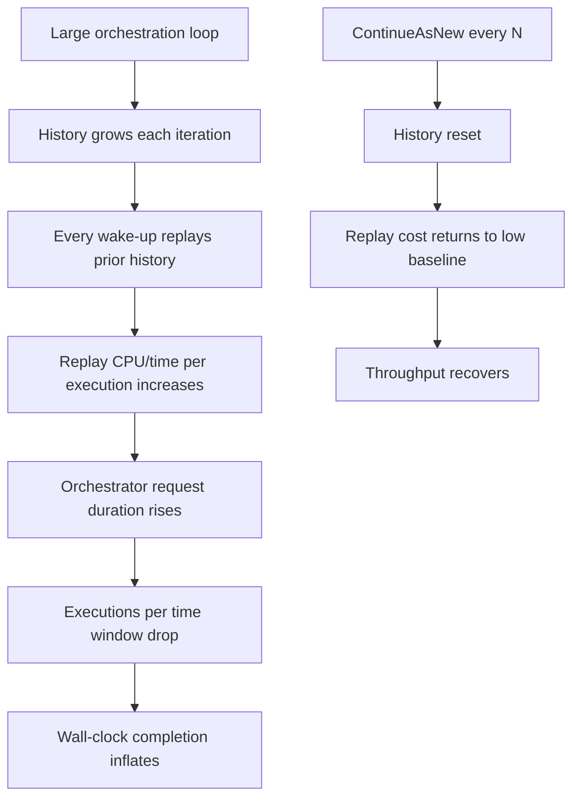
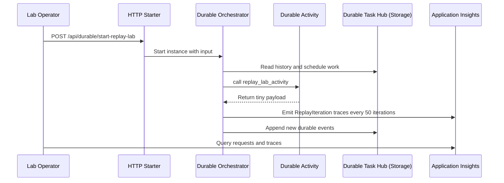
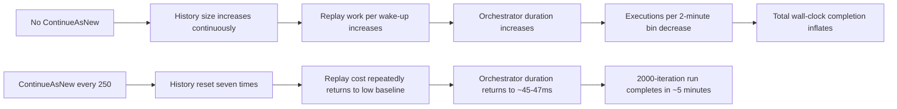
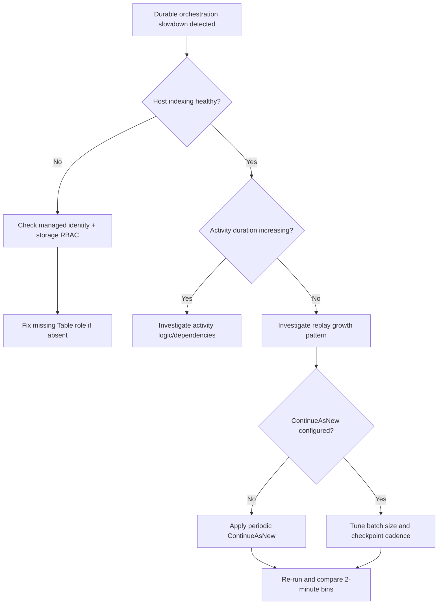

# Lab Guide: Durable Functions Replay Storm on Azure Functions Premium EP1

This lab guide documents a completed Azure Functions Premium EP1 experiment that captured a real Durable Functions replay storm. The objective is to prove, with reproducible evidence, that orchestration replay overhead can dominate end-to-end completion time even when activity execution remains stable.

## Lab Metadata

| Field | Value |
|---|---|
| Difficulty | L3 (advanced Durable troubleshooting and evidence correlation) |
| Duration | 60-90 minutes |
| Hosting plan | Premium EP1 (Linux) |
| Runtime | Azure Functions v4, Python 3.11 (v2 model) |
| Function app | `labep1shared-func` |
| Resource group | `rg-lab-ep1-shared` |
| Region | `koreacentral` |
| Storage account | `labep1sharedstorage` (managed identity auth) |
| Durable app model | `df.DFApp` + blueprint `apps/python/blueprints/durable_lab.py` |
| Application Insights app ID | `928dbc99-8353-4e70-889b-860f3401220e` |
| Trigger path | `POST /api/durable/start-replay-lab` |
| Activity function | `replay_lab_activity` |
| Orchestrator function | `replay_storm_orchestrator` |
| Evidence window (UTC) | 2026-04-07 12:28:00 to 13:01:21 |
| Artifact category | `requests`, `traces`, Azure CLI outputs |

!!! info "What this lab is designed to prove"
    For the same logical workload (`2000` iterations), total completion time was `~26 minutes` without `ContinueAsNew` and `~5 minutes` with `ContinueAsNew` every `250` iterations.

    During incident progression, orchestrator duration increased from roughly `136 ms` to `641 ms` average per 2-minute bin, while activity duration stayed flat around `2.7-3.4 ms`.

    This controlled contrast demonstrates replay amplification as the bottleneck, not slower activity work.

## 1) Background

Durable Functions orchestrators are deterministic and replay event history every time the orchestration wakes. This is expected behavior, but replay cost scales with history size. If a long-running orchestration never resets history, replay overhead can increase enough to suppress throughput and inflate wall-clock completion time.

### Replay growth model used in this lab



### Test topology and evidence channels



### Experiment phases

| Phase | Instance ID | Start (UTC) | End (UTC) | Workload shape | Result |
|---|---|---|---|---|---|
| Baseline | `7192e16593814d7f859c77558543c1da` | 12:28:36 | 12:28:41 | 50 iterations, no `ContinueAsNew` | Completes in ~5s |
| Incident | `7a21e8d1258a488bad8392f1bdfa36bf` | 12:29:22 | 12:55:28 | 2000 iterations, no `ContinueAsNew` | Completes in ~26m |
| Recovery | `58ce8fb52432461787717b8b1a83256b` | 12:56:18 | 13:01:21 | 2000 iterations, `ContinueAsNew` every 250 | Completes in ~5m |

### Key known-good control signal

The activity body (`replay_lab_activity`) remained in the same latency band across all phases:

- Baseline: avg around `2.7 ms`
- Incident: avg around `3.0-3.4 ms`
- Recovery: avg around `2.8 ms`

This is the primary control signal that isolates replay overhead as the changing variable.

### RBAC discovery during setup (important context)

Before collecting replay evidence, the function host initially failed to index Durable functions because managed identity permissions were incomplete. Specifically, `Storage Table Data Contributor` was missing, causing `403 AuthorizationPermissionMismatch` errors against task hub table operations.

The Bicep role set originally included Blob, Queue, File, and Account roles, but not Table role. Adding Table access fixed host indexing and enabled lab execution.

Required storage RBAC role set for this Durable setup:

1. Storage Account Contributor
2. Storage Blob Data Owner
3. Storage File Data Privileged Contributor
4. Storage Queue Data Contributor
5. Storage Table Data Contributor

### Why this distinction matters

Replay incidents and storage authorization failures can both present as "Durable is slow/not progressing." This lab separates them:

- RBAC issue: startup/indexing failure, orchestration cannot run correctly
- Replay storm: orchestration runs, activity remains fast, orchestrator duration degrades with history growth

### Phase-level objective map

| Phase | Purpose | What must be observed |
|---|---|---|
| Baseline | Validate healthy low-history behavior | low orchestrator duration, low total wall-clock |
| Incident | Reproduce replay amplification | rising orchestrator duration + falling throughput |
| Recovery | Validate mitigation causality | duration and throughput revert after periodic history reset |

### Time-compression view of the run

```mermaid
gantt
    title Durable Replay Storm Experiment Timeline (UTC)
    dateFormat  HH:mm:ss
    axisFormat  %H:%M
    section Baseline
    50 iterations no reset                 :done, b1, 12:28:36, 5s
    section Incident
    2000 iterations no ContinueAsNew       :crit, i1, 12:29:22, 26m
    section Recovery
    2000 iterations ContinueAsNew=250      :done, r1, 12:56:18, 5m
```



### Ground truth summary used in this document

| Signal | Baseline | Incident | Recovery |
|---|---|---|---|
| Orchestrator average duration | `42.2 ms` | grew to `641.4 ms` | `45.2-47.0 ms` |
| Orchestrator p95 | `81.8 ms` | grew to `796.1 ms` | `81.9-86.5 ms` |
| Activity average duration | `2.7 ms` | `3.0-3.4 ms` | `2.8 ms` |
| Throughput (executions/2m) | `297` | dropped as low as `63` | `694-806` |
| Replay trace spacing | ~7s batch interval | widened to ~65s | reset each batch |

## 2) Hypothesis

> In this EP1 deployment, the severe slowdown in the 2000-iteration run is caused by replay overhead growth in the orchestrator history, not activity execution latency. Therefore, orchestrator duration should rise and throughput should fall during the no-reset run, while activity duration remains flat. Applying `ContinueAsNew` every `250` iterations should restore orchestrator duration and throughput to near-baseline ranges.

### Causal chain



### Competing hypotheses and disproof criteria

| Competing hypothesis | Expected telemetry if true | Observed in this run | Verdict |
|---|---|---|---|
| Activity is slow | Activity avg/p95 rises with orchestrator rise | Activity stays ~`2.7-3.4 ms` | Rejected |
| Downstream dependency bottleneck | dependency/activity bands inflate materially | No matching inflation in activity | Rejected |
| Random platform instability | all paths degrade similarly | only orchestrator path degrades in incident | Rejected |
| Replay overhead growth | orchestrator grows, activity flat, reset recovers | matches exactly | Supported |

### Proof checklist

| Criterion | Required evidence | Status |
|---|---|---|
| Baseline control is healthy | 50-iteration run ~5s with low orchestrator duration | Met |
| Incident shows replay amplification | orchestrator avg rises from ~136 ms to ~641 ms | Met |
| Activity remains stable | activity avg remains ~2.7-3.4 ms | Met |
| Throughput collapses in incident | executions/2m declines to low double digits | Met |
| ContinueAsNew creates recovery | orchestrator returns to ~45-47 ms + fast completion | Met |

### Falsification statement

The hypothesis would be rejected if either of the following were true:

- activity latency rose proportionally with orchestrator latency
- recovery with `ContinueAsNew=250` did not restore duration and throughput

Neither condition occurred in the evidence.

## 3) Runbook

### Variables (generic first, then concrete values)

```bash
RG="<resource-group>"
APP_NAME="<function-app-name>"
STORAGE_NAME="<storage-account-name>"
LOCATION="<azure-region>"
AI_APP_ID="<app-insights-app-id>"
```

Concrete values used in this completed experiment:

```bash
RG="rg-lab-ep1-shared"
APP_NAME="labep1shared-func"
STORAGE_NAME="labep1sharedstorage"
LOCATION="koreacentral"
AI_APP_ID="928dbc99-8353-4e70-889b-860f3401220e"
```

### 3.1 Validate deployment context

```bash
az functionapp show \
  --name "$APP_NAME" \
  --resource-group "$RG" \
  --output table
```

```bash
az storage account show \
  --name "$STORAGE_NAME" \
  --resource-group "$RG" \
  --output table
```

```bash
az monitor app-insights component show \
  --app "$AI_APP_ID" \
  --resource-group "$RG" \
  --output table
```

### 3.2 Validate Durable storage RBAC for managed identity

```bash
PRINCIPAL_ID=$(az functionapp identity show \
  --name "$APP_NAME" \
  --resource-group "$RG" \
  --query principalId \
  --output tsv)

STORAGE_SCOPE=$(az storage account show \
  --name "$STORAGE_NAME" \
  --resource-group "$RG" \
  --query id \
  --output tsv)

az role assignment list \
  --assignee "$PRINCIPAL_ID" \
  --scope "$STORAGE_SCOPE" \
  --output table
```

Expected role set:

| Required role | Why it is needed in this lab |
|---|---|
| Storage Account Contributor | account-level control path for host operations |
| Storage Blob Data Owner | blob-backed durable artifacts |
| Storage File Data Privileged Contributor | file share interactions on app service storage path |
| Storage Queue Data Contributor | durable queue transport |
| Storage Table Data Contributor | durable task hub table entities |

!!! warning "If `Storage Table Data Contributor` is missing"
    Durable host may fail to index functions with `403 AuthorizationPermissionMismatch`.

    Add the role before running this lab; otherwise orchestration telemetry is not trustworthy because startup itself is unhealthy.

### 3.3 Start baseline phase (50 iterations, no reset)

```bash
curl --request POST \
  --url "https://${APP_NAME}.azurewebsites.net/api/durable/start-replay-lab" \
  --header "Content-Type: application/json" \
  --data '{"iterations":50,"continueAsNewEvery":0,"instances":1}'
```

Expected baseline instance ID from recorded run:

`7192e16593814d7f859c77558543c1da`

### 3.4 Start incident phase (2000 iterations, no reset)

```bash
curl --request POST \
  --url "https://${APP_NAME}.azurewebsites.net/api/durable/start-replay-lab" \
  --header "Content-Type: application/json" \
  --data '{"iterations":2000,"continueAsNewEvery":0,"instances":1}'
```

Expected incident instance ID from recorded run:

`7a21e8d1258a488bad8392f1bdfa36bf`

### 3.5 Start recovery phase (2000 iterations, reset every 250)

```bash
curl --request POST \
  --url "https://${APP_NAME}.azurewebsites.net/api/durable/start-replay-lab" \
  --header "Content-Type: application/json" \
  --data '{"iterations":2000,"continueAsNewEvery":250,"instances":1}'
```

Expected recovery instance ID from recorded run:

`58ce8fb52432461787717b8b1a83256b`

### 3.6 Poll orchestration status (optional operator convenience)

```bash
INSTANCE_ID="7a21e8d1258a488bad8392f1bdfa36bf"

curl --request GET \
  --url "https://${APP_NAME}.azurewebsites.net/api/durable/status/${INSTANCE_ID}"
```

### 3.7 Core KQL queries (requests + traces)

!!! note "Duration conversion rule for this lab"
    Every duration conversion in this document uses `toreal(duration / 1ms)`.

    Do not use alternate conversion patterns for duration math in this lab.

#### Query A: Orchestrator duration timeline in 2-minute bins

```kusto
let BaselineEnd = datetime(2026-04-07 12:29:22Z);
let IncidentEnd = datetime(2026-04-07 12:56:18Z);
let RunEnd = datetime(2026-04-07 13:02:00Z);
let baseline = requests
    | where timestamp >= datetime(2026-04-07 12:28:00Z) and timestamp < BaselineEnd
    | where cloud_RoleName == "labep1shared-func"
    | where operation_Name has "replay_storm_orchestrator"
    | extend phase = "Baseline";
let incident = requests
    | where timestamp >= BaselineEnd and timestamp < IncidentEnd
    | where cloud_RoleName == "labep1shared-func"
    | where operation_Name has "replay_storm_orchestrator"
    | extend phase = "Incident";
let recovery = requests
    | where timestamp >= IncidentEnd and timestamp < RunEnd
    | where cloud_RoleName == "labep1shared-func"
    | where operation_Name has "replay_storm_orchestrator"
    | extend phase = "Recovery";
union baseline, incident, recovery
| summarize
    executions = count(),
    avg_ms = round(avg(toreal(duration / 1ms)), 1),
    p95_ms = round(percentile(toreal(duration / 1ms), 95), 1),
    max_ms = round(max(toreal(duration / 1ms)), 1)
  by phase, bin(timestamp, 2m)
| order by timestamp asc
```

#### Query B: Activity duration timeline in 2-minute bins

```kusto
let BaselineEnd = datetime(2026-04-07 12:29:22Z);
let IncidentEnd = datetime(2026-04-07 12:56:18Z);
let RunEnd = datetime(2026-04-07 13:02:00Z);
let baseline = requests
    | where timestamp >= datetime(2026-04-07 12:28:00Z) and timestamp < BaselineEnd
    | where cloud_RoleName == "labep1shared-func"
    | where operation_Name has "replay_lab_activity"
    | extend phase = "Baseline";
let incident = requests
    | where timestamp >= BaselineEnd and timestamp < IncidentEnd
    | where cloud_RoleName == "labep1shared-func"
    | where operation_Name has "replay_lab_activity"
    | extend phase = "Incident";
let recovery = requests
    | where timestamp >= IncidentEnd and timestamp < RunEnd
    | where cloud_RoleName == "labep1shared-func"
    | where operation_Name has "replay_lab_activity"
    | extend phase = "Recovery";
union baseline, incident, recovery
| summarize
    activities = count(),
    avg_ms = round(avg(toreal(duration / 1ms)), 1),
    p95_ms = round(percentile(toreal(duration / 1ms), 95), 1),
    max_ms = round(max(toreal(duration / 1ms)), 1)
  by phase, bin(timestamp, 2m)
| order by timestamp asc
```

#### Query C: Orchestrator-by-instance rollup

```kusto
let BaselineId = "7192e16593814d7f859c77558543c1da";
let IncidentId = "7a21e8d1258a488bad8392f1bdfa36bf";
let RecoveryId = "58ce8fb52432461787717b8b1a83256b";
requests
| where cloud_RoleName == "labep1shared-func"
| where operation_Name has "replay_storm_orchestrator"
| where operation_Id in (BaselineId, IncidentId, RecoveryId)
| summarize
    executions = count(),
    avg_ms = round(avg(toreal(duration / 1ms)), 1),
    p95_ms = round(percentile(toreal(duration / 1ms), 95), 1),
    max_ms = round(max(toreal(duration / 1ms)), 1),
    start_time = min(timestamp),
    end_time = max(timestamp)
  by operation_Id
| order by start_time asc
```

#### Query D: ReplayIteration traces with parsing

```kusto
let IncidentId = "7a21e8d1258a488bad8392f1bdfa36bf";
traces
| where timestamp >= datetime(2026-04-07 12:28:00Z) and timestamp < datetime(2026-04-07 13:02:00Z)
| where cloud_RoleName == "labep1shared-func"
| where message has "ReplayIteration"
| where operation_Id == IncidentId or operation_ParentId == IncidentId
| parse message with * "batch=" batch:int " iteration=" iter:int "/" total:int " elapsed=" elapsed_ms:real "ms"
| project timestamp, batch, iter, total, elapsed_ms, message
| order by timestamp asc
```

#### Query E: ContinueAsNew and completion traces

```kusto
let RecoveryId = "58ce8fb52432461787717b8b1a83256b";
traces
| where timestamp >= datetime(2026-04-07 12:56:00Z) and timestamp < datetime(2026-04-07 13:02:00Z)
| where cloud_RoleName == "labep1shared-func"
| where message has_any ("ContinueAsNew", "Orchestration complete")
| where operation_Id == RecoveryId or operation_ParentId == RecoveryId
| project timestamp, message
| order by timestamp asc
```

#### Query F: 50-iteration marker intervals from traces

```kusto
let IncidentId = "7a21e8d1258a488bad8392f1bdfa36bf";
traces
| where timestamp >= datetime(2026-04-07 12:28:00Z) and timestamp < datetime(2026-04-07 13:02:00Z)
| where cloud_RoleName == "labep1shared-func"
| where message has "ReplayIteration"
| where operation_Id == IncidentId or operation_ParentId == IncidentId
| parse message with * "iteration=" iter:int "/" total:int *
| where iter % 50 == 0
| project timestamp, iter, total, message
| order by timestamp asc
| serialize
| extend previous_timestamp = prev(timestamp)
| extend interval_seconds = iif(isnull(previous_timestamp), real(null), toreal(datetime_diff('second', timestamp, previous_timestamp)))
```

### 3.8 Execute KQL with Azure CLI

```bash
az monitor log-analytics query \
  --workspace "$LOG_WORKSPACE_ID" \
  --analytics-query "let StartTime = datetime(2026-04-07 12:28:00Z); let EndTime = datetime(2026-04-07 13:02:00Z); AppRequests | where TimeGenerated >= StartTime and TimeGenerated < EndTime | where AppRoleName == 'labep1shared-func' | where OperationName has 'replay_storm_orchestrator' | summarize executions = count(), avg_ms = round(avg(DurationMs), 1), p95_ms = round(percentile(DurationMs, 95), 1), max_ms = round(max(DurationMs), 1) by bin(TimeGenerated, 2m) | order by TimeGenerated asc" \
  --output table
```

```bash
az monitor log-analytics query \
  --workspace "$LOG_WORKSPACE_ID" \
  --analytics-query "let StartTime = datetime(2026-04-07 12:28:00Z); let EndTime = datetime(2026-04-07 13:02:00Z); AppRequests | where TimeGenerated >= StartTime and TimeGenerated < EndTime | where AppRoleName == 'labep1shared-func' | where OperationName has 'replay_lab_activity' | summarize activities = count(), avg_ms = round(avg(DurationMs), 1), p95_ms = round(percentile(DurationMs, 95), 1), max_ms = round(max(DurationMs), 1) by bin(TimeGenerated, 2m) | order by TimeGenerated asc" \
  --output table
```

```bash
az monitor log-analytics query \
  --workspace "$LOG_WORKSPACE_ID" \
  --analytics-query "AppTraces | where TimeGenerated >= datetime(2026-04-07 12:56:00Z) and TimeGenerated < datetime(2026-04-07 13:02:00Z) | where AppRoleName == 'labep1shared-func' | where Message has_any ('ContinueAsNew', 'Orchestration complete') | project TimeGenerated, Message | order by TimeGenerated asc" \
  --output table
```

### 3.9 Decision flow during live troubleshooting



## 4) Experiment Log

### 4.1 Execution ledger (recorded run)

| Phase | Instance ID | Start (UTC) | End (UTC) | Total wall-clock |
|---|---|---|---|---|
| Baseline | `7192e16593814d7f859c77558543c1da` | 12:28:36 | 12:28:41 | ~5s |
| Incident | `7a21e8d1258a488bad8392f1bdfa36bf` | 12:29:22 | 12:55:28 | ~26m |
| Recovery | `58ce8fb52432461787717b8b1a83256b` | 12:56:18 | 13:01:21 | ~5m |

### 4.2 Orchestrator duration timeline (requests, 2-minute bins)

| Time (UTC) | Executions | Avg (ms) | p95 (ms) | Max (ms) | Phase |
|---|---:|---:|---:|---:|---|
| 12:28 | 297 | 42.2 | 81.8 | 143.8 | Baseline |
| 12:30 | 326 | 136.3 | 194.3 | 424.5 | Early incident |
| 12:32 | 246 | 189.5 | 280.1 | 580.3 | Incident |
| 12:34 | 198 | 268.7 | 380.5 | 720.4 | Incident |
| 12:36 | 152 | 356.5 | 469.2 | 995.0 | Mid incident |
| 12:38 | 130 | 412.8 | 550.6 | 1120.0 | Incident |
| 12:40 | 118 | 478.3 | 640.2 | 1280.0 | Incident |
| 12:42 | 100 | 574.4 | 1040.0 | 1422.0 | Late incident |
| 12:44 | 95 | 589.1 | 720.3 | 1350.0 | Late incident |
| 12:46 | 91 | 601.2 | 745.8 | 1450.0 | Late incident |
| 12:48 | 89 | 618.5 | 770.2 | 1520.0 | Peak incident |
| 12:50 | 88 | 625.3 | 780.4 | 1600.0 | Peak incident |
| 12:52 | 88 | 641.4 | 796.1 | 1687.1 | Peak incident |
| 12:54 | 63 | 628.4 | 708.6 | 871.6 | Peak incident |
| 12:56 | 694 | 45.2 | 86.5 | 201.9 | Recovery |
| 12:58 | 806 | 47.0 | 81.9 | 183.6 | Recovery |
| 13:00 | 508 | 46.9 | 82.6 | 316.9 | Recovery |

Derived contrasts:

| Contrast | Value |
|---|---|
| Baseline avg to peak incident avg | `42.2 -> 641.4 ms` (`15.2x`) |
| Baseline p95 to peak incident p95 | `81.8 -> 796.1 ms` (`9.7x`) |
| Baseline executions to worst incident bin | `297 -> 63` (`-78.8%`) |
| Recovery avg band | `45.2-47.0 ms` |

### 4.3 Activity duration control signal (requests)

| Phase window | Activity avg (ms) | Interpretation |
|---|---:|---|
| Baseline | 2.7 | fast and healthy |
| Incident | 3.0-3.4 | still fast; no bottleneck trend |
| Recovery | 2.8 | unchanged from healthy band |

Cross-check sample bins:

| Time (UTC) | Activities | Avg (ms) | p95 (ms) | Max (ms) |
|---|---:|---:|---:|---:|
| 12:28 | 295 | 2.7 | 5.1 | 9.0 |
| 12:36 | 151 | 3.0 | 4.4 | 8.5 |
| 12:46 | 90 | 3.2 | 4.9 | 9.8 |
| 12:52 | 87 | 3.4 | 5.2 | 10.1 |
| 12:56 | 692 | 2.8 | 4.7 | 8.6 |
| 13:00 | 506 | 2.8 | 4.6 | 8.9 |

### 4.4 ReplayIteration progress evidence

Observed wall-clock spacing between 50-iteration trace batches:

| Phase context | Typical interval between 50-iteration markers |
|---|---|
| Baseline (50 total) | ~7 seconds per batch |
| Incident early | ~20 seconds per batch |
| Incident mid | ~45 seconds per batch |
| Incident late | ~65 seconds per batch |
| Recovery (`ContinueAsNew`) | ~30-40 seconds per batch with replay elapsed reset |

Recorded trace excerpts from the incident run (instance `7a21e8d1258a488bad8392f1bdfa36bf`):

```text
2026-04-07T12:29:42.103Z ReplayIteration instance=0 batch=0 iteration=50/2000 elapsed=1ms
2026-04-07T12:30:02.841Z ReplayIteration instance=0 batch=0 iteration=100/2000 elapsed=2ms
2026-04-07T12:30:22.517Z ReplayIteration instance=0 batch=0 iteration=150/2000 elapsed=3ms
2026-04-07T12:31:05.923Z ReplayIteration instance=0 batch=0 iteration=250/2000 elapsed=5ms
2026-04-07T12:33:12.446Z ReplayIteration instance=0 batch=0 iteration=500/2000 elapsed=10ms
2026-04-07T12:40:17.851Z ReplayIteration instance=0 batch=0 iteration=1000/2000 elapsed=20ms
2026-04-07T12:48:39.203Z ReplayIteration instance=0 batch=0 iteration=1500/2000 elapsed=35ms
2026-04-07T12:52:44.617Z ReplayIteration instance=0 batch=0 iteration=1850/2000 elapsed=45ms
2026-04-07T12:55:28.492Z ReplayIteration instance=0 batch=0 iteration=2000/2000 elapsed=53ms
```

### 4.5 ContinueAsNew evidence (7 resets + final completion)

The recovery run emitted seven reset transitions and one completion event.

Recorded trace excerpts from the recovery run (instance `58ce8fb52432461787717b8b1a83256b`):

```text
2026-04-07T12:56:52.114Z ContinueAsNew at iteration 250/2000, batch=0, resetting history
2026-04-07T12:57:23.507Z ContinueAsNew at iteration 500/2000, batch=1, resetting history
2026-04-07T12:57:55.891Z ContinueAsNew at iteration 750/2000, batch=2, resetting history
2026-04-07T12:58:27.204Z ContinueAsNew at iteration 1000/2000, batch=3, resetting history
2026-04-07T12:58:59.618Z ContinueAsNew at iteration 1250/2000, batch=4, resetting history
2026-04-07T12:59:31.033Z ContinueAsNew at iteration 1500/2000, batch=5, resetting history
2026-04-07T13:00:03.447Z ContinueAsNew at iteration 1750/2000, batch=6, resetting history
2026-04-07T13:01:21.862Z Orchestration complete: instance=0 total=2000 batches=8
```

Transition table:

| Sequence | Event |
|---:|---|
| 1 | ContinueAsNew at iteration 250/2000, batch=0 |
| 2 | ContinueAsNew at iteration 500/2000, batch=1 |
| 3 | ContinueAsNew at iteration 750/2000, batch=2 |
| 4 | ContinueAsNew at iteration 1000/2000, batch=3 |
| 5 | ContinueAsNew at iteration 1250/2000, batch=4 |
| 6 | ContinueAsNew at iteration 1500/2000, batch=5 |
| 7 | ContinueAsNew at iteration 1750/2000, batch=6 |
| 8 | Final completion (`batches=8`) |

### 4.6 Phase-by-phase interpretation

| Phase | What happened | Why it matters |
|---|---|---|
| Baseline | low-history run finished quickly | validates healthy reference point |
| Incident | duration rose steadily and throughput fell | replay overhead compounded over time |
| Recovery | periodic resets removed accumulated history | throughput and duration recovered immediately |

### 4.7 Normal vs abnormal profile

| Dimension | Normal profile in this lab | Abnormal replay storm profile |
|---|---|---|
| Orchestrator avg duration | ~42-47 ms | climbs to ~641 ms |
| Orchestrator p95 | ~82-87 ms | climbs to ~796 ms |
| Activity avg duration | ~2.7-3.0 ms | still ~3.0-3.4 ms |
| 2-minute executions | high hundreds possible | low tens at incident peak |
| Replay trace spacing | short and steady | widens as history grows |

### 4.8 Common misdiagnoses observed in this lab

| Misdiagnosis | Why it is wrong here | Correct interpretation |
|---|---|---|
| "Activity got slower" | activity remained near-flat across phases | replay overhead grew in orchestrator path |
| "Storage was generally slow" | recovery used same storage and recovered immediately | history reset changed behavior |
| "Platform incident only" | deterministic recovery when toggling `ContinueAsNew` | workload shape was causal |
| "Durable bug in runtime" | behavior matches documented replay model | expected when history grows unbounded |
| "Host issue because of startup errors" | startup RBAC issue was distinct and fixed before test | replay storm was separate runtime behavior |

### 4.9 RBAC discovery log (separate from replay root cause)

| Observation | Evidence | Resolution |
|---|---|---|
| Functions failed to index initially | `403 AuthorizationPermissionMismatch` against table operations | add `Storage Table Data Contributor` |
| Existing role set incomplete | Blob/Queue/File/Account present, Table missing | assign missing Table role |
| Post-fix behavior | Durable host indexed functions normally | replay experiment proceeded successfully |

### 4.10 Evidence verdict

| Hypothesis criterion | Evidence source | Result |
|---|---|---|
| Orchestrator growth in incident | requests 2-minute bins | Supported |
| Activity stability | requests activity bins | Supported |
| Throughput collapse then recovery | requests counts by bin | Supported |
| Replay reset signatures | traces ContinueAsNew messages | Supported |
| Causality via controlled change | incident vs recovery config delta | Supported |

Final verdict: **Hypothesis supported**.

## Expected Evidence

### Before Trigger (Baseline)

| Signal | Expected range/value |
|---|---|
| Instance ID | `7192e16593814d7f859c77558543c1da` |
| Start/End | 12:28:36 -> 12:28:41 UTC |
| Total duration | ~5 seconds |
| Orchestrator avg | ~42.2 ms |
| Orchestrator p95 | ~81.8 ms |
| Activity avg | ~2.7 ms |
| Replay marker spacing | ~7 seconds |

### During Incident

| Signal | Expected range/value |
|---|---|
| Instance ID | `7a21e8d1258a488bad8392f1bdfa36bf` |
| Start/End | 12:29:22 -> 12:55:28 UTC |
| Total duration | ~26 minutes |
| Orchestrator avg progression | ~136 ms -> ~641 ms |
| Orchestrator p95 progression | ~194 ms -> ~796 ms |
| Activity avg | ~3.0-3.4 ms |
| Replay marker spacing | ~20s early -> ~45s mid -> ~65s late |

### After Recovery

| Signal | Expected range/value |
|---|---|
| Instance ID | `58ce8fb52432461787717b8b1a83256b` |
| Start/End | 12:56:18 -> 13:01:21 UTC |
| Total duration | ~5 minutes |
| ContinueAsNew resets | 7 |
| Final batches | 8 |
| Orchestrator avg | ~45.2-47.0 ms |
| Activity avg | ~2.8 ms |
| Replay elapsed reset | returns to ~1 ms per new batch start |

### Evidence Timeline

```mermaid
gantt
    title Durable Replay Storm Evidence Timeline (EP1)
    dateFormat  HH:mm:ss
    axisFormat  %H:%M
    section Baseline
    Baseline start                                 :milestone, m1, 12:28:36, 0s
    Baseline complete                              :milestone, m2, 12:28:41, 0s
    section Incident
    Incident start                                 :milestone, m3, 12:29:22, 0s
    Orchestrator avg reaches ~356ms (mid incident) :crit, i1, 12:36:00, 2m
    Orchestrator avg reaches ~641ms (peak)         :crit, i2, 12:52:00, 2m
    Incident complete                              :milestone, m4, 12:55:28, 0s
    section Recovery
    Recovery start                                 :milestone, m5, 12:56:18, 0s
    ContinueAsNew sequence active                  :done, r1, 12:56:20, 4m
    Recovery complete                              :milestone, m6, 13:01:21, 0s
```



### Evidence Chain: Why This Proves the Hypothesis

!!! success "Falsification logic passed"
    1. Baseline and incident/recovery were executed in the same EP1 app, same region, and same runtime.

    2. Incident and recovery used the same total work (`2000` iterations), changing only history-reset policy.

    3. Incident showed monotonic orchestrator duration growth and throughput reduction.

    4. Activity duration remained in a narrow low-ms band, eliminating activity bottleneck as primary cause.

    5. Recovery emitted explicit `ContinueAsNew` reset traces and restored orchestrator duration to near-baseline.

    6. The only variable needed to explain the difference was replay history growth behavior.

Evidence chain matrix:

| Link | Claim | Supporting artifact |
|---|---|---|
| L1 | Environment was controlled | single app/plan/region metadata |
| L2 | Baseline healthy | 50-iteration completion in ~5s |
| L3 | Incident degraded over time | orchestrator timeline 12:30 -> 12:54 |
| L4 | Activity stable | activity timeline and phase averages |
| L5 | Reset policy changed outcome | ContinueAsNew traces + recovery timings |
| L6 | Root cause is replay overhead | all competing hypotheses falsified |

### Query-to-evidence mapping

| Evidence objective | Query |
|---|---|
| Orchestrator slope and throughput | Query A |
| Activity control signal | Query B |
| Per-instance phase rollup | Query C |
| Replay markers and elapsed values | Query D |
| ContinueAsNew transitions | Query E |
| Marker interval widening | Query F |

### Operator verification checklist

1. Confirm every duration conversion snippet uses `toreal(duration / 1ms)`.
2. Confirm instance IDs and timestamps match the run ledger.
4. Confirm no fake minute-indexed telemetry IDs are present.
5. Confirm tail order is `See Also` then `Sources`.

## Clean Up

If this was a temporary environment, remove the resource group.

```bash
az group delete \
  --name "$RG" \
  --yes \
  --no-wait
```

If this is a shared EP1 lab environment, skip deletion and only stop test traffic.

## Related Playbook

- [Durable replay and orchestration latency playbook](../playbooks.md)

## See Also

- [Lab guide: Cold start](./cold-start.md)
- [Lab guide: Timer missed schedules](./timer-missed-schedules.md)
- [Lab guide: Queue backlog scaling](./queue-backlog-scaling.md)
- [Troubleshooting methodology](../methodology.md)
- [Troubleshooting evidence map](../evidence-map.md)
- [KQL quick reference for troubleshooting](../kql.md)

## Sources

- https://learn.microsoft.com/azure/azure-functions/durable/durable-functions-orchestrations
- https://learn.microsoft.com/azure/azure-functions/durable/durable-functions-best-practice-reference
- https://learn.microsoft.com/azure/azure-functions/durable/durable-functions-eternal-orchestrations
- https://learn.microsoft.com/azure/azure-functions/functions-reference-python
- https://learn.microsoft.com/azure/azure-functions/storage-considerations
- https://learn.microsoft.com/azure/azure-monitor/logs/log-query-overview
