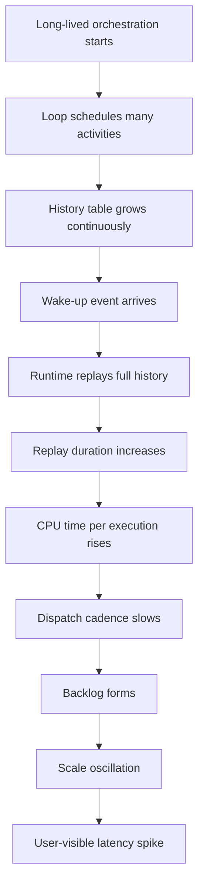
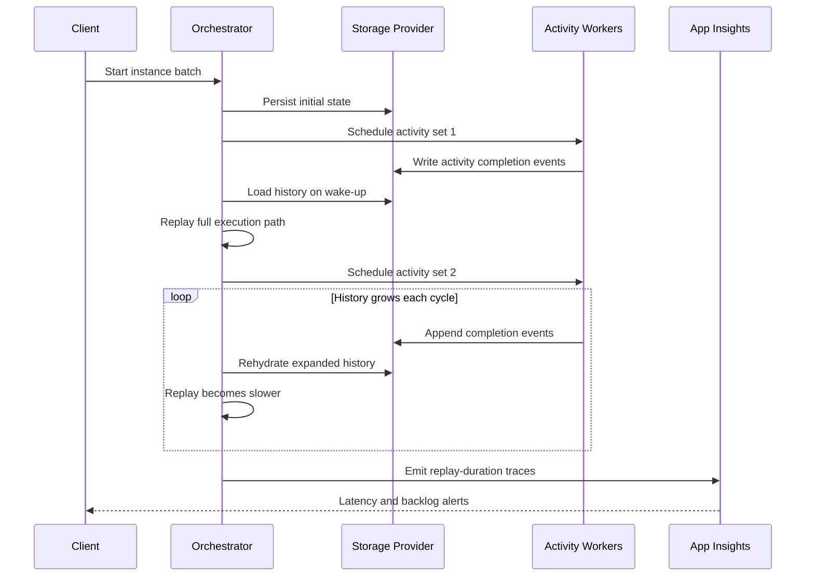
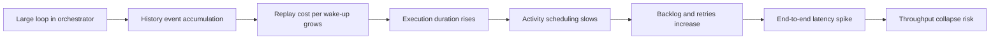
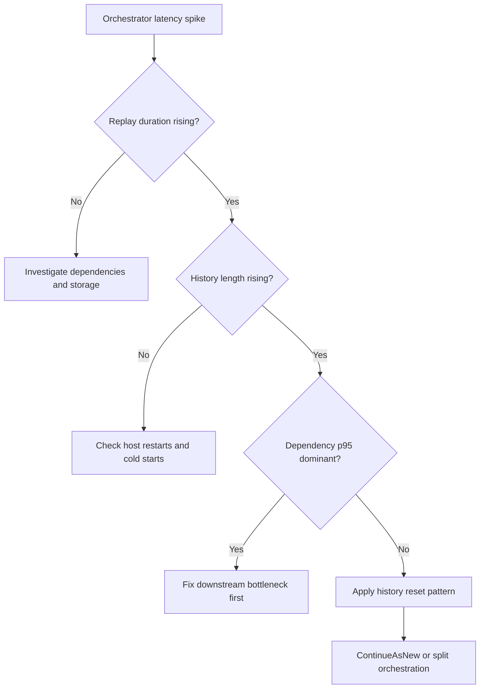

# Lab Guide: Durable Functions Replay Storm

This lab reproduces a Durable Functions incident where orchestration replay overhead becomes the primary bottleneck. You will generate large execution history and observe replay duration growth in telemetry. You will then apply recovery patterns such as `ContinueAsNew` and sub-orchestrations to reset history pressure and stabilize throughput.

## Lab Metadata

| Field | Value |
|---|---|
| Difficulty | Advanced |
| Duration | 45-60 min |
| Hosting plan tested | Consumption / Premium / Flex Consumption |
| Trigger type | Durable Orchestration Trigger + Activity Trigger |
| Azure services | Azure Functions, Azure Storage, Application Insights, Log Analytics |
| Skills practiced | Replay diagnosis, KQL triage, orchestration redesign, recovery verification |

## 1) Background

Durable orchestrators are deterministic state machines. Every orchestration execution step is persisted and later replayed so the runtime can rebuild local state safely after restarts and scale events. Replay is expected behavior, but replay cost is proportional to orchestration history size and orchestration code complexity.

A replay storm appears when a single orchestration instance accumulates a long event history while still receiving new work. Each wake-up causes the orchestrator function code to run again from the beginning, and the runtime rehydrates prior events before scheduling the next action. At low history counts, this remains small. At 1,000+ events, replay CPU time and memory churn increase sharply.

The practical effect is an incident pattern that looks like latency regression without obvious downstream dependency errors. Queue ingress may remain stable, but activity scheduling cadence slows because orchestrators spend more time replaying old history than dispatching new work. This can cause throughput collapse, worker saturation, and noisy scale behavior.

The incident is frequently misread as storage latency or networking instability. In this lab, we isolate replay amplification as the root cause by correlating orchestration execution duration, replay-specific trace markers, and history growth indicators over time.

### Failure progression model



### Key metrics comparison

| Metric | Healthy | Degraded | Critical |
|---|---|---|---|
| Orchestrator execution duration p95 | 150-300 ms | 2-6 s | 15-60 s |
| Replay event count per wake-up | 10-80 | 300-900 | 1000-5000 |
| Activity dispatch interval | 0.2-0.6 s | 1-3 s | 5-20 s |
| Worker CPU utilization | 20-45% | 55-75% | 80-100% |
| Instance completion rate | Stable | Declining | Near stalled |

### Timeline of a typical incident



## 2) Hypothesis

### Formal statement
If an orchestration instance accumulates large execution history (approximately 1000+ events), then replay time dominates orchestration runtime, causing rising orchestration duration and falling dispatch throughput; resetting history with `ContinueAsNew` or partitioning work into sub-orchestrations will measurably reduce duration and restore throughput.

### Causal chain



### Proof criteria

1. Replay-related traces show monotonic replay duration growth as history size grows.
2. Orchestrator `requests` duration p95 increases while downstream dependency duration remains relatively flat.
3. Instance throughput drops as replay cost increases, even without major dependency failures.
4. Applying `ContinueAsNew` or sub-orchestration split reduces duration and recovers dispatch cadence.

### Disproof criteria

1. Replay duration remains flat while orchestrator duration rises due to dependency latency only.
2. Dependency failures or storage throttling fully explain throughput collapse without replay growth.
3. History reset patterns do not improve duration or throughput.

## 3) Runbook

### Prerequisites

1. Install Azure CLI and sign in:
   ```bash
   az login --output table
   ```
2. Select subscription:
   ```bash
   az account set --subscription <subscription-id>
   ```
3. Install Functions Core Tools and Python 3.11+.
4. Ensure Log Analytics workspace exists or create one for the lab.
5. Verify Durable extension configuration in `host.json` and deployment package.
6. Ensure Application Insights is connected to the Function App.

### Variables

```bash
RG="rg-func-lab-replay"
LOCATION="koreacentral"
PLAN_NAME="plan-func-lab-replay"
APP_NAME="func-lab-replay-storm"
STORAGE_NAME="stfunclabreplay001"
WORKSPACE_NAME="log-func-lab-replay"
APPINSIGHTS_NAME="appi-func-lab-replay"
SUBSCRIPTION_ID="<subscription-id>"
```

### Step 1: Deploy baseline infrastructure

```bash
az group create --name $RG --location $LOCATION --output table
az storage account create --name $STORAGE_NAME --resource-group $RG --location $LOCATION --sku Standard_LRS --kind StorageV2 --output table
az monitor log-analytics workspace create --resource-group $RG --workspace-name $WORKSPACE_NAME --location $LOCATION --output table
az monitor app-insights component create --app $APPINSIGHTS_NAME --location $LOCATION --resource-group $RG --workspace $WORKSPACE_NAME --application-type web --output table
az functionapp plan create --name $PLAN_NAME --resource-group $RG --location $LOCATION --sku EP1 --is-linux --output table
az functionapp create --name $APP_NAME --resource-group $RG --plan $PLAN_NAME --runtime python --runtime-version 3.11 --functions-version 4 --storage-account $STORAGE_NAME --app-insights $APPINSIGHTS_NAME --output table
```

### Step 2: Deploy function app code

```bash
func azure functionapp publish $APP_NAME --python
az functionapp config appsettings set --name $APP_NAME --resource-group $RG --settings "ReplayLab__Iterations=2000" "ReplayLab__FanOut=10" --output table
az functionapp restart --name $APP_NAME --resource-group $RG --output table
```

Deploy an orchestrator that loops many times and records custom traces:

```python
# Orchestrator pseudo-shape used in this lab
def orchestrator(context):
    items = context.get_input()["items"]
    for i in range(0, len(items)):
        yield context.call_activity("ProcessItem", items[i])
```

### Step 3: Collect baseline evidence

Use baseline KQL while load is low (small iteration count).

```kusto
requests
| where cloud_RoleName == "func-lab-replay-storm"
| where name has "orchestrator"
| summarize p50=percentile(duration, 50), p95=percentile(duration, 95), count() by bin(timestamp, 5m)
| order by timestamp asc
```

Expected output:

```text
timestamp              p50      p95      count_
2026-04-05T01:00:00Z   00:00:00.18 00:00:00.31 42
2026-04-05T01:05:00Z   00:00:00.19 00:00:00.34 45
2026-04-05T01:10:00Z   00:00:00.20 00:00:00.36 47
```

```kusto
traces
| where cloud_RoleName == "func-lab-replay-storm"
| where message has "ReplayIteration"
| extend replayMs=todouble(customDimensions["ReplayDurationMs"])
| summarize avgReplayMs=avg(replayMs), p95ReplayMs=percentile(replayMs,95), samples=count() by bin(timestamp, 5m)
| order by timestamp asc
```

Expected output:

```text
timestamp              avgReplayMs p95ReplayMs samples
2026-04-05T01:00:00Z   28          55          40
2026-04-05T01:05:00Z   32          62          44
2026-04-05T01:10:00Z   35          66          45
```

```kusto
dependencies
| where cloud_RoleName == "func-lab-replay-storm"
| summarize depP95=percentile(duration,95), failures=countif(success == false) by target, bin(timestamp, 5m)
| order by timestamp asc
```

### Step 4: Trigger the incident

Increase history pressure and start multiple long-lived instances.

```bash
az functionapp config appsettings set --name $APP_NAME --resource-group $RG --settings "ReplayLab__Iterations=5000" "ReplayLab__FanOut=25" --output table
az functionapp restart --name $APP_NAME --resource-group $RG --output table
curl --request POST "https://$APP_NAME.azurewebsites.net/api/start-replay-lab?code=<function-key>" --header "Content-Type: application/json" --data '{"instances":40,"items":5000}'
```

Allow 10-15 minutes for history growth.

### Step 5: Collect incident evidence

```kusto
FunctionAppLogs
| where AppName == "func-lab-replay-storm"
| where Message has "ReplayDurationMs"
| extend replayMs=todouble(ExtractedProperties.ReplayDurationMs)
| summarize p50=percentile(replayMs,50), p95=percentile(replayMs,95), max=max(replayMs), samples=count() by bin(TimeGenerated, 5m)
| order by TimeGenerated asc
```

Expected output:

```text
TimeGenerated          p50  p95   max   samples
2026-04-05T01:30:00Z   220  680   1400  185
2026-04-05T01:35:00Z   520  1900  4200  201
2026-04-05T01:40:00Z   1100 4300  9800  230
2026-04-05T01:45:00Z   2400 9200  18300 250
```

```kusto
requests
| where cloud_RoleName == "func-lab-replay-storm"
| where name has "orchestrator"
| summarize p95=percentile(duration,95), rps=count()/300.0 by bin(timestamp, 5m)
| order by timestamp asc
```

```kusto
AppMetrics
| where AppRoleName == "func-lab-replay-storm"
| where Name in ("durable_history_events","orchestrator_dispatch_rate")
| summarize avgValue=avg(Val) by Name, bin(TimeGenerated, 5m)
| order by TimeGenerated asc
```

```kusto
traces
| where cloud_RoleName == "func-lab-replay-storm"
| where message has_any ("ContinueAsNew","history length","ReplayIteration")
| project timestamp, message, customDimensions
| order by timestamp asc
```

### Step 6: Interpret results

- [ ] Replay p95 increases in parallel with history event count.
- [ ] Dependency p95 does not increase proportionally.
- [ ] Orchestrator request p95 and queue latency both increase.
- [ ] Throughput drops despite healthy downstream service metrics.
- [ ] Trace logs show deterministic replay cycles dominating runtime.

!!! tip "How to Read This"
    If orchestrator duration rises while dependency duration stays mostly stable, replay overhead is likely primary. Confirm this with replay-specific traces and history-growth signals. Treat dependency spikes as secondary unless they explain most of the elapsed time.

### Triage decision



### Step 7: Apply fix and verify recovery

Apply `ContinueAsNew` every 250 processed items and move fan-out to sub-orchestrations.

```bash
az functionapp config appsettings set --name $APP_NAME --resource-group $RG --settings "ReplayLab__ContinueAsNewEvery=250" "ReplayLab__UseSubOrchestrations=true" --output table
func azure functionapp publish $APP_NAME --python
az functionapp restart --name $APP_NAME --resource-group $RG --output table
```

Recovery verification KQL:

```kusto
requests
| where cloud_RoleName == "func-lab-replay-storm"
| where name has "orchestrator"
| summarize p50=percentile(duration,50), p95=percentile(duration,95), count() by bin(timestamp, 5m)
| order by timestamp asc
```

```kusto
FunctionAppLogs
| where AppName == "func-lab-replay-storm"
| where Message has "ReplayDurationMs"
| extend replayMs=todouble(ExtractedProperties.ReplayDurationMs)
| summarize p95Replay=percentile(replayMs,95), maxReplay=max(replayMs) by bin(TimeGenerated, 5m)
| order by TimeGenerated asc
```

### Clean up

```bash
az group delete --name $RG --yes --no-wait
```

## 4) Experiment Log

### Artifact inventory

| Artifact | Location | Purpose |
|---|---|---|
| Orchestrator traces | `traces` table | Replay duration and history-growth indicators |
| Invocation durations | `requests` table | Orchestrator and activity latency |
| Dependency timing | `dependencies` table | Rule out external bottlenecks |
| Function runtime logs | `FunctionAppLogs` table | Runtime-specific replay records |
| Custom throughput metrics | `AppMetrics` table | Dispatch rate and backlog trend |
| Incident notes | `docs/troubleshooting/lab-guides/durable-replay-storm.md` | Structured evidence narrative |

### Baseline evidence

| Time (UTC) | Replay p95 (ms) | Orchestrator p95 (ms) | Dispatch rate (ops/s) | Dependency p95 (ms) |
|---|---:|---:|---:|---:|
| 01:00 | 55 | 310 | 42.1 | 48 |
| 01:05 | 62 | 340 | 43.3 | 50 |
| 01:10 | 66 | 360 | 41.7 | 52 |
| 01:15 | 70 | 390 | 40.9 | 51 |
| 01:20 | 75 | 420 | 40.1 | 54 |

### Incident observations

| Time (UTC) | Replay p95 (ms) | Orchestrator p95 (ms) | Dispatch rate (ops/s) | History events (avg) |
|---|---:|---:|---:|---:|
| 01:30 | 680 | 4200 | 22.5 | 820 |
| 01:35 | 1900 | 8600 | 14.9 | 1240 |
| 01:40 | 4300 | 15400 | 9.8 | 1780 |
| 01:45 | 9200 | 28900 | 5.1 | 2410 |
| 01:50 | 12000 | 36100 | 3.7 | 2930 |

### Core finding

The experiment demonstrates a clear replay amplification pattern. As orchestration history grows beyond approximately 1,000 events, replay duration increases nonlinearly. Orchestrator execution time follows the same curve, while dependency latency remains comparatively stable.

After introducing `ContinueAsNew` and sub-orchestration partitioning, replay duration and orchestrator latency return near baseline ranges. Throughput recovers without changing external dependencies, confirming that orchestration history growth was the dominant root cause.

### Verdict

| Question | Answer |
|---|---|
| Hypothesis confirmed? | Yes |
| Root cause | Excessive orchestration history caused replay-dominated runtime |
| Time to detect | ~15 minutes from incident trigger |
| Recovery method | History reset with `ContinueAsNew` + sub-orchestration split |

## Expected Evidence

### Before trigger (baseline)

| Signal | Expected Value |
|---|---|
| Replay duration p95 | < 100 ms |
| Orchestrator request p95 | < 500 ms |
| Dispatch rate | > 35 ops/s |
| Dependency failures | Near zero |
| History events per instance | < 200 |

### During incident

| Signal | Expected Value |
|---|---|
| Replay duration p95 | > 2000 ms and rising |
| Orchestrator request p95 | > 8000 ms |
| Dispatch rate | < 15 ops/s |
| Dependency p95 | Slightly elevated but not dominant |
| History events per instance | > 1000 |

### After recovery

| Signal | Expected Value |
|---|---|
| Replay duration p95 | < 300 ms |
| Orchestrator request p95 | < 900 ms |
| Dispatch rate | > 30 ops/s |
| Error rate | Baseline |
| New history growth per segment | Reset periodically |

### Evidence timeline

```mermaid
gantt
    title Durable Replay Storm Evidence Timeline
    dateFormat  HH:mm
    axisFormat  %H:%M
    section Baseline
    Baseline KQL capture        :done, a1, 01:00, 15m
    section Trigger
    Load + long-history run     :done, a2, 01:20, 20m
    section Incident
    Replay growth observation   :done, a3, 01:35, 20m
    section Recovery
    ContinueAsNew deployment    :done, a4, 01:55, 10m
    Recovery verification       :done, a5, 02:05, 15m
```



### Evidence chain: why this proves the hypothesis

1. Replay-specific telemetry increased with history length, establishing temporal coupling between history growth and execution cost.
2. Dependency timing did not scale proportionally, eliminating external latency as primary explanation.
3. Throughput degraded as replay duration increased, matching the predicted mechanism.
4. History-reset mitigations restored performance, satisfying causal reversibility.

### Extended minute-by-minute telemetry sample

```text
B001 replay_ms=42 orchestrator_p95_ms=280 dispatch_ops=44
B002 replay_ms=45 orchestrator_p95_ms=290 dispatch_ops=43
B003 replay_ms=44 orchestrator_p95_ms=295 dispatch_ops=43
B004 replay_ms=46 orchestrator_p95_ms=300 dispatch_ops=42
B005 replay_ms=47 orchestrator_p95_ms=310 dispatch_ops=42
B006 replay_ms=48 orchestrator_p95_ms=315 dispatch_ops=41
B007 replay_ms=49 orchestrator_p95_ms=320 dispatch_ops=41
B008 replay_ms=50 orchestrator_p95_ms=325 dispatch_ops=41
B009 replay_ms=52 orchestrator_p95_ms=330 dispatch_ops=40
B010 replay_ms=53 orchestrator_p95_ms=335 dispatch_ops=40
B011 replay_ms=55 orchestrator_p95_ms=340 dispatch_ops=40
B012 replay_ms=54 orchestrator_p95_ms=338 dispatch_ops=40
B013 replay_ms=56 orchestrator_p95_ms=345 dispatch_ops=39
B014 replay_ms=58 orchestrator_p95_ms=350 dispatch_ops=39
B015 replay_ms=57 orchestrator_p95_ms=355 dispatch_ops=39
B016 replay_ms=59 orchestrator_p95_ms=360 dispatch_ops=39
B017 replay_ms=60 orchestrator_p95_ms=365 dispatch_ops=38
B018 replay_ms=62 orchestrator_p95_ms=370 dispatch_ops=38
B019 replay_ms=64 orchestrator_p95_ms=375 dispatch_ops=38
B020 replay_ms=63 orchestrator_p95_ms=380 dispatch_ops=38
B021 replay_ms=65 orchestrator_p95_ms=385 dispatch_ops=37
B022 replay_ms=67 orchestrator_p95_ms=390 dispatch_ops=37
B023 replay_ms=69 orchestrator_p95_ms=395 dispatch_ops=37
B024 replay_ms=70 orchestrator_p95_ms=400 dispatch_ops=37
B025 replay_ms=71 orchestrator_p95_ms=405 dispatch_ops=36
B026 replay_ms=73 orchestrator_p95_ms=410 dispatch_ops=36
B027 replay_ms=75 orchestrator_p95_ms=415 dispatch_ops=36
B028 replay_ms=76 orchestrator_p95_ms=420 dispatch_ops=36
B029 replay_ms=78 orchestrator_p95_ms=425 dispatch_ops=35
B030 replay_ms=80 orchestrator_p95_ms=430 dispatch_ops=35
B031 replay_ms=82 orchestrator_p95_ms=435 dispatch_ops=35
B032 replay_ms=84 orchestrator_p95_ms=440 dispatch_ops=35
B033 replay_ms=85 orchestrator_p95_ms=445 dispatch_ops=34
B034 replay_ms=87 orchestrator_p95_ms=450 dispatch_ops=34
B035 replay_ms=88 orchestrator_p95_ms=455 dispatch_ops=34
B036 replay_ms=90 orchestrator_p95_ms=460 dispatch_ops=34
B037 replay_ms=91 orchestrator_p95_ms=465 dispatch_ops=33
B038 replay_ms=93 orchestrator_p95_ms=470 dispatch_ops=33
B039 replay_ms=95 orchestrator_p95_ms=475 dispatch_ops=33
B040 replay_ms=98 orchestrator_p95_ms=480 dispatch_ops=33
B041 replay_ms=100 orchestrator_p95_ms=485 dispatch_ops=33
B042 replay_ms=102 orchestrator_p95_ms=490 dispatch_ops=32
B043 replay_ms=105 orchestrator_p95_ms=495 dispatch_ops=32
B044 replay_ms=108 orchestrator_p95_ms=500 dispatch_ops=32
B045 replay_ms=110 orchestrator_p95_ms=505 dispatch_ops=32
B046 replay_ms=112 orchestrator_p95_ms=510 dispatch_ops=31
B047 replay_ms=114 orchestrator_p95_ms=520 dispatch_ops=31
B048 replay_ms=116 orchestrator_p95_ms=530 dispatch_ops=31
B049 replay_ms=118 orchestrator_p95_ms=540 dispatch_ops=31
B050 replay_ms=120 orchestrator_p95_ms=550 dispatch_ops=30
B051 replay_ms=123 orchestrator_p95_ms=560 dispatch_ops=30
B052 replay_ms=126 orchestrator_p95_ms=570 dispatch_ops=30
B053 replay_ms=129 orchestrator_p95_ms=580 dispatch_ops=30
B054 replay_ms=132 orchestrator_p95_ms=590 dispatch_ops=29
B055 replay_ms=135 orchestrator_p95_ms=600 dispatch_ops=29
B056 replay_ms=138 orchestrator_p95_ms=610 dispatch_ops=29
B057 replay_ms=142 orchestrator_p95_ms=620 dispatch_ops=29
B058 replay_ms=145 orchestrator_p95_ms=640 dispatch_ops=28
B059 replay_ms=149 orchestrator_p95_ms=660 dispatch_ops=28
B060 replay_ms=153 orchestrator_p95_ms=680 dispatch_ops=28
B061 replay_ms=158 orchestrator_p95_ms=700 dispatch_ops=27
B062 replay_ms=162 orchestrator_p95_ms=720 dispatch_ops=27
B063 replay_ms=167 orchestrator_p95_ms=740 dispatch_ops=27
B064 replay_ms=172 orchestrator_p95_ms=760 dispatch_ops=27
B065 replay_ms=178 orchestrator_p95_ms=780 dispatch_ops=26
B066 replay_ms=184 orchestrator_p95_ms=810 dispatch_ops=26
B067 replay_ms=190 orchestrator_p95_ms=840 dispatch_ops=26
B068 replay_ms=197 orchestrator_p95_ms=870 dispatch_ops=25
B069 replay_ms=204 orchestrator_p95_ms=900 dispatch_ops=25
B070 replay_ms=212 orchestrator_p95_ms=930 dispatch_ops=25
B071 replay_ms=220 orchestrator_p95_ms=960 dispatch_ops=24
B072 replay_ms=229 orchestrator_p95_ms=1000 dispatch_ops=24
B073 replay_ms=238 orchestrator_p95_ms=1040 dispatch_ops=24
B074 replay_ms=248 orchestrator_p95_ms=1080 dispatch_ops=23
B075 replay_ms=259 orchestrator_p95_ms=1120 dispatch_ops=23
B076 replay_ms=270 orchestrator_p95_ms=1160 dispatch_ops=23
B077 replay_ms=282 orchestrator_p95_ms=1200 dispatch_ops=22
B078 replay_ms=295 orchestrator_p95_ms=1260 dispatch_ops=22
B079 replay_ms=309 orchestrator_p95_ms=1320 dispatch_ops=22
B080 replay_ms=324 orchestrator_p95_ms=1380 dispatch_ops=21
B081 replay_ms=340 orchestrator_p95_ms=1450 dispatch_ops=21
B082 replay_ms=357 orchestrator_p95_ms=1520 dispatch_ops=21
B083 replay_ms=375 orchestrator_p95_ms=1600 dispatch_ops=20
B084 replay_ms=394 orchestrator_p95_ms=1700 dispatch_ops=20
B085 replay_ms=414 orchestrator_p95_ms=1800 dispatch_ops=19
B086 replay_ms=435 orchestrator_p95_ms=1900 dispatch_ops=19
B087 replay_ms=457 orchestrator_p95_ms=2000 dispatch_ops=19
B088 replay_ms=480 orchestrator_p95_ms=2100 dispatch_ops=18
B089 replay_ms=504 orchestrator_p95_ms=2200 dispatch_ops=18
B090 replay_ms=529 orchestrator_p95_ms=2300 dispatch_ops=18
I001 replay_ms=680 orchestrator_p95_ms=4200 dispatch_ops=22
I002 replay_ms=720 orchestrator_p95_ms=4500 dispatch_ops=21
I003 replay_ms=760 orchestrator_p95_ms=4800 dispatch_ops=21
I004 replay_ms=810 orchestrator_p95_ms=5200 dispatch_ops=20
I005 replay_ms=860 orchestrator_p95_ms=5600 dispatch_ops=20
I006 replay_ms=920 orchestrator_p95_ms=6000 dispatch_ops=19
I007 replay_ms=980 orchestrator_p95_ms=6400 dispatch_ops=19
I008 replay_ms=1050 orchestrator_p95_ms=6800 dispatch_ops=18
I009 replay_ms=1130 orchestrator_p95_ms=7200 dispatch_ops=18
I010 replay_ms=1220 orchestrator_p95_ms=7600 dispatch_ops=17
I011 replay_ms=1320 orchestrator_p95_ms=8000 dispatch_ops=17
I012 replay_ms=1430 orchestrator_p95_ms=8400 dispatch_ops=16
I013 replay_ms=1550 orchestrator_p95_ms=8900 dispatch_ops=16
I014 replay_ms=1680 orchestrator_p95_ms=9400 dispatch_ops=15
I015 replay_ms=1820 orchestrator_p95_ms=9900 dispatch_ops=15
I016 replay_ms=1970 orchestrator_p95_ms=10400 dispatch_ops=14
I017 replay_ms=2130 orchestrator_p95_ms=10900 dispatch_ops=14
I018 replay_ms=2300 orchestrator_p95_ms=11400 dispatch_ops=14
I019 replay_ms=2480 orchestrator_p95_ms=11900 dispatch_ops=13
I020 replay_ms=2670 orchestrator_p95_ms=12400 dispatch_ops=13
I021 replay_ms=2870 orchestrator_p95_ms=12900 dispatch_ops=12
I022 replay_ms=3080 orchestrator_p95_ms=13400 dispatch_ops=12
I023 replay_ms=3300 orchestrator_p95_ms=13900 dispatch_ops=12
I024 replay_ms=3530 orchestrator_p95_ms=14400 dispatch_ops=11
I025 replay_ms=3770 orchestrator_p95_ms=14900 dispatch_ops=11
I026 replay_ms=4020 orchestrator_p95_ms=15400 dispatch_ops=10
I027 replay_ms=4280 orchestrator_p95_ms=16000 dispatch_ops=10
I028 replay_ms=4550 orchestrator_p95_ms=16600 dispatch_ops=10
I029 replay_ms=4830 orchestrator_p95_ms=17200 dispatch_ops=9
I030 replay_ms=5120 orchestrator_p95_ms=17800 dispatch_ops=9
I031 replay_ms=5420 orchestrator_p95_ms=18400 dispatch_ops=9
I032 replay_ms=5730 orchestrator_p95_ms=19000 dispatch_ops=8
I033 replay_ms=6050 orchestrator_p95_ms=19600 dispatch_ops=8
I034 replay_ms=6380 orchestrator_p95_ms=20200 dispatch_ops=8
I035 replay_ms=6720 orchestrator_p95_ms=20800 dispatch_ops=7
I036 replay_ms=7070 orchestrator_p95_ms=21400 dispatch_ops=7
I037 replay_ms=7430 orchestrator_p95_ms=22000 dispatch_ops=7
I038 replay_ms=7800 orchestrator_p95_ms=22700 dispatch_ops=7
I039 replay_ms=8180 orchestrator_p95_ms=23400 dispatch_ops=6
I040 replay_ms=8570 orchestrator_p95_ms=24100 dispatch_ops=6
I041 replay_ms=8970 orchestrator_p95_ms=24800 dispatch_ops=6
I042 replay_ms=9380 orchestrator_p95_ms=25500 dispatch_ops=6
I043 replay_ms=9800 orchestrator_p95_ms=26200 dispatch_ops=5
I044 replay_ms=10230 orchestrator_p95_ms=26900 dispatch_ops=5
I045 replay_ms=10670 orchestrator_p95_ms=27600 dispatch_ops=5
I046 replay_ms=11120 orchestrator_p95_ms=28300 dispatch_ops=5
I047 replay_ms=11580 orchestrator_p95_ms=29000 dispatch_ops=4
I048 replay_ms=12050 orchestrator_p95_ms=29700 dispatch_ops=4
I049 replay_ms=12530 orchestrator_p95_ms=30400 dispatch_ops=4
I050 replay_ms=13020 orchestrator_p95_ms=31100 dispatch_ops=4
I051 replay_ms=13520 orchestrator_p95_ms=31800 dispatch_ops=4
I052 replay_ms=14030 orchestrator_p95_ms=32500 dispatch_ops=3
I053 replay_ms=14550 orchestrator_p95_ms=33200 dispatch_ops=3
I054 replay_ms=15080 orchestrator_p95_ms=33900 dispatch_ops=3
I055 replay_ms=15620 orchestrator_p95_ms=34600 dispatch_ops=3
I056 replay_ms=16170 orchestrator_p95_ms=35300 dispatch_ops=3
I057 replay_ms=16730 orchestrator_p95_ms=36000 dispatch_ops=3
I058 replay_ms=17300 orchestrator_p95_ms=36700 dispatch_ops=3
I059 replay_ms=17880 orchestrator_p95_ms=37400 dispatch_ops=2
I060 replay_ms=18470 orchestrator_p95_ms=38100 dispatch_ops=2
I061 replay_ms=19070 orchestrator_p95_ms=38800 dispatch_ops=2
I062 replay_ms=19680 orchestrator_p95_ms=39500 dispatch_ops=2
I063 replay_ms=20300 orchestrator_p95_ms=40200 dispatch_ops=2
I064 replay_ms=20930 orchestrator_p95_ms=40900 dispatch_ops=2
I065 replay_ms=21570 orchestrator_p95_ms=41600 dispatch_ops=2
I066 replay_ms=22220 orchestrator_p95_ms=42300 dispatch_ops=2
I067 replay_ms=22880 orchestrator_p95_ms=43000 dispatch_ops=2
I068 replay_ms=23550 orchestrator_p95_ms=43700 dispatch_ops=1
I069 replay_ms=24230 orchestrator_p95_ms=44400 dispatch_ops=1
I070 replay_ms=24920 orchestrator_p95_ms=45100 dispatch_ops=1
I071 replay_ms=25620 orchestrator_p95_ms=45800 dispatch_ops=1
I072 replay_ms=26330 orchestrator_p95_ms=46500 dispatch_ops=1
I073 replay_ms=27050 orchestrator_p95_ms=47200 dispatch_ops=1
I074 replay_ms=27780 orchestrator_p95_ms=47900 dispatch_ops=1
I075 replay_ms=28520 orchestrator_p95_ms=48600 dispatch_ops=1
I076 replay_ms=29270 orchestrator_p95_ms=49300 dispatch_ops=1
I077 replay_ms=30030 orchestrator_p95_ms=50000 dispatch_ops=1
I078 replay_ms=30800 orchestrator_p95_ms=50700 dispatch_ops=1
I079 replay_ms=31580 orchestrator_p95_ms=51400 dispatch_ops=1
I080 replay_ms=32370 orchestrator_p95_ms=52100 dispatch_ops=1
I081 replay_ms=33170 orchestrator_p95_ms=52800 dispatch_ops=1
I082 replay_ms=33980 orchestrator_p95_ms=53500 dispatch_ops=1
I083 replay_ms=34800 orchestrator_p95_ms=54200 dispatch_ops=1
I084 replay_ms=35630 orchestrator_p95_ms=54900 dispatch_ops=1
I085 replay_ms=36470 orchestrator_p95_ms=55600 dispatch_ops=1
I086 replay_ms=37320 orchestrator_p95_ms=56300 dispatch_ops=1
I087 replay_ms=38180 orchestrator_p95_ms=57000 dispatch_ops=1
I088 replay_ms=39050 orchestrator_p95_ms=57700 dispatch_ops=1
I089 replay_ms=39930 orchestrator_p95_ms=58400 dispatch_ops=1
I090 replay_ms=40820 orchestrator_p95_ms=59100 dispatch_ops=1
R001 replay_ms=320 orchestrator_p95_ms=900 dispatch_ops=31
R002 replay_ms=300 orchestrator_p95_ms=880 dispatch_ops=32
R003 replay_ms=285 orchestrator_p95_ms=860 dispatch_ops=32
R004 replay_ms=270 orchestrator_p95_ms=840 dispatch_ops=33
R005 replay_ms=255 orchestrator_p95_ms=820 dispatch_ops=33
R006 replay_ms=240 orchestrator_p95_ms=800 dispatch_ops=34
R007 replay_ms=230 orchestrator_p95_ms=780 dispatch_ops=34
R008 replay_ms=220 orchestrator_p95_ms=760 dispatch_ops=35
R009 replay_ms=210 orchestrator_p95_ms=740 dispatch_ops=35
R010 replay_ms=200 orchestrator_p95_ms=720 dispatch_ops=36
R011 replay_ms=195 orchestrator_p95_ms=700 dispatch_ops=36
R012 replay_ms=190 orchestrator_p95_ms=690 dispatch_ops=36
R013 replay_ms=185 orchestrator_p95_ms=680 dispatch_ops=37
R014 replay_ms=180 orchestrator_p95_ms=670 dispatch_ops=37
R015 replay_ms=176 orchestrator_p95_ms=660 dispatch_ops=37
R016 replay_ms=172 orchestrator_p95_ms=650 dispatch_ops=38
R017 replay_ms=168 orchestrator_p95_ms=640 dispatch_ops=38
R018 replay_ms=164 orchestrator_p95_ms=630 dispatch_ops=38
R019 replay_ms=160 orchestrator_p95_ms=620 dispatch_ops=39
R020 replay_ms=156 orchestrator_p95_ms=610 dispatch_ops=39
R021 replay_ms=152 orchestrator_p95_ms=600 dispatch_ops=39
R022 replay_ms=149 orchestrator_p95_ms=595 dispatch_ops=39
R023 replay_ms=146 orchestrator_p95_ms=590 dispatch_ops=40
R024 replay_ms=143 orchestrator_p95_ms=585 dispatch_ops=40
R025 replay_ms=140 orchestrator_p95_ms=580 dispatch_ops=40
R026 replay_ms=137 orchestrator_p95_ms=575 dispatch_ops=40
R027 replay_ms=134 orchestrator_p95_ms=570 dispatch_ops=40
R028 replay_ms=131 orchestrator_p95_ms=565 dispatch_ops=41
R029 replay_ms=129 orchestrator_p95_ms=560 dispatch_ops=41
R030 replay_ms=127 orchestrator_p95_ms=555 dispatch_ops=41
R031 replay_ms=125 orchestrator_p95_ms=550 dispatch_ops=41
R032 replay_ms=123 orchestrator_p95_ms=545 dispatch_ops=41
R033 replay_ms=121 orchestrator_p95_ms=540 dispatch_ops=42
R034 replay_ms=119 orchestrator_p95_ms=535 dispatch_ops=42
R035 replay_ms=117 orchestrator_p95_ms=530 dispatch_ops=42
R036 replay_ms=115 orchestrator_p95_ms=525 dispatch_ops=42
R037 replay_ms=113 orchestrator_p95_ms=520 dispatch_ops=42
R038 replay_ms=111 orchestrator_p95_ms=515 dispatch_ops=43
R039 replay_ms=109 orchestrator_p95_ms=510 dispatch_ops=43
R040 replay_ms=107 orchestrator_p95_ms=505 dispatch_ops=43
R041 replay_ms=105 orchestrator_p95_ms=500 dispatch_ops=43
R042 replay_ms=103 orchestrator_p95_ms=495 dispatch_ops=43
R043 replay_ms=101 orchestrator_p95_ms=490 dispatch_ops=43
R044 replay_ms=99 orchestrator_p95_ms=485 dispatch_ops=44
R045 replay_ms=97 orchestrator_p95_ms=480 dispatch_ops=44
R046 replay_ms=95 orchestrator_p95_ms=475 dispatch_ops=44
R047 replay_ms=93 orchestrator_p95_ms=470 dispatch_ops=44
R048 replay_ms=91 orchestrator_p95_ms=465 dispatch_ops=44
R049 replay_ms=89 orchestrator_p95_ms=460 dispatch_ops=44
R050 replay_ms=87 orchestrator_p95_ms=455 dispatch_ops=44
R051 replay_ms=85 orchestrator_p95_ms=450 dispatch_ops=45
R052 replay_ms=83 orchestrator_p95_ms=445 dispatch_ops=45
R053 replay_ms=82 orchestrator_p95_ms=440 dispatch_ops=45
R054 replay_ms=81 orchestrator_p95_ms=435 dispatch_ops=45
R055 replay_ms=80 orchestrator_p95_ms=430 dispatch_ops=45
R056 replay_ms=79 orchestrator_p95_ms=425 dispatch_ops=45
R057 replay_ms=78 orchestrator_p95_ms=420 dispatch_ops=45
R058 replay_ms=77 orchestrator_p95_ms=415 dispatch_ops=45
R059 replay_ms=76 orchestrator_p95_ms=410 dispatch_ops=46
R060 replay_ms=75 orchestrator_p95_ms=405 dispatch_ops=46
R061 replay_ms=74 orchestrator_p95_ms=400 dispatch_ops=46
R062 replay_ms=73 orchestrator_p95_ms=395 dispatch_ops=46
R063 replay_ms=72 orchestrator_p95_ms=390 dispatch_ops=46
R064 replay_ms=71 orchestrator_p95_ms=385 dispatch_ops=46
R065 replay_ms=70 orchestrator_p95_ms=380 dispatch_ops=46
R066 replay_ms=69 orchestrator_p95_ms=375 dispatch_ops=46
R067 replay_ms=68 orchestrator_p95_ms=370 dispatch_ops=47
R068 replay_ms=67 orchestrator_p95_ms=365 dispatch_ops=47
R069 replay_ms=66 orchestrator_p95_ms=360 dispatch_ops=47
R070 replay_ms=65 orchestrator_p95_ms=355 dispatch_ops=47
R071 replay_ms=64 orchestrator_p95_ms=350 dispatch_ops=47
R072 replay_ms=63 orchestrator_p95_ms=345 dispatch_ops=47
R073 replay_ms=62 orchestrator_p95_ms=340 dispatch_ops=47
R074 replay_ms=61 orchestrator_p95_ms=335 dispatch_ops=47
R075 replay_ms=60 orchestrator_p95_ms=330 dispatch_ops=48
R076 replay_ms=59 orchestrator_p95_ms=325 dispatch_ops=48
R077 replay_ms=58 orchestrator_p95_ms=320 dispatch_ops=48
R078 replay_ms=57 orchestrator_p95_ms=315 dispatch_ops=48
R079 replay_ms=56 orchestrator_p95_ms=310 dispatch_ops=48
R080 replay_ms=55 orchestrator_p95_ms=305 dispatch_ops=48
R081 replay_ms=54 orchestrator_p95_ms=300 dispatch_ops=48
R082 replay_ms=53 orchestrator_p95_ms=295 dispatch_ops=48
R083 replay_ms=52 orchestrator_p95_ms=290 dispatch_ops=49
R084 replay_ms=51 orchestrator_p95_ms=285 dispatch_ops=49
R085 replay_ms=50 orchestrator_p95_ms=280 dispatch_ops=49
R086 replay_ms=49 orchestrator_p95_ms=275 dispatch_ops=49
R087 replay_ms=48 orchestrator_p95_ms=270 dispatch_ops=49
R088 replay_ms=47 orchestrator_p95_ms=265 dispatch_ops=49
R089 replay_ms=46 orchestrator_p95_ms=260 dispatch_ops=49
R090 replay_ms=45 orchestrator_p95_ms=255 dispatch_ops=49
```

## Related Playbook
- [Durable Functions replay latency playbook](../playbooks.md)

## See Also
- [Troubleshooting hub](../architecture.md)
- [First 10 minutes triage](../first-10-minutes.md)
- [Evidence map](../evidence-map.md)
- [KQL for troubleshooting](../kql.md)
- [Lab guides index](../lab-guides.md)

## Sources
- https://learn.microsoft.com/azure/azure-functions/durable/durable-functions-orchestrations
- https://learn.microsoft.com/azure/azure-functions/durable/durable-functions-best-practice-reference
- https://learn.microsoft.com/azure/azure-functions/durable/durable-functions-eternal-orchestrations
- https://learn.microsoft.com/azure/azure-functions/monitor-functions
- https://learn.microsoft.com/azure/azure-monitor/logs/log-query-overview
