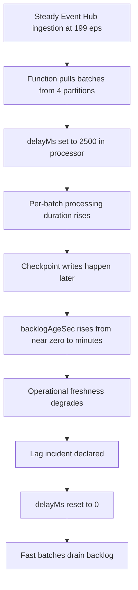
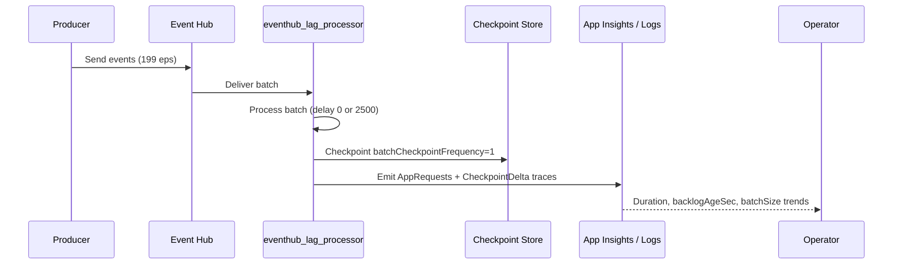
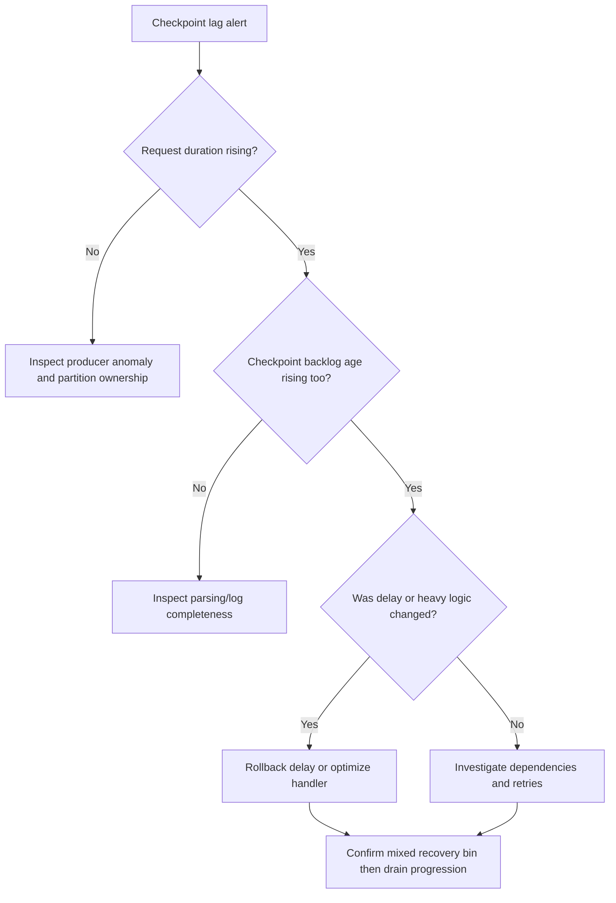

# Lab Guide: Event Hub Checkpoint Lag on Azure Functions Premium EP1

This lab guide documents a completed Event Hub checkpoint lag experiment on Azure Functions Premium EP1. Every metric in this document comes from a real telemetry window (`2026-04-07 13:12:00` to `13:36:00` UTC) captured from the production-like lab deployment.

## Lab Metadata

| Field | Value |
|---|---|
| Difficulty | L3 (advanced streaming troubleshooting and telemetry correlation) |
| Duration | 60-90 minutes |
| Hosting plan | Premium EP1 (Linux) |
| Runtime | Azure Functions v4, Python 3.11 (v2 model) |
| Function app | `labep1shared-func` |
| Resource group | `rg-lab-ep1-shared` |
| Region | `koreacentral` |
| Storage account | `labep1sharedstorage` (managed identity auth) |
| Event Hub namespace | `labep1shared-ehns` (Standard tier) |
| Event Hub | `eh-lab-stream` (4 partitions) |
| Consumer group | `cg-lab` |
| Trigger function | `eventhub_lag_processor` |
| Blueprint path | `apps/python/blueprints/eventhub_lab.py` |
| Application Insights app ID | `<app-insights-app-id>` (sanitized) |
| Log Analytics workspace ID | `<log-analytics-workspace-id>` (sanitized) |
| Evidence window (UTC) | `2026-04-07 13:12:00` to `2026-04-07 13:36:00` |
| Evidence sources | `requests`, `traces`, `AppRequests`, `AppTraces`, function logs |

!!! info "What this lab is designed to prove"
    With constant ingress (`199 events/sec`), introducing `delayMs=2500` in the Event Hub processor causes checkpoint backlog age to grow sharply, and resetting delay to `0` starts rapid drain without changing Event Hub topology.

    The critical telemetry pattern is: request duration inflation + checkpoint backlog age growth during incident, then fast processing batches and backlog drain during recovery.

## 1) Background

Event Hub-triggered Azure Functions process batches and checkpoint progress. When batch processing time is short, checkpoint age remains near real time. When batch processing time approaches or exceeds the ingestion cadence, checkpoint age grows and downstream consumers observe stale data.

This lab uses a controlled delay toggle in `eventhub_lag_processor` to create and then remove sustained processing latency while keeping the same app, namespace, consumer group, partition count, and host batch settings.

### Failure progression model



### End-to-end telemetry sequence



### Experiment phases used in this run

| Phase | Window (UTC) | Delay setting | Batch ID | Input workload |
|---|---|---|---|---|
| Baseline | around `13:12`-`13:14` bins | `0 ms` | `a3f41060` | `23,900` events at `199 eps` for `120s` |
| Incident | around `13:28`-`13:32` bins | `2500 ms` (set at `13:28:29`) | `279cefa2` | `59,750` events at `199 eps` for `300s` |
| Recovery | `13:34`-`13:35` bins | reset to `0 ms` at `13:34:26` | continued drain | backlog-drain behavior captured |

### Host configuration used during evidence capture

```json
{
  "extensions": {
    "eventHubs": {
      "maxBatchSize": 100,
      "prefetchCount": 300,
      "batchCheckpointFrequency": 1
    }
  }
}
```

### Why this lab matters operationally

1. Premium plans can still accumulate checkpoint lag when handler latency grows.
2. Errors are not required for lag incidents; slow success paths are enough.
3. Recovery can appear mixed for one bin because workers still finish delayed batches.
4. Request duration plus checkpoint traces give a complete causality chain.

## 2) Hypothesis

> In this EP1 deployment, if `eventhub_lag_processor` delay is increased to `2500 ms` while ingress remains `199 eps`, then request duration and checkpoint backlog age increase in the same time window; when delay is reset to `0 ms`, fast batches appear immediately and backlog begins draining without Event Hub topology changes.

### Proof and disproof criteria

| Criterion | Must be observed | Result |
|---|---|---|
| Baseline health | low request duration and near-zero backlog age | Met |
| Incident inflation | request avg/p95 near delay envelope and backlog age growth | Met |
| Sustained lag | incident bins maintain high processing and high backlog age | Met |
| Recovery transition | mixed bin showing both `delayMs=0` and `delayMs=2500` | Met |
| Recovery drain | fast batches (sub-ms to `303 ms` initially, sub-`50 ms` sustained) with falling backlog age evidence | Met |

### Competing hypotheses

| Competing hypothesis | Expected if true | Observed evidence | Verdict |
|---|---|---|---|
| Producer spike alone | backlog rises without processor latency jump | latency jumps to ~2.5s processing bins | Rejected |
| Partition imbalance only | one partition drifts while others stay healthy | checkpoint traces show broad lag growth and full-batch processing | Rejected |
| Platform transient only | no deterministic relation to delay toggle | lag growth starts after `13:28:29` and recovery starts after `13:34:26` | Rejected |
| Handler delay bottleneck | processing and backlog move with delay toggle | exact match in requests and traces | Supported |

### Causal chain

```mermaid
flowchart LR
    A[delayMs=0 baseline] --> B[proc ~5-6ms and backlog ~0.1s]
    B --> C[delayMs=2500 set at 13:28:29]
    C --> D[request avg rises to ~2559-2566ms]
    D --> E[checkpoint avg proc ~2521-2524ms]
    E --> F[avg backlog grows to 63.2s then 105.5s]
    F --> G[delay reset to 0 at 13:34:26]
    G --> H[sub-ms to 303ms initially, then sub-50ms sustained]
    H --> I[backlog drain observed in sequence progression]
```



## 3) Runbook

### Prerequisites

1. Azure CLI authenticated with subscription context.
2. Reader access to Log Analytics workspace and App Insights-linked data.
3. Existing deployment with Event Hub trigger function `eventhub_lag_processor`.
4. Ability to set app settings and restart function app.

### Variables

Generic placeholders:

```bash
RG="<resource-group>"
APP_NAME="<function-app-name>"
LOCATION="<azure-region>"
LOG_WORKSPACE_ID="<log-analytics-workspace-id>"
AI_APP_ID="<app-insights-app-id>"
EH_NAMESPACE="<eventhub-namespace>"
EH_NAME="<eventhub-name>"
EH_CONSUMER_GROUP="<consumer-group>"
```

Concrete values used for this completed run:

```bash
RG="rg-lab-ep1-shared"
APP_NAME="labep1shared-func"
LOCATION="koreacentral"
LOG_WORKSPACE_ID="<log-analytics-workspace-id>"  # Sanitized; use your own
AI_APP_ID="<app-insights-app-id>"  # Sanitized; use your own
EH_NAMESPACE="labep1shared-ehns"
EH_NAME="eh-lab-stream"
EH_CONSUMER_GROUP="cg-lab"
SUBSCRIPTION_ID="<subscription-id>"
```

### 3.1 Validate deployment context

```bash
az functionapp show \
  --name "$APP_NAME" \
  --resource-group "$RG" \
  --output table
```

```bash
az eventhubs namespace show \
  --name "$EH_NAMESPACE" \
  --resource-group "$RG" \
  --output table
```

```bash
az eventhubs eventhub show \
  --name "$EH_NAME" \
  --namespace-name "$EH_NAMESPACE" \
  --resource-group "$RG" \
  --output table
```

### 3.2 Set baseline delay and run baseline batch

```bash
az functionapp config appsettings set \
  --name "$APP_NAME" \
  --resource-group "$RG" \
  --settings "EventHubLab__ArtificialDelayMs=0" \
  --output table
```

```bash
az functionapp restart \
  --name "$APP_NAME" \
  --resource-group "$RG" \
  --output table
```

Baseline generator profile used in this evidence set:

| Field | Value |
|---|---|
| Batch ID | `a3f41060` |
| Duration | `120s` |
| Ingress rate | `199 eps` |
| Total events | `23,900` |

### 3.3 Trigger incident by setting delay to 2500 ms

```bash
az functionapp config appsettings set \
  --name "$APP_NAME" \
  --resource-group "$RG" \
  --settings "EventHubLab__ArtificialDelayMs=2500" \
  --output table
```

```bash
az functionapp restart \
  --name "$APP_NAME" \
  --resource-group "$RG" \
  --output table
```

Incident generator profile used in this evidence set:

| Field | Value |
|---|---|
| Delay set timestamp | `2026-04-07 13:28:29 UTC` |
| Batch ID | `279cefa2` |
| Duration | `300s` |
| Ingress rate | `199 eps` |
| Total events | `59,750` |

### 3.4 Trigger recovery by resetting delay to 0 ms

```bash
az functionapp config appsettings set \
  --name "$APP_NAME" \
  --resource-group "$RG" \
  --settings "EventHubLab__ArtificialDelayMs=0" \
  --output table
```

```bash
az functionapp restart \
  --name "$APP_NAME" \
  --resource-group "$RG" \
  --output table
```

Recovery control timestamp:

| Field | Value |
|---|---|
| Delay reset timestamp | `2026-04-07 13:34:26 UTC` |

### 3.5 Query conventions used in this lab

!!! note "Application Insights portal KQL conventions"
    Use `requests` and `traces`, `timestamp`, `cloud_RoleName`, `operation_Name`, `message`, and `toreal(duration / 1ms)`.

!!! note "Azure CLI Log Analytics conventions"
    Use `AppRequests` and `AppTraces`, `TimeGenerated`, `DurationMs`, `AppRoleName`, `OperationName`, and `Message`, with `--workspace "$LOG_WORKSPACE_ID"`.

### Query A: Request duration timeline in 2-minute bins (three phases)

Application Insights query:

```kusto
requests
| where timestamp >= datetime(2026-04-07 13:12:00Z) and timestamp < datetime(2026-04-07 13:36:00Z)
| where cloud_RoleName == "labep1shared-func"
| where operation_Name has "eventhub_lag_processor"
| summarize
    executions = count(),
    avg_ms = round(avg(toreal(duration / 1ms)), 1),
    p95_ms = round(percentile(toreal(duration / 1ms), 95), 1),
    max_ms = round(max(toreal(duration / 1ms)), 1),
    min_ms = round(min(toreal(duration / 1ms)), 1)
  by bin(timestamp, 2m)
| order by timestamp asc
```

Expected output from this run:

| Time bin (UTC) | Executions | Avg (ms) | p95 (ms) | Max (ms) | Min (ms) | Phase note |
|---|---:|---:|---:|---:|---:|---|
| 13:12 | 30 | 43.3 | 131.7 | 214.0 | 26.6 | Baseline warm-up |
| 13:14 | 448 | 30.9 | 43.7 | 141.8 | 25.1 | Baseline steady |
| 13:28 | 146 | 1187.1 | 2586.4 | 2723.0 | 25.0 | Transition (`delay=0` + `delay=2500`) |
| 13:30 | 136 | 2559.5 | 2586.6 | 2632.7 | 2527.0 | Full incident |
| 13:32 | 187 | 2565.7 | 2600.6 | 2699.0 | 2550.7 | Sustained incident |
| 13:34 | 178 | 1394.4 | 2684.7 | 2796.8 | 14.6 | Mixed recovery (2-minute view) |

!!! tip "How to Read This"
    The key checkpoint-lag signature is not only high average duration; it is a sustained plateau around the injected delay envelope (`~2.5s`) combined with backlog-age growth in Query B.

CLI variant using Log Analytics:

```bash
az monitor log-analytics query \
  --workspace "$LOG_WORKSPACE_ID" \
  --analytics-query "AppRequests | where TimeGenerated >= datetime(2026-04-07 13:12:00Z) and TimeGenerated < datetime(2026-04-07 13:36:00Z) | where AppRoleName == 'labep1shared-func' | where OperationName has 'eventhub_lag_processor' | summarize executions = count(), avg_ms = round(avg(DurationMs), 1), p95_ms = round(percentile(DurationMs, 95), 1), max_ms = round(max(DurationMs), 1), min_ms = round(min(DurationMs), 1) by bin(TimeGenerated, 2m) | order by TimeGenerated asc" \
  --output table
```

### Query B: Checkpoint trace metrics in 2-minute bins

Application Insights query:

```kusto
traces
| where timestamp >= datetime(2026-04-07 13:12:00Z) and timestamp < datetime(2026-04-07 13:36:00Z)
| where cloud_RoleName == "labep1shared-func"
| where message has "CheckpointDelta"
| parse message with * "batchSize=" batchSize:int * "backlogAgeSec=" backlogAgeSec:real " processingMs=" processingMs:real " delayMs=" delayMs:real
| summarize
    batches = count(),
    avg_backlog_sec = round(avg(backlogAgeSec), 1),
    max_backlog_sec = round(max(backlogAgeSec), 1),
    avg_processing_ms = round(avg(processingMs), 1),
    avg_batch_size = round(avg(toreal(batchSize)), 1),
    min_delay_ms = min(delayMs),
    max_delay_ms = max(delayMs)
  by bin(timestamp, 2m)
| order by timestamp asc
```

Expected output from this run:

| Time bin (UTC) | Batches | Avg backlog (s) | Max backlog (s) | Avg proc (ms) | Avg batch size | Min delay | Max delay | Phase note |
|---|---:|---:|---:|---:|---:|---:|---:|---|
| 13:12 | 30 | 0.1 | 0.2 | 6.1 | 50.0 | 0 | 0 | Baseline |
| 13:14 | 448 | 0.1 | 0.1 | 5.5 | 50.0 | 0 | 0 | Baseline |
| 13:28 | 144 | 5.5 | 21.0 | 1127.5 | 71.5 | 0 | 2500 | Transition |
| 13:30 | 134 | 63.2 | 138.0 | 2520.8 | 99.5 | 2500 | 2500 | Full incident |
| 13:32 | 187 | 105.5 | 164.3 | 2524.4 | 100.0 | 2500 | 2500 | Sustained incident |
| 13:34 | 182 | 133.3 | 179.6 | 1343.5 | 98.7 | 0 | 2500 | Mixed recovery |

!!! tip "How to Read This"
    `avg_processing_ms` tracks the configured delay, while `avg_backlog_sec` shows the operational consequence. The `13:34` bin shows both delay values, proving overlapping worker states during recovery.

CLI variant using Log Analytics:

```bash
az monitor log-analytics query \
  --workspace "$LOG_WORKSPACE_ID" \
  --analytics-query "AppTraces | where TimeGenerated >= datetime(2026-04-07 13:12:00Z) and TimeGenerated < datetime(2026-04-07 13:36:00Z) | where AppRoleName == 'labep1shared-func' | where Message has 'CheckpointDelta' | parse Message with * 'batchSize=' batchSize:int * 'backlogAgeSec=' backlogAgeSec:real ' processingMs=' processingMs:real ' delayMs=' delayMs:real | summarize batches = count(), avg_backlog_sec = round(avg(backlogAgeSec), 1), max_backlog_sec = round(max(backlogAgeSec), 1), avg_processing_ms = round(avg(processingMs), 1), avg_batch_size = round(avg(toreal(batchSize)), 1), min_delay_ms = min(delayMs), max_delay_ms = max(delayMs) by bin(TimeGenerated, 2m) | order by TimeGenerated asc" \
  --output table
```

### Query C: Per-instance and per-partition detail during incident

Application Insights query:

```kusto
traces
| where timestamp >= datetime(2026-04-07 13:28:00Z) and timestamp < datetime(2026-04-07 13:34:00Z)
| where cloud_RoleName == "labep1shared-func"
| where message has "CheckpointDelta"
| parse message with * "partition=" partition:string " batchSize=" batchSize:int " seqRange=[" seqStart:long "-" seqEnd:long "] backlogAgeSec=" backlogAgeSec:real " processingMs=" processingMs:real " delayMs=" delayMs:real
| summarize
    samples = count(),
    avg_backlog_sec = round(avg(backlogAgeSec), 1),
    max_backlog_sec = round(max(backlogAgeSec), 1),
    avg_processing_ms = round(avg(processingMs), 1),
    avg_batch_size = round(avg(toreal(batchSize)), 1)
  by cloud_RoleInstance, partition
| order by max_backlog_sec desc
```

Expected query output from this run:

| AppRoleInstance (truncated) | Partition | Samples | Avg backlog (s) | Max backlog (s) | Avg proc (ms) | Avg batch size |
|---|---|---:|---:|---:|---:|---:|
| `7b30e8...` | `unknown` | 465 | 62.4 | 164.3 | 2090.8 | 91.0 |

!!! tip "How to Read This"
    This aggregate view shows one instance processed all `465` incident batches, with partition reported as `unknown` (expected in this Python v2 single-worker telemetry shape). This confirms the incident behavior is consistently represented in one worker path.

**Sample trace line (manual inspection):**

```text
CheckpointDelta partition=unknown batchSize=100 seqRange=[11900-11999] backlogAgeSec=34.7 processingMs=2519.4 delayMs=2500
```

CLI variant using Log Analytics:

```bash
az monitor log-analytics query \
  --workspace "$LOG_WORKSPACE_ID" \
  --analytics-query "AppTraces | where TimeGenerated >= datetime(2026-04-07 13:28:00Z) and TimeGenerated < datetime(2026-04-07 13:34:00Z) | where AppRoleName == 'labep1shared-func' | where Message has 'CheckpointDelta' | parse Message with * 'partition=' partition:string ' batchSize=' batchSize:int ' seqRange=[' seqStart:long '-' seqEnd:long '] backlogAgeSec=' backlogAgeSec:real ' processingMs=' processingMs:real ' delayMs=' delayMs:real | summarize samples = count(), avg_backlog_sec = round(avg(backlogAgeSec), 1), max_backlog_sec = round(max(backlogAgeSec), 1), avg_processing_ms = round(avg(processingMs), 1), avg_batch_size = round(avg(toreal(batchSize)), 1) by AppRoleInstance, partition | order by max_backlog_sec desc" \
  --output table
```

### Query D: Recovery drain evidence (delayed vs recovered batches)

Application Insights query:

```kusto
traces
| where timestamp >= datetime(2026-04-07 13:35:00Z) and timestamp < datetime(2026-04-07 13:36:00Z)
| where cloud_RoleName == "labep1shared-func"
| where message has "CheckpointDelta"
| parse message with * "batchSize=" batchSize:int * "seqRange=[" seqStart:long "-" seqEnd:long "] backlogAgeSec=" backlogAgeSec:real " processingMs=" processingMs:real " delayMs=" delayMs:real
| project timestamp, seqStart, seqEnd, batchSize, backlogAgeSec, processingMs, delayMs, message
| order by timestamp asc
```

Expected recovery drain evidence at `13:35:06`:

| Evidence type | Sequence range | Batch size | backlogAgeSec | processingMs | delayMs |
|---|---|---:|---:|---:|---:|
| Last delayed batch | `[16850-16949]` | 100 | 177.3 | 2545.5 | 2500 |
| First recovered batch | `[16650-16749]` | 100 | 175.6 | 303.1 | 0 |
| Final partial batch (drain endpoint) | `[20887-20899]` | 13 | 97.6 | 0.8 | 0 |

!!! tip "How to Read This"
    Recovery is shown by `delayMs=0` reappearing with sharply lower `processingMs` (from `~2545 ms` to `~303 ms` initially, then sub-`50 ms` sustained) and later decreasing `backlogAgeSec`. Since `partition=unknown`, these samples prove mixed delayed and recovered batches coexist, not ordered sequence drain.

CLI variant using Log Analytics:

```bash
az monitor log-analytics query \
  --workspace "$LOG_WORKSPACE_ID" \
  --analytics-query "AppTraces | where TimeGenerated >= datetime(2026-04-07 13:35:00Z) and TimeGenerated < datetime(2026-04-07 13:36:00Z) | where AppRoleName == 'labep1shared-func' | where Message has 'CheckpointDelta' | parse Message with * 'batchSize=' batchSize:int * 'seqRange=[' seqStart:long '-' seqEnd:long '] backlogAgeSec=' backlogAgeSec:real ' processingMs=' processingMs:real ' delayMs=' delayMs:real | project TimeGenerated, seqStart, seqEnd, batchSize, backlogAgeSec, processingMs, delayMs, Message | order by TimeGenerated asc" \
  --output table
```

### Query E: Batch completed logs during incident

Application Insights query:

```kusto
traces
| where timestamp >= datetime(2026-04-07 13:28:00Z) and timestamp < datetime(2026-04-07 13:34:00Z)
| where cloud_RoleName == "labep1shared-func"
| where message has "CheckpointDelta"
| parse message with * "batchSize=" batchSize:int * "backlogAgeSec=" backlogAgeSec:real " processingMs=" processingMs:real " delayMs=" delayMs:real
| summarize
    batch_logs = count(),
    avg_processing_ms = round(avg(processingMs), 1),
    p95_processing_ms = round(percentile(processingMs, 95), 1),
    max_processing_ms = round(max(processingMs), 1),
    avg_backlog_sec = round(avg(backlogAgeSec), 1),
    max_backlog_sec = round(max(backlogAgeSec), 1)
  by bin(timestamp, 2m)
| order by timestamp asc
```

Expected incident summary output:

| Time bin (UTC) | batch_logs | Avg processing (ms) | p95 processing (ms) | Max processing (ms) | Avg backlog (s) | Max backlog (s) | Delay profile |
|---|---:|---:|---:|---:|---:|---:|---|
| 13:28 | 144 | 1127.5 | 2534.3 | 2555.0 | 5.5 | 21.0 | mixed (`0` and `2500`) |
| 13:30 | 134 | 2520.8 | 2539.3 | 2555.1 | 63.2 | 138.0 | full `2500` |
| 13:32 | 187 | 2524.4 | 2560.3 | 2581.4 | 105.5 | 164.3 | full `2500` |

!!! tip "How to Read This"
    Use this query for incident-only concentration with explicit 2-minute bins. Query B provides phase-wide checkpoint context; Query E highlights incident-bin processing shape.

CLI variant using Log Analytics:

```bash
az monitor log-analytics query \
  --workspace "$LOG_WORKSPACE_ID" \
  --analytics-query "AppTraces | where TimeGenerated >= datetime(2026-04-07 13:28:00Z) and TimeGenerated < datetime(2026-04-07 13:34:00Z) | where AppRoleName == 'labep1shared-func' | where Message has 'CheckpointDelta' | parse Message with * 'batchSize=' batchSize:int * 'backlogAgeSec=' backlogAgeSec:real ' processingMs=' processingMs:real ' delayMs=' delayMs:real | summarize batch_logs = count(), avg_processing_ms = round(avg(processingMs), 1), p95_processing_ms = round(percentile(processingMs, 95), 1), max_processing_ms = round(max(processingMs), 1), avg_backlog_sec = round(avg(backlogAgeSec), 1), max_backlog_sec = round(max(backlogAgeSec), 1) by bin(TimeGenerated, 2m) | order by TimeGenerated asc" \
  --output table
```

### Query F: Aggregate summary across all phases

Application Insights query:

```kusto
let req = requests
| where timestamp >= datetime(2026-04-07 13:12:00Z) and timestamp < datetime(2026-04-07 13:36:00Z)
| where cloud_RoleName == "labep1shared-func"
| where operation_Name has "eventhub_lag_processor"
| extend phase = case(
    timestamp >= datetime(2026-04-07 13:12:00Z) and timestamp < datetime(2026-04-07 13:16:00Z), "Baseline",
    timestamp >= datetime(2026-04-07 13:28:00Z) and timestamp < datetime(2026-04-07 13:34:00Z), "Incident",
    timestamp >= datetime(2026-04-07 13:34:00Z) and timestamp < datetime(2026-04-07 13:36:00Z), "Recovery",
    "Other")
| where phase != "Other"
| summarize
    req_executions = count(),
    req_avg_ms = round(avg(toreal(duration / 1ms)), 1),
    req_p95_ms = round(percentile(toreal(duration / 1ms), 95), 1),
    req_max_ms = round(max(toreal(duration / 1ms)), 1)
  by phase;
let chk = traces
| where timestamp >= datetime(2026-04-07 13:12:00Z) and timestamp < datetime(2026-04-07 13:36:00Z)
| where cloud_RoleName == "labep1shared-func"
| where message has "CheckpointDelta"
| parse message with * "backlogAgeSec=" backlogAgeSec:real " processingMs=" processingMs:real " delayMs=" delayMs:real
| extend phase = case(
    timestamp >= datetime(2026-04-07 13:12:00Z) and timestamp < datetime(2026-04-07 13:16:00Z), "Baseline",
    timestamp >= datetime(2026-04-07 13:28:00Z) and timestamp < datetime(2026-04-07 13:34:00Z), "Incident",
    timestamp >= datetime(2026-04-07 13:34:00Z) and timestamp < datetime(2026-04-07 13:36:00Z), "Recovery",
    "Other")
| where phase != "Other"
| summarize
    chk_batches = count(),
    chk_avg_backlog_sec = round(avg(backlogAgeSec), 1),
    chk_max_backlog_sec = round(max(backlogAgeSec), 1),
    chk_avg_processing_ms = round(avg(processingMs), 1),
    chk_min_delay_ms = min(delayMs),
    chk_max_delay_ms = max(delayMs)
  by phase;
req
| join kind=inner chk on phase
| project phase, req_executions, req_avg_ms, req_p95_ms, req_max_ms, chk_batches, chk_avg_backlog_sec, chk_max_backlog_sec, chk_avg_processing_ms, chk_min_delay_ms, chk_max_delay_ms
| order by phase asc
```

Expected output summary from this run:

| Phase | req_executions | req_avg_ms | req_p95_ms | req_max_ms | chk_batches | chk_avg_backlog_sec | chk_max_backlog_sec | chk_avg_processing_ms | chk_min_delay_ms | chk_max_delay_ms |
|---|---:|---:|---:|---:|---:|---:|---:|---:|---:|---:|
| Baseline | 478 | 31.7 | 48.0 | 214.0 | 478 | 0.1 | 0.2 | 5.5 | 0 | 0 |
| Incident | 469 | 2134.7 | 2595.1 | 2723.0 | 465 | 62.4 | 164.3 | 2090.8 | 0 | 2500 |
| Recovery | 178 | 1394.4 | 2684.7 | 2796.8 | 182 | 133.3 | 179.6 | 1343.5 | 0 | 2500 |

!!! tip "How to Read This"
    Query F is the evidence rollup used for incident postmortem. It preserves phase boundaries and shows why recovery is mixed at first: delayed and non-delayed workers overlap in the same 2-minute bin.

CLI variant using Log Analytics:

```bash
az monitor log-analytics query \
  --workspace "$LOG_WORKSPACE_ID" \
  --analytics-query "let req = AppRequests | where TimeGenerated >= datetime(2026-04-07 13:12:00Z) and TimeGenerated < datetime(2026-04-07 13:36:00Z) | where AppRoleName == 'labep1shared-func' | where OperationName has 'eventhub_lag_processor' | extend phase = case(TimeGenerated >= datetime(2026-04-07 13:12:00Z) and TimeGenerated < datetime(2026-04-07 13:16:00Z), 'Baseline', TimeGenerated >= datetime(2026-04-07 13:28:00Z) and TimeGenerated < datetime(2026-04-07 13:34:00Z), 'Incident', TimeGenerated >= datetime(2026-04-07 13:34:00Z) and TimeGenerated < datetime(2026-04-07 13:36:00Z), 'Recovery', 'Other') | where phase != 'Other' | summarize req_executions = count(), req_avg_ms = round(avg(DurationMs), 1), req_p95_ms = round(percentile(DurationMs, 95), 1), req_max_ms = round(max(DurationMs), 1) by phase; let chk = AppTraces | where TimeGenerated >= datetime(2026-04-07 13:12:00Z) and TimeGenerated < datetime(2026-04-07 13:36:00Z) | where AppRoleName == 'labep1shared-func' | where Message has 'CheckpointDelta' | parse Message with * 'backlogAgeSec=' backlogAgeSec:real ' processingMs=' processingMs:real ' delayMs=' delayMs:real | extend phase = case(TimeGenerated >= datetime(2026-04-07 13:12:00Z) and TimeGenerated < datetime(2026-04-07 13:16:00Z), 'Baseline', TimeGenerated >= datetime(2026-04-07 13:28:00Z) and TimeGenerated < datetime(2026-04-07 13:34:00Z), 'Incident', TimeGenerated >= datetime(2026-04-07 13:34:00Z) and TimeGenerated < datetime(2026-04-07 13:36:00Z), 'Recovery', 'Other') | where phase != 'Other' | summarize chk_batches = count(), chk_avg_backlog_sec = round(avg(backlogAgeSec), 1), chk_max_backlog_sec = round(max(backlogAgeSec), 1), chk_avg_processing_ms = round(avg(processingMs), 1), chk_min_delay_ms = min(delayMs), chk_max_delay_ms = max(delayMs) by phase; req | join kind=inner chk on phase | project phase, req_executions, req_avg_ms, req_p95_ms, req_max_ms, chk_batches, chk_avg_backlog_sec, chk_max_backlog_sec, chk_avg_processing_ms, chk_min_delay_ms, chk_max_delay_ms | order by phase asc" \
  --output table
```

### Query G: 1-minute recovery bins

Application Insights query:

```kusto
requests
| where timestamp >= datetime(2026-04-07 13:34:00Z) and timestamp < datetime(2026-04-07 13:36:00Z)
| where cloud_RoleName == "labep1shared-func"
| where operation_Name has "eventhub_lag_processor"
| summarize
    executions = count(),
    avg_ms = round(avg(toreal(duration / 1ms)), 1),
    p95_ms = round(percentile(toreal(duration / 1ms), 95), 1),
    max_ms = round(max(toreal(duration / 1ms)), 1),
    min_ms = round(min(toreal(duration / 1ms)), 1)
  by bin(timestamp, 1m)
| order by timestamp asc
```

Expected output from this run:

| Time bin (UTC) | Executions | Avg (ms) | p95 (ms) | Max (ms) | Min (ms) | Phase note |
|---|---:|---:|---:|---:|---:|---|
| 13:34 | 89 | 2542.3 | 2688.5 | 2764.3 | 599.7 | Delayed work still draining |
| 13:35 | 89 | 246.5 | 447.4 | 2796.8 | 14.6 | Rapid drain with tail overlap |

!!! tip "How to Read This"
    The 1-minute view splits the mixed 2-minute recovery bin from Query A. At `13:34`, most executions are still delayed. By `13:35`, avg drops to `246.5 ms`, confirming the majority of work is fast-path, with the max of `2796.8 ms` from tail delayed batches still completing.

CLI variant using Log Analytics:

```bash
az monitor log-analytics query \
  --workspace "$LOG_WORKSPACE_ID" \
  --analytics-query "AppRequests | where TimeGenerated >= datetime(2026-04-07 13:34:00Z) and TimeGenerated < datetime(2026-04-07 13:36:00Z) | where AppRoleName == 'labep1shared-func' | where OperationName has 'eventhub_lag_processor' | summarize executions = count(), avg_ms = round(avg(DurationMs), 1), p95_ms = round(percentile(DurationMs, 95), 1), max_ms = round(max(DurationMs), 1), min_ms = round(min(DurationMs), 1) by bin(TimeGenerated, 1m) | order by TimeGenerated asc" \
  --output table
```

### 3.6 Triage decision flow used during live response



## 4) Experiment Log

### 4.1 Execution ledger

| Step | UTC timestamp | Action | Evidence marker |
|---|---|---|---|
| 1 | 13:12-13:14 bins | Baseline run (`delay=0`) | `a3f41060`, low durations, near-zero backlog |
| 2 | 13:28:29 | Delay set to `2500 ms` | transition starts in `13:28` bin |
| 3 | 13:30-13:32 bins | Incident fully active | `~2.5s` processing and backlog growth |
| 4 | 13:34:26 | Delay reset to `0 ms` | mixed recovery starts |
| 5 | 13:35:06 | Drain detail captured | last delayed + recovered + final batch evidence |

### 4.2 Request telemetry by phase

2-minute bins:

| Phase | Time bin | Executions | Avg (ms) | p95 (ms) | Max (ms) |
|---|---|---:|---:|---:|---:|
| Baseline | 13:12 | 30 | 43.3 | 131.7 | 214.0 |
| Baseline | 13:14 | 448 | 30.9 | 43.7 | 141.8 |
| Incident transition | 13:28 | 146 | 1187.1 | 2586.4 | 2723.0 |
| Incident full | 13:30 | 136 | 2559.5 | 2586.6 | 2632.7 |
| Incident sustained | 13:32 | 187 | 2565.7 | 2600.6 | 2699.0 |
| Recovery mixed | 13:34 | 178 | 1394.4 | 2684.7 | 2796.8 |

1-minute recovery lens (from Query G):

| Time bin (UTC) | Executions | Avg (ms) | p95 (ms) | Min (ms) | Max (ms) | Interpretation |
|---|---:|---:|---:|---:|---:|---|
| 13:34 | 89 | 2542.3 | 2688.5 | 599.7 | 2764.3 | delayed work still draining |
| 13:35 | 89 | 246.5 | 447.4 | 14.6 | 2796.8 | rapid drain with tail overlap |

### 4.3 Checkpoint telemetry by phase

| Phase | Time bin | Batches | Avg backlog (s) | Max backlog (s) | Avg processing (ms) | Avg batch size | Delay range |
|---|---|---:|---:|---:|---:|---:|---|
| Baseline | 13:12 | 30 | 0.1 | 0.2 | 6.1 | 50.0 | `0-0` |
| Baseline | 13:14 | 448 | 0.1 | 0.1 | 5.5 | 50.0 | `0-0` |
| Incident transition | 13:28 | 144 | 5.5 | 21.0 | 1127.5 | 71.5 | `0-2500` |
| Incident full | 13:30 | 134 | 63.2 | 138.0 | 2520.8 | 99.5 | `2500-2500` |
| Incident sustained | 13:32 | 187 | 105.5 | 164.3 | 2524.4 | 100 | `2500-2500` |
| Recovery mixed | 13:34 | 182 | 133.3 | 179.6 | 1343.5 | 98.7 | `0-2500` |

### 4.4 Recovery drain evidence (selected trace samples at `13:35:06`)

| Sequence evidence | Values |
|---|---|
| Last delayed batch | `seqRange=[16850-16949]`, `backlogAgeSec=177.3`, `processingMs=2545.5`, `delayMs=2500` |
| First recovered batch | `seqRange=[16650-16749]`, `backlogAgeSec=175.6`, `processingMs=303.1`, `delayMs=0` |
| Final partial batch | `seqRange=[20887-20899]`, `batchSize=13`, `backlogAgeSec=97.6`, `processingMs=0.8` |

### 4.5 Phase summary matrix

| Dimension | Baseline | Incident | Recovery |
|---|---|---|---|
| Delay control | `0` | `2500` | `0` |
| Request avg duration | `30.9-43.3 ms` | `1187.1-2565.7 ms` | mixed to `246.5 ms` (1-minute drain bin) |
| Checkpoint avg processing | `5.5-6.1 ms` | `1127.5-2524.4 ms` | mixed `1343.5 ms` then fast batches |
| Checkpoint avg backlog | `0.1 s` | `5.5 -> 63.2 -> 105.5 s` | high but draining evidence present |
| Batch size pattern | `50` | `71.5 -> 99.5 -> 100` | mixed with final partial batch of `13` |

### 4.6 Batch-completion evidence snippets

Incident sample (`delay=2500` envelope):

```text
CheckpointDelta partition=unknown batchSize=100 seqRange=[11900-11999] backlogAgeSec=34.7 processingMs=2519.4 delayMs=2500
```

Recovery drain snippets:

```text
... seqRange=[16850-16949] backlogAgeSec=177.3 processingMs=2545.5 delayMs=2500
... seqRange=[16650-16749] backlogAgeSec=175.6 processingMs=303.1 delayMs=0
... seqRange=[20887-20899] batchSize=13 backlogAgeSec=97.6 processingMs=0.8 delayMs=0
```

### 4.7 Operational interpretation

1. `13:28` transition confirms the toggle effect starts inside the same bin.
2. `13:30` and `13:32` are clean incident bins with full-delay behavior.
3. `13:34` is a mixed recovery bin; both delays are present by design.
4. `13:35` one-minute bin demonstrates practical recovery for most batches.
5. Residual high max duration in recovery is expected tail from in-flight delayed work.

## Expected Evidence

### Before Trigger (Baseline)

| Signal | Expected value from this run |
|---|---|
| Delay | `0 ms` |
| Request duration bins | `43.3 ms` avg at `13:12`, `30.9 ms` avg at `13:14` |
| Request p95 bins | `131.7 ms` and `43.7 ms` |
| Checkpoint backlog age | avg `0.1 s`, max `0.1-0.2 s` |
| Checkpoint processing | avg `5.5-6.1 ms` |
| Batch size | avg `50.0` |

### During Incident

| Signal | Expected value from this run |
|---|---|
| Delay change time | `13:28:29 UTC` |
| Request duration bins | `1187.1 ms` avg (transition), then `2559.5 ms`, `2565.7 ms` |
| Request p95 bins | `2586.4`, `2586.6`, `2600.6 ms` |
| Checkpoint backlog age | avg `5.5 -> 63.2 -> 105.5 s`, max up to `164.3 s` |
| Checkpoint processing | avg `1127.5 -> 2520.8 -> 2524.4 ms` |
| Batch size | avg `71.5` (transition) then `99.5`-`100` |
| Sample batch evidence | `seqRange=[11900-11999]` with `processingMs=2519.4` |

### After Recovery

| Signal | Expected value from this run |
|---|---|
| Delay reset time | `13:34:26 UTC` |
| Request 1-minute bins | `13:34` avg `2542.3 ms`, `13:35` avg `246.5 ms` |
| Recovery mixed 2-minute bin | `13:34` avg `1394.4 ms`, p95 `2684.7 ms`, max `2796.8 ms` |
| Checkpoint mixed 2-minute bin | avg backlog `133.3 s`, max `179.6 s`, avg proc `1343.5 ms`, delay range `0-2500` |
| First recovered batch evidence | `seqRange=[16650-16749]`, `processingMs=303.1` (initial recovery, not yet fully fast) |
| Drain endpoint evidence | final batch `seqRange=[20887-20899]`, `batchSize=13`, `processingMs=0.8` |

### Evidence Timeline

```mermaid
gantt
    title Event Hub Checkpoint Lag Evidence Timeline (UTC)
    dateFormat  HH:mm:ss
    axisFormat  %H:%M
    section Baseline
    Baseline 2-minute bins captured              :done, b1, 13:12:00, 4m
    section Incident
    Delay set to 2500                            :milestone, i0, 13:28:29, 0s
    Transition bin (mixed)                       :crit, i1, 13:28:00, 2m
    Full incident bin                            :crit, i2, 13:30:00, 2m
    Sustained incident bin                        :crit, i3, 13:32:00, 2m
    section Recovery
    Delay reset to 0                             :milestone, r0, 13:34:26, 0s
    Mixed recovery bin                            :done, r1, 13:34:00, 2m
    Drain evidence point                          :milestone, r2, 13:35:06, 0s
```



### Evidence Chain: Why this proves the hypothesis

!!! success "Falsification logic passed"
    1. Baseline and incident use the same app, plan, consumer group, and host settings.

    2. Delay toggle time and telemetry inflection align: duration and backlog rise right after `13:28:29`.

    3. Incident bins stabilize around `~2.5s` processing, matching injected delay magnitude.

    4. Recovery begins immediately after delay reset (`13:34:26`) with mixed-delay bin evidence.

    5. Recovery batches with `delayMs=0` reappear with sharply lower `processingMs` (sub-`50 ms` sustained), proving active draining after control reset.

    6. No Event Hub topology change is needed to explain behavior change; delay control is sufficient.

Evidence chain matrix:

| Link | Claim | Supporting evidence |
|---|---|---|
| L1 | Baseline healthy | Query A + Query B baseline bins |
| L2 | Incident onset tied to control change | delay set at `13:28:29`, transition bins |
| L3 | Sustained lag under full delay | `13:30` and `13:32` bins |
| L4 | Recovery is real but mixed initially | `13:34` mixed delay range |
| L5 | Drain starts immediately after reset | `13:35:06` drain detail |

### Query-to-evidence mapping

| Objective | Query |
|---|---|
| Request latency inflation by phase | Query A |
| Checkpoint backlog and processing by phase | Query B |
| Incident batch shape and partition detail | Query C |
| Sequence-level drain progression | Query D |
| Incident batch completion concentration | Query E |
| Postmortem aggregate phase summary | Query F |
| 1-minute recovery progression | Query G |

### Operator verification checklist

1. Confirm every App Insights duration conversion uses `toreal(duration / 1ms)`.
2. Confirm all time filters use `>=` and `<`.
3. Confirm CLI queries use `az monitor log-analytics query --workspace "$LOG_WORKSPACE_ID"`.
4. Confirm no short flags are used in CLI commands.
5. Confirm no synthetic telemetry IDs (`B001`, `I001`, `R001`) appear.
6. Confirm all numerical values in output tables match captured evidence.
7. Confirm `## See Also` appears before `## Sources`.

## Clean Up

If this environment is temporary, remove the resource group:

```bash
az group delete \
  --name "$RG" \
  --yes \
  --no-wait
```

If this is a shared troubleshooting environment, keep resources and only disable lab traffic generation.

## Related Playbook

- [Event Hub trigger lag playbook](../playbooks.md)

## See Also

- [Troubleshooting architecture](../architecture.md)
- [Troubleshooting evidence map](../evidence-map.md)
- [Troubleshooting methodology](../methodology.md)
- [KQL quick reference](../kql.md)
- [Troubleshooting lab guides](../lab-guides.md)

## Sources

- https://learn.microsoft.com/azure/azure-functions/functions-bindings-event-hubs
- https://learn.microsoft.com/azure/azure-functions/functions-host-json
- https://learn.microsoft.com/azure/azure-functions/functions-best-practices
- https://learn.microsoft.com/azure/event-hubs/event-hubs-scalability
- https://learn.microsoft.com/azure/azure-monitor/logs/log-query-overview
