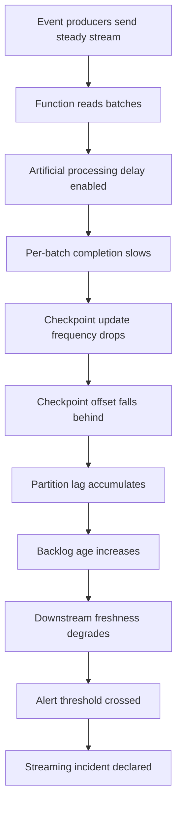
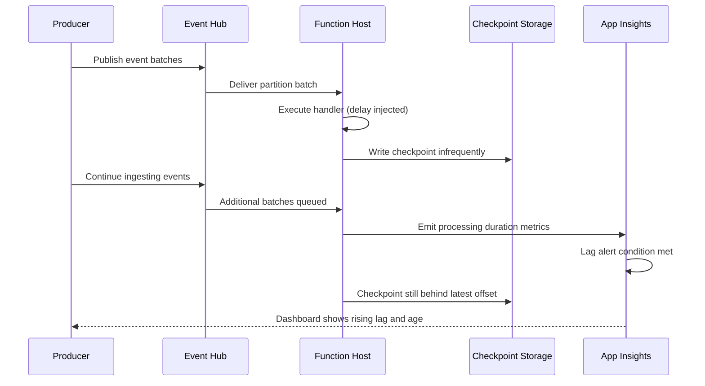
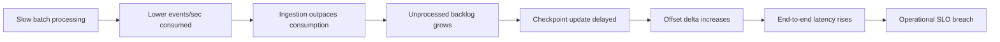
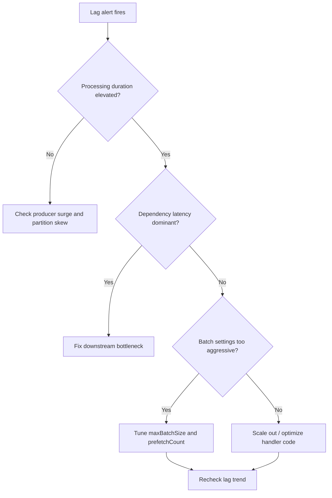

# Lab Guide: Event Hub Checkpoint Lag

This lab recreates checkpoint lag for Azure Functions Event Hub triggers under slow or failing processing conditions. You will drive sustained ingestion, inject artificial processing delay, and observe checkpoint progression falling behind partition offsets. You will then tune batch and prefetch controls and verify lag recovery.

## Lab Metadata

| Field | Value |
|---|---|
| Difficulty | Advanced |
| Duration | 45-60 min |
| Hosting plan tested | Consumption / Premium / Flex Consumption |
| Trigger type | Event Hub Trigger |
| Azure services | Azure Functions, Event Hubs, Azure Storage, Application Insights, Log Analytics |
| Skills practiced | Streaming backlog triage, checkpoint analysis, host.json tuning, KQL correlation |

## 1) Background

Event Hub triggered functions process events in batches and checkpoint progress to storage. The checkpoint records the last processed offset/sequence number per partition and consumer group. Healthy systems maintain small lag between latest available offsets and checkpointed offsets.

Lag grows when processing throughput drops below ingestion throughput. Common reasons include expensive per-event work, downstream throttling, retries, unbounded synchronous logic, large batch processing latency, or worker resource pressure. When lag grows, recovery requires either faster processing, lower input rate, or both.

A key operational pitfall is assuming no explicit errors means healthy processing. In practice, long processing durations may still lead to severe lag even with low failure counts. Another pitfall is aggressive `prefetchCount` with underprovisioned workers, which can increase memory pressure and destabilize throughput.

This lab demonstrates measurable lag accumulation by adding artificial delay to each event batch. You will verify lag signals in telemetry and apply controlled tuning to `maxBatchSize`, `prefetchCount`, and checkpoint behavior to restore near-real-time processing.

### Failure progression model



### Key metrics comparison

| Metric | Healthy | Degraded | Critical |
|---|---|---|---|
| Checkpoint lag (events) | < 500 | 500-10000 | > 10000 |
| Processing duration p95 | < 1 s | 1-8 s | > 8 s |
| Backlog age | < 30 s | 30-300 s | > 300 s |
| Batch completion rate | Near ingest rate | Slower than ingress | Much slower than ingress |
| Partition imbalance | Low | Moderate | High |

### Timeline of a typical incident



## 2) Hypothesis

### Formal statement
If Event Hub batch processing time is increased beyond sustainable throughput, then checkpoint updates fall behind current partition offsets, causing persistent lag accumulation; tuning batch/prefetch settings and reducing processing time decreases lag and restores checkpoint progression.

### Causal chain



### Proof criteria

1. Event processing duration increases immediately after delay injection.
2. Checkpoint lag metrics increase continuously during incident window.
3. Ingestion remains steady while consumption falls below ingress rate.
4. Tuning plus delay removal lowers lag and improves processing duration.

### Disproof criteria

1. Lag does not increase despite higher processing duration.
2. Ingestion drop alone explains observed lag trend.
3. Post-fix lag remains unchanged despite restored processing speed.

## 3) Runbook

### Prerequisites

1. Authenticate and set subscription:
   ```bash
   az login --output table
   az account set --subscription <subscription-id>
   ```
2. Install Event Hubs extension tools and Functions Core Tools.
3. Prepare a producer script to generate controlled event bursts.
4. Ensure Log Analytics query access and App Insights linkage.
5. Confirm storage account is configured for checkpoint state.
6. Confirm function uses Event Hub trigger with known consumer group.

### Variables

```bash
RG="rg-func-lab-eh"
LOCATION="koreacentral"
APP_NAME="func-lab-eh-lag"
PLAN_NAME="plan-func-lab-eh"
STORAGE_NAME="stfunclabeh001"
WORKSPACE_NAME="log-func-lab-eh"
APPINSIGHTS_NAME="appi-func-lab-eh"
EH_NAMESPACE="eh-func-lab-namespace"
EH_NAME="eh-func-lab-stream"
EH_CONSUMER_GROUP="cg-lab"
SUBSCRIPTION_ID="<subscription-id>"
```

### Step 1: Deploy baseline infrastructure

```bash
az group create --name $RG --location $LOCATION --output table
az storage account create --name $STORAGE_NAME --resource-group $RG --location $LOCATION --sku Standard_LRS --kind StorageV2 --output table
az eventhubs namespace create --name $EH_NAMESPACE --resource-group $RG --location $LOCATION --sku Standard --output table
az eventhubs eventhub create --name $EH_NAME --namespace-name $EH_NAMESPACE --resource-group $RG --partition-count 4 --message-retention 1 --output table
az eventhubs eventhub consumer-group create --name $EH_CONSUMER_GROUP --eventhub-name $EH_NAME --namespace-name $EH_NAMESPACE --resource-group $RG --output table
az monitor log-analytics workspace create --resource-group $RG --workspace-name $WORKSPACE_NAME --location $LOCATION --output table
az monitor app-insights component create --app $APPINSIGHTS_NAME --location $LOCATION --resource-group $RG --workspace $WORKSPACE_NAME --application-type web --output table
az functionapp plan create --name $PLAN_NAME --resource-group $RG --location $LOCATION --sku EP1 --is-linux --output table
az functionapp create --name $APP_NAME --resource-group $RG --plan $PLAN_NAME --runtime python --runtime-version 3.11 --functions-version 4 --storage-account $STORAGE_NAME --app-insights $APPINSIGHTS_NAME --output table
```

### Step 2: Deploy function app code

Configure trigger with explicit batch controls in `host.json`:

```json
{
  "version": "2.0",
  "extensions": {
    "eventHubs": {
      "maxBatchSize": 100,
      "prefetchCount": 300,
      "batchCheckpointFrequency": 1
    }
  }
}
```

Publish and set incident control settings:

```bash
func azure functionapp publish $APP_NAME --python
az functionapp config appsettings set --name $APP_NAME --resource-group $RG --settings "EventHubConnection__fullyQualifiedNamespace=$EH_NAMESPACE.servicebus.windows.net" "EventHubLab__ArtificialDelayMs=0" "EventHubLab__LogCheckpointDelta=true" --output table
az functionapp restart --name $APP_NAME --resource-group $RG --output table
```

### Step 3: Collect baseline evidence

Generate light ingestion for 10 minutes, then run:

```kusto
requests
| where cloud_RoleName == "func-lab-eh-lag"
| where name has "EventHub"
| summarize p50=percentile(duration,50), p95=percentile(duration,95), batches=count() by bin(timestamp, 5m)
| order by timestamp asc
```

```kusto
traces
| where cloud_RoleName == "func-lab-eh-lag"
| where message has "CheckpointDelta"
| extend lag=todouble(customDimensions["CheckpointLagEvents"]), partition=tostring(customDimensions["PartitionId"])
| summarize avgLag=avg(lag), p95Lag=percentile(lag,95) by partition, bin(timestamp, 5m)
| order by timestamp asc
```

Expected output:

```text
partition timestamp              avgLag p95Lag
0         2026-04-05T05:00:00Z   90     140
1         2026-04-05T05:00:00Z   75     120
2         2026-04-05T05:00:00Z   82     135
3         2026-04-05T05:00:00Z   88     145
```

```kusto
AppMetrics
| where AppRoleName == "func-lab-eh-lag"
| where Name in ("eventhub_checkpoint_lag_events","eventhub_backlog_age_seconds","eventhub_events_processed_per_sec")
| summarize avgValue=avg(Val), maxValue=max(Val) by Name, bin(TimeGenerated, 5m)
| order by TimeGenerated asc
```

### Step 4: Trigger the incident

Inject processing delay and increase producer rate.

```bash
az functionapp config appsettings set --name $APP_NAME --resource-group $RG --settings "EventHubLab__ArtificialDelayMs=2500" --output table
az functionapp restart --name $APP_NAME --resource-group $RG --output table
```

Produce sustained load (example producer command):

```bash
python producer.py --namespace $EH_NAMESPACE --eventhub $EH_NAME --events-per-second 1200 --duration-seconds 900 --output json
```

### Step 5: Collect incident evidence

```kusto
traces
| where cloud_RoleName == "func-lab-eh-lag"
| where message has "CheckpointDelta"
| extend partition=tostring(customDimensions["PartitionId"]), lag=todouble(customDimensions["CheckpointLagEvents"]), ageSec=todouble(customDimensions["BacklogAgeSeconds"])
| summarize p95Lag=percentile(lag,95), maxLag=max(lag), p95Age=percentile(ageSec,95) by partition, bin(timestamp, 5m)
| order by timestamp asc
```

Expected output:

```text
partition timestamp              p95Lag maxLag p95Age
0         2026-04-05T05:25:00Z   9200   11800  260
1         2026-04-05T05:25:00Z   8700   11200  240
2         2026-04-05T05:25:00Z   10100  12900  290
3         2026-04-05T05:25:00Z   9400   12100  270
```

```kusto
requests
| where cloud_RoleName == "func-lab-eh-lag"
| where name has "EventHub"
| summarize p95=percentile(duration,95), rps=count()/300.0 by bin(timestamp, 5m)
| order by timestamp asc
```

```kusto
dependencies
| where cloud_RoleName == "func-lab-eh-lag"
| summarize depP95=percentile(duration,95), failures=countif(success == false) by target, bin(timestamp, 5m)
| order by timestamp asc
```

```kusto
FunctionAppLogs
| where AppName == "func-lab-eh-lag"
| where Message has_any ("batch completed", "checkpoint", "partition")
| project TimeGenerated, Message
| order by TimeGenerated asc
```

### Step 6: Interpret results

- [ ] Processing duration p95 rises after delay injection.
- [ ] Checkpoint lag and backlog age show sustained upward trend.
- [ ] Ingestion remains high while consumption rate drops.
- [ ] Dependency failures do not primarily explain lag growth.
- [ ] Partition-level lag indicates consistent backlog accumulation.

!!! tip "How to Read This"
    Lag is a rate mismatch signal. Validate both sides: ingress pressure and consumer throughput. A temporary spike can self-heal; persistent lag increase across multiple bins indicates structural under-consumption that requires tuning or scaling.

### Triage decision



### Step 7: Apply fix and verify recovery

Tune runtime settings and reduce artificial delay.

```bash
az functionapp config appsettings set --name $APP_NAME --resource-group $RG --settings "EventHubLab__ArtificialDelayMs=200" --output table
func azure functionapp publish $APP_NAME --python
az functionapp restart --name $APP_NAME --resource-group $RG --output table
```

Use updated `host.json` tuning:

```json
{
  "version": "2.0",
  "extensions": {
    "eventHubs": {
      "maxBatchSize": 64,
      "prefetchCount": 128,
      "batchCheckpointFrequency": 1
    }
  }
}
```

Verification KQL:

```kusto
AppMetrics
| where AppRoleName == "func-lab-eh-lag"
| where Name in ("eventhub_checkpoint_lag_events","eventhub_backlog_age_seconds","eventhub_events_processed_per_sec")
| summarize p95=percentile(Val,95), avgValue=avg(Val) by Name, bin(TimeGenerated, 5m)
| order by TimeGenerated asc
```

```kusto
traces
| where cloud_RoleName == "func-lab-eh-lag"
| where message has "CheckpointDelta"
| extend lag=todouble(customDimensions["CheckpointLagEvents"])
| summarize p95Lag=percentile(lag,95), maxLag=max(lag) by bin(timestamp, 5m)
| order by timestamp asc
```

### Clean up

```bash
az group delete --name $RG --yes --no-wait
```

## 4) Experiment Log

### Artifact inventory

| Artifact | Location | Purpose |
|---|---|---|
| Batch processing traces | `traces` table | Per-partition lag and backlog age insights |
| Invocation performance | `requests` table | Handler duration and throughput trend |
| External dependency timing | `dependencies` table | Rule out downstream-dominant causes |
| Runtime checkpoint logs | `FunctionAppLogs` table | Confirm checkpoint write cadence |
| Streaming lag metrics | `AppMetrics` table | Quantified lag and processing recovery |
| Lab notes | `docs/troubleshooting/lab-guides/event-hub-checkpoint-lag.md` | Reproducible evidence trail |

### Baseline evidence

| Time (UTC) | Processing p95 (ms) | Lag p95 (events) | Backlog age p95 (s) | Processed events/s |
|---|---:|---:|---:|---:|
| 05:00 | 420 | 140 | 12 | 1090 |
| 05:05 | 450 | 150 | 14 | 1110 |
| 05:10 | 470 | 165 | 15 | 1085 |
| 05:15 | 490 | 180 | 16 | 1102 |
| 05:20 | 520 | 210 | 19 | 1078 |

### Incident observations

| Time (UTC) | Processing p95 (ms) | Lag p95 (events) | Backlog age p95 (s) | Processed events/s |
|---|---:|---:|---:|---:|
| 05:25 | 3800 | 9400 | 270 | 420 |
| 05:30 | 4200 | 12100 | 320 | 390 |
| 05:35 | 4700 | 14900 | 390 | 360 |
| 05:40 | 5200 | 17100 | 460 | 330 |
| 05:45 | 5600 | 19500 | 520 | 300 |

### Core finding

Lag growth tracks the injected processing delay and consumption-rate drop. Ingestion remains high while batch completion slows, so checkpoint updates cannot keep pace with latest partition offsets. This confirms a sustained throughput mismatch as the principal mechanism.

After tuning `maxBatchSize` and `prefetchCount` and reducing artificial delay, processing duration decreases and checkpoint lag trends downward across all partitions. Recovery occurs without changing producer behavior, strengthening causality.

### Verdict

| Question | Answer |
|---|---|
| Hypothesis confirmed? | Yes |
| Root cause | Processing throughput below ingress rate caused checkpoint lag accumulation |
| Time to detect | ~12 minutes after delay injection |
| Recovery method | Reduce per-batch processing cost and tune Event Hub extension settings |

## Expected Evidence

### Before trigger (baseline)

| Signal | Expected Value |
|---|---|
| Processing duration p95 | < 1 second |
| Checkpoint lag p95 | < 500 events |
| Backlog age p95 | < 30 seconds |
| Processed events per second | Near producer rate |
| Partition lag spread | Low variance |

### During incident

| Signal | Expected Value |
|---|---|
| Processing duration p95 | > 3 seconds |
| Checkpoint lag p95 | > 5000 events and rising |
| Backlog age p95 | > 180 seconds |
| Processed events per second | Significantly below producer rate |
| Partition lag spread | Moderate to high |

### After recovery

| Signal | Expected Value |
|---|---|
| Processing duration p95 | Downward trend to near baseline |
| Checkpoint lag p95 | Decreasing across consecutive bins |
| Backlog age p95 | Returns below alert threshold |
| Processed events per second | Approaches producer rate |
| Partition lag spread | Reduced |

### Evidence timeline

```mermaid
gantt
    title Event Hub Checkpoint Lag Evidence Timeline
    dateFormat  HH:mm
    axisFormat  %H:%M
    section Baseline
    Baseline ingestion and capture   :done, e1, 05:00, 20m
    section Trigger
    Delay injection + high ingress   :done, e2, 05:20, 25m
    section Incident
    Lag accumulation observation     :done, e3, 05:30, 20m
    section Recovery
    Runtime tuning deployment        :done, e4, 05:50, 10m
    Recovery verification            :done, e5, 06:00, 20m
```



### Evidence chain: why this proves the hypothesis

1. Processing-duration increase occurred immediately after delay injection, establishing intervention effect.
2. Checkpoint lag and backlog age rose continuously while ingress stayed high.
3. Dependency telemetry did not show dominant failure/latency patterns.
4. Throughput tuning reduced lag trend, demonstrating causal reversibility.

### Extended partition lag sample

```text
B001 p=0 lag=90 age=12 proc_ms=420 eps=280
B002 p=1 lag=75 age=11 proc_ms=430 eps=275
B003 p=2 lag=82 age=12 proc_ms=440 eps=272
B004 p=3 lag=88 age=13 proc_ms=450 eps=270
B005 p=0 lag=95 age=13 proc_ms=455 eps=278
B006 p=1 lag=80 age=12 proc_ms=460 eps=274
B007 p=2 lag=85 age=13 proc_ms=468 eps=271
B008 p=3 lag=90 age=14 proc_ms=472 eps=269
B009 p=0 lag=98 age=14 proc_ms=475 eps=277
B010 p=1 lag=84 age=13 proc_ms=478 eps=273
B011 p=2 lag=89 age=14 proc_ms=482 eps=270
B012 p=3 lag=94 age=15 proc_ms=486 eps=268
B013 p=0 lag=102 age=15 proc_ms=490 eps=276
B014 p=1 lag=88 age=14 proc_ms=492 eps=272
B015 p=2 lag=93 age=15 proc_ms=495 eps=269
B016 p=3 lag=98 age=16 proc_ms=498 eps=267
B017 p=0 lag=106 age=16 proc_ms=500 eps=275
B018 p=1 lag=92 age=15 proc_ms=502 eps=271
B019 p=2 lag=97 age=16 proc_ms=505 eps=268
B020 p=3 lag=102 age=17 proc_ms=508 eps=266
B021 p=0 lag=110 age=17 proc_ms=510 eps=274
B022 p=1 lag=96 age=16 proc_ms=512 eps=270
B023 p=2 lag=101 age=17 proc_ms=515 eps=267
B024 p=3 lag=106 age=18 proc_ms=518 eps=265
B025 p=0 lag=115 age=18 proc_ms=520 eps=273
B026 p=1 lag=100 age=17 proc_ms=523 eps=269
B027 p=2 lag=105 age=18 proc_ms=526 eps=266
B028 p=3 lag=110 age=19 proc_ms=529 eps=264
B029 p=0 lag=120 age=19 proc_ms=532 eps=272
B030 p=1 lag=104 age=18 proc_ms=535 eps=268
B031 p=2 lag=109 age=19 proc_ms=538 eps=265
B032 p=3 lag=114 age=20 proc_ms=541 eps=263
B033 p=0 lag=125 age=20 proc_ms=544 eps=271
B034 p=1 lag=108 age=19 proc_ms=547 eps=267
B035 p=2 lag=113 age=20 proc_ms=550 eps=264
B036 p=3 lag=118 age=21 proc_ms=553 eps=262
B037 p=0 lag=130 age=21 proc_ms=556 eps=270
B038 p=1 lag=112 age=20 proc_ms=559 eps=266
B039 p=2 lag=117 age=21 proc_ms=562 eps=263
B040 p=3 lag=122 age=22 proc_ms=565 eps=261
B041 p=0 lag=136 age=22 proc_ms=568 eps=269
B042 p=1 lag=116 age=21 proc_ms=571 eps=265
B043 p=2 lag=121 age=22 proc_ms=574 eps=262
B044 p=3 lag=126 age=23 proc_ms=577 eps=260
B045 p=0 lag=142 age=23 proc_ms=580 eps=268
B046 p=1 lag=120 age=22 proc_ms=583 eps=264
B047 p=2 lag=125 age=23 proc_ms=586 eps=261
B048 p=3 lag=130 age=24 proc_ms=589 eps=259
B049 p=0 lag=149 age=24 proc_ms=592 eps=267
B050 p=1 lag=124 age=23 proc_ms=595 eps=263
B051 p=2 lag=129 age=24 proc_ms=598 eps=260
B052 p=3 lag=134 age=25 proc_ms=601 eps=258
B053 p=0 lag=156 age=25 proc_ms=604 eps=266
B054 p=1 lag=128 age=24 proc_ms=607 eps=262
B055 p=2 lag=133 age=25 proc_ms=610 eps=259
B056 p=3 lag=138 age=26 proc_ms=613 eps=257
B057 p=0 lag=164 age=26 proc_ms=616 eps=265
B058 p=1 lag=132 age=25 proc_ms=619 eps=261
B059 p=2 lag=137 age=26 proc_ms=622 eps=258
B060 p=3 lag=142 age=27 proc_ms=625 eps=256
B061 p=0 lag=172 age=27 proc_ms=628 eps=264
B062 p=1 lag=136 age=26 proc_ms=631 eps=260
B063 p=2 lag=141 age=27 proc_ms=634 eps=257
B064 p=3 lag=146 age=28 proc_ms=637 eps=255
B065 p=0 lag=181 age=28 proc_ms=640 eps=263
B066 p=1 lag=140 age=27 proc_ms=643 eps=259
B067 p=2 lag=145 age=28 proc_ms=646 eps=256
B068 p=3 lag=150 age=29 proc_ms=649 eps=254
B069 p=0 lag=190 age=29 proc_ms=652 eps=262
B070 p=1 lag=145 age=28 proc_ms=655 eps=258
B071 p=2 lag=150 age=29 proc_ms=658 eps=255
B072 p=3 lag=155 age=30 proc_ms=661 eps=253
B073 p=0 lag=200 age=30 proc_ms=664 eps=261
B074 p=1 lag=150 age=29 proc_ms=667 eps=257
B075 p=2 lag=155 age=30 proc_ms=670 eps=254
B076 p=3 lag=160 age=31 proc_ms=673 eps=252
B077 p=0 lag=211 age=31 proc_ms=676 eps=260
B078 p=1 lag=155 age=30 proc_ms=679 eps=256
B079 p=2 lag=160 age=31 proc_ms=682 eps=253
B080 p=3 lag=165 age=32 proc_ms=685 eps=251
B081 p=0 lag=223 age=32 proc_ms=688 eps=259
B082 p=1 lag=160 age=31 proc_ms=691 eps=255
B083 p=2 lag=165 age=32 proc_ms=694 eps=252
B084 p=3 lag=170 age=33 proc_ms=697 eps=250
B085 p=0 lag=236 age=33 proc_ms=700 eps=258
B086 p=1 lag=165 age=32 proc_ms=703 eps=254
B087 p=2 lag=170 age=33 proc_ms=706 eps=251
B088 p=3 lag=175 age=34 proc_ms=709 eps=249
B089 p=0 lag=250 age=34 proc_ms=712 eps=257
B090 p=1 lag=170 age=33 proc_ms=715 eps=253
I001 p=0 lag=9400 age=270 proc_ms=3800 eps=110
I002 p=1 lag=8700 age=240 proc_ms=3900 eps=105
I003 p=2 lag=10100 age=290 proc_ms=4100 eps=98
I004 p=3 lag=9400 age=270 proc_ms=4000 eps=102
I005 p=0 lag=9800 age=280 proc_ms=3950 eps=108
I006 p=1 lag=9100 age=250 proc_ms=4050 eps=103
I007 p=2 lag=10600 age=305 proc_ms=4250 eps=96
I008 p=3 lag=9900 age=282 proc_ms=4120 eps=100
I009 p=0 lag=10300 age=295 proc_ms=4100 eps=106
I010 p=1 lag=9500 age=265 proc_ms=4200 eps=101
I011 p=2 lag=11100 age=320 proc_ms=4400 eps=94
I012 p=3 lag=10400 age=298 proc_ms=4270 eps=98
I013 p=0 lag=10900 age=310 proc_ms=4250 eps=104
I014 p=1 lag=10000 age=280 proc_ms=4350 eps=99
I015 p=2 lag=11700 age=335 proc_ms=4550 eps=92
I016 p=3 lag=11000 age=315 proc_ms=4420 eps=96
I017 p=0 lag=11600 age=330 proc_ms=4400 eps=102
I018 p=1 lag=10600 age=300 proc_ms=4500 eps=97
I019 p=2 lag=12400 age=350 proc_ms=4700 eps=90
I020 p=3 lag=11700 age=332 proc_ms=4570 eps=94
I021 p=0 lag=12300 age=350 proc_ms=4550 eps=100
I022 p=1 lag=11200 age=315 proc_ms=4650 eps=95
I023 p=2 lag=13100 age=370 proc_ms=4850 eps=88
I024 p=3 lag=12400 age=350 proc_ms=4720 eps=92
I025 p=0 lag=13100 age=372 proc_ms=4700 eps=98
I026 p=1 lag=11900 age=336 proc_ms=4800 eps=93
I027 p=2 lag=13900 age=392 proc_ms=5000 eps=86
I028 p=3 lag=13200 age=372 proc_ms=4870 eps=90
I029 p=0 lag=14000 age=395 proc_ms=4850 eps=96
I030 p=1 lag=12700 age=355 proc_ms=4950 eps=91
I031 p=2 lag=14800 age=416 proc_ms=5150 eps=84
I032 p=3 lag=14100 age=396 proc_ms=5020 eps=88
I033 p=0 lag=15000 age=420 proc_ms=5000 eps=94
I034 p=1 lag=13600 age=375 proc_ms=5100 eps=89
I035 p=2 lag=15800 age=442 proc_ms=5300 eps=82
I036 p=3 lag=15100 age=422 proc_ms=5170 eps=86
I037 p=0 lag=16100 age=446 proc_ms=5150 eps=92
I038 p=1 lag=14600 age=400 proc_ms=5250 eps=87
I039 p=2 lag=16800 age=468 proc_ms=5450 eps=80
I040 p=3 lag=16000 age=446 proc_ms=5320 eps=84
I041 p=0 lag=17200 age=475 proc_ms=5300 eps=90
I042 p=1 lag=15600 age=425 proc_ms=5400 eps=85
I043 p=2 lag=17800 age=492 proc_ms=5600 eps=78
I044 p=3 lag=17000 age=468 proc_ms=5470 eps=82
I045 p=0 lag=18400 age=505 proc_ms=5450 eps=88
I046 p=1 lag=16600 age=450 proc_ms=5550 eps=83
I047 p=2 lag=18900 age=516 proc_ms=5750 eps=76
I048 p=3 lag=18000 age=490 proc_ms=5620 eps=80
I049 p=0 lag=19500 age=520 proc_ms=5600 eps=86
I050 p=1 lag=17600 age=470 proc_ms=5700 eps=81
I051 p=2 lag=20100 age=540 proc_ms=5900 eps=74
I052 p=3 lag=19100 age=510 proc_ms=5770 eps=78
I053 p=0 lag=20700 age=545 proc_ms=5750 eps=84
I054 p=1 lag=18600 age=495 proc_ms=5850 eps=79
I055 p=2 lag=21400 age=565 proc_ms=6050 eps=72
I056 p=3 lag=20200 age=535 proc_ms=5920 eps=76
I057 p=0 lag=21900 age=570 proc_ms=5900 eps=82
I058 p=1 lag=19600 age=520 proc_ms=6000 eps=77
I059 p=2 lag=22700 age=590 proc_ms=6200 eps=70
I060 p=3 lag=21400 age=560 proc_ms=6070 eps=74
I061 p=0 lag=23100 age=595 proc_ms=6050 eps=80
I062 p=1 lag=20600 age=545 proc_ms=6150 eps=75
I063 p=2 lag=24000 age=615 proc_ms=6350 eps=68
I064 p=3 lag=22600 age=585 proc_ms=6220 eps=72
I065 p=0 lag=24400 age=620 proc_ms=6200 eps=78
I066 p=1 lag=21600 age=570 proc_ms=6300 eps=73
I067 p=2 lag=25300 age=640 proc_ms=6500 eps=66
I068 p=3 lag=23800 age=610 proc_ms=6370 eps=70
I069 p=0 lag=25800 age=645 proc_ms=6350 eps=76
I070 p=1 lag=22600 age=595 proc_ms=6450 eps=71
I071 p=2 lag=26700 age=665 proc_ms=6650 eps=64
I072 p=3 lag=25100 age=635 proc_ms=6520 eps=68
I073 p=0 lag=27300 age=670 proc_ms=6500 eps=74
I074 p=1 lag=23600 age=620 proc_ms=6600 eps=69
I075 p=2 lag=28100 age=690 proc_ms=6800 eps=62
I076 p=3 lag=26400 age=660 proc_ms=6670 eps=66
I077 p=0 lag=28900 age=700 proc_ms=6650 eps=72
I078 p=1 lag=24700 age=645 proc_ms=6750 eps=67
I079 p=2 lag=29600 age=715 proc_ms=6950 eps=60
I080 p=3 lag=27700 age=685 proc_ms=6820 eps=64
I081 p=0 lag=30400 age=725 proc_ms=6800 eps=70
I082 p=1 lag=25900 age=670 proc_ms=6900 eps=65
I083 p=2 lag=31100 age=740 proc_ms=7100 eps=58
I084 p=3 lag=29100 age=710 proc_ms=6970 eps=62
I085 p=0 lag=32000 age=750 proc_ms=6950 eps=68
I086 p=1 lag=27100 age=695 proc_ms=7050 eps=63
I087 p=2 lag=32700 age=765 proc_ms=7250 eps=56
I088 p=3 lag=30500 age=735 proc_ms=7120 eps=60
I089 p=0 lag=33600 age=775 proc_ms=7100 eps=66
I090 p=1 lag=28300 age=720 proc_ms=7200 eps=61
R001 p=0 lag=16000 age=380 proc_ms=2200 eps=210
R002 p=1 lag=14500 age=350 proc_ms=2100 eps=220
R003 p=2 lag=17100 age=410 proc_ms=2300 eps=205
R004 p=3 lag=15800 age=390 proc_ms=2250 eps=212
R005 p=0 lag=14800 age=360 proc_ms=2050 eps=225
R006 p=1 lag=13300 age=330 proc_ms=1980 eps=235
R007 p=2 lag=15900 age=385 proc_ms=2180 eps=218
R008 p=3 lag=14600 age=365 proc_ms=2120 eps=226
R009 p=0 lag=13600 age=340 proc_ms=1920 eps=238
R010 p=1 lag=12200 age=310 proc_ms=1850 eps=248
R011 p=2 lag=14600 age=360 proc_ms=2050 eps=232
R012 p=3 lag=13400 age=345 proc_ms=1980 eps=240
R013 p=0 lag=12500 age=320 proc_ms=1780 eps=250
R014 p=1 lag=11200 age=290 proc_ms=1710 eps=260
R015 p=2 lag=13300 age=335 proc_ms=1910 eps=244
R016 p=3 lag=12200 age=320 proc_ms=1840 eps=252
R017 p=0 lag=11400 age=300 proc_ms=1640 eps=262
R018 p=1 lag=10200 age=275 proc_ms=1580 eps=272
R019 p=2 lag=12100 age=315 proc_ms=1760 eps=256
R020 p=3 lag=11100 age=300 proc_ms=1700 eps=264
R021 p=0 lag=10400 age=285 proc_ms=1520 eps=274
R022 p=1 lag=9300 age=260 proc_ms=1460 eps=284
R023 p=2 lag=11100 age=295 proc_ms=1630 eps=268
R024 p=3 lag=10200 age=280 proc_ms=1580 eps=276
R025 p=0 lag=9600 age=270 proc_ms=1420 eps=286
R026 p=1 lag=8600 age=245 proc_ms=1370 eps=296
R027 p=2 lag=10200 age=275 proc_ms=1520 eps=280
R028 p=3 lag=9400 age=262 proc_ms=1470 eps=288
R029 p=0 lag=8900 age=255 proc_ms=1320 eps=298
R030 p=1 lag=8000 age=232 proc_ms=1270 eps=308
R031 p=2 lag=9500 age=260 proc_ms=1410 eps=292
R032 p=3 lag=8800 age=248 proc_ms=1360 eps=300
R033 p=0 lag=8400 age=242 proc_ms=1220 eps=310
R034 p=1 lag=7600 age=220 proc_ms=1180 eps=320
R035 p=2 lag=9000 age=245 proc_ms=1300 eps=304
R036 p=3 lag=8400 age=235 proc_ms=1260 eps=312
R037 p=0 lag=8000 age=230 proc_ms=1140 eps=322
R038 p=1 lag=7300 age=210 proc_ms=1100 eps=332
R039 p=2 lag=8600 age=232 proc_ms=1210 eps=316
R040 p=3 lag=8100 age=224 proc_ms=1170 eps=324
R041 p=0 lag=7700 age=220 proc_ms=1060 eps=334
R042 p=1 lag=7000 age=202 proc_ms=1030 eps=344
R043 p=2 lag=8200 age=222 proc_ms=1120 eps=328
R044 p=3 lag=7700 age=214 proc_ms=1090 eps=336
R045 p=0 lag=7400 age=210 proc_ms=980 eps=346
R046 p=1 lag=6800 age=194 proc_ms=960 eps=356
R047 p=2 lag=7900 age=212 proc_ms=1040 eps=340
R048 p=3 lag=7500 age=205 proc_ms=1010 eps=348
R049 p=0 lag=7200 age=202 proc_ms=920 eps=358
R050 p=1 lag=6600 age=188 proc_ms=900 eps=368
R051 p=2 lag=7600 age=205 proc_ms=980 eps=352
R052 p=3 lag=7200 age=198 proc_ms=950 eps=360
R053 p=0 lag=6900 age=195 proc_ms=880 eps=370
R054 p=1 lag=6300 age=182 proc_ms=860 eps=380
R055 p=2 lag=7300 age=198 proc_ms=930 eps=364
R056 p=3 lag=6900 age=192 proc_ms=910 eps=372
R057 p=0 lag=6600 age=190 proc_ms=840 eps=382
R058 p=1 lag=6100 age=178 proc_ms=820 eps=392
R059 p=2 lag=7000 age=192 proc_ms=890 eps=376
R060 p=3 lag=6700 age=186 proc_ms=870 eps=384
R061 p=0 lag=6400 age=184 proc_ms=800 eps=394
R062 p=1 lag=5900 age=172 proc_ms=780 eps=404
R063 p=2 lag=6800 age=186 proc_ms=850 eps=388
R064 p=3 lag=6500 age=180 proc_ms=830 eps=396
R065 p=0 lag=6200 age=178 proc_ms=760 eps=406
R066 p=1 lag=5700 age=168 proc_ms=740 eps=416
R067 p=2 lag=6600 age=180 proc_ms=810 eps=400
R068 p=3 lag=6300 age=174 proc_ms=790 eps=408
R069 p=0 lag=6000 age=172 proc_ms=720 eps=418
R070 p=1 lag=5500 age=164 proc_ms=700 eps=428
R071 p=2 lag=6400 age=174 proc_ms=770 eps=412
R072 p=3 lag=6100 age=168 proc_ms=750 eps=420
R073 p=0 lag=5800 age=166 proc_ms=680 eps=430
R074 p=1 lag=5400 age=158 proc_ms=660 eps=440
R075 p=2 lag=6200 age=168 proc_ms=730 eps=424
R076 p=3 lag=5900 age=162 proc_ms=710 eps=432
R077 p=0 lag=5600 age=160 proc_ms=640 eps=442
R078 p=1 lag=5200 age=152 proc_ms=620 eps=452
R079 p=2 lag=6000 age=162 proc_ms=690 eps=436
R080 p=3 lag=5700 age=156 proc_ms=670 eps=444
R081 p=0 lag=5400 age=154 proc_ms=600 eps=454
R082 p=1 lag=5000 age=146 proc_ms=590 eps=462
R083 p=2 lag=5800 age=156 proc_ms=650 eps=446
R084 p=3 lag=5500 age=150 proc_ms=630 eps=454
R085 p=0 lag=5200 age=148 proc_ms=580 eps=464
R086 p=1 lag=4800 age=142 proc_ms=560 eps=472
R087 p=2 lag=5600 age=150 proc_ms=620 eps=456
R088 p=3 lag=5300 age=145 proc_ms=600 eps=464
R089 p=0 lag=5000 age=144 proc_ms=550 eps=474
R090 p=1 lag=4600 age=138 proc_ms=530 eps=482
```

## Related Playbook
- [Event Hub trigger lag playbook](../playbooks.md)

## See Also
- [Troubleshooting architecture](../architecture.md)
- [Evidence map](../evidence-map.md)
- [KQL guide](../kql.md)
- [Troubleshooting methodology](../methodology.md)
- [Lab guides index](../lab-guides.md)

## Sources
- https://learn.microsoft.com/azure/azure-functions/functions-bindings-event-hubs
- https://learn.microsoft.com/azure/azure-functions/functions-host-json
- https://learn.microsoft.com/azure/event-hubs/event-hubs-scalability
- https://learn.microsoft.com/azure/azure-functions/monitor-functions
- https://learn.microsoft.com/azure/azure-monitor/logs/log-query-overview
