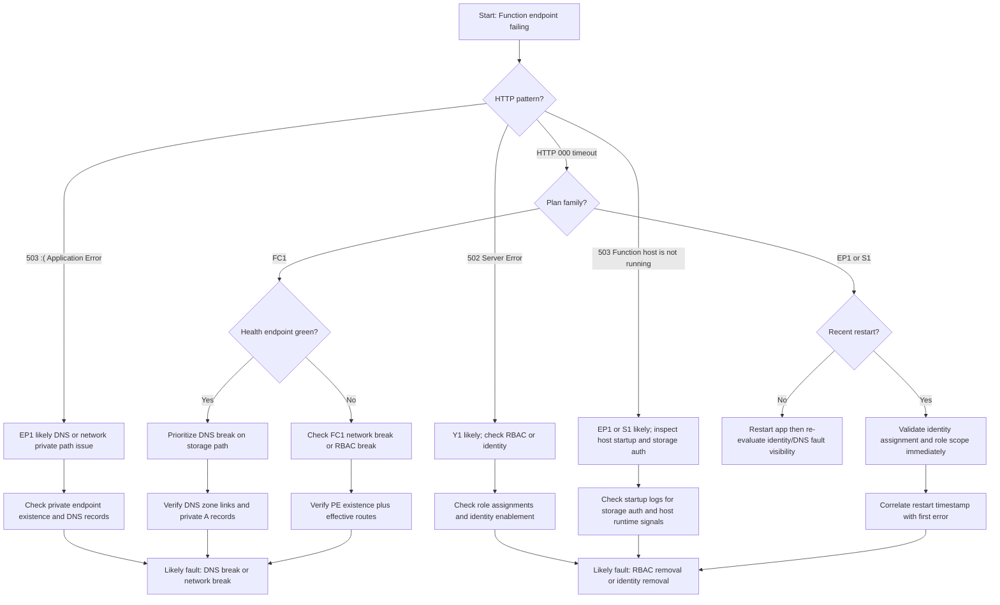
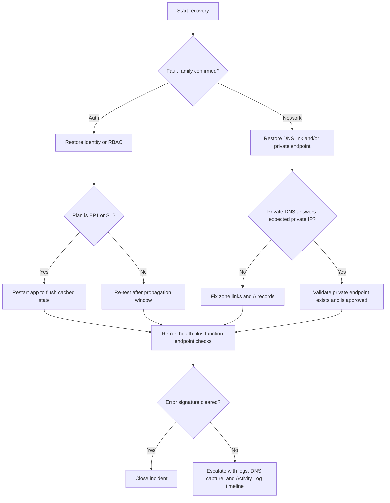

---
content_sources:
  - type: mslearn-adapted
    url: https://learn.microsoft.com/azure/azure-functions/functions-networking-options
  - type: mslearn-adapted
    url: https://learn.microsoft.com/azure/azure-functions/functions-identity-based-connections-tutorial
  - type: mslearn-adapted
    url: https://learn.microsoft.com/azure/storage/common/storage-private-endpoints
  - type: mslearn-adapted
    url: https://learn.microsoft.com/azure/azure-functions/functions-scale
content_validation:
  status: verified
  last_reviewed: 2026-04-12
  reviewer: agent
  core_claims:
    - claim: "Hosting Plan Security Comparison Matrix 관련 핵심 진단 절차와 운영 판단 기준"
      source: https://learn.microsoft.com/azure/azure-functions/functions-networking-options
      verified: true
---

# Hosting Plan Security Comparison Matrix

Quick-reference comparison of Azure Functions hosting plan behavior under identity and networking fault conditions. Data collected from real Azure deployments across all four hosting plans.

## Prerequisites

- Access to the full companion lab guide: `hosting-plan-security-matrix.md`
- Access to Azure Monitor logs and Activity Log for affected Function Apps
- Familiarity with hosting plan names used in this matrix:
    - `FC1` = Flex Consumption
    - `EP1` = Premium
    - `Y1` = Consumption
    - `S1` = Dedicated

## Topic/Command Groups

### 1) Feature Support Matrix

| Feature | FC1 (Flex) | EP1 (Premium) | Y1 (Consumption) | S1 (Dedicated) |
|---|---|---|---|---|
| VNet Integration | Yes | Yes | No | Yes |
| Storage Private Endpoints | 4 (blob/queue/table/file) | 4 (blob/queue/table/file) | N/A | 3 (blob/queue/table) |
| Site Private Endpoint | Supported (optional) | Supported (optional) | Not supported | Supported (tested) |
| Identity-Only Storage | Full (`allowSharedKeyAccess: false`) | Partial (needs Azure Files) | Partial (content share needs connection string) | Full (run-from-package) |
| Azure Files Dependency | No | Yes (`vnetContentShareEnabled`) | Yes (content share via connection string) | No (run-from-package) |
| Always-On | No (scales to zero) | Yes | No (scales to zero) | Yes |
| Identity Type Tested | User-assigned | System-assigned | System-assigned | System-assigned |
| RBAC Roles Required | 3 (Blob Owner, Account Contributor, Queue Contributor) | 4 (+ File Data Privileged Contributor) | 4 (+ File Data Privileged Contributor) | 3 |

### 2) Error Signature Matrix

Use this as the first triage table when an operator only has a front-door symptom.

| Plan | RBAC Removal | Identity Removal | DNS Break | Network Break |
|---|---|---|---|---|
| FC1 (Flex) | HTTP 000 timeout / 502 | HTTP 000 timeout | HTTP 000 timeout (health OK!) | HTTP 000/502 |
| EP1 (Premium) | 503 "Function host is not running" | HTTP 000 (after restart only!) | 503 ":( Application Error" | 503 ":( Application Error" |
| Y1 (Consumption) | 502 "Server Error" | 502 "Server Error" | N/A | N/A |
| Dedicated (S1) | 503 "Function host is not running" | HTTP 000 (after restart only!) | 503 "Function host is not running" | 503 "Function host is not running" |

### 3) Failure Detection Time Matrix

| Plan | RBAC Removal | Identity Removal | DNS Break | Network Break |
|---|---|---|---|---|
| FC1 | 3-5 min | 2-3 min | Immediate (storage) | 3 min |
| EP1 | 3 min | Hours (until restart!) | After restart | 3-5 min (degraded without restart) |
| Y1 | 2 min | 2 min | N/A | N/A |
| Dedicated | 3 min | Hours (until restart!) | 3 min (visible without restart) | 2 min |

### 4) Detection Difficulty Ranking

Ranked from hardest to easiest:

1. Identity removal on EP1/Dedicated (invisible until restart/token expiry)
2. DNS break on FC1 (health stays green)
3. PE deletion with stale DNS (misleading DNS resolution)
4. RBAC removal on any plan (relatively fast, clear errors)

### 5) Diagnostic Decision Tree

<!-- diagram-id: 5-diagnostic-decision-tree -->

### 6) DNS Resolution Comparison

| Plan | Fault | DNS Resolution | Actual IP | Notes |
|---|---|---|---|---|
| FC1 | Baseline | Private (10.0.2.x) | Private | All 4 services |
| FC1 | DNS break | Fails/timeout | N/A | DNS zones unlinked |
| FC1 | Network break | Stale private (10.0.2.x) | Dead | PEs gone but DNS cached |
| Dedicated | Baseline | Private (10.0.2.x) | Private | 3 services (no file) |
| Dedicated | DNS break | Public (20.150.x.x) | Blocked | Firewall blocks public |
| Dedicated | Network break | Public (20.150.x.x) | Blocked | Immediate revert to public |

### 7) Recovery Procedure Quick Reference

| Plan | Fault | What to restore | Restart needed? | Typical propagation/settle time |
|---|---|---|---|---|
| FC1 | RBAC removal | Re-add missing storage data-plane role(s) at correct scope | Recommended | 3-5 min |
| FC1 | Identity removal | Reattach expected identity and confirm role bindings | Usually not required | 2-3 min |
| FC1 | DNS break | Relink private DNS zones and validate A records | No | Immediate to a few minutes |
| FC1 | Network break | Recreate missing private endpoints and validate NIC/IPs | No | ~3 min |
| EP1 | RBAC removal | Re-add missing RBAC role(s), including file role when required | Recommended | ~3 min |
| EP1 | Identity removal | Re-enable expected identity and rebind roles | Yes (required for visibility and recovery) | Hours without restart; minutes after restart |
| EP1 | DNS break | Restore zone links/records for storage and site paths | Yes (recommended) | Appears after restart |
| EP1 | Network break | Restore private endpoint path and network policy alignment | Yes (recommended) | Appears after restart |
| Y1 | RBAC removal | Re-add missing role(s) for storage identity path | No | ~2 min |
| Y1 | Identity removal | Re-enable identity and confirm connection settings | No | ~2 min |
| Y1 | DNS break | N/A | N/A | N/A |
| Y1 | Network break | N/A | N/A | N/A |
| S1 | RBAC removal | Re-add storage role(s) at proper scope | Recommended | ~3 min |
| S1 | Identity removal | Re-enable identity and rebind role assignments | Yes (required for visibility and recovery) | Hours without restart; minutes after restart |
| S1 | DNS break | Relink DNS and restore private name resolution path | Yes (recommended) | Appears after restart |
| S1 | Network break | Restore private endpoint connectivity or allowed route path | Often helpful | ~2 min |

### 8) Error Text Classifier (EP1 Focus)

| EP1 Front-End Error Text | Most Likely Fault Family | First Check |
|---|---|---|
| `503 "Function host is not running"` | Startup/storage auth path (often RBAC or host init impact) | Host startup traces and storage auth dependencies |
| `503 ":( Application Error"` | Private networking path issue (DNS or PE connectivity) | DNS resolution + private endpoint health |
| `HTTP 000 timeout` after identity changes | Cached/latent identity failure surfaced post-restart | Identity assignment state + restart history |

### 9) Restart Sensitivity Matrix

Use this to avoid false negatives when a fault can remain hidden until recycle.

| Fault Type | FC1 | EP1 | Y1 | S1 |
|---|---|---|---|---|
| RBAC removal | Visible without restart | Usually visible; restart clarifies startup impact | Visible without restart | Usually visible; restart clarifies startup impact |
| Identity removal | Visible quickly | Often latent until restart/token expiry | Visible quickly | Often latent until restart/token expiry |
| DNS break | Visible immediately on storage path | Often confirmed after restart | N/A | Often confirmed after restart |
| Network break | Visible quickly | Often confirmed after restart | N/A | Usually visible quickly |

### 10) First Evidence to Pull

| Suspected Fault | Highest-signal evidence first | Why this first |
|---|---|---|
| RBAC removal | Role assignments at storage scope + storage dependency result codes | Confirms authorization gap before deep network checks |
| Identity removal | Function app identity state + recent restart timeline | Distinguishes missing principal from stale token behavior |
| DNS break | Name resolution from app path + private DNS zone link state | Confirms split-brain name path vs expected private resolution |
| Network break | Private endpoint resource state + effective DNS target IP | Detects stale DNS and missing transport path together |

### 11) Recovery Decision Tree

<!-- diagram-id: 11-recovery-decision-tree -->

## Usage Notes

!!! warning "Never trust health endpoints alone"
    On FC1, DNS break scenarios can keep health checks green while storage-backed function paths fail.

!!! warning "Always restart after identity changes on Premium or Dedicated"
    EP1 and S1 can mask identity-removal faults until restart or token expiry.

!!! warning "Check both DNS and private endpoint existence"
    Stale DNS answers after private endpoint deletion can look valid while traffic still fails.

!!! warning "Use EP1 error text to narrow the branch quickly"
    `Function host is not running` and `:( Application Error` often indicate different fault families.

### Fast triage sequence

1. Match observed error text to the Error Signature Matrix.
2. Confirm plan type (`FC1`, `EP1`, `Y1`, `S1`).
3. Use Detection Time Matrix to estimate whether fault is expected to be visible yet.
4. Validate identity and RBAC first for auth-like signatures.
5. Validate DNS plus private endpoint state together for network-like signatures.

### Operator shorthand

| If you see | On plan | Bias your first hypothesis toward |
|---|---|---|
| `HTTP 000` + health still green | FC1 | DNS break or stale PE/DNS state |
| `503 Function host is not running` | EP1 or S1 | RBAC/startup storage auth fault |
| `503 :( Application Error` | EP1 | DNS or network private path fault |
| `502 Server Error` | Y1 | RBAC or identity fault |

## See Also

- [Hosting Plan Security Matrix Lab Guide](hosting-plan-security-matrix.md) — Full lab guide with evidence
- [Managed Identity Authentication](managed-identity-auth.md) - Single-plan MI lab
- [DNS VNet Resolution](dns-vnet-resolution.md) - DNS troubleshooting lab
- [Storage Access Failure](storage-access-failure.md) - Storage access lab

## Sources

- [Microsoft Learn: Azure Functions networking](https://learn.microsoft.com/azure/azure-functions/functions-networking-options)
- [Microsoft Learn: Azure Functions managed identity](https://learn.microsoft.com/azure/azure-functions/functions-identity-based-connections-tutorial)
- [Microsoft Learn: Private endpoints for Azure Storage](https://learn.microsoft.com/azure/storage/common/storage-private-endpoints)
- [Microsoft Learn: Azure Functions hosting plans](https://learn.microsoft.com/azure/azure-functions/functions-scale)
