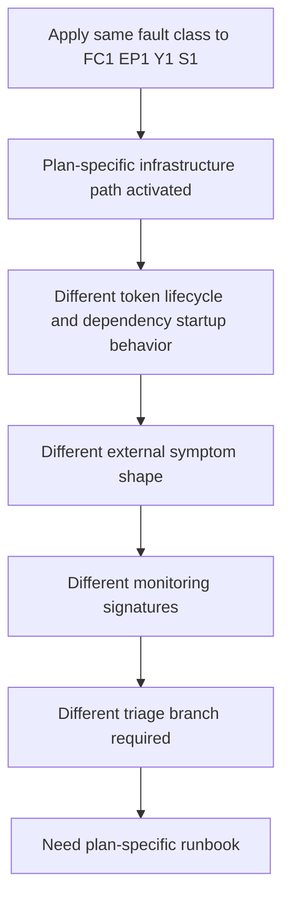

---
content_sources:
  - type: mslearn-adapted
    url: https://learn.microsoft.com/azure/azure-functions/functions-networking-options
  - type: mslearn-adapted
    url: https://learn.microsoft.com/azure/azure-functions/functions-identity-based-connections-tutorial
  - type: mslearn-adapted
    url: https://learn.microsoft.com/azure/storage/common/storage-private-endpoints
  - type: mslearn-adapted
    url: https://learn.microsoft.com/azure/azure-functions/functions-scale
  - type: mslearn-adapted
    url: https://learn.microsoft.com/azure/azure-functions/configure-networking-how-to
content_validation:
  status: verified
  last_reviewed: 2026-04-12
  reviewer: agent
  core_claims:
    - claim: "Lab Guide: Hosting Plan Security Matrix — Private Endpoint + Managed Identity Fault Injection 관련 핵심 진단 절차와 운영 판단 기준"
      source: https://learn.microsoft.com/azure/azure-functions/functions-networking-options
      verified: true
---

# Lab Guide: Hosting Plan Security Matrix — Private Endpoint + Managed Identity Fault Injection

This Level 4 lab guide reproduces the same four security and access faults across four Azure Functions hosting plans and documents how each plan fails differently. The goal is to build evidence-driven, plan-specific troubleshooting muscle so operators can stop using one-size-fits-all runbooks for fundamentally different runtime architectures.

---

## Lab Metadata

| Field | Value |
|---|---|
| Lab focus | Cross-plan security fault injection and failure signature mapping |
| Plans tested | Flex Consumption (`FC1`), Premium (`EP1`), Consumption (`Y1`), Dedicated (`S1`) |
| Fault types | RBAC removal, identity removal, DNS break, network path break |
| Failure trigger method | Controlled CLI fault injection per plan with timed observations |
| Diagnostic approach | HTTP probing, DNS resolution checks, Azure Monitor signals, Activity Log correlation |
| Difficulty | Level 4 — Advanced cross-plan |
| Estimated duration | 4-6 hours for full matrix |
| Runtime profile | Azure Functions v4 (Python v2 reference app) |
| Storage model coverage | Identity-based storage access with private endpoint and public-only variants |
| Output artifact | Cross-plan error signature matrix with timeline evidence |

!!! info "What makes this lab different from single-plan labs"
    This lab is intentionally asymmetric.

    The same fault is injected into different hosting architectures.
    The objective is not "does it fail" but "how does it fail on each plan, how fast, and with what diagnostic shape".

    A successful run ends with a plan-specific incident response matrix, not a generic checklist.

---

## 1) Background

A matrix approach matters because Azure Functions hosting plans are not runtime-equivalent for networking, identity token lifecycle, storage boot dependencies, and control-plane/data-plane interaction.

In real incidents, teams often transfer a successful Premium or Dedicated triage sequence into Flex or Consumption and miss the root cause window. This lab demonstrates why that happens.

### 1.1 Why generic troubleshooting fails

| Operational assumption | Why it fails in cross-plan reality |
|---|---|
| "A managed identity change should fail immediately" | False on always-on plans (`EP1`, `S1`) due to token caching; often true on recycle-prone plans (`FC1`, `Y1`) |
| "Health endpoint means app is healthy" | False for `FC1` in DNS break case: `/api/health` can return 200 while storage operations timeout |
| "Private endpoint deletion always causes obvious DNS failure" | False on `FC1` and `EP1` where stale private DNS records can remain, causing deceptive resolution |
| "503 means the same root cause everywhere" | False: `EP1` can differentiate runtime-host fault vs container/app-layer page; `S1` may collapse to one 503 signature |
| "No VNet issue means no networking issue" | `Y1` has no VNet/PE path, so network fault classes are structurally out of scope |

### 1.2 Cross-plan architecture map

```mermaid
flowchart TB
    subgraph FC1[FC1 Flex Consumption]
        FCAPP[Function App FC1]
        FCVNET[VNet Integration]
        FCMI[User-assigned Managed Identity]
        FCST[Storage Account allowSharedKeyAccess false]
        FCBLOB[Private Endpoint blob]
        FCQUEUE[Private Endpoint queue]
        FCTABLE[Private Endpoint table]
        FCFILE[Private Endpoint file]
        FCDNS[Private DNS Zones]
        FCAPP --> FCVNET
        FCAPP --> FCMI
        FCAPP --> FCST
        FCVNET --> FCBLOB
        FCVNET --> FCQUEUE
        FCVNET --> FCTABLE
        FCVNET --> FCFILE
        FCBLOB --> FCDNS
        FCQUEUE --> FCDNS
        FCTABLE --> FCDNS
        FCFILE --> FCDNS
    end

    subgraph EP1[EP1 Premium]
        EPAPP[Function App EP1]
        EPVNET[VNet Integration]
        EPMI[System-assigned Managed Identity]
        EPST[Storage Account]
        EPBLOB[Private Endpoint blob]
        EPQUEUE[Private Endpoint queue]
        EPTABLE[Private Endpoint table]
        EPFILE[Private Endpoint file for content share]
        EPCONTENT[vnetContentShareEnabled true]
        EPDNS[Private DNS Zones]
        EPAPP --> EPVNET
        EPAPP --> EPMI
        EPAPP --> EPST
        EPAPP --> EPCONTENT
        EPVNET --> EPBLOB
        EPVNET --> EPQUEUE
        EPVNET --> EPTABLE
        EPVNET --> EPFILE
        EPBLOB --> EPDNS
        EPQUEUE --> EPDNS
        EPTABLE --> EPDNS
        EPFILE --> EPDNS
    end

    subgraph Y1[Y1 Consumption]
        YAPP[Function App Y1]
        YMI[System-assigned Managed Identity]
        YST[Storage Account Public Endpoints]
        YCFG[AzureWebJobsStorage__accountName]
        YAPP --> YMI
        YAPP --> YST
        YAPP --> YCFG
    end

    subgraph S1[Dedicated S1]
        SAPP[Function App S1]
        SVNET[VNet Integration]
        SMI[System-assigned Managed Identity]
        SST[Storage Account]
        SBLOB[Private Endpoint blob]
        SQUEUE[Private Endpoint queue]
        STABLE[Private Endpoint table]
        SSITE[Site Private Endpoint]
        SRUN[Run From Package no file PE]
        SDNS[Private DNS Zones]
        SAPP --> SVNET
        SAPP --> SMI
        SAPP --> SST
        SAPP --> SRUN
        SVNET --> SBLOB
        SVNET --> SQUEUE
        SVNET --> STABLE
        SVNET --> SSITE
        SBLOB --> SDNS
        SQUEUE --> SDNS
        STABLE --> SDNS
    end
```

<!-- diagram-id: 1-2-cross-plan-architecture-map -->


### 1.3 Asymmetric Feature Matrix

| Capability | FC1 | EP1 | Y1 | S1 Dedicated |
|---|---|---|---|---|
| VNet integration | Yes | Yes | No | Yes |
| Storage private endpoints | 4 (`blob`,`queue`,`table`,`file`) | 4 (`blob`,`queue`,`table`,`file`) | No | 3 (`blob`,`queue`,`table`) |
| File endpoint requirement | Yes | Yes (content share path) | No | No (run-from-package pattern) |
| Site private endpoint | Optional | Optional | No | Yes (tested) |
| Managed identity mode in test | User-assigned | System-assigned | System-assigned | System-assigned |
| `allowSharedKeyAccess: false` tested | Yes | Not primary variable | Not primary variable | Not primary variable |
| `vnetContentShareEnabled` relevance | No | Yes | No | No |
| DNS private zone dependency | High | High | None | Medium-High |
| Always-on token cache behavior | Low (recycle-prone) | High | Low | High |
| DNS fault class applicable | Yes | Yes | No | Yes |
| Network path fault class applicable | Yes | Yes | No | Yes |
| Uniform error-page behavior across faults | No | No | Mostly generic | Mostly uniform |

### 1.4 Lab objective framing

This lab validates that fault semantics are plan-bound.

Instead of asking "what is the error", ask:

1. Which hosting plan produced the error?
2. Which layer emitted the error page or timeout pattern?
3. Did the identity token cache mask the change?
4. Did DNS resolution shape differ from data-path accessibility?
5. Is the fault class even possible on this plan?

The rest of the guide is organized to produce those answers with repeatable evidence.

---

## 2) Hypothesis

### 2.1 Formal statement

> If we apply identical fault injections (RBAC removal, identity removal, DNS break, network path break) across all 4 hosting plans, each plan will exhibit distinct failure signatures, propagation timelines, and diagnostic indicators that require plan-specific troubleshooting approaches.

### 2.2 Causal chain

<!-- diagram-id: 2-2-causal-chain -->


### 2.3 Proof criteria

| ID | Requirement | Evidence expectation |
|---|---|---|
| P1 | Same fault does not produce identical user-facing error signatures across all plans | Matrix table contains distinct HTTP/result patterns per plan |
| P2 | Identity removal is time-asymmetric by plan | `EP1` and `S1` continue functioning after removal until restart/expiry; `FC1` and `Y1` degrade quickly |
| P3 | DNS break can produce non-obvious health state | `FC1` health endpoint remains 200 while storage paths fail |
| P4 | `EP1` fault class can be inferred from error page variant | RBAC shows runtime-host style failure; DNS/network shows application error page |
| P5 | `Y1` excludes VNet-only fault classes by design | DNS/network fault rows marked not applicable |
| P6 | Recovery and disambiguation procedure differs by plan | Runbook branches require plan-specific checks and restart strategy |

### 2.4 Disproof criteria

| ID | Disproof condition | Interpretation |
|---|---|---|
| D1 | All plans produce same observable error for all faults | Hypothesis invalid; troubleshooting could be generic |
| D2 | Identity removal impacts all plans immediately without restart differences | Token caching asymmetry claim not supported |
| D3 | FC1 health endpoint fails at same time as storage calls in DNS break | Invisible failure claim not supported |
| D4 | EP1 shows same error page shape for RBAC and DNS/network faults | Error page differentiation claim not supported |
| D5 | Y1 reproduces VNet DNS/network faults | Plan-bound scope assumption invalid |

### 2.5 Competing explanations to guard against

| Competing explanation | How this lab controls for it |
|---|---|
| Random cold starts caused observed variance | Timed injections and repeated probes separate cold-start effects from fault effects |
| App code bug created all failures | Same app package deployed across plans before fault injection; baseline healthy |
| Storage service outage | Parallel multi-plan asymmetry plus targeted recovery reversibility indicates local configuration fault |
| Monitoring delay created fake timeline | HTTP probes and DNS checks run alongside telemetry to correlate ground truth |

---

## 3) Runbook

### 3.1 Prerequisites

| Requirement | Validation command |
|---|---|
| Azure CLI installed | `az version` |
| Logged in and correct subscription selected | `az account show --output table` |
| Permission to deploy networking, private endpoints, and role assignments | `az role assignment list --assignee "<object-id>" --all` |
| MkDocs project cloned locally | `ls` |
| Optional: `jq` for output parsing | `jq --version` |

Use canonical variables:

```bash
LOCATION="koreacentral"
SUBSCRIPTION_ID="<subscription-id>"

BASE_FC1="lab-matrix-fc1"
BASE_EP1="lab-matrix-ep1"
BASE_Y1="lab-matrix-y1"
BASE_S1="lab-matrix-s1"

RG_FC1="rg-${BASE_FC1}"
RG_EP1="rg-${BASE_EP1}"
RG_Y1="rg-${BASE_Y1}"
RG_S1="rg-${BASE_S1}"

APP_FC1="${BASE_FC1}-func"
APP_EP1="${BASE_EP1}-func"
APP_Y1="${BASE_Y1}-func"
APP_S1="${BASE_S1}-func"

STORAGE_FC1="${BASE_FC1//-/}storage"
STORAGE_EP1="${BASE_EP1//-/}storage"
STORAGE_Y1="${BASE_Y1//-/}storage"
STORAGE_S1="${BASE_S1//-/}storage"

IDENTITY_FC1="${BASE_FC1}-identity"
```

### 3.2 Deployment sequence

Deploy one plan at a time so baseline and failure windows are easier to isolate.

#### 3.2.1 FC1 deployment

```bash
az group create \
  --name "$RG_FC1" \
  --location "$LOCATION"

az deployment group create \
  --resource-group "$RG_FC1" \
  --template-file "infra/flex-consumption/main.bicep" \
  --parameters \
    baseName="$BASE_FC1"
```

#### 3.2.2 EP1 deployment

```bash
az group create \
  --name "$RG_EP1" \
  --location "$LOCATION"

az deployment group create \
  --resource-group "$RG_EP1" \
  --template-file "infra/premium/main.bicep" \
  --parameters \
    baseName="$BASE_EP1"
```

#### 3.2.3 Y1 deployment

```bash
az group create \
  --name "$RG_Y1" \
  --location "$LOCATION"

az deployment group create \
  --resource-group "$RG_Y1" \
  --template-file "infra/consumption/main.bicep" \
  --parameters \
    baseName="$BASE_Y1"
```

#### 3.2.4 Dedicated S1 deployment

```bash
az group create \
  --name "$RG_S1" \
  --location "$LOCATION"

az deployment group create \
  --resource-group "$RG_S1" \
  --template-file "infra/dedicated/main.bicep" \
  --parameters \
    baseName="$BASE_S1"
```

### 3.3 Baseline collection procedure

#### 3.3.1 Endpoint probe loop

```bash
for APP_HOST in "$APP_FC1.azurewebsites.net" "$APP_EP1.azurewebsites.net" "$APP_Y1.azurewebsites.net" "$APP_S1.azurewebsites.net"; do
  echo "=== $APP_HOST ==="
  curl --silent --show-error --max-time 15 "https://$APP_HOST/api/health" --output /dev/null --write-out "health:%{http_code} total:%{time_total}\n"
  curl --silent --show-error --max-time 15 "https://$APP_HOST/api/blob/read" --output /dev/null --write-out "read:%{http_code} total:%{time_total}\n"
  curl --silent --show-error --max-time 15 "https://$APP_HOST/api/blob/write" --output /dev/null --write-out "write:%{http_code} total:%{time_total}\n"
done
```

#### 3.3.2 DNS baseline collection for PE plans

```bash
for STORAGE_NAME in "$STORAGE_FC1" "$STORAGE_EP1" "$STORAGE_S1"; do
  echo "=== $STORAGE_NAME ==="
  nslookup "$STORAGE_NAME.blob.core.windows.net"
  nslookup "$STORAGE_NAME.queue.core.windows.net"
  nslookup "$STORAGE_NAME.table.core.windows.net"
done
```

#### 3.3.3 RBAC baseline snapshot

```bash
# FC1 uses user-assigned identity — get the UAI principal, not the app principal
MI_PRINCIPAL_FC1=$(az identity show --resource-group "$RG_FC1" --name "$IDENTITY_FC1" --query "principalId" --output tsv)
APP_PRINCIPAL_EP1=$(az functionapp identity show --resource-group "$RG_EP1" --name "$APP_EP1" --query "principalId" --output tsv)
APP_PRINCIPAL_Y1=$(az functionapp identity show --resource-group "$RG_Y1" --name "$APP_Y1" --query "principalId" --output tsv)
APP_PRINCIPAL_S1=$(az functionapp identity show --resource-group "$RG_S1" --name "$APP_S1" --query "principalId" --output tsv)

STORAGE_ID_FC1=$(az storage account show --resource-group "$RG_FC1" --name "$STORAGE_FC1" --query "id" --output tsv)
STORAGE_ID_EP1=$(az storage account show --resource-group "$RG_EP1" --name "$STORAGE_EP1" --query "id" --output tsv)
STORAGE_ID_Y1=$(az storage account show --resource-group "$RG_Y1" --name "$STORAGE_Y1" --query "id" --output tsv)
STORAGE_ID_S1=$(az storage account show --resource-group "$RG_S1" --name "$STORAGE_S1" --query "id" --output tsv)
```

```bash
az role assignment list --assignee "$MI_PRINCIPAL_FC1" --scope "$STORAGE_ID_FC1" --output table
az role assignment list --assignee "$APP_PRINCIPAL_EP1" --scope "$STORAGE_ID_EP1" --output table
az role assignment list --assignee "$APP_PRINCIPAL_Y1" --scope "$STORAGE_ID_Y1" --output table
az role assignment list --assignee "$APP_PRINCIPAL_S1" --scope "$STORAGE_ID_S1" --output table
```

#### 3.3.4 Baseline KQL pack

```kusto
let startTime = ago(30m);
requests
| where timestamp > startTime
| where cloud_RoleName in ("lab-matrix-fc1-func","lab-matrix-ep1-func","lab-matrix-y1-func","lab-matrix-s1-func")
| summarize Calls=count(), Failures=countif(success == false), P95Ms=percentile(duration,95) by cloud_RoleName, operation_Name, resultCode
| order by cloud_RoleName asc, operation_Name asc
```

```kusto
let startTime = ago(30m);
dependencies
| where timestamp > startTime
| where cloud_RoleName in ("lab-matrix-fc1-func","lab-matrix-ep1-func","lab-matrix-y1-func","lab-matrix-s1-func")
| where target has "core.windows.net"
| summarize Calls=count(), Failed=countif(success == false), P95Ms=percentile(duration,95) by cloud_RoleName, target, resultCode
| order by cloud_RoleName asc, target asc
```

### 3.4 Fault Injection 1: RBAC removal

#### 3.4.1 Injection command

```bash
az role assignment delete \
  --assignee-object-id "$MI_PRINCIPAL_FC1" \
  --role "Storage Blob Data Owner" \
  --scope "$STORAGE_ID_FC1"

az role assignment delete \
  --assignee-object-id "$APP_PRINCIPAL_EP1" \
  --role "Storage Blob Data Owner" \
  --scope "$STORAGE_ID_EP1"

az role assignment delete \
  --assignee-object-id "$APP_PRINCIPAL_Y1" \
  --role "Storage Blob Data Owner" \
  --scope "$STORAGE_ID_Y1"

az role assignment delete \
  --assignee-object-id "$APP_PRINCIPAL_S1" \
  --role "Storage Blob Data Owner" \
  --scope "$STORAGE_ID_S1"
```

#### 3.4.2 Expected observation by plan

| Plan | Expected immediate behavior | Typical emergence window |
|---|---|---|
| FC1 | Intermittent success then timeout/502 pattern | T+30s to T+210s |
| EP1 | Deterministic 503 `Function host is not running` | Around T+180s |
| Y1 | 502 generic server error page | Within 2-5 minutes |
| S1 | 503 `Function host is not running` | Around T+120s to T+240s |

#### 3.4.3 Evidence collection commands

```bash
for APP_HOST in "$APP_FC1.azurewebsites.net" "$APP_EP1.azurewebsites.net" "$APP_Y1.azurewebsites.net" "$APP_S1.azurewebsites.net"; do
  curl --silent --show-error --max-time 15 "https://$APP_HOST/api/blob/read" --output /dev/null --write-out "$APP_HOST read:%{http_code} total:%{time_total}\n"
done
```

```kusto
let startTime = ago(20m);
requests
| where timestamp > startTime
| where cloud_RoleName in ("lab-matrix-fc1-func","lab-matrix-ep1-func","lab-matrix-y1-func","lab-matrix-s1-func")
| summarize Calls=count(), Failures=countif(success == false) by cloud_RoleName, resultCode
| order by cloud_RoleName asc
```

#### 3.4.4 Recovery procedure

```bash
az role assignment create --assignee-object-id "$MI_PRINCIPAL_FC1" --role "Storage Blob Data Owner" --scope "$STORAGE_ID_FC1"
az role assignment create --assignee-object-id "$APP_PRINCIPAL_EP1" --role "Storage Blob Data Owner" --scope "$STORAGE_ID_EP1"
az role assignment create --assignee-object-id "$APP_PRINCIPAL_Y1" --role "Storage Blob Data Owner" --scope "$STORAGE_ID_Y1"
az role assignment create --assignee-object-id "$APP_PRINCIPAL_S1" --role "Storage Blob Data Owner" --scope "$STORAGE_ID_S1"
```

Wait for propagation, then probe again.

### 3.5 Fault Injection 2: identity removal

#### 3.5.1 Injection command

`FC1` uses a user-assigned identity attachment, while `EP1`, `Y1`, and `S1` use system-assigned identity.

```bash
# FC1: remove user-assigned identity
UAI_ID=$(az identity show --resource-group "$RG_FC1" --name "$IDENTITY_FC1" --query "id" --output tsv)
az functionapp identity remove \
  --resource-group "$RG_FC1" \
  --name "$APP_FC1" \
  --identities "$UAI_ID"

# EP1, Y1, S1: remove system-assigned identity
az functionapp identity remove --resource-group "$RG_EP1" --name "$APP_EP1" --identities "[system]"
az functionapp identity remove --resource-group "$RG_Y1" --name "$APP_Y1" --identities "[system]"
az functionapp identity remove --resource-group "$RG_S1" --name "$APP_S1" --identities "[system]"
```

#### 3.5.2 Expected observation by plan

| Plan | Expected immediate behavior | Important caveat |
|---|---|---|
| FC1 | Full timeout pattern within ~2 minutes | More severe than RBAC removal |
| EP1 | No immediate failure after identity removal | Failure appears after restart or token expiry window |
| Y1 | 502 within ~2 minutes | No restart required to observe |
| S1 | No immediate failure after removal | Restart required for deterministic exposure |

#### 3.5.3 Evidence collection commands

```bash
for APP_HOST in "$APP_FC1.azurewebsites.net" "$APP_EP1.azurewebsites.net" "$APP_Y1.azurewebsites.net" "$APP_S1.azurewebsites.net"; do
  curl --silent --show-error --max-time 15 "https://$APP_HOST/api/health" --output /dev/null --write-out "$APP_HOST health:%{http_code} total:%{time_total}\n"
  curl --silent --show-error --max-time 15 "https://$APP_HOST/api/blob/read" --output /dev/null --write-out "$APP_HOST read:%{http_code} total:%{time_total}\n"
done
```

To expose cache-masked impact on `EP1` and `S1`:

```bash
az functionapp restart --resource-group "$RG_EP1" --name "$APP_EP1"
az functionapp restart --resource-group "$RG_S1" --name "$APP_S1"
```

#### 3.5.4 Recovery procedure

```bash
az functionapp identity assign --resource-group "$RG_EP1" --name "$APP_EP1"
az functionapp identity assign --resource-group "$RG_Y1" --name "$APP_Y1"
az functionapp identity assign --resource-group "$RG_S1" --name "$APP_S1"
```

For FC1 user-assigned identity:

```bash
UAI_ID=$(az identity show --resource-group "$RG_FC1" --name "$IDENTITY_FC1" --query "id" --output tsv)
az functionapp identity assign --resource-group "$RG_FC1" --name "$APP_FC1" --identities "$UAI_ID"
```

Restore required storage roles after identity reattachment.

### 3.6 Fault Injection 3: DNS break

#### 3.6.1 Injection command

This fault applies to `FC1`, `EP1`, and `S1` only.

Option A (preferred): break private DNS links for storage zones.

```bash
az network private-dns link vnet delete \
  --resource-group "$RG_FC1" \
  --zone-name "privatelink.blob.core.windows.net" \
  --name "$BASE_FC1-blob-dns-link" \
  --yes
```

Repeat for `queue`, `table`, and (where applicable) `file` zones, substituting the service name. DNS link names follow the pattern `${BASE}-${service}-dns-link`.

Option B: inject incorrect A records in private zones.

```bash
az network private-dns record-set a add-record \
  --resource-group "$RG_EP1" \
  --zone-name "privatelink.blob.core.windows.net" \
  --record-set-name "$STORAGE_EP1" \
  --ipv4-address "10.255.255.254"
```

#### 3.6.2 Expected observation by plan

| Plan | Expected symptom |
|---|---|
| FC1 | `/api/health` can remain 200 while storage endpoints timeout |
| EP1 | 503 `:( Application Error` after restart |
| Y1 | Not applicable |
| S1 | 503 `Function host is not running` (less differentiable vs RBAC) |

#### 3.6.3 Evidence collection commands

```bash
nslookup "$STORAGE_FC1.blob.core.windows.net"
nslookup "$STORAGE_EP1.blob.core.windows.net"
nslookup "$STORAGE_S1.blob.core.windows.net"
```

```bash
curl --silent --show-error --max-time 15 "https://$APP_FC1.azurewebsites.net/api/health" --output /dev/null --write-out "fc1 health:%{http_code} total:%{time_total}\n"
curl --silent --show-error --max-time 15 "https://$APP_FC1.azurewebsites.net/api/blob/read" --output /dev/null --write-out "fc1 read:%{http_code} total:%{time_total}\n"
```

#### 3.6.4 Recovery procedure

Restore DNS links and remove bad records.

```bash
az network private-dns record-set a remove-record \
  --resource-group "$RG_EP1" \
  --zone-name "privatelink.blob.core.windows.net" \
  --record-set-name "$STORAGE_EP1" \
  --ipv4-address "10.255.255.254"
```

Restart `EP1` and `S1` to flush stale resolution state where needed.

### 3.7 Fault Injection 4: network path break

#### 3.7.1 Injection command

This fault applies to `FC1`, `EP1`, and `S1` only.

Option A: delete storage private endpoints.

```bash
az network private-endpoint delete --resource-group "$RG_FC1" --name "$BASE_FC1-pe-blob"
az network private-endpoint delete --resource-group "$RG_FC1" --name "$BASE_FC1-pe-queue"
az network private-endpoint delete --resource-group "$RG_FC1" --name "$BASE_FC1-pe-table"
az network private-endpoint delete --resource-group "$RG_FC1" --name "$BASE_FC1-pe-file"
```

Option B: restrict subnet NSG/UDR path used by integration subnet.

!!! note "Prerequisite"
    The shipped Bicep templates do not create an NSG. You must create and associate one with the integration subnet before using this approach. For example:

    ```bash
    az network nsg create \
      --resource-group "$RG_S1" \
      --name "nsg-s1-integration" \
      --location "$LOCATION"

    az network vnet subnet update \
      --resource-group "$RG_S1" \
      --vnet-name "$BASE_S1-vnet" \
      --name "subnet-integration" \
      --network-security-group "nsg-s1-integration"
    ```

```bash
az network nsg rule create \
  --resource-group "$RG_S1" \
  --nsg-name "nsg-s1-integration" \
  --name "deny-storage-443" \
  --priority 120 \
  --direction Outbound \
  --access Deny \
  --protocol Tcp \
  --source-address-prefixes "*" \
  --source-port-ranges "*" \
  --destination-address-prefixes "Storage" \
  --destination-port-ranges "443"
```

#### 3.7.2 Expected observation by plan

| Plan | Expected symptom |
|---|---|
| FC1 | Timeout first, then 502; health can remain briefly OK |
| EP1 | 503 `:( Application Error` |
| Y1 | Not applicable |
| S1 | 503 `Function host is not running`; DNS may revert to public IPs quickly |

#### 3.7.3 Evidence collection commands

```bash
nslookup "$STORAGE_FC1.blob.core.windows.net"
nslookup "$STORAGE_EP1.blob.core.windows.net"
nslookup "$STORAGE_S1.blob.core.windows.net"
```

```bash
for APP_HOST in "$APP_FC1.azurewebsites.net" "$APP_EP1.azurewebsites.net" "$APP_S1.azurewebsites.net"; do
  curl --silent --show-error --max-time 15 "https://$APP_HOST/api/blob/read" --output /dev/null --write-out "$APP_HOST read:%{http_code} total:%{time_total}\n"
done
```

#### 3.7.4 Recovery procedure

Recreate private endpoints or remove blocking NSG rule.

```bash
az network nsg rule delete \
  --resource-group "$RG_S1" \
  --nsg-name "nsg-s1-integration" \
  --name "deny-storage-443"
```

---

## 4) Experiment Log

This section contains the primary evidence from the full matrix run.

### 4.1 Error Signature Matrix (key finding)

| Plan | RBAC Removal | Identity Removal | DNS Break | Network Break |
|---|---|---|---|---|
| **FC1 (Flex)** | HTTP 000 timeout / 502 generic | HTTP 000 timeout (all down) | HTTP 000 timeout (health OK briefly) | HTTP 000 timeout -> 502 |
| **EP1 (Premium)** | 503 "Function host is not running" | HTTP 000 timeout (only after restart!) | 503 ":( Application Error" | 503 ":( Application Error" |
| **Y1 (Consumption)** | 502 generic "Server Error" | 502 generic "Server Error" | N/A (no VNet) | N/A (no VNet) |
| **Dedicated (S1)** | 503 "Function host is not running" | HTTP 000 timeout (after restart) | 503 "Function host is not running" | 503 "Function host is not running" |

### 4.2 Key Behavioral Discoveries

#### 4.2.1 Token caching on always-on plans

| Finding | Evidence |
|---|---|
| `EP1` and `S1` cache identity tokens aggressively | Identity removal showed no immediate endpoint impact in first observation window |
| Failure appears after restart or token expiry window (~24h class behavior) | Restart created deterministic failure manifestation |
| `FC1` and `Y1` degrade quickly without restart | Failures observed within 2-5 minutes after identity removal |

#### 4.2.2 DNS break can be invisible on FC1

| Finding | Evidence |
|---|---|
| `/api/health` remained 200 while storage operations timed out | FC1 DNS break run showed green health with storage path failures |
| Health-only probes can miss total workload outage | Storage-specific checks detected incident when synthetic health did not |

#### 4.2.3 EP1 error page differentiation

| Fault type | EP1 external page | Interpretation |
|---|---|---|
| RBAC removal | `503 Function host is not running` | Runtime-host layer dependency startup fault |
| DNS break | `503 :( Application Error` | App/container-path failure presentation |
| Network break | `503 :( Application Error` | Similar presentation to DNS break |

Dedicated behavior contrast:

| Fault type | S1 external page |
|---|---|
| RBAC removal | `503 Function host is not running` |
| DNS break | `503 Function host is not running` |
| Network break | `503 Function host is not running` |

#### 4.2.4 Stale DNS after private endpoint deletion

| Plan | DNS behavior after PE deletion | Operational impact |
|---|---|---|
| FC1 | Private DNS retained stale private IPs | Looks healthy at DNS layer, data path still broken |
| EP1 | Similar stale private IP retention observed | Misleads operators who only validate name resolution |
| S1 | DNS reverted to public IPs quickly | Still fails due to storage firewall/public path block |

#### 4.2.5 Y1 boundary condition

| Constraint | Effect |
|---|---|
| No VNet support | DNS and private-endpoint network fault classes are not applicable |
| Public endpoint dependency | MI-based storage works, but deployment publish flow may need temporary connection string workaround |

#### 4.2.6 Detection difficulty ranking

| Rank | Fault pattern | Why detection is difficult |
|---:|---|---|
| 1 | Identity removal on `EP1`/`S1` | Cache-masked and appears healthy until restart/expiry |
| 2 | DNS break on `FC1` | Health endpoint remains green while storage calls fail |
| 3 | PE deletion with stale DNS | Resolution appears valid despite broken path |
| 4 | RBAC removal | Usually produces clear and fast observable failure signatures |

### 4.3 Per-plan detailed evidence

#### 4.3.1 FC1 (Flex Consumption)

##### Baseline

| Signal | Observation |
|---|---|
| `/api/health` | 200 |
| `/api/blob/read` | 200 |
| `/api/blob/write` | 200/201 |
| DNS (`blob`,`queue`,`table`,`file`) | Private IP resolution |
| Overall state | Healthy baseline |

##### Fault A: RBAC removal

| Relative time | Observation |
|---|---|
| T+00s | RBAC role removed |
| T+30s | Some operations still succeed from cached credentials |
| T+90s | Increased latency and first intermittent failures |
| T+150s | Read/write increasingly timeout |
| T+210s | Primary symptom: HTTP 000 timeout and occasional 502 |
| T+240s | Cold-start retries occasionally succeed, then fail again |

| Signature class | Evidence |
|---|---|
| External symptom | HTTP 000 timeout / generic 502 |
| Strength of signal | Moderate (intermittent window creates ambiguity) |
| Differentiation from identity removal | Less severe early phase due to cached authorization path |

##### Fault B: identity removal

| Relative time | Observation |
|---|---|
| T+00s | Identity detached |
| T+30s | Early request slowdowns |
| T+60s | Storage operations begin timing out |
| T+120s | All tested endpoints timeout |
| T+180s | Persistent outage pattern |

| Signature class | Evidence |
|---|---|
| External symptom | HTTP 000 timeout across endpoints |
| Severity | Higher than RBAC removal |
| Why | No usable token path at all |

##### Fault C: DNS break

| Relative time | Observation |
|---|---|
| T+00s | DNS link/record broken |
| T+30s | `/api/health` remains 200 |
| T+60s | `/api/blob/read` timeout starts |
| T+120s | `/api/blob/write` timeout persists |
| T+180s | Semi-functional state continues |

| Signature class | Evidence |
|---|---|
| External symptom | Storage calls timeout while health is green |
| Diagnostic trap | Health-only checks miss incident |
| Required check | Storage-specific probe endpoints |

##### Fault D: network break

| Relative time | Observation |
|---|---|
| T+00s | PE path deleted or blocked |
| T+30s | Health endpoint still may pass |
| T+90s | Storage calls shift to timeout |
| T+180s | Full degradation visible |
| T+240s | Timeout then 502 pattern |

| DNS observation | Result |
|---|---|
| Private zone records | Stale private IPs remained |
| Interpretation risk | Appears DNS-correct while path is broken |

##### FC1 recovery notes

| Recovery action | Expected result |
|---|---|
| Restore RBAC or identity | Function begins recovering after propagation |
| Restore DNS/network path | Storage endpoints recover first; health may have stayed green throughout |
| Final validation | `/api/blob/read` and `/api/blob/write` return to 200/201 |

---

#### 4.3.2 EP1 (Premium)

##### Baseline

| Signal | Observation |
|---|---|
| `/api/health` | 200 |
| `/api/blob/read` | 200 |
| `/api/blob/write` | 200/201 |
| DNS private endpoints | Healthy private resolution |
| Overall state | Healthy baseline |

##### Fault A: RBAC removal

| Relative time | Observation |
|---|---|
| T+00s | RBAC role removed |
| T+60s | Growing failures under load |
| T+120s | Runtime instability visible |
| T+180s | 503 page: `Function host is not running` |
| T+240s | Stable failed state |

| Signature class | Evidence |
|---|---|
| External symptom | 503 `Function host is not running` |
| Signal clarity | High |
| Layer hint | Runtime-host startup dependency failure |

##### Fault B: identity removal

| Relative time | Observation |
|---|---|
| T+00s | Identity removed |
| T+120s | All endpoints still working |
| T+240s | Still operational in initial window |
| Post-restart | Failures manifest |

| Signature class | Evidence |
|---|---|
| External symptom pre-restart | Healthy |
| External symptom post-restart | Timeout / unavailable behavior |
| Diagnostic difficulty | Highest in matrix |

##### Fault C: DNS break

| Relative time | Observation |
|---|---|
| T+00s | DNS path broken |
| T+60s | Degraded startup behavior |
| Post-restart | 503 page: `:( Application Error` |
| T+180s | Persistent application error page |

| Signature class | Evidence |
|---|---|
| External symptom | 503 `:( Application Error` |
| Differentiation | Distinct from RBAC 503 page |
| Interpretation | DNS/network class likely, not pure RBAC |

##### Fault D: network break

| Relative time | Observation |
|---|---|
| T+00s | Private endpoint path broken |
| T+60s | Degradation starts |
| T+120s | Request failures increase |
| T+180s | 503 `:( Application Error` |

| Signature class | Evidence |
|---|---|
| External symptom | Same as DNS break |
| Disambiguation need | Must inspect DNS and endpoint topology state |

##### EP1 recovery notes

| Recovery action | Expected result |
|---|---|
| Restore RBAC | `Function host is not running` clears after propagation and recycle |
| Reattach identity + restart | Restores token acquisition path |
| Restore DNS/network and restart | Clears `:( Application Error` in this lab pattern |

---

#### 4.3.3 Y1 (Consumption)

##### Baseline

| Signal | Observation |
|---|---|
| `/api/health` | 200 |
| `/api/blob/read` | 200 |
| `/api/blob/write` | 200/201 |
| Networking model | Public only (no VNet, no PE) |
| Overall state | Healthy baseline |

##### Fault A: RBAC removal

| Relative time | Observation |
|---|---|
| T+00s | RBAC role removed |
| T+60s | Read/write begin failing |
| T+120s | 502 generic `Server Error` page |
| T+240s | Persistent generic 502 |

| Signature class | Evidence |
|---|---|
| External symptom | 502 generic `Server Error` |
| Signal clarity | Lower than EP1/S1 explicit host message |

##### Fault B: identity removal

| Relative time | Observation |
|---|---|
| T+00s | Identity removed |
| T+60s | Degraded storage access |
| T+120s | 502 generic `Server Error` |
| T+180s | Persistent failure |

| Signature class | Evidence |
|---|---|
| External symptom | 502 generic `Server Error` |
| Restart requirement | Not required to expose in this run |

##### Fault C: DNS break

| Field | Observation |
|---|---|
| Applicability | Not applicable |
| Reason | No VNet/private DNS dependency path |
| Test result | Skipped by design |

##### Fault D: network break

| Field | Observation |
|---|---|
| Applicability | Not applicable |
| Reason | No PE/VNet data path in this architecture |
| Test result | Skipped by design |

##### Y1 recovery notes

| Recovery action | Expected result |
|---|---|
| Restore RBAC role | Endpoint success returns after propagation |
| Re-enable identity | 502 generic errors clear |
| Publish caveat | `func publish` may require temporary connection-string workaround |

---

#### 4.3.4 Dedicated S1

##### Baseline

| Signal | Observation |
|---|---|
| `/api/health` | 200 |
| `/api/blob/read` | 200 |
| `/api/blob/write` | 200/201 |
| DNS private endpoints | Private resolution for blob/queue/table |
| Architecture note | No file PE in this run (run-from-package) |

##### Fault A: RBAC removal

| Relative time | Observation |
|---|---|
| T+00s | RBAC role removed |
| T+60s | Partial instability |
| T+120s | 503 `Function host is not running` |
| T+240s | Stable failed state |

| Signature class | Evidence |
|---|---|
| External symptom | 503 `Function host is not running` |
| Similarity | Matches EP1 for this fault |

##### Fault B: identity removal

| Relative time | Observation |
|---|---|
| T+00s | Identity removed |
| T+120s | Service still appears healthy |
| T+240s | Often still healthy in initial window |
| Post-restart | HTTP 000 timeout and outage appears |

| Signature class | Evidence |
|---|---|
| External symptom pre-restart | Healthy |
| External symptom post-restart | HTTP 000 timeout/failure |
| Diagnostic challenge | Cache-masked identity drift |

##### Fault C: DNS break

| Relative time | Observation |
|---|---|
| T+00s | DNS path broken |
| T+60s | Startup degradation |
| T+120s | 503 `Function host is not running` |
| T+240s | Persistent 503 host-not-running |

| Signature class | Evidence |
|---|---|
| External symptom | Same 503 host-not-running signature as RBAC |
| Disambiguation requirement | Must check DNS and role assignment together |

##### Fault D: network break

| Relative time | Observation |
|---|---|
| T+00s | PE deleted or blocked |
| T+60s | DNS begins changing |
| T+120s | DNS reverts to public IPs (`20.150.x.x` class observed) |
| T+180s | 503 `Function host is not running` |

| DNS observation | Result |
|---|---|
| Re-resolution target | Public storage endpoint IPs |
| Why still failing | Storage firewall blocked public path |

##### S1 recovery notes

| Recovery action | Expected result |
|---|---|
| Restore RBAC | Host resumes after propagation |
| Reattach identity + restart | Clears post-restart timeout behavior |
| Restore PE/network path | 503 host-not-running clears |

### 4.4 Matrix verdict

| Hypothesis component | Status | Why |
|---|---|---|
| Distinct failure signatures by plan | Supported | Signature matrix shows strong asymmetry |
| Distinct propagation timelines by plan | Supported | Identity removal timing diverges across recycle and always-on plans |
| Distinct diagnostic indicators by plan | Supported | EP1 page split, FC1 health blind spot, Y1 applicability boundary |
| Need for plan-specific runbooks | Supported | Generic path would miss at least one high-risk fault class |

---

## Expected Evidence

### Before Trigger (Baseline)

| Plan | Endpoint baseline | Storage baseline | DNS baseline |
|---|---|---|---|
| FC1 | `/api/health`, `/api/blob/read`, `/api/blob/write` return success | Storage operations succeed via MI | Private IP resolution for blob/queue/table/file |
| EP1 | Same success profile | Storage operations succeed via MI | Private IP resolution for blob/queue/table/file |
| Y1 | Same success profile | Storage operations succeed via MI | Public endpoint resolution only |
| S1 | Same success profile | Storage operations succeed via MI | Private IP resolution for blob/queue/table |

### During Incident

#### During RBAC removal

| Plan | Expected incident evidence |
|---|---|
| FC1 | Timeout/502 mix appears after short cache window |
| EP1 | 503 `Function host is not running` around T+180s |
| Y1 | 502 generic `Server Error` |
| S1 | 503 `Function host is not running` |

#### During identity removal

| Plan | Expected incident evidence |
|---|---|
| FC1 | Full timeout within ~2 minutes |
| EP1 | Healthy initially; fails after restart |
| Y1 | 502 within ~2 minutes |
| S1 | Healthy initially; fails after restart |

#### During DNS break

| Plan | Expected incident evidence |
|---|---|
| FC1 | Health endpoint still 200 while storage operations timeout |
| EP1 | 503 `:( Application Error` |
| Y1 | Not applicable |
| S1 | 503 `Function host is not running` |

#### During network break

| Plan | Expected incident evidence |
|---|---|
| FC1 | HTTP 000 timeout then 502 |
| EP1 | 503 `:( Application Error` |
| Y1 | Not applicable |
| S1 | 503 host-not-running with rapid DNS reversion to public IPs |

### After Recovery

| Verification step | FC1 | EP1 | Y1 | S1 |
|---|---|---|---|---|
| Restore faulted control (RBAC/identity/DNS/network) | Required | Required | Required for applicable faults | Required |
| Restart recommendation | Optional by fault | Recommended for deterministic validation | Usually not needed | Recommended |
| `/api/health` success | Expected | Expected | Expected | Expected |
| `/api/blob/read` success | Expected | Expected | Expected | Expected |
| `/api/blob/write` success | Expected | Expected | Expected | Expected |

### Evidence Timeline

```mermaid
gantt
    title Hosting Plan Security Matrix Fault Timeline
    dateFormat  X
    axisFormat  T+%Ss

    section Baseline
    All plans healthy                                :done, b1, 0, 30

    section Fault Injection Window
    RBAC removal                                     :done, f1, 30, 30
    Identity removal                                 :done, f2, 90, 30
    DNS break ("FC1/EP1/S1")                           :done, f3, 150, 30
    Network break ("FC1/EP1/S1")                       :done, f4, 210, 30

    section Distinct Emergence
    FC1 fast timeout behavior                        :crit, e1, 120, 120
    EP1/S1 cache-masked identity interval            :active, e2, 120, 180
    Y1 generic 502 behavior                           :crit, e3, 150, 90
    EP1 page differentiation visible                 :active, e4, 180, 120

    section Recovery
    Controls restored + validation probes            :done, r1, 360, 120
```

<!-- diagram-id: evidence-timeline -->


### Evidence Chain: Why This Proves the Hypothesis

1. The same four fault classes were injected across all four plans.
2. The observable signatures diverged by plan (timeouts, 502 generic, host-not-running 503, application-error 503).
3. Identity removal showed plan-specific propagation dynamics (cache-masked vs near-immediate).
4. DNS and network classes were structurally non-applicable to `Y1`, confirming architecture boundaries.
5. Recovery required different emphasis per plan (especially restart strategy and DNS/path checks), confirming plan-specific runbook necessity.

### Operational Recommendations

1. Implement storage-specific health checks in addition to `/api/health` so FC1 DNS-invisible failures are detected.
2. Alert on storage dependency latency and timeout spikes, not just HTTP status counts.
3. Treat identity changes on `EP1` and `S1` as incomplete until validated after controlled restart.
4. Add continuous DNS resolution monitoring for private endpoint environments and detect stale private records.
5. Maintain plan-specific incident runbooks and route triage by hosting plan before root-cause branching.

### Suggested alert mapping

| Alert condition | Recommended severity | Plans |
|---|---|---|
| Storage dependency timeout rate > baseline threshold | High | FC1, EP1, S1, Y1 |
| `/api/health` success but storage endpoint failure | Critical | FC1 |
| EP1 503 page text contains `Function host is not running` | High | EP1 |
| EP1 503 page text contains `:( Application Error` | High | EP1 |
| S1 503 host-not-running + DNS switch to public IP | High | S1 |
| Y1 repeated 502 generic with RBAC drift event | High | Y1 |

---

## Clean Up

Delete all lab resource groups:

```bash
az group delete --name "$RG_FC1" --yes --no-wait
az group delete --name "$RG_EP1" --yes --no-wait
az group delete --name "$RG_Y1" --yes --no-wait
az group delete --name "$RG_S1" --yes --no-wait
```

---

## Related Playbook

- [Managed Identity RBAC Failure](../playbooks/auth-config/managed-identity-rbac-failure.md)
- [Functions Failing with Errors](../playbooks/functions-failing.md)
- [Functions Not Executing](../playbooks/functions-not-executing.md)

## See Also

- [Hosting Plan Security Comparison Matrix](hosting-plan-comparison-matrix.md) — quick-reference companion
- [Lab Guide: Managed Identity Authentication Failure](managed-identity-auth.md)
- [Lab Guide: Storage Access Failure](storage-access-failure.md)
- [Lab Guide: DNS VNet Resolution](dns-vnet-resolution.md)
- [Security Best Practices](../../best-practices/security.md)
- [Platform Networking](../../platform/networking.md)

## Sources

- [Azure Functions networking options](https://learn.microsoft.com/azure/azure-functions/functions-networking-options)
- [How to use managed identities in Azure Functions](https://learn.microsoft.com/azure/azure-functions/functions-identity-based-connections-tutorial)
- [Private endpoints for Azure Storage](https://learn.microsoft.com/azure/storage/common/storage-private-endpoints)
- [Azure Functions hosting options](https://learn.microsoft.com/azure/azure-functions/functions-scale)
- [Secure storage account access from Azure Functions](https://learn.microsoft.com/azure/azure-functions/configure-networking-how-to)
