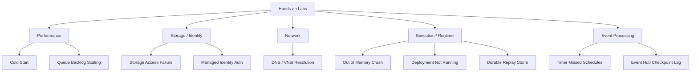

---
content_sources:
  - type: mslearn-adapted
    url: https://learn.microsoft.com/azure/azure-functions/functions-monitoring
  - type: mslearn-adapted
    url: https://learn.microsoft.com/azure/azure-functions/configure-monitoring
  - type: mslearn-adapted
    url: https://learn.microsoft.com/azure/azure-functions/functions-recover-from-failed-host
---

# Hands-on Labs

These labs let you practice incident response on reproducible Azure Functions failure scenarios.
Run labs in a non-production environment and treat them like live incidents: detect, triage, diagnose, fix, and verify.

<!-- diagram-id: hands-on-labs -->


## How Labs Work

Each lab includes:

1. **Lab infrastructure** — Bicep templates and app source in `labs/` directory
2. **Documentation page** — Step-by-step walkthrough with KQL queries and expected observations
3. **Expected evidence** — Baseline, during-incident, and after-recovery evidence to validate your investigation

## Available Labs

### Performance

| Lab | Symptom | Related Playbook |
|-----|---------|-----------------|
| [Cold Start](cold-start.md) | Elevated first-request latency after idle periods | [High Latency / Slow Responses](../playbooks/high-latency.md) |
| [Queue Backlog Scaling](queue-backlog-scaling.md) | Queue depth grows faster than processing throughput | [Queue Messages Piling Up](../playbooks/queue-piling-up.md) |

### Storage / Identity

| Lab | Symptom | Related Playbook |
|-----|---------|-----------------|
| [Storage Access Failure](storage-access-failure.md) | Triggers stop processing due to storage auth or connectivity issues | [Functions Not Executing](../playbooks/functions-not-executing.md) |
| [Managed Identity Auth](managed-identity-auth.md) | Managed identity calls fail after RBAC or scope changes | [Functions Failing with Errors](../playbooks/functions-failing.md) |

### Network

| Lab | Symptom | Related Playbook |
|-----|---------|-----------------|
| [DNS / VNet Resolution](dns-vnet-resolution.md) | Function app cannot resolve or reach private dependencies | [Blob Trigger Not Firing](../playbooks/blob-trigger-not-firing.md) |

### Execution / Runtime

| Lab | Symptom | Related Playbook |
|-----|---------|-----------------|
| [Out of Memory Crash](out-of-memory-crash.md) | Workers crash under memory pressure with large payloads | [Out of Memory / Worker Crash](../playbooks/scaling/out-of-memory-worker-crash.md) |
| [Deployment Not Running](deployment-not-running.md) | Deployment succeeds but functions never execute | [Deployment Failures](../playbooks/deployment-failures.md) |
| [Durable Replay Storm](durable-replay-storm.md) | Durable orchestrations replay excessively with growing latency | [Durable Orchestration Stuck](../playbooks/scaling/durable-orchestration-stuck.md) |

### Event Processing

| Lab | Symptom | Related Playbook |
|-----|---------|-----------------|
| [Timer Missed Schedules](timer-missed-schedules.md) | Timer triggers miss scheduled executions after idle | [Timeout / Execution Limit](../playbooks/triggers/timeout-execution-limit.md) |
| [Event Hub Checkpoint Lag](event-hub-checkpoint-lag.md) | Event Hub processing falls behind and checkpoint lag grows | [Event Hub / Service Bus Lag](../playbooks/triggers/event-hub-service-bus-lag.md) |

## Prerequisites

All labs require:

- Azure subscription with Contributor access
- Azure CLI installed and logged in (`az login`)
- Bash shell (Linux, macOS, or WSL)

## General Workflow

```bash
# 1. Create resource group
az group create --name rg-lab-<name> --location koreacentral

# 2. Deploy infrastructure
az deployment group create \
  --resource-group rg-lab-<name> \
  --template-file labs/<name>/main.bicep \
  --parameters baseName=lab<short>

# 3. Deploy app code (zip deploy)
# 4. Trigger the failure scenario
# 5. Wait 2-5 minutes for logs to appear
# 6. Investigate using playbooks and KQL queries

# 7. Clean up
az group delete --name rg-lab-<name> --yes --no-wait
```

!!! warning "Cost"
    Each lab deploys Azure Functions resources. Delete the resource group after completing the lab to avoid ongoing charges.

## Recommended Learning Sequence

Start with broad reliability issues, then move into specialized scenarios:

1. [Cold Start](cold-start.md) — Understand cold start vs dependency latency
2. [Queue Backlog Scaling](queue-backlog-scaling.md) — Backlog triage and throughput analysis
3. [Storage Access Failure](storage-access-failure.md) — Storage auth and host errors
4. [Managed Identity Auth](managed-identity-auth.md) — RBAC and identity troubleshooting
5. [DNS / VNet Resolution](dns-vnet-resolution.md) — Network path and DNS diagnosis
6. [Out of Memory Crash](out-of-memory-crash.md) — Memory limits and worker recycling
7. [Deployment Not Running](deployment-not-running.md) — Successful deploy with no function execution
8. [Durable Replay Storm](durable-replay-storm.md) — Orchestration replay performance
9. [Timer Missed Schedules](timer-missed-schedules.md) — Missed timer executions
10. [Event Hub Checkpoint Lag](event-hub-checkpoint-lag.md) — Checkpoint lag and throughput

## Practice Checklist

For each lab, confirm your team can do all of the following without guesswork:

- Detect the issue from alerts or dashboard anomalies.
- Execute the [First 10 Minutes](../first-10-minutes/index.md) checklist.
- Select the right [Playbook](../playbooks/index.md) and isolate likely causes.
- Run 2-3 focused KQL queries from [KQL Library](../kql/index.md).
- Apply a minimal fix and verify recovery in telemetry.
- Document root cause and prevention tasks.

## Evidence Collection Skills

Each lab trains specific diagnostic skills:

| Lab | Primary Skill | Secondary Skill |
| Cold Start | Correlating host startup with request latency | Reading trace timeline |
| Storage Access Failure | Identifying auth errors in host logs | Verifying RBAC with CLI |
| Queue Backlog Scaling | Reading queue metrics vs execution metrics | Identifying poison message loops |
| DNS / VNet Resolution | Diagnosing DNS errors in dependency calls | Verifying private DNS zone configuration |
| Managed Identity Auth | Tracing RBAC changes in activity log | Correlating exceptions with config changes |
| Out of Memory Crash | Detecting OOM exceptions and worker restarts | Correlating memory pressure with payload size |
| Deployment Not Running | Reading function discovery logs | Validating project structure and runtime config |
| Durable Replay Storm | Measuring replay duration growth | Identifying orchestration history bloat |
| Timer Missed Schedules | Verifying timer execution gaps | Using isPastDue and RunOnStartup parameters |
| Event Hub Checkpoint Lag | Measuring checkpoint offset vs partition tail | Tuning batch size and prefetch settings |

## Mapping Labs to Common Production Incidents

| Incident type | Best lab |
|---|---|
| Latency regression after idle periods | [Cold Start](cold-start.md) |
| Trigger pipeline stalls | [Storage Access Failure](storage-access-failure.md) |
| Event ingestion cannot keep up | [Queue Backlog Scaling](queue-backlog-scaling.md) |
| Private endpoint dependency outages | [DNS / VNet Resolution](dns-vnet-resolution.md) |
| RBAC / identity breakages | [Managed Identity Auth](managed-identity-auth.md) |
| Worker crashes under load | [Out of Memory Crash](out-of-memory-crash.md) |
| Deploy succeeded but nothing runs | [Deployment Not Running](deployment-not-running.md) |
| Orchestration latency grows over time | [Durable Replay Storm](durable-replay-storm.md) |
| Scheduled tasks not running on time | [Timer Missed Schedules](timer-missed-schedules.md) |
| Event stream processing falling behind | [Event Hub Checkpoint Lag](event-hub-checkpoint-lag.md) |

## See Also

- [First 10 Minutes](../first-10-minutes/index.md)
- [Playbooks](../playbooks/index.md)
- [Methodology](../methodology.md)
- [KQL Query Library](../kql/index.md)

## Sources

- [Azure Functions monitoring](https://learn.microsoft.com/azure/azure-functions/functions-monitoring)
- [Application Insights for Azure Functions](https://learn.microsoft.com/azure/azure-functions/configure-monitoring)
- [Troubleshoot Azure Functions](https://learn.microsoft.com/azure/azure-functions/functions-recover-from-failed-host)
